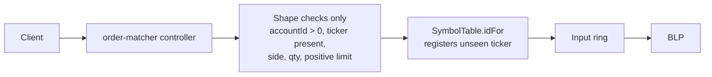
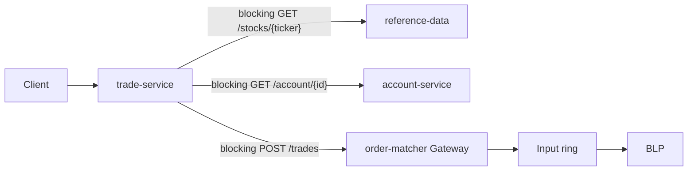
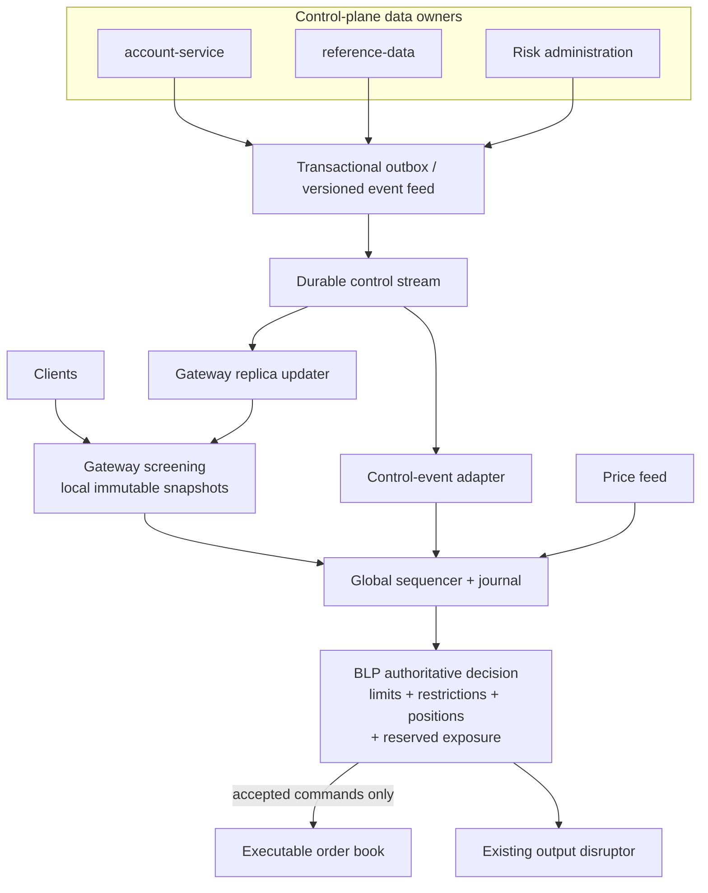

# TraderX In-Memory Risk and Gateway Replica Architecture

> **Status:** Architecture decision input; implementation has not started.
> **Base state:** `009b-lmax-sequencer-architecture` on `output-event-optimization`.
> **Recommended next state:** `in-memory-risk-gateway`.
> **Scope:** Producer-side validation before an order becomes executable. The output disruptor is unchanged.

## 1. Decision summary

TraderX should replace producer-path REST validation with two layers of local state:

1. **Gateway screening replicas** reject structurally invalid, unknown, disabled, stale, oversized, or obviously
   over-limit commands without a network lookup.
2. **BLP authoritative risk state** makes the final deterministic decision in global sequence order using exact
   positions, open-order reservations, limits, restrictions, and the last accepted market-data state.

The Gateway is an optimization and an availability boundary. It is not the final authority for aggregate exposure.
With more than one Gateway, independently updated caches can both admit commands against the same remaining limit.
Only the single-writer BLP can atomically check and reserve exposure without a lock or remote coordination hop.

A command that passes Gateway screening is sequenced and journaled as `ORDER_SUBMITTED`. The BLP then emits exactly
one of `OrderAccepted` or `OrderRejected`. A rejected command never enters the executable order book and never produces
a market-facing output. Keeping the rejected command in the journal provides the required audit trail.

## 2. Current path, verified against `009b`

### 2.1 Order entry (`order-matcher` REST API)

`OrderMatcherService.validateCreateRequest` validates only payload shape and numeric ranges. It does not establish that
the account exists, that the account may trade the security, or that the ticker is in reference data. `SymbolTable.idFor`
registers an unseen ticker on first use. Therefore an arbitrary non-empty ticker and any positive account number can enter
the sequenced flow.

### 2.2 Market-trade entry (`trade-service` REST API)

The `009b` trade-service makes two synchronous validation calls and one synchronous forwarding call. A dependency outage,
timeout, connection-pool stall, or slow database query is therefore directly on admission latency. The comment describing
the forward as fire-and-forget is inaccurate at the transport level: `RestTemplate.postForEntity` waits for an HTTP response.

### 2.3 Price path

Price ticks reach `OrderMatcherService.onPriceTick`, update an edge read model, and are then sequenced as `PRICE_TICK`.
The BLP has exact last-sequenced prices, but no explicit source timestamp, freshness deadline, trading-status state, or
policy for missing/stale prices. A `TRADE_NEW` without a price is currently booked at zero.

### 2.4 Existing local state

`009b` already has useful pieces, but not the replica substrate required by FR-09B12:

| Existing state | Current use | Gap |
| --- | --- | --- |
| `SymbolTable` | Edge ticker-to-id conversion | Learns from untrusted commands; not reference-data-authoritative |
| `lastPxBySecurity` | BLP matching and trade price | No freshness/status metadata; zero fallback is unsafe for risk |
| BLP positions | Exact single-writer position state | No limits, reservations, buying power, or risk decision |
| Output-fed read model | REST queries and UI parity | Query model is not safe as command authority |

## 3. Validation inventory and ownership

| Validation | Gateway screen | BLP authority | Required local state |
| --- | --- | --- | --- |
| Schema, enum, positive quantity/price | Yes | Defensive invariant | None |
| Request authentication and account entitlement | Yes | Yes | account status + principal-to-account entitlement |
| Known/enabled security | Yes | Yes | security master + trading status |
| Trading halt/restriction | Yes | Yes | security/account restriction sets |
| Single-order quantity and notional cap | Yes | Yes | risk policy + reference price |
| Price collar / fat-finger check | Yes | Yes | last price + source time + collar policy |
| Duplicate submission | Best-effort | Yes | `clientOrderId` idempotency state |
| Account/customer aggregate credit limit | Indicative | Yes | limits + exact used/reserved exposure |
| Position/concentration limit | Indicative | Yes | positions + open-order reservations + limits |
| Global kill switch | Yes | Yes | versioned control state |

Gateway rejection saves capacity. BLP rejection establishes correctness. The BLP must repeat every mutable or
aggregate-dependent check because Gateway state is a replica and may lag.

## 4. Target topology

Account, reference, restriction, limit, kill-switch, and price changes that can affect a decision must be represented as
versioned events. The BLP applies those events in the same global sequence as commands. The journal therefore contains
the exact policy and market state used for each decision, making replay deterministic.

Gateway replicas consume the durable control stream directly for early screening. They are not used to reconstruct the
BLP. The BLP recovers from its own snapshot plus the globally ordered input journal.

## 5. Replica inventory and freshness model

Freshness must be defined by source version/watermark, not only by wall-clock TTL. A TTL detects silence but cannot prove
that all updates were received.

| Replica/state | Owner | Startup | Freshness rule | Miss/stale behavior |
| --- | --- | --- | --- | --- |
| Security master (`securityId`, ticker, enabled) | reference-data | Snapshot + watermark, then buffered deltas | Monotonic source version; stream connected | Reject unknown/disabled; Gateway not ready before complete snapshot |
| Trading status / halts | reference/risk control | Snapshot + deltas | Version plus heartbeat deadline | Fail closed for affected or all securities when status cannot be proven |
| Account status | account-service | Snapshot + watermark, then deltas | Monotonic account version | Reject unknown, closed, suspended, or stale account |
| Principal entitlement | account-service | Snapshot + deltas | Monotonic entitlement version | Reject when missing/stale; never trust request `accountId` alone |
| Risk limits and restrictions | risk administration | Snapshot + deltas | Versioned, effective sequence/time, operator provenance | Fail closed when absent/stale; retain last valid version only under explicit policy |
| Kill switches | risk administration | Snapshot + high-priority deltas | Versioned and acknowledged by every admission node | Reject while active; node not ready until synchronized |
| Last price / reference price | price stream | Live warm-up or persisted snapshot plus live catch-up | Exchange/source timestamp and max-age policy | Reject price-dependent commands if missing/stale; never substitute zero |
| Positions | BLP | BLP snapshot + journal replay | Exact at current BLP sequence | Gateway copy is indicative only; BLP state is authoritative |
| Open-order reserved exposure | BLP | BLP snapshot + journal replay | Exact at current BLP sequence | Must be checked and reserved atomically with acceptance |
| Idempotency keys | BLP | BLP snapshot + journal replay | Retention window expressed in sequence/time events | Return prior decision for duplicate `clientOrderId` |

### Snapshot/delta handoff

For each external replica:

1. Subscribe and buffer deltas.
2. Fetch a complete snapshot carrying source watermark `W`.
3. Install the snapshot atomically.
4. Apply buffered events with version greater than `W` in order.
5. Mark ready only after reaching the stream's observed high watermark.

An unversioned `GET all` followed by best-effort NATS subscription has a race and is not an acceptable warm-up protocol.

## 6. BLP risk state and decision

The BLP should own preallocated primitive state keyed by numeric identifiers:

- account status and entitlement bitsets;
- security status and restriction bitsets;
- per-account and platform credit/notional limits;
- per-security quantity/notional/concentration limits;
- current position and cost basis (already present);
- reserved buy/sell quantity and notional for open orders;
- last sequenced price and source timestamp;
- client-order-id idempotency index;
- global/account/security kill-switch flags;
- active risk-policy version.

For `ORDER_SUBMITTED` at sequence `N`, the BLP performs checks in a stable order, computes worst-case incremental exposure,
and either:

- rejects with a stable reason code and the policy/data versions used; or
- atomically reserves exposure, inserts the order, and emits `OrderAccepted`.

Fills move exposure from reserved to executed position. Cancel/reject/expiry releases reservation. Policy changes do not
silently delete existing orders: a policy event must explicitly define whether violating resting orders are canceled.

## 7. Command contract

Every new order or market-trade command should carry:

- `clientOrderId` (required idempotency key);
- authenticated `principalId` or a trusted entitlement token resolved at the edge;
- `accountId`, `securityId`, side, quantity, order type, and limit price where applicable;
- Gateway-observed control watermark and price source timestamp for diagnostics;
- ingress timestamp and trace/correlation id.

The Gateway must not report final success before the BLP decision. Preserve the current synchronous REST shape where
possible by waiting on the existing response-event mechanism: accepted returns the existing success body; rejected returns
a stable 4xx risk response. If an asynchronous API is later required, return `202` with a command id rather than `200`
claiming that the trade was accepted.

## 8. Failure and degraded-mode rules

| Condition | Required behavior |
| --- | --- |
| Gateway replica not bootstrapped | Readiness false; reject admission with service-unavailable |
| Control stream disconnected beyond deadline | Readiness false; fail closed for new risk-increasing commands |
| Price missing/stale | Reject checks requiring reference price; allow only explicitly safe risk-reducing commands after policy exists |
| BLP recovering or behind journal high watermark | No admission until caught up and warmed |
| Input/output capacity exhausted | Bounded backpressure, then explicit overload response; never bypass checks |
| Limit/restriction event invalid or out of order | Quarantine update, alert, retain last proven version, and fail closed where correctness is uncertain |
| Gateway screen and BLP disagree | BLP wins; emit mismatch metric and audit event |
| Risk service/admin UI unavailable | Existing installed policy continues; no remote call from command path |

There is no general fail-open mode for risk-increasing orders. Any risk-reducing exception must be an explicit, tested rule,
not a generic stale-cache fallback.

## 9. Reference alignment

- Event Sourcing supports rebuilding memory images from ordered events and snapshots. External query results that affect a
  replay must themselves be retained as events; live re-query during replay would produce a different decision.
- CQRS supports a command-specific model separate from UI/reporting projections. The output-fed read model remains a query
  model and must not become the authoritative risk store.
- SEC Rule 15c3-5 is used here as a requirements baseline, not a claim that TraderX is production-compliant. It motivates
  automated pre-trade rejection for credit/capital thresholds, erroneous price/size and duplicate orders, restrictions,
  controlled policy adjustment, and auditable supervisory control.

References:

- Martin Fowler, [Event Sourcing](https://martinfowler.com/eaaDev/EventSourcing.html)
- Martin Fowler, [CQRS](https://martinfowler.com/bliki/CQRS.html)
- SEC, [Rule 15c3-5 final rule](https://www.sec.gov/rules/final/2010/34-63241.pdf)

## 10. State lineage recommendation

Create `in-memory-risk-gateway` with `previous: [009b-lmax-sequencer-architecture]` and keep it on the optional
architecture track. This is not a sibling of `009b`: it depends on the sequencer, journal, fused BLP positions, and response
events implemented there. It must not be called `010` because `010-kubernetes-runtime` already names the canonical branch
from `009`.

`in-memory-risk-gateway` scope:

- producer-side Gateway screening replicas;
- versioned account/reference/risk control feeds and warm-up protocol;
- authoritative BLP pre-trade decision and reservations;
- deterministic risk/control input events and rejection outputs;
- stable external contracts where correctness permits;
- readiness, staleness, audit, mismatch, and decision-latency observability.

Out of scope:

- output-disruptor redesign;
- portfolio analytics, VaR, margin optimization, or a separately deployed synchronous risk engine;
- changes to UI query projections unrelated to risk decisions;
- legal/compliance certification.

## 11. Spec and implementation order

Generate the TraderX state pack before code:

1. `spec.md`: functional/nonfunctional requirements and success criteria.
2. `research.md`: current code evidence and reference-derived decisions.
3. `data-model.md`: replica records, versions, reservations, policies, and decision audit.
4. `contracts/contract-delta.md`: command fields, control events, decision/reason codes, snapshot protocol.
5. `system/architecture.md`, runtime topology, subject map, and ADRs.
6. `plan.md`, `tasks.md`, `quickstart.md`, and generation hook.
7. Only then implement in vertical slices: reference/account replicas, BLP risk state, reservations/idempotency,
   risk policies, failure modes, observability, performance/no-GC gates, and end-to-end conformance.
