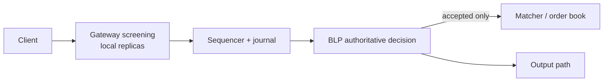

# TraderX In-Memory Risk Gateway Architecture

This document explains the implemented architectural model on branch `in-memory-risk-gateway` and how it fits into the existing `009b-lmax-sequencer-architecture` LMAX flow.

## Decision summary

TraderX keeps the BLP as the single-writer authority, but moves producer-path validation inputs into local in-memory replicas so admission does not depend on blocking remote service calls.

The design has two layers:

1. Gateway screening replicas reject obviously invalid, unauthorized, stale, disabled, or fail-closed requests before they consume sequencer capacity.
2. The sequenced BLP makes the final deterministic accept/reject decision using exact positions, reservations, limits, restrictions, policy, and price state.

The Gateway improves latency and availability. It is not the final authority for aggregate exposure. Only the single-writer BLP can atomically reserve risk and make the authoritative decision.

## How it fits into the LMAX flow

The order path becomes:

The operational meaning of each step is:

1. the client sends an order to the admission edge
2. the Gateway checks local in-memory state:
   account status, entitlement, security status, restriction state, kill switch, policy-derived caps, and price-derived screening
3. if the request fails those checks, it is rejected immediately and does not consume sequencer capacity
4. if it passes screening, it becomes a globally ordered input event
5. the BLP re-applies the authoritative deterministic checks in sequence order
6. the BLP either rejects the command or atomically reserves exposure and accepts it
7. only accepted commands reach the executable matcher/order book and produce downstream market-facing effects

Rejected commands remain in the journal for deterministic replay and audit, but do not produce market-facing side effects.

## Why the Gateway and BLP are both needed

The Gateway and BLP solve different problems.

The Gateway exists to:

- remove blocking remote validation calls from the hot path
- reject obviously bad requests early
- protect sequencer capacity
- fail closed when control-plane state is stale or missing

The BLP exists to:

- preserve single-writer deterministic correctness
- make exact aggregate-exposure decisions
- own reservations and releases for open orders
- ensure replay and recovery produce the same decisions

Two different Gateway nodes can both have locally valid views and still admit commands that would exceed an aggregate limit when combined. That is why the Gateway cannot be the final authority.

## Control-plane inputs

The feature depends on durable control-plane feeds rather than request-time remote lookups.

The relevant source domains are:

- account status
- principal/account entitlements
- security status
- policy
- restrictions
- kill switches

Those domains now publish versioned snapshots and deltas that the Gateway can consume into local replicas and that the matcher/BLP can consume into the deterministic control path.

## Recovery model

The branch implements recovery without turning external services into replay dependencies.

Recovery now uses:

- persisted snapshots of risk and matcher state
- restoration of the last applied global input sequence
- journal-tail replay through the BLP
- read-model rebuild during recovery
- suppression of replay-side external re-publication

That means restart recovery reconstructs the authoritative in-memory state locally and deterministically.

## Durability model

There are two separate durability concerns:

- control-plane durability:
  policy/restriction/kill-switch and security/status inputs are persisted by their owning services and emitted through durable publication paths
- sequenced-decision durability:
  the matcher/BLP persists snapshots and replays the journal tail so the authoritative decision state can be reconstructed exactly

This separation matters because the Gateway replicas are for screening, while the BLP/journal path is for final authoritative replay.

## Failure model

The design is fail-closed for risk-increasing commands.

Important behaviors:

- if Gateway replicas are not bootstrapped, readiness stays false
- if control feeds go stale or disconnect beyond the grace threshold, risk-increasing admission fails closed
- if a control gap or epoch mismatch is detected, the replica is invalidated and rebootstrap is required
- if a control event is malformed or out of contract, it is quarantined instead of applied silently
- if the Gateway and BLP disagree, the BLP wins

## Implemented architectural pieces on this branch

- durable policy/restriction/kill-switch source in account-service
- durable security/status source in reference-data
- control-stream consumption in the matcher/Gateway path
- snapshot installation and delta replay with gap/epoch handling
- sequenced BLP application of dynamic policy state
- full snapshot restoration and journal-tail replay
- warm follower image path
- production-oriented ACL/TLS/auth configuration templates
- recovery, latency, replica, and control metrics

## What remains open architecturally

The architecture itself is largely settled on this branch. The open items are mainly proof and acceptance items:

- full end-to-end smoke proof through all runtime channels
- full end-to-end proof of durable control propagation and enforcement
- final performance acceptance against the target budget

So the next teammate should treat this as an implementation-verification handoff, not as a greenfield architecture exercise.
