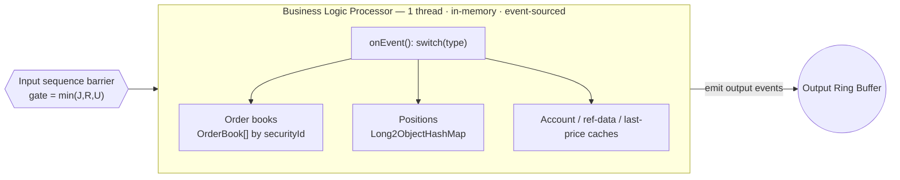
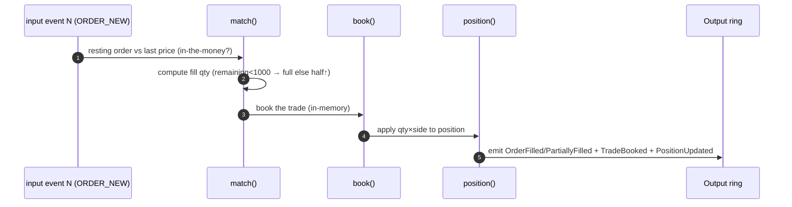

# TraderX — The Business Logic Processor (BLP): How It Works & What a Spec Needs (building on `009`)

> **Status:** Design proposal (companion to `LMAX-SEQUENCER-ARCHITECTURE.md`, `LMAX-INPUT-DISRUPTOR.md`).
> **Target state base:** `009-order-management-matcher`.
> **Scope of this doc:** the **Business Logic Processor** only — the single-threaded, in-memory,
> event-sourced engine that consumes the input disruptor, holds the order book + positions, and emits to the
> output disruptor. The input ring is covered in `LMAX-INPUT-DISRUPTOR.md`; the output ring in
> `LMAX-OUTPUT-DISRUPTOR.md`; allocation discipline in `LMAX-NO-GC-JAVA.md`.
> **Primary reference:** Martin Fowler, *The LMAX Architecture* — https://martinfowler.com/articles/lmax.html
> **Date:** 2026-06-09
> **Last code-sync:** 2026-06-12 — verbatim snippets verified against the `009b` overlay
> (`specs/009b-lmax-sequencer-architecture/generation/runtime-overrides/order-matcher/`); measured
> results in `LMAX-BENCHMARK-009-VS-009B.md`.

This document does two things:

1. **Part A** explains, in detail, **how the BLP works** — the single-thread/in-memory/event-sourced
   principles, the in-memory order book and position state, the `onEvent` dispatch, the fused
   match→book→position pipeline, the "no external calls" rule, determinism, output emission, and snapshot/
   replay — and exactly how it replaces the logic in state `009`'s `OrderMatcherService`.
2. **Part B** specifies **what a spec building off `009` would need** — the spec-kit artifacts and the
   concrete technical specs (data model, contracts, dependencies, config, observability, acceptance gates).

---

## Table of contents

**Part A — How the BLP works**
1. [Where it sits & what it is](#a1-where-it-sits--what-it-is)
2. [The four invariants](#a2-the-four-invariants)
3. [State held in memory](#a3-state-held-in-memory)
4. [The order book data structure](#a4-the-order-book-data-structure)
5. [The `onEvent` dispatch loop](#a5-the-onevent-dispatch-loop)
6. [Fused match → book → position](#a6-fused-match--book--position)
7. [No external calls: request/response events](#a7-no-external-calls-requestresponse-events)
8. [Determinism (the replay contract)](#a8-determinism-the-replay-contract)
9. [Emitting output events](#a9-emitting-output-events)
10. [Snapshot & replay](#a10-snapshot--replay)
11. [How this replaces `009`'s matcher logic](#a11-how-this-replaces-009s-matcher-logic)
12. [The code as implemented in state `009b`](#a12-the-code-as-implemented-in-state-009b)

**Part B — What a spec needs (building on `009`)**
13. [Proposed state & scope](#b13-proposed-state--scope)
14. [Spec-kit artifacts to author](#b14-spec-kit-artifacts-to-author)
15. [Functional requirement deltas](#b15-functional-requirement-deltas)
16. [Non-functional requirement deltas](#b16-non-functional-requirement-deltas)
17. [Data-model & contract deltas](#b17-data-model--contract-deltas)
18. [Build & dependency specs](#b18-build--dependency-specs)
19. [Configuration keys](#b19-configuration-keys)
20. [Observability deltas](#b20-observability-deltas)
21. [Success criteria & validation](#b21-success-criteria--validation)
22. [What `009` already gives you vs. what the state must add](#b22-what-009-already-gives-you-vs-what-the-state-must-add)
23. [Risks specific to the BLP](#b23-risks-specific-to-the-blp)

---

# Part A — How the BLP works

## A1. Where it sits & what it is

The BLP is the **single consumer** gated behind the input disruptor's sequence barrier. By the time an event
reaches it, that event is already **durable (journaled), replicated, and decoded**. The BLP's job is the
*actual trading logic*: match the order against the book, book the resulting trade, update the position, and
emit output events — **all on one thread, entirely in memory, between consuming event `N` and event `N+1`**.



The radical simplification vs. `009`: today, *"validate (trade-service) → publish → book (trade-processor)
→ match/auto-fill (order-matcher) → POST back to trade-service"* is a multi-process, multi-network-hop
dance. The BLP collapses that into **in-memory method calls on one thread**.

## A2. The four invariants

Everything about the BLP follows from four rules taken straight from the article:

1. **Single-threaded.** Exactly one thread runs the business logic. It is the **sole writer** of the order
   book and positions, so there are **no locks** — the `ReentrantLock` from `009` disappears entirely.
2. **In-memory.** "There is no database or other persistent store" on the hot path; current state lives in
   RAM and is **entirely derivable by replaying the input events**. MariaDB becomes a downstream
   read-model, not a dependency of the logic.
3. **Event-sourced.** State is a pure function of the ordered input stream. Same inputs ⇒ same state ⇒ same
   outputs, always.
4. **No external calls.** The BLP never makes a blocking call (no REST, no DB, no `RestTemplate`). Anything
   not in memory is resolved via an asynchronous request/response **event pair** (see [§A7](#a7-no-external-calls-requestresponse-events)).

## A3. State held in memory

The BLP owns a small set of long-lived, pre-allocated structures. None of these are allocated per event:

| State | Structure | Replaces in `009` |
| --- | --- | --- |
| Order books | `OrderBook[] booksBySecurity` (array indexed by `int securityId`) | `orderRepository` JPA queries (`findAllByOrderByUpdatedAtDesc().stream()...`) |
| Positions | `Long2ObjectHashMap<Position>` (Agrona, no boxing) | `position-service` round-trips |
| Last prices | `long[] lastPxBySecurity` (fixed-point) | `ConcurrentHashMap<String,BigDecimal> lastPrices` |
| Account cache | `Int2ObjectHashMap<Account>` | blocking `GET /account` from trade-service |
| Reference-data cache | `Int2ObjectHashMap<Security>` | blocking `GET /stocks` |
| Sequence/seqClock | plain `long` fields | `AtomicInteger nextOrderSequence`, `AtomicLong` counters |

The caches are **in-memory replicas** kept fresh off the input/output streams (or warmed at startup), so a
validation that `009` did with three blocking REST calls becomes an array/map lookup.

## A4. The order book data structure

A per-security order book is the core data structure. For TraderX's needs a simple, cache-friendly design
is enough:

- **Array indexed by `securityId`** to find the book — no `String` hashing, no map lookup.
- Each book holds **two price-ordered sides** (bids descending, asks ascending). For a limit book this is
  typically price levels each holding a FIFO of resting orders. For TraderX's demo-scale matcher (auto-fill
  against a market price, not a full crossing book) a flat, pre-sized array of resting orders per security
  with an index by `orderId` is sufficient.
- **Pre-sized and pooled.** Order entries are pooled objects (`blp.book.pool-size` pre-allocated at
  startup); nothing is `new`-ed mid-life. *Implementation status (state `009b`):* terminal orders are
  retained in the book rather than recycled — `009` parity requires cancel/force-fill of a completed
  order to return it unchanged — so steady state is allocation-free up to the pool size; recycling and
  book eviction arrive with the snapshot milestone (`T09B14`).
- **`long` fixed-point** for price/qty comparison; the in-the-money test from `009` becomes integer compare.

## A5. The `onEvent` dispatch loop

The BLP is a Disruptor `EventHandler`. Its entire surface is one method that switches on the event type and
returns quickly. No blocking, no allocation, no locks — this is the real `MatchingEngine.onEvent` from
state `009b` (`specs/009b-lmax-sequencer-architecture/generation/runtime-overrides/order-matcher/.../lmax/MatchingEngine.java`):

```java
public final class MatchingEngine implements EventHandler<InputEvent> {
    /** BatchEventProcessor start hook: runs on the BLP thread before the first event. */
    @Override
    public void onStart() {
        blpThreadId = Thread.currentThread().threadId();
    }

    @Override
    public void onEvent(InputEvent e, long sequence, boolean endOfBatch) {
        switch (e.type) {
            case InputEvent.TYPE_ORDER_NEW -> { ordersNew++; onNewOrder(e); }
            case InputEvent.TYPE_ORDER_CANCEL -> { ordersCancel++; onCancel(e); }
            case InputEvent.TYPE_FORCE_FILL -> { ordersForceFill++; onForceFill(e); }
            case InputEvent.TYPE_PRICE_TICK -> { priceTicks++; onPriceTick(e); }
            default -> { /* ignore unknown event types */ }
        }
        eventsProcessed++;
        lastEventTimeMillis = e.eventTimeMillis;
        // Release-store: publishes this event's plain counter/time writes to edge readers
        // without the full volatile-store fence on the BLP thread.
        BLP_SEQ.setRelease(this, sequence);
        metrics.recordBlpEventLatency(System.nanoTime() - e.ingressNanos);
    }
}
```

The counters are plain `long`s — single writer, so no `Atomic*` and no contention. They are published by
one release-store of `blpSeq` per event (the Disruptor `Sequence.set` idiom); edge readers acquire-load
`blpSeq` first, so the BLP pays no per-counter volatile fences. `endOfBatch` is the Disruptor's batching
hook: in `009b` it is exploited by the **Journaler** (one fsync per drained batch, see `Journaler.onEvent`),
so durability cost *falls* per event as load rises.

## A6. Fused match → book → position

In `009` these are three services; in the BLP they are three method calls on the same thread, sharing the
same memory, with no network or DB between them. For a new in-the-money order:



The fill **policy** is identical to `009` — in-the-money (`Buy: px ≤ limit`, `Sell: px ≥ limit`), remaining
`< 1000` fills full else half rounded up — but it runs as integer math on in-memory state instead of
`BigDecimal` over JPA rows, and the trade is **emitted as an event** rather than POSTed to trade-service.

## A7. No external calls: request/response events

The BLP must never block. If it genuinely needs something it doesn't have (it shouldn't, given the caches),
it does **not** call out — it emits a *request* output event, keeps processing later events, and the
*response* returns later as another **sequenced input event**:

```
BLP needs X  →  emit RequestX (output)  →  external service answers  →  ResponseX enters as input event N+k
```

This is the article's "split long-latency work into request/response events." It is initially unfamiliar but
makes error handling *easier*: a timeout or failure is just another event, not a tangled try/catch around a
blocking `RestTemplate` call. In TraderX, the booking step that `009` did via `POST /trade/` becomes an
emitted `TradeBooked` output event consumed asynchronously by the trade pipeline.

## A8. Determinism (the replay contract)

Event sourcing only works if the BLP is **deterministic**: replaying the same journal must reproduce
identical state and output, bit for bit. That forbids, on the hot path:

- **Wall-clock reads** — never call `Instant.now()` / `System.currentTimeMillis()` inside the BLP. Time is
  carried *in the event* (e.g., `ingressNanos` stamped at the Gateway). This replaces `009`'s pervasive
  `order.setUpdatedAt(Instant.now())`.
- **Unordered iteration** — no `HashMap`/`HashSet` iteration whose order can vary; use ordered/array
  structures (Agrona collections with deterministic iteration, or index by id).
- **Randomness / UUIDs** — order ids are derived deterministically from the sequence (the `009`
  `ord-013-%04d` scheme becomes a function of `seq`), not `UUID.randomUUID()`.
- **Concurrency nondeterminism** — there is one thread, so there is none; this is a benefit of the design.

Determinism is testable: capture a production journal, replay it in a clean process, assert identical state
and emitted events (see [§B21](#b21-success-criteria--validation)).

## A9. Emitting output events

The BLP's only output is to **write events into the output ring** — it is the *single producer* of that
ring. It does not serialize JSON, touch NATS, or write the DB; those happen downstream on the output
disruptor (see `LMAX-OUTPUT-DISRUPTOR.md`). The BLP emits typed events such as:

`OrderAccepted` · `OrderRejected` · `OrderPartiallyFilled` · `OrderFilled` · `OrderCanceled` ·
`TradeBooked` · `PositionUpdated`.

Each emit is a claim/write/publish into the output ring with **no allocation** — exactly the producer
protocol described for the input ring, but with the BLP as the sole writer.

## A10. Snapshot & replay

Because BLP state is a pure function of the journaled input stream:

- **Snapshot**: on the `snapshot.interval.ms` cadence (env `SNAPSHOT_INTERVAL_MS`; demo default 60 s, `0` =
  off) a scheduler sequences a `SNAPSHOT` marker; the BLP serializes its whole state — book, net positions,
  last prices, `nextOrderRef`/`tradeCounter` — on its own thread at that sequence point and writes
  `snapshot.dat` **atomically** (temp + rename), recording the journal byte offset (`coveredOffset`) the
  snapshot covers.
- **Recovery (after-failure startup)**: load the latest `snapshot.dat` and replay **only the journal tail
  after `coveredOffset`** (no snapshot ⇒ seed the initial book/positions and replay the whole journal), so
  restart time is bounded by the interval, not the lifetime journal. Two sources: `recovery.source=db`
  (default) warm-starts the live BLP from the persisted read-model and verifies snapshot+tail replay matches
  it in an isolated shadow engine; `recovery.source=journal` rebuilds the live BLP from snapshot+tail
  directly, needing no database. (A **JIT warm-up** replay before going live remains aspirational — see
  `LMAX-NO-GC-JAVA.md`.)
- **Diagnostics**: replay any production journal in a dev box to reproduce a bug deterministically.

## A11. How this replaces `009`'s matcher logic

| `009` mechanism (today) | BLP replacement |
| --- | --- |
| `@Scheduled(fixedDelay) runMatcherTick()` scanning all open orders | **Event-driven** `onEvent`; react to the specific order/price event. |
| `ReentrantLock orderMutationLock` around create/cancel/fill | **Single-thread, no lock** — the BLP is the sole writer. |
| `orderRepository.save(...)` / JPA queries per tick | In-memory order book; **DB write moves to the output read-model**. |
| `restTemplate.postForEntity(tradeServiceUrl, ...)` inside `submitTrade` | Emit `TradeBooked` output event — **no blocking REST**. |
| `lastPrices` `ConcurrentHashMap`, out-of-band `onPriceTick` | `PRICE_TICK` input event mutates a `long[]` last-price array. |
| `BigDecimal` math, `roundPrice`, `compareTo` | **`long` fixed-point** integer compares. |
| `Instant.now()` on every mutation | Time carried in the event; **no clock reads** in the BLP. |
| `nextOrderSequence` `AtomicInteger`, `AtomicLong` counters | Plain `long` fields (single thread, no atomics needed). |
| `position`/`account`/`stocks` via other services (REST) | In-memory caches; cache miss → request/response event. |

The **policy and lifecycle** (`NEW…REJECTED`, auto-fill thresholds) are preserved; only the *execution
model* changes.

## A12. The code as implemented in state `009b`

Verbatim from `MatchingEngine.java`
(`specs/009b-lmax-sequencer-architecture/generation/runtime-overrides/order-matcher/.../lmax/`). The book
structures are primitive arrays + a pooled free-list; the matching policy is `009`'s, in integer math:

```java
public final class MatchingEngine implements EventHandler<InputEvent> {
    private final OutputPublisher out;
    private final HotPathMetrics metrics;
    private final int fillFullThreshold;

    private RestingOrder[] ordersByRef;          // dense index: orderRef -> entry
    private final IntList[] openRefsBySecurity;  // per-security open-order index
    private final long[] lastPxBySecurity;       // long fixed-point; Px.NONE = unknown
    private RestingOrder freeList;               // pre-allocated pool (BLP thread only)

    private void onNewOrder(InputEvent e) {
        RestingOrder o = takeFromPool();
        o.orderRef = e.orderRef;
        o.accountId = e.accountId;
        o.securityId = e.securityId;
        o.side = e.side;
        o.quantity = e.qty;
        o.remaining = e.qty;
        o.limitPx = e.limitPx;
        o.status = RestingOrder.STATUS_NEW;
        o.lastExecPx = Px.NONE;
        o.lastFillQty = 0;
        o.createdAtMillis = e.eventTimeMillis;   // event-carried time, no clock read
        o.updatedAtMillis = e.eventTimeMillis;
        index(o);
        IntList refs = openRefs(e.securityId);
        refs.add(e.orderRef);

        long px = lastPxBySecurity[e.securityId];
        // Ack first: the REST create response is the NEW order, exactly as in 009.
        out.emitOrderUpdate(o, e.seq, OutputEvent.FLAG_CREATE, true, px, e.ingressNanos);

        // Event-driven matching: evaluate immediately instead of waiting for a poll tick.
        if (px != Px.NONE && isInTheMoney(o, px)) {
            autoFill(o, px, e, refs.size() - 1);
        }
    }

    private boolean isInTheMoney(RestingOrder o, long px) {
        return o.side == InputEvent.SIDE_BUY ? px <= o.limitPx : px >= o.limitPx;
    }

    private void autoFill(RestingOrder o, long px, InputEvent e, int openIndex) {
        autoFillAttempts++;
        int remaining = o.remaining;
        int fillQty = remaining < fillFullThreshold ? remaining : Math.max(1, (remaining + 1) / 2);
        applyFill(o, fillQty, px, false, e, px, openIndex);   // same policy as 009, integer math
        autoFillSuccess++;
    }
    // … applyFill drops the terminal order from its open index (O(1) at the hinted slot),
    // emits the order update + TradeBooked pair as ONE batched output-ring claim
    // (emitFillWithTrade: a single publish, a single consumer signal), and records match
    // latency.
}
```

In the demo profile, booking bridges to the existing trade pipeline **from the output ring**
(`TradeSubmitHandler`, off the acknowledgement path) rather than being fused in-memory — the strangler `P2`
boundary; see `generation/implementation-status.md` in the `009b` spec pack.

---

# Part B — What a spec needs (building on `009`)

Written in the repo's **spec-kit** idiom. Numbering mirrors `009`'s `+4` internal convention
(`009` ⇒ block `013`; this state ⇒ block `015`).

## B13. Proposed state & scope

**Proposed state:** `011-fused-blp-matching` — **Track:** `functional` — **Previous state:**
`010-input-disruptor-sequencer` (the input ring; see `LMAX-INPUT-DISRUPTOR.md`). Maps to the strangler
plan's **Phase 2**.

**Intent:** fuse `009`'s matching + `trade-processor` booking + `position-service` update into a **single
in-memory BLP thread**; replace blocking REST validations with **in-memory caches**; carry time in events;
emit typed output events instead of REST/DB writes — while preserving every external contract from `009`.

In scope: the single-thread `EventHandler`, the in-memory order book + positions + caches, request/response
event pattern for cache misses, determinism, snapshot/replay. Out of scope: the output ring internals
(state `012`), failover/DR (later), and the unchanged edge/UI/LGTM stack.

## B14. Spec-kit artifacts to author

Mirror `009`'s core artifact set under `specs/011-fused-blp-matching/`: `README.md`, `spec.md`, `plan.md`,
`requirements/functional-delta.md`, `requirements/nonfunctional-delta.md`, `contracts/contract-delta.md`,
`data-model.md`, `research.md`, `quickstart.md`, `system/architecture.md` + `architecture.model.json`,
`system/runtime-topology.md`, `system/adr-015-single-thread-in-memory-blp.md`,
`generation/generation-hook.md`, `tests/smoke/README.md`.

## B15. Functional requirement deltas

- **FR-01501** — Matching, trade booking, and position keeping SHALL execute on **one thread, in memory**,
  within the handling of a single input event.
- **FR-01502** — The BLP SHALL make **no blocking external calls** (no REST/DB); cache misses SHALL be
  resolved via asynchronous request/response events.
- **FR-01503** — Validation that `009` performed via REST (`account`, `stocks`, `price`) SHALL be served from
  **in-memory caches** kept fresh from the event streams.
- **FR-01504** — The `009` auto-fill policy (in-the-money; remaining `< 1000` full else half rounded-up) and
  lifecycle (`NEW…REJECTED`) SHALL be preserved exactly.
- **FR-01505** — The BLP SHALL be **deterministic**: no wall-clock reads, no unordered iteration, no RNG/UUID
  on the hot path; order ids and timestamps derive from the event/sequence.
- **FR-01506** — The BLP SHALL emit typed output events (`OrderAccepted|Rejected|PartiallyFilled|Filled|
  Canceled`, `TradeBooked`, `PositionUpdated`) rather than POSTing trades or writing the DB inline.
- **FR-01507** — State SHALL be recoverable via **snapshot + journal replay** to the last journaled sequence.
- **FR-01508** — External contracts from `009` (REST/WS responses, NATS subjects, payload shapes) SHALL be
  unchanged (the edge translates between them and BLP events).

## B16. Non-functional requirement deltas

- **NFR-01501 (latency)** — BLP business logic p99 `< 25 µs` (per `LMAX-SEQUENCER-ARCHITECTURE.md` §11).
- **NFR-01502 (no-GC)** — Zero steady-state allocation in the BLP; enforced by the no-GC conformance gate
  (see `LMAX-NO-GC-JAVA.md`).
- **NFR-01503 (determinism)** — Identical journal ⇒ identical state and output (replay test).
- **NFR-01504 (single-writer)** — No locks/atomics on the hot path; the BLP is the sole writer of book +
  positions.
- **NFR-01505 (recovery)** — Snapshot + replay restart within the agreed window (target `< 1 min`).
- **NFR-01506 (observability)** — Export BLP metrics (match latency, book depth, position count, queue lag,
  allocation rate); inherit `007` LGTM and remain convergence `C2`.

## B17. Data-model & contract deltas

**`data-model.md`:**
- In-memory **order book** per `securityId` (pooled resting-order entries), **position** map
  (`accountId×securityId → qty, avgPx`), **last-price** array, **account/ref-data** caches.
- **Snapshot** record: serialized books + positions + caches + reflected `seq`.
- `OrderBook` table: still persisted via the **output read-model** (see state `012`), not by the BLP.

**`contracts/contract-delta.md`:**
- **Internal output-event contract** (typed events listed above) — consumed by the output disruptor.
- **Request/response event contract** for cache misses (e.g., `AccountLookupRequest/Response`).
- **No OpenAPI/NATS changes** — external order/trade/position contracts from `009` preserved verbatim.

## B18. Build & dependency specs

The BLP module needs the no-GC building blocks (versions pinned to latest CVE-clean releases; the repo's
dependency CVE gate applies):

| Concern | Coordinate (illustrative) |
| --- | --- |
| Primitive/off-heap collections | `org.agrona:agrona:1.22.0` (`Int2ObjectHashMap`, `Long2ObjectHashMap`, `IntArrayList`) |
| Ring buffer (input consume + output produce) | `com.lmax:disruptor:4.0.0` |
| Binary codec (shared with input/output) | `uk.co.real-logic:sbe-tool:1.30.0` |
| Latency measurement | `org.hdrhistogram:HdrHistogram:2.2.2`; `org.openjdk.jmh:jmh-core:1.37` |

Java 21 / Spring Boot 3.5.14 as in `009`. Note: the BLP hot path itself is plain Java; Spring remains for
lifecycle/wiring/actuator only, never on the per-event path.

## B19. Configuration keys

| Key | Default | Purpose |
| --- | --- | --- |
| `blp.books.max-securities` | `4096` | Pre-size `OrderBook[]`. |
| `blp.book.pool-size` | `65536` | Pooled resting-order entries per book set. |
| `snapshot.interval.ms` (env `SNAPSHOT_INTERVAL_MS`) | `0` (compose demo `60000`) | Periodic full-state snapshot cadence in ms; `0` = off. |
| `recovery.source` (env `RECOVERY_SOURCE`) | `db` | Recovery mode: `db` (warm-start + journal-replay verify) or `journal` (snapshot+journal authoritative, no DB). |
| `output.projector.db.enabled` (env `OUTPUT_PROJECTOR_DB_ENABLED`) | `true` | `false` drops all DB writes (no-DB cutover, paired with `recovery.source=journal`). |
| `journal.replay.verify` | `true` | In `db` mode, verify journal replay reconstructs the warm-start state (shadow engine). |
| `blp.warmup.replay-events` | `100000` | Synthetic warm-up workload size for JIT before going live *(not yet wired)*. |
| `blp.cache.account.warm-on-start` | `true` | Pre-load account cache from read-model at startup *(not yet wired)*. |

`snapshot.dat` is written under `journal.path` (default `./data/journal`), the same durable volume as the
input journal, so the checkpoint survives container recreate, not just restart.

Removed from `009`: `order.matcher.tick-ms`, `order.matcher.price-service-url`,
`order.matcher.trade-service-url` (no more blocking REST from the matcher).

## B20. Observability deltas

| Metric | Type | Meaning |
| --- | --- | --- |
| `traderx_blp_event_latency_seconds` | histogram | `onEvent` processing latency (real, not `009`'s zero-filled placeholder). |
| `traderx_blp_book_depth{security=...}` | gauge | Resting orders per security. |
| `traderx_blp_positions_total` | gauge | Distinct positions held in memory. |
| `traderx_blp_cache_miss_total{cache=...}` | counter | Request/response events emitted for misses. |
| `traderx_blp_alloc_bytes_total` | counter | Steady-state allocation (**must stay ~0**). |
| `traderx_journal_write_latency_seconds` | histogram | Journaler append latency per sequenced event (implemented). |
| `traderx_input_gating_seq` | gauge | `min(journaled, replicated)` sequence gating the BLP (implemented). |

Existing `009` order metrics (`traderx_orders_open_total`, `…_events_total`) are retained, now sourced from
in-memory state. The `009` `traderx_order_match_latency_seconds` histogram (currently zero-filled) becomes a
**real** measurement here. Snapshot-write and recovery-replay durations are currently surfaced via log lines
(`JOURNAL-REPLAY VERIFY: PASS`, `LIVE RECOVERY [journal]`), not yet as
`traderx_blp_snapshot_seconds`/`traderx_blp_replay_seconds` metrics.

## B21. Success criteria & validation

- **SC-01501** — Functional parity with `009`: create/cancel/force-fill and auto-fill produce identical
  REST/WS responses and NATS events.
- **SC-01502 (penny parity)** — `long` fixed-point fills match `009`'s `BigDecimal` outcomes across a
  rounding fixture.
- **SC-01503 (determinism)** — Replay a captured journal in a clean process; assert identical BLP state +
  emitted events.
- **SC-01504 (no-GC gate)** — BLP hot-path test under `-XX:+UseEpsilonGC` sustains load without exhausting
  the heap (see `LMAX-NO-GC-JAVA.md`).
- **SC-01505 (latency)** — HdrHistogram report meets `NFR-01501` (p50/p99/p99.9/max).
- **SC-01506 (recovery)** — Snapshot + replay restores state to the last journaled sequence within the
  target window.
- **SC-01507 (no-blocking-calls)** — Static/architectural check asserts the BLP package has no `RestTemplate`/
  JPA/`Instant.now()` references on the hot path.
- **SC-01508 (`C2`)** — Demo-profile image builds, publishes to `ghcr.io/finos/traderx-c2/order-matcher`,
  and runs without core pinning.

## B22. What `009` already gives you vs. what the state must add

| Capability | `009` provides | New state must add |
| --- | --- | --- |
| Matching/auto-fill policy & lifecycle | ✅ (in `OrderMatcherService`) | re-cast as in-memory `onEvent` |
| Order/trade/position domain | ✅ | in-memory order book + position map |
| Trade pipeline (trade-service→processor→position) | ✅ | replace inline REST with emitted `TradeBooked` events |
| Validation data (account/stocks/price) | ✅ via REST | **in-memory caches** + request/response events |
| Single-thread, lock-free engine | ❌ (`ReentrantLock`, `@Scheduled`) | **build** |
| Deterministic, clock-free hot path | ❌ (`Instant.now()` everywhere) | **build** |
| Snapshot + replay recovery | ❌ | ✅ built in `009b` — periodic `snapshot.dat` + bounded journal-tail replay; `recovery.source=db` (verify) / `journal` (no-DB) |
| Typed output events | ❌ (direct NATS/JPA writes) | **build** (feeds state `012`) |

## B23. Risks specific to the BLP

| Risk | Mitigation |
| --- | --- |
| **Programming-model shift** ("no external calls") | Codify request/response patterns + examples; the article notes it is ultimately *easier* for error handling. |
| **Single-thread throughput ceiling** | LMAX hit ~6M orders/s on one thread — far beyond TraderX needs; shard by instrument later only if ever required. |
| **Stale in-memory caches** | Keep caches event-fed; warm at startup; treat misses as request/response events, never as blocking calls. |
| **Hidden non-determinism** (clock, `HashMap` order) | Determinism replay test (`SC-01503`); ban `Instant.now()` on the hot path (`SC-01507`). |
| **Loss of inline ACID DB write** | Journal is durable+replicated before the BLP acts; DB becomes a rebuildable read-model. |
| **Accidental allocation** | Epsilon-GC gate (`SC-01504`); see `LMAX-NO-GC-JAVA.md`. |

---

*Companion documents: `LMAX-SEQUENCER-ARCHITECTURE.md` (full redesign), `LMAX-INPUT-DISRUPTOR.md` (the input
ring feeding this BLP), `LMAX-OUTPUT-DISRUPTOR.md` (where this BLP's emitted events go), and
`LMAX-NO-GC-JAVA.md` (the allocation discipline this BLP must obey). This doc zooms into the **BLP** and the
spec work to introduce it on top of state `009-order-management-matcher`.*
