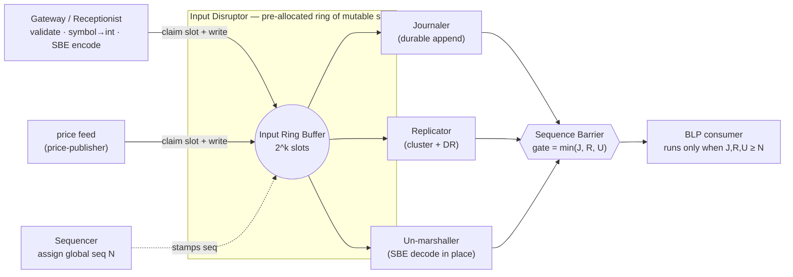
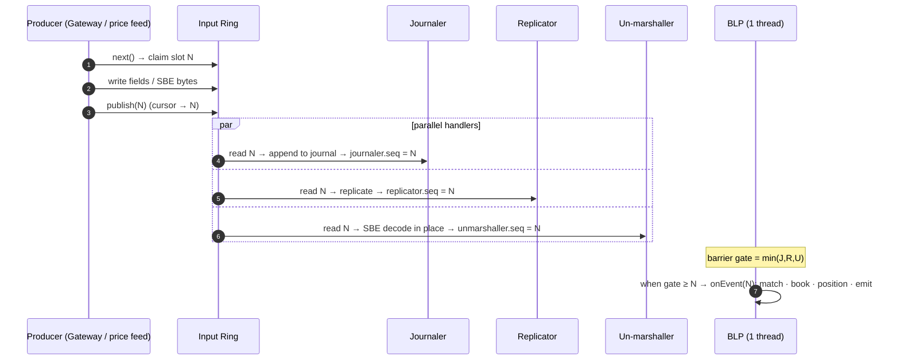

# TraderX — The Input Disruptor: How It Works & What a Spec Needs (building on `009`)

> **Status:** Design proposal (human-authored companion to `LMAX-SEQUENCER-ARCHITECTURE.md`).
> **Target state base:** `009-order-management-matcher`.
> **Scope of this doc:** the **input disruptor** stage only — the ring buffer that sits between the
> Gateway/Sequencer and the single-threaded Business Logic Processor (BLP). The output disruptor,
> failover, and the broader redesign are covered in `LMAX-SEQUENCER-ARCHITECTURE.md`.
> **Primary reference:** Martin Fowler, *The LMAX Architecture* — https://martinfowler.com/articles/lmax.html
> **Date:** 2026-06-09
> **Last code-sync:** 2026-06-12 — verbatim snippets verified against the `009b` overlay
> (`specs/009b-lmax-sequencer-architecture/generation/runtime-overrides/order-matcher/`); measured
> results in `LMAX-BENCHMARK-009-VS-009B.md`.

This document does two things:

1. **Part A** explains, in detail, **how the input disruptor works** — the ring buffer, the
   single-writer/multi-producer claim protocol, the three parallel input handlers (Journaler,
   Replicator, Un-marshaller), the sequence barrier that gates the BLP, wait strategies, batching,
   no-GC mechanics, and backpressure — and exactly how it replaces the internals of state `009`'s
   `order-matcher`.
2. **Part B** specifies **what a spec building off `009` would need** — the spec-kit artifacts
   (FR/NFR/contract/data-model/topology deltas in the repo's house style), plus the concrete
   technical specs: library coordinates, JVM flags, ring-sizing math, host/hardware requirements,
   configuration keys, observability, and acceptance criteria.

---

## Table of contents

**Part A — How the input disruptor works**
1. [Where it sits in the path](#a1-where-it-sits-in-the-path)
2. [Anatomy of the ring buffer](#a2-anatomy-of-the-ring-buffer)
3. [Producers & the claim protocol (single-writer, multi-producer)](#a3-producers--the-claim-protocol-single-writer-multi-producer)
4. [The three parallel input handlers](#a4-the-three-parallel-input-handlers)
5. [The sequence barrier: gating the BLP](#a5-the-sequence-barrier-gating-the-blp)
6. [Wait strategy — the latency dial](#a6-wait-strategy--the-latency-dial)
7. [Batching for free](#a7-batching-for-free)
8. [No-GC mechanics at the input stage](#a8-no-gc-mechanics-at-the-input-stage)
9. [Backpressure & ring-full behaviour](#a9-backpressure--ring-full-behaviour)
10. [Durability & recovery semantics](#a10-durability--recovery-semantics)
11. [One event, end to end through the input disruptor](#a11-one-event-end-to-end-through-the-input-disruptor)
12. [How this replaces `009`'s `OrderMatcherService`](#a12-how-this-replaces-009s-ordermatcherservice)
13. [The wiring as implemented in state `009b`](#a13-the-wiring-as-implemented-in-state-009b)

**Part B — What a spec needs (building on `009`)**
14. [Proposed state & scope](#b14-proposed-state--scope)
15. [Spec-kit artifacts to author](#b15-spec-kit-artifacts-to-author)
16. [Functional requirement deltas](#b16-functional-requirement-deltas)
17. [Non-functional requirement deltas](#b17-non-functional-requirement-deltas)
18. [Data-model & contract deltas](#b18-data-model--contract-deltas)
19. [Build & dependency specs](#b19-build--dependency-specs)
20. [JVM, host & hardware specs](#b20-jvm-host--hardware-specs)
21. [Ring-sizing math (worked example)](#b21-ring-sizing-math-worked-example)
22. [Configuration keys](#b22-configuration-keys)
23. [Observability deltas](#b23-observability-deltas)
24. [Success criteria & validation](#b24-success-criteria--validation)
25. [What `009` already gives you vs. what the state must add](#b25-what-009-already-gives-you-vs-what-the-state-must-add)
26. [Risks specific to the input stage](#b26-risks-specific-to-the-input-stage)

---

# Part A — How the input disruptor works

## A1. Where it sits in the path

The input disruptor is the **ingestion ring** of the LMAX hot path. Everything that can mutate trading
state — **new orders, cancels, force-fills, and price ticks** — is funnelled through one Gateway, stamped
with a **global sequence number** by the Sequencer, and written into a **single pre-allocated ring buffer**.
Three handlers read each slot **in parallel** (journal it, replicate it, decode it); only when all three
have passed a given sequence does the **BLP** (the single-threaded matching engine) get to act on it.



The key idea: the ring is the **only** point of contention, and it is contention-free by construction —
producers claim disjoint slots, consumers read by sequence, coordination is via **monotonic 64-bit
counters**, not locks.

## A2. Anatomy of the ring buffer

A Disruptor ring is a **fixed-size circular array of mutable "event holder" objects**, all allocated
**once at startup** and **reused forever**. Properties that matter:

- **Power-of-two capacity.** Size is `2^k`, so slot lookup is `sequence & (size − 1)` — a bitmask, no
  modulo, no branch. Choosing the size is a real spec decision (see [§B21](#b21-ring-sizing-math-worked-example)).
- **Slots are pre-filled with empty holders.** The ring is constructed with an `EventFactory`
  (`InputEvent::newInstance`) that allocates every slot up front. After startup the hot path **allocates
  nothing** — producers overwrite the fields of an existing holder.
- **The holder is a flyweight, not a DTO.** In the no-GC design each slot wraps an off-heap
  `UnsafeBuffer`; "writing the event" means writing bytes into that buffer via an SBE encoder, not
  constructing objects. (See [§A8](#a8-no-gc-mechanics-at-the-input-stage).)
- **Cursor + gating sequences.** The ring tracks one **publisher cursor** (highest published sequence)
  and a set of **gating sequences** (one per consumer). A producer may not overwrite a slot until every
  consumer that still needs it has moved past — that is what makes the buffer safe to wrap.

This is the real slot holder from state `009b`
(`specs/009b-lmax-sequencer-architecture/generation/runtime-overrides/order-matcher/.../lmax/InputEvent.java`):

```java
/**
 * Input-ring slot holder (one mutable instance per slot, allocated once at startup and
 * reused forever — NGC-01). Producers overwrite every relevant field in place; nothing is
 * allocated per event. Time is carried in the event (eventTimeMillis stamped at the
 * gateway) so the BLP never reads a clock (FR-09B14).
 */
public final class InputEvent {
    public static final byte TYPE_ORDER_NEW = 1;
    public static final byte TYPE_ORDER_CANCEL = 2;
    public static final byte TYPE_FORCE_FILL = 3;
    public static final byte TYPE_PRICE_TICK = 4;

    public static final byte SIDE_BUY = 0;
    public static final byte SIDE_SELL = 1;

    public long seq;              // global sequence number (the ring sequence)
    public byte type;
    public int orderRef;          // numeric part of the external ord-013-%04d id
    public int accountId;
    public int securityId;        // ticker mapped to int at the gateway
    public byte side;
    public int qty;
    public long limitPx;          // long fixed-point (x 1e6)
    public long priceTicks;       // for PRICE_TICK
    public long ingressNanos;     // System.nanoTime() at the gateway, for latency histograms
    public long eventTimeMillis;  // wall-clock stamped at the gateway (event-carried time)

    public static InputEvent newInstance() {
        return new InputEvent();
    }
}
```

## A3. Producers & the claim protocol (single-writer, multi-producer)

TraderX has **two producers** writing into the input ring: the **Gateway** (orders, cancels, force-fills
from the REST/WS edge) and the **price feed** (price ticks). Because there is more than one producer, the
ring is configured `ProducerType.MULTI`.

The claim protocol is a three-step, lock-free dance:

1. **Claim.** A producer calls `ringBuffer.next()`. This atomically advances a claim counter and returns
   the next free sequence `N`. If the slot `N` is still in use by a lagging consumer, `next()` **spins
   according to the wait strategy** until the slot frees — this is the ring's natural backpressure
   (see [§A9](#a9-backpressure--ring-full-behaviour)).
2. **Write.** The producer takes the holder at `N` (`ringBuffer.get(N)`) and mutates its fields / writes
   into its off-heap buffer **in place**. No allocation, no copy into a queue.
3. **Publish.** The producer calls `ringBuffer.publish(N)`. With multiple producers, an
   **availability ring** records that slot `N` is fully written, so consumers never read a half-written
   slot even when producer `B` publishes `N+1` before producer `A` finishes `N`.

> **Single-writer principle.** Each *slot* has exactly one writer at a time, and the **BLP is the sole
> writer of business state** (the order book and positions). The article's actor/queue prototype "spent
> more time managing queues than doing the real logic" precisely because queues need multiple writers; the
> Disruptor removes that by making the ring the single coordination primitive.

The **Sequencer** in TraderX collapses into this claim step: the sequence number returned by `next()`
**is** the global ordering number `N`. (In the multi-datacenter design Aeron Cluster owns the authoritative
sequence; for an in-node first cut the ring's own counter is the sequencer.)

## A4. The three parallel input handlers

This is the heart of "how the input disruptor works." The ring fans the **same** published sequence out to
three handlers that run **concurrently on their own threads**:

| Handler | Job | Why it's on the input ring | Failure meaning |
| --- | --- | --- | --- |
| **Journaler** | Append the raw event bytes to a durable log (Chronicle Queue mmap / Aeron Archive). | The journal is the source of truth for replay & recovery; it must capture every event **before** the BLP acts on it. | If it can't write, the event is not durable → the BLP must not be allowed to proceed. |
| **Replicator** | Ship the event to replica BLPs (other node in the DC + DR site). | Replicas must see the identical input stream to stay in lock-step for microsecond failover. | If replication stalls, followers fall behind → promotion would lose data. |
| **Un-marshaller** | Decode the SBE/flyweight bytes into the typed fields the BLP will read. | Decoding is CPU work that does **not** need to be serial with business logic, so it runs ahead in parallel. | If decode fails, the event is malformed and should be rejected, not matched. |

They are wired as a **parallel group**, not a chain. The real `009b` wiring
(`LmaxEngine.afterPropertiesSet`) currently runs two of the three — the un-marshaller stage arrives with the
SBE/flyweight milestone (`T09B12`), since typed-field holders need no separate decode step:

```java
// Input ring: journaler + replicator run in parallel; the BLP is gated behind both
// (sequence barrier), so every event it acts on is already durable and replicated.
inputDisruptor.handleEventsWith(journaler, replicator).then(matchingEngine);
```

Because they share no state and each only reads its own slot, they need no locks between them. They race
ahead independently; the BLP simply waits for the **slowest** of the three at each sequence.

## A5. The sequence barrier: gating the BLP

Each consumer publishes its own progress as a **`Sequence`** (a cache-line-padded `long`, `@Contended` to
avoid false sharing). The BLP sits behind a **sequence barrier** whose gate is the **minimum** of the three
upstream sequences:

```
BLP may process sequence N  ⇔  journaler.seq ≥ N  AND  replicator.seq ≥ N  AND  unmarshaller.seq ≥ N
```

So by the time the BLP touches event `N`, that event is **already durable, already replicated, and already
decoded**. This is the property that makes failover near-instant: a promoted follower is guaranteed to have
every input the leader ever acted on. In `009b` the gate is the two shipped handlers, and it is exported as
a live metric — `LmaxEngine.gatingSeq()` backs `traderx_input_gating_seq` in `/metrics`:

```java
public long gatingSeq() {
    return Math.min(journaledSeq(), replicatedSeq());
}
```



## A6. Wait strategy — the latency dial

How a consumer *waits* for the next sequence is the single biggest latency/CPU trade-off in the ring:

| Strategy | Behaviour | Latency | CPU cost | Use for |
| --- | --- | --- | --- | --- |
| `BusySpinWaitStrategy` | Tight spin on the sequence | **Lowest (ns wake-ups)** | Burns a whole core | BLP + Journaler on the perf profile |
| `YieldingWaitStrategy` | Spin a bit, then `Thread.yield()` | Low | High but yields | Replicator / non-critical consumers |
| `SleepingWaitStrategy` | Spin, yield, then `parkNanos` | Medium | Low | Background consumers |
| `BlockingWaitStrategy` | Lock + condition | Highest | Lowest | Demo / CI / laptop profile |

The aggressive target uses **busy-spin on the BLP and Journaler** (pinned to isolated cores) and yielding
elsewhere. The **demo/CI profile** uses `BlockingWaitStrategy` so the build doesn't peg every core — this
profile split is itself a spec item (see [§B22](#b22-configuration-keys)).

## A7. Batching for free

When the BLP falls behind under a burst, the barrier reports the **highest available sequence**, and the
consumer drains everything up to it in one tight loop. The handler is told `endOfBatch == true` on the last
event of the drained run, which lets it amortise per-batch costs (e.g., flush the journal once per batch,
publish output once). The counter-intuitive result from the article: **as load rises, per-event latency
falls**, because fixed costs are spread across the batch. No code change is needed — batching is inherent
to how the consumer reads the ring.

## A8. No-GC mechanics at the input stage

"No-GC" means **zero steady-state allocation**, so the collector never runs on the hot path. At the input
stage specifically:

- **Slots allocated once.** The `EventFactory` pre-fills all `2^k` holders at startup; nothing is `new`-ed
  per event thereafter.
- **Flyweight over off-heap.** Each slot wraps an Agrona `UnsafeBuffer`; the SBE encoder writes binary
  bytes directly into it. **The same bytes go on the wire, into the journal, and into the ring** — zero
  re-serialisation, zero intermediate objects. This directly replaces `009`'s Jackson `ObjectMapper`
  JSON parse/allocate per NATS message.
- **`long` fixed-point.** Prices/quantities are scaled `long`s (e.g. `187.250 → 187_250_000L`), not
  `BigDecimal`. Integer math is allocation-free and branch-light. Conversion to/from `BigDecimal`/`String`
  happens **only at the edges** (Gateway in, Projector out), never inside the ring or BLP.
- **Symbol → `int`.** The Gateway maps the ticker `String` to an `int securityId` once; the ring and BLP
  never see a `String`, so there is no string hashing/equality/allocation on the hot path. Order books are
  then plain arrays indexed by `securityId`.
- **Padded sequences.** `Sequence` counters are `@Contended` so the producer cursor and each consumer's
  sequence live on separate cache lines (no false sharing between the four busy threads).

> **Implementation status (state `009b`):** the flyweight/SBE slot is deferred with the un-marshaller
> stage (task `T09B12`). The shipped ring uses the typed-primitive-field `InputEvent` holder quoted in
> [§A2](#a2-anatomy-of-the-ring-buffer), which already achieves zero per-event allocation; the Journaler
> writes fixed 64-byte little-endian records through one reused direct `ByteBuffer`.

This discipline is **proven, not assumed**: hot-path tests run under **Epsilon GC**, which has no collector,
so any accidental steady-state allocation exhausts the heap and **fails the test** — implemented as
`AllocationGateTest` + the Gradle `noGcTest` task run by `pipeline/validate-no-gc-conformance.sh`
(see [§B24](#b24-success-criteria--validation)).

## A9. Backpressure & ring-full behaviour

The ring cannot grow. If producers outrun the slowest consumer for long enough to lap the buffer,
`ringBuffer.next()` **blocks/spins** on the claim until the gating consumer frees a slot. That is the
intended, bounded backpressure: latency degrades gracefully under overload instead of the system allocating
unbounded queue memory and eventually GC-thrashing (the failure mode of the current NATS/JSON path). Two
spec consequences:

- The ring must be **sized for the worst expected burst within the slowest handler's stall window**
  (see [§B21](#b21-ring-sizing-math-worked-example)).
- A **remaining-capacity gauge** must be exported so operators can see headroom before it hits zero
  (see [§B23](#b23-observability-deltas)).

## A10. Durability & recovery semantics

Because the BLP is gated behind the Journaler, the journal is a **complete, ordered record of every input
the BLP ever processed**. From that:

- **Snapshot + replay.** Periodically serialise BLP state plus the sequence it reflects. On restart, load
  the latest snapshot and replay journal events from that sequence forward — the article reports restart in
  **under a minute**.
- **Deterministic replay.** Because state is a pure function of the ordered input stream, replaying a
  captured production journal in a dev box reproduces any bug exactly. This requires the BLP to be
  **deterministic** (no wall-clock reads, no `HashMap` iteration order, no RNG on the hot path) — a testable
  contract (see [§B24](#b24-success-criteria--validation)).

## A11. One event, end to end through the input disruptor

A trader submits a buy limit order. Tracing it through the **input** stage only:

1. **Edge → Gateway.** REST/WS request hits the Gateway. It validates against **in-memory replicas** of
   reference data, accounts, and last prices (no blocking REST), maps `"IBM" → securityId=42`, converts
   `187.250 → 187_250_000L`, and stamps `ingressNanos`.
2. **Claim.** Gateway calls `ring.next()` → gets sequence `N` (this *is* the global ordering number).
3. **Write.** Gateway SBE-encodes the order into slot `N`'s off-heap buffer (`type=ORDER_NEW`,
   `securityId=42`, `side=BUY`, `qty`, `limitPx`, …). No allocation.
4. **Publish.** `ring.publish(N)`; the cursor advances to `N`.
5. **Parallel handling.** Journaler appends `N` to the durable log; Replicator ships `N` to the follower +
   DR; Un-marshaller decodes `N`'s bytes into typed fields. Each sets its sequence to `N` when done.
6. **Gate opens.** The barrier's gate becomes `min(J,R,U) = N`. The order is now **durable, replicated, and
   decoded**.
7. **Hand-off to BLP.** The BLP's `onEvent(slotN, N, endOfBatch)` fires. Everything past this point is the
   *business* logic (match, book, position, emit) and leaves via the **output** disruptor — out of scope for
   this document.

Price ticks follow the identical path with `type=PRICE_TICK`; the only difference is which producer claimed
the slot. Crucially, prices and orders are now **the same totally-ordered stream** (`N`, `N+1`, `N+2`),
which is what makes the BLP deterministic — replacing `009`'s out-of-band NATS price race mediated by a
`ReentrantLock`.

## A12. How this replaces `009`'s `OrderMatcherService`

State `009`'s `OrderMatcherService` is the concrete thing the input disruptor displaces. The mapping is
direct:

| `009` mechanism (today) | Input-disruptor replacement |
| --- | --- |
| `@Scheduled(fixedDelayString="${order.matcher.tick-ms:1000}") runMatcherTick()` — polls every ~1 s | **Event-driven**: every order/cancel/price tick is a sequenced ring event the BLP reacts to immediately. The `@Scheduled` poll is deleted. |
| `ReentrantLock orderMutationLock` guarding `createOrder` / `cancelOrder` / `forceFillOrder` / `tryAutoFill` | **Single-threaded BLP** is the only writer of the book → **no lock at all**. |
| `ConcurrentHashMap<String,BigDecimal> lastPrices` updated out-of-band by `onPriceTick(...)` | Price ticks become **ordered `PRICE_TICK` events** in the same ring; "last price" is plain BLP state, no concurrent map. |
| `BigDecimal` everywhere (`roundPrice`, `setScale`), `compareTo` for in-the-money | **`long` fixed-point** comparisons; `BigDecimal` only at the Gateway/Projector edges. |
| `restTemplate.postForEntity(tradeServiceUrl, …)` **inside** the match path (`submitTrade`) | Booking is **fused into the BLP** as an in-memory call; the trade is emitted as an **output event**, not a blocking REST hop. (Output stage — see the sequencer doc.) |
| `orderRepository.save(...)` (JPA/H2) on the hot path | Journal is authoritative; the `OrderBook` table becomes an **async read-model** fed downstream. *(Optionally deferred — see scope options in [§B14](#b14-proposed-state--scope).)* |
| `String security` flowing end-to-end; `findAllByOrderByUpdatedAtDesc().stream().filter(...)` per tick | `int securityId`; **array-indexed order book**; no per-tick stream allocation. |

## A13. The wiring as implemented in state `009b`

Verbatim from `LmaxEngine.java` and `MatchingEngine.java`
(`specs/009b-lmax-sequencer-architecture/generation/runtime-overrides/order-matcher/.../lmax/`):

```java
// 1) Construct the input ring (LmaxEngine.afterPropertiesSet): pre-allocate every slot,
//    MULTI producer (gateway commands + price ticks), wait strategy from config —
//    BlockingWaitStrategy in the demo profile, busyspin/yielding for the perf profile.
inputDisruptor = new Disruptor<>(InputEvent::newInstance, normalizeRingSize(inputRingSize),
    DaemonThreadFactory.INSTANCE, ProducerType.MULTI, waitStrategy(inputWaitStrategy));

// 2) Journaler + replicator in parallel, the BLP gated behind both via the sequence
//    barrier. (The un-marshaller joins the group when SBE lands — T09B12.)
inputDisruptor.handleEventsWith(journaler, replicator).then(matchingEngine);
inputDisruptor.start();
inputRing = inputDisruptor.getRingBuffer();
```

```java
// 3) Gateway producer path (LmaxEngine.execute) — claim/write/publish, with the ack
//    future registered against the claimed sequence BEFORE publishing (request/response
//    events), and publish in finally so a failed write never strands a slot.
private OrderSnapshot execute(byte type, int orderRef, int accountId, int securityId, byte side,
                              int quantity, long limitPx, long priceTicks) {
    long seq = claimInputSlot();   // lock-free tryNext; counted waiting fallback when the
                                   // ring is full (FR-09B07 backpressure metric)
    CompletableFuture<OrderSnapshot> ack = readModel.registerAck(seq);
    try {
        InputEvent e = inputRing.get(seq);
        e.seq = seq;
        e.type = type;
        e.orderRef = orderRef;
        e.accountId = accountId;
        e.securityId = securityId;       // String -> int happened once, at the edge (SymbolTable)
        e.side = side;
        e.qty = quantity;
        e.limitPx = limitPx;             // BigDecimal -> long fixed-point happened at the edge (Px)
        e.priceTicks = priceTicks;
        e.ingressNanos = System.nanoTime();
        e.eventTimeMillis = System.currentTimeMillis();  // event-carried time
    } finally {
        inputRing.publish(seq);
    }
    try {
        return ack.get(ackTimeoutMs, TimeUnit.MILLISECONDS);
    } // … timeout/interrupt handling maps to 009's REST error semantics
}
```

```java
// The BLP consumer — single thread, no locks, zero steady-state allocation
public final class MatchingEngine implements EventHandler<InputEvent> {
    private RestingOrder[] ordersByRef;          // dense index: orderRef -> entry
    private final IntList[] openRefsBySecurity;  // per-security open-order index
    private final long[] lastPxBySecurity;       // long fixed-point; Px.NONE = unknown
    private RestingOrder freeList;               // pre-allocated pool (BLP thread only)

    @Override
    public void onEvent(InputEvent e, long sequence, boolean endOfBatch) {
        switch (e.type) {
            case InputEvent.TYPE_ORDER_NEW -> { ordersNew++; onNewOrder(e); }
            case InputEvent.TYPE_ORDER_CANCEL -> { ordersCancel++; onCancel(e); }
            case InputEvent.TYPE_FORCE_FILL -> { ordersForceFill++; onForceFill(e); }
            case InputEvent.TYPE_PRICE_TICK -> { priceTicks++; onPriceTick(e); }
            default -> { /* ignore unknown event types */ }
        }
        eventsProcessed++;
        lastEventTimeMillis = e.eventTimeMillis;
        // Release-store: publishes this event's plain counter/time writes to edge readers
        // without the full volatile-store fence on the BLP thread.
        BLP_SEQ.setRelease(this, sequence);
        metrics.recordBlpEventLatency(System.nanoTime() - e.ingressNanos);
    }
}
```

---

# Part B — What a spec needs (building on `009`)

This part is written in the repo's **spec-kit** idiom so it can be lifted into a real state pack. The
numbering convention mirrors `009` (which uses the internal `013` block: `FR-013xx`, `ord-013-…`,
`adr-013`). The next functional state would take the next block — shown here as **`014`** — but the exact
index should follow the state catalog when the pack is created.

## B14. Proposed state & scope

**Proposed state:** `010-input-disruptor-sequencer` — **Track:** `functional` — **Previous state:**
`009-order-management-matcher`.

**Intent:** introduce the **input disruptor** (ring + sequencer + parallel journaler/replicator/
un-marshaller + sequence-barrier gating) and re-cast `009`'s matching logic as the **single-threaded,
event-driven BLP consumer** gated behind it — while preserving every external contract from `009`
(REST/WS edge, NATS subjects, UI, Prometheus/Grafana).

Two scope options — pick one for the pack (recommend **Option A** to stay shippable, deferring
journal-authoritative storage to a later state, faithful to the strangler plan's Phase 1 → Phase 3 split):

| | **Option A — ring inside `order-matcher` (recommended first cut)** | **Option B — full input disruptor with authoritative journal** |
| --- | --- | --- |
| Ring + sequencer + single-thread BLP | ✅ | ✅ |
| Replace `@Scheduled` poll + `ReentrantLock` | ✅ | ✅ |
| `long` fixed-point + `int securityId` | ✅ | ✅ |
| Journaler handler | ✅ (write-behind journal, **DB still authoritative**) | ✅ (**journal authoritative**) |
| Replicator handler | optional / no-op stub | ✅ |
| `OrderBook` table | stays as-is (BLP thread still persists) | becomes **async read-model** via Projector |
| Failover / DR | out of scope | out of scope (later state) |
| Maps to strangler phase | **Phase 1 (+ journaler stub of Phase 3)** | **Phase 3** |

Out of scope either way: the output disruptor internals, replica/DR failover, account/position/people/
reference-data services, the Angular UI contract, and the LGTM stack — all carried forward unchanged from
`009`/`007`.

## B15. Spec-kit artifacts to author

Mirror `009`'s core artifacts (every file the generator and smoke gates expect):

- `specs/010-input-disruptor-sequencer/README.md` — pack summary, status, previous state.
- `spec.md` — user stories, FR/NFR, success criteria (see [§B16](#b16-functional-requirement-deltas)–[§B24](#b24-success-criteria--validation)).
- `plan.md` — scope, deliverables, exit criteria.
- `requirements/functional-delta.md`, `requirements/nonfunctional-delta.md`.
- `contracts/contract-delta.md` — **internal** input-event/journal contracts; external APIs unchanged.
- `data-model.md` — input event schema, journal record, sequence/snapshot model.
- `research.md`, `quickstart.md`.
- `system/architecture.md` + `system/architecture.model.json` — add ring/sequencer/journaler nodes.
- `system/runtime-topology.md` — startup/health order incl. journal warm-up & replay.
- `system/adr-014-input-disruptor-over-poll-and-lock.md` — ADR recording the poll+lock → ring decision
  (sibling to `adr-013`).
- `generation/generation-hook.md` + runtime overrides for the new `order-matcher` internals.
- `tests/smoke/README.md` — smoke path incl. allocation gate & determinism replay.

## B16. Functional requirement deltas

Author these in `spec.md` / `requirements/functional-delta.md` (illustrative IDs):

- **FR-01401** — All state-mutating inputs (order create/cancel/force-fill **and** price ticks) SHALL enter
  through a single sequenced input ring and be assigned a strictly monotonic global sequence number.
- **FR-01402** — The matcher SHALL be **event-driven**: the `@Scheduled` polling tick from `009`
  (`order.matcher.tick-ms`) SHALL be removed; orders react on event arrival.
- **FR-01403** — The matcher SHALL process input events on a **single thread** with **no application-level
  locks**; `orderMutationLock` SHALL be removed.
- **FR-01404** — Each input event SHALL be **journaled** before the BLP processes it (BLP gated behind the
  journaler's sequence).
- **FR-01405** — Prices SHALL be carried as **`long` fixed-point** internally and securities as
  **`int securityId`**; `BigDecimal`/`String` conversions SHALL occur only at the edge.
- **FR-01406** — The auto-fill policy semantics from `009` (in-the-money test; remaining `< 1000` fills full
  else half rounded-up) SHALL be **preserved bit-for-bit** under the new `long` math (penny-parity test).
- **FR-01407** — External contracts from `009` SHALL be unchanged: REST/WS order endpoints, NATS subjects
  (`/orders`, `/accounts/{accountId}/orders`), order payload shape, and admin actions behave identically.
- **FR-01408** — The system SHALL support **snapshot + journal replay** recovery, restoring matcher state to
  the last journaled sequence after restart.
- **FR-01409 (Option B)** — The `OrderBook` table SHALL become an **async read-model** projected off matcher
  output; the journal is the authoritative store.

## B17. Non-functional requirement deltas

- **NFR-01401 (latency)** — In-node compute (ring claim → BLP emit, excl. network/durability) p99 `< 150 µs`;
  BLP business logic p99 `< 25 µs`. (Budget per `LMAX-SEQUENCER-ARCHITECTURE.md` §11.)
- **NFR-01402 (no-GC)** — Steady-state hot path SHALL allocate **zero** bytes; enforced by an **Epsilon-GC
  allocation gate** in CI.
- **NFR-01403 (determinism)** — Given an identical journal, replay SHALL produce identical BLP state and
  output (no wall-clock/`HashMap`-iteration/RNG dependence on the hot path).
- **NFR-01404 (throughput)** — Sustain the demo load with bounded ring backpressure and no GC pause; report
  p50/p99/p99.9/max via HdrHistogram.
- **NFR-01405 (profiles)** — Provide a **demo/CI profile** (`BlockingWaitStrategy`, no core pinning) and a
  **performance profile** (`BusySpinWaitStrategy`, pinned isolated cores); default to demo for `C2`
  containers.
- **NFR-01406 (observability)** — Export input-stage metrics (ring remaining capacity, sequence lag,
  journal latency, allocation rate) to Prometheus and provision a Grafana panel set (see [§B23](#b23-observability-deltas)).
- **NFR-01407 (compatibility)** — Inherit `007` LGTM and `008` pricing/NATS contracts unchanged; remain
  convergence level `C2` with the existing GHCR publish gate.

## B18. Data-model & contract deltas

**`data-model.md` additions:**

- **Input event** (the ring slot / SBE message): `seq:long`, `type:byte` (`ORDER_NEW|ORDER_CANCEL|
  PRICE_TICK|FORCE_FILL`), `accountId:int`, `securityId:int`, `side:byte`, `qty:long`,
  `limitPx:long` (×1e6), `priceTicks:long`, `ingressNanos:long`.
- **Symbol table**: `ticker:String ↔ securityId:int` mapping owned by the Gateway.
- **Journal record**: append-only `(seq, type, raw SBE bytes, ingressNanos)`.
- **Snapshot**: serialized BLP state + the `seq` it reflects.
- `OrderBook` table: **unchanged (Option A)** or **demoted to read-model (Option B)**.

**`contracts/contract-delta.md` additions** (mostly **internal** seams; external surface unchanged):

- **SBE schema** (`order-input.xml`) defining the input message — generated into flyweights at build time
  (versioned `schemaId`/`version` for forward-compat).
- **Journal format** contract (Chronicle Queue / Aeron Archive layout, retention, roll policy).
- **No OpenAPI changes** — order REST/WS endpoints and NATS subjects from `009` are preserved verbatim.

## B19. Build & dependency specs

Add to the `order-matcher` Gradle module (currently `org.springframework.boot 3.5.14`,
`io.spring.dependency-management 1.1.7`, Java 21). Pin every version to the **latest CVE-clean release**;
the repo's generated-dependency CVE gate applies (cf. commit `de58b8f`).

| Concern | Coordinate (illustrative) | Notes |
| --- | --- | --- |
| Ring buffer | `com.lmax:disruptor:4.0.0` | 4.x targets Java 11+; fine on 21. |
| Off-heap + primitive collections | `org.agrona:agrona:1.22.0` | `UnsafeBuffer`, `Int2ObjectHashMap`, `Long2ObjectHashMap`. |
| Binary codec | `uk.co.real-logic:sbe-tool:1.30.0` (+ `sbe-all`) | Run the SBE generator as a Gradle task → flyweights in `build/generated`. |
| Durable journal | `net.openhft:chronicle-queue:5.25ea` **or** `io.aeron:aeron-archive:1.46.x` | Pick one; Chronicle is simplest for Option A. |
| Replication / consensus (Option B) | `io.aeron:aeron-cluster:1.46.x`, `io.aeron:aeron-driver` | Defer if Replicator is a stub in Option A. |
| Core pinning (perf profile) | `net.openhft:affinity:3.23.3` | Pin BLP/journaler to isolated cores. |
| Latency measurement | `org.hdrhistogram:HdrHistogram:2.2.2`; `org.openjdk.jmh:jmh-core:1.37` (+ annotation processor) | HdrHistogram in-app; JMH/JLBH for benches. |

**Build-time task:** an SBE codec-generation step (`generateSbe`) wired before `compileJava`, reading
`src/main/resources/sbe/order-input.xml`. This is a real, gateable artifact — the generated `MessageHeader`
+ encoder/decoder must exist for the build to pass.

## B20. JVM, host & hardware specs

**JVM flags (per profile):**

| Flag | Why | Profile |
| --- | --- | --- |
| `-Xms=-Xmx` (fixed heap) | No heap resize jitter | all |
| `-XX:+AlwaysPreTouch` | Fault in all pages at startup, not at runtime | all |
| `-XX:+UnlockExperimentalVMOptions -XX:+UseEpsilonGC` | No-op GC → any steady-state alloc fails fast | **CI alloc-gate test only** |
| `-XX:+UseZGC` (or Shenandoah) | Sub-ms pauses as a safety net | prod / perf |
| `-XX:+UseLargePages` / `-XX:+UseTransparentHugePages` | Fewer TLB misses | perf |
| `-XX:+UseNUMA` | NUMA-aware allocation | perf (multi-socket) |
| `-XX:StartFlightRecording=...` | JFR allocation profiling | validation |

**Host / hardware (performance profile only):**

- **Isolated cores** for busy-spin threads: kernel `isolcpus`, `nohz_full`, `rcu_nocbs` covering at least
  **2 cores** (BLP + Journaler); more if Replicator also busy-spins.
- **Reserved hugepages** sized to heap + off-heap journal mmap.
- **Low-latency NIC** (or loopback for single-node demo) for replication.
- **RAM** ≥ heap + (ring slots × slot buffer) + journal page cache (see [§B21](#b21-ring-sizing-math-worked-example)).

> **Container caveat (`C2`):** core pinning, `isolcpus`, and hugepages need host-level privileges that
> containerized demo deployments usually don't grant. The pack MUST ship a **demo profile** that runs
> correctly *without* these (blocking wait strategy, no pinning) so `C2` images stay runnable; the
> performance profile is documented for bare-metal benchmarking.

## B21. Ring-sizing math (worked example)

Ring capacity must be a power of two and large enough to absorb the worst burst within the **slowest
handler's stall window**:

```
slots_needed ≥ peak_input_rate (events/s) × max_handler_stall (s) × safety_factor
ring_size    = next_power_of_two(slots_needed)
```

Worked demo example: peak `~50,000 events/s`, journaler worst-case stall `~2 ms`, safety `×4`:

```
slots_needed = 50_000 × 0.002 × 4 = 400  → next_pow2 = 512 (2^9)
```

That is tiny; round **up** generously for headroom and cache behaviour → **`2^16 = 65,536`** for the demo,
**`2^20 = 1,048,576`** for the performance profile (the article ran a `20M`-slot input ring at exchange
scale). Memory cost ≈ `ring_size × (holder + off-heap slot buffer)`; at `2^20` slots × `256 B` ≈ `256 MB` —
pre-touched once at startup. The size is a single config key (`disruptor.input.ring-size`).

## B22. Configuration keys

New keys for the `order-matcher` module (with demo-safe defaults):

| Key | Default (demo) | Purpose |
| --- | --- | --- |
| `disruptor.input.ring-size` | `65536` | Power-of-two slot count. |
| `disruptor.input.wait-strategy` | `blocking` | `blocking` (demo/CI) / `yielding` / `busyspin` (perf). |
| `disruptor.input.producer-type` | `multi` | Gateway + price feed. |
| `journal.enabled` | `true` | Toggle the Journaler handler. |
| `journal.type` | `chronicle` | `chronicle` / `aeron-archive` / `file`. |
| `journal.path` | `./data/journal` | Durable log location. |
| `replication.enabled` | `false` | Option A stubs the Replicator. |
| `replication.endpoints` | `(empty)` | Replica/DR addresses (Option B). |
| `affinity.enabled` | `false` | Core pinning (perf profile only). |
| `affinity.blp-core` / `affinity.journaler-core` | `(unset)` | Pinned core ids. |
| `price.input.via-ring` | `true` | Route price ticks through the ring (vs `009`'s out-of-band NATS path). |

Remove from `009`: `order.matcher.tick-ms` (poll cadence) and the `@Scheduled` machinery.

## B23. Observability deltas

Add to `nonfunctional-delta.md` / `contracts/contract-delta.md` and provision Grafana panels (extends the
`009` order dashboards; Prometheus scrape is mandatory per `NFR-01308`):

| Metric | Type | Meaning |
| --- | --- | --- |
| `traderx_disruptor_input_remaining_capacity` | gauge | Free ring slots — backpressure headroom. |
| `traderx_input_published_seq` | gauge | Publisher cursor. |
| `traderx_input_gating_seq` | gauge | `min(journaler, replicator, unmarshaller)`. |
| `traderx_input_seq_lag` | gauge | `published − BLP_consumed` (how far the BLP is behind). |
| `traderx_journal_write_latency_seconds` | histogram | Journaler append latency. |
| `traderx_replication_ack_latency_seconds` | histogram | Replicator ack latency (Option B). |
| `traderx_input_events_total{type=...}` | counter | Per-type ingest counts. |
| `traderx_blp_alloc_bytes_total` | counter | Steady-state allocation (**must stay ~0**). |
| `traderx_input_backpressure_events_total` | counter | Times a producer waited for a free slot. |

Existing `009` metrics (`traderx_orders_open_total`, `…_events_total`, `…_match_latency_seconds`) are
retained and now sourced from the BLP. Grafana panels: ring headroom, sequence lag, journal/replication
latency percentiles, allocation-rate (alert if `> 0`).

## B24. Success criteria & validation

- **SC-01401** — Generation hook exists/runs (`pipeline/generate-state-010-input-disruptor-sequencer.sh`).
- **SC-01402** — Smoke path defined (`scripts/test-state-010-input-disruptor-sequencer.sh`).
- **SC-01403** — Functional parity: order create/list/cancel/force-fill and auto-fill behave identically to
  `009` (same REST/WS responses, same NATS events).
- **SC-01404 (penny parity)** — `long` fixed-point fills match `009`'s `BigDecimal` outcomes across a
  rounding fixture (no penny drift).
- **SC-01405 (no-GC gate)** — Hot-path test under `-XX:+UseEpsilonGC` completes a sustained run **without
  exhausting the heap**; CI fails on any steady-state allocation. Complement with JFR/async-profiler.
- **SC-01406 (determinism)** — Capture a journal, replay it in a clean process, assert **identical** BLP
  state and emitted events.
- **SC-01407 (latency)** — HdrHistogram report meets `NFR-01401` budgets (p50/p99/p99.9/max), not just mean.
- **SC-01408 (recovery)** — Snapshot + replay restores state to the last journaled sequence and restarts in
  under the agreed window.
- **SC-01409 (`C2`)** — Demo-profile container image builds, publishes to `ghcr.io/finos/traderx-c2/
  order-matcher`, and runs **without** core pinning / hugepages.

## B25. What `009` already gives you vs. what the state must add

| Capability | `009` provides | New state must add |
| --- | --- | --- |
| Order domain + lifecycle (`NEW…REJECTED`) | ✅ `OrderRecord`, `OrderStatus` | reuse as BLP in-memory state |
| Matching/auto-fill policy | ✅ in `OrderMatcherService` | re-cast as `EventHandler.onEvent` (no poll/lock) |
| Persistence (`OrderBook`/H2/JPA) | ✅ | keep (Opt A) or demote to read-model (Opt B) |
| NATS publish of order updates | ✅ `/orders`, `/accounts/{id}/orders` | move emission to BLP output; **contract unchanged** |
| Price awareness | ✅ from `008` (`onPriceTick`, `lastPrices`) | convert ticks into ordered `PRICE_TICK` ring events |
| Observability (LGTM, Prometheus, Grafana) | ✅ from `007`/`009` | add input-stage metrics + panels ([§B23](#b23-observability-deltas)) |
| `C2` build/publish + GHCR bundle | ✅ | extend for demo/perf profiles |
| Ring buffer, sequencer, journaler, barrier | ❌ | **build** (this state) |
| `long` fixed-point + `int securityId` | ❌ (`BigDecimal`/`String` today) | **build** |
| SBE codec + generation task | ❌ | **build** |
| No-GC discipline + Epsilon gate | ❌ | **build** |
| Snapshot + replay recovery | ❌ | **build** |

## B26. Risks specific to the input stage

| Risk | Mitigation |
| --- | --- |
| **Busy-spin pegs cores / unfriendly to `C2` containers** | Ship a demo profile (`BlockingWaitStrategy`, no pinning) as default; perf profile only on bare metal. |
| **Ring undersized → backpressure stalls** | Size per [§B21](#b21-ring-sizing-math-worked-example); export the remaining-capacity gauge and alert on low headroom. |
| **Journaler is the long pole** (durability dominates end-to-end latency) | Run it in parallel on its own (optionally pinned) thread; batch flush on `endOfBatch`. |
| **Non-determinism breaks replay** (wall-clock, `HashMap` order, RNG) | Determinism contract + replay test (`SC-01406`); capture `ingressNanos` at the edge, never read the clock in the BLP. |
| **`long` fixed-point penny drift vs `009`** | Fix the global scale (×1e6), centralise edge conversions, penny-parity fixture (`SC-01404`). |
| **SBE schema evolution** | Version `schemaId`/`version`; treat the journal as schema-versioned for forward replay. |
| **Hidden allocation slips onto the hot path** | Epsilon-GC gate in CI (`SC-01405`) turns any allocation into an immediate failure. |

---

*Companion document: `LMAX-SEQUENCER-ARCHITECTURE.md` (full hot-path redesign — Gateway, Sequencer,
BLP, output disruptor, journal, replication, failover, latency budget). This doc zooms into the **input
disruptor** stage and the spec work to introduce it on top of state `009-order-management-matcher`.*
