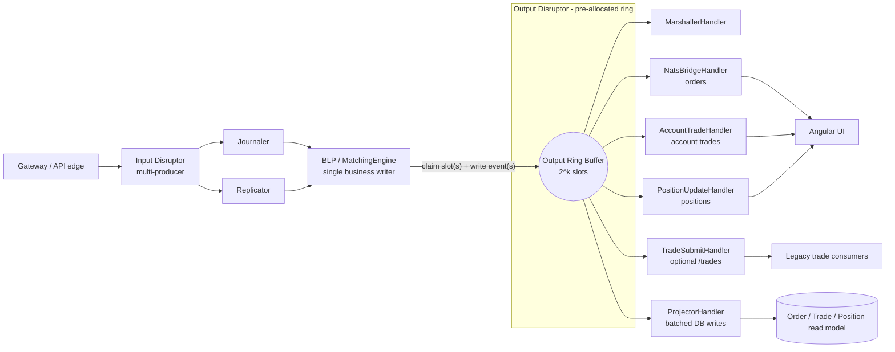

# TraderX - The Output Disruptor: How It Works & What the State Defines

> **Status:** Implemented in state `009b-lmax-sequencer-architecture`.
> **Scope of this doc:** the output disruptor only: the ring the BLP publishes into, typed output events,
> direct account-trade and position fan-out, order NATS bridging, optional `/trades` compatibility,
> async read-model projection, failure semantics, observability, and validation.
> **Primary reference:** Martin Fowler, *The LMAX Architecture* - https://martinfowler.com/articles/lmax.html
> **Last code-sync:** 2026-06-19, verified against the `009b` runtime override.

This document does two things:

1. **Part A** explains, in detail, how the output disruptor works in the implemented `009b` state: the BLP as
   sole producer, the pre-allocated output ring, typed output event holders, direct UI fan-out handlers, the
   async read-model projector, and why output side effects are off the user acknowledgement path.
2. **Part B** specifies what the state defines: source files, event contracts, subject contracts,
   configuration, observability, no-GC gates, validation commands, and operational risks.

---

## Table of contents

**Part A - How the output disruptor works**

1. [Where it sits & why it exists](#a1-where-it-sits--why-it-exists)
2. [Single-producer ring: the BLP writes, nobody else](#a2-single-producer-ring-the-blp-writes-nobody-else)
3. [Output event holders](#a3-output-event-holders)
4. [The parallel output handlers](#a4-the-parallel-output-handlers)
5. [NATS fan-out: preserving the UI contract](#a5-nats-fan-out-preserving-the-ui-contract)
6. [The async read-model projector](#a6-the-async-read-model-projector)
7. [Off the acknowledgement path](#a7-off-the-acknowledgement-path)
8. [Wait strategy & backpressure](#a8-wait-strategy--backpressure)
9. [No-GC at the output stage](#a9-no-gc-at-the-output-stage)
10. [One fill, end to end through the output disruptor](#a10-one-fill-end-to-end-through-the-output-disruptor)
11. [How this replaces inline publish + persist](#a11-how-this-replaces-inline-publish--persist)
12. [The code as implemented in state `009b`](#a12-the-code-as-implemented-in-state-009b)

**Part B - What the state defines**

13. [Implemented state & scope](#b13-implemented-state--scope)
14. [Spec-kit artifacts and source of truth](#b14-spec-kit-artifacts-and-source-of-truth)
15. [Functional behavior](#b15-functional-behavior)
16. [Non-functional behavior](#b16-non-functional-behavior)
17. [Data-model & contract deltas](#b17-data-model--contract-deltas)
18. [Build & dependency specs](#b18-build--dependency-specs)
19. [Configuration keys](#b19-configuration-keys)
20. [Observability deltas](#b20-observability-deltas)
21. [Success criteria & validation](#b21-success-criteria--validation)
22. [What the state includes](#b22-what-the-state-includes)
23. [Risks specific to the output stage](#b23-risks-specific-to-the-output-stage)

---

# Part A - How the output disruptor works

## A1. Where it sits & why it exists

The output disruptor is the egress ring of the LMAX hot path. The BLP, after processing a sequenced input
event, publishes typed business result events into a pre-allocated Disruptor ring. Output handlers consume
those events and perform side effects: order fan-out, account trade fan-out, account position fan-out,
optional `/trades` compatibility publishing, and batched read-model projection.

The important property is that output work is not on the gateway acknowledgement path. A command is
acknowledged after the input event is sequenced, journaled, replicated, and processed by the BLP. NATS
publishing and database projection happen afterward through the output ring.



## A2. Single-producer ring: the BLP writes, nobody else

The output ring has exactly one producer: the BLP. `LmaxEngine` creates the output Disruptor with
`ProducerType.SINGLE`, starts it before the input ring, and passes an `OutputPublisher` into
`MatchingEngine`.

The BLP-side emission mechanics make the matching thread the owner of trade booking, position keeping, and
paired output-ring publication. The output-disruptor implementation consumes that producer contract and
performs downstream output fan-out, projection, and failure handling.

The producer protocol is the standard Disruptor protocol:

1. claim one slot with `ring.next()` or a range with `ring.next(n)`
2. write fields directly into the pre-allocated `OutputEvent` slot(s)
3. publish the slot or range in a `finally` block

Order-only lifecycle output uses one slot. A fill uses three adjacent slots: order lifecycle, `TradeBooked`,
and `PositionUpdated`. A market trade uses two adjacent slots: `TradeBooked` and `PositionUpdated`.

## A3. Output event holders

Output slots are reusable mutable holders. They carry primitive state, ids, fixed-point prices, timestamps,
and flags. Output handlers can render UI payloads and database rows without reading BLP state.

Current event kinds:

| Kind | Meaning |
| --- | --- |
| `KIND_ORDER_ACCEPTED` | Order entered the in-memory book. |
| `KIND_ORDER_REJECTED` | Order was rejected before book entry. |
| `KIND_ORDER_PARTIALLY_FILLED` | Order received a partial fill. |
| `KIND_ORDER_FILLED` | Order is fully filled. |
| `KIND_ORDER_CANCELED` | Order was canceled. |
| `KIND_TRADE_BOOKED` | A fill or market trade was booked by the BLP. |
| `KIND_POSITION_UPDATED` | The account/security net position changed. |
| `KIND_ORDER_NOT_FOUND` | A cancel or force-fill referenced a missing order. |

The current `OutputEvent` fields are:

```java
public long inputSeq;
public byte kind;
public int flags;
public boolean publishNats;

public int orderRef;
public int accountId;
public int securityId;
public byte side;
public int quantity;
public int remainingQty;
public long limitPx;
public byte status;
public long lastExecPx;
public int lastFillQty;
public long createdAtMillis;
public long updatedAtMillis;
public long marketPx;

public int tradeQty;
public long tradeSeq;
public long tradePx;
public int positionQty;
public long positionAvgCostTicks;
public long averageCostBasisPx;
public long ingressNanos;
```

`ingressNanos` is carried from the input event so output egress latency can be recorded as
`System.nanoTime() - ingressNanos`.

## A4. The parallel output handlers

The output ring multicasts every event to independent handlers. Each handler owns a Disruptor consumer thread,
so NATS fan-out and projection progress in parallel rather than being serialized through one worker:

| Handler | Events | Responsibility |
| --- | --- | --- |
| `NatsBridgeHandler` | order lifecycle | Publishes `OrderResponse` payloads to order subjects. |
| `AccountTradeHandler` | `TradeBooked` | Publishes account-scoped trade payloads directly to `/accounts/{accountId}/trades`. |
| `PositionUpdateHandler` | `PositionUpdated` | Publishes account-scoped position payloads directly to `/accounts/{accountId}/positions`. |
| `TradeSubmitHandler` | `TradeBooked` | Optional compatibility publisher for `/trades`; disabled by default. |
| `ProjectorHandler` | order lifecycle, `TradeBooked`, `PositionUpdated` | Batches order, trade, and position rows into the durable read model. |

Direct account trade and position fan-out do not depend on a downstream trade processor. The UI receives
account-scoped trade and position updates from the output ring itself.

## A5. NATS fan-out: preserving the UI contract

The output handlers preserve the subjects consumed by the existing Angular UI:

| Output event | Subject(s) |
| --- | --- |
| order lifecycle events | `/accounts/{accountId}/orders`, `/orders` |
| `TradeBooked` | `/accounts/{accountId}/trades` |
| `PositionUpdated` | `/accounts/{accountId}/positions` |
| `TradeBooked` when compatibility publishing is enabled | `/trades` |

The BLP carries primitive ids and fixed-point ticks. Conversion happens at the output edge:

- `securityId` becomes a ticker symbol through `SymbolTable`
- fixed-point price ticks become `BigDecimal`
- output ring fields become `OrderResponse`, `AccountTrade`, or `PositionUpdate` payloads

The order subject bridge is isolated in `NatsBridgeHandler`. Account trade and position fan-out are isolated
in their own handlers, which makes failures and metrics specific to the side effect that failed.

## A6. The async read-model projector

`ProjectorHandler` consumes the same output events and writes the query model:

- order lifecycle events become `OrderRecord` rows
- `TradeBooked` events become `Trade` rows
- `PositionUpdated` events become `Position` rows

Projection is decoupled from the output ring: the on-ring handler only converts each event to a detached
row and enqueues it (O(1)) into a bounded queue (`output.projector.queue-capacity`); a separate
`projector-drain` thread batches the rows out to the database. Database latency therefore becomes bounded
queue depth, not output-ring backpressure. Trades are append-only and persist via one multi-row
`INSERT … ON CONFLICT (id) DO NOTHING` per flush (no per-row JPA `merge` SELECT, idempotent on replay);
order/position writes use Hibernate JDBC batching, and position projection deduplicates within a flush by
`(accountId, security)`. The persisted-`seq` watermark advances only after a committed flush.

The database is not the source of truth for the hot path. The BLP warms from the persisted read model on
startup, while the journal remains the event-stream authority for recovery and replay work.

## A7. Off the acknowledgement path

Output side effects are asynchronous to the user acknowledgement. The input side provides the durability
gate: a command enters the input ring, journaler and replicator consume it, and the BLP processes it after
both gates. The output ring then handles UI publishing and projection.

That separation keeps these operations off the ack path:

- order NATS publish
- account trade NATS publish
- position NATS publish
- optional `/trades` compatibility publish
- database projection

If an output handler fails, the BLP state and the journaled input event are not rolled back.

## A8. Wait strategy & backpressure

The output ring is bounded. If a downstream handler stalls, the ring eventually fills and the BLP is
backpressured on publication. That protects memory and keeps failure visible. The projector is the one
consumer whose database lag is absorbed first by its own bounded queue: only when that queue fills does
its enqueue block and the ring backpressure — a counted event (`traderx_projector_enqueue_blocks_total`),
never a dropped row.

Current output-related capacity and wait strategy are configurable:

- `disruptor.output.ring-size`
- `disruptor.output.wait-strategy`
- `output.projector.batch-size`
- `output.projector.queue-capacity`

The demo profile defaults to a container-friendly blocking strategy. Low-latency deployments can select a
more aggressive wait strategy once CPU pinning and runtime isolation are available.

## A9. No-GC at the output stage

The BLP-to-output-ring emission path is allocation-free in steady state:

- slots are pre-allocated
- event fields are primitive ids, flags, quantities, ticks, and timestamps
- the BLP does not allocate JSON, `String`, `BigDecimal`, or JPA entities while writing output events

The output handlers are also part of the matcher JVM hot path for GC purposes. They therefore use reused
payload objects, cached topics/ids/prices, and mutable date fields instead of allocating per event. The no-GC
gate measures both repeated single-event traffic and varied
account/security/order/trade/price values so cache misses remain visible.

Real NATS serialization, publisher internals, and database drivers may still allocate on their dedicated
consumer threads. Those allocations are outside the handler-local gate but share the matcher JVM heap:

- JPA entities for projection
- NATS client / JSON serialization internals
- database driver internals

The hot-path allocation gate is `./gradlew noGcTest` in the generated order-matcher service. It includes the
input/BLP/output topology gate and the focused output-handler allocation gate.

## A10. One fill, end to end through the output disruptor

A fill flows through the system as follows:

1. The gateway publishes an input event.
2. Journaler and replicator consume the input event.
3. The BLP runs after both durability gates.
4. `MatchingEngine` updates the order, books the trade, and updates the in-memory position book.
5. `OutputPublisher.emitFillWithTradeAndPosition(...)` writes three adjacent output slots:
   order lifecycle, `TradeBooked`, `PositionUpdated`.
6. `MarshallerHandler` updates in-memory acknowledgement/read-model state and records latency.
7. `NatsBridgeHandler` publishes order updates on its consumer thread.
8. `AccountTradeHandler` publishes the account trade update on its consumer thread.
9. `PositionUpdateHandler` publishes the account position update on its consumer thread.
10. `ProjectorHandler` asynchronously writes order/trade/position rows on its consumer thread.

The acknowledgement is not waiting for NATS publish or database projection.

## A11. How this replaces inline publish + persist

| Previous mechanism | Output-disruptor mechanism |
| --- | --- |
| Order service code publishes order updates directly from the command path. | BLP emits order lifecycle events; `NatsBridgeHandler` publishes `/accounts/{id}/orders` and `/orders`. |
| Trade and position UI updates depend on a downstream processing path. | BLP emits `TradeBooked` and `PositionUpdated`; dedicated output handlers publish `/accounts/{id}/trades` and `/accounts/{id}/positions` directly. |
| Persistence happens inline with business mutation. | `ProjectorHandler` batches DB writes off the hot path. |
| Publish failures are mixed with command handling. | Each output handler owns its failure counter and logs its own side-effect failures. |

## A12. The code as implemented in state `009b`

The output ring is wired in `LmaxEngine`:

```java
MarshallerHandler marshaller = new MarshallerHandler(readModel, symbols, metrics);
NatsBridgeHandler natsBridge = new NatsBridgeHandler(orderPublisher, symbols, readModel);
AccountTradeHandler accountTrade = new AccountTradeHandler(accountTradePublisher, symbols, readModel);
PositionUpdateHandler positionUpdate = new PositionUpdateHandler(positionPublisher, symbols, readModel);
ProjectorHandler projector = new ProjectorHandler(orderRepository, positionRepository, jdbcTemplate,
    symbols, projectorBatchSize, projectorQueueCapacity, metrics);   // trades via JdbcTemplate ON CONFLICT
// projector.start() launches the drain thread (decoupled async DB writes); started with the output ring

if (legacyTradeSubmitEnabled) {
    TradeSubmitHandler tradeSubmit = new TradeSubmitHandler(tradePublisher, symbols, readModel);
    outputDisruptor.handleEventsWith(marshaller, natsBridge, accountTrade, positionUpdate,
        tradeSubmit, projector);
} else {
    outputDisruptor.handleEventsWith(marshaller, natsBridge, accountTrade, positionUpdate, projector);
}
```

The implemented source files live under:

```text
specs/009b-lmax-sequencer-architecture/generation/runtime-overrides/order-matcher
```

---

# Part B - What the state defines

## B13. Implemented state & scope

The implemented state is `009b-lmax-sequencer-architecture`. It defines the output-side behavior that
consumes the BLP's typed output events and fans them out directly to the UI subjects.

In scope:

- explicit output lifecycle event handling
- direct account trade fan-out
- direct position fan-out
- order subject bridge
- optional `/trades` compatibility publishing
- async order/trade/position projection
- output-side failure counters
- output-side tests
- updated 009b overlay patch


## B14. Spec-kit artifacts and source of truth

The durable source of truth is:

```text
specs/009b-lmax-sequencer-architecture/generation/runtime-overrides/order-matcher
specs/009b-lmax-sequencer-architecture/generation/patches/0001-state-overlay.patch
```

Primary output-disruptor files:

- `src/main/java/finos/traderx/ordermatcher/lmax/OutputEvent.java`
- `src/main/java/finos/traderx/ordermatcher/lmax/OutputPublisher.java`
- `src/main/java/finos/traderx/ordermatcher/lmax/LmaxEngine.java`
- `src/main/java/finos/traderx/ordermatcher/lmax/MatchingEngine.java`
- `src/main/java/finos/traderx/ordermatcher/lmax/MarshallerHandler.java`
- `src/main/java/finos/traderx/ordermatcher/lmax/OutputValueCache.java`
- `src/main/java/finos/traderx/ordermatcher/lmax/AccountTopicCache.java`
- `src/main/java/finos/traderx/ordermatcher/lmax/NatsBridgeHandler.java`
- `src/main/java/finos/traderx/ordermatcher/lmax/AccountTrade.java`
- `src/main/java/finos/traderx/ordermatcher/lmax/AccountTradeHandler.java`
- `src/main/java/finos/traderx/ordermatcher/lmax/PositionUpdate.java`
- `src/main/java/finos/traderx/ordermatcher/lmax/PositionUpdateHandler.java`
- `src/main/java/finos/traderx/ordermatcher/lmax/TradeSubmitHandler.java`
- `src/main/java/finos/traderx/ordermatcher/lmax/ProjectorHandler.java`
- `src/main/java/finos/traderx/ordermatcher/lmax/InMemoryOrderReadModel.java`
- `src/main/java/finos/traderx/ordermatcher/config/PubSubConfig.java`
- `src/main/java/finos/traderx/ordermatcher/service/OrderMatcherService.java`
- `src/test/java/finos/traderx/ordermatcher/lmax/OutputDisruptorHandlersTest.java`
- `src/test/java/finos/traderx/ordermatcher/lmax/OutputHandlerAllocationGateTest.java`
- `src/test/java/finos/traderx/ordermatcher/lmax/OutputHandlerAllocationAttributionTest.java`
- `src/test/java/finos/traderx/ordermatcher/lmax/OutputHandlerLatencyBenchmarkTest.java`
- `src/test/java/finos/traderx/ordermatcher/lmax/LmaxEndToEndLatencyBenchmarkTest.java`

## B15. Functional behavior

The state defines these output behaviors:

1. Order lifecycle events publish to `/accounts/{accountId}/orders` and `/orders`.
2. `TradeBooked` publishes directly to `/accounts/{accountId}/trades`.
3. `PositionUpdated` publishes directly to `/accounts/{accountId}/positions`.
4. Optional `/trades` compatibility publishing is controlled by `output.legacy-trades.enabled`.
5. `ProjectorHandler` writes order, trade, and position rows asynchronously.
6. Output publish failures are logged and counted without stopping unrelated handlers.
7. The gateway acknowledgement path does not wait for NATS publish or projection.

## B16. Non-functional behavior

The output stage keeps these non-functional properties:

- single producer: only the BLP writes output ring slots
- bounded memory: output ring capacity controls backpressure
- no allocation on the BLP-to-output-ring emit path in steady state
- no per-event allocation in measured output handlers after warm-up
- external NATS serialization and database drivers run behind a bounded, observable handoff
- latency observability records egress timing from `ingressNanos`
- output failures are isolated by handler and counter

## B17. Data-model & contract deltas

New or changed output payloads:

| Payload | Source event | Subject |
| --- | --- | --- |
| `OrderResponse` | order lifecycle event | `/accounts/{accountId}/orders`, `/orders` |
| `AccountTrade` | `TradeBooked` | `/accounts/{accountId}/trades` |
| `PositionUpdate` | `PositionUpdated` | `/accounts/{accountId}/positions` |
| `TradeOrder` | `TradeBooked` | `/trades`, only when compatibility publishing is enabled |

Projection writes:

- `OrderRecord` from order lifecycle output
- `Trade` from `TradeBooked`
- `Position` from `PositionUpdated`

The UI subject names remain stable. The change is the producer of account trade and position updates: they
now come directly from output-ring handlers.

## B18. Build & dependency specs

The output disruptor uses the dependencies already present in the generated 009b order-matcher service:

- LMAX Disruptor
- Spring Boot
- Spring Data repositories
- TraderX `Publisher<T>` abstraction
- existing generated model/repository classes

Do not run Gradle from the runtime override directory. The override directory is not a complete service. Run
Gradle from:

```text
generated/code/target-generated/order-matcher
```

## B19. Configuration keys

| Key | Default | Meaning |
| --- | --- | --- |
| `disruptor.output.ring-size` | `65536` | Output ring size, normalized to a power of two. |
| `disruptor.output.wait-strategy` | `blocking` | Output consumer wait strategy for the demo profile. |
| `output.projector.batch-size` | `500` | Projector drain flush threshold (rows per DB write). |
| `output.projector.queue-capacity` | `1000000` | Bounded decoupling queue between the on-ring handler and the drain thread; full = counted enqueue backpressure. |
| `output.legacy-trades.enabled` | `false` | Enables optional `/trades` compatibility publishing. |
| `blp.positions.capacity` | `8192` | In-memory position-book capacity owned by the BLP. |

## B20. Observability deltas

The output stage exposes:

- output ring remaining capacity
- `marshalledSeq`
- `projectedSeq`
- per-handler failure counters and projector sequence/pending rows
- output egress latency
- trade submit failures
- account trade publish failures
- position publish failures
- message bus connectivity state
- order lifecycle counters

The order-matcher health endpoint includes LMAX sequence positions and output failure counters so runtime
stalls or publish failures are visible without reading logs.

## B21. Success criteria & validation

Regenerate the state:

```bash
bash pipeline/generate-state.sh 009b-lmax-sequencer-architecture
```

Run generated order-matcher checks:

```bash
cd generated/code/target-generated/order-matcher
./gradlew noGcTest
./gradlew outputLatencyBenchmark
```

Run runtime smoke:

```bash
bash generated/code/target-generated/scripts/start-state-009b-lmax-sequencer-architecture-generated.sh
bash generated/code/target-generated/scripts/test-state-009b-lmax-sequencer-architecture.sh --skip-messaging
```

## B22. What the state includes

The state includes:

- the input Disruptor
- journaler and replicator gates
- BLP/matching engine ownership of trade booking
- BLP/matching engine ownership of position keeping
- paired output-ring publication of order/trade/position events
- explicit order lifecycle event kinds on the output side
- direct account trade fan-out handler
- direct position fan-out handler
- `AccountTrade` and `PositionUpdate` payloads
- output-side publisher wiring in `PubSubConfig` and `LmaxEngine`
- optional `/trades` compatibility publishing
- position projection support
- independent parallel output-ring consumers
- output-handler value/topic caches
- output publish failure counters
- focused output handler tests, allocation gates, and latency benchmarks
- updated generated 009b overlay patch

## B23. Risks specific to the output stage

| Risk | Impact | Mitigation |
| --- | --- | --- |
| NATS publish failure | UI misses an update. | Handler-specific failure counters and logs; BLP state remains authoritative. |
| NATS stall | The NATS consumer can hold its gating sequence and eventually backpressure the BLP. | Output-ring capacity, handler failure metrics, health checks, and message bus connectivity metrics. |
| Projector failure | Durable read model lags. | Failure metrics, bounded buffers, replay/reprojection from authoritative event stream. |
| Subject contract drift | UI stops receiving expected updates. | Focused output handler tests for subjects and payloads. |
| Handler allocation regression | Matcher JVM GC can affect the BLP even when the BLP itself does not allocate. | Output-handler allocation gate, varied-value cache coverage, and latency benchmark. |
