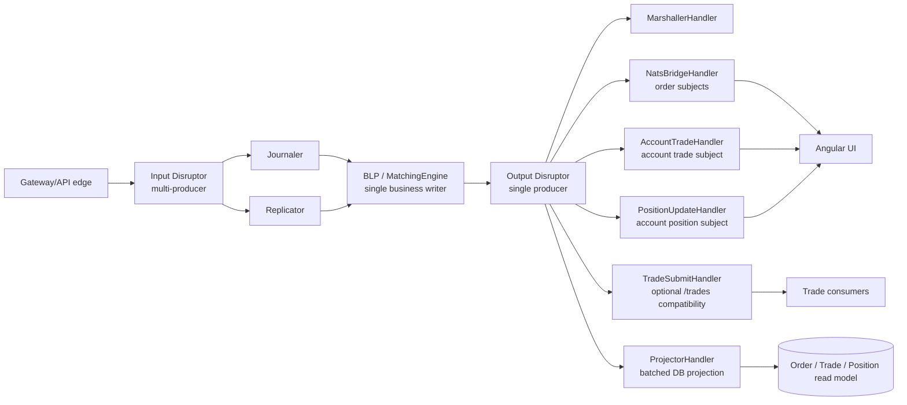

# TraderX - Output Disruptor

> **Status:** Implemented in state `009b-lmax-sequencer-architecture`.
> **Base state:** `lmax-sequencer-no-gc`.
> **Scope:** The BLP-owned output ring, typed output events, direct UI fan-out handlers, async read-model projection, failure semantics, configuration, observability, and validation.
> **Last code-sync:** 2026-06-17, verified against `output-disruptor` commit `05c72c0`.

The output disruptor is the egress side of the LMAX hot path. The BLP is the only producer. It writes typed business result events into a pre-allocated Disruptor ring. Independent output handlers then fan those events out to the UI subjects, update the in-memory acknowledgement/read model, optionally publish the legacy `/trades` stream, and project durable query rows into the database.

The important property is that output work is no longer part of the gateway acknowledgement path. Gateway commands are acknowledged after the input event is sequenced, journaled, replicated, and processed by the BLP. UI publishing and database projection happen after that through the output ring.

## Runtime Topology



`LmaxEngine` wires the output ring before the input ring because the BLP needs an `OutputPublisher` before it can run. The output Disruptor uses `ProducerType.SINGLE`; only the BLP writes output slots.

## Output Event Model

`OutputEvent` is a reusable mutable slot holder. It carries primitive fields only, so BLP emission can write into a pre-allocated ring slot without allocating a payload object.

Current event kinds:

| Kind | Meaning |
| --- | --- |
| `KIND_ORDER_ACCEPTED` | Order entered the in-memory book. |
| `KIND_ORDER_REJECTED` | Order was rejected before book entry. |
| `KIND_ORDER_PARTIALLY_FILLED` | Order received a partial fill. |
| `KIND_ORDER_FILLED` | Order is fully filled. |
| `KIND_ORDER_CANCELED` | Order was canceled. |
| `KIND_TRADE_BOOKED` | A fill or market trade was booked by the BLP. |
| `KIND_POSITION_UPDATED` | The account/security net position changed. |
| `KIND_ORDER_NOT_FOUND` | A cancel or force-fill referenced a missing order. |

The event carries:

- order identity and lifecycle fields: `orderRef`, `accountId`, `securityId`, `side`, `quantity`, `remainingQty`, `limitPx`, `status`, timestamps, fill fields, and lifecycle flags
- trade fields: `tradeQty`, `tradeSeq`, `tradePx`
- position fields: `positionQty`, `positionAvgCostTicks`, `averageCostBasisPx`
- correlation and latency fields: `inputSeq`, `ingressNanos`
- output control fields: `kind`, `flags`, `publishNats`

The BLP never asks downstream services for extra state to publish output. Everything needed by the output handlers is already in the ring event.

## Publishing From The BLP

The BLP publishes through `OutputPublisher`. The BLP-side emission mechanics are part of the 009b LMAX sequencer base: the matching thread already owns trade booking, position keeping, and paired output-ring publication. The output disruptor consumes that producer contract and owns the downstream fan-out, projection, and failure handling described below.

Order-only lifecycle updates use a single slot:

```java
emitOrderUpdate(order, inputSeq, flags, publishNats, marketPx, ingressNanos)
```

Fills publish order, trade, and position output together:

```java
emitFillWithTradeAndPosition(order, fillQty, tradePx, tradeSeq,
    newPosition, avgCostTicks, inputSeq, flags, marketPx, ingressNanos)
```

That method claims three adjacent output slots:

1. order lifecycle event
2. `TradeBooked`
3. `PositionUpdated`

It then publishes the range in one `ring.publish(updateSlot, positionSlot)` call. Consumers see a contiguous output sequence for the business result.

Market trade submissions use two adjacent slots:

1. `TradeBooked`
2. `PositionUpdated`

The BLP also owns position keeping. `MatchingEngine` keeps an in-memory `PositionBook`, updates quantity and weighted average cost basis on the BLP thread, and emits `PositionUpdated` with the resulting net state.

## Output Handlers

The output handlers run from the same output ring and are independent.

| Handler | Events | Responsibility |
| --- | --- | --- |
| `MarshallerHandler` | order lifecycle, `TradeBooked`, `PositionUpdated`, `OrderNotFound` | Updates the in-memory read model used for acknowledgements and counters; records egress latency. |
| `NatsBridgeHandler` | order lifecycle | Publishes `OrderResponse` to `/accounts/{accountId}/orders` and `/orders`. |
| `AccountTradeHandler` | `TradeBooked` | Publishes account-scoped trade payloads directly to `/accounts/{accountId}/trades`. |
| `PositionUpdateHandler` | `PositionUpdated` | Publishes account-scoped position payloads directly to `/accounts/{accountId}/positions`. |
| `TradeSubmitHandler` | `TradeBooked` | Optional compatibility publisher for `/trades`; disabled by default. |
| `ProjectorHandler` | order lifecycle, `TradeBooked`, `PositionUpdated` | Batches order, trade, and position rows into the durable read model. |

Direct account trade and position fan-out do not depend on the legacy trade processor path. The UI receives account-scoped trade and position updates from the output ring itself.

## NATS Subject Contract

The output handlers preserve the subjects consumed by the existing Angular UI.

| Output event | Subject(s) |
| --- | --- |
| order lifecycle events | `/accounts/{accountId}/orders`, `/orders` |
| `TradeBooked` | `/accounts/{accountId}/trades` |
| `PositionUpdated` | `/accounts/{accountId}/positions` |
| `TradeBooked` when legacy publishing is enabled | `/trades` |

Payload conversion happens only at the output edge. The BLP uses primitive ids and fixed-point ticks. Handlers convert `securityId` to ticker symbols and fixed-point price ticks to `BigDecimal` payload fields.

## Read-Model Projection

`ProjectorHandler` writes the durable query model asynchronously:

- order lifecycle events become `OrderRecord` rows
- `TradeBooked` events become `Trade` rows
- `PositionUpdated` events become `Position` rows

Projection is batched. The handler buffers rows and flushes when the batch threshold is reached or when Disruptor marks `endOfBatch`. Position projection deduplicates within a batch by `(accountId, security)` and writes only the latest net position for that key.

The database is not the source of truth for the hot path. The BLP is warmed from the read model on startup, and the journal remains the event-stream authority for recovery and replay work.

## Failure Semantics

Output publishing failures are isolated to the output handler that owns the failing side effect.

- order publish failure increments `orderPublishFailures`
- account-trade publish failure increments `accountTradePublishFailures`
- position publish failure increments `positionPublishFailures`
- optional `/trades` publish failure increments `tradeSubmitFailures`
- projection failure increments projection failure metrics, trims buffers to bounded size, and logs the affected sequence and buffered row counts

Handlers log failures and keep the output consumer alive. A failed UI publish does not roll back the BLP state, does not undo the journaled input event, and does not block unrelated output handlers.

If a downstream service stalls rather than failing fast, the bounded output ring eventually backpressures the BLP. That is deliberate: the ring bounds memory. Capacity is exposed through health/metrics so stalls are visible before they become sustained throughput problems.

## Configuration

Current output-related configuration:

| Key | Default | Meaning |
| --- | --- | --- |
| `disruptor.output.ring-size` | `65536` | Output ring size, normalized to a power of two. |
| `disruptor.output.wait-strategy` | `blocking` | Output consumer wait strategy for the demo profile. |
| `output.projector.batch-size` | `500` | Projector flush threshold. |
| `output.legacy-trades.enabled` | `false` | Enables the optional `/trades` compatibility publisher. |
| `blp.positions.capacity` | `8192` | In-memory BLP position-book capacity. |

The default runtime keeps direct account trade and position fan-out enabled and leaves `/trades` compatibility publishing disabled unless explicitly requested.

## Observability

The order-matcher health endpoint reports the LMAX/output state, including:

- input and output ring remaining capacity
- `inputPublishedSeq`, `journaledSeq`, `replicatedSeq`, `blpSeq`, `marshalledSeq`, `projectedSeq`
- trade submit failures
- account trade publish failures
- position publish failures
- BLP tick/fill counters
- message bus connection state

The output path also contributes to the existing Prometheus/Grafana coverage:

- order lifecycle counters
- output egress latency
- message bus connectivity
- order-matcher actuator metrics
- direct account trade and position publish failure counters

## No-GC Boundary

The BLP-to-output-ring emission path is allocation-free in steady state:

- output slots are pre-allocated
- output fields are primitive ids, quantities, ticks, flags, and timestamps
- no JSON, `String`, `BigDecimal`, or database entity is created by the BLP while writing the ring

Allocating conversions happen in output handlers, after the hot path:

- `OrderResponse` for order subjects
- `AccountTrade` for `/accounts/{accountId}/trades`
- `PositionUpdate` for `/accounts/{accountId}/positions`
- JPA model objects for projection

The no-GC gate for the hot path is `noGcTest`.

## End-To-End Fill Flow

For a fill:

1. The input event is sequenced on the input ring.
2. Journaler and replicator consume the input event.
3. The BLP runs after both durability gates.
4. `MatchingEngine` updates the order, books the trade, and updates the in-memory position.
5. `OutputPublisher.emitFillWithTradeAndPosition(...)` writes order, trade, and position events into the output ring.
6. `MarshallerHandler` updates acknowledgement/read-model state and latency counters.
7. `NatsBridgeHandler` publishes order updates.
8. `AccountTradeHandler` publishes the account trade update.
9. `PositionUpdateHandler` publishes the account position update.
10. `ProjectorHandler` asynchronously writes order/trade/position rows.

The gateway acknowledgement is not waiting for NATS publish or database projection.

## Validation

Use the generated service tree for Gradle tests, not the runtime override directory.

```bash
cd "/Users/yaakov/Desktop/Summer 26/lmax/traderX-output-disruptor"

bash pipeline/generate-state.sh 009b-lmax-sequencer-architecture

cd generated/code/target-generated/order-matcher
./gradlew noGcTest
```

For runtime smoke:

```bash
cd "/Users/yaakov/Desktop/Summer 26/lmax/traderX-output-disruptor"

bash generated/code/target-generated/scripts/start-state-009b-lmax-sequencer-architecture-generated.sh
bash generated/code/target-generated/scripts/test-state-009b-lmax-sequencer-architecture.sh
```

## Source Of Truth

The implemented source of truth is the 009b runtime override tree:

```text
specs/009b-lmax-sequencer-architecture/generation/runtime-overrides/order-matcher
```

The generated runtime is produced from those overrides plus:

```text
specs/009b-lmax-sequencer-architecture/generation/patches/0001-state-overlay.patch
```

The main files for the output disruptor are:

- `lmax/OutputEvent.java`
- `lmax/OutputPublisher.java`
- `lmax/LmaxEngine.java`
- `lmax/MatchingEngine.java`
- `lmax/MarshallerHandler.java`
- `lmax/NatsBridgeHandler.java`
- `lmax/AccountTrade.java`
- `lmax/AccountTradeHandler.java`
- `lmax/PositionUpdate.java`
- `lmax/PositionUpdateHandler.java`
- `lmax/TradeSubmitHandler.java`
- `lmax/ProjectorHandler.java`
- `lmax/InMemoryOrderReadModel.java`
- `config/PubSubConfig.java`
- `service/OrderMatcherService.java`
- `src/test/java/finos/traderx/ordermatcher/lmax/OutputDisruptorHandlersTest.java`
