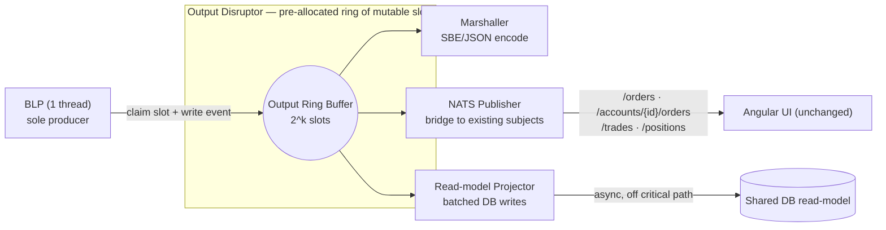

# TraderX — The Output Disruptor: How It Works & What a Spec Needs (building on `009`)

> **Status:** Design proposal (companion to `LMAX-SEQUENCER-ARCHITECTURE.md`, `LMAX-INPUT-DISRUPTOR.md`,
> `LMAX-BLP.md`).
> **Target state base:** `009-order-management-matcher`.
> **Scope of this doc:** the **output disruptor** only — the ring the BLP publishes into, its marshaller +
> publisher handlers, the NATS fan-out that preserves the `009` UI contract, and the async read-model
> projector that feeds the database off the critical path.
> **Primary reference:** Martin Fowler, *The LMAX Architecture* — https://martinfowler.com/articles/lmax.html
> **Date:** 2026-06-09

This document does two things:

1. **Part A** explains, in detail, **how the output disruptor works** — the BLP as sole producer, the
   pre-allocated output ring, the parallel Marshaller + Publisher(s) + Projector handlers, the NATS fan-out,
   the async Postgres/H2 read-model, and why output is off the user's acknowledgement path — and exactly how
   it replaces state `009`'s direct NATS publish + inline JPA writes.
2. **Part B** specifies **what a spec building off `009` would need** — the spec-kit artifacts and the
   concrete technical specs (output event model, contracts, dependencies, config, observability, gates).

---

## Table of contents

**Part A — How the output disruptor works**
1. [Where it sits & why it exists](#a1-where-it-sits--why-it-exists)
2. [Single-producer ring (the BLP writes, nobody else)](#a2-single-producer-ring-the-blp-writes-nobody-else)
3. [Output event holders](#a3-output-event-holders)
4. [The parallel output handlers](#a4-the-parallel-output-handlers)
5. [NATS fan-out: preserving the `009` UI contract](#a5-nats-fan-out-preserving-the-009-ui-contract)
6. [The async read-model projector](#a6-the-async-read-model-projector)
7. [Off the acknowledgement path](#a7-off-the-acknowledgement-path)
8. [Wait strategy & backpressure](#a8-wait-strategy--backpressure)
9. [No-GC at the output stage](#a9-no-gc-at-the-output-stage)
10. [One event, end to end through the output disruptor](#a10-one-event-end-to-end-through-the-output-disruptor)
11. [How this replaces `009`'s publish + persist](#a11-how-this-replaces-009s-publish--persist)
12. [Illustrative code](#a12-illustrative-code)

**Part B — What a spec needs (building on `009`)**
13. [Proposed state & scope](#b13-proposed-state--scope)
14. [Spec-kit artifacts to author](#b14-spec-kit-artifacts-to-author)
15. [Functional requirement deltas](#b15-functional-requirement-deltas)
16. [Non-functional requirement deltas](#b16-non-functional-requirement-deltas)
17. [Data-model & contract deltas](#b17-data-model--contract-deltas)
18. [Build & dependency specs](#b18-build--dependency-specs)
19. [Configuration keys](#b19-configuration-keys)
20. [Observability deltas](#b20-observability-deltas)
21. [Success criteria & validation](#b21-success-criteria--validation)
22. [What `009` already gives you vs. what the state must add](#b22-what-009-already-gives-you-vs-what-the-state-must-add)
23. [Risks specific to the output stage](#b23-risks-specific-to-the-output-stage)

---

# Part A — How the output disruptor works

## A1. Where it sits & why it exists

The output disruptor is the **egress ring** of the hot path. The BLP, having matched/booked/positioned an
event entirely in memory, publishes typed result events into it. Downstream handlers then **marshal** those
events to the wire and **fan them out** — onto the existing NATS subjects the Angular UI already consumes,
and into an **async read-model** (Postgres/H2) for queries and reporting. Crucially, none of this sits on the
user's order-acknowledgement path; the user is acknowledged as soon as the input event is durable +
replicated, long before the read-model is written.



## A2. Single-producer ring (the BLP writes, nobody else)

Unlike the **input** ring (multi-producer: Gateway + price feed), the output ring has **exactly one
producer — the BLP**. This is the easy case for the Disruptor: `ProducerType.SINGLE`, no availability ring
needed, the lowest-overhead claim path. The single-writer principle is preserved end to end: one thread
writes business state *and* the output ring.

The producer protocol is identical to the input ring — `next()` → write the slot in place → `publish(seq)` —
but with no cross-producer coordination. The BLP emits all of `OrderAccepted`, `OrderFilled`, `TradeBooked`,
`PositionUpdated`, etc. through this one path.

## A3. Output event holders

As with the input ring, slots are **pre-allocated mutable holders, reused forever**. An output holder carries
enough to render every downstream view without re-reading BLP state:

```java
public final class OutEvent {        // one instance per output slot, reused
    public long seq;                  // echoes the input sequence that produced it
    public byte kind;                 // ORDER_ACCEPTED | ORDER_FILLED | TRADE_BOOKED | POSITION_UPDATED | ...
    public int  accountId;
    public int  securityId;
    public byte side;
    public long qty;                  // fill / order qty
    public long pxTicks;              // execution / limit price, long fixed-point
    public long remainingQty;         // for partial fills
    public byte status;               // NEW | PARTIALLY_FILLED | FILLED | CANCELED | REJECTED
    public long ingressNanos;         // carried from input → enables true end-to-end latency at egress
}
```

`ingressNanos` is carried all the way from the Gateway so the Marshaller can record true end-to-end latency
(`now − ingressNanos`) into an HdrHistogram at the egress point.

## A4. The parallel output handlers

The output ring fans each published event out to handlers that run **concurrently**, each independent:

| Handler | Job | Notes |
| --- | --- | --- |
| **Marshaller** | Encode the event to its wire form (SBE binary and/or the JSON shape the UI expects) and record egress latency. | Same flyweight discipline as the input un-marshaller, in reverse. |
| **NATS Publisher** | Bridge events onto the **existing** NATS subjects so the Angular UI updates with **no contract change**. | Maps `securityId→ticker`, `pxTicks→decimal` at this edge (not in the BLP). |
| **Read-model Projector** | Batch-write order/trade/position rows into the shared DB for queries/reporting. | Off the critical path; batches on `endOfBatch`. |

These can run at different wait strategies: the NATS bridge can be `Yielding`, the Projector can be
`Sleeping`/`Blocking` (it is not latency-critical). Only the input-side BLP/Journaler need busy-spin.

## A5. NATS fan-out: preserving the `009` UI contract

This is what keeps the migration invisible to the front end. State `009`'s `OrderMatcherService.
publishOrderUpdate(...)` publishes `OrderResponse` payloads to `/accounts/{accountId}/orders` and `/orders`;
the trade pipeline publishes `/trades`, `/accounts/{id}/trades`, `/accounts/{id}/positions`. The NATS
Publisher on the output ring **reproduces exactly those subjects and payload shapes** from BLP output events:

| BLP output event | NATS subject(s) (unchanged from `009`) |
| --- | --- |
| `OrderAccepted / PartiallyFilled / Filled / Canceled / Rejected` | `/accounts/{accountId}/orders`, `/orders` |
| `TradeBooked` | `/trades`, `/accounts/{accountId}/trades` |
| `PositionUpdated` | `/accounts/{accountId}/positions` |

Because the subjects and JSON shapes are identical, the Angular blotters (trade, position, account orders,
admin orders) that `009`/ADR-013 already drive via push subscriptions keep working untouched. The
`securityId→ticker` and `long→decimal` conversions happen **here, at the edge**, never in the BLP.

## A6. The async read-model projector

The Projector consumes the same output events and writes the **read-model** — the `OrderBook` table and
trade/position rows that `009` wrote inline via JPA. The differences:

- **Off the hot path.** The user was acknowledged at input durability; the DB write happening a few
  milliseconds later is invisible to them.
- **Batched.** It accumulates rows and flushes once per `endOfBatch`, turning `009`'s per-mutation
  `orderRepository.save(...)` into efficient batch writes.
- **Rebuildable.** If the read-model is lost or schema-migrated, it is **re-projected from the journal** —
  the journal (input) is authoritative, not the DB.

## A7. Off the acknowledgement path

The single most important property: **output is asynchronous to the user**. In `009`, an order's
acknowledgement effectively waited behind a blocking `POST /trade/` and JPA writes. In the LMAX model the
user is acknowledged when the **input** event is durable + replicated; everything on the output ring (NATS
fan-out, DB projection) happens afterward and never blocks the ack. This is why the latency budget in
`LMAX-SEQUENCER-ARCHITECTURE.md` §11 lists "Publish → UI (NATS)" and "Postgres projection" as **not on the
ack path**.

## A8. Wait strategy & backpressure

The output ring is bounded like any Disruptor. If a downstream handler stalls (e.g., NATS slow, DB slow), the
ring fills and the BLP's `publish` eventually backpressures — protecting memory at the cost of throughput,
exactly as on the input side. Mitigations: size the ring for the worst publisher stall, run the slow
Projector on its own handler so it can't block the NATS bridge, and export a remaining-capacity gauge. A slow
read-model must **never** stall matching beyond the ring's bound; if the DB is down, the Projector lags and
catches up later (the journal remains the source of truth).

## A9. No-GC at the output stage

Same discipline as the input ring: slots pre-allocated once; encode into off-heap buffers via SBE; carry
`long` fixed-point and `int securityId` through the ring; convert to `String`/`decimal`/JSON **only** at the
NATS/DB edge, where allocation is acceptable because it is off the hot path. The BLP→ring emit allocates
nothing; only the outermost edge (JSON for the legacy UI, SQL for the DB) allocates, and that is deliberately
downstream of the latency-critical section.

## A10. One event, end to end through the output disruptor

A fill produced by the BLP:

1. **BLP emits.** `out.next()` → write `OutEvent` (`kind=ORDER_FILLED`, `accountId`, `securityId`, `qty`,
   `pxTicks`, `status=FILLED`, `ingressNanos`) → `out.publish(seq)`. No allocation.
2. **Parallel handlers fire.** Marshaller encodes + records `now − ingressNanos` latency; NATS Publisher maps
   to `/accounts/{id}/orders` + `/orders` (+ `TradeBooked`→`/trades`, `PositionUpdated`→`/positions`) and
   publishes JSON; Projector queues the row.
3. **UI updates.** The Angular blotters receive the push exactly as in `009` — no front-end change.
4. **DB catches up.** On `endOfBatch`, the Projector flushes batched rows to the shared DB.

The user was already acknowledged at input durability; all of the above is off their critical path.

## A11. How this replaces `009`'s publish + persist

| `009` mechanism (today) | Output-disruptor replacement |
| --- | --- |
| `OrderMatcherService.publishOrderUpdate(...)` → `orderPublisher.publish("/accounts/{id}/orders" \| "/orders", OrderResponse)` | **NATS Publisher handler** on the output ring reproduces the same subjects + payloads from BLP events. |
| `restTemplate.postForEntity(tradeServiceUrl, ...)` to book a trade (blocking, in the match loop) | `TradeBooked` **output event** → published to `/trades` and projected to DB — async, off the ack path. |
| `orderRepository.save(...)` per mutation (JPA/H2) | **Read-model Projector** batch-writes, off the hot path; journal is authoritative. |
| `OrderResponse.from(order, lastPrice)` allocation per publish | Pre-allocated `OutEvent` slots; JSON only at the NATS edge. |
| Per-message Jackson serialization | SBE encode in the Marshaller; JSON only where the legacy UI requires it. |
| `String security` in payloads | `securityId→ticker` mapping at the edge handler. |

External result: **identical** NATS subjects, payloads, and DB rows; only the *path* that produces them
changes.

## A12. Illustrative code

```java
// Output ring: BLP is the SOLE producer → ProducerType.SINGLE
Disruptor<OutEvent> out = new Disruptor<>(
    OutEvent::new,                  // pre-allocate every slot
    1 << 16,                        // sized per the worst publisher stall
    DaemonThreadFactory.INSTANCE,
    ProducerType.SINGLE,            // only the BLP writes here
    new YieldingWaitStrategy());    // egress is less latency-critical than the BLP

out.handleEventsWith(marshaller, natsPublisher, projector);   // three parallel handlers
out.start();
RingBuffer<OutEvent> ring = out.getRingBuffer();

// BLP emits a fill — no allocation
long s = ring.next();
try {
    OutEvent e = ring.get(s);
    e.kind = ORDER_FILLED; e.accountId = acct; e.securityId = sec;
    e.qty = fillQty; e.pxTicks = execPx; e.status = FILLED; e.ingressNanos = in.ingressNanos;
} finally {
    ring.publish(s);
}

// NATS Publisher handler — maps back to the EXACT 009 subjects/payloads (edge conversions here)
public void onEvent(OutEvent e, long seq, boolean endOfBatch) {
    OrderResponse dto = render(e);                       // securityId→ticker, pxTicks→decimal (edge)
    nats.publish("/accounts/" + e.accountId + "/orders", dto);
    nats.publish("/orders", dto);
}
```

---

# Part B — What a spec needs (building on `009`)

Written in the repo's **spec-kit** idiom. Numbering mirrors `009`'s `+4` internal convention
(`009` ⇒ block `013`; this state ⇒ block `016`).

## B13. Proposed state & scope

**Proposed state:** `012-output-disruptor-readmodel` — **Track:** `functional` — **Previous state:**
`011-fused-blp-matching` (the BLP; see `LMAX-BLP.md`). Maps to the strangler plan's **Phase 3** (output +
async read-model; "Postgres → async read-model fed by a Projector").

**Intent:** route all BLP results through a single-producer output ring whose handlers (Marshaller, NATS
Publisher, Projector) reproduce the `009` NATS/UI contract verbatim and write the database as an **async,
batched read-model** off the critical path — making the journal authoritative.

In scope: the output ring, the three output handlers, the NATS subject bridge, the read-model projector, and
journal→read-model rebuild. Out of scope: failover/DR (later state) and the unchanged edge/UI/LGTM stack.

## B14. Spec-kit artifacts to author

Mirror `009`'s core artifact set under `specs/012-output-disruptor-readmodel/`: `README.md`, `spec.md`,
`plan.md`, `requirements/functional-delta.md`, `requirements/nonfunctional-delta.md`,
`contracts/contract-delta.md`, `data-model.md`, `research.md`, `quickstart.md`, `system/architecture.md` +
`architecture.model.json`, `system/runtime-topology.md`,
`system/adr-016-async-read-model-over-inline-persistence.md`, `generation/generation-hook.md`,
`tests/smoke/README.md`.

## B15. Functional requirement deltas

- **FR-01601** — All BLP results SHALL be published into a **single-producer output ring** and fanned out by
  parallel Marshaller / NATS Publisher / Projector handlers.
- **FR-01602** — The NATS Publisher SHALL reproduce the **exact** `009` subjects and payload shapes
  (`/orders`, `/accounts/{accountId}/orders`, `/trades`, `/accounts/{accountId}/trades`,
  `/accounts/{accountId}/positions`) so the UI is unchanged.
- **FR-01603** — Database writes SHALL move to an **async, batched read-model projector** off the
  acknowledgement path; the input journal is authoritative.
- **FR-01604** — The read-model SHALL be **rebuildable** by re-projecting the journal (recovery / schema
  migration).
- **FR-01605** — A slow/unavailable read-model or NATS bus SHALL NOT block matching beyond the bounded ring;
  the Projector catches up after recovery.
- **FR-01606** — `securityId→ticker` and `long→decimal` conversions SHALL occur in the output handlers (the
  edge), not in the BLP.

## B16. Non-functional requirement deltas

- **NFR-01601 (ack path)** — NATS fan-out and DB projection SHALL NOT sit on the order-acknowledgement path
  (per `LMAX-SEQUENCER-ARCHITECTURE.md` §11).
- **NFR-01602 (egress latency)** — Output ring + marshal p99 `< 20 µs`; record true end-to-end latency
  (`now − ingressNanos`) at the Marshaller via HdrHistogram.
- **NFR-01603 (no-GC)** — Zero steady-state allocation BLP→ring; JSON/SQL allocation only at the outermost
  edge. Enforced by the no-GC conformance gate (`LMAX-NO-GC-JAVA.md`).
- **NFR-01604 (durability/decoupling)** — Read-model loss is recoverable from the journal; DB outage degrades
  to Projector lag, not matching failure.
- **NFR-01605 (observability)** — Export egress metrics (publish latency, projector lag/batch size, ring
  capacity, NATS errors); inherit `007` LGTM; remain convergence `C2`.

## B17. Data-model & contract deltas

**`data-model.md`:**
- **Output event** model (`OrderAccepted|Rejected|PartiallyFilled|Filled|Canceled`, `TradeBooked`,
  `PositionUpdated`) with `ingressNanos` carried through.
- **Read-model** tables: `OrderBook` (from `009`) plus trade/position rows, now written by the Projector.
- **Projection checkpoint**: last projected `seq` (so the Projector resumes after restart and rebuilds are
  idempotent).

**`contracts/contract-delta.md`:**
- **No external change** — NATS subjects/payloads and order/trade/position REST shapes from `009` are
  preserved verbatim (the whole point).
- **Internal**: output-event SBE schema; read-model write contract + projection checkpoint.

## B18. Build & dependency specs

| Concern | Coordinate (illustrative) |
| --- | --- |
| Output ring | `com.lmax:disruptor:4.0.0` (`ProducerType.SINGLE`) |
| Off-heap/flyweight encode | `org.agrona:agrona:1.22.0`, `uk.co.real-logic:sbe-tool:1.30.0` |
| NATS bridge | existing `009` NATS client/`Publisher<>` (reused; no new subject) |
| Read-model persistence | existing Spring Data JPA + `com.h2database:h2` (demo) / Postgres (deploy) |
| Egress latency measurement | `org.hdrhistogram:HdrHistogram:2.2.2` |

Java 21 / Spring Boot 3.5.14 as in `009`. Versions pinned to latest CVE-clean releases; repo CVE gate
applies.

## B19. Configuration keys

| Key | Default | Purpose |
| --- | --- | --- |
| `disruptor.output.ring-size` | `65536` | Power-of-two output slots. |
| `disruptor.output.wait-strategy` | `yielding` | Egress is less critical than the BLP. |
| `output.nats.enabled` | `true` | Toggle the NATS bridge. |
| `output.projector.enabled` | `true` | Toggle DB projection. |
| `output.projector.batch-size` | `500` | Max rows per batched flush. |
| `output.projector.flush-interval-ms` | `200` | Time-based flush bound. |
| `output.projector.checkpoint-path` | `./data/projection.ckpt` | Last projected `seq`. |

## B20. Observability deltas

| Metric | Type | Meaning |
| --- | --- | --- |
| `traderx_output_publish_latency_seconds` | histogram | True end-to-end (`now − ingressNanos`) at egress. |
| `traderx_output_remaining_capacity` | gauge | Output ring headroom. |
| `traderx_projector_lag_seq` | gauge | `BLP_seq − last_projected_seq`. |
| `traderx_projector_batch_size` | histogram | Rows per flush. |
| `traderx_output_nats_errors_total` | counter | Publish failures (bridge health). |
| `traderx_output_events_total{kind=...}` | counter | Per-kind egress counts. |

Existing `009` order/trade/position views in Grafana keep working (same subjects); add panels for egress
latency, projector lag, and ring headroom.

## B21. Success criteria & validation

- **SC-01601** — UI parity: Angular blotters update identically to `009` (same subjects, same payloads, no
  front-end change).
- **SC-01602** — Read-model parity: projected `OrderBook`/trade/position rows match `009`'s inline writes for
  the same scenarios.
- **SC-01603 (decoupling)** — With the DB stopped, matching continues and the Projector catches up on
  recovery; with NATS stopped, matching continues and UI resumes on reconnect.
- **SC-01604 (rebuild)** — Drop the read-model, re-project from the journal, assert identical rows.
- **SC-01605 (ack path)** — Acknowledgement latency is independent of DB/NATS latency (measured).
- **SC-01606 (no-GC gate)** — BLP→ring emit allocates zero under `-XX:+UseEpsilonGC` (see
  `LMAX-NO-GC-JAVA.md`).
- **SC-01607 (`C2`)** — Demo-profile image builds, publishes to `ghcr.io/finos/traderx-c2/order-matcher`,
  runs without core pinning.

## B22. What `009` already gives you vs. what the state must add

| Capability | `009` provides | New state must add |
| --- | --- | --- |
| NATS subjects + payload shapes | ✅ (`/orders`, `/accounts/{id}/orders`, `/trades`, `/positions`) | bridge them from BLP output events (unchanged contract) |
| DB persistence (`OrderBook`, trades, positions) | ✅ (inline JPA) | **async batched Projector** off the hot path |
| Push-based UI (ADR-013) | ✅ | feed it from the output ring (no UI change) |
| Trade pipeline | ✅ | replace inline `POST /trade/` with `TradeBooked` events |
| Single-producer output ring | ❌ | **build** |
| Marshaller/Publisher/Projector handlers | ❌ | **build** |
| Journal→read-model rebuild + checkpoint | ❌ | **build** |
| Off-ack-path async persistence | ❌ (DB on hot path today) | **build** |

## B23. Risks specific to the output stage

| Risk | Mitigation |
| --- | --- |
| **Read-model drift vs. journal** | Journal authoritative; idempotent projection with a `seq` checkpoint; rebuild test (`SC-01604`). |
| **Slow DB/NATS stalls matching** | Separate handlers; bounded ring; Projector lags and recovers — never blocks the BLP (`SC-01603`). |
| **UI contract regression** | Byte-for-byte subject/payload parity tests (`SC-01601`); conversions only at the edge. |
| **Allocation at egress creeping onto the hot path** | SBE/flyweight BLP→ring; JSON/SQL only at the outermost edge; Epsilon gate (`SC-01606`). |
| **Duplicate/out-of-order publishes after recovery** | Resume from projection checkpoint; events carry monotonic `seq`. |
| **Eventual-consistency surprise** (UI ahead of DB) | Documented: UI is push-fed from output events; DB is a slightly-behind read-model by design. |

---

*Companion documents: `LMAX-SEQUENCER-ARCHITECTURE.md` (full redesign), `LMAX-INPUT-DISRUPTOR.md` (ingress
ring), `LMAX-BLP.md` (the engine whose output this ring carries), and `LMAX-NO-GC-JAVA.md` (the allocation
discipline). This doc zooms into the **output disruptor** and the spec work to introduce it on top of state
`009-order-management-matcher`.*
