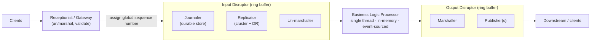
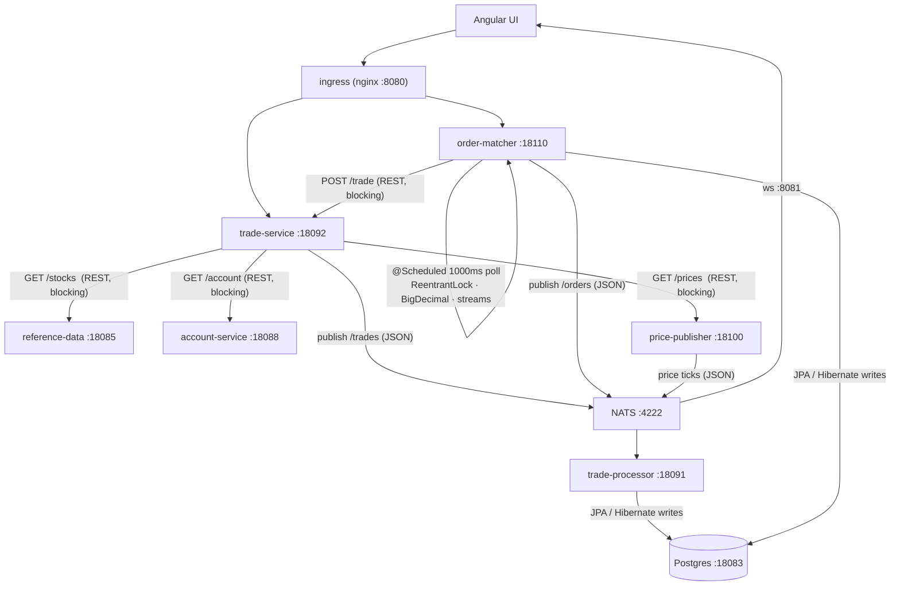
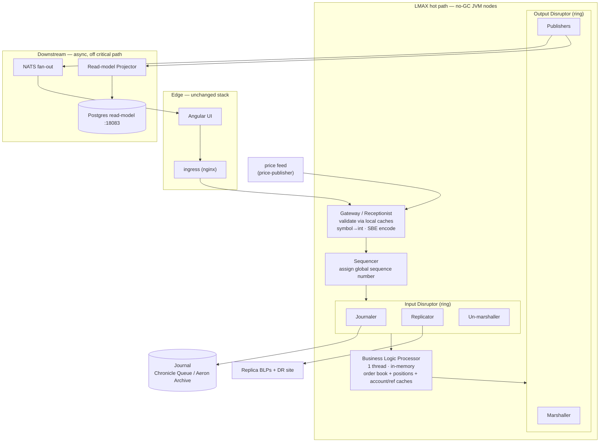
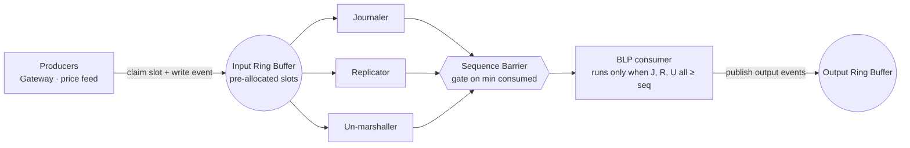
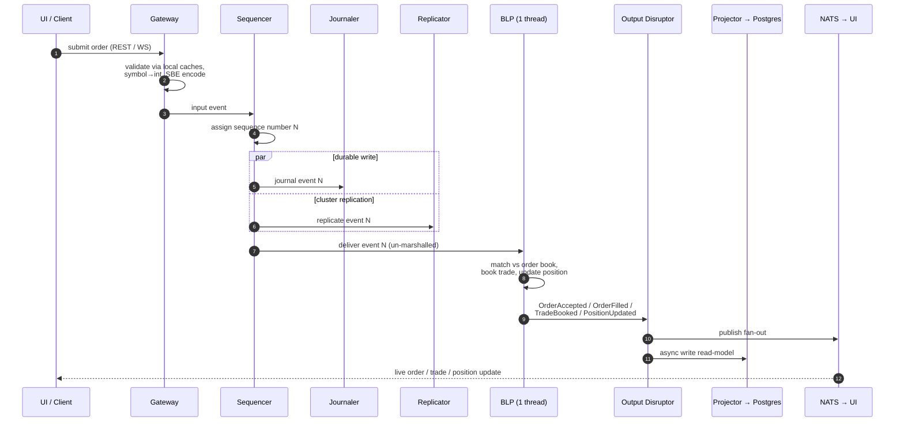
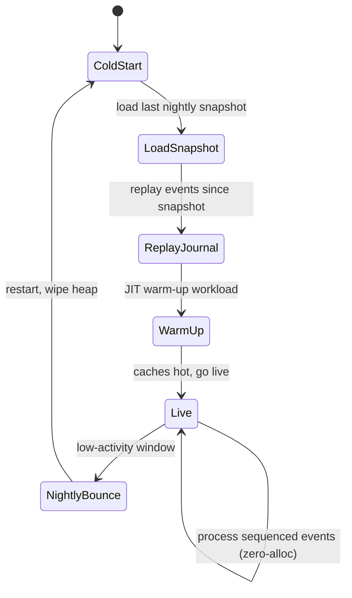
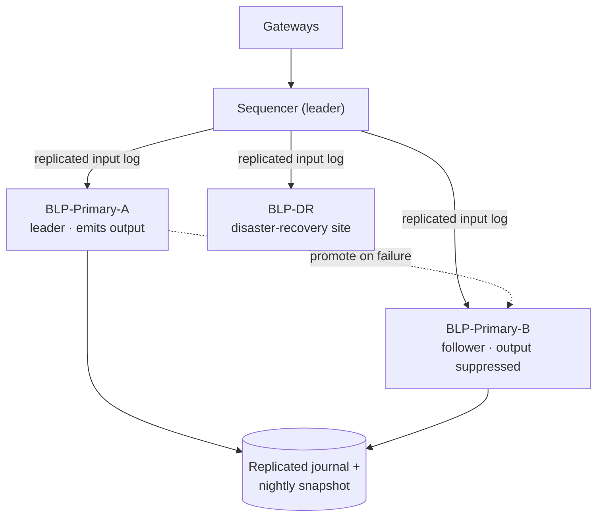
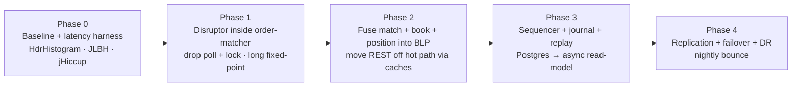

# TraderX — LMAX Sequencer Architecture for Low-Latency, No-GC Trading

> **Status:** Design proposal (human-authored, not a generated snapshot artifact).
> **Target state base:** `009-order-management-matcher`.
> **Primary reference:** Martin Fowler, *The LMAX Architecture* — https://martinfowler.com/articles/lmax.html
> **Date:** 2026-06-04
> **Last code-sync:** 2026-06-19 — verbatim snippets verified against the `009b` overlay
> (`specs/009b-lmax-sequencer-architecture/generation/runtime-overrides/order-matcher/`); measured
> results in `LMAX-BENCHMARK-009-VS-009B.md`.

This document proposes re-architecting the **trading hot path** of TraderX around the
[LMAX architecture](https://martinfowler.com/articles/lmax.html): a single, globally **sequenced**,
**event-sourced** input stream feeding a **single-threaded, in-memory Business Logic Processor (BLP)**,
wired together with [LMAX Disruptor](https://lmax-exchange.github.io/disruptor/) ring buffers, and
engineered for **zero steady-state allocation (no-GC)** on every node in the path.

---

## Table of contents

1. [Design decisions (scope of this proposal)](#1-design-decisions-scope-of-this-proposal)
2. [LMAX in one picture](#2-lmax-in-one-picture)
3. [TraderX today: the hot path and why it fights latency](#3-traderx-today-the-hot-path-and-why-it-fights-latency)
4. [Target architecture: a global sequencer for TraderX](#4-target-architecture-a-global-sequencer-for-traderx)
5. [The Disruptor: ring buffer, single-writer, mechanical sympathy](#5-the-disruptor-ring-buffer-single-writer-mechanical-sympathy)
6. [Order lifecycle through the sequencer](#6-order-lifecycle-through-the-sequencer)
7. [The no-GC Java approach, per node](#7-the-no-gc-java-approach-per-node)
8. [Component mapping: current → LMAX role](#8-component-mapping-current--lmax-role)
9. [Event sourcing, replay, snapshots](#9-event-sourcing-replay-snapshots)
10. [Replication & failover](#10-replication--failover)
11. [Latency budget](#11-latency-budget)
12. [The code as implemented in state `009b`](#12-the-code-as-implemented-in-state-009b)
13. [Migration plan (strangler)](#13-migration-plan-strangler)
14. [Risks & trade-offs](#14-risks--trade-offs)
15. [How we will validate latency](#15-how-we-will-validate-latency)
16. [Recommended libraries](#16-recommended-libraries)
17. [References](#17-references)

---

## 1. Design decisions (scope of this proposal)

These were confirmed before writing and bound the rest of the document:

| Decision | Choice | Consequence |
| --- | --- | --- |
| **Scope of nodes** | **Trade hot path only** | Sequencer + matching BLP + trade ingest/booking are redesigned. `account-service`, `position-service`, `people-service`, `reference-data`, the Angular UI, ingress, and the LGTM observability stack stay on the current stack — exactly as LMAX kept everything except the BLP conventional. |
| **Sequencer topology** | **Global platform sequencer** | One sequenced, journaled, replicated input stream → one single-threaded BLP → output disruptor fan-out. Strongest fidelity to the article. |
| **Source of truth** | **Event journal is authoritative; Postgres is an async read-model** | BLP state is rebuilt by replay + nightly snapshot. Postgres is fed asynchronously, off the critical path, purely for queries/UI/reporting. |
| **Latency goal** | **Aggressive: sub-ms in-node, single-digit-ms end-to-end** | Justifies the full no-GC toolkit: pre-allocated rings, off-heap/flyweight events, `long` fixed-point prices, busy-spin wait strategy, pinned cores. |

**Out of scope / unchanged:** trader-facing CRUD reads, the `people-service` (.NET) and `reference-data`/`price-publisher` (Node.js) nodes, the Angular UI contract, and observability. They feed or consume the hot path but are not rebuilt.

---

## 2. LMAX in one picture

The article's core claim: a **single thread** processing business logic **entirely in memory**, fed by a
**sequenced input stream**, hit **~6 million orders/second** on one commodity server — because it stops
fighting locks, queues, and garbage collection and instead respects the hardware ("mechanical sympathy").



Key facts from the article that drive this design:

- **BLP is single-threaded and in-memory** — "there is no database or other persistent store"; current state is
  "entirely derivable by processing the input events."
- **Disruptor ring buffers** coordinate with **64-bit monotonic sequence counters** and the **single-writer
  principle** — no locks. LMAX ran a **20M-slot input** ring and **4M-slot output** rings.
- **Input handlers run in parallel**: journaler (durable), replicator (cluster), un-marshaller. The BLP only
  runs once all three have passed a given sequence.
- **No external calls from the BLP** — long-latency work is split into request/response events.
- **Replay = recovery**: nightly snapshots, **restart in < 1 minute**, deterministic replay for diagnostics.
- **Failover**: **two BLPs in the main data center + one at DR**; replicas process the same input but suppress
  output until promoted — **microsecond failover**.
- **GC discipline**: avoid mid-life-promoted objects, reuse pre-allocated objects, cache-friendly custom
  collections (e.g. `LongToObjectHashMap`), and a **nightly bounce** to wipe the heap.

---

## 3. TraderX today: the hot path and why it fights latency

The current "path of trading" spans several network-separated Spring Boot services, a JSON message bus, and a
relational database — every boundary adds serialization, allocation, and blocking I/O.



### Anti-patterns vs. LMAX remedies

Concrete observations from the snapshot, each mapped to the LMAX remedy this design applies:

| Where (current code) | Anti-pattern | LMAX remedy |
| --- | --- | --- |
| `trade-service/.../TradeOrderController.createTradeOrder` | **3 blocking `RestTemplate` calls** (ticker, account, price) *before* publishing | "No external calls from business logic." Validate against **in-memory replicas** at the Gateway; anything not local becomes a request/response event. |
| `order-matcher/.../OrderMatcherService.runMatcherTick` | **Polling** via `@Scheduled(fixedDelay 1000ms)` — adds up to 1 s of latency | **Event-driven**: every order/cancel/price tick is a sequenced event the BLP reacts to immediately. |
| `OrderMatcherService.orderMutationLock` (`ReentrantLock`) | Lock-guarded mutation; contention + context switches | **Single-threaded BLP**, single writer, **no locks at all**. |
| `OrderMatcherService.submitTrade(...)` | **REST `POST /trade/` inside the match loop** | Matching and booking are **fused into one in-memory BLP** — a method call, not a network hop. |
| `BigDecimal` prices everywhere; `ConcurrentHashMap lastPrices`; `.stream().filter().toList()` per tick | Allocation- and GC-heavy, cache-unfriendly | **`long` fixed-point** prices, **Agrona primitive collections**, **zero-allocation** steady state. |
| JSON over NATS (`NatsJSONSubscriber` Jackson `ObjectMapper`) | Per-message parse/allocate | **SBE / flyweight** binary codec; zero-copy decode into pre-allocated ring slots. |
| `trade-processor` + `order-matcher` write Postgres on the hot path | DB latency + locks on the critical path | **Journal is source of truth**; Postgres becomes an **async read-model** fed off the output disruptor. |
| String `security` symbols flow end-to-end | String hashing/equality, allocation on hot path | **Symbol → `int` securityId** mapping at the Gateway; the BLP never sees a `String`. |

---

## 4. Target architecture: a global sequencer for TraderX

Everything that can change the trading state — **new orders, cancels, force-fills, and price ticks** — enters
through **one Gateway**, is stamped with a **single global sequence number**, journaled and replicated in
parallel, then handed to **one single-threaded BLP** that holds the order book and positions in memory. Results
leave via an **output disruptor** that fans out to the existing NATS/UI contract and to an async Postgres
read-model.



**Why a single input stream for *both* orders and prices?** Determinism. If the only things that mutate state
arrive on one totally-ordered, journaled stream, then replaying that stream reproduces state **exactly** — the
foundation for recovery, replication, and "replay the bug in a dev box" diagnostics. In the current system,
price ticks arrive out-of-band on NATS and races are mediated by a `ReentrantLock`; here they are just events
`N`, `N+1`, `N+2`.

**The fused BLP is the big shift.** Today, "validate (trade-service) → publish → book (trade-processor) →
match/auto-fill (order-matcher) → submit back to trade-service" is a multi-hop, multi-process dance. In the LMAX
model these collapse into **in-memory method calls on one thread**: match against the book, book the resulting
trade, update the position, and emit output events — all between consuming event `N` and event `N+1`.

---

## 5. The Disruptor: ring buffer, single-writer, mechanical sympathy

The Disruptor is a **pre-allocated circular buffer** of mutable event holders. Producers claim a slot and write
in place; consumers follow behind, reading slots by sequence. Coordination is via **monotonic 64-bit sequence
counters** and a **sequence barrier** — no locks, no queue churn. Because each slot object is allocated **once
at startup** and reused forever, the hot path allocates **nothing**.



Three properties matter for latency:

- **Single-writer principle.** Exactly one thread writes any given piece of memory. The BLP is the sole writer
  of the in-memory order book and positions. The article notes their early actor/queue prototype "spent more
  time managing queues than doing the real logic" because queues need multiple writers — the Disruptor fixes
  this.
- **Mechanical sympathy.** One thread pinned to one core keeps the L1/L2 caches warm; sequence counters are
  **cache-line padded** (`@Contended`) to avoid false sharing.
- **Batching for free.** Under load a consumer can process everything up to the latest published sequence in a
  tight loop (`endOfBatch`), amortizing per-event overhead — throughput rises as latency falls.

The **wait strategy** is the latency dial. For the aggressive target we use `BusySpinWaitStrategy` on the BLP
and journaler (a core is permanently burned spinning, in exchange for nanosecond wake-ups). Less critical
consumers can use `YieldingWaitStrategy`.

---

## 6. Order lifecycle through the sequencer



Notes:

- The **journaler + replicator run in parallel** with un-marshaling; the BLP is gated behind all three, so by
  the time it acts on event `N`, that event is already **durable and replicated**. This is what lets failover be
  near-instant.
- The **BLP never blocks**. If matching needed something it doesn't have in memory (it shouldn't, given the
  caches), it would emit a request event and continue — the response returns later as another sequenced event.
- **Output is asynchronous to the user.** Postgres writes and even NATS fan-out happen downstream of the BLP;
  they never sit on the order-acknowledgement path.

---

## 7. The no-GC Java approach, per node

"No-GC" means **zero allocation in the steady state**, so the collector simply never has work to do. Every node
on the hot path (Gateway, Sequencer, Journaler, Replicator, BLP, Output publishers) follows the same discipline.

| Technique | What it replaces in TraderX today | Why |
| --- | --- | --- |
| **Pre-allocated ring of mutable event holders** | New DTO objects per request/message | All slots allocated once at startup; producers mutate in place. Zero per-event allocation. |
| **Flyweight over off-heap buffers (Agrona `UnsafeBuffer`) + SBE codec** | Jackson JSON `ObjectMapper` parse/serialize | Zero-copy binary decode/encode; no intermediate objects; same format on the wire **and** in the journal. |
| **`long` fixed-point prices/quantities** | `BigDecimal` (`roundPrice`, `setScale`) | Integer math is allocation-free, branch-light, cache-friendly. Carry price as scaled `long` (e.g. ×1e6). |
| **Symbol → `int` securityId at the Gateway** | `String security` flowing end-to-end | No string hashing/equality on the hot path; array-indexed order books. |
| **Agrona primitive collections** (`Int2ObjectHashMap`, `Long2ObjectHashMap`, `IntArrayList`) | `ConcurrentHashMap`, `HashMap<Integer,...>`, streams | No autoboxing, cache-friendly — the modern `LongToObjectHashMap` the article describes. |
| **No locks** | `ReentrantLock orderMutationLock`, `AtomicLong/Integer` | Single-threaded BLP is the only writer; counters are plain `long` fields. |
| **Object pooling / reuse for domain state** | `new OrderRecord()` per create, `OrderResponse.from(...)` | Order-book entries and positions are long-lived, reused, never re-allocated mid-life. |
| **Binary / async logging off the hot path** | SLF4J parameterized logging (boxes varargs) | Log to a separate ring/thread; never `String.format` on the BLP thread. |
| **`BusySpinWaitStrategy` + core pinning** (OpenHFT Affinity, `isolcpus`) | Spring scheduler threads, default pools | Deterministic, sub-µs wake-ups; caches stay warm. |
| **`-XX:+AlwaysPreTouch`, `-Xms == -Xmx`, large pages, NUMA-aware** | Default heap growth | No page faults / heap resize jitter at runtime. |
| **GC: Epsilon in zero-alloc tests; ZGC/Shenandoah in prod** | G1 defaults | Epsilon (no-op) proves zero-alloc and fails fast if violated; ZGC/Shenandoah give sub-ms pauses as a safety net. The modern equivalent of LMAX's tuned CMS + nightly bounce. |
| **JIT warm-up replay at startup** | Cold Hotspot on first live orders | Replay a synthetic workload so hot methods are C2-compiled before going live. |
| **Nightly bounce** | n/a | Restart in a quiet window, replay snapshot+journal (< 1 min), wipe any accumulated state — straight from the article. |

> **Discipline, not just config.** The GC flags are a safety net. The real work is writing allocation-free code
> and proving it — see [§15](#15-how-we-will-validate-latency). Running tests under **Epsilon GC** turns any
> accidental allocation on the hot path into an immediate, visible failure.

---

## 8. Component mapping: current → LMAX role

| Current TraderX component | New LMAX role | What changes |
| --- | --- | --- |
| `trade-service` (validate + publish) | **Gateway / Receptionist** | Keeps the REST/WS edge contract. Validation moves to **in-memory replicas** of reference data, accounts, and latest prices (no blocking REST). Encodes SBE input events and submits to the Sequencer. |
| `order-matcher` matching logic (`OrderMatcherService`) | **BLP — matching engine** | In-memory order book per `securityId`; **event-driven** (no `@Scheduled` poll); no lock; `long` prices. |
| `trade-processor` booking + position keeping | **BLP — booking & position keeping** | Fused into the same single thread as matching; emits `TradeBooked` / `PositionUpdated` output events instead of writing the DB inline. |
| `price-publisher` | **Input producer** (unchanged node) | Price ticks become **sequenced input events** through the Gateway, not out-of-band NATS messages, so they are part of the deterministic stream. |
| Postgres (system of record) | **Async read-model** | Fed by the **Read-model Projector** off the output disruptor. Authoritative state is the journal. |
| NATS `/orders`, `/accounts/{id}/orders`, `/trades` | **Output fan-out** (unchanged bus) | A publisher on the output disruptor bridges BLP output events onto the existing NATS topics, so the **UI contract is preserved**. |
| — (new) | **Sequencer** | Assigns the global sequence number; the heart of ordering and determinism. |
| — (new) | **Journaler + Replicator** | Durable, replicated input log (Chronicle Queue / Aeron Archive; Aeron Cluster for consensus). |
| — (new) | **Read-model Projector** | Consumes output events, batches writes to Postgres, serves nothing on the critical path. |
| `account-service`, `position-service`, `people-service`, `reference-data`, UI, ingress, LGTM | **Unchanged** | Out of scope; they feed caches or consume fan-out. |

---

## 9. Event sourcing, replay, snapshots

The journal of sequenced **input** events is the single source of truth. BLP state is a pure function of that
stream, so it can always be rebuilt.



- **Snapshot**: periodically (e.g. nightly) serialize BLP state + the sequence number it reflects.
- **Recovery**: load latest snapshot, replay journal from that sequence forward — the article reports
  **restart in under a minute**.
- **Diagnostics**: replay a production journal in a dev environment to reproduce any bug deterministically.
- **Postgres is rebuildable too**: if the read-model is lost or schema-migrated, re-project it from the journal.

---

## 10. Replication & failover



Following the article: **two BLPs in the primary data center plus one at a DR site**. All consume the **same
replicated input stream** and stay in lock-step; **followers compute identical state but suppress output**.
On leader failure a follower is already warm and at the same sequence, so promotion is **near-instant
(microseconds)** — no cold replay needed. [Aeron Cluster](https://aeron.io/) (Raft consensus + replicated log)
is the modern, off-the-shelf realization of LMAX's hand-rolled sequencer + replicator + journaler.

---

## 11. Latency budget

Sized for the aggressive target. "In-node compute" excludes network and durable/replication acknowledgement;
"end-to-end" includes them. Price-tick handling and Postgres projection are **off** the user's
order-acknowledgement path.

| Stage | Mechanism | Typical | p99 budget |
| --- | --- | --- | --- |
| Client → Gateway (LAN) | TCP/WS or Aeron | 100–300 µs | < 500 µs |
| Gateway validate + encode + submit | local caches, symbol→int, SBE | 2–5 µs | < 20 µs |
| Sequencer + input ring claim | assign sequence, write slot | < 1 µs | < 5 µs |
| Journal (durable) | Chronicle Queue mmap / Aeron Archive | 5–20 µs | < 50 µs |
| Replication ack (LAN) | Aeron unicast/multicast | 30–80 µs | < 150 µs |
| BLP business logic | match + book + position + emit, in-memory | 1–5 µs | < 25 µs |
| Output ring + marshal | SBE encode | 2–5 µs | < 20 µs |
| Publish → UI (NATS) | async, off critical path | — | n/a (not on ack path) |
| **In-node compute (Gateway → output, excl. network)** | | **~15–40 µs** | **< 150 µs** |
| **End-to-end incl. durable + replicated ack** | | **~0.3–1 ms** | **< 3 ms** |

The long pole is **durability + replication acknowledgement** (journal write + one LAN round-trip), which is
exactly why those handlers run in parallel on the input disruptor. The compute itself is comfortably **sub-ms**.

---

## 12. The code as implemented in state `009b`

> Verbatim from the `009b` overlay:
> `specs/009b-lmax-sequencer-architecture/generation/runtime-overrides/order-matcher/src/main/java/finos/traderx/ordermatcher/lmax/`
> (rendered into the generated `order-matcher` module by the pipeline).

**Fixed-point prices (replaces `BigDecimal`) — `Px.java`:**

```java
/**
 * Fixed-point price arithmetic for the LMAX hot path (state 009b, FR-09B05 / NGC-03).
 *
 * Prices travel through the rings and the BLP as {@code long} "ticks" (price x 1e6).
 * BigDecimal conversion happens only at the edges (gateway in, read-model/NATS out) and
 * rounds to 3dp HALF_UP, matching state 009's roundPrice() for penny parity (SC-09B04).
 */
public final class Px {
    public static final long SCALE = 1_000_000L;
    /** Sentinel for "no price available". Real prices are strictly positive. */
    public static final long NONE = 0L;

    private Px() {
    }

    /** Edge conversion in: BigDecimal -> ticks, applying 009's 3dp HALF_UP rounding. */
    public static long toTicks(BigDecimal price) {
        if (price == null) {
            return NONE;
        }
        return price.setScale(3, RoundingMode.HALF_UP).movePointRight(6).longValueExact();
    }

    /** Edge conversion out: ticks -> BigDecimal at the external 3dp scale. */
    public static BigDecimal toBigDecimal(long ticks) {
        if (ticks == NONE) {
            return null;
        }
        return BigDecimal.valueOf(ticks, 6).setScale(3, RoundingMode.HALF_UP);
    }
}
```

**Ring-slot event holder (allocated once per slot, reused forever) — `InputEvent.java`:**

```java
public final class InputEvent {
    public static final byte TYPE_ORDER_NEW = 1;
    public static final byte TYPE_ORDER_CANCEL = 2;
    public static final byte TYPE_FORCE_FILL = 3;
    public static final byte TYPE_PRICE_TICK = 4;
    public static final byte TYPE_TRADE_NEW = 5;   // market trade from the trade ticket (FR-09B08)

    public static final byte SIDE_BUY = 0;
    public static final byte SIDE_SELL = 1;

    public long seq;              // global sequence number (the ring sequence)
    public byte type;
    public int orderRef;          // numeric part of the external ord-013-%04d id
    public int accountId;
    public int securityId;        // ticker mapped to int at the gateway
    public byte side;
    public int qty;
    public long limitPx;          // long fixed-point (x 1e6)
    public long priceTicks;       // for PRICE_TICK
    public long ingressNanos;     // System.nanoTime() at the gateway, for latency histograms
    public long eventTimeMillis;  // wall-clock stamped at the gateway (event-carried time)

    public static InputEvent newInstance() {
        return new InputEvent();
    }
}
```

**Disruptor wiring (`LmaxEngine.afterPropertiesSet`) — output ring first, then the BLP, then the input
ring with journaler + replicator in parallel and the BLP gated behind both (the un-marshaller stage joins
when SBE lands, `T09B12`):**

```java
outputDisruptor = new Disruptor<>(OutputEvent::newInstance, normalizeRingSize(outputRingSize),
    DaemonThreadFactory.INSTANCE, ProducerType.SINGLE, waitStrategy(outputWaitStrategy));
// Booking + position-keeping are fused into the BLP (FR-09B08/B10). Independent output
// consumers keep acknowledgement, NATS fan-out, and projection parallel while the ring
// provides bounded backpressure. No trade-service round-trip is on the BLP path.
outputDisruptor.handleEventsWith(marshaller, natsBridge, accountTrade, positionUpdate, projector);
outputDisruptor.start();

matchingEngine = new MatchingEngine(new OutputPublisher(outputRing),
    metrics, maxSecurities, fillFullThreshold, bookPoolSize, positionCapacity);

// Input ring: journaler + replicator run in parallel; the BLP is gated behind both
// (sequence barrier), so every event it acts on is already durable and replicated.
journaler = new Journaler(journalEnabled, Path.of(journalPath), metrics);
replicator = new ReplicatorStub();
inputDisruptor = new Disruptor<>(InputEvent::newInstance, normalizeRingSize(inputRingSize),
    DaemonThreadFactory.INSTANCE, ProducerType.MULTI, waitStrategy(inputWaitStrategy));
inputDisruptor.handleEventsWith(journaler, replicator).then(matchingEngine);
inputDisruptor.start();
```

Ring sizes and wait strategies come from configuration (`disruptor.input.ring-size=65536`,
`disruptor.input.wait-strategy=blocking` in the demo profile; `busyspin`/`yielding` for the perf profile).

**The BLP — single thread, no locks, no allocation, switch on event type — `MatchingEngine.java`:**

```java
public final class MatchingEngine implements EventHandler<InputEvent> {
    private RestingOrder[] ordersByRef;          // dense index: orderRef -> entry
    private final IntList[] openRefsBySecurity;  // per-security open-order index
    private final long[] lastPxBySecurity;       // long fixed-point; Px.NONE = unknown
    private RestingOrder freeList;               // pre-allocated pool (BLP thread only)
    private final PositionBook positions;        // net positions, single writer (FR-09B08/B10)
    private long tradeCounter;                    // global trade number -> deterministic trade ids

    @Override
    public void onEvent(InputEvent e, long sequence, boolean endOfBatch) {
        switch (e.type) {
            case InputEvent.TYPE_ORDER_NEW -> { ordersNew++; onNewOrder(e); }
            case InputEvent.TYPE_ORDER_CANCEL -> { ordersCancel++; onCancel(e); }
            case InputEvent.TYPE_FORCE_FILL -> { ordersForceFill++; onForceFill(e); }
            case InputEvent.TYPE_PRICE_TICK -> { priceTicks++; onPriceTick(e); }
            case InputEvent.TYPE_TRADE_NEW -> { tradesNew++; onTradeNew(e); } // book + position
            default -> { /* ignore unknown event types */ }
        }
        eventsProcessed++;
        lastEventTimeMillis = e.eventTimeMillis;
        // Release-store: publishes this event's plain counter/time writes to edge readers
        // without the full volatile-store fence on the BLP thread.
        BLP_SEQ.setRelease(this, sequence);
        metrics.recordBlpEventLatency(System.nanoTime() - e.ingressNanos);
    }
    // single writer, no locks, zero allocation in steady state. Each fill (and each market
    // trade) updates the account's net position in-memory and emits OrderUpdate + TradeBooked
    // + PositionUpdated — booking and position-keeping fused onto the one thread (FR-09B08/B10).
}
```

**Booking & position-keeping are now fused into the BLP** (FR-09B08 / FR-09B10 / FR-09B15 / FR-09B22).
Market trades from the trade ticket enter the sequencer as `TYPE_TRADE_NEW` — trade-service validates the
ticker/account, then forwards to the order-matcher gateway; the BLP stamps the trade with the security's
current market price (the last `PRICE_TICK` it sequenced), books it, and folds quantity + price into the
account's net position — net quantity **and** weighted average cost basis — in memory (`PositionBook`,
single writer, long fixed-point), then emits `TradeBooked` (carrying the execution price) + `PositionUpdated`
(carrying the average cost basis). The same fusion happens on every order fill, so `TRADES.PRICE` and
`POSITIONS.AVERAGECOSTBASIS` stay byte-identical to 009's `trade-processor`. The read-model **projector**
writes the `TRADES` and `POSITIONS` rows (deterministic trade ids from a BLP-assigned trade number), while
dedicated output handlers publish per-account trade and position updates. The optional global `/trades`
compatibility publisher is disabled by default. Dedicated output consumers render external payloads so UI
contracts are preserved without putting NATS or database work on the BLP thread.

---

## 13. Migration plan (strangler)

Adopt incrementally; each phase is independently shippable and measurable, so the system stays runnable
throughout.



- **Phase 0** — Instrument the current path end-to-end so every later change is proven, not assumed.
- **Phase 1** — Replace `order-matcher`'s `@Scheduled` poll + `ReentrantLock` with a Disruptor and an
  event-driven handler; swap `BigDecimal` for `long` fixed-point. Biggest latency win for least structural risk.
- **Phase 2** — Fuse matching + booking + position-keeping into one in-memory BLP; replace the blocking REST
  validations with locally-maintained caches (request/response events for cache misses).
- **Phase 3** — Introduce the Sequencer + journal; make the journal authoritative and turn Postgres into an
  async read-model fed by a Projector. Add snapshot + replay recovery.
- **Phase 4** — Add replicas + DR (Aeron Cluster), promotion-based failover, and the nightly bounce.

---

## 14. Risks & trade-offs

| Risk / cost | Notes & mitigation |
| --- | --- |
| **Operational complexity** | Sequencer, journal, replicas, snapshots, replay are real moving parts. Mitigate by adopting **Aeron Cluster / Chronicle Queue** rather than hand-rolling, and by phasing. |
| **Programming-model shift** | "No external calls from the BLP" forces async request/response thinking. The article calls this initially unfamiliar but ultimately *easier* for error handling. Codify patterns + examples. |
| **Single-thread ceiling** | One BLP core caps throughput. LMAX hit ~6M orders/s on one thread — orders of magnitude beyond TraderX's needs — so this is ample headroom, not a constraint, here. Shard by instrument later only if ever needed. |
| **Loss of ACID DB on the write path** | Mitigated by event sourcing: the journal is durable and replicated before the BLP acts; Postgres remains for queries and is rebuildable by replay. |
| **`long` fixed-point pitfalls** | Fix the scale globally, centralize conversions at the edges, and unit-test rounding against the current `BigDecimal` behavior to avoid penny drift. |
| **Busy-spin burns CPU** | Acceptable for the aggressive target; pin to isolated cores. Use `YieldingWaitStrategy` on non-critical consumers. |
| **Over-engineering for a demo** | TraderX is a reference app. This is a faithful *teaching* implementation of LMAX; right-size deployment (e.g. single replica) for non-production use. |

---

## 15. How we will validate latency

> **Measured results exist:** `LMAX-BENCHMARK-009-VS-009B.md` runs the identical order + price-tick
> workload through full stacks of `009` and `009b` (demo profile, containerized): total wall time
> 179.6 s vs 1.2 s (153×), identical business outcomes, BLP-thread allocation 4,776 B across the live
> run. The zero-allocation contract itself is enforced by `AllocationGateTest` + the Epsilon `noGcTest`
> gate (`pipeline/validate-no-gc-conformance.sh`). The generated order-matcher service also includes focused
> output-handler allocation gates and a local in-process latency benchmark for service-to-marshaller
> acknowledgement timing.

- **HdrHistogram** for full latency distributions (record `now - ingressNanos` at the output stage) — report
  p50/p99/p99.9/max, never just the mean.
- **Local output benchmarks** for handler-level output latency and in-process service-to-marshaller
  acknowledgement latency (`./gradlew outputLatencyBenchmark` in the generated order-matcher service).
- **JLBH** (Java Latency Benchmark Harness) for end-to-end pipeline latency under controlled load.
- **JMH** for microbenchmarks of the codec, order book, and fixed-point math.
- **jHiccup** to separate application latency from JVM/OS pauses.
- **Allocation gate:** run hot-path tests under **`-XX:+UseEpsilonGC`**; any steady-state allocation crashes the
  test, enforcing the no-GC contract. Complement with JFR allocation profiling and async-profiler.
- **Determinism test:** capture a production journal, replay it in dev, and assert identical BLP state and
  output — proves event sourcing and protects against accidental nondeterminism (clocks, iteration order, etc.).

---

## 16. Recommended libraries

| Concern | Library | Why |
| --- | --- | --- |
| In-node ring buffers | **LMAX Disruptor** | The component the article is about. |
| Off-heap buffers + primitive collections | **Agrona** | `UnsafeBuffer`, `Int2ObjectHashMap`, etc. — the no-GC building blocks. |
| Zero-copy binary codec | **SBE (Simple Binary Encoding)** | One format for wire **and** journal; no JSON allocation. |
| Low-latency transport + consensus | **Aeron / Aeron Cluster / Aeron Archive** | Replication, the replicated sequenced log, and the journal — the modern realization of LMAX's sequencer + replicator + journaler. |
| Alternative journal | **Chronicle Queue** | Memory-mapped, persisted, effectively zero-GC append log. |
| Thread pinning | **OpenHFT Affinity** | Pin the BLP/journaler to isolated cores. |
| Measurement | **HdrHistogram · JLBH · JMH · jHiccup** | Honest tail-latency and allocation validation. |

> Several of these (Disruptor, Aeron, Agrona, SBE) trace back to the same engineers behind LMAX — they are the
> direct lineage of the architecture in the article.

---

## 17. References

- Martin Fowler — *The LMAX Architecture*: https://martinfowler.com/articles/lmax.html
- LMAX Disruptor: https://lmax-exchange.github.io/disruptor/
- Aeron / Aeron Cluster: https://aeron.io/
- Agrona: https://github.com/aeron-io/agrona
- Simple Binary Encoding (SBE): https://github.com/aeron-io/simple-binary-encoding
- Chronicle Queue: https://github.com/OpenHFT/Chronicle-Queue
- HdrHistogram: https://hdrhistogram.org/
- TraderX (this snapshot): state `009-order-management-matcher` — see `README.md`, `docs/learning/system-design.md`
- Measured `009` vs `009b` comparison on this design: `LMAX-BENCHMARK-009-VS-009B.md` (repo root)

---

*Scope recap: this redesign covers the **trading hot path only** (Gateway, Sequencer, BLP, journal/replication,
output fan-out + async read-model). Account/position/people/reference-data services, the Angular UI, ingress,
and the LGTM observability stack are intentionally left on the current stack, mirroring how LMAX kept everything
outside the Business Logic Processor conventional.*
