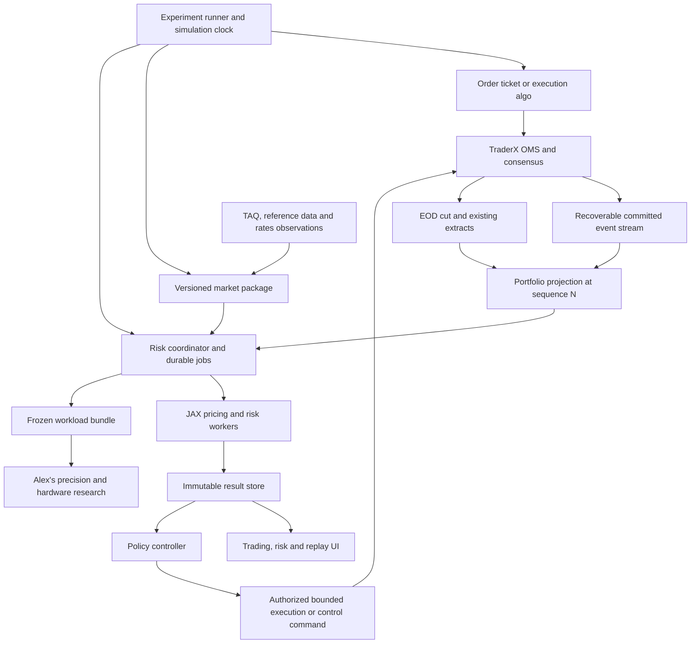

# System architecture

Status: target design. Existing foundations and missing pieces are separated in [the baseline](07-baseline-and-decisions.md). The component boundaries below are logical; initially several can share one service/process.

## Components and owners

| Component | Responsibilities | Owner | Starting point |
|---|---|---|---|
| TraderX OMS | Orders, fills, OTC bookings, account admission, controls and committed history | Yaakov | Existing YU17 |
| Portfolio event adapter/projector | Recoverable event capture, epoch-qualified identities, quantities, cost bases and individual contracts | Yaakov | New integration component; existing feeds are inputs to audit |
| Market-data package service | Dated observations, reference data, corporate actions, quality and replay availability | Yaakov | Extend TAQ/kdb/FRED infrastructure |
| Pricing-input builder | Curves, surfaces, schedules, factor mapping and model calibration | Alex, using Yaakov's observations | Extend existing engine |
| Risk coordinator | Freeze portfolio/market versions, schedule jobs, deduplicate, retry and persist results | Yaakov | New integration service |
| JAX analytics worker | Valuation, Greeks, stress/scenario P&L, VaR/ES, hedge analytics and precision profiles | Alex | Extend existing engine/API |
| Risk result store/API | Immutable run records, indexed summaries, per-instrument drill-down and suitability/freshness checks | Yaakov | New service boundary |
| Policy controller | Convert eligible results into bounded proposals and execution actions | Yaakov | Extend algo/control mechanisms |
| Experiment runner | Repeatable replay, frozen-portfolio and trading-portfolio experiments | Yaakov with Alex's analytic evaluators | Extend sandbox/replay |
| Compute research runner | Hardware execution, precision comparison, profiling and numerical reference results | Alex | His Google/JAX project |
| Console | Trading what-if, live risk, replay comparison, EOD risk and operational status | Yaakov | Extend current console |

## Data flow

Every arrow across a process boundary has an explicit identity, schema, failure behavior and owner. Event bus subjects and new API routes in this pack are proposals until implemented.

## Live desk

1. Consume committed fills and OTC bookings, not order-submission acknowledgements as a substitute for the economic event. A resting unfilled order affects potential exposure, not executed position quantity.
2. Deduplicate and apply events to the portfolio projection. Keep OTC contracts individually; equal notionals can represent different cashflows.
3. Freeze an immutable portfolio version and compatible market package for each calculation. Later fills never mutate a running job's inputs.
4. Recompute positions/cheap sensitivities on relevant changes. Coalesce mark updates and schedule full revaluation at a separately configured cadence. A partial-update shortcut must be checked against a full recalculation.
5. Publish a result with source sequence, market time, coverage and calculation method. A fast approximation must not silently replace an exact/reference result.
6. Reconcile the projection at an EOD sequence against the authoritative extract. Compare exact accounting quantities and terms, and compare valuations only when their input and convention versions match.

Initial cadence candidates are sub-second-to-seconds for small exposure updates and seconds-to-minutes for large scenario jobs. These are product hypotheses to measure, not existing service-level guarantees. Configure bounded queues, cancellation/supersession and per-account fairness before raising job frequency.

## Event completeness and recovery

The current trade bridge has a bounded queue that can drop and uses best-effort publication. Epoch appears in `sourceOrderId`, but the encoded trade ID is a trade sequence plus side; it is not a sufficient global identity. The bridge does not export a full consensus watermark. The current OTC artifact supplies EOD terms; it is not a complete live OTC event feed.

Add an authoritative, recoverable integration path with source epoch, source sequence and ordinal. Either capture the needed events durably with replay checkpoints or rebuild from an authoritative log/snapshot and replay its tail. Select the concrete recovery mechanism in D02; do not assume enabling a NATS subscription makes delivery durable.

A filtered trade stream cannot detect loss by expecting consecutive consensus numbers: most consensus events are not trades. Carry a contiguous integration-stream cursor or explicit source watermarks/manifests, and map those back to consensus boundaries. Apply all records from one source transition before claiming to be complete through its sequence.

Start from an EOD cut at N, then apply events strictly after N in the same epoch. If an intraday baseline is needed, build a consistent snapshot/export mechanism; do not quiesce the cluster every few seconds using the EOD workflow. During an unrecoverable gap, mark risk incomplete and prevent it from driving automatic risk-increasing actions. A UI may retain a labelled last-good result.

## Time, identity and provenance

Keep four dimensions separate: committed portfolio sequence, valuation/market time, data availability time, and calculation completion time. A later completion time does not make an older portfolio current.

In live operation, a result can lag both trades and prices. Expose both lags. In historical operation, a record must have been available by the simulation time; an EOD close or revised rate released later cannot be used earlier in the replay. Wall time measures runtime and queue latency, not simulated economic time.

Every reset/seek starts a new experiment run or explicitly restores a full saved state. It invalidates previous pending jobs and policy actions. Cluster epoch, replay run and portfolio sequence are separate identities; the gateway process-start timestamp is not a cluster epoch.

## Historical laboratory

The runner freezes a corpus manifest, initial holdings/cash, order program, execution model, latency model, risk policy, fee model and scenario/calibration versions. It controls the simulation clock through the existing replay/sandbox mechanisms, with an isolated OMS instance or enforced run boundary.

Two experiment modes are first-class:

- Frozen portfolio: holdings fixed while market inputs move; used for forecast evaluation and model comparison.
- Trading portfolio: orders and hedges change holdings/cash; used for execution, inventory and strategy comparison.

Use the same observations and controlled random inputs to compare Direct, TWAP and risk-aware execution. Historical prints do not prove a hypothetical order's fill. If the data cannot reconstruct queues, state a bounded fill/liquidity approximation. Model partial fills, spread, fees, participation, latency and any chosen market impact. Report sensitivity to these assumptions.

The integration must value executed positions, reserved/open orders and proposed hedges separately. Do not count a market trade from TAQ as an account fill. Add a cashflow ledger for fees, dividends, coupons and other supported lifecycle events before claiming economic P&L across days.

## Risk-aware execution and hedging

Use three modes: advisory what-if, shadow policy, and explicitly enabled bounded execution. In shadow mode, record decisions but place no orders. Promotion between modes is a configured product action with actor/audit data, not a side effect of receiving a risk result.

An action references the result, policy version, expected portfolio epoch/version, validity window, account and instrument scope. Check current holdings plus working orders and in-flight hedges before acting. Reject or recompute stale what-if results. Use idempotency keys, quantity/participation caps, minimum benefit/cost thresholds, cooldowns, hysteresis and action-rate limits to prevent churn or repeated hedging. Resolve ambiguous acknowledgements before resubmission.

Existing hard admission checks remain authoritative. A hedge still passes them. Externally computed policy updates enter consensus as explicit data; deterministic apply performs no remote lookup or numerical optimization. Replicate the accepted numeric payload rather than recomputing Monte Carlo on members. Seeds support experiment reproducibility but do not guarantee bit-identical arithmetic across hardware.

Never implement risk permission as a reusable token detached from concurrent orders. Any future risk-based admission budget needs atomic reservations/consumption and a defined policy for stale analytics. This is separate from advisory what-if.

## Cross-asset and research integration

Each pricing profile declares supported products/conventions and required inputs. Cash equities/ETFs connect the TAQ corpus first; USD swaps and European swaptions connect Alex's present strengths; bonds/options extend the shared portfolio. Missing inputs remain explicit failures or partial-coverage results.

Alex can benchmark an immutable workload without a running TraderX cluster. Yaakov can run the platform with a local CPU worker or a contract-test worker while accelerator work continues. A contract-test worker proves transport only and must be visibly labelled as such.

Start with separate local processes and one worker. Move to cloud workers behind the same job boundary, with private authenticated connectivity, bounded capacity and persistent artifacts. Interactive calculations and large benchmark jobs need separate scheduling quotas. ORE date/schedule preparation remains CPU work unless measured otherwise; JAX tensors are the accelerator boundary.

## Console additions

| Surface | Intended additions |
|---|---|
| Trading `/` | Before/after what-if; executed, working-order and proposed exposure; risk badges and per-contract drill-down |
| Proposed `/risk` | Account/portfolio overview, factor sensitivities, scenario P&L, VaR/ES, coverage, staleness and risk contributions |
| `/replay` and `/sandbox` | Experiment configuration, isolated runs, policy comparison, execution/economic P&L and forecast evaluation |
| `/corpus` and `/kdb` | Data-quality/availability views and stable export manifests; historical query compatibility |
| `/eod` | Risk job progress and results linked to the exact extract, including explicit failed/partial states |
| `/admin` | Policy versions, scope/caps, shadow/enabled status, disable action and audit history |
| `/system` | Projection lag/gaps, worker health, queue age, calculation time, device and actual precision |

Retain open read-only views where appropriate to the demo. Apply existing sign-in/authorization patterns to mutations and enforce them on the server. Browser state alone must never enable automated execution.
