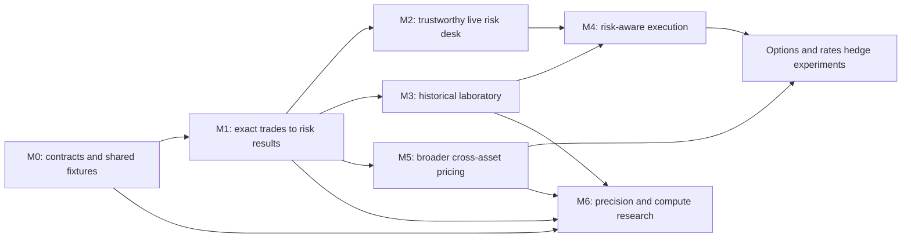

# Delivery plan and acceptance milestones

Status: proposed sequence, not calendar estimates or completed work. Milestones name demonstrable behavior. Alex's research work continues alongside the product work, with frozen workload interfaces reducing coupling.

## Dependency map

M5 capability work can begin while M2/M3 are in progress. M6 starts with contract-compatible fixtures and grows into measurements on real exported workloads. This is workstream concurrency, not a requirement to deploy distributed hardware early.

## M0 — Shared contract and reproducible development boundary

Deliver versioned schemas, one generated equity fixture, one generated USD-SOFR contract fixture, an explicitly labelled test market package, a result example and a capability matrix. Both repositories must validate the same examples. Freeze exact terms, curve conventions and ID/unit rules before calling an adapter financially correct.

Yaakov leads `Y-F01`–`Y-F05`, `Y-I01`, `Y-I02`, `Y-D01`. Alex leads `A-F01`–`A-F05`, `A-M01`, `A-N01`. Joint decisions D01–D06 establish identity, event recovery, product semantics, dates and curve definitions. Decide who publishes the schema package; default proposal is this branch supplies an agreed versioned contract package and Alex pins its release/hash.

Exit: V1 passes for both producers/consumers. Missing/unknown fields and altered hashes fail intelligibly. A contract-test worker is labelled transport-only. No numerical benchmark or live integration claim follows from mocks.

## M1 — Exact booked positions to visible risk

Deliver two genuine paths: an equity fill into a position valuation, and a newly booked USD-SOFR contract into NPV and signed rate sensitivity. Use the existing EOD cut/artifacts, a durable integration job and a result displayed under the corresponding account/contract. Identity must be demonstrated from the original order/booking, not retyped into Alex's demo.

Yaakov leads `Y-I01`–`Y-I07`, `Y-D02`, `Y-U01`, `Y-U02`, `Y-V01`. Alex leads `A-P01`, `A-P02`, `A-P03`, `A-P04`, `A-S01`, `A-S02`, `A-O01`, `A-O02`. A proper USD-SOFR builder is a blocker for the swap proof; a generic IBOR substitute is not a completed USD-SOFR integration. Cash equities allow useful progress while those conventions are implemented.

Exit: V2 passes against a same-terms/same-market ORE reference and independent sensitivity checks. Prove payer reversal, quantity/notional scaling, rejection, and duplicate job recovery. Archive input/result hashes, source commits, actual precision and outputs. The test market is explicitly marked assumed; realistic-data ingestion is a distinct achievement.

## M2 — Trustworthy live portfolio risk desk

Deliver event-driven portfolio updates, market-versioned valuations, per-account risk, coverage/freshness badges and an EOD reconciliation report. Distinguish working orders from executed positions. Extend the live stream to OTC contracts rather than waiting for EOD to discover them.

Yaakov leads `Y-E01`–`Y-E07`, `Y-I04`–`Y-I06`, `Y-U03`, `Y-U04`, `Y-U07`, `Y-O01`, `Y-O02`. Alex leads `A-L01`–`A-L05`, `A-S03`, `A-S04`, `A-O03`. Agree initial update cadence from measurements and queue budgets, not presumed accelerator throughput.

Exit: V3 passes with fills, cancellations, OTC bookings, duplicate delivery, an injected missing event, worker restart and epoch reset. Projection holdings/terms at N match the EOD cut at N exactly. A missing event makes the system incomplete until recovery; later job completion cannot overwrite newer results.

## M3 — Historical trading and risk laboratory

Deliver both frozen-portfolio and trading-portfolio experiments on a manifest-selected subset of the TAQ corpus. A controlled simulation clock drives market inputs, orders and risk evaluation. Compare Direct and TWAP using a declared execution model. Scale the corpus after a small set is correct.

Yaakov leads `Y-D03`–`Y-D07`, `Y-R01`–`Y-R07`, `Y-U05`. Alex leads `A-H01`–`A-H07`, `A-R01`–`A-R05`. Lifecycle across dates is required for the instruments enabled in a multi-day run; unsupported ageing must be refused or visibly restrict the run's scope.

Exit: V4 passes, including no future observations/calibration leakage, repeatable run identities and a reset while jobs are pending. Report execution cost, fill rate, cash/fees, inventory exposure, economic P&L and uncertainty. A forecast backtest uses the right holdings and horizon rather than the eventual traded portfolio by accident.

## M4 — Risk-aware execution and hedging

Deliver current-versus-proposed what-if, a shadow risk policy, then opt-in bounded automatic execution in the sandbox. Begin with inventory/concentration-aware equity execution; extend to instrument hedges as the relevant M5 pricers validate. A full options hedge demo depends on both option pricing and the execution controls, not just M4 alone.

Yaakov leads `Y-P01`–`Y-P08`, `Y-U06`, `Y-V04`. Alex leads `A-X01`–`A-X06`, `A-S05`. No numerical return value directly submits an order. The controller owns policy state, retries, caps, authorization and result eligibility.

Exit: V5 passes in advisory and shadow modes before enabled mode. Demonstrate risk changing a bounded execution choice, partial-fill handling, no duplicate hedge after an ambiguous acknowledgement, stale-result refusal and disable precedence. Compare against Direct/TWAP in the same experiment and report tradeoffs rather than promising improvement.

## M5 — Cross-asset pricing and hedge experiments

Deliver Treasury cashflow pricing and curve risk, listed-option pricing/Greeks, then European swaptions with faithful terms. Add corporates and additional rate currencies when their data/models validate. Bermudan/American styles need real exercise schedules/windows. Capability status controls what the UI offers as priced.

Yaakov leads `Y-C01`–`Y-C06`, `Y-D04`, `Y-D05`, `Y-D06`. Alex leads `A-P05`–`A-P10`, `A-M02`–`A-M07`, `A-S06`, `A-R06`. Reuse the existing portfolio/result boundary rather than adding product-specific integration services.

Exit: V6 passes per enabled product/convention. Demonstrate a mixed-asset stress with explainable contributions and consistent reporting currency. Then compare an equity-option hedge or a rates hedge before and after actual execution. Unsupported credit, vol, FX or lifecycle inputs remain visible.

## M6 — Precision and distributed-compute research

Deliver immutable TraderX workload bundles and Alex's benchmark runner across selected CPU/GPU/TPU profiles. Begin numerical reference work at M0/M1; large heterogeneous workloads become available with M3/M5. Research failures do not block ordinary CPU use of validated product paths.

Yaakov leads `Y-B01`–`Y-B04`, `Y-O03`–`Y-O06`, `Y-V05`. Alex leads `A-N01`–`A-N07`, `A-O04`–`A-O06`. Alex selects and implements hardware/precision experiments in his project; Yaakov supplies workload provenance, integration-level latency and outcome comparisons.

Exit: V7/V8 pass. Publish price/Greek errors, Monte Carlo uncertainty, cold/warm runtimes, memory, transfer cost and cost per useful completed workload. Include actual device arithmetic and unsupported profiles. A second experiment can evaluate whether precision/latency differences change the trading policy outcome.

## First implementation queue

1. Both review and resolve the fixture's product semantics and result units (D01–D06, D08). Agreement is a prerequisite for dependent implementation, not a reason to stop independent work.
2. Yaakov captures/export-validates one equity position and one USD-SOFR contract, along with exact provenance. Alex validates the terms against what his builder can represent.
3. Yaakov builds durable request/result handling against a labelled contract-test worker. Alex implements exact swap construction, cash-equity pricing and swap Greeks exposure.
4. Replace the test worker with the real engine and pass M1.
5. Yaakov develops recoverable portfolio egress and historical market packaging. Alex develops incremental sensitivities/scenarios and CPU reference workloads.
6. Converge on M2/M3, then enable M4 only after failure-path tests; grow M5 and M6 alongside them.

## Definition of done

A backlog item is complete only when its stated artifact/behavior and relevant acceptance evidence exist. Each milestone record must name source commits, input hashes, enabled product coverage, commands/run IDs, actual outputs, limitations and any failed checks. Update [the baseline](07-baseline-and-decisions.md) rather than replacing proposed status with an unqualified success claim.

Dates, hardware sizes, supported product counts and latency targets are estimates until measured and agreed. The pending Google credits enable experiments but are not a prerequisite for local contracts, CPU reference results, replay correctness or recovery work.
