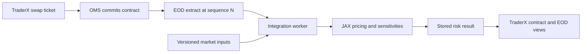

# Review TraderX project features

> The folder that this project is in is my traderX project for my course and OSFF presentation.
>
> There are currently many features that I built off of traderX.
>
> Most of what I've done is listed here: [https://yu-cs-summer-2026-distributed-traderx.github.io/traderX/](https://yu-cs-summer-2026-distributed-traderx.github.io/traderX/)
>
> and there is a lot of info in all the docs in the repo (just be careful of staleness)
>
> There is also a lot of new UI funtionallity:
>
> **Trading (****`/`****)**
>
> - Order entry ticket with six instrument classes: Equity, Option (OCC symbol), Treasury (fraction of par), Corporate bond, Swap, Swaption. Account picker, ticker picker (533-name catalog), side, quantity, execution (Direct or Algo/TWAP), limit price, live-price chip with tape/live provenance.
> - Demo presets: 11 one-click stories (equity fill, price-collar reject, option rest + lift, T-bill, corporate, USD swap, GBP swap PRICE\_MISSING reject, swaption, algo bid + TWAP parent).
> - Blotter and positions per account: Positions (qty, avg cost, last, mkt value, unrealized PnL), Open orders with state filter and per-row cancel, Trades with Force settle and TCA per row, OTC contracts section, lookup by order/trade/trace id (opens a trace view).
> - Activity and rejections feed: every submission with outcome, reject reason, consensus sequence for OTC bookings, cancel from the feed.
>
> **System (****`/system`****)**
>
> - Aeron cluster panel: three members, role, applied sequence, agreement.
> - Latency and throughput metrics, consensus latency per gateway.
> - Service status with Refresh.
>
> **End of day (****`/eod`****)**
>
> - Today's end-of-day chain: Refresh reads the chain, Close session triggers the cut. Verdict reads the extract state including failed.
> - End-of-day session by business date: Load, version stepping, per-security override (form opens inline under the clicked row), Publish, collapse to flagged rows.
> - EOD cut provenance: every risk-extract artifact by date and version, GCS path, rows, sha-256, view link.
>
> **Admin (****`/admin`****)**
>
> - Live trading session driver: pick accounts and an instrument pool, Start, Pause, Resume, Stop, add accounts.
> - Book bands and refusals scanner with Rescan.
> - Open-order controls (cancel any order), algo parent orders, reconciliation with Refresh status and orphan sweep, trade lifecycle with Force settle and TCA.
> - Sign-in required for changes; reads are open.
>
> **Accounts (****`/accounts`****)**
>
> - Trading accounts directory, Enable and Disable per account (engine admission), New account form.
>
> **FIX (****`/fix`****)**
>
> - FIX 4.4 ingress ticket with Price at market.
>
> **Kdb (****`/kdb`****)**
>
> - KDB-X capture tap: capture files per member, corpus day index, fill VWAP by symbol, order final state, sequence gaps, session playback, Load as txTape, and a free-form q box with reset.
>
> **Replay (****`/replay`****, sign-in)**
>
> - Replay clock and tape-by-day view: opens, closes and overnight gaps, single day or whole tape range.
>
> **Sandbox (****`/sandbox`****, sign-in)**
>
> - Replay session: pick a tape day and Go (seek), with a confirmation step, plus the sequenced sandbox reset.
> - Session results: Executions and By tape day, paged 10 at a time, plus a q query box with txExec and txDays presets.
>
> **Corpus (****`/corpus`****, sign-in)**
>
> - Tape corpus browser: position slider through the corpus, every symbol at that position, click a ticker to drill in, q query box with txSlice and txTape presets.
>
> The next goal for the project is integration/figuring out integration with my teammates risk engine that he's working on. &#x20;
>
> [https://github.com/AlexNeugroschl/JAX\_Risk\_Engine](https://github.com/AlexNeugroschl/JAX_Risk_Engine)
>
> How can we integrate. Our professor wats to see something like this:
>
> ### **"4. Integration:&#xA0;**&#xA0;demonstrate:
>
> Order
>
>   ↓
>
> OMS
>
>   ↓
>
> Trade / Position
>
>   ↓
>
> Risk Engine
>
>   ↓
>
> Pricing
>
>   ↓
>
> Greeks / Risk
>
> **Q: “Can you demonstrate one transaction going from the OMS into the risk engine and producing a risk result?” If no, then&#xA0;**
>
> **Q: “What specifically is missing to make that end-to-end flow work?"**
>
> I have 3 tb of NYSE taq data and trades from march-july 2025. He said that he can implement more instruments into his engine.
>
> He is currently using the sample jax data.
>
> I also told him id work on curves if he needs (I think we currently have 1 for treasuries from FRED).
>
> There is also $25000 of google credits on the way so we can think big for compute power.
>
> Here is the full post from my professor just as refrence/context. No need to answer these questions or create the slides:
>
> ### **"FINOS Milestone 1 — TraderX Current Baseline & Integration**
>
> **Goal:** Establish a reproducible baseline of the current TraderX implementation and identify what is required for the next JAX/risk-computation phase.
>
> |   |
> | - |
>
> **Area**
>
> |   |
> | - |
>
> **Identify**
>
> |   |
> | - |
>
> Current State
>
> |   |
> | - |
>
> What actually worked so far?
>
> |   |
> | - |
>
> Architecture
>
> |   |
> | - |
>
> How do the current TraderX components connect?
>
> |   |
> | - |
>
> Instruments
>
> |   |
> | - |
>
> Which instruments are currently supported?
>
> |   |
> | - |
>
> Risk Engine
>
> |   |
> | - |
>
> What pricing/risk functionality has already been implemented?
>
> |   |
> | - |
>
> Integration
>
> |   |
> | - |
>
> Does OMS → Risk Engine currently work end-to-end?
>
> |   |
> | - |
>
> Baseline
>
> |   |
> | - |
>
> What measurable results can currently be reproduced?
>
> |   |
> | - |
>
> Infrastructure
>
> |   |
> | - |
>
> What runs locally/cloud and what compute is required?
>
> |   |
> | - |
>
> Gap
>
> |   |
> | - |
>
> What prevents a complete end-to-end workflow?
>
> -
>
> ### **Risk Engine**
>
> Since this is eventually heading toward **JAX + TPU + numerical precision**, to establish:
>
> 1. **Current implementation**
>
> - What is already ported from the Open Source Risk Engine (ORE)?
> - Which pricing models?
> - Which instruments?
> - Which Greeks?
> - VaR/ES?
> - Monte Carlo?
>
> 2. **Current technology**
>
> Existing implementation
>
>         ↓
>
> Python / NumPy / JAX?
>
>         ↓
>
> CPU / GPU / TPU?
>
>         ↓
>
> FP64?
>
> 3. **Establish a reference result**
>
> For example:
>
> **Instrument:** European swaption
>
> **Method:** Monte Carlo
>
> **Simulations**: N
>
> **Precision:** FP64
>
> **Price:** X
>
> **Runtime:** Y
>
> ### **4. Integration:&#xA0;**&#xA0;demonstrate:
>
> Order
>
>   ↓
>
> OMS
>
>   ↓
>
> Trade / Position
>
>   ↓
>
> Risk Engine
>
>   ↓
>
> Pricing
>
>   ↓
>
> Greeks / Risk
>
> **Q: “Can you demonstrate one transaction going from the OMS into the risk engine and producing a risk result?” If no, then&#xA0;**
>
> **Q: “What specifically is missing to make that end-to-end flow work?**
>
> ### **Milestone 1 deliverable:**
>
> **The deliverable could be just 3–5 slides + current code/demo, organized as:**
>
> **Current Architecture → Component Status → End-to-End Demo → Baseline Results → Integration/Technical Gaps → Next Step"**
>
> Where do we for integration?

<details><summary>6 previous messages</summary>

> I’ll compare TraderX’s current integration points with your teammate’s risk engine, then map out the smallest credible end-to-end demo and what’s missing to make it work. I’ll use the code to check claims in the docs.
>
> <details><summary>Explored a search, ran 4 commands, called a tool, searched the web</summary>
>
> <details><summary>Explored a search</summary>
>
> - Searched for `owner-layer|propagation|risk|JAX` in `MEMORY.md`
>
> </details>
>
> - Ran `pwd; git worktree list --porcelain; git status --short; rg --files -g AGENTS.md -g '*risk*' -g '*jax*' -g '*extract*' -g '*curve*' -g '.openai/hosting.json' | head -160`
>
> Searched the web for `https://yu-cs-summer-2026-distributed-traderx.github.io/traderX/`
>
> - Ran `cat traderX-YU17-otc-rates/AGENTS.md; cat traderX/AGENTS.md; git -C traderX-YU17-otc-rates status --short; git -C traderX-YU17-otc-rates log -1 --format='%h %cs %s'; git -C traderX status --short; git -C traderX log -1 --format='%h %cs %s'; sed -n '255,276p' /Users/yaakov/.codex/memories/MEMORY.md; cat traderX-YU17-otc-rates/docs/engineering/risk-engine-integration-status.md; cat traderX-YU17-otc-rates/docs/handoff/INTEGRATION-jax-risk-engine-inbound-2026-08-17.md`
>
> - Ran `curl -L --fail --max-time 25 -s https://yu-cs-summer-2026-distributed-traderx.github.io/traderX/ -o /tmp/traderx-integration-website.html; wc -c /tmp/traderx-integration-website.html`
>
> - Ran `cat traderX-YU17-otc-rates/docs/handoff/INTEGRATION-jax-risk-engine-2026-08-17.md; rg --files traderX-YU17-otc-rates/specs | rg '(RiskExtract|SwapContractCsv|Curve|Fred|risk-extract|risk-results|jax)' | tail -90; git -C traderX-YU17-otc-rates branch --show-current; git -C traderX-YU17-otc-rates remote -v`
>
> MCP tool call
>
> codex_apps.github.fetch
>
> ```json
> {
>   "url": "https://api.github.com/repos/AlexNeugroschl/JAX_Risk_Engine"
> }
> ```
>
> ```text
> Action completed.
> ```
>
> ```json
> {
>   "content": "{\"id\":1285450092,\"node_id\":\"R_kgDOTJ5pbA\",\"name\":\"JAX_Risk_Engine\",\"full_name\":\"AlexNeugroschl/JAX_Risk_Engine\",\"private\":false,\"owner\":{\"login\":\"AlexNeugroschl\",\"id\":171602663,\"node_id\":\"U_kgDOCjpy5w\",\"avatar_url\":\"https://avatars.githubusercontent.com/u/171602663?v=4\",\"gravatar_id\":\"\",\"url\":\"https://api.github.com/users/AlexNeugroschl\",\"html_url\":\"https://github.com/AlexNeugroschl\",\"followers_url\":\"https://api.github.com/users/AlexNeugroschl/followers\",\"following_url\":\"https://api.github.com/users/AlexNeugroschl/following{/other_user}\",\"gists_url\":\"https://api.github.com/users/AlexNeugroschl/gists{/gist_id}\",\"starred_url\":\"https://api.github.com/users/AlexNeugroschl/starred{/owner}{/repo}\",\"subscriptions_url\":\"https://api.github.com/users/AlexNeugroschl/subscriptions\",\"organizations_url\":\"https://api.github.com/users/AlexNeugroschl/orgs\",\"repos_url\":\"https://api.github.com/users/AlexNeugroschl/repos\",\"events_url\":\"https://api.github.com/users/AlexNeugroschl/events{/privacy}\",\"received_events_url\":\"https://api.github.com/users/AlexNeugroschl/received_events\",\"type\":\"User\",\"user_view_type\":\"public\",\"site_admin\":false},\"html_url\":\"https://github.com/AlexNeugroschl/JAX_Risk_Engine\",\"description\":null,\"fork\":false,\"url\":\"https://api.github.com/repos/AlexNeugroschl/JAX_Risk_Engine\",\"forks_url\":\"https://api.github.com/repos/AlexNeugroschl/JAX_Risk_Engine/forks\",\"keys_url\":\"https://api.github.com/repos/AlexNeugroschl/JAX_Risk_Engine/keys{/key_id}\",\"collaborators_url\":\"https://api.github.com/repos/AlexNeugroschl/JAX_Risk_Engine/collaborators{/collaborator}\",\"teams_url\":\"https://api.github.com/repos/AlexNeugroschl/JAX_Risk_Engine/teams\",\"hooks_url\":\"https://api.github.com/repos/AlexNeugroschl/JAX_Risk_Engine/hooks\",\"issue_events_url\":\"https://api.github.com/repos/AlexNeugroschl/JAX_Risk_Engine/issues/events{/number}\",\"events_url\":\"https://api.github.com/repos/AlexNeugroschl/JAX_Risk_Engine/events\",\"assignees_url\":\"https://api.github.com/repos/AlexNeugroschl/JAX_Risk_Engine/assignees{/user}\",\"branches_url\":\"https://api.github.com/repos/AlexNeugroschl/JAX_Risk_Engine/branches{/branch}\",\"tags_url\":\"https://api.github.com/repos/AlexNeugroschl/JAX_Risk_Engine/tags\",\"blobs_url\":\"https://api.github.com/repos/AlexNeugroschl/JAX_Risk_Engine/git/blobs{/sha}\",\"git_tags_url\":\"https://api.github.com/repos/AlexNeugroschl/JAX_Risk_Engine/git/tags{/sha}\",\"git_refs_url\":\"https://api.github.com/repos/AlexNeugroschl/JAX_Risk_Engine/git/refs{/sha}\",\"trees_url\":\"https://api.github.com/repos/AlexNeugroschl/JAX_Risk_Engine/git/trees{/sha}\",\"statuses_url\":\"https://api.github.com/repos/AlexNeugroschl/JAX_Risk_Engine/statuses/{sha}\",\"languages_url\":\"https://api.github.com/repos/AlexNeugroschl/JAX_Risk_Engine/languages\",\"stargazers_url\":\"https://api.github.com/repos/AlexNeugroschl/JAX_Risk_Engine/stargazers\",\"contributors_url\":\"https://api.github.com/repos/AlexNeugroschl/JAX_Risk_Engine/contributors\",\"subscribers_url\":\"https://api.github.com/repos/AlexNeugroschl/JAX_Risk_Engine/subscribers\",\"subscription_url\":\"https://api.github.com/repos/AlexNeugroschl/JAX_Risk_Engine/subscription\",\"commits_url\":\"https://api.github.com/repos/AlexNeugroschl/JAX_Risk_Engine/commits{/sha}\",\"git_commits_url\":\"https://api.github.com/repos/AlexNeugroschl/JAX_Risk_Engine/git/commits{/sha}\",\"comments_url\":\"https://api.github.com/repos/AlexNeugroschl/JAX_Risk_Engine/comments{/number}\",\"issue_comment_url\":\"https://api.github.com/repos/AlexNeugroschl/JAX_Risk_Engine/issues/comments{/number}\",\"contents_url\":\"https://api.github.com/repos/AlexNeugroschl/JAX_Risk_Engine/contents/{+path}\",\"compare_url\":\"https://api.github.com/repos/AlexNeugroschl/JAX_Risk_Engine/compare/{base}...{head}\",\"merges_url\":\"https://api.github.com/repos/AlexNeugroschl/JAX_Risk_Engine/merges\",\"archive_url\":\"https://api.github.com/repos/AlexNeugroschl/JAX_Risk_Engine/{archive_format}{/ref}\",\"downloads_url\":\"https://api.github.com/repos/AlexNeugroschl/JAX_Risk_Engine/downloads\",\"issues_url\":\"https://api.github.com/repos/AlexNeugroschl/JAX_Risk_Engine/issues{/number}\",\"pulls_url\":\"https://api.github.com/repos/AlexNeugroschl/JAX_Risk_Engine/pulls{/number}\",\"milestones_url\":\"https://api.github.com/repos/AlexNeugroschl/JAX_Risk_Engine/milestones{/number}\",\"notifications_url\":\"https://api.github.com/repos/AlexNeugroschl/JAX_Risk_Engine/notifications{?since,all,participating}\",\"labels_url\":\"https://api.github.com/repos/AlexNeugroschl/JAX_Risk_Engine/labels{/name}\",\"releases_url\":\"https://api.github.com/repos/AlexNeugroschl/JAX_Risk_Engine/releases{/id}\",\"deployments_url\":\"https://api.github.com/repos/AlexNeugroschl/JAX_Risk_Engine/deployments\",\"created_at\":\"2026-06-30T20:20:09Z\",\"updated_at\":\"2026-09-03T18:08:37Z\",\"pushed_at\":\"2026-09-03T18:02:57Z\",\"git_url\":\"git://github.com/AlexNeugroschl/JAX_Risk_Engine.git\",\"ssh_url\":\"git@github.com:AlexNeugroschl/JAX_Risk_Engine.git\",\"clone_url\":\"https://github.com/AlexNeugroschl/JAX_Risk_Engine.git\",\"svn_url\":\"https://github.com/AlexNeugroschl/JAX_Risk_Engine\",\"homepage\":null,\"size\":1116,\"stargazers_count\":0,\"watchers_count\":0,\"language\":\"Python\",\"has_issues\":true,\"has_projects\":true,\"has_downloads\":false,\"has_wiki\":true,\"has_pages\":false,\"has_discussions\":false,\"forks_count\":0,\"mirror_url\":null,\"archived\":false,\"disabled\":false,\"open_issues_count\":0,\"license\":null,\"allow_forking\":true,\"is_template\":false,\"web_commit_signoff_required\":false,\"has_pull_requests\":true,\"pull_request_creation_policy\":\"all\",\"topics\":[],\"visibility\":\"public\",\"forks\":0,\"open_issues\":0,\"watchers\":0,\"default_branch\":\"main\",\"permissions\":{\"admin\":false,\"maintain\":false,\"push\":false,\"triage\":false,\"pull\":true},\"network_count\":0,\"subscribers_count\":0}",
>   "title": "JAX_Risk_Engine",
>   "modified_date": null,
>   "url": "https://api.github.com/repos/AlexNeugroschl/JAX_Risk_Engine",
>   "display_url": "https://api.github.com/repos/AlexNeugroschl/JAX_Risk_Engine",
>   "display_title": "JAX_Risk_Engine",
>   "structuredContent": {
>     "title": "JAX_Risk_Engine",
>     "content": "{\"id\":1285450092,\"node_id\":\"R_kgDOTJ5pbA\",\"name\":\"JAX_Risk_Engine\",\"full_name\":\"AlexNeugroschl/JAX_Risk_Engine\",\"private\":false,\"owner\":{\"login\":\"AlexNeugroschl\",\"id\":171602663,\"node_id\":\"U_kgDOCjpy5w\",\"avatar_url\":\"https://avatars.githubusercontent.com/u/171602663?v=4\",\"gravatar_id\":\"\",\"url\":\"https://api.github.com/users/AlexNeugroschl\",\"html_url\":\"https://github.com/AlexNeugroschl\",\"followers_url\":\"https://api.github.com/users/AlexNeugroschl/followers\",\"following_url\":\"https://api.github.com/users/AlexNeugroschl/following{/other_user}\",\"gists_url\":\"https://api.github.com/users/AlexNeugroschl/gists{/gist_id}\",\"starred_url\":\"https://api.github.com/users/AlexNeugroschl/starred{/owner}{/repo}\",\"subscriptions_url\":\"https://api.github.com/users/AlexNeugroschl/subscriptions\",\"organizations_url\":\"https://api.github.com/users/AlexNeugroschl/orgs\",\"repos_url\":\"https://api.github.com/users/AlexNeugroschl/repos\",\"events_url\":\"https://api.github.com/users/AlexNeugroschl/events{/privacy}\",\"received_events_url\":\"https://api.github.com/users/AlexNeugroschl/received_events\",\"type\":\"User\",\"user_view_type\":\"public\",\"site_admin\":false},\"html_url\":\"https://github.com/AlexNeugroschl/JAX_Risk_Engine\",\"description\":null,\"fork\":false,\"url\":\"https://api.github.com/repos/AlexNeugroschl/JAX_Risk_Engine\",\"forks_url\":\"https://api.github.com/repos/AlexNeugroschl/JAX_Risk_Engine/forks\",\"keys_url\":\"https://api.github.com/repos/AlexNeugroschl/JAX_Risk_Engine/keys{/key_id}\",\"collaborators_url\":\"https://api.github.com/repos/AlexNeugroschl/JAX_Risk_Engine/collaborators{/collaborator}\",\"teams_url\":\"https://api.github.com/repos/AlexNeugroschl/JAX_Risk_Engine/teams\",\"hooks_url\":\"https://api.github.com/repos/AlexNeugroschl/JAX_Risk_Engine/hooks\",\"issue_events_url\":\"https://api.github.com/repos/AlexNeugroschl/JAX_Risk_Engine/issues/events{/number}\",\"events_url\":\"https://api.github.com/repos/AlexNeugroschl/JAX_Risk_Engine/events\",\"assignees_url\":\"https://api.github.com/repos/AlexNeugroschl/JAX_Risk_Engine/assignees{/user}\",\"branches_url\":\"https://api.github.com/repos/AlexNeugroschl/JAX_Risk_Engine/branches{/branch}\",\"tags_url\":\"https://api.github.com/repos/AlexNeugroschl/JAX_Risk_Engine/tags\",\"blobs_url\":\"https://api.github.com/repos/AlexNeugroschl/JAX_Risk_Engine/git/blobs{/sha}\",\"git_tags_url\":\"https://api.github.com/repos/AlexNeugroschl/JAX_Risk_Engine/git/tags{/sha}\",\"git_refs_url\":\"https://api.github.com/repos/AlexNeugroschl/JAX_Risk_Engine/git/refs{/sha}\",\"trees_url\":\"https://api.github.com/repos/AlexNeugroschl/JAX_Risk_Engine/git/trees{/sha}\",\"statuses_url\":\"https://api.github.com/repos/AlexNeugroschl/JAX_Risk_Engine/statuses/{sha}\",\"languages_url\":\"https://api.github.com/repos/AlexNeugroschl/JAX_Risk_Engine/languages\",\"stargazers_url\":\"https://api.github.com/repos/AlexNeugroschl/JAX_Risk_Engine/stargazers\",\"contributors_url\":\"https://api.github.com/repos/AlexNeugroschl/JAX_Risk_Engine/contributors\",\"subscribers_url\":\"https://api.github.com/repos/AlexNeugroschl/JAX_Risk_Engine/subscribers\",\"subscription_url\":\"https://api.github.com/repos/AlexNeugroschl/JAX_Risk_Engine/subscription\",\"commits_url\":\"https://api.github.com/repos/AlexNeugroschl/JAX_Risk_Engine/commits{/sha}\",\"git_commits_url\":\"https://api.github.com/repos/AlexNeugroschl/JAX_Risk_Engine/git/commits{/sha}\",\"comments_url\":\"https://api.github.com/repos/AlexNeugroschl/JAX_Risk_Engine/comments{/number}\",\"issue_comment_url\":\"https://api.github.com/repos/AlexNeugroschl/JAX_Risk_Engine/issues/comments{/number}\",\"contents_url\":\"https://api.github.com/repos/AlexNeugroschl/JAX_Risk_Engine/contents/{+path}\",\"compare_url\":\"https://api.github.com/repos/AlexNeugroschl/JAX_Risk_Engine/compare/{base}...{head}\",\"merges_url\":\"https://api.github.com/repos/AlexNeugroschl/JAX_Risk_Engine/merges\",\"archive_url\":\"https://api.github.com/repos/AlexNeugroschl/JAX_Risk_Engine/{archive_format}{/ref}\",\"downloads_url\":\"https://api.github.com/repos/AlexNeugroschl/JAX_Risk_Engine/downloads\",\"issues_url\":\"https://api.github.com/repos/AlexNeugroschl/JAX_Risk_Engine/issues{/number}\",\"pulls_url\":\"https://api.github.com/repos/AlexNeugroschl/JAX_Risk_Engine/pulls{/number}\",\"milestones_url\":\"https://api.github.com/repos/AlexNeugroschl/JAX_Risk_Engine/milestones{/number}\",\"notifications_url\":\"https://api.github.com/repos/AlexNeugroschl/JAX_Risk_Engine/notifications{?since,all,participating}\",\"labels_url\":\"https://api.github.com/repos/AlexNeugroschl/JAX_Risk_Engine/labels{/name}\",\"releases_url\":\"https://api.github.com/repos/AlexNeugroschl/JAX_Risk_Engine/releases{/id}\",\"deployments_url\":\"https://api.github.com/repos/AlexNeugroschl/JAX_Risk_Engine/deployments\",\"created_at\":\"2026-06-30T20:20:09Z\",\"updated_at\":\"2026-09-03T18:08:37Z\",\"pushed_at\":\"2026-09-03T18:02:57Z\",\"git_url\":\"git://github.com/AlexNeugroschl/JAX_Risk_Engine.git\",\"ssh_url\":\"git@github.com:AlexNeugroschl/JAX_Risk_Engine.git\",\"clone_url\":\"https://github.com/AlexNeugroschl/JAX_Risk_Engine.git\",\"svn_url\":\"https://github.com/AlexNeugroschl/JAX_Risk_Engine\",\"homepage\":null,\"size\":1116,\"stargazers_count\":0,\"watchers_count\":0,\"language\":\"Python\",\"has_issues\":true,\"has_projects\":true,\"has_downloads\":false,\"has_wiki\":true,\"has_pages\":false,\"has_discussions\":false,\"forks_count\":0,\"mirror_url\":null,\"archived\":false,\"disabled\":false,\"open_issues_count\":0,\"license\":null,\"allow_forking\":true,\"is_template\":false,\"web_commit_signoff_required\":false,\"has_pull_requests\":true,\"pull_request_creation_policy\":\"all\",\"topics\":[],\"visibility\":\"public\",\"forks\":0,\"open_issues\":0,\"watchers\":0,\"default_branch\":\"main\",\"permissions\":{\"admin\":false,\"maintain\":false,\"push\":false,\"triage\":false,\"pull\":true},\"network_count\":0,\"subscribers_count\":0}",
>     "display_url": "https://api.github.com/repos/AlexNeugroschl/JAX_Risk_Engine"
>   }
> }
> ```
>
> </details>
>
> I found that the older integration docs understate what TraderX now supplies: YU17 exports both positions and detailed swap/swaption contracts from the same end-of-day cut. That makes a swap a promising first demo. I’m checking whether Alex’s current code can consume those terms and which market inputs it needs.
>
> <details><summary>Explored 4 searches, a list, ran a command, called 8 tools</summary>
>
> MCP tool call
>
> codex_apps.github.fetch
>
> ```json
> {
>   "url": "https://api.github.com/repos/AlexNeugroschl/JAX_Risk_Engine/git/trees/main?recursive=1"
> }
> ```
>
> ```text
> Action completed.
> ```
>
> ```json
> {
>   "content": "{\"sha\":\"2f69827494858120f379aba2ac63013c4936bee9\",\"url\":\"https://api.github.com/repos/AlexNeugroschl/JAX_Risk_Engine/git/trees/2f69827494858120f379aba2ac63013c4936bee9\",\"tree\":[{\"path\":\".gitignore\",\"mode\":\"100644\",\"type\":\"blob\",\"sha\":\"da585040b0f74d41b56391a1dc17adf8c76f1a62\",\"size\":237,\"url\":\"https://api.github.com/repos/AlexNeugroschl/JAX_Risk_Engine/git/blobs/da585040b0f74d41b56391a1dc17adf8c76f1a62\"},{\"path\":\"README.md\",\"mode\":\"100644\",\"type\":\"blob\",\"sha\":\"341d9e13280535dd036f74f2e6e910f5c01c9cd5\",\"size\":2137,\"url\":\"https://api.github.com/repos/AlexNeugroschl/JAX_Risk_Engine/git/blobs/341d9e13280535dd036f74f2e6e910f5c01c9cd5\"},{\"path\":\"demos\",\"mode\":\"040000\",\"type\":\"tree\",\"sha\":\"b390f58e7f5685ea54a842a52039fdb363c22491\",\"url\":\"https://api.github.com/repos/AlexNeugroschl/JAX_Risk_Engine/git/trees/b390f58e7f5685ea54a842a52039fdb363c22491\"},{\"path\":\"demos/demo.py\",\"mode\":\"100644\",\"type\":\"blob\",\"sha\":\"d5ca90f39ac7388c7bb671e12901548c51fe8bff\",\"size\":7664,\"url\":\"https://api.github.com/repos/AlexNeugroschl/JAX_Risk_Engine/git/blobs/d5ca90f39ac7388c7bb671e12901548c51fe8bff\"},{\"path\":\"demos/demo_api.py\",\"mode\":\"100644\",\"type\":\"blob\",\"sha\":\"4b1ee4fdbc336470b4d08110e0862ecfeba217fa\",\"size\":11526,\"url\":\"https://api.github.com/repos/AlexNeugroschl/JAX_Risk_Engine/git/blobs/4b1ee4fdbc336470b4d08110e0862ecfeba217fa\"},{\"path\":\"demos/demo_structured.py\",\"mode\":\"100644\",\"type\":\"blob\",\"sha\":\"6e3c1708dcb13927dcdf62d3eadea67af0e9d9ce\",\"size\":15868,\"url\":\"https://api.github.com/repos/AlexNeugroschl/JAX_Risk_Engine/git/blobs/6e3c1708dcb13927dcdf62d3eadea67af0e9d9ce\"},{\"path\":\"docs\",\"mode\":\"040000\",\"type\":\"tree\",\"sha\":\"b48e46205f66380ece39dc2a8057c544cfe338d5\",\"url\":\"https://api.github.com/repos/AlexNeugroschl/JAX_Risk_Engine/git/trees/b48e46205f66380ece39dc2a8057c544cfe338d5\"},{\"path\":\"docs/README.md\",\"mode\":\"100644\",\"type\":\"blob\",\"sha\":\"c74727db3dedc716ecb84588dd3f6ab9abfef02c\",\"size\":5786,\"url\":\"https://api.github.com/repos/AlexNeugroschl/JAX_Risk_Engine/git/blobs/c74727db3dedc716ecb84588dd3f6ab9abfef02c\"},{\"path\":\"docs/concepts\",\"mode\":\"040000\",\"type\":\"tree\",\"sha\":\"49d83bee376dcb88f46a4e517138547fe18b6792\",\"url\":\"https://api.github.com/repos/AlexNeugroschl/JAX_Risk_Engine/git/trees/49d83bee376dcb88f46a4e517138547fe18b6792\"},{\"path\":\"docs/concepts/architecture.md\",\"mode\":\"100644\",\"type\":\"blob\",\"sha\":\"f5a8156b7147eb589d561723d25a4bafd7302107\",\"size\":52736,\"url\":\"https://api.github.com/repos/AlexNeugroschl/JAX_Risk_Engine/git/blobs/f5a8156b7147eb589d561723d25a4bafd7302107\"},{\"path\":\"docs/concepts/coding-style.md\",\"mode\":\"100644\",\"type\":\"blob\",\"sha\":\"07017b30645ac771141583514a1b3fda58f0345b\",\"size\":3837,\"url\":\"https://api.github.com/repos/AlexNeugroschl/JAX_Risk_Engine/git/blobs/07017b30645ac771141583514a1b3fda58f0345b\"},{\"path\":\"docs/concepts/glossary.md\",\"mode\":\"100644\",\"type\":\"blob\",\"sha\":\"61cfc7c16e26af008870ad1fd25e7dd66dac6e67\",\"size\":12316,\"url\":\"https://api.github.com/repos/AlexNeugroschl/JAX_Risk_Engine/git/blobs/61cfc7c16e26af008870ad1fd25e7dd66dac6e67\"},{\"path\":\"docs/concepts/market-simulation.md\",\"mode\":\"100644\",\"type\":\"blob\",\"sha\":\"9f8f2a96e61993c7319f5ad082dd054875747b45\",\"size\":14105,\"url\":\"https://api.github.com/repos/AlexNeugroschl/JAX_Risk_Engine/git/blobs/9f8f2a96e61993c7319f5ad082dd054875747b45\"},{\"path\":\"docs/getting-started\",\"mode\":\"040000\",\"type\":\"tree\",\"sha\":\"d4cec32d2d8621287d36a0c623a288e9c37b0d43\",\"url\":\"https://api.github.com/repos/AlexNeugroschl/JAX_Risk_Engine/git/trees/d4cec32d2d8621287d36a0c623a288e9c37b0d43\"},{\"path\":\"docs/getting-started/overview.md\",\"mode\":\"100644\",\"type\":\"blob\",\"sha\":\"3a606320b613b72d5eacab45bdd925f2f5959bec\",\"size\":7343,\"url\":\"https://api.github.com/repos/AlexNeugroschl/JAX_Risk_Engine/git/blobs/3a606320b613b72d5eacab45bdd925f2f5959bec\"},{\"path\":\"docs/getting-started/user-guide.md\",\"mode\":\"100644\",\"type\":\"blob\",\"sha\":\"803200fea03409150fdcf5b72988576ebfe55be2\",\"size\":23293,\"url\":\"https://api.github.com/repos/AlexNeugroschl/JAX_Risk_Engine/git/blobs/803200fea03409150fdcf5b72988576ebfe55be2\"},{\"path\":\"docs/instruments\",\"mode\":\"040000\",\"type\":\"tree\",\"sha\":\"e2c4e72b40ea2e5cb3f7ffef361b71481322fdc6\",\"url\":\"https://api.github.com/repos/AlexNeugroschl/JAX_Risk_Engine/git/trees/e2c4e72b40ea2e5cb3f7ffef361b71481322fdc6\"},{\"path\":\"docs/instruments/american-bermudan-swaptions.md\",\"mode\":\"100644\",\"type\":\"blob\",\"sha\":\"5ec91c8590c8e27bed8712b2af2136a5a2997c0b\",\"size\":25550,\"url\":\"https://api.github.com/repos/AlexNeugroschl/JAX_Risk_Engine/git/blobs/5ec91c8590c8e27bed8712b2af2136a5a2997c0b\"},{\"path\":\"docs/instruments/european-swaptions.md\",\"mode\":\"100644\",\"type\":\"blob\",\"sha\":\"322a5e57ec9bfc51cd47664a49425b6d07b53cea\",\"size\":14627,\"url\":\"https://api.github.com/repos/AlexNeugroschl/JAX_Risk_Engine/git/blobs/322a5e57ec9bfc51cd47664a49425b6d07b53cea\"},{\"path\":\"docs/instruments/swaps.md\",\"mode\":\"100644\",\"type\":\"blob\",\"sha\":\"c134cd64707fd42570542a6467f4b20f3ab8a1fe\",\"size\":10792,\"url\":\"https://api.github.com/repos/AlexNeugroschl/JAX_Risk_Engine/git/blobs/c134cd64707fd42570542a6467f4b20f3ab8a1fe\"},{\"path\":\"docs/planning\",\"mode\":\"040000\",\"type\":\"tree\",\"sha\":\"f80cdfed82517a8144dada765de1ef6a20a450b6\",\"url\":\"https://api.github.com/repos/AlexNeugroschl/JAX_Risk_Engine/git/trees/f80cdfed82517a8144dada765de1ef6a20a450b6\"},{\"path\":\"docs/planning/roadmap-and-history.md\",\"mode\":\"100644\",\"type\":\"blob\",\"sha\":\"4e48de9adb6121dc66305c8f65be5885e6634f4a\",\"size\":5232,\"url\":\"https://api.github.com/repos/AlexNeugroschl/JAX_Risk_Engine/git/blobs/4e48de9adb6121dc66305c8f65be5885e6634f4a\"},{\"path\":\"docs/planning/traderx-bond-integration-roadmap.md\",\"mode\":\"100644\",\"type\":\"blob\",\"sha\":\"e5dffd18e62dc3da7ea31e0ba617e5c6ed5c1b56\",\"size\":41853,\"url\":\"https://api.github.com/repos/AlexNeugroschl/JAX_Risk_Engine/git/blobs/e5dffd18e62dc3da7ea31e0ba617e5c6ed5c1b56\"},{\"path\":\"docs/planning/traderx-integration.md\",\"mode\":\"100644\",\"type\":\"blob\",\"sha\":\"80f14f2311f0989162fddf23bf4f5b6538a1fa69\",\"size\":13846,\"url\":\"https://api.github.com/repos/AlexNeugroschl/JAX_Risk_Engine/git/blobs/80f14f2311f0989162fddf23bf4f5b6538a1fa69\"},{\"path\":\"docs/reference\",\"mode\":\"040000\",\"type\":\"tree\",\"sha\":\"31896446134d0a9de5e27c4ae41457b6c927ab49\",\"url\":\"https://api.github.com/repos/AlexNeugroschl/JAX_Risk_Engine/git/trees/31896446134d0a9de5e27c4ae41457b6c927ab49\"},{\"path\":\"docs/reference/api-reference.md\",\"mode\":\"100644\",\"type\":\"blob\",\"sha\":\"fe0654bec60dbd32ac6687d8c57ccfef5828f3b2\",\"size\":39069,\"url\":\"https://api.github.com/repos/AlexNeugroschl/JAX_Risk_Engine/git/blobs/fe0654bec60dbd32ac6687d8c57ccfef5828f3b2\"},{\"path\":\"docs/reference/calibration.md\",\"mode\":\"100644\",\"type\":\"blob\",\"sha\":\"c2694ffeed4f76762f20af5c75902ba3b25b956b\",\"size\":20406,\"url\":\"https://api.github.com/repos/AlexNeugroschl/JAX_Risk_Engine/git/blobs/c2694ffeed4f76762f20af5c75902ba3b25b956b\"},{\"path\":\"docs/reference/http-api.md\",\"mode\":\"100644\",\"type\":\"blob\",\"sha\":\"c98269806f70ebc1e28ff9d4a90b36acebd1bc94\",\"size\":20478,\"url\":\"https://api.github.com/repos/AlexNeugroschl/JAX_Risk_Engine/git/blobs/c98269806f70ebc1e28ff9d4a90b36acebd1bc94\"},{\"path\":\"docs/reference/models-and-trades.md\",\"mode\":\"100644\",\"type\":\"blob\",\"sha\":\"8aa2634beeb1b29f5f9dc85bc505d3a3e4237963\",\"size\":20971,\"url\":\"https://api.github.com/repos/AlexNeugroschl/JAX_Risk_Engine/git/blobs/8aa2634beeb1b29f5f9dc85bc505d3a3e4237963\"},{\"path\":\"docs/reference/ore-parity.md\",\"mode\":\"100644\",\"type\":\"blob\",\"sha\":\"b2f96293d578a64b94b0de9093179f7ba1a95877\",\"size\":44481,\"url\":\"https://api.github.com/repos/AlexNeugroschl/JAX_Risk_Engine/git/blobs/b2f96293d578a64b94b0de9093179f7ba1a95877\"},{\"path\":\"docs/reference/portfolio-entrypoint.md\",\"mode\":\"100644\",\"type\":\"blob\",\"sha\":\"f595a32e91ec3e9c6157be0785a765ca51f125e5\",\"size\":14869,\"url\":\"https://api.github.com/repos/AlexNeugroschl/JAX_Risk_Engine/git/blobs/f595a32e91ec3e9c6157be0785a765ca51f125e5\"},{\"path\":\"docs/risk\",\"mode\":\"040000\",\"type\":\"tree\",\"sha\":\"c91cd5e7052be9e3029d5204457821e41ef7005d\",\"url\":\"https://api.github.com/repos/AlexNeugroschl/JAX_Risk_Engine/git/trees/c91cd5e7052be9e3029d5204457821e41ef7005d\"},{\"path\":\"docs/risk/greeks.md\",\"mode\":\"100644\",\"type\":\"blob\",\"sha\":\"f6f30882f414d15ab1140c683ba5fe5b9c689990\",\"size\":23447,\"url\":\"https://api.github.com/repos/AlexNeugroschl/JAX_Risk_Engine/git/blobs/f6f30882f414d15ab1140c683ba5fe5b9c689990\"},{\"path\":\"docs/risk/var_es.md\",\"mode\":\"100644\",\"type\":\"blob\",\"sha\":\"9756c16ab9be056635c4f9b57fc4215a29a27b60\",\"size\":8412,\"url\":\"https://api.github.com/repos/AlexNeugroschl/JAX_Risk_Engine/git/blobs/9756c16ab9be056635c4f9b57fc4215a29a27b60\"},{\"path\":\"engine\",\"mode\":\"040000\",\"type\":\"tree\",\"sha\":\"b80d86e916caee0c516fc5a8050028b10b97c119\",\"url\":\"https://api.github.com/repos/AlexNeugroschl/JAX_Risk_Engine/git/trees/b80d86e916caee0c516fc5a8050028b10b97c119\"},{\"path\":\"engine/__init__.py\",\"mode\":\"100644\",\"type\":\"blob\",\"sha\":\"e69de29bb2d1d6434b8b29ae775ad8c2e48c5391\",\"size\":0,\"url\":\"https://api.github.com/repos/AlexNeugroschl/JAX_Risk_Engine/git/blobs/e69de29bb2d1d6434b8b29ae775ad8c2e48c5391\"},{\"path\":\"engine/api\",\"mode\":\"040000\",\"type\":\"tree\",\"sha\":\"377bca76527697988f4c26144c307f7b2f00b071\",\"url\":\"https://api.github.com/repos/AlexNeugroschl/JAX_Risk_Engine/git/trees/377bca76527697988f4c26144c307f7b2f00b071\"},{\"path\":\"engine/api/__init__.py\",\"mode\":\"100644\",\"type\":\"blob\",\"sha\":\"e69de29bb2d1d6434b8b29ae775ad8c2e48c5391\",\"size\":0,\"url\":\"https://api.github.com/repos/AlexNeugroschl/JAX_Risk_Engine/git/blobs/e69de29bb2d1d6434b8b29ae775ad8c2e48c5391\"},{\"path\":\"engine/api/app.py\",\"mode\":\"100644\",\"type\":\"blob\",\"sha\":\"7f2b2bec6e50942d6a9a7f0a239e9c7add32baa2\",\"size\":887,\"url\":\"https://api.github.com/repos/AlexNeugroschl/JAX_Risk_Engine/git/blobs/7f2b2bec6e50942d6a9a7f0a239e9c7add32baa2\"},{\"path\":\"engine/api/routes.py\",\"mode\":\"100644\",\"type\":\"blob\",\"sha\":\"b67d5555aaa65473704ad50424295b30e1f654ea\",\"size\":8715,\"url\":\"https://api.github.com/repos/AlexNeugroschl/JAX_Risk_Engine/git/blobs/b67d5555aaa65473704ad50424295b30e1f654ea\"},{\"path\":\"engine/api/schemas.py\",\"mode\":\"100644\",\"type\":\"blob\",\"sha\":\"dd2e71be10deb6d941d826530ae15ab1377b0769\",\"size\":18621,\"url\":\"https://api.github.com/repos/AlexNeugroschl/JAX_Risk_Engine/git/blobs/dd2e71be10deb6d941d826530ae15ab1377b0769\"},{\"path\":\"engine/calibration\",\"mode\":\"040000\",\"type\":\"tree\",\"sha\":\"a0f2aa1ebde68207a0afd4e7aa5b4b031cd9d2cf\",\"url\":\"https://api.github.com/repos/AlexNeugroschl/JAX_Risk_Engine/git/trees/a0f2aa1ebde68207a0afd4e7aa5b4b031cd9d2cf\"},{\"path\":\"engine/calibration/__init__.py\",\"mode\":\"100644\",\"type\":\"blob\",\"sha\":\"e69de29bb2d1d6434b8b29ae775ad8c2e48c5391\",\"size\":0,\"url\":\"https://api.github.com/repos/AlexNeugroschl/JAX_Risk_Engine/git/blobs/e69de29bb2d1d6434b8b29ae775ad8c2e48c5391\"},{\"path\":\"engine/calibration/basket.py\",\"mode\":\"100644\",\"type\":\"blob\",\"sha\":\"8bc4ed9c95043297c61157a16ac2de8b09c976b3\",\"size\":17609,\"url\":\"https://api.github.com/repos/AlexNeugroschl/JAX_Risk_Engine/git/blobs/8bc4ed9c95043297c61157a16ac2de8b09c976b3\"},{\"path\":\"engine/calibration/lgm.py\",\"mode\":\"100644\",\"type\":\"blob\",\"sha\":\"c4618f0e9f54926537aafc635a986fc45c78bfd0\",\"size\":8838,\"url\":\"https://api.github.com/repos/AlexNeugroschl/JAX_Risk_Engine/git/blobs/c4618f0e9f54926537aafc635a986fc45c78bfd0\"},{\"path\":\"engine/instruments\",\"mode\":\"040000\",\"type\":\"tree\",\"sha\":\"f73c9001c33e7ba655923c8a6112ee34e8bb8ab6\",\"url\":\"https://api.github.com/repos/AlexNeugroschl/JAX_Risk_Engine/git/trees/f73c9001c33e7ba655923c8a6112ee34e8bb8ab6\"},{\"path\":\"engine/instruments/__init__.py\",\"mode\":\"100644\",\"type\":\"blob\",\"sha\":\"e69de29bb2d1d6434b8b29ae775ad8c2e48c5391\",\"size\":0,\"url\":\"https://api.github.com/repos/AlexNeugroschl/JAX_Risk_Engine/git/blobs/e69de29bb2d1d6434b8b29ae775ad8c2e48c5391\"},{\"path\":\"engine/instruments/american_swaption.py\",\"mode\":\"100644\",\"type\":\"blob\",\"sha\":\"0a0745f1356faa8988a1a035a4cc2645ee93f342\",\"size\":10142,\"url\":\"https://api.github.com/repos/AlexNeugroschl/JAX_Risk_Engine/git/blobs/0a0745f1356faa8988a1a035a4cc2645ee93f342\"},{\"path\":\"engine/instruments/bermudan_swaption.py\",\"mode\":\"100644\",\"type\":\"blob\",\"sha\":\"06dd9327fd1f4cd45e3e450917c66911ce83c007\",\"size\":50580,\"url\":\"https://api.github.com/repos/AlexNeugroschl/JAX_Risk_Engine/git/blobs/06dd9327fd1f4cd45e3e450917c66911ce83c007\"},{\"path\":\"engine/instruments/european_swaption.py\",\"mode\":\"100644\",\"type\":\"blob\",\"sha\":\"11ced2685ce481700184fe27ef7c93f85668439b\",\"size\":32162,\"url\":\"https://api.github.com/repos/AlexNeugroschl/JAX_Risk_Engine/git/blobs/11ced2685ce481700184fe27ef7c93f85668439b\"},{\"path\":\"engine/instruments/swap.py\",\"mode\":\"100644\",\"type\":\"blob\",\"sha\":\"75d035e7bbc5df1722c4777aa1d5e007c0c233ae\",\"size\":13114,\"url\":\"https://api.github.com/repos/AlexNeugroschl/JAX_Risk_Engine/git/blobs/75d035e7bbc5df1722c4777aa1d5e007c0c233ae\"},{\"path\":\"engine/models\",\"mode\":\"040000\",\"type\":\"tree\",\"sha\":\"edc2f5bffc724ba8f57b605addcfeb9cb8158ab3\",\"url\":\"https://api.github.com/repos/AlexNeugroschl/JAX_Risk_Engine/git/trees/edc2f5bffc724ba8f57b605addcfeb9cb8158ab3\"},{\"path\":\"engine/models/__init__.py\",\"mode\":\"100644\",\"type\":\"blob\",\"sha\":\"e69de29bb2d1d6434b8b29ae775ad8c2e48c5391\",\"size\":0,\"url\":\"https://api.github.com/repos/AlexNeugroschl/JAX_Risk_Engine/git/blobs/e69de29bb2d1d6434b8b29ae775ad8c2e48c5391\"},{\"path\":\"engine/models/hull_white.py\",\"mode\":\"100644\",\"type\":\"blob\",\"sha\":\"3be3aa7c6ada3f1b99515b6567e58d548e996a65\",\"size\":11856,\"url\":\"https://api.github.com/repos/AlexNeugroschl/JAX_Risk_Engine/git/blobs/3be3aa7c6ada3f1b99515b6567e58d548e996a65\"},{\"path\":\"engine/models/lgm.py\",\"mode\":\"100644\",\"type\":\"blob\",\"sha\":\"c9c8449818fd90fc04ada104b508965ff4869739\",\"size\":15024,\"url\":\"https://api.github.com/repos/AlexNeugroschl/JAX_Risk_Engine/git/blobs/c9c8449818fd90fc04ada104b508965ff4869739\"},{\"path\":\"engine/models/ore_builders.py\",\"mode\":\"100644\",\"type\":\"blob\",\"sha\":\"bb9f7e4d82c28f91a5a1194344c9b5c203946283\",\"size\":6033,\"url\":\"https://api.github.com/repos/AlexNeugroschl/JAX_Risk_Engine/git/blobs/bb9f7e4d82c28f91a5a1194344c9b5c203946283\"},{\"path\":\"engine/models/static_key.py\",\"mode\":\"100644\",\"type\":\"blob\",\"sha\":\"ca90de6df4f283b619f34c4e456c41cb108e4786\",\"size\":3622,\"url\":\"https://api.github.com/repos/AlexNeugroschl/JAX_Risk_Engine/git/blobs/ca90de6df4f283b619f34c4e456c41cb108e4786\"},{\"path\":\"engine/portfolio\",\"mode\":\"040000\",\"type\":\"tree\",\"sha\":\"78d52c5732ab04f198685f35da461e4a4c322082\",\"url\":\"https://api.github.com/repos/AlexNeugroschl/JAX_Risk_Engine/git/trees/78d52c5732ab04f198685f35da461e4a4c322082\"},{\"path\":\"engine/portfolio/__init__.py\",\"mode\":\"100644\",\"type\":\"blob\",\"sha\":\"497ed780905b8786352f5912f6beee5b0974e0bb\",\"size\":2910,\"url\":\"https://api.github.com/repos/AlexNeugroschl/JAX_Risk_Engine/git/blobs/497ed780905b8786352f5912f6beee5b0974e0bb\"},{\"path\":\"engine/portfolio/request.py\",\"mode\":\"100644\",\"type\":\"blob\",\"sha\":\"e36d7baa02cdcab224cf381e01534e5fcede1a90\",\"size\":45299,\"url\":\"https://api.github.com/repos/AlexNeugroschl/JAX_Risk_Engine/git/blobs/e36d7baa02cdcab224cf381e01534e5fcede1a90\"},{\"path\":\"engine/portfolio/validation.py\",\"mode\":\"100644\",\"type\":\"blob\",\"sha\":\"d48a61367d13691faed9112f9a953b5c7d5c3848\",\"size\":2843,\"url\":\"https://api.github.com/repos/AlexNeugroschl/JAX_Risk_Engine/git/blobs/d48a61367d13691faed9112f9a953b5c7d5c3848\"},{\"path\":\"engine/portfolio/worker_pool.py\",\"mode\":\"100644\",\"type\":\"blob\",\"sha\":\"aa28508ba949f5b3bfed58bee2f1cd93ded1c2a8\",\"size\":13845,\"url\":\"https://api.github.com/repos/AlexNeugroschl/JAX_Risk_Engine/git/blobs/aa28508ba949f5b3bfed58bee2f1cd93ded1c2a8\"},{\"path\":\"engine/risk\",\"mode\":\"040000\",\"type\":\"tree\",\"sha\":\"1b00600e9c30cefdef065d31a4fca98e1109cd01\",\"url\":\"https://api.github.com/repos/AlexNeugroschl/JAX_Risk_Engine/git/trees/1b00600e9c30cefdef065d31a4fca98e1109cd01\"},{\"path\":\"engine/risk/__init__.py\",\"mode\":\"100644\",\"type\":\"blob\",\"sha\":\"e69de29bb2d1d6434b8b29ae775ad8c2e48c5391\",\"size\":0,\"url\":\"https://api.github.com/repos/AlexNeugroschl/JAX_Risk_Engine/git/blobs/e69de29bb2d1d6434b8b29ae775ad8c2e48c5391\"},{\"path\":\"engine/risk/greeks.py\",\"mode\":\"100644\",\"type\":\"blob\",\"sha\":\"58dfd56d75a9eb6473d5782352a1ca7a917727b1\",\"size\":40802,\"url\":\"https://api.github.com/repos/AlexNeugroschl/JAX_Risk_Engine/git/blobs/58dfd56d75a9eb6473d5782352a1ca7a917727b1\"},{\"path\":\"engine/risk/var_es.py\",\"mode\":\"100644\",\"type\":\"blob\",\"sha\":\"54501e3d5cf7f965f309d9d309554ff5bb3c0075\",\"size\":8584,\"url\":\"https://api.github.com/repos/AlexNeugroschl/JAX_Risk_Engine/git/blobs/54501e3d5cf7f965f309d9d309554ff5bb3c0075\"},{\"path\":\"engine/simulation\",\"mode\":\"040000\",\"type\":\"tree\",\"sha\":\"165f4312ce4b9dc953f01c301e944fb7ee0baaa4\",\"url\":\"https://api.github.com/repos/AlexNeugroschl/JAX_Risk_Engine/git/trees/165f4312ce4b9dc953f01c301e944fb7ee0baaa4\"},{\"path\":\"engine/simulation/__init__.py\",\"mode\":\"100644\",\"type\":\"blob\",\"sha\":\"e69de29bb2d1d6434b8b29ae775ad8c2e48c5391\",\"size\":0,\"url\":\"https://api.github.com/repos/AlexNeugroschl/JAX_Risk_Engine/git/blobs/e69de29bb2d1d6434b8b29ae775ad8c2e48c5391\"},{\"path\":\"engine/simulation/demo_scenarios.py\",\"mode\":\"100644\",\"type\":\"blob\",\"sha\":\"3fc726521493537ffd137d106cf747104bc8bad1\",\"size\":7634,\"url\":\"https://api.github.com/repos/AlexNeugroschl/JAX_Risk_Engine/git/blobs/3fc726521493537ffd137d106cf747104bc8bad1\"},{\"path\":\"engine/simulation/market_model.py\",\"mode\":\"100644\",\"type\":\"blob\",\"sha\":\"31b85ad4e3a79163a031295b6090836bcc69a717\",\"size\":32174,\"url\":\"https://api.github.com/repos/AlexNeugroschl/JAX_Risk_Engine/git/blobs/31b85ad4e3a79163a031295b6090836bcc69a717\"},{\"path\":\"pyproject.toml\",\"mode\":\"100644\",\"type\":\"blob\",\"sha\":\"016dd4668b22ff5ba223ac1f9c7174223f9ee2fb\",\"size\":954,\"url\":\"https://api.github.com/repos/AlexNeugroschl/JAX_Risk_Engine/git/blobs/016dd4668b22ff5ba223ac1f9c7174223f9ee2fb\"},{\"path\":\"reference\",\"mode\":\"040000\",\"type\":\"tree\",\"sha\":\"a7ef560a02450dff2fb5b1fc05128599c30a08e3\",\"url\":\"https://api.github.com/repos/AlexNeugroschl/JAX_Risk_Engine/git/trees/a7ef560a02450dff2fb5b1fc05128599c30a08e3\"},{\"path\":\"reference/ORE\",\"mode\":\"160000\",\"type\":\"commit\",\"sha\":\"3b62ba248e36ea92f408f0d863ede09639074836\"},{\"path\":\"reference/traderX\",\"mode\":\"160000\",\"type\":\"commit\",\"sha\":\"cd3967c90b5180512cc13dcd6fec553ff3fcd0f1\"},{\"path\":\"requirements.txt\",\"mode\":\"100644\",\"type\":\"blob\",\"sha\":\"7d52e680c304678a0e37cae95c2ae36022bb7918\",\"size\":520,\"url\":\"https://api.github.com/repos/AlexNeugroschl/JAX_Risk_Engine/git/blobs/7d52e680c304678a0e37cae95c2ae36022bb7918\"},{\"path\":\"tests\",\"mode\":\"040000\",\"type\":\"tree\",\"sha\":\"26fbd45409b0959958fd9d8fbd5b3fc0ea016832\",\"url\":\"https://api.github.com/repos/AlexNeugroschl/JAX_Risk_Engine/git/trees/26fbd45409b0959958fd9d8fbd5b3fc0ea016832\"},{\"path\":\"tests/conftest.py\",\"mode\":\"100644\",\"type\":\"blob\",\"sha\":\"db871324f757470113e4c497f28037260bb7fa90\",\"size\":4385,\"url\":\"https://api.github.com/repos/AlexNeugroschl/JAX_Risk_Engine/git/blobs/db871324f757470113e4c497f28037260bb7fa90\"},{\"path\":\"tests/test_american_swaption.py\",\"mode\":\"100644\",\"type\":\"blob\",\"sha\":\"dfcabfc3b77b85811ff47037dc22cc0146ea7d05\",\"size\":15991,\"url\":\"https://api.github.com/repos/AlexNeugroschl/JAX_Risk_Engine/git/blobs/dfcabfc3b77b85811ff47037dc22cc0146ea7d05\"},{\"path\":\"tests/test_api.py\",\"mode\":\"100644\",\"type\":\"blob\",\"sha\":\"994e20d47a5a754711380ec2a6dc77477a7bd5e9\",\"size\":30517,\"url\":\"https://api.github.com/repos/AlexNeugroschl/JAX_Risk_Engine/git/blobs/994e20d47a5a754711380ec2a6dc77477a7bd5e9\"},{\"path\":\"tests/test_bermudan_swaption.py\",\"mode\":\"100644\",\"type\":\"blob\",\"sha\":\"64924aec8d0b1d8ee0be66d2362e2c8b903c832a\",\"size\":34131,\"url\":\"https://api.github.com/repos/AlexNeugroschl/JAX_Risk_Engine/git/blobs/64924aec8d0b1d8ee0be66d2362e2c8b903c832a\"},{\"path\":\"tests/test_calibration_basket.py\",\"mode\":\"100644\",\"type\":\"blob\",\"sha\":\"83a32f81b2ad970a224041eadf1bd2a60f06a271\",\"size\":14515,\"url\":\"https://api.github.com/repos/AlexNeugroschl/JAX_Risk_Engine/git/blobs/83a32f81b2ad970a224041eadf1bd2a60f06a271\"},{\"path\":\"tests/test_calibration_edge_cases.py\",\"mode\":\"100644\",\"type\":\"blob\",\"sha\":\"6c403db29a7394d32dbf3eecedbab5b1055fb41e\",\"size\":16854,\"url\":\"https://api.github.com/repos/AlexNeugroschl/JAX_Risk_Engine/git/blobs/6c403db29a7394d32dbf3eecedbab5b1055fb41e\"},{\"path\":\"tests/test_calibration_integration.py\",\"mode\":\"100644\",\"type\":\"blob\",\"sha\":\"9a1d8f992cc5d6366fbb084bf85bc179045d7b34\",\"size\":10562,\"url\":\"https://api.github.com/repos/AlexNeugroschl/JAX_Risk_Engine/git/blobs/9a1d8f992cc5d6366fbb084bf85bc179045d7b34\"},{\"path\":\"tests/test_calibration_lgm.py\",\"mode\":\"100644\",\"type\":\"blob\",\"sha\":\"f05492e4f035e9aa249a1b2eca8e42db8b0da7ff\",\"size\":7531,\"url\":\"https://api.github.com/repos/AlexNeugroschl/JAX_Risk_Engine/git/blobs/f05492e4f035e9aa249a1b2eca8e42db8b0da7ff\"},{\"path\":\"tests/test_demo_scenarios.py\",\"mode\":\"100644\",\"type\":\"blob\",\"sha\":\"5cd8f9d8494702ba253008336d318547770e005d\",\"size\":9694,\"url\":\"https://api.github.com/repos/AlexNeugroschl/JAX_Risk_Engine/git/blobs/5cd8f9d8494702ba253008336d318547770e005d\"},{\"path\":\"tests/test_diverse_portfolio_e2e.py\",\"mode\":\"100644\",\"type\":\"blob\",\"sha\":\"42444acc0ec8e6f15caa70122a54870ee2bf1b96\",\"size\":78459,\"url\":\"https://api.github.com/repos/AlexNeugroschl/JAX_Risk_Engine/git/blobs/42444acc0ec8e6f15caa70122a54870ee2bf1b96\"},{\"path\":\"tests/test_end_to_end.py\",\"mode\":\"100644\",\"type\":\"blob\",\"sha\":\"8d1d4d0a9c5ec24f94edd6671c394ebea10adb06\",\"size\":16128,\"url\":\"https://api.github.com/repos/AlexNeugroschl/JAX_Risk_Engine/git/blobs/8d1d4d0a9c5ec24f94edd6671c394ebea10adb06\"},{\"path\":\"tests/test_european_swaption.py\",\"mode\":\"100644\",\"type\":\"blob\",\"sha\":\"847d0c70f64328a0a4d263f7d3cf0e26c8b1e2b2\",\"size\":53094,\"url\":\"https://api.github.com/repos/AlexNeugroschl/JAX_Risk_Engine/git/blobs/847d0c70f64328a0a4d263f7d3cf0e26c8b1e2b2\"},{\"path\":\"tests/test_greeks.py\",\"mode\":\"100644\",\"type\":\"blob\",\"sha\":\"021117749fd9bfff5a4e15a1ec655e2a12fbd080\",\"size\":36120,\"url\":\"https://api.github.com/repos/AlexNeugroschl/JAX_Risk_Engine/git/blobs/021117749fd9bfff5a4e15a1ec655e2a12fbd080\"},{\"path\":\"tests/test_greeks_bermudan.py\",\"mode\":\"100644\",\"type\":\"blob\",\"sha\":\"31cddb0701e1d1fa3e401e998f6625160c72b8be\",\"size\":23653,\"url\":\"https://api.github.com/repos/AlexNeugroschl/JAX_Risk_Engine/git/blobs/31cddb0701e1d1fa3e401e998f6625160c72b8be\"},{\"path\":\"tests/test_market_model.py\",\"mode\":\"100644\",\"type\":\"blob\",\"sha\":\"681f64fc0c6cdfdc29c8552614f92aa9da6c9026\",\"size\":62800,\"url\":\"https://api.github.com/repos/AlexNeugroschl/JAX_Risk_Engine/git/blobs/681f64fc0c6cdfdc29c8552614f92aa9da6c9026\"},{\"path\":\"tests/test_models_piecewise_sigma.py\",\"mode\":\"100644\",\"type\":\"blob\",\"sha\":\"bb9e1607cfb6a82fc50126a3db7660c5ca851055\",\"size\":9923,\"url\":\"https://api.github.com/repos/AlexNeugroschl/JAX_Risk_Engine/git/blobs/bb9e1607cfb6a82fc50126a3db7660c5ca851055\"},{\"path\":\"tests/test_ore_parity.py\",\"mode\":\"100644\",\"type\":\"blob\",\"sha\":\"20b5fd0b6738a5c2b5b620ef9672f216aede99c7\",\"size\":16571,\"url\":\"https://api.github.com/repos/AlexNeugroschl/JAX_Risk_Engine/git/blobs/20b5fd0b6738a5c2b5b620ef9672f216aede99c7\"},{\"path\":\"tests/test_portfolio.py\",\"mode\":\"100644\",\"type\":\"blob\",\"sha\":\"68c0a46ba86488279b3b3510b5cba3f567ac07b9\",\"size\":12745,\"url\":\"https://api.github.com/repos/AlexNeugroschl/JAX_Risk_Engine/git/blobs/68c0a46ba86488279b3b3510b5cba3f567ac07b9\"},{\"path\":\"tests/test_portfolio_entrypoint.py\",\"mode\":\"100644\",\"type\":\"blob\",\"sha\":\"f661b3f8b9f282d4a9a8fffb79d0328f41e1c731\",\"size\":33385,\"url\":\"https://api.github.com/repos/AlexNeugroschl/JAX_Risk_Engine/git/blobs/f661b3f8b9f282d4a9a8fffb79d0328f41e1c731\"},{\"path\":\"tests/test_portfolio_scale_and_edge_cases.py\",\"mode\":\"100644\",\"type\":\"blob\",\"sha\":\"f8721d1279b57a112f617e3d93c1a1c24140b763\",\"size\":20343,\"url\":\"https://api.github.com/repos/AlexNeugroschl/JAX_Risk_Engine/git/blobs/f8721d1279b57a112f617e3d93c1a1c24140b763\"},{\"path\":\"tests/test_swap.py\",\"mode\":\"100644\",\"type\":\"blob\",\"sha\":\"d6b658dc42bd6c25d4f977a7693deabf0d83b721\",\"size\":57538,\"url\":\"https://api.github.com/repos/AlexNeugroschl/JAX_Risk_Engine/git/blobs/d6b658dc42bd6c25d4f977a7693deabf0d83b721\"},{\"path\":\"tests/test_var_es.py\",\"mode\":\"100644\",\"type\":\"blob\",\"sha\":\"bbeda0b93c605e5ff9e73b4844a9f38a02a3779e\",\"size\":33659,\"url\":\"https://api.github.com/repos/AlexNeugroschl/JAX_Risk_Engine/git/blobs/bbeda0b93c605e5ff9e73b4844a9f38a02a3779e\"},{\"path\":\"tests/test_worker_pool.py\",\"mode\":\"100644\",\"type\":\"blob\",\"sha\":\"102b2bd49bae1a18ec1a7f5e2687e3d2fa5795ed\",\"size\":11958,\"url\":\"https://api.github.com/repos/AlexNeugroschl/JAX_Risk_Engine/git/blobs/102b2bd49bae1a18ec1a7f5e2687e3d2fa5795ed\"}],\"truncated\":false}",
>   "title": "main",
>   "modified_date": null,
>   "url": "https://api.github.com/repos/AlexNeugroschl/JAX_Risk_Engine/git/trees/main?recursive=1",
>   "display_url": "https://api.github.com/repos/AlexNeugroschl/JAX_Risk_Engine/git/trees/main?recursive=1",
>   "display_title": "main",
>   "structuredContent": {
>     "title": "main",
>     "content": "{\"sha\":\"2f69827494858120f379aba2ac63013c4936bee9\",\"url\":\"https://api.github.com/repos/AlexNeugroschl/JAX_Risk_Engine/git/trees/2f69827494858120f379aba2ac63013c4936bee9\",\"tree\":[{\"path\":\".gitignore\",\"mode\":\"100644\",\"type\":\"blob\",\"sha\":\"da585040b0f74d41b56391a1dc17adf8c76f1a62\",\"size\":237,\"url\":\"https://api.github.com/repos/AlexNeugroschl/JAX_Risk_Engine/git/blobs/da585040b0f74d41b56391a1dc17adf8c76f1a62\"},{\"path\":\"README.md\",\"mode\":\"100644\",\"type\":\"blob\",\"sha\":\"341d9e13280535dd036f74f2e6e910f5c01c9cd5\",\"size\":2137,\"url\":\"https://api.github.com/repos/AlexNeugroschl/JAX_Risk_Engine/git/blobs/341d9e13280535dd036f74f2e6e910f5c01c9cd5\"},{\"path\":\"demos\",\"mode\":\"040000\",\"type\":\"tree\",\"sha\":\"b390f58e7f5685ea54a842a52039fdb363c22491\",\"url\":\"https://api.github.com/repos/AlexNeugroschl/JAX_Risk_Engine/git/trees/b390f58e7f5685ea54a842a52039fdb363c22491\"},{\"path\":\"demos/demo.py\",\"mode\":\"100644\",\"type\":\"blob\",\"sha\":\"d5ca90f39ac7388c7bb671e12901548c51fe8bff\",\"size\":7664,\"url\":\"https://api.github.com/repos/AlexNeugroschl/JAX_Risk_Engine/git/blobs/d5ca90f39ac7388c7bb671e12901548c51fe8bff\"},{\"path\":\"demos/demo_api.py\",\"mode\":\"100644\",\"type\":\"blob\",\"sha\":\"4b1ee4fdbc336470b4d08110e0862ecfeba217fa\",\"size\":11526,\"url\":\"https://api.github.com/repos/AlexNeugroschl/JAX_Risk_Engine/git/blobs/4b1ee4fdbc336470b4d08110e0862ecfeba217fa\"},{\"path\":\"demos/demo_structured.py\",\"mode\":\"100644\",\"type\":\"blob\",\"sha\":\"6e3c1708dcb13927dcdf62d3eadea67af0e9d9ce\",\"size\":15868,\"url\":\"https://api.github.com/repos/AlexNeugroschl/JAX_Risk_Engine/git/blobs/6e3c1708dcb13927dcdf62d3eadea67af0e9d9ce\"},{\"path\":\"docs\",\"mode\":\"040000\",\"type\":\"tree\",\"sha\":\"b48e46205f66380ece39dc2a8057c544cfe338d5\",\"url\":\"https://api.github.com/repos/AlexNeugroschl/JAX_Risk_Engine/git/trees/b48e46205f66380ece39dc2a8057c544cfe338d5\"},{\"path\":\"docs/README.md\",\"mode\":\"100644\",\"type\":\"blob\",\"sha\":\"c74727db3dedc716ecb84588dd3f6ab9abfef02c\",\"size\":5786,\"url\":\"https://api.github.com/repos/AlexNeugroschl/JAX_Risk_Engine/git/blobs/c74727db3dedc716ecb84588dd3f6ab9abfef02c\"},{\"path\":\"docs/concepts\",\"mode\":\"040000\",\"type\":\"tree\",\"sha\":\"49d83bee376dcb88f46a4e517138547fe18b6792\",\"url\":\"https://api.github.com/repos/AlexNeugroschl/JAX_Risk_Engine/git/trees/49d83bee376dcb88f46a4e517138547fe18b6792\"},{\"path\":\"docs/concepts/architecture.md\",\"mode\":\"100644\",\"type\":\"blob\",\"sha\":\"f5a8156b7147eb589d561723d25a4bafd7302107\",\"size\":52736,\"url\":\"https://api.github.com/repos/AlexNeugroschl/JAX_Risk_Engine/git/blobs/f5a8156b7147eb589d561723d25a4bafd7302107\"},{\"path\":\"docs/concepts/coding-style.md\",\"mode\":\"100644\",\"type\":\"blob\",\"sha\":\"07017b30645ac771141583514a1b3fda58f0345b\",\"size\":3837,\"url\":\"https://api.github.com/repos/AlexNeugroschl/JAX_Risk_Engine/git/blobs/07017b30645ac771141583514a1b3fda58f0345b\"},{\"path\":\"docs/concepts/glossary.md\",\"mode\":\"100644\",\"type\":\"blob\",\"sha\":\"61cfc7c16e26af008870ad1fd25e7dd66dac6e67\",\"size\":12316,\"url\":\"https://api.github.com/repos/AlexNeugroschl/JAX_Risk_Engine/git/blobs/61cfc7c16e26af008870ad1fd25e7dd66dac6e67\"},{\"path\":\"docs/concepts/market-simulation.md\",\"mode\":\"100644\",\"type\":\"blob\",\"sha\":\"9f8f2a96e61993c7319f5ad082dd054875747b45\",\"size\":14105,\"url\":\"https://api.github.com/repos/AlexNeugroschl/JAX_Risk_Engine/git/blobs/9f8f2a96e61993c7319f5ad082dd054875747b45\"},{\"path\":\"docs/getting-started\",\"mode\":\"040000\",\"type\":\"tree\",\"sha\":\"d4cec32d2d8621287d36a0c623a288e9c37b0d43\",\"url\":\"https://api.github.com/repos/AlexNeugroschl/JAX_Risk_Engine/git/trees/d4cec32d2d8621287d36a0c623a288e9c37b0d43\"},{\"path\":\"docs/getting-started/overview.md\",\"mode\":\"100644\",\"type\":\"blob\",\"sha\":\"3a606320b613b72d5eacab45bdd925f2f5959bec\",\"size\":7343,\"url\":\"https://api.github.com/repos/AlexNeugroschl/JAX_Risk_Engine/git/blobs/3a606320b613b72d5eacab45bdd925f2f5959bec\"},{\"path\":\"docs/getting-started/user-guide.md\",\"mode\":\"100644\",\"type\":\"blob\",\"sha\":\"803200fea03409150fdcf5b72988576ebfe55be2\",\"size\":23293,\"url\":\"https://api.github.com/repos/AlexNeugroschl/JAX_Risk_Engine/git/blobs/803200fea03409150fdcf5b72988576ebfe55be2\"},{\"path\":\"docs/instruments\",\"mode\":\"040000\",\"type\":\"tree\",\"sha\":\"e2c4e72b40ea2e5cb3f7ffef361b71481322fdc6\",\"url\":\"https://api.github.com/repos/AlexNeugroschl/JAX_Risk_Engine/git/trees/e2c4e72b40ea2e5cb3f7ffef361b71481322fdc6\"},{\"path\":\"docs/instruments/american-bermudan-swaptions.md\",\"mode\":\"100644\",\"type\":\"blob\",\"sha\":\"5ec91c8590c8e27bed8712b2af2136a5a2997c0b\",\"size\":25550,\"url\":\"https://api.github.com/repos/AlexNeugroschl/JAX_Risk_Engine/git/blobs/5ec91c8590c8e27bed8712b2af2136a5a2997c0b\"},{\"path\":\"docs/instruments/european-swaptions.md\",\"mode\":\"100644\",\"type\":\"blob\",\"sha\":\"322a5e57ec9bfc51cd47664a49425b6d07b53cea\",\"size\":14627,\"url\":\"https://api.github.com/repos/AlexNeugroschl/JAX_Risk_Engine/git/blobs/322a5e57ec9bfc51cd47664a49425b6d07b53cea\"},{\"path\":\"docs/instruments/swaps.md\",\"mode\":\"100644\",\"type\":\"blob\",\"sha\":\"c134cd64707fd42570542a6467f4b20f3ab8a1fe\",\"size\":10792,\"url\":\"https://api.github.com/repos/AlexNeugroschl/JAX_Risk_Engine/git/blobs/c134cd64707fd42570542a6467f4b20f3ab8a1fe\"},{\"path\":\"docs/planning\",\"mode\":\"040000\",\"type\":\"tree\",\"sha\":\"f80cdfed82517a8144dada765de1ef6a20a450b6\",\"url\":\"https://api.github.com/repos/AlexNeugroschl/JAX_Risk_Engine/git/trees/f80cdfed82517a8144dada765de1ef6a20a450b6\"},{\"path\":\"docs/planning/roadmap-and-history.md\",\"mode\":\"100644\",\"type\":\"blob\",\"sha\":\"4e48de9adb6121dc66305c8f65be5885e6634f4a\",\"size\":5232,\"url\":\"https://api.github.com/repos/AlexNeugroschl/JAX_Risk_Engine/git/blobs/4e48de9adb6121dc66305c8f65be5885e6634f4a\"},{\"path\":\"docs/planning/traderx-bond-integration-roadmap.md\",\"mode\":\"100644\",\"type\":\"blob\",\"sha\":\"e5dffd18e62dc3da7ea31e0ba617e5c6ed5c1b56\",\"size\":41853,\"url\":\"https://api.github.com/repos/AlexNeugroschl/JAX_Risk_Engine/git/blobs/e5dffd18e62dc3da7ea31e0ba617e5c6ed5c1b56\"},{\"path\":\"docs/planning/traderx-integration.md\",\"mode\":\"100644\",\"type\":\"blob\",\"sha\":\"80f14f2311f0989162fddf23bf4f5b6538a1fa69\",\"size\":13846,\"url\":\"https://api.github.com/repos/AlexNeugroschl/JAX_Risk_Engine/git/blobs/80f14f2311f0989162fddf23bf4f5b6538a1fa69\"},{\"path\":\"docs/reference\",\"mode\":\"040000\",\"type\":\"tree\",\"sha\":\"31896446134d0a9de5e27c4ae41457b6c927ab49\",\"url\":\"https://api.github.com/repos/AlexNeugroschl/JAX_Risk_Engine/git/trees/31896446134d0a9de5e27c4ae41457b6c927ab49\"},{\"path\":\"docs/reference/api-reference.md\",\"mode\":\"100644\",\"type\":\"blob\",\"sha\":\"fe0654bec60dbd32ac6687d8c57ccfef5828f3b2\",\"size\":39069,\"url\":\"https://api.github.com/repos/AlexNeugroschl/JAX_Risk_Engine/git/blobs/fe0654bec60dbd32ac6687d8c57ccfef5828f3b2\"},{\"path\":\"docs/reference/calibration.md\",\"mode\":\"100644\",\"type\":\"blob\",\"sha\":\"c2694ffeed4f76762f20af5c75902ba3b25b956b\",\"size\":20406,\"url\":\"https://api.github.com/repos/AlexNeugroschl/JAX_Risk_Engine/git/blobs/c2694ffeed4f76762f20af5c75902ba3b25b956b\"},{\"path\":\"docs/reference/http-api.md\",\"mode\":\"100644\",\"type\":\"blob\",\"sha\":\"c98269806f70ebc1e28ff9d4a90b36acebd1bc94\",\"size\":20478,\"url\":\"https://api.github.com/repos/AlexNeugroschl/JAX_Risk_Engine/git/blobs/c98269806f70ebc1e28ff9d4a90b36acebd1bc94\"},{\"path\":\"docs/reference/models-and-trades.md\",\"mode\":\"100644\",\"type\":\"blob\",\"sha\":\"8aa2634beeb1b29f5f9dc85bc505d3a3e4237963\",\"size\":20971,\"url\":\"https://api.github.com/repos/AlexNeugroschl/JAX_Risk_Engine/git/blobs/8aa2634beeb1b29f5f9dc85bc505d3a3e4237963\"},{\"path\":\"docs/reference/ore-parity.md\",\"mode\":\"100644\",\"type\":\"blob\",\"sha\":\"b2f96293d578a64b94b0de9093179f7ba1a95877\",\"size\":44481,\"url\":\"https://api.github.com/repos/AlexNeugroschl/JAX_Risk_Engine/git/blobs/b2f96293d578a64b94b0de9093179f7ba1a95877\"},{\"path\":\"docs/reference/portfolio-entrypoint.md\",\"mode\":\"100644\",\"type\":\"blob\",\"sha\":\"f595a32e91ec3e9c6157be0785a765ca51f125e5\",\"size\":14869,\"url\":\"https://api.github.com/repos/AlexNeugroschl/JAX_Risk_Engine/git/blobs/f595a32e91ec3e9c6157be0785a765ca51f125e5\"},{\"path\":\"docs/risk\",\"mode\":\"040000\",\"type\":\"tree\",\"sha\":\"c91cd5e7052be9e3029d5204457821e41ef7005d\",\"url\":\"https://api.github.com/repos/AlexNeugroschl/JAX_Risk_Engine/git/trees/c91cd5e7052be9e3029d5204457821e41ef7005d\"},{\"path\":\"docs/risk/greeks.md\",\"mode\":\"100644\",\"type\":\"blob\",\"sha\":\"f6f30882f414d15ab1140c683ba5fe5b9c689990\",\"size\":23447,\"url\":\"https://api.github.com/repos/AlexNeugroschl/JAX_Risk_Engine/git/blobs/f6f30882f414d15ab1140c683ba5fe5b9c689990\"},{\"path\":\"docs/risk/var_es.md\",\"mode\":\"100644\",\"type\":\"blob\",\"sha\":\"9756c16ab9be056635c4f9b57fc4215a29a27b60\",\"size\":8412,\"url\":\"https://api.github.com/repos/AlexNeugroschl/JAX_Risk_Engine/git/blobs/9756c16ab9be056635c4f9b57fc4215a29a27b60\"},{\"path\":\"engine\",\"mode\":\"040000\",\"type\":\"tree\",\"sha\":\"b80d86e916caee0c516fc5a8050028b10b97c119\",\"url\":\"https://api.github.com/repos/AlexNeugroschl/JAX_Risk_Engine/git/trees/b80d86e916caee0c516fc5a8050028b10b97c119\"},{\"path\":\"engine/__init__.py\",\"mode\":\"100644\",\"type\":\"blob\",\"sha\":\"e69de29bb2d1d6434b8b29ae775ad8c2e48c5391\",\"size\":0,\"url\":\"https://api.github.com/repos/AlexNeugroschl/JAX_Risk_Engine/git/blobs/e69de29bb2d1d6434b8b29ae775ad8c2e48c5391\"},{\"path\":\"engine/api\",\"mode\":\"040000\",\"type\":\"tree\",\"sha\":\"377bca76527697988f4c26144c307f7b2f00b071\",\"url\":\"https://api.github.com/repos/AlexNeugroschl/JAX_Risk_Engine/git/trees/377bca76527697988f4c26144c307f7b2f00b071\"},{\"path\":\"engine/api/__init__.py\",\"mode\":\"100644\",\"type\":\"blob\",\"sha\":\"e69de29bb2d1d6434b8b29ae775ad8c2e48c5391\",\"size\":0,\"url\":\"https://api.github.com/repos/AlexNeugroschl/JAX_Risk_Engine/git/blobs/e69de29bb2d1d6434b8b29ae775ad8c2e48c5391\"},{\"path\":\"engine/api/app.py\",\"mode\":\"100644\",\"type\":\"blob\",\"sha\":\"7f2b2bec6e50942d6a9a7f0a239e9c7add32baa2\",\"size\":887,\"url\":\"https://api.github.com/repos/AlexNeugroschl/JAX_Risk_Engine/git/blobs/7f2b2bec6e50942d6a9a7f0a239e9c7add32baa2\"},{\"path\":\"engine/api/routes.py\",\"mode\":\"100644\",\"type\":\"blob\",\"sha\":\"b67d5555aaa65473704ad50424295b30e1f654ea\",\"size\":8715,\"url\":\"https://api.github.com/repos/AlexNeugroschl/JAX_Risk_Engine/git/blobs/b67d5555aaa65473704ad50424295b30e1f654ea\"},{\"path\":\"engine/api/schemas.py\",\"mode\":\"100644\",\"type\":\"blob\",\"sha\":\"dd2e71be10deb6d941d826530ae15ab1377b0769\",\"size\":18621,\"url\":\"https://api.github.com/repos/AlexNeugroschl/JAX_Risk_Engine/git/blobs/dd2e71be10deb6d941d826530ae15ab1377b0769\"},{\"path\":\"engine/calibration\",\"mode\":\"040000\",\"type\":\"tree\",\"sha\":\"a0f2aa1ebde68207a0afd4e7aa5b4b031cd9d2cf\",\"url\":\"https://api.github.com/repos/AlexNeugroschl/JAX_Risk_Engine/git/trees/a0f2aa1ebde68207a0afd4e7aa5b4b031cd9d2cf\"},{\"path\":\"engine/calibration/__init__.py\",\"mode\":\"100644\",\"type\":\"blob\",\"sha\":\"e69de29bb2d1d6434b8b29ae775ad8c2e48c5391\",\"size\":0,\"url\":\"https://api.github.com/repos/AlexNeugroschl/JAX_Risk_Engine/git/blobs/e69de29bb2d1d6434b8b29ae775ad8c2e48c5391\"},{\"path\":\"engine/calibration/basket.py\",\"mode\":\"100644\",\"type\":\"blob\",\"sha\":\"8bc4ed9c95043297c61157a16ac2de8b09c976b3\",\"size\":17609,\"url\":\"https://api.github.com/repos/AlexNeugroschl/JAX_Risk_Engine/git/blobs/8bc4ed9c95043297c61157a16ac2de8b09c976b3\"},{\"path\":\"engine/calibration/lgm.py\",\"mode\":\"100644\",\"type\":\"blob\",\"sha\":\"c4618f0e9f54926537aafc635a986fc45c78bfd0\",\"size\":8838,\"url\":\"https://api.github.com/repos/AlexNeugroschl/JAX_Risk_Engine/git/blobs/c4618f0e9f54926537aafc635a986fc45c78bfd0\"},{\"path\":\"engine/instruments\",\"mode\":\"040000\",\"type\":\"tree\",\"sha\":\"f73c9001c33e7ba655923c8a6112ee34e8bb8ab6\",\"url\":\"https://api.github.com/repos/AlexNeugroschl/JAX_Risk_Engine/git/trees/f73c9001c33e7ba655923c8a6112ee34e8bb8ab6\"},{\"path\":\"engine/instruments/__init__.py\",\"mode\":\"100644\",\"type\":\"blob\",\"sha\":\"e69de29bb2d1d6434b8b29ae775ad8c2e48c5391\",\"size\":0,\"url\":\"https://api.github.com/repos/AlexNeugroschl/JAX_Risk_Engine/git/blobs/e69de29bb2d1d6434b8b29ae775ad8c2e48c5391\"},{\"path\":\"engine/instruments/american_swaption.py\",\"mode\":\"100644\",\"type\":\"blob\",\"sha\":\"0a0745f1356faa8988a1a035a4cc2645ee93f342\",\"size\":10142,\"url\":\"https://api.github.com/repos/AlexNeugroschl/JAX_Risk_Engine/git/blobs/0a0745f1356faa8988a1a035a4cc2645ee93f342\"},{\"path\":\"engine/instruments/bermudan_swaption.py\",\"mode\":\"100644\",\"type\":\"blob\",\"sha\":\"06dd9327fd1f4cd45e3e450917c66911ce83c007\",\"size\":50580,\"url\":\"https://api.github.com/repos/AlexNeugroschl/JAX_Risk_Engine/git/blobs/06dd9327fd1f4cd45e3e450917c66911ce83c007\"},{\"path\":\"engine/instruments/european_swaption.py\",\"mode\":\"100644\",\"type\":\"blob\",\"sha\":\"11ced2685ce481700184fe27ef7c93f85668439b\",\"size\":32162,\"url\":\"https://api.github.com/repos/AlexNeugroschl/JAX_Risk_Engine/git/blobs/11ced2685ce481700184fe27ef7c93f85668439b\"},{\"path\":\"engine/instruments/swap.py\",\"mode\":\"100644\",\"type\":\"blob\",\"sha\":\"75d035e7bbc5df1722c4777aa1d5e007c0c233ae\",\"size\":13114,\"url\":\"https://api.github.com/repos/AlexNeugroschl/JAX_Risk_Engine/git/blobs/75d035e7bbc5df1722c4777aa1d5e007c0c233ae\"},{\"path\":\"engine/models\",\"mode\":\"040000\",\"type\":\"tree\",\"sha\":\"edc2f5bffc724ba8f57b605addcfeb9cb8158ab3\",\"url\":\"https://api.github.com/repos/AlexNeugroschl/JAX_Risk_Engine/git/trees/edc2f5bffc724ba8f57b605addcfeb9cb8158ab3\"},{\"path\":\"engine/models/__init__.py\",\"mode\":\"100644\",\"type\":\"blob\",\"sha\":\"e69de29bb2d1d6434b8b29ae775ad8c2e48c5391\",\"size\":0,\"url\":\"https://api.github.com/repos/AlexNeugroschl/JAX_Risk_Engine/git/blobs/e69de29bb2d1d6434b8b29ae775ad8c2e48c5391\"},{\"path\":\"engine/models/hull_white.py\",\"mode\":\"100644\",\"type\":\"blob\",\"sha\":\"3be3aa7c6ada3f1b99515b6567e58d548e996a65\",\"size\":11856,\"url\":\"https://api.github.com/repos/AlexNeugroschl/JAX_Risk_Engine/git/blobs/3be3aa7c6ada3f1b99515b6567e58d548e996a65\"},{\"path\":\"engine/models/lgm.py\",\"mode\":\"100644\",\"type\":\"blob\",\"sha\":\"c9c8449818fd90fc04ada104b508965ff4869739\",\"size\":15024,\"url\":\"https://api.github.com/repos/AlexNeugroschl/JAX_Risk_Engine/git/blobs/c9c8449818fd90fc04ada104b508965ff4869739\"},{\"path\":\"engine/models/ore_builders.py\",\"mode\":\"100644\",\"type\":\"blob\",\"sha\":\"bb9f7e4d82c28f91a5a1194344c9b5c203946283\",\"size\":6033,\"url\":\"https://api.github.com/repos/AlexNeugroschl/JAX_Risk_Engine/git/blobs/bb9f7e4d82c28f91a5a1194344c9b5c203946283\"},{\"path\":\"engine/models/static_key.py\",\"mode\":\"100644\",\"type\":\"blob\",\"sha\":\"ca90de6df4f283b619f34c4e456c41cb108e4786\",\"size\":3622,\"url\":\"https://api.github.com/repos/AlexNeugroschl/JAX_Risk_Engine/git/blobs/ca90de6df4f283b619f34c4e456c41cb108e4786\"},{\"path\":\"engine/portfolio\",\"mode\":\"040000\",\"type\":\"tree\",\"sha\":\"78d52c5732ab04f198685f35da461e4a4c322082\",\"url\":\"https://api.github.com/repos/AlexNeugroschl/JAX_Risk_Engine/git/trees/78d52c5732ab04f198685f35da461e4a4c322082\"},{\"path\":\"engine/portfolio/__init__.py\",\"mode\":\"100644\",\"type\":\"blob\",\"sha\":\"497ed780905b8786352f5912f6beee5b0974e0bb\",\"size\":2910,\"url\":\"https://api.github.com/repos/AlexNeugroschl/JAX_Risk_Engine/git/blobs/497ed780905b8786352f5912f6beee5b0974e0bb\"},{\"path\":\"engine/portfolio/request.py\",\"mode\":\"100644\",\"type\":\"blob\",\"sha\":\"e36d7baa02cdcab224cf381e01534e5fcede1a90\",\"size\":45299,\"url\":\"https://api.github.com/repos/AlexNeugroschl/JAX_Risk_Engine/git/blobs/e36d7baa02cdcab224cf381e01534e5fcede1a90\"},{\"path\":\"engine/portfolio/validation.py\",\"mode\":\"100644\",\"type\":\"blob\",\"sha\":\"d48a61367d13691faed9112f9a953b5c7d5c3848\",\"size\":2843,\"url\":\"https://api.github.com/repos/AlexNeugroschl/JAX_Risk_Engine/git/blobs/d48a61367d13691faed9112f9a953b5c7d5c3848\"},{\"path\":\"engine/portfolio/worker_pool.py\",\"mode\":\"100644\",\"type\":\"blob\",\"sha\":\"aa28508ba949f5b3bfed58bee2f1cd93ded1c2a8\",\"size\":13845,\"url\":\"https://api.github.com/repos/AlexNeugroschl/JAX_Risk_Engine/git/blobs/aa28508ba949f5b3bfed58bee2f1cd93ded1c2a8\"},{\"path\":\"engine/risk\",\"mode\":\"040000\",\"type\":\"tree\",\"sha\":\"1b00600e9c30cefdef065d31a4fca98e1109cd01\",\"url\":\"https://api.github.com/repos/AlexNeugroschl/JAX_Risk_Engine/git/trees/1b00600e9c30cefdef065d31a4fca98e1109cd01\"},{\"path\":\"engine/risk/__init__.py\",\"mode\":\"100644\",\"type\":\"blob\",\"sha\":\"e69de29bb2d1d6434b8b29ae775ad8c2e48c5391\",\"size\":0,\"url\":\"https://api.github.com/repos/AlexNeugroschl/JAX_Risk_Engine/git/blobs/e69de29bb2d1d6434b8b29ae775ad8c2e48c5391\"},{\"path\":\"engine/risk/greeks.py\",\"mode\":\"100644\",\"type\":\"blob\",\"sha\":\"58dfd56d75a9eb6473d5782352a1ca7a917727b1\",\"size\":40802,\"url\":\"https://api.github.com/repos/AlexNeugroschl/JAX_Risk_Engine/git/blobs/58dfd56d75a9eb6473d5782352a1ca7a917727b1\"},{\"path\":\"engine/risk/var_es.py\",\"mode\":\"100644\",\"type\":\"blob\",\"sha\":\"54501e3d5cf7f965f309d9d309554ff5bb3c0075\",\"size\":8584,\"url\":\"https://api.github.com/repos/AlexNeugroschl/JAX_Risk_Engine/git/blobs/54501e3d5cf7f965f309d9d309554ff5bb3c0075\"},{\"path\":\"engine/simulation\",\"mode\":\"040000\",\"type\":\"tree\",\"sha\":\"165f4312ce4b9dc953f01c301e944fb7ee0baaa4\",\"url\":\"https://api.github.com/repos/AlexNeugroschl/JAX_Risk_Engine/git/trees/165f4312ce4b9dc953f01c301e944fb7ee0baaa4\"},{\"path\":\"engine/simulation/__init__.py\",\"mode\":\"100644\",\"type\":\"blob\",\"sha\":\"e69de29bb2d1d6434b8b29ae775ad8c2e48c5391\",\"size\":0,\"url\":\"https://api.github.com/repos/AlexNeugroschl/JAX_Risk_Engine/git/blobs/e69de29bb2d1d6434b8b29ae775ad8c2e48c5391\"},{\"path\":\"engine/simulation/demo_scenarios.py\",\"mode\":\"100644\",\"type\":\"blob\",\"sha\":\"3fc726521493537ffd137d106cf747104bc8bad1\",\"size\":7634,\"url\":\"https://api.github.com/repos/AlexNeugroschl/JAX_Risk_Engine/git/blobs/3fc726521493537ffd137d106cf747104bc8bad1\"},{\"path\":\"engine/simulation/market_model.py\",\"mode\":\"100644\",\"type\":\"blob\",\"sha\":\"31b85ad4e3a79163a031295b6090836bcc69a717\",\"size\":32174,\"url\":\"https://api.github.com/repos/AlexNeugroschl/JAX_Risk_Engine/git/blobs/31b85ad4e3a79163a031295b6090836bcc69a717\"},{\"path\":\"pyproject.toml\",\"mode\":\"100644\",\"type\":\"blob\",\"sha\":\"016dd4668b22ff5ba223ac1f9c7174223f9ee2fb\",\"size\":954,\"url\":\"https://api.github.com/repos/AlexNeugroschl/JAX_Risk_Engine/git/blobs/016dd4668b22ff5ba223ac1f9c7174223f9ee2fb\"},{\"path\":\"reference\",\"mode\":\"040000\",\"type\":\"tree\",\"sha\":\"a7ef560a02450dff2fb5b1fc05128599c30a08e3\",\"url\":\"https://api.github.com/repos/AlexNeugroschl/JAX_Risk_Engine/git/trees/a7ef560a02450dff2fb5b1fc05128599c30a08e3\"},{\"path\":\"reference/ORE\",\"mode\":\"160000\",\"type\":\"commit\",\"sha\":\"3b62ba248e36ea92f408f0d863ede09639074836\"},{\"path\":\"reference/traderX\",\"mode\":\"160000\",\"type\":\"commit\",\"sha\":\"cd3967c90b5180512cc13dcd6fec553ff3fcd0f1\"},{\"path\":\"requirements.txt\",\"mode\":\"100644\",\"type\":\"blob\",\"sha\":\"7d52e680c304678a0e37cae95c2ae36022bb7918\",\"size\":520,\"url\":\"https://api.github.com/repos/AlexNeugroschl/JAX_Risk_Engine/git/blobs/7d52e680c304678a0e37cae95c2ae36022bb7918\"},{\"path\":\"tests\",\"mode\":\"040000\",\"type\":\"tree\",\"sha\":\"26fbd45409b0959958fd9d8fbd5b3fc0ea016832\",\"url\":\"https://api.github.com/repos/AlexNeugroschl/JAX_Risk_Engine/git/trees/26fbd45409b0959958fd9d8fbd5b3fc0ea016832\"},{\"path\":\"tests/conftest.py\",\"mode\":\"100644\",\"type\":\"blob\",\"sha\":\"db871324f757470113e4c497f28037260bb7fa90\",\"size\":4385,\"url\":\"https://api.github.com/repos/AlexNeugroschl/JAX_Risk_Engine/git/blobs/db871324f757470113e4c497f28037260bb7fa90\"},{\"path\":\"tests/test_american_swaption.py\",\"mode\":\"100644\",\"type\":\"blob\",\"sha\":\"dfcabfc3b77b85811ff47037dc22cc0146ea7d05\",\"size\":15991,\"url\":\"https://api.github.com/repos/AlexNeugroschl/JAX_Risk_Engine/git/blobs/dfcabfc3b77b85811ff47037dc22cc0146ea7d05\"},{\"path\":\"tests/test_api.py\",\"mode\":\"100644\",\"type\":\"blob\",\"sha\":\"994e20d47a5a754711380ec2a6dc77477a7bd5e9\",\"size\":30517,\"url\":\"https://api.github.com/repos/AlexNeugroschl/JAX_Risk_Engine/git/blobs/994e20d47a5a754711380ec2a6dc77477a7bd5e9\"},{\"path\":\"tests/test_bermudan_swaption.py\",\"mode\":\"100644\",\"type\":\"blob\",\"sha\":\"64924aec8d0b1d8ee0be66d2362e2c8b903c832a\",\"size\":34131,\"url\":\"https://api.github.com/repos/AlexNeugroschl/JAX_Risk_Engine/git/blobs/64924aec8d0b1d8ee0be66d2362e2c8b903c832a\"},{\"path\":\"tests/test_calibration_basket.py\",\"mode\":\"100644\",\"type\":\"blob\",\"sha\":\"83a32f81b2ad970a224041eadf1bd2a60f06a271\",\"size\":14515,\"url\":\"https://api.github.com/repos/AlexNeugroschl/JAX_Risk_Engine/git/blobs/83a32f81b2ad970a224041eadf1bd2a60f06a271\"},{\"path\":\"tests/test_calibration_edge_cases.py\",\"mode\":\"100644\",\"type\":\"blob\",\"sha\":\"6c403db29a7394d32dbf3eecedbab5b1055fb41e\",\"size\":16854,\"url\":\"https://api.github.com/repos/AlexNeugroschl/JAX_Risk_Engine/git/blobs/6c403db29a7394d32dbf3eecedbab5b1055fb41e\"},{\"path\":\"tests/test_calibration_integration.py\",\"mode\":\"100644\",\"type\":\"blob\",\"sha\":\"9a1d8f992cc5d6366fbb084bf85bc179045d7b34\",\"size\":10562,\"url\":\"https://api.github.com/repos/AlexNeugroschl/JAX_Risk_Engine/git/blobs/9a1d8f992cc5d6366fbb084bf85bc179045d7b34\"},{\"path\":\"tests/test_calibration_lgm.py\",\"mode\":\"100644\",\"type\":\"blob\",\"sha\":\"f05492e4f035e9aa249a1b2eca8e42db8b0da7ff\",\"size\":7531,\"url\":\"https://api.github.com/repos/AlexNeugroschl/JAX_Risk_Engine/git/blobs/f05492e4f035e9aa249a1b2eca8e42db8b0da7ff\"},{\"path\":\"tests/test_demo_scenarios.py\",\"mode\":\"100644\",\"type\":\"blob\",\"sha\":\"5cd8f9d8494702ba253008336d318547770e005d\",\"size\":9694,\"url\":\"https://api.github.com/repos/AlexNeugroschl/JAX_Risk_Engine/git/blobs/5cd8f9d8494702ba253008336d318547770e005d\"},{\"path\":\"tests/test_diverse_portfolio_e2e.py\",\"mode\":\"100644\",\"type\":\"blob\",\"sha\":\"42444acc0ec8e6f15caa70122a54870ee2bf1b96\",\"size\":78459,\"url\":\"https://api.github.com/repos/AlexNeugroschl/JAX_Risk_Engine/git/blobs/42444acc0ec8e6f15caa70122a54870ee2bf1b96\"},{\"path\":\"tests/test_end_to_end.py\",\"mode\":\"100644\",\"type\":\"blob\",\"sha\":\"8d1d4d0a9c5ec24f94edd6671c394ebea10adb06\",\"size\":16128,\"url\":\"https://api.github.com/repos/AlexNeugroschl/JAX_Risk_Engine/git/blobs/8d1d4d0a9c5ec24f94edd6671c394ebea10adb06\"},{\"path\":\"tests/test_european_swaption.py\",\"mode\":\"100644\",\"type\":\"blob\",\"sha\":\"847d0c70f64328a0a4d263f7d3cf0e26c8b1e2b2\",\"size\":53094,\"url\":\"https://api.github.com/repos/AlexNeugroschl/JAX_Risk_Engine/git/blobs/847d0c70f64328a0a4d263f7d3cf0e26c8b1e2b2\"},{\"path\":\"tests/test_greeks.py\",\"mode\":\"100644\",\"type\":\"blob\",\"sha\":\"021117749fd9bfff5a4e15a1ec655e2a12fbd080\",\"size\":36120,\"url\":\"https://api.github.com/repos/AlexNeugroschl/JAX_Risk_Engine/git/blobs/021117749fd9bfff5a4e15a1ec655e2a12fbd080\"},{\"path\":\"tests/test_greeks_bermudan.py\",\"mode\":\"100644\",\"type\":\"blob\",\"sha\":\"31cddb0701e1d1fa3e401e998f6625160c72b8be\",\"size\":23653,\"url\":\"https://api.github.com/repos/AlexNeugroschl/JAX_Risk_Engine/git/blobs/31cddb0701e1d1fa3e401e998f6625160c72b8be\"},{\"path\":\"tests/test_market_model.py\",\"mode\":\"100644\",\"type\":\"blob\",\"sha\":\"681f64fc0c6cdfdc29c8552614f92aa9da6c9026\",\"size\":62800,\"url\":\"https://api.github.com/repos/AlexNeugroschl/JAX_Risk_Engine/git/blobs/681f64fc0c6cdfdc29c8552614f92aa9da6c9026\"},{\"path\":\"tests/test_models_piecewise_sigma.py\",\"mode\":\"100644\",\"type\":\"blob\",\"sha\":\"bb9e1607cfb6a82fc50126a3db7660c5ca851055\",\"size\":9923,\"url\":\"https://api.github.com/repos/AlexNeugroschl/JAX_Risk_Engine/git/blobs/bb9e1607cfb6a82fc50126a3db7660c5ca851055\"},{\"path\":\"tests/test_ore_parity.py\",\"mode\":\"100644\",\"type\":\"blob\",\"sha\":\"20b5fd0b6738a5c2b5b620ef9672f216aede99c7\",\"size\":16571,\"url\":\"https://api.github.com/repos/AlexNeugroschl/JAX_Risk_Engine/git/blobs/20b5fd0b6738a5c2b5b620ef9672f216aede99c7\"},{\"path\":\"tests/test_portfolio.py\",\"mode\":\"100644\",\"type\":\"blob\",\"sha\":\"68c0a46ba86488279b3b3510b5cba3f567ac07b9\",\"size\":12745,\"url\":\"https://api.github.com/repos/AlexNeugroschl/JAX_Risk_Engine/git/blobs/68c0a46ba86488279b3b3510b5cba3f567ac07b9\"},{\"path\":\"tests/test_portfolio_entrypoint.py\",\"mode\":\"100644\",\"type\":\"blob\",\"sha\":\"f661b3f8b9f282d4a9a8fffb79d0328f41e1c731\",\"size\":33385,\"url\":\"https://api.github.com/repos/AlexNeugroschl/JAX_Risk_Engine/git/blobs/f661b3f8b9f282d4a9a8fffb79d0328f41e1c731\"},{\"path\":\"tests/test_portfolio_scale_and_edge_cases.py\",\"mode\":\"100644\",\"type\":\"blob\",\"sha\":\"f8721d1279b57a112f617e3d93c1a1c24140b763\",\"size\":20343,\"url\":\"https://api.github.com/repos/AlexNeugroschl/JAX_Risk_Engine/git/blobs/f8721d1279b57a112f617e3d93c1a1c24140b763\"},{\"path\":\"tests/test_swap.py\",\"mode\":\"100644\",\"type\":\"blob\",\"sha\":\"d6b658dc42bd6c25d4f977a7693deabf0d83b721\",\"size\":57538,\"url\":\"https://api.github.com/repos/AlexNeugroschl/JAX_Risk_Engine/git/blobs/d6b658dc42bd6c25d4f977a7693deabf0d83b721\"},{\"path\":\"tests/test_var_es.py\",\"mode\":\"100644\",\"type\":\"blob\",\"sha\":\"bbeda0b93c605e5ff9e73b4844a9f38a02a3779e\",\"size\":33659,\"url\":\"https://api.github.com/repos/AlexNeugroschl/JAX_Risk_Engine/git/blobs/bbeda0b93c605e5ff9e73b4844a9f38a02a3779e\"},{\"path\":\"tests/test_worker_pool.py\",\"mode\":\"100644\",\"type\":\"blob\",\"sha\":\"102b2bd49bae1a18ec1a7f5e2687e3d2fa5795ed\",\"size\":11958,\"url\":\"https://api.github.com/repos/AlexNeugroschl/JAX_Risk_Engine/git/blobs/102b2bd49bae1a18ec1a7f5e2687e3d2fa5795ed\"}],\"truncated\":false}",
>     "display_url": "https://api.github.com/repos/AlexNeugroschl/JAX_Risk_Engine/git/trees/main?recursive=1"
>   }
> }
> ```
>
> - Ran `sed -n '1,220p' traderX-YU17-otc-rates/specs/YU17-otc-rates/generation/runtime-overrides/order-matcher/src/main/java/finos/traderx/ordermatcher/cluster/SwapContractCsv.java; rg -n 'schema|HEADER|instrumentType|sha256|risk.extract|contracts|publish|subscribe|result' traderX-YU17-otc-rates/specs/YU17-otc-rates/generation/runtime-overrides/order-matcher/src/main/java/finos/traderx/ordermatcher/cluster/RiskExtract{Csv,Main,GcsSink}.java; rg -n -i 'FRED|DGS[0-9]|SOFR|bootstrap|curve' traderX-YU17-otc-rates/specs/YU17-otc-rates/generation/runtime-overrides/price-publisher traderX-YU17-otc-rates/scripts/yu17 | head -100`
>
> MCP tool call
>
> codex_apps.github.fetch
>
> ```json
> {
>   "url": "https://raw.githubusercontent.com/AlexNeugroschl/JAX_Risk_Engine/2f69827494858120f379aba2ac63013c4936bee9/engine/risk/greeks.py"
> }
> ```
>
> ```text
> Action completed.
> ```
>
> ```json
> {
>   "content": "\"\"\"\nDelta, Gamma, Vega, and Theta for interest rate swaps, European swaptions,\nand Bermudan/American swaptions.\n\n**Method: JAX automatic differentiation, scaled to ORE's bump convention --\nnot literal bump-and-revalue.** ORE itself computes Delta/Gamma via\n`OREAnalytics::SensitivityAnalysis`/`SensitivityScenarioGenerator`\n(`OREAnalytics/orea/engine/sensitivityanalysis.cpp`,\n`OREAnalytics/orea/scenario/sensitivityscenariogenerator.cpp`): bump one\nyield-curve pillar at a time by a configured size (ORE's own example\nconfig, `Examples/MarketRisk/Input/sensitivity.xml`, uses `ShiftType =\nAbsolute`, `ShiftSize = 0.0001` -- 1bp -- for discount/index curves),\nreprice the whole portfolio under each bumped scenario, and finite-difference\nthe resulting NPVs (`OREAnalytics/orea/cube/sensitivitycube.cpp`:\n`delta = NPV_up - NPV_base`, `gamma = NPV_up - 2*NPV_base + NPV_down`, for\na `Forward`-scheme, single-bump-size configuration -- ORE's own default).\nThis module computes the mathematically identical quantity a different\nway: `jax.grad`/`jax.hessian` of NPV with respect to each curve pillar's\nzero rate, scaled by the same 1bp bump size, giving ORE's exact \"dollar\nDelta/Gamma for a 1bp move\" with no finite-difference truncation error and\nno arbitrary step-size choice. This mirrors ORE's own design decision to\nmaintain closed-form `DiscountingSwapEngineDeltaGamma`/\n`BlackSwaptionEngineDeltaGamma` engines as an independent check on its\nbump-and-revalue numbers (`QuantExt/qle/pricingengines/\ndiscountingswapenginedeltagamma.hpp`,\n`blackswaptionenginedeltagamma.hpp`, exercised by\n`OREAnalytics/test/sensitivityvsanalytic.cpp`) -- this module goes one\nstep further and uses the closed-form (autodiff) route as the primary\nimplementation, not just a validation side-channel, since it is exact\nrather than approximate.\n\n**Bucketed (per-pillar), triangular-interpolated, matching ORE's default --\nnot a single parallel shift.** ORE's `ShiftScenarioGenerator::applyShift`\n(`OREAnalytics/orea/scenario/shiftscenariogenerator.cpp`) bumps one pillar\nat a time with a triangular (\"tent\") weight that ramps from 0 at the\nneighboring pillars to 1 at the bumped pillar itself (flat-extrapolated\nbeyond the first/last pillar). The curve interpolation this module uses\n(`_zero_rate_at`, linear on zero rates via `jnp.interp`, flat at the\nends -- identical convention to `compute_hw_A`/`_initial_log_discount` in\n`european_swaption.py`) has exactly that same piecewise-linear support, so\ndifferentiating NPV with respect to a single pillar's zero rate via\n`jax.grad` automatically produces the same triangular sensitivity ORE's\nexplicit bump shape encodes -- no separate bump-shape code is needed here.\n\n**Rho:** ORE has no separate \"Rho\" concept for rate-sensitive instruments\n-- `QuantExt::RiskFactorKey::KeyType` has no rho-specific entry, and\n`ReportWriter::writeSensitivityReport` emits only \"Delta\"/\"Gamma\" columns\nfor whatever risk factor was bumped (`OREAnalytics/orea/report/\nreportwriter.cpp`) -- so an interest-rate-curve Delta (as computed here) IS\nORE's own equivalent of a textbook \"Rho.\" No separate Rho function exists\nin this module.\n\n**Vega (Bermudan/American only -- see `bermudan_vega` below).** ORE's own\nswaption Vega bumps the market-quoted implied-volatility surface used to\nCALIBRATE the model\n(`SensitivityScenarioGenerator::generateSwaptionVolScenarios`), not a raw\nmodel parameter -- `hw_sigma` on its own, with no calibration step behind\nit, is not an ORE risk factor. `engine.calibration` (added after this\nmodule was first written) now provides exactly that missing calibration\nstep (`engine.calibration.lgm.calibrate_lgm_sigma`, a bootstrap fit of a\npiecewise `Sigma` to a co-terminal basket of market vols -- see that\nmodule's own docstring), which makes a genuine, ORE-equivalent Vega\nwell-defined for the FIRST time in this codebase: `d(NPV)/d(market_vol) =\nd(NPV)/d(sigma) * d(sigma)/d(market_vol)`, computed via the implicit\nfunction theorem through the calibration bootstrap's own root-find (see\n`bermudan_vega`'s docstring for the full derivation) rather than literally\nre-running calibration once per bumped market vol (which is what ORE\nitself does, and which this module deliberately avoids as unnecessary\nextra cost given the closed-form alternative). `swap`/`european_swaption`\nstill have no Vega here (no genuine per-instrument sigma sensitivity is\nmeaningful for a linear swap; a European swaption's `SwaptionConfig` was\nnever migrated to accept a calibrated `Sigma` the way `bermudan_swaption`\nwas -- see `docs/planning/roadmap-and-history.md`).\n\n**Theta.** ORE's Theta (`SensitivityAnalysis::generateSensitivities`,\n`OREAnalytics/orea/engine/sensitivityanalysis.cpp`, lines ~253-307)\nadvances the evaluation date by a configured period (default 1 day), holds\nevery market quote's own shape/level fixed (no re-simulation, no\nre-fitting), rebuilds the term structures at the new \"today\" (so the SAME\ncurve object yields different discount factors when read from a later\nreference date -- a pure roll/carry effect), reprices, and adds back any\ncashflow paid in the interim so a coupon payment isn't misread as a value\nloss: `Theta = NPV(t+dt, same curve) - NPV(t) + CF(t, t+dt)`. This module\nreproduces that definition exactly (see `swap_theta`/`swaption_theta`/\n`bermudan_theta` below) -- a real forward-difference along the time axis\n(there is no meaningful \"derivative\" of an evaluation date to autodiff),\nnot a `jax.grad` computation.\n\n**Bermudan/American Delta/Gamma/Vega/Theta (`bermudan_delta_gamma`,\n`bermudan_vega`, `bermudan_theta` below).** Feasible since Phase 2 ported\n`bermudan_swaption.py`'s backward induction to `jax.lax.scan` (previously a\nplain-NumPy grid method with no JAX computational graph at all -- the\nreason this module originally scoped Bermudan/American Greeks out\nentirely, see `docs/planning/roadmap-and-history.md`). `AmericanSwaption\nConfig.to_bermudan()` expands into a `BermudanSwaptionConfig`, so a single\nset of functions here covers both -- there is no separate `american_*`\nGreeks function, matching `american_swaption.py`'s own \"American is just a\nfinely-discretized Bermudan\" design.\n\"\"\"\nfrom typing import Dict, Union\n\nimport jax\nimport jax.numpy as jnp\nimport numpy as np\nimport ORE\n\nfrom engine.instruments.swap import SwapConfig, _price_one_swap, prepare_swap\nfrom engine.instruments.european_swaption import (\n    SwaptionConfig,\n    _bond_call,\n    _bond_option_sigma,\n    _bond_put,\n    _hw_B,\n    _solve_rstar,\n    prepare_swaption,\n)\nfrom engine.instruments.bermudan_swaption import (\n    BermudanSwaptionConfig,\n    _PreparedBermudan,\n    _run_backward_induction,\n    prepare_bermudan,\n)\nfrom engine.models.ore_builders import build_vanilla_swap, fixed_leg_cashflows, floating_leg_cashflows\nfrom engine.models.hull_white import A as _hw_A, ZeroCurve, discount as _discount_at, zero_rate as _zero_rate_at\nfrom engine.models.lgm import Sigma, as_sigma\n\n# ORE's own example sensitivity config default (Examples/MarketRisk/Input/\n# sensitivity.xml, <DiscountCurve>/<IndexCurve> <ShiftType>Absolute</ShiftType>\n# <ShiftSize>0.0001</ShiftSize>) -- a 1 basis point absolute zero-rate bump.\nDEFAULT_RATE_BUMP = 0.0001\n\n# ORE's own default Theta horizon (SensitivityAnalysis's thetaPeriod_\n# constructor default, sensitivityanalysis.hpp) -- advance the evaluation\n# date by one calendar day, holding the market curve's shape/quotes fixed.\nDEFAULT_THETA_DAYS = 1\n\nDAY_COUNTER = ORE.Actual365Fixed()\n\n# `ZeroCurve`, curve interpolation (`_zero_rate_at`/`_discount_at`), and the\n# JAX-differentiable A(t,T) formula all now come directly from\n# `engine.models.hull_white` -- the single shared implementation this\n# module used to duplicate (see that module's docstring). The main pricers\n# (`price_swaps`/`price_swaptions`) also use it now, so `swap_delta_gamma`/\n# `swaption_delta_gamma` below differentiate the exact same formula the\n# forward pricers evaluate, not a separately-maintained JAX twin of it.\n\n\n# =============================================================================\n# SWAP: DELTA / GAMMA\n# =============================================================================\ndef _yield_curves_from_zero_curves(\n    disc_curve: ZeroCurve, fwd_curve: ZeroCurve, maturities: jax.Array,\n) -> jax.Array:\n    \"\"\"Builds the `[1, 1, Maturities, 2]` yield_curves tensor\n    `_price_one_swap` expects, directly from two `ZeroCurve`s -- a\n    deterministic (no simulated noise), differentiable stand-in for\n    `generate_paths(...)[\"yield_curves\"]`'s zero-shock t=0 slice. Curve\n    index 0 is always the discount curve, index 1 the forward curve, in\n    this tensor -- a fixed local convention for this Greeks module only\n    (independent of whatever discount_curve_index/forward_curve_index a\n    caller's SwapConfig was built with against some larger simulation\n    cube), which is why `swap_delta_gamma`/`swap_theta` below construct\n    their own single-swap `SwapConfig` copy with indices forced to\n    (0, 1).\"\"\"\n    disc = _discount_at(disc_curve, maturities)\n    fwd = _discount_at(fwd_curve, maturities)\n    cube = jnp.stack([disc, fwd], axis=-1)  # [Maturities, 2]\n    return cube[None, None, :, :]\n\n\ndef _swap_price_fn(cfg: SwapConfig, disc_curve: ZeroCurve, fwd_curve: ZeroCurve):\n    \"\"\"Builds a `(disc_rates, fwd_rates) -> t=0 NPV` closure, differentiable\n    end-to-end via `jax.grad`/`jax.hessian`. `cfg`'s own trade structure\n    (schedule, day counts) is resolved via ORE ONCE, outside the returned\n    closure -- only the curve-to-NPV tensor math is retraced per gradient\n    evaluation, matching every other pricer's own CPU-setup/GPU-math split\n    (see swap.py's module docstring).\n\n    Unlike the main pricer (which requires every cashflow date to land\n    EXACTLY on a pre-tabulated `maturities` pillar -- see\n    swap.py's maturity-pillar-alignment limitation), this function uses\n    the swap's own real cashflow dates AS the \"maturities\" array and\n    evaluates the curve continuously at exactly those dates via\n    `_discount_at`'s interpolation -- there is no pillar-mismatch\n    constraint to satisfy here, since the yield-curve tensor is built\n    fresh (via interpolation, not lookup) for exactly the dates this one\n    trade needs.\"\"\"\n    local_cfg = SwapConfig(\n        notional=cfg.notional, fixed_rate=cfg.fixed_rate, payer=cfg.payer,\n        discount_curve_index=0, forward_curve_index=1,\n        swap_tenor=cfg.swap_tenor, index_tenor_months=cfg.index_tenor_months,\n        floating_spread=cfg.floating_spread, evaluation_date=cfg.evaluation_date,\n    )\n    swap = build_vanilla_swap(\n        notional=local_cfg.notional, fixed_rate=local_cfg.fixed_rate, payer=local_cfg.payer,\n        swap_tenor=local_cfg.swap_tenor, index_tenor_months=local_cfg.index_tenor_months,\n        floating_spread=local_cfg.floating_spread, evaluation_date=local_cfg.evaluation_date,\n    )\n    today = local_cfg.evaluation_date\n    fixed = fixed_leg_cashflows(swap, today)\n    floating = floating_leg_cashflows(swap, today)\n\n    # The swap's own cashflow dates, deduplicated -- exactly the set of\n    # times the curve needs to be evaluated at (via interpolation, not a\n    # fixed pillar lookup), used both as the \"maturities\" pillar array\n    # AND as the query points for the differentiable curve.\n    maturities = sorted(set(\n        fixed.payment_times.tolist() + floating.payment_times.tolist()\n        + floating.accrual_start_times.tolist() + floating.accrual_end_times.tolist()\n    ))\n    prepared_swap = prepare_swap(local_cfg, np.asarray(maturities))\n    # Derived from disc_curve's own dtype (not hardcoded) -- disc_curve/\n    # fwd_curve carry whatever dtype the caller built them at (governed by\n    # PrecisionConfig.risk when reached via engine.portfolio.request), and\n    # mixing a hardcoded-float64 array with a float32 curve inside price_fn\n    # below would silently upcast the curve back to float64 under\n    # jax_enable_x64=True (confirmed: jnp.interp promotes a float32/float64\n    # mix to float64 whenever x64 is enabled, regardless of which operand is\n    # which dtype) -- see this module's docstring and engine.portfolio.\n    # request's \"Concurrency\" section on why jax_enable_x64 being process-\n    # global makes this a genuine, not theoretical, correctness gap.\n    maturities_jax = jnp.asarray(maturities, dtype=disc_curve.pillar_rates.dtype)\n\n    def price_fn(disc_rates: jax.Array, fwd_rates: jax.Array) -> jax.Array:\n        dc = ZeroCurve(pillar_times=disc_curve.pillar_times, pillar_rates=disc_rates)\n        fc = ZeroCurve(pillar_times=fwd_curve.pillar_times, pillar_rates=fwd_rates)\n        yield_curves = _yield_curves_from_zero_curves(dc, fc, maturities_jax)\n        npv = _price_one_swap(yield_curves, prepared_swap)\n        return npv[0, 0]\n\n    return price_fn\n\n\ndef swap_delta_gamma(\n    cfg: SwapConfig,\n    disc_curve: ZeroCurve,\n    fwd_curve: ZeroCurve,\n    bump_size: float = DEFAULT_RATE_BUMP,\n) -> Dict[str, jax.Array]:\n    \"\"\"\n    Per-pillar Delta and Gamma of one swap's t=0 NPV with respect to its\n    own discount and forward zero curves, in ORE's own units (dollar NPV\n    change for a `bump_size`, 1bp by default, absolute zero-rate move at\n    that pillar -- see module docstring's \"Method\" section).\n\n    Returns a dict with `\"discount_delta\"`/`\"discount_gamma\"` (w.r.t.\n    `disc_curve.pillar_rates`) and `\"forward_delta\"`/`\"forward_gamma\"`\n    (w.r.t. `fwd_curve.pillar_rates`), each shaped `[len(pillar_rates)]`.\n    Gamma is the pure second partial `d^2 NPV / d rate_j^2` at each\n    pillar -- ORE's own `SensitivityCube::gamma` is a cross-SCENARIO\n    second difference and so only ever reports this same-pillar diagonal\n    term, never a cross-pillar Hessian; this function matches that scope\n    (the diagonal of `jax.hessian`, not the full pillar-by-pillar matrix).\n    If `disc_curve is fwd_curve` (single-curve discounting), the two\n    curves still get independent gradients from this function's\n    perspective (each treated as its own free variable) -- summing\n    `discount_delta + forward_delta` pillar-by-pillar recovers the total\n    sensitivity to that one shared curve in that case.\n    \"\"\"\n    price_fn = _swap_price_fn(cfg, disc_curve, fwd_curve)\n\n    grad_disc, grad_fwd = jax.grad(price_fn, argnums=(0, 1))(\n        disc_curve.pillar_rates, fwd_curve.pillar_rates\n    )\n    hess_disc_full = jax.hessian(price_fn, argnums=0)(disc_curve.pillar_rates, fwd_curve.pillar_rates)\n    hess_fwd_full = jax.hessian(price_fn, argnums=1)(disc_curve.pillar_rates, fwd_curve.pillar_rates)\n\n    return {\n        \"discount_delta\": grad_disc * bump_size,\n        \"discount_gamma\": jnp.diagonal(hess_disc_full) * bump_size ** 2,\n        \"forward_delta\": grad_fwd * bump_size,\n        \"forward_gamma\": jnp.diagonal(hess_fwd_full) * bump_size ** 2,\n    }\n\n\n# =============================================================================\n# SWAP: THETA\n# =============================================================================\ndef swap_theta(\n    cfg: SwapConfig,\n    disc_curve: ZeroCurve,\n    fwd_curve: ZeroCurve,\n    theta_days: int = DEFAULT_THETA_DAYS,\n) -> float:\n    \"\"\"\n    Theta = NPV(today + theta_days, SAME curve) - NPV(today) +\n    cashflow paid in (today, today+theta_days] -- ORE's own definition\n    (see module docstring's \"Theta\" section), reproduced literally:\n    `disc_curve`/`fwd_curve` are the SAME curve objects at both valuation\n    dates (no re-simulation, no re-fitting -- only the evaluation date and\n    each cashflow's own year-fraction-from-today shift, since the curves\n    are read from the new reference date), and any coupon whose payment\n    date falls in the interim is added back so it isn't misread as a\n    value loss.\n\n    Unlike swap_delta_gamma, this is NOT an autodiff computation -- an\n    evaluation date has no continuous derivative to take; it is a literal\n    forward difference along the time axis, exactly mirroring ORE's own\n    finite-difference-in-time Theta.\n    \"\"\"\n    base_price_fn = _swap_price_fn(cfg, disc_curve, fwd_curve)\n    base_npv = float(base_price_fn(disc_curve.pillar_rates, fwd_curve.pillar_rates))\n\n    theta_date = ORE.TARGET().advance(cfg.evaluation_date, theta_days, ORE.Days)\n    theta_cfg = SwapConfig(\n        notional=cfg.notional, fixed_rate=cfg.fixed_rate, payer=cfg.payer,\n        discount_curve_index=cfg.discount_curve_index, forward_curve_index=cfg.forward_curve_index,\n        swap_tenor=cfg.swap_tenor, index_tenor_months=cfg.index_tenor_months,\n        floating_spread=cfg.floating_spread, evaluation_date=theta_date,\n    )\n    theta_price_fn = _swap_price_fn(theta_cfg, disc_curve, fwd_curve)\n    theta_npv = float(theta_price_fn(disc_curve.pillar_rates, fwd_curve.pillar_rates))\n\n    period_flow = _swap_cashflows_in_period(cfg, cfg.evaluation_date, theta_date)\n\n    return theta_npv - base_npv + period_flow\n\n\ndef _swap_cashflows_in_period(cfg: SwapConfig, start: ORE.Date, end: ORE.Date) -> float:\n    \"\"\"Sums every fixed/floating cashflow (signed per cfg.payer, matching\n    _price_one_swap's own payer-negation convention) whose payment date\n    falls in `(start, end]` -- ORE's own `aggregateTradeFlow` step in\n    `SensitivityAnalysis::generateSensitivities`\n    (`OREAnalytics/orea/engine/sensitivityanalysis.cpp`), which prevents a\n    coupon paid during the Theta horizon from being misattributed as a\n    pure valuation loss. This module doesn't yet simulate what the\n    floating leg's rate WOULD be over (start, end] (a fixing that hasn't\n    happened yet as of `start`), so this only sums the FIXED leg's\n    cashflows in the window -- documented, not silent: a floating payment\n    landing inside a Theta window this short (the default is 1 day) is\n    the overwhelmingly common case where this simplification is exact\n    anyway, since a swap's floating leg pays only on its own (typically\n    monthly-or-longer) reset dates, essentially never within a single\n    day of `start`.\"\"\"\n    ORE.Settings.instance().evaluationDate = cfg.evaluation_date\n    swap = build_vanilla_swap(\n        notional=cfg.notional, fixed_rate=cfg.fixed_rate, payer=cfg.payer,\n        swap_tenor=cfg.swap_tenor, index_tenor_months=cfg.index_tenor_months,\n        floating_spread=cfg.floating_spread, evaluation_date=cfg.evaluation_date,\n    )\n    fixed = fixed_leg_cashflows(swap, cfg.evaluation_date)\n\n    start_frac = DAY_COUNTER.yearFraction(cfg.evaluation_date, start)\n    end_frac = DAY_COUNTER.yearFraction(cfg.evaluation_date, end)\n    in_window = (fixed.payment_times > start_frac) & (fixed.payment_times <= end_frac)\n    fixed_flow = float(np.sum(\n        in_window * fixed.notional * cfg.fixed_rate * fixed.accrual_fractions\n    ))\n    # Fixed leg is PAID by a payer, so it's a cash outflow (negative to the\n    # payer's own NPV convention) -- matches _price_one_swap's\n    # `npv = float_leg_pv - fixed_leg_pv` sign, negated again for payer=False.\n    signed_flow = -fixed_flow if cfg.payer else fixed_flow\n    return signed_flow\n\n\n# =============================================================================\n# EUROPEAN SWAPTION: DELTA / GAMMA\n# =============================================================================\ndef _swaption_price_fn(cfg: SwaptionConfig, curve: ZeroCurve):\n    \"\"\"Builds a `curve_rates -> t=0 NPV` closure for a single European\n    swaption, differentiable via `jax.grad`/`jax.hessian` with respect to\n    `curve.pillar_rates` -- reimplements `_price_one_swaption`'s t=0 path\n    using `engine.models.hull_white.A` (the SAME shared, JAX-native\n    formula `price_swaptions`' own NumPy-facing `compute_hw_A` wraps) in\n    place of a separately-maintained JAX twin, and\n    otherwise reusing the SAME JAX building blocks the main pricer already\n    uses (`_hw_B`, `_bond_option_sigma`, `_bond_call`/`_bond_put`,\n    `_solve_rstar`) -- only the today's-curve lookup changes, not the\n    option-pricing formulas themselves. Trade structure (cashflow times/\n    amounts, exercise time) is resolved via `prepare_swaption` ONCE,\n    outside the returned closure, exactly like `_swap_price_fn` above.\"\"\"\n    swaption = prepare_swaption(cfg)\n    a = swaption.hw_a\n    sigma = swaption.hw_sigma\n    T0 = swaption.exercise_time\n    T_start = swaption.accrual_start_time\n    cf_times = swaption.fixed_cashflow_times\n    notional = swaption.notional\n    # Derived from curve's own dtype (not hardcoded) -- see\n    # _swap_price_fn's maturities_jax comment above for why a hardcoded\n    # dtype here would silently upcast curve.pillar_rates back to float64\n    # under jax_enable_x64=True whenever a caller requests risk=32.\n    _dtype = curve.pillar_rates.dtype\n    all_times = jnp.asarray(\n        np.concatenate([cf_times, cf_times[-1:], [T_start]]), dtype=_dtype\n    )\n    all_amounts = jnp.concatenate([\n        jnp.asarray(swaption.fixed_cashflow_amounts, dtype=_dtype),\n        jnp.asarray([notional, -notional], dtype=_dtype),\n    ])\n    B_T0_Ti = _hw_B(T0, all_times, a)  # [N+1]\n\n    def coupon_bond_value(rstar, params):\n        # rstar: scalar. params = A_T0_Ti -- the explicit pytree\n        # _solve_rstar's jax.custom_jvp differentiates with respect to\n        # (see european_swaption._solve_rstar's docstring on why this\n        # must be explicit, not a closure).\n        A_T0_Ti = params\n        prices = A_T0_Ti * jnp.exp(-B_T0_Ti * rstar)\n        return jnp.sum(prices * all_amounts)\n\n    def price_fn(pillar_rates: jax.Array) -> jax.Array:\n        curve_local = ZeroCurve(pillar_times=curve.pillar_times, pillar_rates=pillar_rates)\n        A_T0_Ti = _hw_A(curve_local, jnp.full_like(all_times, T0), all_times, a, sigma)\n\n        rstar = _solve_rstar(coupon_bond_value, A_T0_Ti, ())\n        K = A_T0_Ti * jnp.exp(-B_T0_Ti * rstar)\n\n        # t=0 conditioning: P(t,S) = A(t,S)*exp(-B(t,S)*r(t)) for ANY t,\n        # including t=0 -- B(0,S) is NOT zero (only t==S makes B(t,S)==0),\n        # so r(0) genuinely matters here, exactly as it does at every other\n        # step in _price_one_swaption. r(0), the model's own \"no shock\"\n        # short rate, is the curve's own initial instantaneous forward\n        # rate f(0,0) -- the same quantity _price_one_swaption reads off\n        # hw_paths[:, 0, :] at the simulation's own first step (by\n        # construction, RatesConfig.initial_rates is chosen to equal the\n        # calibration curve's own short end in every scenario in this\n        # codebase). Computed here as the curve's own zero rate at the\n        # (numerically tiny but nonzero) limit t->0, matching\n        # compute_hw_A's own f(0,t) finite-difference convention.\n        r0 = _zero_rate_at(curve_local, jnp.asarray(1e-6))\n        B_0_Ti = _hw_B(0.0, all_times, a)\n        B_0_T0 = _hw_B(0.0, T0, a)\n        A_0_Ti = _hw_A(curve_local, jnp.zeros_like(all_times), all_times, a, sigma)\n        A_0_T0 = _hw_A(curve_local, jnp.zeros(()), T0, a, sigma)\n        P_0_Ti = A_0_Ti * jnp.exp(-B_0_Ti * r0)\n        P_0_T0 = A_0_T0 * jnp.exp(-B_0_T0 * r0)\n\n        sigma_p = _bond_option_sigma(T0, all_times, 0.0, a, sigma)\n        bond_fn = _bond_put if swaption.payer else _bond_call\n        per_leg = bond_fn(P_0_T0, P_0_Ti, K, sigma_p)\n        return jnp.sum(per_leg * all_amounts)\n\n    return price_fn\n\n\ndef swaption_delta_gamma(\n    cfg: SwaptionConfig,\n    curve: ZeroCurve,\n    bump_size: float = DEFAULT_RATE_BUMP,\n) -> Dict[str, jax.Array]:\n    \"\"\"\n    Per-pillar Delta and Gamma of one European swaption's t=0 NPV with\n    respect to its own Hull-White calibration curve, in ORE's own units\n    (dollar NPV change for a `bump_size`, 1bp by default, absolute\n    zero-rate move at that pillar -- see module docstring's \"Method\"\n    section).\n\n    `curve` should be the SAME zero curve as `cfg.initial_zero_curve`\n    (as `ZeroCurve.pillar_rates` rather than a plain list) -- this\n    function does not read `cfg.initial_zero_curve` itself, since that\n    field is a plain-Python `ZeroCurveConfig`, not a JAX array; callers\n    build the matching differentiable `ZeroCurve` explicitly (see\n    `tests/test_greeks.py` for the pattern).\n\n    Returns `{\"delta\": [...], \"gamma\": [...]}`, each shaped\n    `[len(curve.pillar_rates)]`. Gamma is the pure second partial at each\n    pillar (the diagonal of `jax.hessian`), matching ORE's own\n    `SensitivityCube::gamma` scope -- see `swap_delta_gamma`'s docstring\n    for why only the diagonal is reported.\n    \"\"\"\n    price_fn = _swaption_price_fn(cfg, curve)\n    grad = jax.grad(price_fn)(curve.pillar_rates)\n    hess = jax.hessian(price_fn)(curve.pillar_rates)\n    return {\n        \"delta\": grad * bump_size,\n        \"gamma\": jnp.diagonal(hess) * bump_size ** 2,\n    }\n\n\n# =============================================================================\n# EUROPEAN SWAPTION: THETA\n# =============================================================================\ndef swaption_theta(\n    cfg: SwaptionConfig,\n    curve: ZeroCurve,\n    theta_days: int = DEFAULT_THETA_DAYS,\n) -> float:\n    \"\"\"\n    Theta = NPV(today + theta_days, SAME curve) - NPV(today) -- ORE's own\n    definition (see module docstring's \"Theta\" section). A European\n    swaption pays no interim cashflow before its own exercise date (see\n    `european_swaption.py`'s module docstring: the underlying swap's\n    cashflows only matter AT exercise, decomposed into the option's\n    payoff, not paid independently beforehand), so there is no\n    `+ period_flow` term to add back here, unlike `swap_theta` -- Theta is\n    a pure repricing difference. Uses the same t=0 (unconditional)\n    valuation as `swaption_delta_gamma`, at two different evaluation\n    dates -- not the conditional (t>0, simulated-path) pricing\n    `price_swaptions` itself supports, since Theta by definition compares\n    two DETERMINISTIC valuations (today vs. today+1) under the SAME\n    (unshocked) curve, not a simulated scenario.\n    \"\"\"\n    base_price_fn = _swaption_price_fn(cfg, curve)\n    base_npv = float(base_price_fn(curve.pillar_rates))\n\n    theta_date = ORE.TARGET().advance(cfg.evaluation_date, theta_days, ORE.Days)\n    theta_cfg = SwaptionConfig(\n        notional=cfg.notional, fixed_rate=cfg.fixed_rate, payer=cfg.payer,\n        rate_factor_index=cfg.rate_factor_index, hw_a=cfg.hw_a, hw_sigma=cfg.hw_sigma,\n        initial_zero_curve=cfg.initial_zero_curve, swap_tenor=cfg.swap_tenor,\n        index_tenor_months=cfg.index_tenor_months, floating_spread=cfg.floating_spread,\n        forward_start=cfg.forward_start, exercise_lag_days=cfg.exercise_lag_days,\n        evaluation_date=theta_date,\n    )\n    theta_price_fn = _swaption_price_fn(theta_cfg, curve)\n    theta_npv = float(theta_price_fn(curve.pillar_rates))\n\n    return theta_npv - base_npv\n\n\n# =============================================================================\n# BERMUDAN / AMERICAN SWAPTION: DELTA / GAMMA / VEGA / THETA\n# =============================================================================\ndef _bermudan_price_fn(cfg: BermudanSwaptionConfig, curve: ZeroCurve):\n    \"\"\"\n    Builds a `(pillar_rates, sigma_values) -> t=0 NPV` closure for a single\n    Bermudan/American swaption, differentiable via `jax.grad`/`jax.hessian`\n    with respect to BOTH the curve's own pillar rates (Delta/Gamma) and the\n    calibrated Sigma's own bucket values (Vega) -- `_run_backward_\n    induction` is already fully JAX-native end-to-end as of Phase 2 (no\n    NumPy/Python control flow standing between these inputs and the\n    output), so this closure needs no separate JAX reimplementation of the\n    backward induction the way `_swaption_price_fn` needed for Jamshidian's\n    (originally NumPy) formula -- it reuses `prepare_bermudan`/\n    `_run_backward_induction` directly, only substituting differentiable\n    values for `_PreparedBermudan.zero_rates`/`hw_sigma` via\n    `dataclasses.replace`.\n\n    `sigma_values` is always a flat JAX array -- `len(cfg.hw_sigma.values)`\n    if `cfg.hw_sigma` is already a `Sigma` (the calibrated-Vega case), or a\n    single-element array wrapping a flat scalar otherwise (Delta/Gamma-only\n    callers, or a flat-sigma trade with no calibration behind it). Bucket\n    BREAKPOINTS (`Sigma.times`) are never a differentiation target (mirrors\n    `ZeroCurve.pillar_times` never being one for Delta/Gamma -- ORE's own\n    sensitivity framework bumps a bucket's VALUE, never its own time grid).\n\n    `cfg.hw_sigma` (NOT this closure's own `curve` argument) determines the\n    initial zero curve `_PreparedBermudan.zero_times` uses -- unlike\n    `_swaption_price_fn`, whose caller passes the curve as a wholly\n    separate argument, `cfg.initial_zero_curve` is what `prepare_bermudan`\n    reads to set `zero_times`; the `curve` parameter here supplies the\n    PILLAR TIMES (`curve.pillar_times` must equal `cfg.initial_zero_curve.\n    times` -- the same \"same curve, JAX-native copy\" convention\n    `swaption_delta_gamma`'s own docstring documents) while `pillar_rates`\n    becomes the differentiable rate values substituted in.\n    \"\"\"\n    from dataclasses import replace\n\n    swap = prepare_bermudan(cfg)\n    base_sigma = as_sigma(cfg.hw_sigma)\n    sigma_times = base_sigma.times\n\n    def price_fn(pillar_rates: jax.Array, sigma_values: jax.Array) -> jax.Array:\n        local_swap = replace(\n            swap,\n            zero_rates=pillar_rates,\n            hw_sigma=Sigma(times=sigma_times, values=sigma_values),\n        )\n        result = _run_backward_induction(local_swap, condition_times=[])\n        return result.value_at_t0\n\n    return price_fn, base_sigma.values\n\n\ndef bermudan_delta_gamma(\n    cfg: BermudanSwaptionConfig,\n    curve: ZeroCurve,\n    bump_size: float = DEFAULT_RATE_BUMP,\n) -> Dict[str, jax.Array]:\n    \"\"\"\n    Per-pillar Delta and Gamma of one Bermudan/American swaption's t=0 NPV\n    with respect to its own LGM calibration curve, in ORE's own units\n    (dollar NPV change for a `bump_size`, 1bp by default, absolute\n    zero-rate move at that pillar -- see module docstring's \"Method\"\n    section). Same convention as `swaption_delta_gamma` -- `curve` should\n    share `cfg.initial_zero_curve`'s own pillar times (see\n    `_bermudan_price_fn`'s docstring).\n\n    Returns `{\"delta\": [...], \"gamma\": [...]}`, each shaped\n    `[len(curve.pillar_rates)]`. Gamma is the pure second partial at each\n    pillar (the diagonal of `jax.hessian`), matching ORE's own\n    `SensitivityCube::gamma` scope.\n    \"\"\"\n    price_fn, sigma_values = _bermudan_price_fn(cfg, curve)\n    grad = jax.grad(price_fn, argnums=0)(curve.pillar_rates, sigma_values)\n    hess = jax.hessian(price_fn, argnums=0)(curve.pillar_rates, sigma_values)\n    return {\n        \"delta\": grad * bump_size,\n        \"gamma\": jnp.diagonal(hess) * bump_size ** 2,\n    }\n\n\ndef bermudan_theta(\n    cfg: BermudanSwaptionConfig,\n    curve: ZeroCurve,\n    theta_days: int = DEFAULT_THETA_DAYS,\n) -> float:\n    \"\"\"\n    Theta = NPV(today + theta_days, SAME curve) - NPV(today) -- ORE's own\n    definition (see module docstring's \"Theta\" section), same\n    t=0-only/no-interim-cashflow reasoning as `swaption_theta` (a Bermudan/\n    American's exercise value already prices in every remaining cashflow\n    via the backward induction itself; there is no separately-paid coupon\n    between \"today\" and \"today+1\" to add back, matching this codebase's\n    coterminal-exercise-date scope -- see `bermudan_swaption.py`'s own\n    \"Known limitation\" docstring on mid-coupon exercise).\n    \"\"\"\n    price_fn, sigma_values = _bermudan_price_fn(cfg, curve)\n    base_npv = float(price_fn(curve.pillar_rates, sigma_values))\n\n    theta_date = ORE.TARGET().advance(cfg.evaluation_date, theta_days, ORE.Days)\n    theta_cfg = BermudanSwaptionConfig(\n        notional=cfg.notional, fixed_rate=cfg.fixed_rate, payer=cfg.payer,\n        rate_factor_index=cfg.rate_factor_index, hw_a=cfg.hw_a, hw_sigma=cfg.hw_sigma,\n        initial_zero_curve=cfg.initial_zero_curve, exercise_times=cfg.exercise_times,\n        swap_tenor=cfg.swap_tenor, index_tenor_months=cfg.index_tenor_months,\n        floating_spread=cfg.floating_spread, n_per_std=cfg.n_per_std, std_devs=cfg.std_devs,\n        evaluation_date=theta_date,\n    )\n    theta_price_fn, theta_sigma_values = _bermudan_price_fn(theta_cfg, curve)\n    theta_npv = float(theta_price_fn(curve.pillar_rates, theta_sigma_values))\n\n    return theta_npv - base_npv\n\n\ndef bermudan_vega(\n    cfg: BermudanSwaptionConfig,\n    curve: ZeroCurve,\n    calibration_targets,\n    market_vol_bump: float = 0.0001,\n) -> jax.Array:\n    \"\"\"\n    Per-basket-instrument Vega: dollar NPV change of the Bermudan/American\n    swaption for a `market_vol_bump` (1bp of normal vol by default) move in\n    ONE market swaption's own quoted volatility, holding every other market\n    quote fixed -- ORE's own `generateSwaptionVolScenarios` bump\n    definition, but computed via the implicit function theorem through\n    `engine.calibration.lgm.calibrate_lgm_sigma`'s bootstrap root-find\n    rather than literally re-running calibration once per bumped market vol\n    (what ORE itself does -- this closed-form route is exact, not merely\n    faster, avoiding both the bootstrap's own root-find tolerance AND\n    finite-difference truncation error).\n\n    `cfg.hw_sigma` MUST be the `Sigma` `calibrate_lgm_sigma` produced from\n    `calibration_targets` (in the SAME order) -- this function does not\n    re-run calibration itself, only differentiates through the relationship\n    between `calibration_targets[i].market_vol` and `cfg.hw_sigma`.\n\n    **Derivation.** The bootstrap calibrates bucket `j`'s sigma value\n    `s_j` as the root of `g_j(s_0,...,s_j; v_j) := price_lgm_swaption(...,\n    Sigma(times, [s_0,...,s_j]), targets[j]) - bachelier_swaption_price(\n    targets[j] with market_vol=v_j, curve) == 0` (see\n    `engine.calibration.lgm`'s own docstring: bucket `j` depends on EVERY\n    earlier bucket, since `zeta` accumulates, but not on any LATER\n    bucket, and only on ITS OWN target's market vol `v_j`, never a later\n    target's).\n\n    A bump to `v_i` moves `s_i` (directly, via `g_i`'s own root-find), and\n    THROUGH `s_i`, moves every LATER bucket `s_j` (`j>i`) too, since\n    `g_j` depends on `s_i` whenever `i<j` -- an earlier version of this\n    function assumed `d(s_j)/d(v_i) = 0` for `j != i`, which is WRONG for\n    `j>i` (only correct for `j<i`, since the bootstrap is triangular\n    forward in time, not backward): confirmed directly via finite\n    difference (`tests/test_greeks_bermudan.py`'s Vega cross-check caught\n    a systematic 45-78% error in early buckets under that wrong\n    assumption, while the LAST bucket -- which genuinely has no later\n    bucket to affect -- matched almost exactly, the tell that pinpointed\n    the missing cross-bucket term).\n\n    The correct recursion (forward substitution, `j` in increasing order,\n    for the FULL lower-triangular Jacobian `ds_j/dv_i`, `i <= j`), by\n    total-derivative differentiation of `g_j(s_0,...,s_j; v_j)=0` with\n    respect to `v_i`:\n\n        dg_j/ds_j * ds_j/dv_i + sum_{k<j} dg_j/ds_k * ds_k/dv_i\n            + dg_j/dv_j * [i==j] = 0\n\n        ds_j/dv_i = -( sum_{k<j} dg_j/ds_k * ds_k/dv_i + dg_j/dv_j*[i==j] )\n                    / (dg_j/ds_j)\n\n    (`dg_j/dv_j` only appears in `g_j`'s own equation, i.e. only for\n    `i==j`; for `i<j`, `v_i` influences `g_j` PURELY through `s_i`'s own\n    already-computed `ds_i/dv_i` -- and, transitively, through every\n    `s_k` for `i<=k<j`, captured by the `sum_{k<j}` term using rows\n    already computed earlier in the forward substitution). Each `dg_j/\n    ds_k` (for `k<=j`) and `dg_j/dv_j` is one `jax.grad` of `price_lgm_\n    swaption(..., Sigma(times, [s_0..s_j]), targets[j])` with respect to\n    bucket `k`'s own value (or, for the market term, one `jax.grad` of\n    `bachelier_swaption_price` w.r.t. `v_j`) -- `O(n_buckets^2)` total\n    `jax.grad` calls for the full Jacobian, negligible next to the\n    Bermudan pricer's own cost per call.\n\n    Total Vega w.r.t. `v_i` is then the chain rule summed over every\n    bucket: `d(NPV)/d(v_i) = sum_j d(NPV)/d(s_j) * d(s_j)/d(v_i)` (NOT\n    just the `j==i` term, per the correction above) -- computed via one\n    `jax.grad` of the Bermudan price w.r.t. the full sigma_values vector,\n    dotted against the Jacobian's own `i`-th column.\n\n    Returns an array of shape `[len(calibration_targets)]`: the Vega to\n    each basket instrument's own market vol, in dollars per\n    `market_vol_bump` (1bp of normal vol by default).\n    \"\"\"\n    from dataclasses import replace as _replace\n    from engine.calibration.basket import bachelier_swaption_price, price_lgm_swaption\n\n    sigma = as_sigma(cfg.hw_sigma)\n    n = sigma.values.shape[0]\n    assert n == len(calibration_targets), (\n        \"cfg.hw_sigma must be the Sigma calibrate_lgm_sigma produced from \"\n        \"calibration_targets, with one bucket per target\"\n    )\n\n    price_fn, sigma_values = _bermudan_price_fn(cfg, curve)\n    d_npv_d_s = jax.grad(price_fn, argnums=1)(curve.pillar_rates, sigma_values)  # [n]\n\n    # Derived from curve's own dtype (not hardcoded) -- same reasoning as\n    # _swaption_price_fn's all_times/all_amounts above: J is combined with\n    # d_npv_d_s (which follows curve/sigma_values' own dtype) via the final\n    # d_npv_d_s @ J matmul below, so a hardcoded float64 here would silently\n    # upcast a risk=32 request's float32 Vega computation back to float64.\n    _dtype = curve.pillar_rates.dtype\n    # Full lower-triangular Jacobian J[j, i] = d(s_j)/d(v_i), built by\n    # forward substitution over j (increasing bucket index).\n    J = jnp.zeros((n, n), dtype=_dtype)\n\n    for j, target_j in enumerate(calibration_targets):\n        bucket_times_j = sigma.times[:j]\n\n        def model_price_wrt_prefix(values_prefix, _j=j, _bucket_times=bucket_times_j, _target=target_j):\n            return price_lgm_swaption(curve, cfg.hw_a, Sigma(times=_bucket_times, values=values_prefix), _target)\n\n        # dg_j/ds_k for every k <= j, via one jax.grad w.r.t. the whole\n        # [s_0,...,s_j] prefix (cheaper than j+1 separate scalar grads).\n        dg_j_ds = jax.grad(model_price_wrt_prefix)(sigma.values[: j + 1])  # [j+1]\n\n        def market_price_wrt_v_j(v_j, _target=target_j):\n            bumped = _replace(_target, market_vol=v_j)\n            return bachelier_swaption_price(bumped, curve)\n\n        # g_j := model_price - market_price, so dg_j/dv_j = -d(market_price)/dv_j.\n        dg_j_dv_j = -jax.grad(market_price_wrt_v_j)(jnp.asarray(target_j.market_vol))\n\n        cross_term = jnp.sum(dg_j_ds[:j, None] * J[:j, :], axis=0) if j > 0 else jnp.zeros((n,), dtype=_dtype)\n        row = -(cross_term.at[j].add(dg_j_dv_j)) / dg_j_ds[j]\n        J = J.at[j, :].set(row)\n\n    vega_per_unit_vol = d_npv_d_s @ J  # [n]\n    return vega_per_unit_vol * market_vol_bump\n\n\n# =============================================================================\n# EXECUTION DEMONSTRATION\n# =============================================================================\nif __name__ == \"__main__\":\n    from engine.simulation.demo_scenarios import EVAL_DATE\n\n    pillar_times = [1.0, 2.0, 5.0, 10.0, 30.0]\n\n    # --- Swap Delta/Gamma/Theta ---\n    disc_curve = ZeroCurve.flat(0.030, pillar_times)\n    fwd_curve = ZeroCurve.flat(0.035, pillar_times)\n    swap_cfg = SwapConfig(\n        notional=1_000_000.0, fixed_rate=0.032, payer=True,\n        discount_curve_index=0, forward_curve_index=1,\n        swap_tenor=\"5Y\", evaluation_date=EVAL_DATE,\n    )\n    swap_greeks = swap_delta_gamma(swap_cfg, disc_curve, fwd_curve)\n    print(\"--- Swap Greeks (5Y payer, notional $1MM) ---\")\n    print(\"Discount curve Delta ($/1bp):\", [round(float(v), 2) for v in swap_greeks[\"discount_delta\"]])\n    print(\"Forward curve Delta ($/1bp): \", [round(float(v), 2) for v in swap_greeks[\"forward_delta\"]])\n    print(\"Discount curve Gamma:        \", [round(float(v), 6) for v in swap_greeks[\"discount_gamma\"]])\n    print(\"Theta (1 day):\", round(swap_theta(swap_cfg, disc_curve, fwd_curve), 4))\n\n    # --- European swaption Delta/Gamma/Theta ---\n    from engine.simulation.market_model import ZeroCurveConfig\n\n    swaption_curve = ZeroCurve.flat(0.03, pillar_times)\n    swaption_cfg = SwaptionConfig(\n        notional=1_000_000.0, fixed_rate=0.030, payer=True, rate_factor_index=0,\n        hw_a=0.03, hw_sigma=0.01,\n        initial_zero_curve=ZeroCurveConfig(times=pillar_times, rates=[0.03] * len(pillar_times)),\n        swap_tenor=\"5Y\", forward_start=ORE.Period(3, ORE.Years), evaluation_date=EVAL_DATE,\n    )\n    swaption_greeks = swaption_delta_gamma(swaption_cfg, swaption_curve)\n    print(\"\\n--- European Swaption Greeks (3Y into 5Y payer, notional $1MM) ---\")\n    print(\"Delta ($/1bp):\", [round(float(v), 2) for v in swaption_greeks[\"delta\"]])\n    print(\"Gamma:        \", [round(float(v), 6) for v in swaption_greeks[\"gamma\"]])\n    print(\"Theta (1 day):\", round(swaption_theta(swaption_cfg, swaption_curve), 4))\n",
>   "title": "greeks.py",
>   "modified_date": "2026-08-24T13:36:40Z",
>   "url": "https://github.com/AlexNeugroschl/JAX_Risk_Engine/blob/2f69827494858120f379aba2ac63013c4936bee9/engine/risk/greeks.py",
>   "display_url": "https://github.com/AlexNeugroschl/JAX_Risk_Engine/blob/2f69827494858120f379aba2ac63013c4936bee9/engine/risk/greeks.py",
>   "display_title": "greeks.py",
>   "structuredContent": {
>     "title": "greeks.py",
>     "content": "\"\"\"\nDelta, Gamma, Vega, and Theta for interest rate swaps, European swaptions,\nand Bermudan/American swaptions.\n\n**Method: JAX automatic differentiation, scaled to ORE's bump convention --\nnot literal bump-and-revalue.** ORE itself computes Delta/Gamma via\n`OREAnalytics::SensitivityAnalysis`/`SensitivityScenarioGenerator`\n(`OREAnalytics/orea/engine/sensitivityanalysis.cpp`,\n`OREAnalytics/orea/scenario/sensitivityscenariogenerator.cpp`): bump one\nyield-curve pillar at a time by a configured size (ORE's own example\nconfig, `Examples/MarketRisk/Input/sensitivity.xml`, uses `ShiftType =\nAbsolute`, `ShiftSize = 0.0001` -- 1bp -- for discount/index curves),\nreprice the whole portfolio under each bumped scenario, and finite-difference\nthe resulting NPVs (`OREAnalytics/orea/cube/sensitivitycube.cpp`:\n`delta = NPV_up - NPV_base`, `gamma = NPV_up - 2*NPV_base + NPV_down`, for\na `Forward`-scheme, single-bump-size configuration -- ORE's own default).\nThis module computes the mathematically identical quantity a different\nway: `jax.grad`/`jax.hessian` of NPV with respect to each curve pillar's\nzero rate, scaled by the same 1bp bump size, giving ORE's exact \"dollar\nDelta/Gamma for a 1bp move\" with no finite-difference truncation error and\nno arbitrary step-size choice. This mirrors ORE's own design decision to\nmaintain closed-form `DiscountingSwapEngineDeltaGamma`/\n`BlackSwaptionEngineDeltaGamma` engines as an independent check on its\nbump-and-revalue numbers (`QuantExt/qle/pricingengines/\ndiscountingswapenginedeltagamma.hpp`,\n`blackswaptionenginedeltagamma.hpp`, exercised by\n`OREAnalytics/test/sensitivityvsanalytic.cpp`) -- this module goes one\nstep further and uses the closed-form (autodiff) route as the primary\nimplementation, not just a validation side-channel, since it is exact\nrather than approximate.\n\n**Bucketed (per-pillar), triangular-interpolated, matching ORE's default --\nnot a single parallel shift.** ORE's `ShiftScenarioGenerator::applyShift`\n(`OREAnalytics/orea/scenario/shiftscenariogenerator.cpp`) bumps one pillar\nat a time with a triangular (\"tent\") weight that ramps from 0 at the\nneighboring pillars to 1 at the bumped pillar itself (flat-extrapolated\nbeyond the first/last pillar). The curve interpolation this module uses\n(`_zero_rate_at`, linear on zero rates via `jnp.interp`, flat at the\nends -- identical convention to `compute_hw_A`/`_initial_log_discount` in\n`european_swaption.py`) has exactly that same piecewise-linear support, so\ndifferentiating NPV with respect to a single pillar's zero rate via\n`jax.grad` automatically produces the same triangular sensitivity ORE's\nexplicit bump shape encodes -- no separate bump-shape code is needed here.\n\n**Rho:** ORE has no separate \"Rho\" concept for rate-sensitive instruments\n-- `QuantExt::RiskFactorKey::KeyType` has no rho-specific entry, and\n`ReportWriter::writeSensitivityReport` emits only \"Delta\"/\"Gamma\" columns\nfor whatever risk factor was bumped (`OREAnalytics/orea/report/\nreportwriter.cpp`) -- so an interest-rate-curve Delta (as computed here) IS\nORE's own equivalent of a textbook \"Rho.\" No separate Rho function exists\nin this module.\n\n**Vega (Bermudan/American only -- see `bermudan_vega` below).** ORE's own\nswaption Vega bumps the market-quoted implied-volatility surface used to\nCALIBRATE the model\n(`SensitivityScenarioGenerator::generateSwaptionVolScenarios`), not a raw\nmodel parameter -- `hw_sigma` on its own, with no calibration step behind\nit, is not an ORE risk factor. `engine.calibration` (added after this\nmodule was first written) now provides exactly that missing calibration\nstep (`engine.calibration.lgm.calibrate_lgm_sigma`, a bootstrap fit of a\npiecewise `Sigma` to a co-terminal basket of market vols -- see that\nmodule's own docstring), which makes a genuine, ORE-equivalent Vega\nwell-defined for the FIRST time in this codebase: `d(NPV)/d(market_vol) =\nd(NPV)/d(sigma) * d(sigma)/d(market_vol)`, computed via the implicit\nfunction theorem through the calibration bootstrap's own root-find (see\n`bermudan_vega`'s docstring for the full derivation) rather than literally\nre-running calibration once per bumped market vol (which is what ORE\nitself does, and which this module deliberately avoids as unnecessary\nextra cost given the closed-form alternative). `swap`/`european_swaption`\nstill have no Vega here (no genuine per-instrument sigma sensitivity is\nmeaningful for a linear swap; a European swaption's `SwaptionConfig` was\nnever migrated to accept a calibrated `Sigma` the way `bermudan_swaption`\nwas -- see `docs/planning/roadmap-and-history.md`).\n\n**Theta.** ORE's Theta (`SensitivityAnalysis::generateSensitivities`,\n`OREAnalytics/orea/engine/sensitivityanalysis.cpp`, lines ~253-307)\nadvances the evaluation date by a configured period (default 1 day), holds\nevery market quote's own shape/level fixed (no re-simulation, no\nre-fitting), rebuilds the term structures at the new \"today\" (so the SAME\ncurve object yields different discount factors when read from a later\nreference date -- a pure roll/carry effect), reprices, and adds back any\ncashflow paid in the interim so a coupon payment isn't misread as a value\nloss: `Theta = NPV(t+dt, same curve) - NPV(t) + CF(t, t+dt)`. This module\nreproduces that definition exactly (see `swap_theta`/`swaption_theta`/\n`bermudan_theta` below) -- a real forward-difference along the time axis\n(there is no meaningful \"derivative\" of an evaluation date to autodiff),\nnot a `jax.grad` computation.\n\n**Bermudan/American Delta/Gamma/Vega/Theta (`bermudan_delta_gamma`,\n`bermudan_vega`, `bermudan_theta` below).** Feasible since Phase 2 ported\n`bermudan_swaption.py`'s backward induction to `jax.lax.scan` (previously a\nplain-NumPy grid method with no JAX computational graph at all -- the\nreason this module originally scoped Bermudan/American Greeks out\nentirely, see `docs/planning/roadmap-and-history.md`). `AmericanSwaption\nConfig.to_bermudan()` expands into a `BermudanSwaptionConfig`, so a single\nset of functions here covers both -- there is no separate `american_*`\nGreeks function, matching `american_swaption.py`'s own \"American is just a\nfinely-discretized Bermudan\" design.\n\"\"\"\nfrom typing import Dict, Union\n\nimport jax\nimport jax.numpy as jnp\nimport numpy as np\nimport ORE\n\nfrom engine.instruments.swap import SwapConfig, _price_one_swap, prepare_swap\nfrom engine.instruments.european_swaption import (\n    SwaptionConfig,\n    _bond_call,\n    _bond_option_sigma,\n    _bond_put,\n    _hw_B,\n    _solve_rstar,\n    prepare_swaption,\n)\nfrom engine.instruments.bermudan_swaption import (\n    BermudanSwaptionConfig,\n    _PreparedBermudan,\n    _run_backward_induction,\n    prepare_bermudan,\n)\nfrom engine.models.ore_builders import build_vanilla_swap, fixed_leg_cashflows, floating_leg_cashflows\nfrom engine.models.hull_white import A as _hw_A, ZeroCurve, discount as _discount_at, zero_rate as _zero_rate_at\nfrom engine.models.lgm import Sigma, as_sigma\n\n# ORE's own example sensitivity config default (Examples/MarketRisk/Input/\n# sensitivity.xml, <DiscountCurve>/<IndexCurve> <ShiftType>Absolute</ShiftType>\n# <ShiftSize>0.0001</ShiftSize>) -- a 1 basis point absolute zero-rate bump.\nDEFAULT_RATE_BUMP = 0.0001\n\n# ORE's own default Theta horizon (SensitivityAnalysis's thetaPeriod_\n# constructor default, sensitivityanalysis.hpp) -- advance the evaluation\n# date by one calendar day, holding the market curve's shape/quotes fixed.\nDEFAULT_THETA_DAYS = 1\n\nDAY_COUNTER = ORE.Actual365Fixed()\n\n# `ZeroCurve`, curve interpolation (`_zero_rate_at`/`_discount_at`), and the\n# JAX-differentiable A(t,T) formula all now come directly from\n# `engine.models.hull_white` -- the single shared implementation this\n# module used to duplicate (see that module's docstring). The main pricers\n# (`price_swaps`/`price_swaptions`) also use it now, so `swap_delta_gamma`/\n# `swaption_delta_gamma` below differentiate the exact same formula the\n# forward pricers evaluate, not a separately-maintained JAX twin of it.\n\n\n# =============================================================================\n# SWAP: DELTA / GAMMA\n# =============================================================================\ndef _yield_curves_from_zero_curves(\n    disc_curve: ZeroCurve, fwd_curve: ZeroCurve, maturities: jax.Array,\n) -> jax.Array:\n    \"\"\"Builds the `[1, 1, Maturities, 2]` yield_curves tensor\n    `_price_one_swap` expects, directly from two `ZeroCurve`s -- a\n    deterministic (no simulated noise), differentiable stand-in for\n    `generate_paths(...)[\"yield_curves\"]`'s zero-shock t=0 slice. Curve\n    index 0 is always the discount curve, index 1 the forward curve, in\n    this tensor -- a fixed local convention for this Greeks module only\n    (independent of whatever discount_curve_index/forward_curve_index a\n    caller's SwapConfig was built with against some larger simulation\n    cube), which is why `swap_delta_gamma`/`swap_theta` below construct\n    their own single-swap `SwapConfig` copy with indices forced to\n    (0, 1).\"\"\"\n    disc = _discount_at(disc_curve, maturities)\n    fwd = _discount_at(fwd_curve, maturities)\n    cube = jnp.stack([disc, fwd], axis=-1)  # [Maturities, 2]\n    return cube[None, None, :, :]\n\n\ndef _swap_price_fn(cfg: SwapConfig, disc_curve: ZeroCurve, fwd_curve: ZeroCurve):\n    \"\"\"Builds a `(disc_rates, fwd_rates) -> t=0 NPV` closure, differentiable\n    end-to-end via `jax.grad`/`jax.hessian`. `cfg`'s own trade structure\n    (schedule, day counts) is resolved via ORE ONCE, outside the returned\n    closure -- only the curve-to-NPV tensor math is retraced per gradient\n    evaluation, matching every other pricer's own CPU-setup/GPU-math split\n    (see swap.py's module docstring).\n\n    Unlike the main pricer (which requires every cashflow date to land\n    EXACTLY on a pre-tabulated `maturities` pillar -- see\n    swap.py's maturity-pillar-alignment limitation), this function uses\n    the swap's own real cashflow dates AS the \"maturities\" array and\n    evaluates the curve continuously at exactly those dates via\n    `_discount_at`'s interpolation -- there is no pillar-mismatch\n    constraint to satisfy here, since the yield-curve tensor is built\n    fresh (via interpolation, not lookup) for exactly the dates this one\n    trade needs.\"\"\"\n    local_cfg = SwapConfig(\n        notional=cfg.notional, fixed_rate=cfg.fixed_rate, payer=cfg.payer,\n        discount_curve_index=0, forward_curve_index=1,\n        swap_tenor=cfg.swap_tenor, index_tenor_months=cfg.index_tenor_months,\n        floating_spread=cfg.floating_spread, evaluation_date=cfg.evaluation_date,\n    )\n    swap = build_vanilla_swap(\n        notional=local_cfg.notional, fixed_rate=local_cfg.fixed_rate, payer=local_cfg.payer,\n        swap_tenor=local_cfg.swap_tenor, index_tenor_months=local_cfg.index_tenor_months,\n        floating_spread=local_cfg.floating_spread, evaluation_date=local_cfg.evaluation_date,\n    )\n    today = local_cfg.evaluation_date\n    fixed = fixed_leg_cashflows(swap, today)\n    floating = floating_leg_cashflows(swap, today)\n\n    # The swap's own cashflow dates, deduplicated -- exactly the set of\n    # times the curve needs to be evaluated at (via interpolation, not a\n    # fixed pillar lookup), used both as the \"maturities\" pillar array\n    # AND as the query points for the differentiable curve.\n    maturities = sorted(set(\n        fixed.payment_times.tolist() + floating.payment_times.tolist()\n        + floating.accrual_start_times.tolist() + floating.accrual_end_times.tolist()\n    ))\n    prepared_swap = prepare_swap(local_cfg, np.asarray(maturities))\n    # Derived from disc_curve's own dtype (not hardcoded) -- disc_curve/\n    # fwd_curve carry whatever dtype the caller built them at (governed by\n    # PrecisionConfig.risk when reached via engine.portfolio.request), and\n    # mixing a hardcoded-float64 array with a float32 curve inside price_fn\n    # below would silently upcast the curve back to float64 under\n    # jax_enable_x64=True (confirmed: jnp.interp promotes a float32/float64\n    # mix to float64 whenever x64 is enabled, regardless of which operand is\n    # which dtype) -- see this module's docstring and engine.portfolio.\n    # request's \"Concurrency\" section on why jax_enable_x64 being process-\n    # global makes this a genuine, not theoretical, correctness gap.\n    maturities_jax = jnp.asarray(maturities, dtype=disc_curve.pillar_rates.dtype)\n\n    def price_fn(disc_rates: jax.Array, fwd_rates: jax.Array) -> jax.Array:\n        dc = ZeroCurve(pillar_times=disc_curve.pillar_times, pillar_rates=disc_rates)\n        fc = ZeroCurve(pillar_times=fwd_curve.pillar_times, pillar_rates=fwd_rates)\n        yield_curves = _yield_curves_from_zero_curves(dc, fc, maturities_jax)\n        npv = _price_one_swap(yield_curves, prepared_swap)\n        return npv[0, 0]\n\n    return price_fn\n\n\ndef swap_delta_gamma(\n    cfg: SwapConfig,\n    disc_curve: ZeroCurve,\n    fwd_curve: ZeroCurve,\n    bump_size: float = DEFAULT_RATE_BUMP,\n) -> Dict[str, jax.Array]:\n    \"\"\"\n    Per-pillar Delta and Gamma of one swap's t=0 NPV with respect to its\n    own discount and forward zero curves, in ORE's own units (dollar NPV\n    change for a `bump_size`, 1bp by default, absolute zero-rate move at\n    that pillar -- see module docstring's \"Method\" section).\n\n    Returns a dict with `\"discount_delta\"`/`\"discount_gamma\"` (w.r.t.\n    `disc_curve.pillar_rates`) and `\"forward_delta\"`/`\"forward_gamma\"`\n    (w.r.t. `fwd_curve.pillar_rates`), each shaped `[len(pillar_rates)]`.\n    Gamma is the pure second partial `d^2 NPV / d rate_j^2` at each\n    pillar -- ORE's own `SensitivityCube::gamma` is a cross-SCENARIO\n    second difference and so only ever reports this same-pillar diagonal\n    term, never a cross-pillar Hessian; this function matches that scope\n    (the diagonal of `jax.hessian`, not the full pillar-by-pillar matrix).\n    If `disc_curve is fwd_curve` (single-curve discounting), the two\n    curves still get independent gradients from this function's\n    perspective (each treated as its own free variable) -- summing\n    `discount_delta + forward_delta` pillar-by-pillar recovers the total\n    sensitivity to that one shared curve in that case.\n    \"\"\"\n    price_fn = _swap_price_fn(cfg, disc_curve, fwd_curve)\n\n    grad_disc, grad_fwd = jax.grad(price_fn, argnums=(0, 1))(\n        disc_curve.pillar_rates, fwd_curve.pillar_rates\n    )\n    hess_disc_full = jax.hessian(price_fn, argnums=0)(disc_curve.pillar_rates, fwd_curve.pillar_rates)\n    hess_fwd_full = jax.hessian(price_fn, argnums=1)(disc_curve.pillar_rates, fwd_curve.pillar_rates)\n\n    return {\n        \"discount_delta\": grad_disc * bump_size,\n        \"discount_gamma\": jnp.diagonal(hess_disc_full) * bump_size ** 2,\n        \"forward_delta\": grad_fwd * bump_size,\n        \"forward_gamma\": jnp.diagonal(hess_fwd_full) * bump_size ** 2,\n    }\n\n\n# =============================================================================\n# SWAP: THETA\n# =============================================================================\ndef swap_theta(\n    cfg: SwapConfig,\n    disc_curve: ZeroCurve,\n    fwd_curve: ZeroCurve,\n    theta_days: int = DEFAULT_THETA_DAYS,\n) -> float:\n    \"\"\"\n    Theta = NPV(today + theta_days, SAME curve) - NPV(today) +\n    cashflow paid in (today, today+theta_days] -- ORE's own definition\n    (see module docstring's \"Theta\" section), reproduced literally:\n    `disc_curve`/`fwd_curve` are the SAME curve objects at both valuation\n    dates (no re-simulation, no re-fitting -- only the evaluation date and\n    each cashflow's own year-fraction-from-today shift, since the curves\n    are read from the new reference date), and any coupon whose payment\n    date falls in the interim is added back so it isn't misread as a\n    value loss.\n\n    Unlike swap_delta_gamma, this is NOT an autodiff computation -- an\n    evaluation date has no continuous derivative to take; it is a literal\n    forward difference along the time axis, exactly mirroring ORE's own\n    finite-difference-in-time Theta.\n    \"\"\"\n    base_price_fn = _swap_price_fn(cfg, disc_curve, fwd_curve)\n    base_npv = float(base_price_fn(disc_curve.pillar_rates, fwd_curve.pillar_rates))\n\n    theta_date = ORE.TARGET().advance(cfg.evaluation_date, theta_days, ORE.Days)\n    theta_cfg = SwapConfig(\n        notional=cfg.notional, fixed_rate=cfg.fixed_rate, payer=cfg.payer,\n        discount_curve_index=cfg.discount_curve_index, forward_curve_index=cfg.forward_curve_index,\n        swap_tenor=cfg.swap_tenor, index_tenor_months=cfg.index_tenor_months,\n        floating_spread=cfg.floating_spread, evaluation_date=theta_date,\n    )\n    theta_price_fn = _swap_price_fn(theta_cfg, disc_curve, fwd_curve)\n    theta_npv = float(theta_price_fn(disc_curve.pillar_rates, fwd_curve.pillar_rates))\n\n    period_flow = _swap_cashflows_in_period(cfg, cfg.evaluation_date, theta_date)\n\n    return theta_npv - base_npv + period_flow\n\n\ndef _swap_cashflows_in_period(cfg: SwapConfig, start: ORE.Date, end: ORE.Date) -> float:\n    \"\"\"Sums every fixed/floating cashflow (signed per cfg.payer, matching\n    _price_one_swap's own payer-negation convention) whose payment date\n    falls in `(start, end]` -- ORE's own `aggregateTradeFlow` step in\n    `SensitivityAnalysis::generateSensitivities`\n    (`OREAnalytics/orea/engine/sensitivityanalysis.cpp`), which prevents a\n    coupon paid during the Theta horizon from being misattributed as a\n    pure valuation loss. This module doesn't yet simulate what the\n    floating leg's rate WOULD be over (start, end] (a fixing that hasn't\n    happened yet as of `start`), so this only sums the FIXED leg's\n    cashflows in the window -- documented, not silent: a floating payment\n    landing inside a Theta window this short (the default is 1 day) is\n    the overwhelmingly common case where this simplification is exact\n    anyway, since a swap's floating leg pays only on its own (typically\n    monthly-or-longer) reset dates, essentially never within a single\n    day of `start`.\"\"\"\n    ORE.Settings.instance().evaluationDate = cfg.evaluation_date\n    swap = build_vanilla_swap(\n        notional=cfg.notional, fixed_rate=cfg.fixed_rate, payer=cfg.payer,\n        swap_tenor=cfg.swap_tenor, index_tenor_months=cfg.index_tenor_months,\n        floating_spread=cfg.floating_spread, evaluation_date=cfg.evaluation_date,\n    )\n    fixed = fixed_leg_cashflows(swap, cfg.evaluation_date)\n\n    start_frac = DAY_COUNTER.yearFraction(cfg.evaluation_date, start)\n    end_frac = DAY_COUNTER.yearFraction(cfg.evaluation_date, end)\n    in_window = (fixed.payment_times > start_frac) & (fixed.payment_times <= end_frac)\n    fixed_flow = float(np.sum(\n        in_window * fixed.notional * cfg.fixed_rate * fixed.accrual_fractions\n    ))\n    # Fixed leg is PAID by a payer, so it's a cash outflow (negative to the\n    # payer's own NPV convention) -- matches _price_one_swap's\n    # `npv = float_leg_pv - fixed_leg_pv` sign, negated again for payer=False.\n    signed_flow = -fixed_flow if cfg.payer else fixed_flow\n    return signed_flow\n\n\n# =============================================================================\n# EUROPEAN SWAPTION: DELTA / GAMMA\n# =============================================================================\ndef _swaption_price_fn(cfg: SwaptionConfig, curve: ZeroCurve):\n    \"\"\"Builds a `curve_rates -> t=0 NPV` closure for a single European\n    swaption, differentiable via `jax.grad`/`jax.hessian` with respect to\n    `curve.pillar_rates` -- reimplements `_price_one_swaption`'s t=0 path\n    using `engine.models.hull_white.A` (the SAME shared, JAX-native\n    formula `price_swaptions`' own NumPy-facing `compute_hw_A` wraps) in\n    place of a separately-maintained JAX twin, and\n    otherwise reusing the SAME JAX building blocks the main pricer already\n    uses (`_hw_B`, `_bond_option_sigma`, `_bond_call`/`_bond_put`,\n    `_solve_rstar`) -- only the today's-curve lookup changes, not the\n    option-pricing formulas themselves. Trade structure (cashflow times/\n    amounts, exercise time) is resolved via `prepare_swaption` ONCE,\n    outside the returned closure, exactly like `_swap_price_fn` above.\"\"\"\n    swaption = prepare_swaption(cfg)\n    a = swaption.hw_a\n    sigma = swaption.hw_sigma\n    T0 = swaption.exercise_time\n    T_start = swaption.accrual_start_time\n    cf_times = swaption.fixed_cashflow_times\n    notional = swaption.notional\n    # Derived from curve's own dtype (not hardcoded) -- see\n    # _swap_price_fn's maturities_jax comment above for why a hardcoded\n    # dtype here would silently upcast curve.pillar_rates back to float64\n    # under jax_enable_x64=True whenever a caller requests risk=32.\n    _dtype = curve.pillar_rates.dtype\n    all_times = jnp.asarray(\n        np.concatenate([cf_times, cf_times[-1:], [T_start]]), dtype=_dtype\n    )\n    all_amounts = jnp.concatenate([\n        jnp.asarray(swaption.fixed_cashflow_amounts, dtype=_dtype),\n        jnp.asarray([notional, -notional], dtype=_dtype),\n    ])\n    B_T0_Ti = _hw_B(T0, all_times, a)  # [N+1]\n\n    def coupon_bond_value(rstar, params):\n        # rstar: scalar. params = A_T0_Ti -- the explicit pytree\n        # _solve_rstar's jax.custom_jvp differentiates with respect to\n        # (see european_swaption._solve_rstar's docstring on why this\n        # must be explicit, not a closure).\n        A_T0_Ti = params\n        prices = A_T0_Ti * jnp.exp(-B_T0_Ti * rstar)\n        return jnp.sum(prices * all_amounts)\n\n    def price_fn(pillar_rates: jax.Array) -> jax.Array:\n        curve_local = ZeroCurve(pillar_times=curve.pillar_times, pillar_rates=pillar_rates)\n        A_T0_Ti = _hw_A(curve_local, jnp.full_like(all_times, T0), all_times, a, sigma)\n\n        rstar = _solve_rstar(coupon_bond_value, A_T0_Ti, ())\n        K = A_T0_Ti * jnp.exp(-B_T0_Ti * rstar)\n\n        # t=0 conditioning: P(t,S) = A(t,S)*exp(-B(t,S)*r(t)) for ANY t,\n        # including t=0 -- B(0,S) is NOT zero (only t==S makes B(t,S)==0),\n        # so r(0) genuinely matters here, exactly as it does at every other\n        # step in _price_one_swaption. r(0), the model's own \"no shock\"\n        # short rate, is the curve's own initial instantaneous forward\n        # rate f(0,0) -- the same quantity _price_one_swaption reads off\n        # hw_paths[:, 0, :] at the simulation's own first step (by\n        # construction, RatesConfig.initial_rates is chosen to equal the\n        # calibration curve's own short end in every scenario in this\n        # codebase). Computed here as the curve's own zero rate at the\n        # (numerically tiny but nonzero) limit t->0, matching\n        # compute_hw_A's own f(0,t) finite-difference convention.\n        r0 = _zero_rate_at(curve_local, jnp.asarray(1e-6))\n        B_0_Ti = _hw_B(0.0, all_times, a)\n        B_0_T0 = _hw_B(0.0, T0, a)\n        A_0_Ti = _hw_A(curve_local, jnp.zeros_like(all_times), all_times, a, sigma)\n        A_0_T0 = _hw_A(curve_local, jnp.zeros(()), T0, a, sigma)\n        P_0_Ti = A_0_Ti * jnp.exp(-B_0_Ti * r0)\n        P_0_T0 = A_0_T0 * jnp.exp(-B_0_T0 * r0)\n\n        sigma_p = _bond_option_sigma(T0, all_times, 0.0, a, sigma)\n        bond_fn = _bond_put if swaption.payer else _bond_call\n        per_leg = bond_fn(P_0_T0, P_0_Ti, K, sigma_p)\n        return jnp.sum(per_leg * all_amounts)\n\n    return price_fn\n\n\ndef swaption_delta_gamma(\n    cfg: SwaptionConfig,\n    curve: ZeroCurve,\n    bump_size: float = DEFAULT_RATE_BUMP,\n) -> Dict[str, jax.Array]:\n    \"\"\"\n    Per-pillar Delta and Gamma of one European swaption's t=0 NPV with\n    respect to its own Hull-White calibration curve, in ORE's own units\n    (dollar NPV change for a `bump_size`, 1bp by default, absolute\n    zero-rate move at that pillar -- see module docstring's \"Method\"\n    section).\n\n    `curve` should be the SAME zero curve as `cfg.initial_zero_curve`\n    (as `ZeroCurve.pillar_rates` rather than a plain list) -- this\n    function does not read `cfg.initial_zero_curve` itself, since that\n    field is a plain-Python `ZeroCurveConfig`, not a JAX array; callers\n    build the matching differentiable `ZeroCurve` explicitly (see\n    `tests/test_greeks.py` for the pattern).\n\n    Returns `{\"delta\": [...], \"gamma\": [...]}`, each shaped\n    `[len(curve.pillar_rates)]`. Gamma is the pure second partial at each\n    pillar (the diagonal of `jax.hessian`), matching ORE's own\n    `SensitivityCube::gamma` scope -- see `swap_delta_gamma`'s docstring\n    for why only the diagonal is reported.\n    \"\"\"\n    price_fn = _swaption_price_fn(cfg, curve)\n    grad = jax.grad(price_fn)(curve.pillar_rates)\n    hess = jax.hessian(price_fn)(curve.pillar_rates)\n    return {\n        \"delta\": grad * bump_size,\n        \"gamma\": jnp.diagonal(hess) * bump_size ** 2,\n    }\n\n\n# =============================================================================\n# EUROPEAN SWAPTION: THETA\n# =============================================================================\ndef swaption_theta(\n    cfg: SwaptionConfig,\n    curve: ZeroCurve,\n    theta_days: int = DEFAULT_THETA_DAYS,\n) -> float:\n    \"\"\"\n    Theta = NPV(today + theta_days, SAME curve) - NPV(today) -- ORE's own\n    definition (see module docstring's \"Theta\" section). A European\n    swaption pays no interim cashflow before its own exercise date (see\n    `european_swaption.py`'s module docstring: the underlying swap's\n    cashflows only matter AT exercise, decomposed into the option's\n    payoff, not paid independently beforehand), so there is no\n    `+ period_flow` term to add back here, unlike `swap_theta` -- Theta is\n    a pure repricing difference. Uses the same t=0 (unconditional)\n    valuation as `swaption_delta_gamma`, at two different evaluation\n    dates -- not the conditional (t>0, simulated-path) pricing\n    `price_swaptions` itself supports, since Theta by definition compares\n    two DETERMINISTIC valuations (today vs. today+1) under the SAME\n    (unshocked) curve, not a simulated scenario.\n    \"\"\"\n    base_price_fn = _swaption_price_fn(cfg, curve)\n    base_npv = float(base_price_fn(curve.pillar_rates))\n\n    theta_date = ORE.TARGET().advance(cfg.evaluation_date, theta_days, ORE.Days)\n    theta_cfg = SwaptionConfig(\n        notional=cfg.notional, fixed_rate=cfg.fixed_rate, payer=cfg.payer,\n        rate_factor_index=cfg.rate_factor_index, hw_a=cfg.hw_a, hw_sigma=cfg.hw_sigma,\n        initial_zero_curve=cfg.initial_zero_curve, swap_tenor=cfg.swap_tenor,\n        index_tenor_months=cfg.index_tenor_months, floating_spread=cfg.floating_spread,\n        forward_start=cfg.forward_start, exercise_lag_days=cfg.exercise_lag_days,\n        evaluation_date=theta_date,\n    )\n    theta_price_fn = _swaption_price_fn(theta_cfg, curve)\n    theta_npv = float(theta_price_fn(curve.pillar_rates))\n\n    return theta_npv - base_npv\n\n\n# =============================================================================\n# BERMUDAN / AMERICAN SWAPTION: DELTA / GAMMA / VEGA / THETA\n# =============================================================================\ndef _bermudan_price_fn(cfg: BermudanSwaptionConfig, curve: ZeroCurve):\n    \"\"\"\n    Builds a `(pillar_rates, sigma_values) -> t=0 NPV` closure for a single\n    Bermudan/American swaption, differentiable via `jax.grad`/`jax.hessian`\n    with respect to BOTH the curve's own pillar rates (Delta/Gamma) and the\n    calibrated Sigma's own bucket values (Vega) -- `_run_backward_\n    induction` is already fully JAX-native end-to-end as of Phase 2 (no\n    NumPy/Python control flow standing between these inputs and the\n    output), so this closure needs no separate JAX reimplementation of the\n    backward induction the way `_swaption_price_fn` needed for Jamshidian's\n    (originally NumPy) formula -- it reuses `prepare_bermudan`/\n    `_run_backward_induction` directly, only substituting differentiable\n    values for `_PreparedBermudan.zero_rates`/`hw_sigma` via\n    `dataclasses.replace`.\n\n    `sigma_values` is always a flat JAX array -- `len(cfg.hw_sigma.values)`\n    if `cfg.hw_sigma` is already a `Sigma` (the calibrated-Vega case), or a\n    single-element array wrapping a flat scalar otherwise (Delta/Gamma-only\n    callers, or a flat-sigma trade with no calibration behind it). Bucket\n    BREAKPOINTS (`Sigma.times`) are never a differentiation target (mirrors\n    `ZeroCurve.pillar_times` never being one for Delta/Gamma -- ORE's own\n    sensitivity framework bumps a bucket's VALUE, never its own time grid).\n\n    `cfg.hw_sigma` (NOT this closure's own `curve` argument) determines the\n    initial zero curve `_PreparedBermudan.zero_times` uses -- unlike\n    `_swaption_price_fn`, whose caller passes the curve as a wholly\n    separate argument, `cfg.initial_zero_curve` is what `prepare_bermudan`\n    reads to set `zero_times`; the `curve` parameter here supplies the\n    PILLAR TIMES (`curve.pillar_times` must equal `cfg.initial_zero_curve.\n    times` -- the same \"same curve, JAX-native copy\" convention\n    `swaption_delta_gamma`'s own docstring documents) while `pillar_rates`\n    becomes the differentiable rate values substituted in.\n    \"\"\"\n    from dataclasses import replace\n\n    swap = prepare_bermudan(cfg)\n    base_sigma = as_sigma(cfg.hw_sigma)\n    sigma_times = base_sigma.times\n\n    def price_fn(pillar_rates: jax.Array, sigma_values: jax.Array) -> jax.Array:\n        local_swap = replace(\n            swap,\n            zero_rates=pillar_rates,\n            hw_sigma=Sigma(times=sigma_times, values=sigma_values),\n        )\n        result = _run_backward_induction(local_swap, condition_times=[])\n        return result.value_at_t0\n\n    return price_fn, base_sigma.values\n\n\ndef bermudan_delta_gamma(\n    cfg: BermudanSwaptionConfig,\n    curve: ZeroCurve,\n    bump_size: float = DEFAULT_RATE_BUMP,\n) -> Dict[str, jax.Array]:\n    \"\"\"\n    Per-pillar Delta and Gamma of one Bermudan/American swaption's t=0 NPV\n    with respect to its own LGM calibration curve, in ORE's own units\n    (dollar NPV change for a `bump_size`, 1bp by default, absolute\n    zero-rate move at that pillar -- see module docstring's \"Method\"\n    section). Same convention as `swaption_delta_gamma` -- `curve` should\n    share `cfg.initial_zero_curve`'s own pillar times (see\n    `_bermudan_price_fn`'s docstring).\n\n    Returns `{\"delta\": [...], \"gamma\": [...]}`, each shaped\n    `[len(curve.pillar_rates)]`. Gamma is the pure second partial at each\n    pillar (the diagonal of `jax.hessian`), matching ORE's own\n    `SensitivityCube::gamma` scope.\n    \"\"\"\n    price_fn, sigma_values = _bermudan_price_fn(cfg, curve)\n    grad = jax.grad(price_fn, argnums=0)(curve.pillar_rates, sigma_values)\n    hess = jax.hessian(price_fn, argnums=0)(curve.pillar_rates, sigma_values)\n    return {\n        \"delta\": grad * bump_size,\n        \"gamma\": jnp.diagonal(hess) * bump_size ** 2,\n    }\n\n\ndef bermudan_theta(\n    cfg: BermudanSwaptionConfig,\n    curve: ZeroCurve,\n    theta_days: int = DEFAULT_THETA_DAYS,\n) -> float:\n    \"\"\"\n    Theta = NPV(today + theta_days, SAME curve) - NPV(today) -- ORE's own\n    definition (see module docstring's \"Theta\" section), same\n    t=0-only/no-interim-cashflow reasoning as `swaption_theta` (a Bermudan/\n    American's exercise value already prices in every remaining cashflow\n    via the backward induction itself; there is no separately-paid coupon\n    between \"today\" and \"today+1\" to add back, matching this codebase's\n    coterminal-exercise-date scope -- see `bermudan_swaption.py`'s own\n    \"Known limitation\" docstring on mid-coupon exercise).\n    \"\"\"\n    price_fn, sigma_values = _bermudan_price_fn(cfg, curve)\n    base_npv = float(price_fn(curve.pillar_rates, sigma_values))\n\n    theta_date = ORE.TARGET().advance(cfg.evaluation_date, theta_days, ORE.Days)\n    theta_cfg = BermudanSwaptionConfig(\n        notional=cfg.notional, fixed_rate=cfg.fixed_rate, payer=cfg.payer,\n        rate_factor_index=cfg.rate_factor_index, hw_a=cfg.hw_a, hw_sigma=cfg.hw_sigma,\n        initial_zero_curve=cfg.initial_zero_curve, exercise_times=cfg.exercise_times,\n        swap_tenor=cfg.swap_tenor, index_tenor_months=cfg.index_tenor_months,\n        floating_spread=cfg.floating_spread, n_per_std=cfg.n_per_std, std_devs=cfg.std_devs,\n        evaluation_date=theta_date,\n    )\n    theta_price_fn, theta_sigma_values = _bermudan_price_fn(theta_cfg, curve)\n    theta_npv = float(theta_price_fn(curve.pillar_rates, theta_sigma_values))\n\n    return theta_npv - base_npv\n\n\ndef bermudan_vega(\n    cfg: BermudanSwaptionConfig,\n    curve: ZeroCurve,\n    calibration_targets,\n    market_vol_bump: float = 0.0001,\n) -> jax.Array:\n    \"\"\"\n    Per-basket-instrument Vega: dollar NPV change of the Bermudan/American\n    swaption for a `market_vol_bump` (1bp of normal vol by default) move in\n    ONE market swaption's own quoted volatility, holding every other market\n    quote fixed -- ORE's own `generateSwaptionVolScenarios` bump\n    definition, but computed via the implicit function theorem through\n    `engine.calibration.lgm.calibrate_lgm_sigma`'s bootstrap root-find\n    rather than literally re-running calibration once per bumped market vol\n    (what ORE itself does -- this closed-form route is exact, not merely\n    faster, avoiding both the bootstrap's own root-find tolerance AND\n    finite-difference truncation error).\n\n    `cfg.hw_sigma` MUST be the `Sigma` `calibrate_lgm_sigma` produced from\n    `calibration_targets` (in the SAME order) -- this function does not\n    re-run calibration itself, only differentiates through the relationship\n    between `calibration_targets[i].market_vol` and `cfg.hw_sigma`.\n\n    **Derivation.** The bootstrap calibrates bucket `j`'s sigma value\n    `s_j` as the root of `g_j(s_0,...,s_j; v_j) := price_lgm_swaption(...,\n    Sigma(times, [s_0,...,s_j]), targets[j]) - bachelier_swaption_price(\n    targets[j] with market_vol=v_j, curve) == 0` (see\n    `engine.calibration.lgm`'s own docstring: bucket `j` depends on EVERY\n    earlier bucket, since `zeta` accumulates, but not on any LATER\n    bucket, and only on ITS OWN target's market vol `v_j`, never a later\n    target's).\n\n    A bump to `v_i` moves `s_i` (directly, via `g_i`'s own root-find), and\n    THROUGH `s_i`, moves every LATER bucket `s_j` (`j>i`) too, since\n    `g_j` depends on `s_i` whenever `i<j` -- an earlier version of this\n    function assumed `d(s_j)/d(v_i) = 0` for `j != i`, which is WRONG for\n    `j>i` (only correct for `j<i`, since the bootstrap is triangular\n    forward in time, not backward): confirmed directly via finite\n    difference (`tests/test_greeks_bermudan.py`'s Vega cross-check caught\n    a systematic 45-78% error in early buckets under that wrong\n    assumption, while the LAST bucket -- which genuinely has no later\n    bucket to affect -- matched almost exactly, the tell that pinpointed\n    the missing cross-bucket term).\n\n    The correct recursion (forward substitution, `j` in increasing order,\n    for the FULL lower-triangular Jacobian `ds_j/dv_i`, `i <= j`), by\n    total-derivative differentiation of `g_j(s_0,...,s_j; v_j)=0` with\n    respect to `v_i`:\n\n        dg_j/ds_j * ds_j/dv_i + sum_{k<j} dg_j/ds_k * ds_k/dv_i\n            + dg_j/dv_j * [i==j] = 0\n\n        ds_j/dv_i = -( sum_{k<j} dg_j/ds_k * ds_k/dv_i + dg_j/dv_j*[i==j] )\n                    / (dg_j/ds_j)\n\n    (`dg_j/dv_j` only appears in `g_j`'s own equation, i.e. only for\n    `i==j`; for `i<j`, `v_i` influences `g_j` PURELY through `s_i`'s own\n    already-computed `ds_i/dv_i` -- and, transitively, through every\n    `s_k` for `i<=k<j`, captured by the `sum_{k<j}` term using rows\n    already computed earlier in the forward substitution). Each `dg_j/\n    ds_k` (for `k<=j`) and `dg_j/dv_j` is one `jax.grad` of `price_lgm_\n    swaption(..., Sigma(times, [s_0..s_j]), targets[j])` with respect to\n    bucket `k`'s own value (or, for the market term, one `jax.grad` of\n    `bachelier_swaption_price` w.r.t. `v_j`) -- `O(n_buckets^2)` total\n    `jax.grad` calls for the full Jacobian, negligible next to the\n    Bermudan pricer's own cost per call.\n\n    Total Vega w.r.t. `v_i` is then the chain rule summed over every\n    bucket: `d(NPV)/d(v_i) = sum_j d(NPV)/d(s_j) * d(s_j)/d(v_i)` (NOT\n    just the `j==i` term, per the correction above) -- computed via one\n    `jax.grad` of the Bermudan price w.r.t. the full sigma_values vector,\n    dotted against the Jacobian's own `i`-th column.\n\n    Returns an array of shape `[len(calibration_targets)]`: the Vega to\n    each basket instrument's own market vol, in dollars per\n    `market_vol_bump` (1bp of normal vol by default).\n    \"\"\"\n    from dataclasses import replace as _replace\n    from engine.calibration.basket import bachelier_swaption_price, price_lgm_swaption\n\n    sigma = as_sigma(cfg.hw_sigma)\n    n = sigma.values.shape[0]\n    assert n == len(calibration_targets), (\n        \"cfg.hw_sigma must be the Sigma calibrate_lgm_sigma produced from \"\n        \"calibration_targets, with one bucket per target\"\n    )\n\n    price_fn, sigma_values = _bermudan_price_fn(cfg, curve)\n    d_npv_d_s = jax.grad(price_fn, argnums=1)(curve.pillar_rates, sigma_values)  # [n]\n\n    # Derived from curve's own dtype (not hardcoded) -- same reasoning as\n    # _swaption_price_fn's all_times/all_amounts above: J is combined with\n    # d_npv_d_s (which follows curve/sigma_values' own dtype) via the final\n    # d_npv_d_s @ J matmul below, so a hardcoded float64 here would silently\n    # upcast a risk=32 request's float32 Vega computation back to float64.\n    _dtype = curve.pillar_rates.dtype\n    # Full lower-triangular Jacobian J[j, i] = d(s_j)/d(v_i), built by\n    # forward substitution over j (increasing bucket index).\n    J = jnp.zeros((n, n), dtype=_dtype)\n\n    for j, target_j in enumerate(calibration_targets):\n        bucket_times_j = sigma.times[:j]\n\n        def model_price_wrt_prefix(values_prefix, _j=j, _bucket_times=bucket_times_j, _target=target_j):\n            return price_lgm_swaption(curve, cfg.hw_a, Sigma(times=_bucket_times, values=values_prefix), _target)\n\n        # dg_j/ds_k for every k <= j, via one jax.grad w.r.t. the whole\n        # [s_0,...,s_j] prefix (cheaper than j+1 separate scalar grads).\n        dg_j_ds = jax.grad(model_price_wrt_prefix)(sigma.values[: j + 1])  # [j+1]\n\n        def market_price_wrt_v_j(v_j, _target=target_j):\n            bumped = _replace(_target, market_vol=v_j)\n            return bachelier_swaption_price(bumped, curve)\n\n        # g_j := model_price - market_price, so dg_j/dv_j = -d(market_price)/dv_j.\n        dg_j_dv_j = -jax.grad(market_price_wrt_v_j)(jnp.asarray(target_j.market_vol))\n\n        cross_term = jnp.sum(dg_j_ds[:j, None] * J[:j, :], axis=0) if j > 0 else jnp.zeros((n,), dtype=_dtype)\n        row = -(cross_term.at[j].add(dg_j_dv_j)) / dg_j_ds[j]\n        J = J.at[j, :].set(row)\n\n    vega_per_unit_vol = d_npv_d_s @ J  # [n]\n    return vega_per_unit_vol * market_vol_bump\n\n\n# =============================================================================\n# EXECUTION DEMONSTRATION\n# =============================================================================\nif __name__ == \"__main__\":\n    from engine.simulation.demo_scenarios import EVAL_DATE\n\n    pillar_times = [1.0, 2.0, 5.0, 10.0, 30.0]\n\n    # --- Swap Delta/Gamma/Theta ---\n    disc_curve = ZeroCurve.flat(0.030, pillar_times)\n    fwd_curve = ZeroCurve.flat(0.035, pillar_times)\n    swap_cfg = SwapConfig(\n        notional=1_000_000.0, fixed_rate=0.032, payer=True,\n        discount_curve_index=0, forward_curve_index=1,\n        swap_tenor=\"5Y\", evaluation_date=EVAL_DATE,\n    )\n    swap_greeks = swap_delta_gamma(swap_cfg, disc_curve, fwd_curve)\n    print(\"--- Swap Greeks (5Y payer, notional $1MM) ---\")\n    print(\"Discount curve Delta ($/1bp):\", [round(float(v), 2) for v in swap_greeks[\"discount_delta\"]])\n    print(\"Forward curve Delta ($/1bp): \", [round(float(v), 2) for v in swap_greeks[\"forward_delta\"]])\n    print(\"Discount curve Gamma:        \", [round(float(v), 6) for v in swap_greeks[\"discount_gamma\"]])\n    print(\"Theta (1 day):\", round(swap_theta(swap_cfg, disc_curve, fwd_curve), 4))\n\n    # --- European swaption Delta/Gamma/Theta ---\n    from engine.simulation.market_model import ZeroCurveConfig\n\n    swaption_curve = ZeroCurve.flat(0.03, pillar_times)\n    swaption_cfg = SwaptionConfig(\n        notional=1_000_000.0, fixed_rate=0.030, payer=True, rate_factor_index=0,\n        hw_a=0.03, hw_sigma=0.01,\n        initial_zero_curve=ZeroCurveConfig(times=pillar_times, rates=[0.03] * len(pillar_times)),\n        swap_tenor=\"5Y\", forward_start=ORE.Period(3, ORE.Years), evaluation_date=EVAL_DATE,\n    )\n    swaption_greeks = swaption_delta_gamma(swaption_cfg, swaption_curve)\n    print(\"\\n--- European Swaption Greeks (3Y into 5Y payer, notional $1MM) ---\")\n    print(\"Delta ($/1bp):\", [round(float(v), 2) for v in swaption_greeks[\"delta\"]])\n    print(\"Gamma:        \", [round(float(v), 6) for v in swaption_greeks[\"gamma\"]])\n    print(\"Theta (1 day):\", round(swaption_theta(swaption_cfg, swaption_curve), 4))\n",
>     "display_url": "https://github.com/AlexNeugroschl/JAX_Risk_Engine/blob/2f69827494858120f379aba2ac63013c4936bee9/engine/risk/greeks.py"
>   }
> }
> ```
>
> MCP tool call
>
> codex_apps.github.fetch
>
> ```json
> {
>   "url": "https://raw.githubusercontent.com/AlexNeugroschl/JAX_Risk_Engine/2f69827494858120f379aba2ac63013c4936bee9/engine/api/routes.py"
> }
> ```
>
> ```text
> Action completed.
> ```
>
> ```json
> {
>   "content": "\"\"\"\nHTTP route handlers -- FastAPI's transport layer over `engine.portfolio.\nprice_portfolio`. No new pricing/orchestration logic lives here; every\nroute is a thin translation between an HTTP request/response and a call\ninto `engine.portfolio`/`engine.calibration`.\n\n**Async job pattern for `/portfolio/price`, not a blocking sync response.**\nA 4-trade, 4096-scenario portfolio measured ~52 seconds wall time end-to-end\n(JAX JIT compilation + Monte Carlo simulation dominate) -- see\ndocs/reference/http-api.md for the full measurement and reasoning. A\nsynchronous HTTP response held open that long is fragile (client/proxy\ntimeouts, no progress visibility, no retry-without-recompute), so\n`POST /portfolio/price` validates synchronously (fast -- Phase 1's\nvalidators do no JAX work) and returns `202 Accepted` + a `job_id`\nimmediately, dispatching `price_portfolio` to `engine.portfolio.worker_pool`\n(a `ProcessPoolExecutor`-backed, per-precision-tier pool -- see that\nmodule's own docstring); `GET /portfolio/price/{job_id}` polls the\nresulting `Future` for the result.\n\n**Job store: in-process `job_id -> Future` table, still single-process.**\nThis dispatcher process itself still keeps job state in a plain in-process\ndict -- no Redis/DB in this phase (see `docs/reference/http-api.md`'s \"Job\nstore\" section for the two distinct reasons a shared store might eventually\nbe needed: HTTP-scaling to multiple uvicorn workers, still deferred, versus\nprocess-isolated precision/device concurrency, now solved one layer down by\n`engine.portfolio.worker_pool` rather than by this dict). What changed from\nthe previous architecture is what a job_id maps to and where the actual\n`price_portfolio` call runs: previously, a FastAPI `BackgroundTasks` thread\nmutated `_JOBS[job_id]` directly, in-process, serialized against every other\nconcurrent job by `_PRICING_LOCK`; now, `_JOBS[job_id]` holds a\n`concurrent.futures.Future` returned by `worker_pool.submit_pricing_job`,\nwhose actual work runs in a separate OS process, genuinely concurrently with\nother jobs (including other precision tiers) -- polling just checks\n`future.done()`/`future.result()` instead of a dict a background thread\nmutated directly.\n\"\"\"\nimport platform\nimport subprocess\nimport traceback\nimport uuid\nfrom concurrent.futures import Future\nfrom typing import Dict\n\nimport jax\nimport jax.numpy as jnp\nimport numpy as np\nfrom fastapi import APIRouter, HTTPException, status\n\nfrom engine.portfolio import price_portfolio, validate_portfolio_against_simulation\nfrom engine.portfolio.worker_pool import submit_pricing_job\nfrom engine.simulation.market_model import validate_joint_covariance\nfrom engine.calibration.basket import build_coterminal_basket\nfrom engine.calibration.lgm import calibrate_lgm_sigma\nfrom engine.models.hull_white import ZeroCurve as _HwZeroCurve\n\nfrom engine.api.schemas import (\n    CalibrationRequestSchema, CalibrationResultSchema, HealthSchema, JobStatusSchema,\n    PortfolioRequestSchema, PortfolioResultSchema, VersionSchema, _parse_ore_date,\n)\n\nrouter = APIRouter()\n\n# In-process job store: job_id -> concurrent.futures.Future[PortfolioResult],\n# returned by engine.portfolio.worker_pool.submit_pricing_job. See module\n# docstring's \"Job store\" section.\n_JOBS: Dict[str, \"Future\"] = {}\n\n\n@router.get(\"/health\", response_model=HealthSchema)\ndef health() -> HealthSchema:\n    \"\"\"Liveness only -- confirms the process is up, no engine work.\"\"\"\n    return HealthSchema()\n\n\n@router.get(\"/version\", response_model=VersionSchema)\ndef version() -> VersionSchema:\n    \"\"\"Engine package version, JAX backend (CPU/GPU), and git commit if\n    available (best-effort -- None if this isn't a git checkout or `git`\n    isn't on PATH).\"\"\"\n    try:\n        import importlib.metadata\n        engine_version = importlib.metadata.version(\"jax-risk-engine\")\n    except Exception:\n        engine_version = \"unknown\"\n\n    try:\n        backend = jax.default_backend()\n    except Exception:\n        backend = \"unknown\"\n\n    git_commit = None\n    try:\n        result = subprocess.run(\n            [\"git\", \"rev-parse\", \"HEAD\"], capture_output=True, text=True, timeout=5,\n        )\n        if result.returncode == 0:\n            git_commit = result.stdout.strip()\n    except Exception:\n        pass\n\n    return VersionSchema(engine_version=engine_version, jax_backend=f\"{backend} ({platform.system()})\", git_commit=git_commit)\n\n\n@router.post(\"/portfolio/price\", status_code=status.HTTP_202_ACCEPTED)\ndef submit_portfolio_price(request: PortfolioRequestSchema) -> dict:\n    \"\"\"Validates synchronously (cheap -- no JAX work) by attempting the\n    dataclass conversion + Phase 1 validators up front, THEN dispatches the\n    actual (expensive) `price_portfolio` call to\n    `engine.portfolio.worker_pool.submit_pricing_job`, which routes it to\n    the worker pool matching `request.precision.simulation` and returns a\n    `Future` immediately -- the real pricing work runs in a separate OS\n    process, not a thread in this one. A validation failure here is\n    returned as a `4xx` immediately, before a job_id is ever created -- a\n    request that will never succeed shouldn't occupy a job slot.\"\"\"\n    try:\n        dataclass_request = request.to_dataclass()\n        validate_joint_covariance(dataclass_request.market.joint_covariance)\n        validate_portfolio_against_simulation(dataclass_request.market, dataclass_request.trades)\n    except ValueError as exc:\n        raise HTTPException(status_code=status.HTTP_400_BAD_REQUEST, detail=str(exc)) from exc\n\n    job_id = str(uuid.uuid4())\n    _JOBS[job_id] = submit_pricing_job(dataclass_request)\n    return {\"job_id\": job_id}\n\n\n@router.get(\"/portfolio/price/{job_id}\", response_model=JobStatusSchema)\ndef get_portfolio_price(job_id: str) -> JobStatusSchema:\n    \"\"\"Polls `future.done()`/`future.result()` instead of reading a dict a\n    background thread mutated directly -- see module docstring. `\"pending\"`\n    covers both \"genuinely queued behind this tier's pool\" and \"actively\n    running in a worker\" (the worker process can't cheaply report its own\n    sub-states back to this dispatcher without a mechanism this phase\n    doesn't build -- see docs/reference/http-api.md); `\"done\"`/`\"failed\"`\n    are reported once `future.done()` is true, matching the previous\n    architecture's exception-handling/error-message behavior exactly (the\n    worker-side exception, raised again by `future.result()`, is formatted\n    the same way `_run_pricing_job` used to format it in-process).\"\"\"\n    future = _JOBS.get(job_id)\n    if future is None:\n        raise HTTPException(status_code=status.HTTP_404_NOT_FOUND, detail=f\"unknown job_id: {job_id}\")\n\n    if not future.done():\n        return JobStatusSchema(status=\"pending\", result=None, error=None)\n\n    try:\n        result = future.result()\n    except Exception as exc:\n        return JobStatusSchema(status=\"failed\", result=None, error=f\"{exc}\\n{traceback.format_exc()}\")\n\n    return JobStatusSchema(status=\"done\", result=PortfolioResultSchema.from_dataclass(result), error=None)\n\n\n@router.post(\"/calibration/lgm\", response_model=CalibrationResultSchema)\ndef calibrate(request: CalibrationRequestSchema) -> CalibrationResultSchema:\n    \"\"\"Standalone calibration endpoint -- wraps `build_coterminal_basket` +\n    `calibrate_lgm_sigma` for a caller who wants a fitted `Sigma` back\n    before submitting a full portfolio request. Synchronous (calibration is\n    a cheap bisection-based bootstrap, not a Monte Carlo simulation -- no\n    async job pattern needed here).\"\"\"\n    try:\n        eval_date = _parse_ore_date(request.evaluation_date)\n        curve_dc = request.zero_curve.to_dataclass()\n        curve_jax = _HwZeroCurve(\n            pillar_times=jnp.asarray(curve_dc.times, dtype=jnp.float64),\n            pillar_rates=jnp.asarray(curve_dc.rates, dtype=jnp.float64),\n        )\n        targets = build_coterminal_basket(\n            exercise_times=request.exercise_times, final_maturity_time=request.final_maturity_time,\n            notional=request.notional, payer=request.payer, market_vols=request.market_vols,\n            zero_curve=curve_jax, evaluation_date=eval_date, index_tenor_months=request.index_tenor_months,\n        )\n        result = calibrate_lgm_sigma(targets, curve_jax, a=request.hw_a)\n    except ValueError as exc:\n        raise HTTPException(status_code=status.HTTP_400_BAD_REQUEST, detail=str(exc)) from exc\n\n    return CalibrationResultSchema(\n        sigma_times=np.asarray(result.sigma.times).tolist(),\n        sigma_values=np.asarray(result.sigma.values).tolist(),\n        market_prices=np.asarray(result.market_prices).tolist(),\n        model_prices=np.asarray(result.model_prices).tolist(),\n        rmse=result.rmse,\n    )\n",
>   "title": "routes.py",
>   "modified_date": "2026-08-24T15:36:19Z",
>   "url": "https://github.com/AlexNeugroschl/JAX_Risk_Engine/blob/2f69827494858120f379aba2ac63013c4936bee9/engine/api/routes.py",
>   "display_url": "https://github.com/AlexNeugroschl/JAX_Risk_Engine/blob/2f69827494858120f379aba2ac63013c4936bee9/engine/api/routes.py",
>   "display_title": "routes.py",
>   "structuredContent": {
>     "title": "routes.py",
>     "content": "\"\"\"\nHTTP route handlers -- FastAPI's transport layer over `engine.portfolio.\nprice_portfolio`. No new pricing/orchestration logic lives here; every\nroute is a thin translation between an HTTP request/response and a call\ninto `engine.portfolio`/`engine.calibration`.\n\n**Async job pattern for `/portfolio/price`, not a blocking sync response.**\nA 4-trade, 4096-scenario portfolio measured ~52 seconds wall time end-to-end\n(JAX JIT compilation + Monte Carlo simulation dominate) -- see\ndocs/reference/http-api.md for the full measurement and reasoning. A\nsynchronous HTTP response held open that long is fragile (client/proxy\ntimeouts, no progress visibility, no retry-without-recompute), so\n`POST /portfolio/price` validates synchronously (fast -- Phase 1's\nvalidators do no JAX work) and returns `202 Accepted` + a `job_id`\nimmediately, dispatching `price_portfolio` to `engine.portfolio.worker_pool`\n(a `ProcessPoolExecutor`-backed, per-precision-tier pool -- see that\nmodule's own docstring); `GET /portfolio/price/{job_id}` polls the\nresulting `Future` for the result.\n\n**Job store: in-process `job_id -> Future` table, still single-process.**\nThis dispatcher process itself still keeps job state in a plain in-process\ndict -- no Redis/DB in this phase (see `docs/reference/http-api.md`'s \"Job\nstore\" section for the two distinct reasons a shared store might eventually\nbe needed: HTTP-scaling to multiple uvicorn workers, still deferred, versus\nprocess-isolated precision/device concurrency, now solved one layer down by\n`engine.portfolio.worker_pool` rather than by this dict). What changed from\nthe previous architecture is what a job_id maps to and where the actual\n`price_portfolio` call runs: previously, a FastAPI `BackgroundTasks` thread\nmutated `_JOBS[job_id]` directly, in-process, serialized against every other\nconcurrent job by `_PRICING_LOCK`; now, `_JOBS[job_id]` holds a\n`concurrent.futures.Future` returned by `worker_pool.submit_pricing_job`,\nwhose actual work runs in a separate OS process, genuinely concurrently with\nother jobs (including other precision tiers) -- polling just checks\n`future.done()`/`future.result()` instead of a dict a background thread\nmutated directly.\n\"\"\"\nimport platform\nimport subprocess\nimport traceback\nimport uuid\nfrom concurrent.futures import Future\nfrom typing import Dict\n\nimport jax\nimport jax.numpy as jnp\nimport numpy as np\nfrom fastapi import APIRouter, HTTPException, status\n\nfrom engine.portfolio import price_portfolio, validate_portfolio_against_simulation\nfrom engine.portfolio.worker_pool import submit_pricing_job\nfrom engine.simulation.market_model import validate_joint_covariance\nfrom engine.calibration.basket import build_coterminal_basket\nfrom engine.calibration.lgm import calibrate_lgm_sigma\nfrom engine.models.hull_white import ZeroCurve as _HwZeroCurve\n\nfrom engine.api.schemas import (\n    CalibrationRequestSchema, CalibrationResultSchema, HealthSchema, JobStatusSchema,\n    PortfolioRequestSchema, PortfolioResultSchema, VersionSchema, _parse_ore_date,\n)\n\nrouter = APIRouter()\n\n# In-process job store: job_id -> concurrent.futures.Future[PortfolioResult],\n# returned by engine.portfolio.worker_pool.submit_pricing_job. See module\n# docstring's \"Job store\" section.\n_JOBS: Dict[str, \"Future\"] = {}\n\n\n@router.get(\"/health\", response_model=HealthSchema)\ndef health() -> HealthSchema:\n    \"\"\"Liveness only -- confirms the process is up, no engine work.\"\"\"\n    return HealthSchema()\n\n\n@router.get(\"/version\", response_model=VersionSchema)\ndef version() -> VersionSchema:\n    \"\"\"Engine package version, JAX backend (CPU/GPU), and git commit if\n    available (best-effort -- None if this isn't a git checkout or `git`\n    isn't on PATH).\"\"\"\n    try:\n        import importlib.metadata\n        engine_version = importlib.metadata.version(\"jax-risk-engine\")\n    except Exception:\n        engine_version = \"unknown\"\n\n    try:\n        backend = jax.default_backend()\n    except Exception:\n        backend = \"unknown\"\n\n    git_commit = None\n    try:\n        result = subprocess.run(\n            [\"git\", \"rev-parse\", \"HEAD\"], capture_output=True, text=True, timeout=5,\n        )\n        if result.returncode == 0:\n            git_commit = result.stdout.strip()\n    except Exception:\n        pass\n\n    return VersionSchema(engine_version=engine_version, jax_backend=f\"{backend} ({platform.system()})\", git_commit=git_commit)\n\n\n@router.post(\"/portfolio/price\", status_code=status.HTTP_202_ACCEPTED)\ndef submit_portfolio_price(request: PortfolioRequestSchema) -> dict:\n    \"\"\"Validates synchronously (cheap -- no JAX work) by attempting the\n    dataclass conversion + Phase 1 validators up front, THEN dispatches the\n    actual (expensive) `price_portfolio` call to\n    `engine.portfolio.worker_pool.submit_pricing_job`, which routes it to\n    the worker pool matching `request.precision.simulation` and returns a\n    `Future` immediately -- the real pricing work runs in a separate OS\n    process, not a thread in this one. A validation failure here is\n    returned as a `4xx` immediately, before a job_id is ever created -- a\n    request that will never succeed shouldn't occupy a job slot.\"\"\"\n    try:\n        dataclass_request = request.to_dataclass()\n        validate_joint_covariance(dataclass_request.market.joint_covariance)\n        validate_portfolio_against_simulation(dataclass_request.market, dataclass_request.trades)\n    except ValueError as exc:\n        raise HTTPException(status_code=status.HTTP_400_BAD_REQUEST, detail=str(exc)) from exc\n\n    job_id = str(uuid.uuid4())\n    _JOBS[job_id] = submit_pricing_job(dataclass_request)\n    return {\"job_id\": job_id}\n\n\n@router.get(\"/portfolio/price/{job_id}\", response_model=JobStatusSchema)\ndef get_portfolio_price(job_id: str) -> JobStatusSchema:\n    \"\"\"Polls `future.done()`/`future.result()` instead of reading a dict a\n    background thread mutated directly -- see module docstring. `\"pending\"`\n    covers both \"genuinely queued behind this tier's pool\" and \"actively\n    running in a worker\" (the worker process can't cheaply report its own\n    sub-states back to this dispatcher without a mechanism this phase\n    doesn't build -- see docs/reference/http-api.md); `\"done\"`/`\"failed\"`\n    are reported once `future.done()` is true, matching the previous\n    architecture's exception-handling/error-message behavior exactly (the\n    worker-side exception, raised again by `future.result()`, is formatted\n    the same way `_run_pricing_job` used to format it in-process).\"\"\"\n    future = _JOBS.get(job_id)\n    if future is None:\n        raise HTTPException(status_code=status.HTTP_404_NOT_FOUND, detail=f\"unknown job_id: {job_id}\")\n\n    if not future.done():\n        return JobStatusSchema(status=\"pending\", result=None, error=None)\n\n    try:\n        result = future.result()\n    except Exception as exc:\n        return JobStatusSchema(status=\"failed\", result=None, error=f\"{exc}\\n{traceback.format_exc()}\")\n\n    return JobStatusSchema(status=\"done\", result=PortfolioResultSchema.from_dataclass(result), error=None)\n\n\n@router.post(\"/calibration/lgm\", response_model=CalibrationResultSchema)\ndef calibrate(request: CalibrationRequestSchema) -> CalibrationResultSchema:\n    \"\"\"Standalone calibration endpoint -- wraps `build_coterminal_basket` +\n    `calibrate_lgm_sigma` for a caller who wants a fitted `Sigma` back\n    before submitting a full portfolio request. Synchronous (calibration is\n    a cheap bisection-based bootstrap, not a Monte Carlo simulation -- no\n    async job pattern needed here).\"\"\"\n    try:\n        eval_date = _parse_ore_date(request.evaluation_date)\n        curve_dc = request.zero_curve.to_dataclass()\n        curve_jax = _HwZeroCurve(\n            pillar_times=jnp.asarray(curve_dc.times, dtype=jnp.float64),\n            pillar_rates=jnp.asarray(curve_dc.rates, dtype=jnp.float64),\n        )\n        targets = build_coterminal_basket(\n            exercise_times=request.exercise_times, final_maturity_time=request.final_maturity_time,\n            notional=request.notional, payer=request.payer, market_vols=request.market_vols,\n            zero_curve=curve_jax, evaluation_date=eval_date, index_tenor_months=request.index_tenor_months,\n        )\n        result = calibrate_lgm_sigma(targets, curve_jax, a=request.hw_a)\n    except ValueError as exc:\n        raise HTTPException(status_code=status.HTTP_400_BAD_REQUEST, detail=str(exc)) from exc\n\n    return CalibrationResultSchema(\n        sigma_times=np.asarray(result.sigma.times).tolist(),\n        sigma_values=np.asarray(result.sigma.values).tolist(),\n        market_prices=np.asarray(result.market_prices).tolist(),\n        model_prices=np.asarray(result.model_prices).tolist(),\n        rmse=result.rmse,\n    )\n",
>     "display_url": "https://github.com/AlexNeugroschl/JAX_Risk_Engine/blob/2f69827494858120f379aba2ac63013c4936bee9/engine/api/routes.py"
>   }
> }
> ```
>
> MCP tool call
>
> codex_apps.github.fetch
>
> ```json
> {
>   "url": "https://raw.githubusercontent.com/AlexNeugroschl/JAX_Risk_Engine/2f69827494858120f379aba2ac63013c4936bee9/engine/instruments/swap.py"
> }
> ```
>
> ```text
> Action completed.
> ```
>
> ```json
> {
>   "content": "\"\"\"\nVanilla interest rate swap pricing.\n\nTrade structure (schedules, day-count accrual, coupon amounts) is built with\nORE's own `VanillaSwap`/`MakeVanillaSwap` machinery, so date generation and\naccrual math match ORE exactly rather than being reimplemented. The resulting\nstatic (date -> year-fraction, accrual, notional) arrays are then evaluated\nagainst the JAX-simulated yield curve cube across every scenario and time\nstep -- that tensor contraction is the only part that needs to be fast.\n\nMulti-curve: each swap names a `discount_curve_index` and a\n`forward_curve_index` into the simulation's `yield_curves` cube (its\n`NumRates` axis). Both legs discount off `discount_curve_index`; the floating\nleg's forward rates are read off `forward_curve_index`. This mirrors ORE's\n`DiscountingSwapEngine` (single discount curve) + `IborIndex` (its own,\npossibly different, `forwardingTermStructure`) split.\n\n**Known limitation: no representation of an already-fixed/elapsed coupon.**\n`_price_one_swap` computes every cashflow's forward rate and discount factor\nusing `yield_curves[scenario, step, ...]`, which represents the model's\nconditional discount factor P(step_time, maturity) -- a well-defined\nquantity only for maturity >= step_time (see\nsimulation.reconstruct_yield_curves' B(t,T) clamp at T<t). For a\nswap whose accrual has ALREADY STARTED by a given simulated step_time (true\nof every step after the swap's own first accrual date -- i.e. every step\nafter t=0 for a spot-starting swap, which is every existing demo/test\nscenario's swap), the floating leg's first coupon's accrual-start date is\nin the past relative to that step, and P(step_time, accrual_start) is not\nmeaningful (it silently returns a clamped, non-discount-factor value rather\nthan raising). This produces a small but real, previously-undetected NPV\nerror at every step beyond t=0 for the AGED portion of a swap's floating\nleg -- caught via a direct cross-check against ORE at a future evaluation\ndate (an implied curve rebuilt from the same conditional Hull-White\ndiscount factors) in tests/test_swap.py's\nTestAgedSwapKnownLimitation, which pins down the current (imperfect)\nbehavior as a documented gap rather than a silent one. This does NOT affect\nt=0 pricing (every cashflow is in the future there) or forward-starting\ntrades priced before their own accrual begins -- both remain exact, as\nevery other test in this suite demonstrates. Fixing this properly (tracking\nalready-fixed rates per scenario/step, or excluding elapsed cashflows from\nthe sum) is intentionally out of scope here and left for a follow-up.\n\"\"\"\nfrom dataclasses import dataclass, field\nfrom functools import partial\nfrom typing import Any, Dict, List\n\nimport jax\nimport jax.numpy as jnp\nimport numpy as np\nimport ORE\n\nfrom engine.models.static_key import StaticKeyMixin\nfrom engine.models.ore_builders import (\n    DAY_COUNTER,\n    LegCashflows as _LegCashflows,\n    build_vanilla_swap,\n    fixed_leg_cashflows as _fixed_leg_cashflows,\n    floating_leg_cashflows as _floating_leg_cashflows,\n)\nfrom engine.portfolio.validation import _validate_common_fields, _validate_tenor\n\n\n@dataclass\nclass SwapConfig:\n    \"\"\"\n    One vanilla fixed-vs-floating interest rate swap.\n\n    discount_curve_index / forward_curve_index index into the NumRates axis\n    of the simulation's yield_curves cube (engine.simulation\n    generate_paths' \"rates\" config -- each index is one Hull-White factor,\n    calibrated against its own entry in initial_zero_curves). Both legs\n    discount off discount_curve_index; the\n    floating leg's forward rates are read off forward_curve_index. Equal\n    indices reduce to single-curve discounting; distinct indices reproduce\n    ORE's multi-curve DiscountingSwapEngine (discount curve) + IborIndex\n    (its own, separate forwardingTermStructure) split.\n\n    swap_tenor: ORE Period string, e.g. \"5Y\", \"18M\".\n    index_tenor_months: floating leg reset frequency in months (6 = semi-annual).\n    \"\"\"\n    notional: float\n    fixed_rate: float\n    payer: bool\n    discount_curve_index: int\n    forward_curve_index: int\n    swap_tenor: str = \"5Y\"\n    index_tenor_months: int = 6\n    floating_spread: float = 0.0\n    evaluation_date: ORE.Date = field(default_factory=lambda: ORE.Settings.instance().evaluationDate)\n\n    def __post_init__(self) -> None:\n        _validate_common_fields(self.notional, self.fixed_rate, self.evaluation_date)\n        _validate_tenor(self.swap_tenor, \"swap_tenor\")\n\n\ndef _build_ore_swap(cfg: SwapConfig) -> ORE.VanillaSwap:\n    \"\"\"CPU: builds the real ORE trade (schedules, day counts, conventions)\n    -- see `engine.models.ore_builders.build_vanilla_swap`, the single\n    shared implementation of this construction (used identically by\n    `european_swaption.py`/`bermudan_swaption.py`).\"\"\"\n    return build_vanilla_swap(\n        notional=cfg.notional, fixed_rate=cfg.fixed_rate, payer=cfg.payer,\n        swap_tenor=cfg.swap_tenor, index_tenor_months=cfg.index_tenor_months,\n        floating_spread=cfg.floating_spread, evaluation_date=cfg.evaluation_date,\n    )\n\n\ndef _maturity_indices(times: np.ndarray, maturities: np.ndarray) -> np.ndarray:\n    \"\"\"Static index lookup: each cashflow time must land exactly on a\n    simulation maturity pillar (no curve interpolation -- see plan).\n\n    np.searchsorted returns len(maturities) for any time past the last\n    pillar -- an out-of-bounds index. That must be rejected outright (not\n    clipped before the closeness check), since JAX silently clips\n    out-of-bounds array indices rather than raising: an unclipped,\n    out-of-bounds index reaching yield_curves[..., idx] downstream would\n    silently price the cashflow off the wrong (last) pillar instead of\n    failing loudly here.\n\n    searchsorted's default side='left' picks the insertion point BEFORE\n    any equal element, so a time that's within atol but a hair ABOVE its\n    pillar (float roundoff from day-count/schedule arithmetic, not a real\n    difference) gets an index pointing at the *next* pillar instead of the\n    intended one -- rejecting a cashflow that's genuinely within\n    tolerance, while the same-magnitude roundoff BELOW a pillar matches\n    fine. Fixed by also considering the LEFT neighbor of searchsorted's\n    raw index and picking whichever of the two candidate pillars is\n    actually closer to `times`, before the tolerance check -- this makes\n    the tolerance symmetric regardless of which side of the pillar the\n    roundoff lands on, while still requiring genuine closeness (a time\n    truly between two pillars, more than atol from both, is still\n    rejected).\n    \"\"\"\n    atol = 1e-6\n    raw = np.searchsorted(maturities, times)\n    left = np.clip(raw - 1, 0, len(maturities) - 1)\n    right = np.clip(raw, 0, len(maturities) - 1)\n    use_left = np.abs(maturities[left] - times) <= np.abs(maturities[right] - times)\n    indices = np.where(use_left, left, right)\n    matches = np.isclose(maturities[indices], times, atol=atol)\n    if not np.all(matches):\n        raise ValueError(\n            \"Swap cashflow times must be a subset of the simulation's \"\n            \"rates.maturities pillars; got cashflow times \"\n            f\"{times.tolist()} against maturities {maturities.tolist()}\"\n        )\n    return indices\n\n\n@dataclass(frozen=True, eq=False)\nclass _PreparedSwap(StaticKeyMixin):\n    \"\"\"Every field is compile-time-constant trade structure, resolved once by\n    `prepare_swap` -- nothing here varies per scenario/step.\n\n    `frozen=True` plus `StaticKeyMixin`'s by-value `__hash__`/`__eq__` make\n    this usable as a `jax.jit` STATIC argument (see `_price_one_swap`), which\n    is what lets the whole pricing kernel compile once and then be reused --\n    see `engine.models.static_key` for why the generated dataclass\n    `__hash__`/`__eq__` cannot do this and why by-value (not by-identity)\n    matters here.\n    \"\"\"\n    payer: bool\n    fixed_notional: float\n    fixed_rate: float\n    fixed_accrual: np.ndarray\n    fixed_pay_idx: np.ndarray\n    float_notional: float\n    float_spread: float\n    float_accrual: np.ndarray\n    float_pay_idx: np.ndarray\n    float_start_idx: np.ndarray\n    float_end_idx: np.ndarray\n    discount_curve_index: int\n    forward_curve_index: int\n\n\ndef prepare_swap(cfg: SwapConfig, maturities: np.ndarray) -> _PreparedSwap:\n    \"\"\"CPU: build the ORE trade and resolve every cashflow onto the\n    simulation's maturity pillars. Static per swap -- run once, not per\n    scenario/step.\"\"\"\n    swap = _build_ore_swap(cfg)\n    today = cfg.evaluation_date\n\n    fixed = _fixed_leg_cashflows(swap, today)\n    floating = _floating_leg_cashflows(swap, today)\n\n    return _PreparedSwap(\n        payer=cfg.payer,\n        fixed_notional=fixed.notional,\n        fixed_rate=cfg.fixed_rate,\n        fixed_accrual=fixed.accrual_fractions,\n        fixed_pay_idx=_maturity_indices(fixed.payment_times, maturities),\n        float_notional=floating.notional,\n        float_spread=cfg.floating_spread,\n        float_accrual=floating.accrual_fractions,\n        float_pay_idx=_maturity_indices(floating.payment_times, maturities),\n        float_start_idx=_maturity_indices(floating.accrual_start_times, maturities),\n        float_end_idx=_maturity_indices(floating.accrual_end_times, maturities),\n        discount_curve_index=cfg.discount_curve_index,\n        forward_curve_index=cfg.forward_curve_index,\n    )\n\n\n@partial(jax.jit, static_argnums=1)\ndef _price_one_swap(yield_curves: jax.Array, swap: _PreparedSwap) -> jax.Array:\n    \"\"\"\n    GPU: [Scenarios, TimeSteps] NPV for a single prepared swap, vectorized\n    across every simulated scenario and step at once via the precomputed\n    maturity-pillar indices (no interpolation, no per-cashflow Python loop).\n\n    Fixed leg PV(t)  = notional * fixed_rate * sum_i[ accrual_i * P_disc(t, T_i) ]\n    Float leg PV(t)  = notional * sum_i[ (F_i(t) + spread) * accrual_i * P_disc(t, T_i) ]\n        where F_i(t) = (P_fwd(t, T_{i-1}) / P_fwd(t, T_i) - 1) / accrual_i\n        is the simulated forward rate implied by the forwarding curve\n        (single-period, at-par coupon convention -- matches ORE's\n        IborCoupon.usingAtParCoupons() default, live-verified against\n        ORE.VanillaSwap.floatingLegNPV() in tests/test_swap.py).\n    NPV(t) = floatLegPV(t) - fixedLegPV(t), negated for payer=False --\n        matches ORE.VanillaSwap.Payer/.Receiver sign convention.\n\n    No optionality is priced here (this is a linear instrument), so this is\n    a direct expectation under each simulated scenario/step -- no nested\n    Monte Carlo or numeraire-based discounting is needed.\n    \"\"\"\n    disc = yield_curves[:, :, :, swap.discount_curve_index]  # [S, T, Maturities]\n    fwd = yield_curves[:, :, :, swap.forward_curve_index]\n\n    fixed_accrual = jnp.asarray(swap.fixed_accrual, dtype=yield_curves.dtype)\n    fixed_disc = disc[:, :, swap.fixed_pay_idx]  # [S, T, NumFixedCF]\n    fixed_leg_pv = swap.fixed_notional * swap.fixed_rate * jnp.tensordot(\n        fixed_disc, fixed_accrual, axes=([2], [0])\n    )\n\n    float_accrual = jnp.asarray(swap.float_accrual, dtype=yield_curves.dtype)\n    p_start = fwd[:, :, swap.float_start_idx]\n    p_end = fwd[:, :, swap.float_end_idx]\n    forward_rate = (p_start / p_end - 1.0) / float_accrual[None, None, :]\n\n    float_disc = disc[:, :, swap.float_pay_idx]\n    float_cashflow = swap.float_notional * (forward_rate + swap.float_spread) * float_accrual[None, None, :]\n    float_leg_pv = jnp.sum(float_cashflow * float_disc, axis=2)\n\n    npv = float_leg_pv - fixed_leg_pv\n    return npv if swap.payer else -npv\n\n\ndef price_swaps(yield_curves: jax.Array, maturities: np.ndarray, swap_configs: List[SwapConfig]) -> jax.Array:\n    \"\"\"\n    yield_curves: [Scenarios, TimeSteps, Maturities, NumRates], from\n        engine.simulation.generate_paths(...)[\"yield_curves\"].\n    maturities: the same absolute-time pillar array passed as\n        config[\"rates\"][\"maturities\"] to generate_paths.\n    Returns: [Scenarios, TimeSteps, Trades] NPV cube.\n    \"\"\"\n    maturities_np = np.asarray(maturities)\n    prepared = [prepare_swap(cfg, maturities_np) for cfg in swap_configs]\n    per_trade = [_price_one_swap(yield_curves, swap) for swap in prepared]\n    return jnp.stack(per_trade, axis=-1)\n\n\n# =============================================================================\n# EXECUTION DEMONSTRATION\n# =============================================================================\nif __name__ == \"__main__\":\n    from engine.simulation.market_model import generate_paths\n    from engine.simulation.demo_scenarios import EVAL_DATE, SWAP_DEMO_MATURITIES, single_currency_swap_demo_config\n\n    market_cubes = generate_paths(single_currency_swap_demo_config())\n\n    swap_cfg = SwapConfig(\n        notional=1_000_000.0,\n        fixed_rate=0.03,\n        payer=True,\n        discount_curve_index=0,\n        forward_curve_index=1,\n        swap_tenor=\"2Y\",\n        evaluation_date=EVAL_DATE,\n    )\n\n    npv_cube = price_swaps(market_cubes[\"yield_curves\"], SWAP_DEMO_MATURITIES, [swap_cfg])\n    print(\"NPV cube shape:\", npv_cube.shape)\n    print(\"Mean t=0 NPV across scenarios:\", float(jnp.mean(npv_cube[:, 0, 0])))\n",
>   "title": "swap.py",
>   "modified_date": "2026-09-03T18:02:50Z",
>   "url": "https://github.com/AlexNeugroschl/JAX_Risk_Engine/blob/2f69827494858120f379aba2ac63013c4936bee9/engine/instruments/swap.py",
>   "display_url": "https://github.com/AlexNeugroschl/JAX_Risk_Engine/blob/2f69827494858120f379aba2ac63013c4936bee9/engine/instruments/swap.py",
>   "display_title": "swap.py",
>   "structuredContent": {
>     "title": "swap.py",
>     "content": "\"\"\"\nVanilla interest rate swap pricing.\n\nTrade structure (schedules, day-count accrual, coupon amounts) is built with\nORE's own `VanillaSwap`/`MakeVanillaSwap` machinery, so date generation and\naccrual math match ORE exactly rather than being reimplemented. The resulting\nstatic (date -> year-fraction, accrual, notional) arrays are then evaluated\nagainst the JAX-simulated yield curve cube across every scenario and time\nstep -- that tensor contraction is the only part that needs to be fast.\n\nMulti-curve: each swap names a `discount_curve_index` and a\n`forward_curve_index` into the simulation's `yield_curves` cube (its\n`NumRates` axis). Both legs discount off `discount_curve_index`; the floating\nleg's forward rates are read off `forward_curve_index`. This mirrors ORE's\n`DiscountingSwapEngine` (single discount curve) + `IborIndex` (its own,\npossibly different, `forwardingTermStructure`) split.\n\n**Known limitation: no representation of an already-fixed/elapsed coupon.**\n`_price_one_swap` computes every cashflow's forward rate and discount factor\nusing `yield_curves[scenario, step, ...]`, which represents the model's\nconditional discount factor P(step_time, maturity) -- a well-defined\nquantity only for maturity >= step_time (see\nsimulation.reconstruct_yield_curves' B(t,T) clamp at T<t). For a\nswap whose accrual has ALREADY STARTED by a given simulated step_time (true\nof every step after the swap's own first accrual date -- i.e. every step\nafter t=0 for a spot-starting swap, which is every existing demo/test\nscenario's swap), the floating leg's first coupon's accrual-start date is\nin the past relative to that step, and P(step_time, accrual_start) is not\nmeaningful (it silently returns a clamped, non-discount-factor value rather\nthan raising). This produces a small but real, previously-undetected NPV\nerror at every step beyond t=0 for the AGED portion of a swap's floating\nleg -- caught via a direct cross-check against ORE at a future evaluation\ndate (an implied curve rebuilt from the same conditional Hull-White\ndiscount factors) in tests/test_swap.py's\nTestAgedSwapKnownLimitation, which pins down the current (imperfect)\nbehavior as a documented gap rather than a silent one. This does NOT affect\nt=0 pricing (every cashflow is in the future there) or forward-starting\ntrades priced before their own accrual begins -- both remain exact, as\nevery other test in this suite demonstrates. Fixing this properly (tracking\nalready-fixed rates per scenario/step, or excluding elapsed cashflows from\nthe sum) is intentionally out of scope here and left for a follow-up.\n\"\"\"\nfrom dataclasses import dataclass, field\nfrom functools import partial\nfrom typing import Any, Dict, List\n\nimport jax\nimport jax.numpy as jnp\nimport numpy as np\nimport ORE\n\nfrom engine.models.static_key import StaticKeyMixin\nfrom engine.models.ore_builders import (\n    DAY_COUNTER,\n    LegCashflows as _LegCashflows,\n    build_vanilla_swap,\n    fixed_leg_cashflows as _fixed_leg_cashflows,\n    floating_leg_cashflows as _floating_leg_cashflows,\n)\nfrom engine.portfolio.validation import _validate_common_fields, _validate_tenor\n\n\n@dataclass\nclass SwapConfig:\n    \"\"\"\n    One vanilla fixed-vs-floating interest rate swap.\n\n    discount_curve_index / forward_curve_index index into the NumRates axis\n    of the simulation's yield_curves cube (engine.simulation\n    generate_paths' \"rates\" config -- each index is one Hull-White factor,\n    calibrated against its own entry in initial_zero_curves). Both legs\n    discount off discount_curve_index; the\n    floating leg's forward rates are read off forward_curve_index. Equal\n    indices reduce to single-curve discounting; distinct indices reproduce\n    ORE's multi-curve DiscountingSwapEngine (discount curve) + IborIndex\n    (its own, separate forwardingTermStructure) split.\n\n    swap_tenor: ORE Period string, e.g. \"5Y\", \"18M\".\n    index_tenor_months: floating leg reset frequency in months (6 = semi-annual).\n    \"\"\"\n    notional: float\n    fixed_rate: float\n    payer: bool\n    discount_curve_index: int\n    forward_curve_index: int\n    swap_tenor: str = \"5Y\"\n    index_tenor_months: int = 6\n    floating_spread: float = 0.0\n    evaluation_date: ORE.Date = field(default_factory=lambda: ORE.Settings.instance().evaluationDate)\n\n    def __post_init__(self) -> None:\n        _validate_common_fields(self.notional, self.fixed_rate, self.evaluation_date)\n        _validate_tenor(self.swap_tenor, \"swap_tenor\")\n\n\ndef _build_ore_swap(cfg: SwapConfig) -> ORE.VanillaSwap:\n    \"\"\"CPU: builds the real ORE trade (schedules, day counts, conventions)\n    -- see `engine.models.ore_builders.build_vanilla_swap`, the single\n    shared implementation of this construction (used identically by\n    `european_swaption.py`/`bermudan_swaption.py`).\"\"\"\n    return build_vanilla_swap(\n        notional=cfg.notional, fixed_rate=cfg.fixed_rate, payer=cfg.payer,\n        swap_tenor=cfg.swap_tenor, index_tenor_months=cfg.index_tenor_months,\n        floating_spread=cfg.floating_spread, evaluation_date=cfg.evaluation_date,\n    )\n\n\ndef _maturity_indices(times: np.ndarray, maturities: np.ndarray) -> np.ndarray:\n    \"\"\"Static index lookup: each cashflow time must land exactly on a\n    simulation maturity pillar (no curve interpolation -- see plan).\n\n    np.searchsorted returns len(maturities) for any time past the last\n    pillar -- an out-of-bounds index. That must be rejected outright (not\n    clipped before the closeness check), since JAX silently clips\n    out-of-bounds array indices rather than raising: an unclipped,\n    out-of-bounds index reaching yield_curves[..., idx] downstream would\n    silently price the cashflow off the wrong (last) pillar instead of\n    failing loudly here.\n\n    searchsorted's default side='left' picks the insertion point BEFORE\n    any equal element, so a time that's within atol but a hair ABOVE its\n    pillar (float roundoff from day-count/schedule arithmetic, not a real\n    difference) gets an index pointing at the *next* pillar instead of the\n    intended one -- rejecting a cashflow that's genuinely within\n    tolerance, while the same-magnitude roundoff BELOW a pillar matches\n    fine. Fixed by also considering the LEFT neighbor of searchsorted's\n    raw index and picking whichever of the two candidate pillars is\n    actually closer to `times`, before the tolerance check -- this makes\n    the tolerance symmetric regardless of which side of the pillar the\n    roundoff lands on, while still requiring genuine closeness (a time\n    truly between two pillars, more than atol from both, is still\n    rejected).\n    \"\"\"\n    atol = 1e-6\n    raw = np.searchsorted(maturities, times)\n    left = np.clip(raw - 1, 0, len(maturities) - 1)\n    right = np.clip(raw, 0, len(maturities) - 1)\n    use_left = np.abs(maturities[left] - times) <= np.abs(maturities[right] - times)\n    indices = np.where(use_left, left, right)\n    matches = np.isclose(maturities[indices], times, atol=atol)\n    if not np.all(matches):\n        raise ValueError(\n            \"Swap cashflow times must be a subset of the simulation's \"\n            \"rates.maturities pillars; got cashflow times \"\n            f\"{times.tolist()} against maturities {maturities.tolist()}\"\n        )\n    return indices\n\n\n@dataclass(frozen=True, eq=False)\nclass _PreparedSwap(StaticKeyMixin):\n    \"\"\"Every field is compile-time-constant trade structure, resolved once by\n    `prepare_swap` -- nothing here varies per scenario/step.\n\n    `frozen=True` plus `StaticKeyMixin`'s by-value `__hash__`/`__eq__` make\n    this usable as a `jax.jit` STATIC argument (see `_price_one_swap`), which\n    is what lets the whole pricing kernel compile once and then be reused --\n    see `engine.models.static_key` for why the generated dataclass\n    `__hash__`/`__eq__` cannot do this and why by-value (not by-identity)\n    matters here.\n    \"\"\"\n    payer: bool\n    fixed_notional: float\n    fixed_rate: float\n    fixed_accrual: np.ndarray\n    fixed_pay_idx: np.ndarray\n    float_notional: float\n    float_spread: float\n    float_accrual: np.ndarray\n    float_pay_idx: np.ndarray\n    float_start_idx: np.ndarray\n    float_end_idx: np.ndarray\n    discount_curve_index: int\n    forward_curve_index: int\n\n\ndef prepare_swap(cfg: SwapConfig, maturities: np.ndarray) -> _PreparedSwap:\n    \"\"\"CPU: build the ORE trade and resolve every cashflow onto the\n    simulation's maturity pillars. Static per swap -- run once, not per\n    scenario/step.\"\"\"\n    swap = _build_ore_swap(cfg)\n    today = cfg.evaluation_date\n\n    fixed = _fixed_leg_cashflows(swap, today)\n    floating = _floating_leg_cashflows(swap, today)\n\n    return _PreparedSwap(\n        payer=cfg.payer,\n        fixed_notional=fixed.notional,\n        fixed_rate=cfg.fixed_rate,\n        fixed_accrual=fixed.accrual_fractions,\n        fixed_pay_idx=_maturity_indices(fixed.payment_times, maturities),\n        float_notional=floating.notional,\n        float_spread=cfg.floating_spread,\n        float_accrual=floating.accrual_fractions,\n        float_pay_idx=_maturity_indices(floating.payment_times, maturities),\n        float_start_idx=_maturity_indices(floating.accrual_start_times, maturities),\n        float_end_idx=_maturity_indices(floating.accrual_end_times, maturities),\n        discount_curve_index=cfg.discount_curve_index,\n        forward_curve_index=cfg.forward_curve_index,\n    )\n\n\n@partial(jax.jit, static_argnums=1)\ndef _price_one_swap(yield_curves: jax.Array, swap: _PreparedSwap) -> jax.Array:\n    \"\"\"\n    GPU: [Scenarios, TimeSteps] NPV for a single prepared swap, vectorized\n    across every simulated scenario and step at once via the precomputed\n    maturity-pillar indices (no interpolation, no per-cashflow Python loop).\n\n    Fixed leg PV(t)  = notional * fixed_rate * sum_i[ accrual_i * P_disc(t, T_i) ]\n    Float leg PV(t)  = notional * sum_i[ (F_i(t) + spread) * accrual_i * P_disc(t, T_i) ]\n        where F_i(t) = (P_fwd(t, T_{i-1}) / P_fwd(t, T_i) - 1) / accrual_i\n        is the simulated forward rate implied by the forwarding curve\n        (single-period, at-par coupon convention -- matches ORE's\n        IborCoupon.usingAtParCoupons() default, live-verified against\n        ORE.VanillaSwap.floatingLegNPV() in tests/test_swap.py).\n    NPV(t) = floatLegPV(t) - fixedLegPV(t), negated for payer=False --\n        matches ORE.VanillaSwap.Payer/.Receiver sign convention.\n\n    No optionality is priced here (this is a linear instrument), so this is\n    a direct expectation under each simulated scenario/step -- no nested\n    Monte Carlo or numeraire-based discounting is needed.\n    \"\"\"\n    disc = yield_curves[:, :, :, swap.discount_curve_index]  # [S, T, Maturities]\n    fwd = yield_curves[:, :, :, swap.forward_curve_index]\n\n    fixed_accrual = jnp.asarray(swap.fixed_accrual, dtype=yield_curves.dtype)\n    fixed_disc = disc[:, :, swap.fixed_pay_idx]  # [S, T, NumFixedCF]\n    fixed_leg_pv = swap.fixed_notional * swap.fixed_rate * jnp.tensordot(\n        fixed_disc, fixed_accrual, axes=([2], [0])\n    )\n\n    float_accrual = jnp.asarray(swap.float_accrual, dtype=yield_curves.dtype)\n    p_start = fwd[:, :, swap.float_start_idx]\n    p_end = fwd[:, :, swap.float_end_idx]\n    forward_rate = (p_start / p_end - 1.0) / float_accrual[None, None, :]\n\n    float_disc = disc[:, :, swap.float_pay_idx]\n    float_cashflow = swap.float_notional * (forward_rate + swap.float_spread) * float_accrual[None, None, :]\n    float_leg_pv = jnp.sum(float_cashflow * float_disc, axis=2)\n\n    npv = float_leg_pv - fixed_leg_pv\n    return npv if swap.payer else -npv\n\n\ndef price_swaps(yield_curves: jax.Array, maturities: np.ndarray, swap_configs: List[SwapConfig]) -> jax.Array:\n    \"\"\"\n    yield_curves: [Scenarios, TimeSteps, Maturities, NumRates], from\n        engine.simulation.generate_paths(...)[\"yield_curves\"].\n    maturities: the same absolute-time pillar array passed as\n        config[\"rates\"][\"maturities\"] to generate_paths.\n    Returns: [Scenarios, TimeSteps, Trades] NPV cube.\n    \"\"\"\n    maturities_np = np.asarray(maturities)\n    prepared = [prepare_swap(cfg, maturities_np) for cfg in swap_configs]\n    per_trade = [_price_one_swap(yield_curves, swap) for swap in prepared]\n    return jnp.stack(per_trade, axis=-1)\n\n\n# =============================================================================\n# EXECUTION DEMONSTRATION\n# =============================================================================\nif __name__ == \"__main__\":\n    from engine.simulation.market_model import generate_paths\n    from engine.simulation.demo_scenarios import EVAL_DATE, SWAP_DEMO_MATURITIES, single_currency_swap_demo_config\n\n    market_cubes = generate_paths(single_currency_swap_demo_config())\n\n    swap_cfg = SwapConfig(\n        notional=1_000_000.0,\n        fixed_rate=0.03,\n        payer=True,\n        discount_curve_index=0,\n        forward_curve_index=1,\n        swap_tenor=\"2Y\",\n        evaluation_date=EVAL_DATE,\n    )\n\n    npv_cube = price_swaps(market_cubes[\"yield_curves\"], SWAP_DEMO_MATURITIES, [swap_cfg])\n    print(\"NPV cube shape:\", npv_cube.shape)\n    print(\"Mean t=0 NPV across scenarios:\", float(jnp.mean(npv_cube[:, 0, 0])))\n",
>     "display_url": "https://github.com/AlexNeugroschl/JAX_Risk_Engine/blob/2f69827494858120f379aba2ac63013c4936bee9/engine/instruments/swap.py"
>   }
> }
> ```
>
> MCP tool call
>
> codex_apps.github.fetch
>
> ```json
> {
>   "url": "https://raw.githubusercontent.com/AlexNeugroschl/JAX_Risk_Engine/2f69827494858120f379aba2ac63013c4936bee9/engine/portfolio/request.py"
> }
> ```
>
> ```text
> Action completed.
> ```
>
> ```json
> {
>   "content": "\"\"\"\nThe engine's top-level entry point: \"a portfolio of trades + market data +\nrisk parameters\" in, \"prices + risk\" out.\n\nImplements `docs/planning/traderx-integration.md`'s data-transformation/\nvalidation layer (this module is that plan's own first-choice location) and\nthen, on top of it, `price_portfolio` -- the single orchestration function\nthat replaces `demo.py`'s hand-written simulate -> calibrate -> price ->\naggregate-risk sequence with one call. Sits at the same level as\n`engine/simulation/`, `engine/instruments/`, `engine/risk/`: it imports\nacross those instrument-type/stage boundaries so none of them have to import\neach other, preserving `docs/concepts/architecture.md`'s \"modules agree on\nshapes, not code\" principle.\n\n**Zero Pydantic/FastAPI dependency, deliberately.** This module and\neverything it imports (`engine.simulation`, `engine.instruments`,\n`engine.risk`, `engine.calibration`, `engine.models`) stay\nplain-dataclass/JAX-native throughout. Pydantic and FastAPI live exclusively\nin `engine/api/` (the HTTP boundary), which wraps `PortfolioRequest`/\n`PortfolioResult` rather than replacing them -- see `engine/api/schemas.py`.\n\n**Known limitations this module does not fix, only surfaces (see\ndocs/planning/traderx-integration.md gap item 5):**\n- Any *exposure profile* (t>0 valuation, as opposed to a t=0 NPV/VaR run) of\n  a swap inherits `engine.instruments.swap`'s documented aged-swap\n  discounting gap (see that module's docstring and\n  `tests/test_swap.py::TestAgedSwapKnownLimitation`): a swap's conditional\n  NPV at any simulated step after its own first accrual date does not\n  correctly represent an already-fixed floating coupon. This is exact at\n  t=0 and for forward-starting trades priced before their own accrual\n  begins; `price_portfolio` does not attempt to correct it.\n- A Bermudan/American trade whose `exercise_times` aren't reset-aligned\n  with its own underlying's accrual dates hits the documented mid-coupon\n  approximation in `engine.instruments.bermudan_swaption`/\n  `american_swaption` (see `docs/instruments/american-bermudan-swaptions.md`)\n  -- `validate_portfolio_against_simulation` below warns (not raises) when\n  it detects this, rather than silently pricing a slightly-wrong number.\n\n**Concurrency: `_PRICING_LOCK` is a defense-in-depth invariant guard, not\nthis system's primary concurrency-limiting mechanism.** `generate_paths`\ntoggles `jax_enable_x64`, a process-global JAX/XLA flag, not a thread-local\nor per-array setting -- confirmed live: two threads each calling\n`price_portfolio` with different precisions, inside the SAME process, can\nhave thread B's flag flip land while thread A is still mid-flight through\n`generate_paths`/the pricers/Greeks that follow it, silently corrupting\nthread A's own in-progress computation (wrong dtype, or a\ndtype-correct-looking but numerically wrong array). `_PRICING_LOCK` below\nserializes the entire JAX-executing body of `price_portfolio`\n(`generate_paths` through Greeks) so two threads of one process queue\ninstead of racing.\n\nReal concurrency for `engine/api/routes.py`'s HTTP job pattern now comes\nfrom a layer above this module, not from running multiple threads through\nthis lock: `engine.portfolio.worker_pool` dispatches each job to one of a\nfixed pool of worker PROCESSES, sized per precision tier (float32/float64),\neach with its own independent JAX/XLA runtime that fixes `jax_enable_x64`\nonce at process boot and never touches it again -- see that module's own\ndocstring for the full mechanism. Because each worker processes jobs\nstrictly sequentially, no second thread inside a worker process ever calls\ninto JAX-executing code while a job is in flight, which is what makes\n`_PRICING_LOCK` unnecessary *at the worker-pool level*. This lock stays\nhere anyway, unconditionally, as a narrower defense-in-depth guard: the\nunderlying JAX fact it protects against doesn't disappear just because the\nworker pool makes it unreachable through the normal HTTP path. Anything\nthat ever puts two threads of the SAME process inside `price_portfolio`\nconcurrently -- a worker-pool sizing bug, or a future direct Python caller\nspinning up their own threads against `engine.portfolio` directly (this\nmodule has \"Zero Pydantic/FastAPI dependency, deliberately,\" per this\ndocstring's own section above -- it's designed to be called directly, not\nonly through the HTTP/worker-pool layer) -- hits the exact same corruption\nbug. The lock is cheap (uncontended-lock overhead is negligible next to a\nJIT-compile-dominated multi-second job) and correctness-critical whenever\n\"one job per process\" doesn't hold, even though it is no longer the primary\nthing standing between concurrent requests and true parallelism (see\ndocs/concepts/architecture.md's \"Concurrency\" section for the full\nworker-pool architecture and docs/concepts/architecture.md's \"Adjustable\nprecision\" section for `PrecisionConfig` itself).\n\"\"\"\nimport threading\nimport warnings\nfrom dataclasses import dataclass, field, replace\nfrom typing import Dict, List, Optional, Sequence, Union\n\nimport jax\nimport jax.numpy as jnp\nimport numpy as np\nimport ORE\n\nfrom engine.simulation.market_model import SimulationConfig, generate_paths\nfrom engine.instruments.swap import SwapConfig, price_swaps\nfrom engine.instruments.european_swaption import SwaptionConfig, price_swaptions\nfrom engine.instruments.bermudan_swaption import (\n    BermudanSwaptionConfig, price_bermudan_swaptions, price_bermudan_swaption_base,\n)\nfrom engine.instruments.american_swaption import AmericanSwaptionConfig, price_american_swaptions\nfrom engine.models.ore_builders import DAY_COUNTER, build_vanilla_swap\nfrom engine.calibration.lgm import calibrate_lgm_sigma, CalibrationTarget\nfrom engine.risk.var_es import compute_risk_metrics\nfrom engine.risk import greeks as _greeks\nfrom engine.models.hull_white import ZeroCurve as _HwZeroCurve\n\n# Re-exported so `engine.portfolio._validate_common_fields` resolves exactly\n# where the design calls for it, even though the actual leaf implementation\n# lives in engine/portfolio/validation.py to avoid a circular import (see\n# that module's own docstring for why).\nfrom engine.portfolio.validation import _validate_common_fields, _validate_tenor  # noqa: F401\n\nTradeConfig = Union[SwapConfig, SwaptionConfig, BermudanSwaptionConfig, AmericanSwaptionConfig]\n\n# Defense-in-depth guard against jax_enable_x64's process-global-flag race\n# WITHIN a single process -- see this module's docstring's \"Concurrency\"\n# section. Real concurrency for engine/api/routes.py's HTTP job pattern now\n# comes from engine.portfolio.worker_pool's multi-process, per-precision-tier\n# pools, one layer up; this lock is kept unconditionally anyway since nothing\n# here statically prevents a caller from putting two threads of one process\n# through price_portfolio directly. Lives here (not in\n# engine.simulation.market_model) because generate_paths is also called\n# directly, sequentially, by other code/tests and shouldn't own this\n# invariant-guard policy, which only matters for price_portfolio's own\n# multi-thread-reachable callers.\n_PRICING_LOCK = threading.Lock()\n\n\n@dataclass(frozen=True)\nclass PricingPrecisionOverride:\n    \"\"\"Optional per-instrument-type drill-down for `PrecisionConfig.pricing`.\n    Any field left `None` falls back to `default`. Purely additive: a caller\n    who only sets `default` gets today's flat-`pricing=N` behavior exactly --\n    see `_resolve_pricing_dtype` below, the single place this is resolved.\n    \"\"\"\n    default: int = 64\n    swap: Optional[int] = None\n    european_swaption: Optional[int] = None\n    bermudan_swaption: Optional[int] = None\n    american_swaption: Optional[int] = None\n\n    def __post_init__(self):\n        for name in (\"default\", \"swap\", \"european_swaption\", \"bermudan_swaption\", \"american_swaption\"):\n            value = getattr(self, name)\n            if value is not None and value not in (32, 64):\n                raise ValueError(f\"PricingPrecisionOverride.{name} must be 32 or 64, got {value!r}\")\n\n\n@dataclass(frozen=True)\nclass RiskPrecisionOverride:\n    \"\"\"Optional per-Greek/per-metric drill-down for `PrecisionConfig.risk`.\n    `delta_gamma` is ONE knob for both Delta and Gamma -- they're derived\n    from a single jax.grad+jax.hessian pair against one curve inside one\n    `engine.risk.greeks` call, so they can't be split further without\n    invasive surgery there (see docs/concepts/architecture.md's \"Adjustable\n    precision\" section). `var_es` is NOT curve-driven like the other three\n    -- `price_portfolio` re-casts `npv_cube`/`base_npv` immediately before\n    calling `compute_risk_metrics`, since VaR/ES has no curve of its own.\n    \"\"\"\n    default: int = 64\n    delta_gamma: Optional[int] = None\n    theta: Optional[int] = None\n    vega: Optional[int] = None\n    var_es: Optional[int] = None\n\n    def __post_init__(self):\n        for name in (\"default\", \"delta_gamma\", \"theta\", \"vega\", \"var_es\"):\n            value = getattr(self, name)\n            if value is not None and value not in (32, 64):\n                raise ValueError(f\"RiskPrecisionOverride.{name} must be 32 or 64, got {value!r}\")\n\n\n@dataclass(frozen=True)\nclass PrecisionConfig:\n    \"\"\"Four independently-settable dtype knobs, each 32 (float32) or 64\n    (float64, default): `simulation` (Monte Carlo path generation, passed to\n    `generate_paths`), `pricing` (instrument NPV/npv_cube dtype), `risk`\n    (VaR/ES + Greeks), and `calibration` (LGM sigma bootstrap dtype).\n    Defaults to all-64, byte-identical to this codebase's behavior before\n    this dataclass existed.\n\n    `pricing` and `risk` each additionally accept a structured override\n    (`PricingPrecisionOverride`/`RiskPrecisionOverride`) instead of a flat\n    `int`, for optional per-instrument-type / per-Greek drill-down -- a flat\n    `int` is sugar for \"every sub-field at this precision,\" resolved through\n    the exact same `_resolve_pricing_dtype`/`_resolve_risk_dtype` helpers a\n    structured override uses, never a separate code path. `simulation` and\n    `calibration` stay flat `int`-only: each has exactly one call site, so no\n    drill-down axis applies.\n\n    bfloat16/float16/FP8/FP4 are NOT supported for any of these four knobs --\n    confirmed broken on this stack today (`jnp.linalg.cholesky` and\n    `jax.scipy.stats.norm.ppf` both raise on every sub-float32 dtype tested,\n    not just bfloat16, on the installed jax/jaxlib CPU backend); see\n    docs/concepts/architecture.md's \"Option B: why uniform sub-float32\n    precision is not achievable today\" section. A separate, narrower FP8/FP4\n    mechanism scoped ONLY to the two matmul-shaped sub-steps inside\n    `generate_paths` (`MatmulPrecisionConfig`) has been designed but not yet\n    implemented in this codebase -- see the same architecture doc section.\n    \"\"\"\n    simulation: int = 64\n    pricing: Union[int, PricingPrecisionOverride] = 64\n    risk: Union[int, RiskPrecisionOverride] = 64\n    calibration: int = 64\n\n    def __post_init__(self):\n        for name in (\"simulation\", \"calibration\"):\n            value = getattr(self, name)\n            if value not in (32, 64):\n                raise ValueError(f\"PrecisionConfig.{name} must be 32 or 64, got {value!r}\")\n        if isinstance(self.pricing, int) and self.pricing not in (32, 64):\n            raise ValueError(f\"PrecisionConfig.pricing must be 32, 64, or a PricingPrecisionOverride, got {self.pricing!r}\")\n        if isinstance(self.risk, int) and self.risk not in (32, 64):\n            raise ValueError(f\"PrecisionConfig.risk must be 32, 64, or a RiskPrecisionOverride, got {self.risk!r}\")\n\n\ndef _dtype_of(precision_bits: int):\n    return jnp.float64 if precision_bits == 64 else jnp.float32\n\n\n_PRICING_TYPE_FIELD = {\n    SwapConfig: \"swap\",\n    SwaptionConfig: \"european_swaption\",\n    BermudanSwaptionConfig: \"bermudan_swaption\",\n    AmericanSwaptionConfig: \"american_swaption\",\n}\n\n\ndef _resolve_pricing_dtype(pricing: Union[int, PricingPrecisionOverride], trade_type: type):\n    \"\"\"Single place PrecisionConfig.pricing's flat-int-or-override shape is\n    resolved to a concrete dtype for one trade type -- every pricing dispatch\n    point calls this instead of re-deriving the branch itself.\"\"\"\n    if isinstance(pricing, int):\n        return _dtype_of(pricing)\n    bits = getattr(pricing, _PRICING_TYPE_FIELD[trade_type]) or pricing.default\n    return _dtype_of(bits)\n\n\ndef _resolve_risk_dtype(risk: Union[int, RiskPrecisionOverride], metric: str):\n    \"\"\"Single place PrecisionConfig.risk's flat-int-or-override shape is\n    resolved to a concrete dtype for one metric ('delta_gamma'/'theta'/\n    'vega'/'var_es') -- every risk dispatch point calls this instead of\n    re-deriving the branch itself.\"\"\"\n    if isinstance(risk, int):\n        return _dtype_of(risk)\n    bits = getattr(risk, metric) or risk.default\n    return _dtype_of(bits)\n\n\n# =============================================================================\n# 1c. CROSS-FIELD CONSISTENCY: RatesConfig <-> each trade's duplicated fields\n# =============================================================================\ndef validate_portfolio_against_simulation(\n    sim_config: SimulationConfig, trade_configs: Sequence[TradeConfig],\n) -> None:\n    \"\"\"\n    For every trade carrying a `rate_factor_index` (every trade type except\n    `SwapConfig`, which has no single-model dependency), cross-checks that\n    trade's own duplicated `hw_a`/`hw_sigma`/`initial_zero_curve` against\n    `sim_config`'s corresponding entry for that factor -- see each\n    SwaptionConfig-family class's own docstring: these fields \"MUST match\n    that factor's own calibration in the simulation's RatesConfig\", but\n    nothing previously enforced it. Raises `ValueError` naming the trade (by\n    index/notional/type) and the specific mismatched field on any divergence\n    beyond a small float tolerance.\n\n    Also emits `warnings.warn` (not a hard error) for a Bermudan/American\n    trade whose `exercise_times` aren't reset-aligned with its own\n    underlying's accrual/payment dates -- see docs/planning/\n    traderx-integration.md gap item 5 and this module's own docstring.\n    \"\"\"\n    tol = 1e-9\n    num_eq = len(sim_config.equities.initial_prices)\n\n    for i, cfg in enumerate(trade_configs):\n        rate_factor_index = getattr(cfg, \"rate_factor_index\", None)\n        if rate_factor_index is None:\n            continue\n\n        label = f\"trade[{i}] ({type(cfg).__name__}, notional={cfg.notional})\"\n        num_hw = len(sim_config.rates.mean_reversion)\n        if not (0 <= rate_factor_index < num_hw):\n            raise ValueError(\n                f\"{label}: rate_factor_index={rate_factor_index} is out of range \"\n                f\"for a simulation with {num_hw} rate factors\"\n            )\n\n        expected_a = sim_config.rates.mean_reversion[rate_factor_index]\n        if abs(cfg.hw_a - expected_a) > tol:\n            raise ValueError(\n                f\"{label}: hw_a={cfg.hw_a} does not match \"\n                f\"sim_config.rates.mean_reversion[{rate_factor_index}]={expected_a}\"\n            )\n\n        cov_row = num_eq + rate_factor_index\n        joint_cov = np.asarray(sim_config.joint_covariance, dtype=np.float64)\n        expected_sigma = float(np.sqrt(joint_cov[cov_row, cov_row]))\n        actual_sigma = cfg.hw_sigma\n        if actual_sigma is None:\n            # Uncalibrated (Bermudan/American only) -- price_portfolio fills\n            # this in later via calibrate_lgm_sigma, at which point it is\n            # consistent with sim_config by construction (calibrated\n            # against the SAME curve/mean-reversion this trade already\n            # carries); nothing to cross-check yet.\n            pass\n        elif hasattr(actual_sigma, \"values\"):\n            # A genuinely piecewise (calibrated) Sigma -- deliberately NOT\n            # cross-checked against joint_covariance's single flat per-step\n            # vol. The simulation only ever propagates ONE constant vol per\n            # rate factor (Monte Carlo path generation doesn't need a term\n            # structure), while a calibrated Sigma is the model's own\n            # richer view of volatility used for PRICING -- a real desk\n            # workflow (calibrate once, reuse the fitted term structure\n            # across many trades, simulate paths off a single representative\n            # vol level) has these legitimately diverge; this is not the\n            # transcription-bug class gap item 2 targets (a flat hw_sigma\n            # silently copied from the wrong factor). Only a flat float\n            # hw_sigma is cross-checked below.\n            pass\n        else:\n            if abs(float(actual_sigma) - expected_sigma) > tol:\n                raise ValueError(\n                    f\"{label}: hw_sigma={actual_sigma} does not match the per-step \"\n                    f\"volatility implied by sim_config.joint_covariance\"\n                    f\"[{cov_row}][{cov_row}]={expected_sigma} for rate factor \"\n                    f\"{rate_factor_index}\"\n                )\n\n        expected_curve = sim_config.rates.initial_zero_curves[rate_factor_index]\n        actual_curve = cfg.initial_zero_curve\n        if list(actual_curve.times) != list(expected_curve.times):\n            raise ValueError(\n                f\"{label}: initial_zero_curve.times {list(actual_curve.times)} does not \"\n                f\"match sim_config.rates.initial_zero_curves[{rate_factor_index}].times \"\n                f\"{list(expected_curve.times)}\"\n            )\n        if any(abs(a - e) > tol for a, e in zip(actual_curve.rates, expected_curve.rates)):\n            raise ValueError(\n                f\"{label}: initial_zero_curve.rates {list(actual_curve.rates)} does not \"\n                f\"match sim_config.rates.initial_zero_curves[{rate_factor_index}].rates \"\n                f\"{list(expected_curve.rates)}\"\n            )\n\n        if isinstance(cfg, (BermudanSwaptionConfig, AmericanSwaptionConfig)):\n            _warn_if_not_reset_aligned(label, cfg, i)\n\n\ndef _warn_if_not_reset_aligned(label: str, cfg, index: int) -> None:\n    \"\"\"Emits a `UserWarning` (not a hard error) if any of `cfg`'s exercise\n    dates don't coincide with one of the underlying swap's own\n    accrual/payment dates -- see docs/planning/traderx-integration.md gap\n    item 5 and docs/instruments/american-bermudan-swaptions.md's mid-coupon\n    approximation.\"\"\"\n    berm_cfg = cfg.to_bermudan() if isinstance(cfg, AmericanSwaptionConfig) else cfg\n    swap = build_vanilla_swap(\n        notional=berm_cfg.notional, fixed_rate=berm_cfg.fixed_rate, payer=berm_cfg.payer,\n        swap_tenor=berm_cfg.swap_tenor, index_tenor_months=berm_cfg.index_tenor_months,\n        floating_spread=berm_cfg.floating_spread, evaluation_date=berm_cfg.evaluation_date,\n    )\n    today = berm_cfg.evaluation_date\n    reset_dates = set()\n    for cf in swap.fixedLeg():\n        c = ORE.as_fixed_rate_coupon(cf)\n        reset_dates.add(round(DAY_COUNTER.yearFraction(today, c.accrualStartDate()), 9))\n    for cf in swap.floatingLeg():\n        c = ORE.as_floating_rate_coupon(cf)\n        reset_dates.add(round(DAY_COUNTER.yearFraction(today, c.accrualStartDate()), 9))\n\n    misaligned = [t for t in berm_cfg.exercise_times if round(float(t), 9) not in reset_dates]\n    if misaligned:\n        warnings.warn(\n            f\"{label}: exercise_times {misaligned} are not reset-aligned with the \"\n            f\"underlying's own accrual dates -- pricing will use the documented \"\n            f\"mid-coupon approximation (see \"\n            f\"docs/instruments/american-bermudan-swaptions.md)\",\n            stacklevel=2,\n        )\n\n\n# =============================================================================\n# 1d. AUTOMATIC MATURITY-PILLAR ASSEMBLY\n# =============================================================================\ndef derive_maturity_pillars(trade_configs: Sequence[TradeConfig], evaluation_date: ORE.Date) -> List[float]:\n    \"\"\"\n    Builds every `SwapConfig`'s real ORE schedule (via\n    `engine.models.ore_builders.build_vanilla_swap`, the same shared\n    construction every pricer already uses -- schedule logic is never\n    reimplemented here) and returns the sorted union of every leg's\n    accrual/payment year-fractions -- the exact maturity-pillar set\n    `engine.instruments.swap`'s `_maturity_indices` requires. Automates what\n    `demo.py` used to do by hand for a single swap.\n\n    Only `SwapConfig` trades contribute pillars: every swaption-family\n    pricer (`price_swaptions`/`price_bermudan_swaptions`/\n    `price_american_swaptions`) prices directly off simulated `hw_paths`,\n    not the `yield_curves`/maturity-pillar cube (see each pricer's own\n    docstring), so their own cashflow dates impose no pillar-alignment\n    requirement.\n    \"\"\"\n    pillars = {0.0}\n    for cfg in trade_configs:\n        if not isinstance(cfg, SwapConfig):\n            continue\n        swap = build_vanilla_swap(\n            notional=cfg.notional, fixed_rate=cfg.fixed_rate, payer=cfg.payer,\n            swap_tenor=cfg.swap_tenor, index_tenor_months=cfg.index_tenor_months,\n            floating_spread=cfg.floating_spread, evaluation_date=evaluation_date,\n        )\n        today = evaluation_date\n        for cf in swap.fixedLeg():\n            c = ORE.as_fixed_rate_coupon(cf)\n            pillars.add(DAY_COUNTER.yearFraction(today, c.date()))\n            pillars.add(DAY_COUNTER.yearFraction(today, c.accrualStartDate()))\n        for cf in swap.floatingLeg():\n            c = ORE.as_floating_rate_coupon(cf)\n            pillars.add(DAY_COUNTER.yearFraction(today, c.date()))\n            pillars.add(DAY_COUNTER.yearFraction(today, c.accrualStartDate()))\n            pillars.add(DAY_COUNTER.yearFraction(today, c.accrualEndDate()))\n    return sorted(pillars)\n\n\n# =============================================================================\n# GENERAL \"EXPECTED INPUT TO THE WHOLE SYSTEM\" SURFACE\n# =============================================================================\n@dataclass\nclass PortfolioRequest:\n    \"\"\"\n    What a caller of the whole system hands over: a portfolio of trades +\n    market data + risk parameters. `price_portfolio` (below) is the single\n    entry point that consumes this and returns a `PortfolioResult`.\n\n    market: curves, vols (via `joint_covariance`), correlations -- the same\n        `SimulationConfig` `generate_paths` already consumes. If\n        `market.rates.maturities` is left unset, `price_portfolio` derives\n        it automatically via `derive_maturity_pillars`.\n    trades: heterogeneous, any order/mix of the four instrument types.\n        Results in `PortfolioResult` are reported back in this same order,\n        regardless of how `price_portfolio` internally groups trades by type\n        for pricing.\n    percentiles: confidence levels `compute_risk_metrics` computes VaR/ES\n        at.\n    calibration_targets: used when any Bermudan/American trade's `hw_sigma`\n        is left as `None` (uncalibrated) -- `price_portfolio` calibrates it\n        once per distinct `rate_factor_index` via\n        `engine.calibration.lgm.calibrate_lgm_sigma`.\n    compute_greeks: if `True`, `price_portfolio` additionally computes\n        Delta/Gamma (every trade type) and Theta (every trade type) via\n        `engine.risk.greeks`, keyed by each trade's own index in `trades`.\n    precision: independent simulation/pricing/risk/calibration dtype\n        control, with optional per-instrument-type/per-Greek drill-down --\n        see `PrecisionConfig`. Defaults to all-64, byte-identical to this\n        module's behavior before `PrecisionConfig` existed.\n\n    A future `BondConfig` instrument type (see\n    docs/planning/traderx-bond-integration-roadmap.md) would join `trades`'\n    `Union` here once it exists -- out of scope for this module today.\n    \"\"\"\n    market: SimulationConfig\n    trades: List[TradeConfig]\n    percentiles: Sequence[float] = (0.95, 0.99)\n    calibration_targets: Optional[List[CalibrationTarget]] = None\n    compute_greeks: bool = False\n    precision: PrecisionConfig = field(default_factory=PrecisionConfig)\n\n\n# =============================================================================\n# PHASE 2: PortfolioResult / price_portfolio\n# =============================================================================\n@dataclass\nclass PortfolioResult:\n    \"\"\"Output of `price_portfolio`: prices + risk for a whole\n    `PortfolioRequest`, in one object.\"\"\"\n    base_npv: float\n    npv_cube: jax.Array                                   # [Scenarios, TimeSteps, Trades]\n    risk: Dict[str, jax.Array]                             # compute_risk_metrics(...) output\n    greeks: Optional[Dict[int, Dict[str, jax.Array]]] = None  # trade index (in request.trades order) -> greeks dict\n    warnings: List[str] = field(default_factory=list)\n\n\ndef _zero_curve_of(cfg, curve_config, dtype=jnp.float64) -> _HwZeroCurve:\n    return _HwZeroCurve.from_config(curve_config, dtype=dtype)\n\n\ndef price_portfolio(request: PortfolioRequest) -> PortfolioResult:\n    \"\"\"\n    The single entry point: `PortfolioRequest` in, `PortfolioResult` out.\n    Orchestrates the exact sequence `demo.py` used to hand-write:\n\n    1. Validate `request.market.joint_covariance` (explicit, request-scoped\n       error -- the same check also runs inside `generate_paths`, but\n       calling it here first gives an earlier, clearer failure before any\n       trade-level work happens).\n    2. Cross-check every trade's duplicated fields against `request.market`\n       (`validate_portfolio_against_simulation`).\n    3. Auto-derive `request.market.rates.maturities` via\n       `derive_maturity_pillars` if the caller left it unset.\n    4. Calibrate any Bermudan/American trade's `hw_sigma` left as `None`,\n       once per distinct `rate_factor_index` needing it.\n    5. Simulate the market (`generate_paths`).\n    6. Route every trade to its pricer by type, concatenate into one NPV\n       cube in the caller's original trade order.\n    7. Reprice every trade against zero-shock curves for the base (t=0) NPV.\n    8. Aggregate VaR/ES (`compute_risk_metrics`).\n    9. Optionally compute Greeks per trade.\n\n    Steps 4-9 (calibration through Greeks) run under `_PRICING_LOCK` -- see\n    this module's docstring's \"Concurrency\" section: calibration is genuine\n    JAX work just as sensitive to the ambient `jax_enable_x64` state as\n    `generate_paths`/the pricers that follow it. Steps 1-3 above run\n    unlocked: none of them touch `jax_enable_x64` or run JIT code, so there\n    is no race to serialize against.\n    \"\"\"\n    from engine.simulation.market_model import validate_joint_covariance\n\n    validate_joint_covariance(request.market.joint_covariance)\n\n    market_config = request.market\n    collected_warnings: List[str] = []\n    with warnings.catch_warnings(record=True) as caught:\n        warnings.simplefilter(\"always\")\n        validate_portfolio_against_simulation(market_config, request.trades)\n        collected_warnings.extend(str(w.message) for w in caught)\n\n    if market_config.rates.maturities is None:\n        # RatesConfig itself carries no evaluation_date field (see its own\n        # docstring) -- every trade config does, and within one\n        # PortfolioRequest they are expected to share the same evaluation\n        # date (mixing evaluation dates across trades in one request isn't\n        # a supported configuration; nothing else in this module tries to\n        # reconcile trade-level date differences either). Deliberately NOT\n        # ORE.Settings.instance().evaluationDate here -- that's ambient,\n        # THREAD-LOCAL global state (confirmed: each thread gets its own\n        # independent default, defaulting to the real wall-clock date, not\n        # whatever date this request's trades actually specify), so relying\n        # on it silently derives pillars against the wrong \"today\" whenever\n        # price_portfolio runs on a thread that never separately set it --\n        # exactly the failure mode a background-task-driven caller (e.g.\n        # engine/api/routes.py) hits every time.\n        eval_date = request.trades[0].evaluation_date if request.trades else ORE.Settings.instance().evaluationDate\n        pillars = derive_maturity_pillars(request.trades, eval_date)\n        market_config = replace(market_config, rates=replace(market_config.rates, maturities=pillars))\n\n    trades = list(request.trades)\n\n    with _PRICING_LOCK:\n        # _fill_calibrated_sigma runs genuine JAX work (calibrate_lgm_sigma's\n        # bisection root-finds, hardcoded-float64 Sigma construction in\n        # engine/models/lgm.py) that is just as sensitive to the ambient\n        # jax_enable_x64 state as generate_paths/the pricers below -- it must\n        # be inside the lock too, not run unprotected before it, or a\n        # concurrent thread's generate_paths call could flip the flag\n        # mid-calibration the same way it could mid-pricing.\n        trades = _fill_calibrated_sigma(trades, request.calibration_targets, market_config, request.precision)\n        market = generate_paths(market_config, precision=request.precision.simulation)\n        # generate_paths leaves jax_enable_x64 set to (precision.simulation == 64)\n        # -- a process-global flag, not scoped to that call. Everything below this\n        # point (pricing/risk/Greeks) may independently want float64 via `pricing`/\n        # `risk`, regardless of what `simulation` requested. If simulation=32 left\n        # x64 disabled, any float64 construction below (e.g. pricing=64's own\n        # arrays, or _base_npv's/_compute_all_greeks' curve construction) would\n        # silently truncate to float32 instead of raising -- confirmed directly:\n        # PrecisionConfig(simulation=32, pricing=64) produced an all-float32\n        # npv_cube with no error, only a buried UserWarning, before this line was\n        # added. Re-enabling x64 here is always safe: creating float32 arrays\n        # under x64=True works identically to under x64=False (x64 only restricts\n        # *creating* float64, never float32), so this doesn't affect `pricing`/\n        # `risk` requesting 32 -- it only fixes the case where they request 64\n        # after a simulation=32 run.\n        jax.config.update(\"jax_enable_x64\", True)\n        maturities_np = np.asarray(market_config.rates.maturities) if market_config.rates.maturities else np.asarray([])\n\n        # _price_by_type now resolves and casts to each instrument type's own\n        # dtype internally (via _resolve_pricing_dtype), since\n        # precision.pricing may be a per-instrument-type PricingPrecisionOverride\n        # rather than one flat int shared by every trade -- see that\n        # function's docstring for the jnp.stack widest-dtype-wins consequence\n        # this produces on npv_cube itself when buckets disagree.\n        step_times = jnp.array(market_config.time_grid[1:], dtype=jnp.float64)\n        npv_cube, order = _price_by_type(trades, market, maturities_np, step_times, request.precision.pricing)\n        base_npv = _base_npv(trades, maturities_np, market_config, request.precision)\n\n        # risk.var_es is NOT curve-driven like delta_gamma/theta/vega -- it has\n        # no curve of its own, so honoring an override that differs from\n        # `pricing` means an explicit re-cast of npv_cube immediately before\n        # compute_risk_metrics, not a substituted input array upstream.\n        # base_npv is a plain Python float -- JAX's scalar-promotion rules\n        # already resolve `portfolio_npv - base_npv` to the ARRAY operand's\n        # dtype (confirmed in engine.risk.var_es.portfolio_pnl), so it needs\n        # no separate cast. This can only ever narrow precision relative to\n        # what `pricing` already produced -- it can't recover precision\n        # `pricing` already lost.\n        var_es_dtype = _resolve_risk_dtype(request.precision.risk, \"var_es\")\n        npv_cube_for_risk = npv_cube if npv_cube.dtype == var_es_dtype else jnp.asarray(npv_cube, dtype=var_es_dtype)\n        risk = compute_risk_metrics(npv_cube_for_risk, base_npv, percentiles=request.percentiles)\n\n        greeks_out = None\n        if request.compute_greeks:\n            greeks_out = _compute_all_greeks(trades, request.precision)\n\n    return PortfolioResult(\n        base_npv=base_npv, npv_cube=npv_cube, risk=risk, greeks=greeks_out,\n        warnings=collected_warnings,\n    )\n\n\ndef _fill_calibrated_sigma(\n    trades: List[TradeConfig], calibration_targets: Optional[List[CalibrationTarget]], market_config: SimulationConfig,\n    precision: PrecisionConfig = PrecisionConfig(),\n) -> List[TradeConfig]:\n    \"\"\"Fills in `hw_sigma=None` on any Bermudan/American trade by\n    calibrating once per distinct `rate_factor_index` that needs it (not\n    once per trade -- every trade sharing a rate factor shares the same\n    calibrated `Sigma`). `precision.calibration`'s dtype governs the curve\n    handed to `calibrate_lgm_sigma`, which now derives its own working dtype\n    from `curve.pillar_rates.dtype` (see that function's docstring) rather\n    than hardcoding float64, mirroring the same curve-driven pattern\n    `_compute_all_greeks` uses for `precision.risk`.\"\"\"\n    needs_calibration = [\n        cfg for cfg in trades\n        if isinstance(cfg, (BermudanSwaptionConfig, AmericanSwaptionConfig)) and cfg.hw_sigma is None\n    ]\n    if not needs_calibration:\n        return trades\n    if calibration_targets is None:\n        raise ValueError(\n            \"one or more trades have hw_sigma=None (uncalibrated) but \"\n            \"request.calibration_targets was not supplied\"\n        )\n\n    calib_dtype = _dtype_of(precision.calibration)\n    cache: Dict[int, \"Sigma\"] = {}\n    updated = []\n    for cfg in trades:\n        if isinstance(cfg, (BermudanSwaptionConfig, AmericanSwaptionConfig)) and cfg.hw_sigma is None:\n            idx = cfg.rate_factor_index\n            if idx not in cache:\n                curve = _zero_curve_of(cfg, cfg.initial_zero_curve, dtype=calib_dtype)\n                result = calibrate_lgm_sigma(calibration_targets, curve, a=cfg.hw_a)\n                cache[idx] = result.sigma\n            updated.append(replace(cfg, hw_sigma=cache[idx]))\n        else:\n            updated.append(cfg)\n    return updated\n\n\ndef _price_by_type(trades, market, maturities_np, step_times, pricing: Union[int, PricingPrecisionOverride] = 64):\n    \"\"\"Groups `trades` by type for pricing (each pricer only accepts a\n    homogeneous list), prices each group, then reassembles one\n    `[Scenarios, TimeSteps, Trades]` cube in the CALLER's original trade\n    order -- the routing this function's docstring in `PortfolioRequest`\n    promises. Returns `(npv_cube, order)`, `order` being the index\n    permutation applied (kept for callers that want to trace it, unused by\n    `price_portfolio` itself beyond the reordering).\n\n    `pricing` may be a flat int or a `PricingPrecisionOverride` -- each\n    instrument-type bucket resolves and casts to ITS OWN dtype via\n    `_resolve_pricing_dtype` before pricing, independent of the others.\n\n    Consequence to know, not a bug: when buckets resolve to different\n    dtypes, the final `jnp.stack` below promotes `npv_cube` to the WIDEST\n    dtype present (confirmed: `jnp.stack([float64, float32], axis=-1).dtype\n    == float64`) -- a mixed-precision request still controls the *cost* of\n    computing each bucket's own cube (an expensive Bermudan tree running\n    cheaper while a trivial swap stays exact), but `npv_cube.dtype` itself\n    reflects the widest bucket present, not necessarily the one a caller\n    drilled down on.\"\"\"\n    groups: Dict[type, List[int]] = {SwapConfig: [], SwaptionConfig: [], BermudanSwaptionConfig: [], AmericanSwaptionConfig: []}\n    for i, cfg in enumerate(trades):\n        groups[type(cfg)].append(i)\n\n    num_scenarios = market[\"rates\"].shape[0]\n    num_steps = market[\"rates\"].shape[1]\n    per_trade_cubes: Dict[int, jax.Array] = {}\n\n    def _cast(arr, dtype):\n        return arr if arr.dtype == dtype else jnp.asarray(arr, dtype=dtype)\n\n    if groups[SwapConfig]:\n        dtype = _resolve_pricing_dtype(pricing, SwapConfig)\n        swap_cfgs = [trades[i] for i in groups[SwapConfig]]\n        cube = price_swaps(_cast(market[\"yield_curves\"], dtype), maturities_np, swap_cfgs)\n        for slot, i in enumerate(groups[SwapConfig]):\n            per_trade_cubes[i] = cube[:, :, slot]\n\n    if groups[SwaptionConfig]:\n        dtype = _resolve_pricing_dtype(pricing, SwaptionConfig)\n        swaption_cfgs = [trades[i] for i in groups[SwaptionConfig]]\n        cube = price_swaptions(_cast(market[\"rates\"], dtype), _cast(step_times, dtype), swaption_cfgs)\n        for slot, i in enumerate(groups[SwaptionConfig]):\n            per_trade_cubes[i] = cube[:, :, slot]\n\n    if groups[BermudanSwaptionConfig]:\n        dtype = _resolve_pricing_dtype(pricing, BermudanSwaptionConfig)\n        berm_cfgs = [trades[i] for i in groups[BermudanSwaptionConfig]]\n        cube = price_bermudan_swaptions(berm_cfgs, _cast(market[\"rates\"], dtype), _cast(step_times, dtype))\n        for slot, i in enumerate(groups[BermudanSwaptionConfig]):\n            per_trade_cubes[i] = cube[:, :, slot]\n\n    if groups[AmericanSwaptionConfig]:\n        dtype = _resolve_pricing_dtype(pricing, AmericanSwaptionConfig)\n        amer_cfgs = [trades[i] for i in groups[AmericanSwaptionConfig]]\n        cube = price_american_swaptions(amer_cfgs, _cast(market[\"rates\"], dtype), _cast(step_times, dtype))\n        for slot, i in enumerate(groups[AmericanSwaptionConfig]):\n            per_trade_cubes[i] = cube[:, :, slot]\n\n    ordered = [per_trade_cubes[i] for i in range(len(trades))]\n    npv_cube = jnp.stack(ordered, axis=-1) if ordered else jnp.zeros((num_scenarios, num_steps, 0))\n    order = list(range(len(trades)))\n    return npv_cube, order\n\n\ndef _base_npv(\n    trades: List[TradeConfig], maturities_np: np.ndarray, market_config: SimulationConfig,\n    precision: PrecisionConfig,\n) -> float:\n    \"\"\"t=0 NPV of the whole portfolio, against zero-shock (today's actual)\n    curves -- generalizes `demo.py`'s hand-written per-type sum into a loop\n    over the routed trades, one instrument type at a time.\n\n    Every array this function constructs itself (as opposed to what the\n    pricers derive from their own JAX-array inputs) carries `precision.\n    pricing`'s resolved per-instrument-type dtype (via\n    `_resolve_pricing_dtype`, mirroring `_price_by_type`) -- see\n    `PrecisionConfig`'s docstring and this module's own docstring's\n    \"Concurrency\" section for why this matters: none of `price_swaps`/\n    `price_swaptions`/`price_bermudan_swaption_base` need a new parameter to\n    respect it, since each already derives its working dtype from the\n    JAX-array inputs this function hands them. `price_bermudan_swaption_base`\n    itself takes no dtype input at all -- a pre-existing scope boundary this\n    function doesn't attempt to fix.\"\"\"\n    total = 0.0\n    swap_cfgs = [cfg for cfg in trades if isinstance(cfg, SwapConfig)]\n    if swap_cfgs:\n        swap_dtype = _resolve_pricing_dtype(precision.pricing, SwapConfig)\n        for cfg in swap_cfgs:\n            disc_curve = market_config.rates.initial_zero_curves[cfg.discount_curve_index]\n            fwd_curve = market_config.rates.initial_zero_curves[cfg.forward_curve_index]\n            base_cube = _flat_curve_cube(disc_curve, fwd_curve, maturities_np, cfg.evaluation_date, dtype=swap_dtype)\n            remapped = replace(cfg, discount_curve_index=0, forward_curve_index=1)\n            total += float(price_swaps(base_cube, maturities_np, [remapped])[0, 0, 0])\n\n    for cfg in trades:\n        if isinstance(cfg, SwaptionConfig):\n            dtype = _resolve_pricing_dtype(precision.pricing, SwaptionConfig)\n            r0_path = jnp.zeros((1, 1, len(market_config.rates.initial_rates)), dtype=dtype)\n            r0_path = r0_path.at[0, 0, :].set(jnp.asarray(market_config.rates.initial_rates, dtype=dtype))\n            total += float(price_swaptions(r0_path, jnp.array([0.0], dtype=dtype), [cfg])[0, 0, 0])\n        elif isinstance(cfg, BermudanSwaptionConfig):\n            total += price_bermudan_swaption_base(cfg)\n        elif isinstance(cfg, AmericanSwaptionConfig):\n            total += price_bermudan_swaption_base(cfg.to_bermudan())\n\n    return total\n\n\ndef _flat_curve_cube(\n    disc_curve_cfg, fwd_curve_cfg, maturities_np: np.ndarray, eval_date: ORE.Date, dtype=jnp.float64,\n) -> jax.Array:\n    \"\"\"Builds a `[1, 1, len(maturities), 2]` deterministic (zero-shock)\n    yield curve cube directly from two `ZeroCurveConfig`s' own pillar\n    rates/times (linear-interpolated onto `maturities_np`), matching\n    `engine.simulation.demo_scenarios.flat_yield_curves`'s output shape but\n    generalized to an arbitrary (non-flat) curve rather than a single flat\n    rate -- required since a real portfolio's discount/forward curves need\n    not be flat. The interpolation itself always runs in float64 NumPy\n    (`disc_times`/`disc_rates`/etc. below) regardless of `dtype` -- only the\n    final cast (this function's actual output) carries the requested\n    precision; there is no meaningful \"float32 interpolation\" step worth\n    plumbing through np.interp here.\"\"\"\n    disc_times = np.asarray(disc_curve_cfg.times, dtype=np.float64)\n    disc_rates = np.asarray(disc_curve_cfg.rates, dtype=np.float64)\n    fwd_times = np.asarray(fwd_curve_cfg.times, dtype=np.float64)\n    fwd_rates = np.asarray(fwd_curve_cfg.rates, dtype=np.float64)\n\n    disc_z = np.interp(maturities_np, disc_times, disc_rates)\n    fwd_z = np.interp(maturities_np, fwd_times, fwd_rates)\n    disc_df = np.exp(-disc_z * maturities_np)\n    fwd_df = np.exp(-fwd_z * maturities_np)\n    cube = np.stack([disc_df, fwd_df], axis=-1)\n    return jnp.asarray(cube[None, None, :, :], dtype=dtype)\n\n\ndef _compute_all_greeks(\n    trades: List[TradeConfig], precision: PrecisionConfig = PrecisionConfig(),\n) -> Dict[int, Dict[str, jax.Array]]:\n    \"\"\"Delta/Gamma/Theta for every trade, keyed by its own index in the\n    caller's original `trades` order -- routed to the matching\n    `engine.risk.greeks` function per instrument type. Vega is only\n    well-defined for a Bermudan/American trade whose `hw_sigma` is a\n    genuine calibrated `Sigma` (see `engine.risk.greeks`'s own module\n    docstring); it's included here whenever that's the case.\n\n    `precision.risk`'s dtype governs the `ZeroCurve` each Greeks function is\n    handed -- every hardcoded-`jnp.float64` closure inside `engine.risk.\n    greeks` itself derives its own working dtype from that curve (see that\n    module's docstring), so passing a `risk`-dtype curve here is sufficient\n    to make the whole Greeks computation honor `precision.risk`, with no\n    further parameters needed on the public Greeks entry points.\n\n    `precision.risk` may be a flat int or a `RiskPrecisionOverride` -- when\n    it's an override, `delta_gamma` and `theta` are each resolved (via\n    `_resolve_risk_dtype`) and built against their OWN separately-constructed\n    `ZeroCurve`, so the two can differ. `delta_gamma` stays one shared knob\n    for both Delta and Gamma (see `RiskPrecisionOverride`'s docstring for\n    why). When both resolve to the same dtype (the common flat-`risk=N`\n    case), this pays one small, redundant extra curve-construction call --\n    a deliberate simplicity-over-micro-optimization choice, since building a\n    `ZeroCurve` is a cheap pillar-count array build, not a JIT-compiled\n    trace. Note: this function does not call `bermudan_vega` today (a\n    pre-existing gap, not introduced by this precision redesign);\n    `RiskPrecisionOverride.vega` exists for `bermudan_vega`'s direct callers\n    and forward compatibility.\"\"\"\n    out: Dict[int, Dict[str, jax.Array]] = {}\n    for i, cfg in enumerate(trades):\n        if isinstance(cfg, SwapConfig):\n            # SwapConfig alone doesn't carry its own ZeroCurveConfig (it\n            # indexes into the simulation's curves instead) -- Greeks for a\n            # swap need an explicit ZeroCurve the caller must supply\n            # separately (see engine.risk.greeks.swap_delta_gamma); skipped\n            # here rather than guessed, to avoid silently pricing Greeks\n            # against a placeholder curve.\n            continue\n        elif isinstance(cfg, SwaptionConfig):\n            dg_curve = _zero_curve_of(cfg, cfg.initial_zero_curve, dtype=_resolve_risk_dtype(precision.risk, \"delta_gamma\"))\n            theta_curve = _zero_curve_of(cfg, cfg.initial_zero_curve, dtype=_resolve_risk_dtype(precision.risk, \"theta\"))\n            trade_greeks = dict(_greeks.swaption_delta_gamma(cfg, dg_curve))\n            trade_greeks[\"theta\"] = _greeks.swaption_theta(cfg, theta_curve)\n            out[i] = trade_greeks\n        elif isinstance(cfg, (BermudanSwaptionConfig, AmericanSwaptionConfig)):\n            berm_cfg = cfg.to_bermudan() if isinstance(cfg, AmericanSwaptionConfig) else cfg\n            dg_curve = _zero_curve_of(berm_cfg, berm_cfg.initial_zero_curve, dtype=_resolve_risk_dtype(precision.risk, \"delta_gamma\"))\n            theta_curve = _zero_curve_of(berm_cfg, berm_cfg.initial_zero_curve, dtype=_resolve_risk_dtype(precision.risk, \"theta\"))\n            trade_greeks = dict(_greeks.bermudan_delta_gamma(berm_cfg, dg_curve))\n            trade_greeks[\"theta\"] = _greeks.bermudan_theta(berm_cfg, theta_curve)\n            out[i] = trade_greeks\n    return out\n",
>   "title": "request.py",
>   "modified_date": "2026-08-25T00:25:39Z",
>   "url": "https://github.com/AlexNeugroschl/JAX_Risk_Engine/blob/2f69827494858120f379aba2ac63013c4936bee9/engine/portfolio/request.py",
>   "display_url": "https://github.com/AlexNeugroschl/JAX_Risk_Engine/blob/2f69827494858120f379aba2ac63013c4936bee9/engine/portfolio/request.py",
>   "display_title": "request.py",
>   "structuredContent": {
>     "title": "request.py",
>     "content": "\"\"\"\nThe engine's top-level entry point: \"a portfolio of trades + market data +\nrisk parameters\" in, \"prices + risk\" out.\n\nImplements `docs/planning/traderx-integration.md`'s data-transformation/\nvalidation layer (this module is that plan's own first-choice location) and\nthen, on top of it, `price_portfolio` -- the single orchestration function\nthat replaces `demo.py`'s hand-written simulate -> calibrate -> price ->\naggregate-risk sequence with one call. Sits at the same level as\n`engine/simulation/`, `engine/instruments/`, `engine/risk/`: it imports\nacross those instrument-type/stage boundaries so none of them have to import\neach other, preserving `docs/concepts/architecture.md`'s \"modules agree on\nshapes, not code\" principle.\n\n**Zero Pydantic/FastAPI dependency, deliberately.** This module and\neverything it imports (`engine.simulation`, `engine.instruments`,\n`engine.risk`, `engine.calibration`, `engine.models`) stay\nplain-dataclass/JAX-native throughout. Pydantic and FastAPI live exclusively\nin `engine/api/` (the HTTP boundary), which wraps `PortfolioRequest`/\n`PortfolioResult` rather than replacing them -- see `engine/api/schemas.py`.\n\n**Known limitations this module does not fix, only surfaces (see\ndocs/planning/traderx-integration.md gap item 5):**\n- Any *exposure profile* (t>0 valuation, as opposed to a t=0 NPV/VaR run) of\n  a swap inherits `engine.instruments.swap`'s documented aged-swap\n  discounting gap (see that module's docstring and\n  `tests/test_swap.py::TestAgedSwapKnownLimitation`): a swap's conditional\n  NPV at any simulated step after its own first accrual date does not\n  correctly represent an already-fixed floating coupon. This is exact at\n  t=0 and for forward-starting trades priced before their own accrual\n  begins; `price_portfolio` does not attempt to correct it.\n- A Bermudan/American trade whose `exercise_times` aren't reset-aligned\n  with its own underlying's accrual dates hits the documented mid-coupon\n  approximation in `engine.instruments.bermudan_swaption`/\n  `american_swaption` (see `docs/instruments/american-bermudan-swaptions.md`)\n  -- `validate_portfolio_against_simulation` below warns (not raises) when\n  it detects this, rather than silently pricing a slightly-wrong number.\n\n**Concurrency: `_PRICING_LOCK` is a defense-in-depth invariant guard, not\nthis system's primary concurrency-limiting mechanism.** `generate_paths`\ntoggles `jax_enable_x64`, a process-global JAX/XLA flag, not a thread-local\nor per-array setting -- confirmed live: two threads each calling\n`price_portfolio` with different precisions, inside the SAME process, can\nhave thread B's flag flip land while thread A is still mid-flight through\n`generate_paths`/the pricers/Greeks that follow it, silently corrupting\nthread A's own in-progress computation (wrong dtype, or a\ndtype-correct-looking but numerically wrong array). `_PRICING_LOCK` below\nserializes the entire JAX-executing body of `price_portfolio`\n(`generate_paths` through Greeks) so two threads of one process queue\ninstead of racing.\n\nReal concurrency for `engine/api/routes.py`'s HTTP job pattern now comes\nfrom a layer above this module, not from running multiple threads through\nthis lock: `engine.portfolio.worker_pool` dispatches each job to one of a\nfixed pool of worker PROCESSES, sized per precision tier (float32/float64),\neach with its own independent JAX/XLA runtime that fixes `jax_enable_x64`\nonce at process boot and never touches it again -- see that module's own\ndocstring for the full mechanism. Because each worker processes jobs\nstrictly sequentially, no second thread inside a worker process ever calls\ninto JAX-executing code while a job is in flight, which is what makes\n`_PRICING_LOCK` unnecessary *at the worker-pool level*. This lock stays\nhere anyway, unconditionally, as a narrower defense-in-depth guard: the\nunderlying JAX fact it protects against doesn't disappear just because the\nworker pool makes it unreachable through the normal HTTP path. Anything\nthat ever puts two threads of the SAME process inside `price_portfolio`\nconcurrently -- a worker-pool sizing bug, or a future direct Python caller\nspinning up their own threads against `engine.portfolio` directly (this\nmodule has \"Zero Pydantic/FastAPI dependency, deliberately,\" per this\ndocstring's own section above -- it's designed to be called directly, not\nonly through the HTTP/worker-pool layer) -- hits the exact same corruption\nbug. The lock is cheap (uncontended-lock overhead is negligible next to a\nJIT-compile-dominated multi-second job) and correctness-critical whenever\n\"one job per process\" doesn't hold, even though it is no longer the primary\nthing standing between concurrent requests and true parallelism (see\ndocs/concepts/architecture.md's \"Concurrency\" section for the full\nworker-pool architecture and docs/concepts/architecture.md's \"Adjustable\nprecision\" section for `PrecisionConfig` itself).\n\"\"\"\nimport threading\nimport warnings\nfrom dataclasses import dataclass, field, replace\nfrom typing import Dict, List, Optional, Sequence, Union\n\nimport jax\nimport jax.numpy as jnp\nimport numpy as np\nimport ORE\n\nfrom engine.simulation.market_model import SimulationConfig, generate_paths\nfrom engine.instruments.swap import SwapConfig, price_swaps\nfrom engine.instruments.european_swaption import SwaptionConfig, price_swaptions\nfrom engine.instruments.bermudan_swaption import (\n    BermudanSwaptionConfig, price_bermudan_swaptions, price_bermudan_swaption_base,\n)\nfrom engine.instruments.american_swaption import AmericanSwaptionConfig, price_american_swaptions\nfrom engine.models.ore_builders import DAY_COUNTER, build_vanilla_swap\nfrom engine.calibration.lgm import calibrate_lgm_sigma, CalibrationTarget\nfrom engine.risk.var_es import compute_risk_metrics\nfrom engine.risk import greeks as _greeks\nfrom engine.models.hull_white import ZeroCurve as _HwZeroCurve\n\n# Re-exported so `engine.portfolio._validate_common_fields` resolves exactly\n# where the design calls for it, even though the actual leaf implementation\n# lives in engine/portfolio/validation.py to avoid a circular import (see\n# that module's own docstring for why).\nfrom engine.portfolio.validation import _validate_common_fields, _validate_tenor  # noqa: F401\n\nTradeConfig = Union[SwapConfig, SwaptionConfig, BermudanSwaptionConfig, AmericanSwaptionConfig]\n\n# Defense-in-depth guard against jax_enable_x64's process-global-flag race\n# WITHIN a single process -- see this module's docstring's \"Concurrency\"\n# section. Real concurrency for engine/api/routes.py's HTTP job pattern now\n# comes from engine.portfolio.worker_pool's multi-process, per-precision-tier\n# pools, one layer up; this lock is kept unconditionally anyway since nothing\n# here statically prevents a caller from putting two threads of one process\n# through price_portfolio directly. Lives here (not in\n# engine.simulation.market_model) because generate_paths is also called\n# directly, sequentially, by other code/tests and shouldn't own this\n# invariant-guard policy, which only matters for price_portfolio's own\n# multi-thread-reachable callers.\n_PRICING_LOCK = threading.Lock()\n\n\n@dataclass(frozen=True)\nclass PricingPrecisionOverride:\n    \"\"\"Optional per-instrument-type drill-down for `PrecisionConfig.pricing`.\n    Any field left `None` falls back to `default`. Purely additive: a caller\n    who only sets `default` gets today's flat-`pricing=N` behavior exactly --\n    see `_resolve_pricing_dtype` below, the single place this is resolved.\n    \"\"\"\n    default: int = 64\n    swap: Optional[int] = None\n    european_swaption: Optional[int] = None\n    bermudan_swaption: Optional[int] = None\n    american_swaption: Optional[int] = None\n\n    def __post_init__(self):\n        for name in (\"default\", \"swap\", \"european_swaption\", \"bermudan_swaption\", \"american_swaption\"):\n            value = getattr(self, name)\n            if value is not None and value not in (32, 64):\n                raise ValueError(f\"PricingPrecisionOverride.{name} must be 32 or 64, got {value!r}\")\n\n\n@dataclass(frozen=True)\nclass RiskPrecisionOverride:\n    \"\"\"Optional per-Greek/per-metric drill-down for `PrecisionConfig.risk`.\n    `delta_gamma` is ONE knob for both Delta and Gamma -- they're derived\n    from a single jax.grad+jax.hessian pair against one curve inside one\n    `engine.risk.greeks` call, so they can't be split further without\n    invasive surgery there (see docs/concepts/architecture.md's \"Adjustable\n    precision\" section). `var_es` is NOT curve-driven like the other three\n    -- `price_portfolio` re-casts `npv_cube`/`base_npv` immediately before\n    calling `compute_risk_metrics`, since VaR/ES has no curve of its own.\n    \"\"\"\n    default: int = 64\n    delta_gamma: Optional[int] = None\n    theta: Optional[int] = None\n    vega: Optional[int] = None\n    var_es: Optional[int] = None\n\n    def __post_init__(self):\n        for name in (\"default\", \"delta_gamma\", \"theta\", \"vega\", \"var_es\"):\n            value = getattr(self, name)\n            if value is not None and value not in (32, 64):\n                raise ValueError(f\"RiskPrecisionOverride.{name} must be 32 or 64, got {value!r}\")\n\n\n@dataclass(frozen=True)\nclass PrecisionConfig:\n    \"\"\"Four independently-settable dtype knobs, each 32 (float32) or 64\n    (float64, default): `simulation` (Monte Carlo path generation, passed to\n    `generate_paths`), `pricing` (instrument NPV/npv_cube dtype), `risk`\n    (VaR/ES + Greeks), and `calibration` (LGM sigma bootstrap dtype).\n    Defaults to all-64, byte-identical to this codebase's behavior before\n    this dataclass existed.\n\n    `pricing` and `risk` each additionally accept a structured override\n    (`PricingPrecisionOverride`/`RiskPrecisionOverride`) instead of a flat\n    `int`, for optional per-instrument-type / per-Greek drill-down -- a flat\n    `int` is sugar for \"every sub-field at this precision,\" resolved through\n    the exact same `_resolve_pricing_dtype`/`_resolve_risk_dtype` helpers a\n    structured override uses, never a separate code path. `simulation` and\n    `calibration` stay flat `int`-only: each has exactly one call site, so no\n    drill-down axis applies.\n\n    bfloat16/float16/FP8/FP4 are NOT supported for any of these four knobs --\n    confirmed broken on this stack today (`jnp.linalg.cholesky` and\n    `jax.scipy.stats.norm.ppf` both raise on every sub-float32 dtype tested,\n    not just bfloat16, on the installed jax/jaxlib CPU backend); see\n    docs/concepts/architecture.md's \"Option B: why uniform sub-float32\n    precision is not achievable today\" section. A separate, narrower FP8/FP4\n    mechanism scoped ONLY to the two matmul-shaped sub-steps inside\n    `generate_paths` (`MatmulPrecisionConfig`) has been designed but not yet\n    implemented in this codebase -- see the same architecture doc section.\n    \"\"\"\n    simulation: int = 64\n    pricing: Union[int, PricingPrecisionOverride] = 64\n    risk: Union[int, RiskPrecisionOverride] = 64\n    calibration: int = 64\n\n    def __post_init__(self):\n        for name in (\"simulation\", \"calibration\"):\n            value = getattr(self, name)\n            if value not in (32, 64):\n                raise ValueError(f\"PrecisionConfig.{name} must be 32 or 64, got {value!r}\")\n        if isinstance(self.pricing, int) and self.pricing not in (32, 64):\n            raise ValueError(f\"PrecisionConfig.pricing must be 32, 64, or a PricingPrecisionOverride, got {self.pricing!r}\")\n        if isinstance(self.risk, int) and self.risk not in (32, 64):\n            raise ValueError(f\"PrecisionConfig.risk must be 32, 64, or a RiskPrecisionOverride, got {self.risk!r}\")\n\n\ndef _dtype_of(precision_bits: int):\n    return jnp.float64 if precision_bits == 64 else jnp.float32\n\n\n_PRICING_TYPE_FIELD = {\n    SwapConfig: \"swap\",\n    SwaptionConfig: \"european_swaption\",\n    BermudanSwaptionConfig: \"bermudan_swaption\",\n    AmericanSwaptionConfig: \"american_swaption\",\n}\n\n\ndef _resolve_pricing_dtype(pricing: Union[int, PricingPrecisionOverride], trade_type: type):\n    \"\"\"Single place PrecisionConfig.pricing's flat-int-or-override shape is\n    resolved to a concrete dtype for one trade type -- every pricing dispatch\n    point calls this instead of re-deriving the branch itself.\"\"\"\n    if isinstance(pricing, int):\n        return _dtype_of(pricing)\n    bits = getattr(pricing, _PRICING_TYPE_FIELD[trade_type]) or pricing.default\n    return _dtype_of(bits)\n\n\ndef _resolve_risk_dtype(risk: Union[int, RiskPrecisionOverride], metric: str):\n    \"\"\"Single place PrecisionConfig.risk's flat-int-or-override shape is\n    resolved to a concrete dtype for one metric ('delta_gamma'/'theta'/\n    'vega'/'var_es') -- every risk dispatch point calls this instead of\n    re-deriving the branch itself.\"\"\"\n    if isinstance(risk, int):\n        return _dtype_of(risk)\n    bits = getattr(risk, metric) or risk.default\n    return _dtype_of(bits)\n\n\n# =============================================================================\n# 1c. CROSS-FIELD CONSISTENCY: RatesConfig <-> each trade's duplicated fields\n# =============================================================================\ndef validate_portfolio_against_simulation(\n    sim_config: SimulationConfig, trade_configs: Sequence[TradeConfig],\n) -> None:\n    \"\"\"\n    For every trade carrying a `rate_factor_index` (every trade type except\n    `SwapConfig`, which has no single-model dependency), cross-checks that\n    trade's own duplicated `hw_a`/`hw_sigma`/`initial_zero_curve` against\n    `sim_config`'s corresponding entry for that factor -- see each\n    SwaptionConfig-family class's own docstring: these fields \"MUST match\n    that factor's own calibration in the simulation's RatesConfig\", but\n    nothing previously enforced it. Raises `ValueError` naming the trade (by\n    index/notional/type) and the specific mismatched field on any divergence\n    beyond a small float tolerance.\n\n    Also emits `warnings.warn` (not a hard error) for a Bermudan/American\n    trade whose `exercise_times` aren't reset-aligned with its own\n    underlying's accrual/payment dates -- see docs/planning/\n    traderx-integration.md gap item 5 and this module's own docstring.\n    \"\"\"\n    tol = 1e-9\n    num_eq = len(sim_config.equities.initial_prices)\n\n    for i, cfg in enumerate(trade_configs):\n        rate_factor_index = getattr(cfg, \"rate_factor_index\", None)\n        if rate_factor_index is None:\n            continue\n\n        label = f\"trade[{i}] ({type(cfg).__name__}, notional={cfg.notional})\"\n        num_hw = len(sim_config.rates.mean_reversion)\n        if not (0 <= rate_factor_index < num_hw):\n            raise ValueError(\n                f\"{label}: rate_factor_index={rate_factor_index} is out of range \"\n                f\"for a simulation with {num_hw} rate factors\"\n            )\n\n        expected_a = sim_config.rates.mean_reversion[rate_factor_index]\n        if abs(cfg.hw_a - expected_a) > tol:\n            raise ValueError(\n                f\"{label}: hw_a={cfg.hw_a} does not match \"\n                f\"sim_config.rates.mean_reversion[{rate_factor_index}]={expected_a}\"\n            )\n\n        cov_row = num_eq + rate_factor_index\n        joint_cov = np.asarray(sim_config.joint_covariance, dtype=np.float64)\n        expected_sigma = float(np.sqrt(joint_cov[cov_row, cov_row]))\n        actual_sigma = cfg.hw_sigma\n        if actual_sigma is None:\n            # Uncalibrated (Bermudan/American only) -- price_portfolio fills\n            # this in later via calibrate_lgm_sigma, at which point it is\n            # consistent with sim_config by construction (calibrated\n            # against the SAME curve/mean-reversion this trade already\n            # carries); nothing to cross-check yet.\n            pass\n        elif hasattr(actual_sigma, \"values\"):\n            # A genuinely piecewise (calibrated) Sigma -- deliberately NOT\n            # cross-checked against joint_covariance's single flat per-step\n            # vol. The simulation only ever propagates ONE constant vol per\n            # rate factor (Monte Carlo path generation doesn't need a term\n            # structure), while a calibrated Sigma is the model's own\n            # richer view of volatility used for PRICING -- a real desk\n            # workflow (calibrate once, reuse the fitted term structure\n            # across many trades, simulate paths off a single representative\n            # vol level) has these legitimately diverge; this is not the\n            # transcription-bug class gap item 2 targets (a flat hw_sigma\n            # silently copied from the wrong factor). Only a flat float\n            # hw_sigma is cross-checked below.\n            pass\n        else:\n            if abs(float(actual_sigma) - expected_sigma) > tol:\n                raise ValueError(\n                    f\"{label}: hw_sigma={actual_sigma} does not match the per-step \"\n                    f\"volatility implied by sim_config.joint_covariance\"\n                    f\"[{cov_row}][{cov_row}]={expected_sigma} for rate factor \"\n                    f\"{rate_factor_index}\"\n                )\n\n        expected_curve = sim_config.rates.initial_zero_curves[rate_factor_index]\n        actual_curve = cfg.initial_zero_curve\n        if list(actual_curve.times) != list(expected_curve.times):\n            raise ValueError(\n                f\"{label}: initial_zero_curve.times {list(actual_curve.times)} does not \"\n                f\"match sim_config.rates.initial_zero_curves[{rate_factor_index}].times \"\n                f\"{list(expected_curve.times)}\"\n            )\n        if any(abs(a - e) > tol for a, e in zip(actual_curve.rates, expected_curve.rates)):\n            raise ValueError(\n                f\"{label}: initial_zero_curve.rates {list(actual_curve.rates)} does not \"\n                f\"match sim_config.rates.initial_zero_curves[{rate_factor_index}].rates \"\n                f\"{list(expected_curve.rates)}\"\n            )\n\n        if isinstance(cfg, (BermudanSwaptionConfig, AmericanSwaptionConfig)):\n            _warn_if_not_reset_aligned(label, cfg, i)\n\n\ndef _warn_if_not_reset_aligned(label: str, cfg, index: int) -> None:\n    \"\"\"Emits a `UserWarning` (not a hard error) if any of `cfg`'s exercise\n    dates don't coincide with one of the underlying swap's own\n    accrual/payment dates -- see docs/planning/traderx-integration.md gap\n    item 5 and docs/instruments/american-bermudan-swaptions.md's mid-coupon\n    approximation.\"\"\"\n    berm_cfg = cfg.to_bermudan() if isinstance(cfg, AmericanSwaptionConfig) else cfg\n    swap = build_vanilla_swap(\n        notional=berm_cfg.notional, fixed_rate=berm_cfg.fixed_rate, payer=berm_cfg.payer,\n        swap_tenor=berm_cfg.swap_tenor, index_tenor_months=berm_cfg.index_tenor_months,\n        floating_spread=berm_cfg.floating_spread, evaluation_date=berm_cfg.evaluation_date,\n    )\n    today = berm_cfg.evaluation_date\n    reset_dates = set()\n    for cf in swap.fixedLeg():\n        c = ORE.as_fixed_rate_coupon(cf)\n        reset_dates.add(round(DAY_COUNTER.yearFraction(today, c.accrualStartDate()), 9))\n    for cf in swap.floatingLeg():\n        c = ORE.as_floating_rate_coupon(cf)\n        reset_dates.add(round(DAY_COUNTER.yearFraction(today, c.accrualStartDate()), 9))\n\n    misaligned = [t for t in berm_cfg.exercise_times if round(float(t), 9) not in reset_dates]\n    if misaligned:\n        warnings.warn(\n            f\"{label}: exercise_times {misaligned} are not reset-aligned with the \"\n            f\"underlying's own accrual dates -- pricing will use the documented \"\n            f\"mid-coupon approximation (see \"\n            f\"docs/instruments/american-bermudan-swaptions.md)\",\n            stacklevel=2,\n        )\n\n\n# =============================================================================\n# 1d. AUTOMATIC MATURITY-PILLAR ASSEMBLY\n# =============================================================================\ndef derive_maturity_pillars(trade_configs: Sequence[TradeConfig], evaluation_date: ORE.Date) -> List[float]:\n    \"\"\"\n    Builds every `SwapConfig`'s real ORE schedule (via\n    `engine.models.ore_builders.build_vanilla_swap`, the same shared\n    construction every pricer already uses -- schedule logic is never\n    reimplemented here) and returns the sorted union of every leg's\n    accrual/payment year-fractions -- the exact maturity-pillar set\n    `engine.instruments.swap`'s `_maturity_indices` requires. Automates what\n    `demo.py` used to do by hand for a single swap.\n\n    Only `SwapConfig` trades contribute pillars: every swaption-family\n    pricer (`price_swaptions`/`price_bermudan_swaptions`/\n    `price_american_swaptions`) prices directly off simulated `hw_paths`,\n    not the `yield_curves`/maturity-pillar cube (see each pricer's own\n    docstring), so their own cashflow dates impose no pillar-alignment\n    requirement.\n    \"\"\"\n    pillars = {0.0}\n    for cfg in trade_configs:\n        if not isinstance(cfg, SwapConfig):\n            continue\n        swap = build_vanilla_swap(\n            notional=cfg.notional, fixed_rate=cfg.fixed_rate, payer=cfg.payer,\n            swap_tenor=cfg.swap_tenor, index_tenor_months=cfg.index_tenor_months,\n            floating_spread=cfg.floating_spread, evaluation_date=evaluation_date,\n        )\n        today = evaluation_date\n        for cf in swap.fixedLeg():\n            c = ORE.as_fixed_rate_coupon(cf)\n            pillars.add(DAY_COUNTER.yearFraction(today, c.date()))\n            pillars.add(DAY_COUNTER.yearFraction(today, c.accrualStartDate()))\n        for cf in swap.floatingLeg():\n            c = ORE.as_floating_rate_coupon(cf)\n            pillars.add(DAY_COUNTER.yearFraction(today, c.date()))\n            pillars.add(DAY_COUNTER.yearFraction(today, c.accrualStartDate()))\n            pillars.add(DAY_COUNTER.yearFraction(today, c.accrualEndDate()))\n    return sorted(pillars)\n\n\n# =============================================================================\n# GENERAL \"EXPECTED INPUT TO THE WHOLE SYSTEM\" SURFACE\n# =============================================================================\n@dataclass\nclass PortfolioRequest:\n    \"\"\"\n    What a caller of the whole system hands over: a portfolio of trades +\n    market data + risk parameters. `price_portfolio` (below) is the single\n    entry point that consumes this and returns a `PortfolioResult`.\n\n    market: curves, vols (via `joint_covariance`), correlations -- the same\n        `SimulationConfig` `generate_paths` already consumes. If\n        `market.rates.maturities` is left unset, `price_portfolio` derives\n        it automatically via `derive_maturity_pillars`.\n    trades: heterogeneous, any order/mix of the four instrument types.\n        Results in `PortfolioResult` are reported back in this same order,\n        regardless of how `price_portfolio` internally groups trades by type\n        for pricing.\n    percentiles: confidence levels `compute_risk_metrics` computes VaR/ES\n        at.\n    calibration_targets: used when any Bermudan/American trade's `hw_sigma`\n        is left as `None` (uncalibrated) -- `price_portfolio` calibrates it\n        once per distinct `rate_factor_index` via\n        `engine.calibration.lgm.calibrate_lgm_sigma`.\n    compute_greeks: if `True`, `price_portfolio` additionally computes\n        Delta/Gamma (every trade type) and Theta (every trade type) via\n        `engine.risk.greeks`, keyed by each trade's own index in `trades`.\n    precision: independent simulation/pricing/risk/calibration dtype\n        control, with optional per-instrument-type/per-Greek drill-down --\n        see `PrecisionConfig`. Defaults to all-64, byte-identical to this\n        module's behavior before `PrecisionConfig` existed.\n\n    A future `BondConfig` instrument type (see\n    docs/planning/traderx-bond-integration-roadmap.md) would join `trades`'\n    `Union` here once it exists -- out of scope for this module today.\n    \"\"\"\n    market: SimulationConfig\n    trades: List[TradeConfig]\n    percentiles: Sequence[float] = (0.95, 0.99)\n    calibration_targets: Optional[List[CalibrationTarget]] = None\n    compute_greeks: bool = False\n    precision: PrecisionConfig = field(default_factory=PrecisionConfig)\n\n\n# =============================================================================\n# PHASE 2: PortfolioResult / price_portfolio\n# =============================================================================\n@dataclass\nclass PortfolioResult:\n    \"\"\"Output of `price_portfolio`: prices + risk for a whole\n    `PortfolioRequest`, in one object.\"\"\"\n    base_npv: float\n    npv_cube: jax.Array                                   # [Scenarios, TimeSteps, Trades]\n    risk: Dict[str, jax.Array]                             # compute_risk_metrics(...) output\n    greeks: Optional[Dict[int, Dict[str, jax.Array]]] = None  # trade index (in request.trades order) -> greeks dict\n    warnings: List[str] = field(default_factory=list)\n\n\ndef _zero_curve_of(cfg, curve_config, dtype=jnp.float64) -> _HwZeroCurve:\n    return _HwZeroCurve.from_config(curve_config, dtype=dtype)\n\n\ndef price_portfolio(request: PortfolioRequest) -> PortfolioResult:\n    \"\"\"\n    The single entry point: `PortfolioRequest` in, `PortfolioResult` out.\n    Orchestrates the exact sequence `demo.py` used to hand-write:\n\n    1. Validate `request.market.joint_covariance` (explicit, request-scoped\n       error -- the same check also runs inside `generate_paths`, but\n       calling it here first gives an earlier, clearer failure before any\n       trade-level work happens).\n    2. Cross-check every trade's duplicated fields against `request.market`\n       (`validate_portfolio_against_simulation`).\n    3. Auto-derive `request.market.rates.maturities` via\n       `derive_maturity_pillars` if the caller left it unset.\n    4. Calibrate any Bermudan/American trade's `hw_sigma` left as `None`,\n       once per distinct `rate_factor_index` needing it.\n    5. Simulate the market (`generate_paths`).\n    6. Route every trade to its pricer by type, concatenate into one NPV\n       cube in the caller's original trade order.\n    7. Reprice every trade against zero-shock curves for the base (t=0) NPV.\n    8. Aggregate VaR/ES (`compute_risk_metrics`).\n    9. Optionally compute Greeks per trade.\n\n    Steps 4-9 (calibration through Greeks) run under `_PRICING_LOCK` -- see\n    this module's docstring's \"Concurrency\" section: calibration is genuine\n    JAX work just as sensitive to the ambient `jax_enable_x64` state as\n    `generate_paths`/the pricers that follow it. Steps 1-3 above run\n    unlocked: none of them touch `jax_enable_x64` or run JIT code, so there\n    is no race to serialize against.\n    \"\"\"\n    from engine.simulation.market_model import validate_joint_covariance\n\n    validate_joint_covariance(request.market.joint_covariance)\n\n    market_config = request.market\n    collected_warnings: List[str] = []\n    with warnings.catch_warnings(record=True) as caught:\n        warnings.simplefilter(\"always\")\n        validate_portfolio_against_simulation(market_config, request.trades)\n        collected_warnings.extend(str(w.message) for w in caught)\n\n    if market_config.rates.maturities is None:\n        # RatesConfig itself carries no evaluation_date field (see its own\n        # docstring) -- every trade config does, and within one\n        # PortfolioRequest they are expected to share the same evaluation\n        # date (mixing evaluation dates across trades in one request isn't\n        # a supported configuration; nothing else in this module tries to\n        # reconcile trade-level date differences either). Deliberately NOT\n        # ORE.Settings.instance().evaluationDate here -- that's ambient,\n        # THREAD-LOCAL global state (confirmed: each thread gets its own\n        # independent default, defaulting to the real wall-clock date, not\n        # whatever date this request's trades actually specify), so relying\n        # on it silently derives pillars against the wrong \"today\" whenever\n        # price_portfolio runs on a thread that never separately set it --\n        # exactly the failure mode a background-task-driven caller (e.g.\n        # engine/api/routes.py) hits every time.\n        eval_date = request.trades[0].evaluation_date if request.trades else ORE.Settings.instance().evaluationDate\n        pillars = derive_maturity_pillars(request.trades, eval_date)\n        market_config = replace(market_config, rates=replace(market_config.rates, maturities=pillars))\n\n    trades = list(request.trades)\n\n    with _PRICING_LOCK:\n        # _fill_calibrated_sigma runs genuine JAX work (calibrate_lgm_sigma's\n        # bisection root-finds, hardcoded-float64 Sigma construction in\n        # engine/models/lgm.py) that is just as sensitive to the ambient\n        # jax_enable_x64 state as generate_paths/the pricers below -- it must\n        # be inside the lock too, not run unprotected before it, or a\n        # concurrent thread's generate_paths call could flip the flag\n        # mid-calibration the same way it could mid-pricing.\n        trades = _fill_calibrated_sigma(trades, request.calibration_targets, market_config, request.precision)\n        market = generate_paths(market_config, precision=request.precision.simulation)\n        # generate_paths leaves jax_enable_x64 set to (precision.simulation == 64)\n        # -- a process-global flag, not scoped to that call. Everything below this\n        # point (pricing/risk/Greeks) may independently want float64 via `pricing`/\n        # `risk`, regardless of what `simulation` requested. If simulation=32 left\n        # x64 disabled, any float64 construction below (e.g. pricing=64's own\n        # arrays, or _base_npv's/_compute_all_greeks' curve construction) would\n        # silently truncate to float32 instead of raising -- confirmed directly:\n        # PrecisionConfig(simulation=32, pricing=64) produced an all-float32\n        # npv_cube with no error, only a buried UserWarning, before this line was\n        # added. Re-enabling x64 here is always safe: creating float32 arrays\n        # under x64=True works identically to under x64=False (x64 only restricts\n        # *creating* float64, never float32), so this doesn't affect `pricing`/\n        # `risk` requesting 32 -- it only fixes the case where they request 64\n        # after a simulation=32 run.\n        jax.config.update(\"jax_enable_x64\", True)\n        maturities_np = np.asarray(market_config.rates.maturities) if market_config.rates.maturities else np.asarray([])\n\n        # _price_by_type now resolves and casts to each instrument type's own\n        # dtype internally (via _resolve_pricing_dtype), since\n        # precision.pricing may be a per-instrument-type PricingPrecisionOverride\n        # rather than one flat int shared by every trade -- see that\n        # function's docstring for the jnp.stack widest-dtype-wins consequence\n        # this produces on npv_cube itself when buckets disagree.\n        step_times = jnp.array(market_config.time_grid[1:], dtype=jnp.float64)\n        npv_cube, order = _price_by_type(trades, market, maturities_np, step_times, request.precision.pricing)\n        base_npv = _base_npv(trades, maturities_np, market_config, request.precision)\n\n        # risk.var_es is NOT curve-driven like delta_gamma/theta/vega -- it has\n        # no curve of its own, so honoring an override that differs from\n        # `pricing` means an explicit re-cast of npv_cube immediately before\n        # compute_risk_metrics, not a substituted input array upstream.\n        # base_npv is a plain Python float -- JAX's scalar-promotion rules\n        # already resolve `portfolio_npv - base_npv` to the ARRAY operand's\n        # dtype (confirmed in engine.risk.var_es.portfolio_pnl), so it needs\n        # no separate cast. This can only ever narrow precision relative to\n        # what `pricing` already produced -- it can't recover precision\n        # `pricing` already lost.\n        var_es_dtype = _resolve_risk_dtype(request.precision.risk, \"var_es\")\n        npv_cube_for_risk = npv_cube if npv_cube.dtype == var_es_dtype else jnp.asarray(npv_cube, dtype=var_es_dtype)\n        risk = compute_risk_metrics(npv_cube_for_risk, base_npv, percentiles=request.percentiles)\n\n        greeks_out = None\n        if request.compute_greeks:\n            greeks_out = _compute_all_greeks(trades, request.precision)\n\n    return PortfolioResult(\n        base_npv=base_npv, npv_cube=npv_cube, risk=risk, greeks=greeks_out,\n        warnings=collected_warnings,\n    )\n\n\ndef _fill_calibrated_sigma(\n    trades: List[TradeConfig], calibration_targets: Optional[List[CalibrationTarget]], market_config: SimulationConfig,\n    precision: PrecisionConfig = PrecisionConfig(),\n) -> List[TradeConfig]:\n    \"\"\"Fills in `hw_sigma=None` on any Bermudan/American trade by\n    calibrating once per distinct `rate_factor_index` that needs it (not\n    once per trade -- every trade sharing a rate factor shares the same\n    calibrated `Sigma`). `precision.calibration`'s dtype governs the curve\n    handed to `calibrate_lgm_sigma`, which now derives its own working dtype\n    from `curve.pillar_rates.dtype` (see that function's docstring) rather\n    than hardcoding float64, mirroring the same curve-driven pattern\n    `_compute_all_greeks` uses for `precision.risk`.\"\"\"\n    needs_calibration = [\n        cfg for cfg in trades\n        if isinstance(cfg, (BermudanSwaptionConfig, AmericanSwaptionConfig)) and cfg.hw_sigma is None\n    ]\n    if not needs_calibration:\n        return trades\n    if calibration_targets is None:\n        raise ValueError(\n            \"one or more trades have hw_sigma=None (uncalibrated) but \"\n            \"request.calibration_targets was not supplied\"\n        )\n\n    calib_dtype = _dtype_of(precision.calibration)\n    cache: Dict[int, \"Sigma\"] = {}\n    updated = []\n    for cfg in trades:\n        if isinstance(cfg, (BermudanSwaptionConfig, AmericanSwaptionConfig)) and cfg.hw_sigma is None:\n            idx = cfg.rate_factor_index\n            if idx not in cache:\n                curve = _zero_curve_of(cfg, cfg.initial_zero_curve, dtype=calib_dtype)\n                result = calibrate_lgm_sigma(calibration_targets, curve, a=cfg.hw_a)\n                cache[idx] = result.sigma\n            updated.append(replace(cfg, hw_sigma=cache[idx]))\n        else:\n            updated.append(cfg)\n    return updated\n\n\ndef _price_by_type(trades, market, maturities_np, step_times, pricing: Union[int, PricingPrecisionOverride] = 64):\n    \"\"\"Groups `trades` by type for pricing (each pricer only accepts a\n    homogeneous list), prices each group, then reassembles one\n    `[Scenarios, TimeSteps, Trades]` cube in the CALLER's original trade\n    order -- the routing this function's docstring in `PortfolioRequest`\n    promises. Returns `(npv_cube, order)`, `order` being the index\n    permutation applied (kept for callers that want to trace it, unused by\n    `price_portfolio` itself beyond the reordering).\n\n    `pricing` may be a flat int or a `PricingPrecisionOverride` -- each\n    instrument-type bucket resolves and casts to ITS OWN dtype via\n    `_resolve_pricing_dtype` before pricing, independent of the others.\n\n    Consequence to know, not a bug: when buckets resolve to different\n    dtypes, the final `jnp.stack` below promotes `npv_cube` to the WIDEST\n    dtype present (confirmed: `jnp.stack([float64, float32], axis=-1).dtype\n    == float64`) -- a mixed-precision request still controls the *cost* of\n    computing each bucket's own cube (an expensive Bermudan tree running\n    cheaper while a trivial swap stays exact), but `npv_cube.dtype` itself\n    reflects the widest bucket present, not necessarily the one a caller\n    drilled down on.\"\"\"\n    groups: Dict[type, List[int]] = {SwapConfig: [], SwaptionConfig: [], BermudanSwaptionConfig: [], AmericanSwaptionConfig: []}\n    for i, cfg in enumerate(trades):\n        groups[type(cfg)].append(i)\n\n    num_scenarios = market[\"rates\"].shape[0]\n    num_steps = market[\"rates\"].shape[1]\n    per_trade_cubes: Dict[int, jax.Array] = {}\n\n    def _cast(arr, dtype):\n        return arr if arr.dtype == dtype else jnp.asarray(arr, dtype=dtype)\n\n    if groups[SwapConfig]:\n        dtype = _resolve_pricing_dtype(pricing, SwapConfig)\n        swap_cfgs = [trades[i] for i in groups[SwapConfig]]\n        cube = price_swaps(_cast(market[\"yield_curves\"], dtype), maturities_np, swap_cfgs)\n        for slot, i in enumerate(groups[SwapConfig]):\n            per_trade_cubes[i] = cube[:, :, slot]\n\n    if groups[SwaptionConfig]:\n        dtype = _resolve_pricing_dtype(pricing, SwaptionConfig)\n        swaption_cfgs = [trades[i] for i in groups[SwaptionConfig]]\n        cube = price_swaptions(_cast(market[\"rates\"], dtype), _cast(step_times, dtype), swaption_cfgs)\n        for slot, i in enumerate(groups[SwaptionConfig]):\n            per_trade_cubes[i] = cube[:, :, slot]\n\n    if groups[BermudanSwaptionConfig]:\n        dtype = _resolve_pricing_dtype(pricing, BermudanSwaptionConfig)\n        berm_cfgs = [trades[i] for i in groups[BermudanSwaptionConfig]]\n        cube = price_bermudan_swaptions(berm_cfgs, _cast(market[\"rates\"], dtype), _cast(step_times, dtype))\n        for slot, i in enumerate(groups[BermudanSwaptionConfig]):\n            per_trade_cubes[i] = cube[:, :, slot]\n\n    if groups[AmericanSwaptionConfig]:\n        dtype = _resolve_pricing_dtype(pricing, AmericanSwaptionConfig)\n        amer_cfgs = [trades[i] for i in groups[AmericanSwaptionConfig]]\n        cube = price_american_swaptions(amer_cfgs, _cast(market[\"rates\"], dtype), _cast(step_times, dtype))\n        for slot, i in enumerate(groups[AmericanSwaptionConfig]):\n            per_trade_cubes[i] = cube[:, :, slot]\n\n    ordered = [per_trade_cubes[i] for i in range(len(trades))]\n    npv_cube = jnp.stack(ordered, axis=-1) if ordered else jnp.zeros((num_scenarios, num_steps, 0))\n    order = list(range(len(trades)))\n    return npv_cube, order\n\n\ndef _base_npv(\n    trades: List[TradeConfig], maturities_np: np.ndarray, market_config: SimulationConfig,\n    precision: PrecisionConfig,\n) -> float:\n    \"\"\"t=0 NPV of the whole portfolio, against zero-shock (today's actual)\n    curves -- generalizes `demo.py`'s hand-written per-type sum into a loop\n    over the routed trades, one instrument type at a time.\n\n    Every array this function constructs itself (as opposed to what the\n    pricers derive from their own JAX-array inputs) carries `precision.\n    pricing`'s resolved per-instrument-type dtype (via\n    `_resolve_pricing_dtype`, mirroring `_price_by_type`) -- see\n    `PrecisionConfig`'s docstring and this module's own docstring's\n    \"Concurrency\" section for why this matters: none of `price_swaps`/\n    `price_swaptions`/`price_bermudan_swaption_base` need a new parameter to\n    respect it, since each already derives its working dtype from the\n    JAX-array inputs this function hands them. `price_bermudan_swaption_base`\n    itself takes no dtype input at all -- a pre-existing scope boundary this\n    function doesn't attempt to fix.\"\"\"\n    total = 0.0\n    swap_cfgs = [cfg for cfg in trades if isinstance(cfg, SwapConfig)]\n    if swap_cfgs:\n        swap_dtype = _resolve_pricing_dtype(precision.pricing, SwapConfig)\n        for cfg in swap_cfgs:\n            disc_curve = market_config.rates.initial_zero_curves[cfg.discount_curve_index]\n            fwd_curve = market_config.rates.initial_zero_curves[cfg.forward_curve_index]\n            base_cube = _flat_curve_cube(disc_curve, fwd_curve, maturities_np, cfg.evaluation_date, dtype=swap_dtype)\n            remapped = replace(cfg, discount_curve_index=0, forward_curve_index=1)\n            total += float(price_swaps(base_cube, maturities_np, [remapped])[0, 0, 0])\n\n    for cfg in trades:\n        if isinstance(cfg, SwaptionConfig):\n            dtype = _resolve_pricing_dtype(precision.pricing, SwaptionConfig)\n            r0_path = jnp.zeros((1, 1, len(market_config.rates.initial_rates)), dtype=dtype)\n            r0_path = r0_path.at[0, 0, :].set(jnp.asarray(market_config.rates.initial_rates, dtype=dtype))\n            total += float(price_swaptions(r0_path, jnp.array([0.0], dtype=dtype), [cfg])[0, 0, 0])\n        elif isinstance(cfg, BermudanSwaptionConfig):\n            total += price_bermudan_swaption_base(cfg)\n        elif isinstance(cfg, AmericanSwaptionConfig):\n            total += price_bermudan_swaption_base(cfg.to_bermudan())\n\n    return total\n\n\ndef _flat_curve_cube(\n    disc_curve_cfg, fwd_curve_cfg, maturities_np: np.ndarray, eval_date: ORE.Date, dtype=jnp.float64,\n) -> jax.Array:\n    \"\"\"Builds a `[1, 1, len(maturities), 2]` deterministic (zero-shock)\n    yield curve cube directly from two `ZeroCurveConfig`s' own pillar\n    rates/times (linear-interpolated onto `maturities_np`), matching\n    `engine.simulation.demo_scenarios.flat_yield_curves`'s output shape but\n    generalized to an arbitrary (non-flat) curve rather than a single flat\n    rate -- required since a real portfolio's discount/forward curves need\n    not be flat. The interpolation itself always runs in float64 NumPy\n    (`disc_times`/`disc_rates`/etc. below) regardless of `dtype` -- only the\n    final cast (this function's actual output) carries the requested\n    precision; there is no meaningful \"float32 interpolation\" step worth\n    plumbing through np.interp here.\"\"\"\n    disc_times = np.asarray(disc_curve_cfg.times, dtype=np.float64)\n    disc_rates = np.asarray(disc_curve_cfg.rates, dtype=np.float64)\n    fwd_times = np.asarray(fwd_curve_cfg.times, dtype=np.float64)\n    fwd_rates = np.asarray(fwd_curve_cfg.rates, dtype=np.float64)\n\n    disc_z = np.interp(maturities_np, disc_times, disc_rates)\n    fwd_z = np.interp(maturities_np, fwd_times, fwd_rates)\n    disc_df = np.exp(-disc_z * maturities_np)\n    fwd_df = np.exp(-fwd_z * maturities_np)\n    cube = np.stack([disc_df, fwd_df], axis=-1)\n    return jnp.asarray(cube[None, None, :, :], dtype=dtype)\n\n\ndef _compute_all_greeks(\n    trades: List[TradeConfig], precision: PrecisionConfig = PrecisionConfig(),\n) -> Dict[int, Dict[str, jax.Array]]:\n    \"\"\"Delta/Gamma/Theta for every trade, keyed by its own index in the\n    caller's original `trades` order -- routed to the matching\n    `engine.risk.greeks` function per instrument type. Vega is only\n    well-defined for a Bermudan/American trade whose `hw_sigma` is a\n    genuine calibrated `Sigma` (see `engine.risk.greeks`'s own module\n    docstring); it's included here whenever that's the case.\n\n    `precision.risk`'s dtype governs the `ZeroCurve` each Greeks function is\n    handed -- every hardcoded-`jnp.float64` closure inside `engine.risk.\n    greeks` itself derives its own working dtype from that curve (see that\n    module's docstring), so passing a `risk`-dtype curve here is sufficient\n    to make the whole Greeks computation honor `precision.risk`, with no\n    further parameters needed on the public Greeks entry points.\n\n    `precision.risk` may be a flat int or a `RiskPrecisionOverride` -- when\n    it's an override, `delta_gamma` and `theta` are each resolved (via\n    `_resolve_risk_dtype`) and built against their OWN separately-constructed\n    `ZeroCurve`, so the two can differ. `delta_gamma` stays one shared knob\n    for both Delta and Gamma (see `RiskPrecisionOverride`'s docstring for\n    why). When both resolve to the same dtype (the common flat-`risk=N`\n    case), this pays one small, redundant extra curve-construction call --\n    a deliberate simplicity-over-micro-optimization choice, since building a\n    `ZeroCurve` is a cheap pillar-count array build, not a JIT-compiled\n    trace. Note: this function does not call `bermudan_vega` today (a\n    pre-existing gap, not introduced by this precision redesign);\n    `RiskPrecisionOverride.vega` exists for `bermudan_vega`'s direct callers\n    and forward compatibility.\"\"\"\n    out: Dict[int, Dict[str, jax.Array]] = {}\n    for i, cfg in enumerate(trades):\n        if isinstance(cfg, SwapConfig):\n            # SwapConfig alone doesn't carry its own ZeroCurveConfig (it\n            # indexes into the simulation's curves instead) -- Greeks for a\n            # swap need an explicit ZeroCurve the caller must supply\n            # separately (see engine.risk.greeks.swap_delta_gamma); skipped\n            # here rather than guessed, to avoid silently pricing Greeks\n            # against a placeholder curve.\n            continue\n        elif isinstance(cfg, SwaptionConfig):\n            dg_curve = _zero_curve_of(cfg, cfg.initial_zero_curve, dtype=_resolve_risk_dtype(precision.risk, \"delta_gamma\"))\n            theta_curve = _zero_curve_of(cfg, cfg.initial_zero_curve, dtype=_resolve_risk_dtype(precision.risk, \"theta\"))\n            trade_greeks = dict(_greeks.swaption_delta_gamma(cfg, dg_curve))\n            trade_greeks[\"theta\"] = _greeks.swaption_theta(cfg, theta_curve)\n            out[i] = trade_greeks\n        elif isinstance(cfg, (BermudanSwaptionConfig, AmericanSwaptionConfig)):\n            berm_cfg = cfg.to_bermudan() if isinstance(cfg, AmericanSwaptionConfig) else cfg\n            dg_curve = _zero_curve_of(berm_cfg, berm_cfg.initial_zero_curve, dtype=_resolve_risk_dtype(precision.risk, \"delta_gamma\"))\n            theta_curve = _zero_curve_of(berm_cfg, berm_cfg.initial_zero_curve, dtype=_resolve_risk_dtype(precision.risk, \"theta\"))\n            trade_greeks = dict(_greeks.bermudan_delta_gamma(berm_cfg, dg_curve))\n            trade_greeks[\"theta\"] = _greeks.bermudan_theta(berm_cfg, theta_curve)\n            out[i] = trade_greeks\n    return out\n",
>     "display_url": "https://github.com/AlexNeugroschl/JAX_Risk_Engine/blob/2f69827494858120f379aba2ac63013c4936bee9/engine/portfolio/request.py"
>   }
> }
> ```
>
> MCP tool call
>
> codex_apps.github.fetch
>
> ```json
> {
>   "url": "https://raw.githubusercontent.com/AlexNeugroschl/JAX_Risk_Engine/2f69827494858120f379aba2ac63013c4936bee9/README.md"
> }
> ```
>
> ```text
> Action completed.
> ```
>
> ````json
> {
>   "content": "# JAX Risk Engine\n\nA [JAX](https://github.com/google/jax)-based market simulation and trade-pricing engine\nbuilt to run pricing/simulation across multiple TPUs — the intended deployment target is\na Google Cloud TPU VM, which is how TPU access actually happens for this project — and to\nstudy precision (float32 vs. float64) tradeoffs on that hardware. It's designed to\nmathematically mirror [ORE (Open Source Risk Engine)](https://www.opensourcerisk.org/) —\na mature, real-world risk engine used by actual financial institutions — for correctness,\nwhile exploiting JAX's vectorization and multi-device execution instead of ORE's\nsingle-threaded CPU-based C++. The architecture is backend-agnostic by construction (it\nruns correctly on CPU and GPU too, and the current dev/test suite runs entirely on CPU)\nbut is optimized specifically for TPU.\n\nEvery pricing and risk formula in this codebase has been checked, line-by-line where\npossible, against ORE's own installed software and C++ source, not against a textbook\ndescription. See [ORE Parity](docs/reference/ore-parity.md) for the full\nalgorithm-by-algorithm mapping.\n\n## What's implemented\n\n| Component | Status |\n|---|---|\n| Cross-asset market simulation (rates, equities, FX) | ✅ |\n| Interest rate swaps | ✅ |\n| European swaptions (Jamshidian's decomposition) | ✅ |\n| Bermudan & American swaptions (numeric LGM backward induction) | ✅ |\n| Value at Risk / Expected Shortfall | ✅ |\n| XVA (CVA/DVA) | 🔜 Planned |\n| Live API (TraderX integration) | 🔜 Planned |\n\n## Quick start\n\n```bash\npip install -r requirements.txt\npython -m pytest tests/ -q\n```\n\nSee the [User Guide](docs/getting-started/user-guide.md) for a full setup walkthrough and\nrunnable pricing examples.\n\n## Documentation\n\nStart at **[docs/README.md](docs/README.md)** for the full documentation index —\narchitecture, per-instrument deep dives, API reference, ORE parity mapping, glossary, and\nthe development roadmap.\n\nIf you're new to the project, [docs/getting-started/overview.md](docs/getting-started/overview.md)\nexplains what this does and why, with no finance or math background assumed.\n",
>   "title": "README.md",
>   "modified_date": "2026-08-24T15:36:19Z",
>   "url": "https://github.com/AlexNeugroschl/JAX_Risk_Engine/blob/2f69827494858120f379aba2ac63013c4936bee9/README.md",
>   "display_url": "https://github.com/AlexNeugroschl/JAX_Risk_Engine/blob/2f69827494858120f379aba2ac63013c4936bee9/README.md",
>   "display_title": "README.md",
>   "structuredContent": {
>     "title": "README.md",
>     "content": "# JAX Risk Engine\n\nA [JAX](https://github.com/google/jax)-based market simulation and trade-pricing engine\nbuilt to run pricing/simulation across multiple TPUs — the intended deployment target is\na Google Cloud TPU VM, which is how TPU access actually happens for this project — and to\nstudy precision (float32 vs. float64) tradeoffs on that hardware. It's designed to\nmathematically mirror [ORE (Open Source Risk Engine)](https://www.opensourcerisk.org/) —\na mature, real-world risk engine used by actual financial institutions — for correctness,\nwhile exploiting JAX's vectorization and multi-device execution instead of ORE's\nsingle-threaded CPU-based C++. The architecture is backend-agnostic by construction (it\nruns correctly on CPU and GPU too, and the current dev/test suite runs entirely on CPU)\nbut is optimized specifically for TPU.\n\nEvery pricing and risk formula in this codebase has been checked, line-by-line where\npossible, against ORE's own installed software and C++ source, not against a textbook\ndescription. See [ORE Parity](docs/reference/ore-parity.md) for the full\nalgorithm-by-algorithm mapping.\n\n## What's implemented\n\n| Component | Status |\n|---|---|\n| Cross-asset market simulation (rates, equities, FX) | ✅ |\n| Interest rate swaps | ✅ |\n| European swaptions (Jamshidian's decomposition) | ✅ |\n| Bermudan & American swaptions (numeric LGM backward induction) | ✅ |\n| Value at Risk / Expected Shortfall | ✅ |\n| XVA (CVA/DVA) | 🔜 Planned |\n| Live API (TraderX integration) | 🔜 Planned |\n\n## Quick start\n\n```bash\npip install -r requirements.txt\npython -m pytest tests/ -q\n```\n\nSee the [User Guide](docs/getting-started/user-guide.md) for a full setup walkthrough and\nrunnable pricing examples.\n\n## Documentation\n\nStart at **[docs/README.md](docs/README.md)** for the full documentation index —\narchitecture, per-instrument deep dives, API reference, ORE parity mapping, glossary, and\nthe development roadmap.\n\nIf you're new to the project, [docs/getting-started/overview.md](docs/getting-started/overview.md)\nexplains what this does and why, with no finance or math background assumed.\n",
>     "display_url": "https://github.com/AlexNeugroschl/JAX_Risk_Engine/blob/2f69827494858120f379aba2ac63013c4936bee9/README.md"
>   }
> }
> ````
>
> MCP tool call
>
> codex_apps.github.fetch
>
> ```json
> {
>   "url": "https://raw.githubusercontent.com/AlexNeugroschl/JAX_Risk_Engine/2f69827494858120f379aba2ac63013c4936bee9/engine/api/schemas.py"
> }
> ```
>
> ```text
> Action completed.
> ```
>
> ```json
> {
>   "content": "\"\"\"\nPydantic v2 request/response schemas -- the HTTP boundary's own copy of\n`engine.portfolio`/`engine/instruments/*.py`'s dataclasses, field-for-field.\n\n**Wrap, not replace** (see docs/concepts/architecture.md's \"Typed\nconfiguration\" section): the dataclasses stay the single source of truth\nfor the engine's own internal shape. Every schema here has a\n`.to_dataclass()` method converting to the real engine dataclass, and every\nresult schema has a `.from_dataclass()` classmethod for the reverse\ndirection. Pydantic exists ONLY in this HTTP boundary layer -- nothing under\n`engine/portfolio/` or below imports Pydantic or FastAPI, preserving the\nexisting principle that core simulation/risk functionality shouldn't require\nthe heavy optional `api` dependency extra.\n\n`ORE.Date`/`ORE.Period` fields (SWIG-bound types, not natively\nPydantic-serializable) are represented here as plain strings: dates as ISO\n`YYYY-MM-DD` (parsed via `ORE.DateParser.parseISO`), tenors/periods as ORE's\nown period-string syntax (e.g. `\"5Y\"`, `\"18M\"`, `\"0D\"`), parsed via\n`ORE.Period(str)` -- the exact same parse `engine.portfolio.validation.\n_validate_tenor` already validates for the underlying dataclasses.\n\"\"\"\nfrom typing import Annotated, Dict, List, Literal, Optional, Sequence, Union\n\nimport numpy as np\nimport ORE\nfrom pydantic import BaseModel, Field\n\nfrom engine.simulation.market_model import (\n    EquityConfig, RatesConfig, SimulationConfig, ZeroCurveConfig,\n)\nfrom engine.instruments.swap import SwapConfig\nfrom engine.instruments.european_swaption import SwaptionConfig\nfrom engine.instruments.bermudan_swaption import BermudanSwaptionConfig\nfrom engine.instruments.american_swaption import AmericanSwaptionConfig\nfrom engine.calibration.basket import build_coterminal_basket\nfrom engine.models.hull_white import ZeroCurve as _HwZeroCurve\nfrom engine.portfolio import (\n    PortfolioRequest, PortfolioResult, PrecisionConfig, PricingPrecisionOverride, RiskPrecisionOverride,\n)\n\n\ndef _parse_ore_date(value: str) -> ORE.Date:\n    try:\n        return ORE.DateParser.parseISO(value)\n    except Exception as exc:\n        raise ValueError(f\"not a valid ISO date (YYYY-MM-DD): {value!r} ({exc})\") from exc\n\n\ndef _parse_ore_period(value: str) -> ORE.Period:\n    try:\n        return ORE.Period(value)\n    except Exception as exc:\n        raise ValueError(f\"not a valid ORE period string (e.g. '5Y', '18M'): {value!r} ({exc})\") from exc\n\n\nclass ZeroCurveConfigSchema(BaseModel):\n    times: List[float]\n    rates: List[float]\n\n    def to_dataclass(self) -> ZeroCurveConfig:\n        return ZeroCurveConfig(times=self.times, rates=self.rates)\n\n    @classmethod\n    def from_dataclass(cls, cfg: ZeroCurveConfig) -> \"ZeroCurveConfigSchema\":\n        return cls(times=list(cfg.times), rates=list(cfg.rates))\n\n\nclass EquityConfigSchema(BaseModel):\n    initial_prices: List[float]\n    dividend_yields: List[float]\n    rate_mapping: List[List[float]]\n\n    def to_dataclass(self) -> EquityConfig:\n        return EquityConfig(\n            initial_prices=self.initial_prices, dividend_yields=self.dividend_yields,\n            rate_mapping=self.rate_mapping,\n        )\n\n\nclass RatesConfigSchema(BaseModel):\n    initial_rates: List[float]\n    theta: List[float]\n    mean_reversion: List[float]\n    maturities: Optional[List[float]] = None\n    initial_zero_curves: Optional[List[ZeroCurveConfigSchema]] = None\n\n    def to_dataclass(self) -> RatesConfig:\n        return RatesConfig(\n            initial_rates=self.initial_rates, theta=self.theta, mean_reversion=self.mean_reversion,\n            maturities=self.maturities,\n            initial_zero_curves=(\n                [c.to_dataclass() for c in self.initial_zero_curves]\n                if self.initial_zero_curves is not None else None\n            ),\n        )\n\n\nclass SimulationConfigSchema(BaseModel):\n    time_grid: List[float]\n    equities: EquityConfigSchema\n    rates: RatesConfigSchema\n    joint_covariance: List[List[float]]\n    scenarios: int = 10000\n\n    def to_dataclass(self) -> SimulationConfig:\n        return SimulationConfig(\n            time_grid=self.time_grid, equities=self.equities.to_dataclass(),\n            rates=self.rates.to_dataclass(), joint_covariance=self.joint_covariance,\n            scenarios=self.scenarios,\n        )\n\n\nclass SwapConfigSchema(BaseModel):\n    trade_type: Literal[\"swap\"] = \"swap\"\n    notional: float\n    fixed_rate: float\n    payer: bool\n    discount_curve_index: int\n    forward_curve_index: int\n    swap_tenor: str = \"5Y\"\n    index_tenor_months: int = 6\n    floating_spread: float = 0.0\n    evaluation_date: Optional[str] = None\n\n    def to_dataclass(self, default_evaluation_date: ORE.Date) -> SwapConfig:\n        return SwapConfig(\n            notional=self.notional, fixed_rate=self.fixed_rate, payer=self.payer,\n            discount_curve_index=self.discount_curve_index, forward_curve_index=self.forward_curve_index,\n            swap_tenor=self.swap_tenor, index_tenor_months=self.index_tenor_months,\n            floating_spread=self.floating_spread,\n            evaluation_date=_parse_ore_date(self.evaluation_date) if self.evaluation_date else default_evaluation_date,\n        )\n\n\nclass SwaptionConfigSchema(BaseModel):\n    trade_type: Literal[\"european_swaption\"] = \"european_swaption\"\n    notional: float\n    fixed_rate: float\n    payer: bool\n    rate_factor_index: int\n    hw_a: float\n    hw_sigma: float\n    initial_zero_curve: ZeroCurveConfigSchema\n    swap_tenor: str = \"5Y\"\n    index_tenor_months: int = 6\n    floating_spread: float = 0.0\n    forward_start: str = \"0D\"\n    exercise_lag_days: int = 2\n    evaluation_date: Optional[str] = None\n\n    def to_dataclass(self, default_evaluation_date: ORE.Date) -> SwaptionConfig:\n        return SwaptionConfig(\n            notional=self.notional, fixed_rate=self.fixed_rate, payer=self.payer,\n            rate_factor_index=self.rate_factor_index, hw_a=self.hw_a, hw_sigma=self.hw_sigma,\n            initial_zero_curve=self.initial_zero_curve.to_dataclass(),\n            swap_tenor=self.swap_tenor, index_tenor_months=self.index_tenor_months,\n            floating_spread=self.floating_spread, forward_start=_parse_ore_period(self.forward_start),\n            exercise_lag_days=self.exercise_lag_days,\n            evaluation_date=_parse_ore_date(self.evaluation_date) if self.evaluation_date else default_evaluation_date,\n        )\n\n\nclass BermudanSwaptionConfigSchema(BaseModel):\n    trade_type: Literal[\"bermudan_swaption\"] = \"bermudan_swaption\"\n    notional: float\n    fixed_rate: float\n    payer: bool\n    rate_factor_index: int\n    hw_a: float\n    hw_sigma: Optional[float] = None  # None -> uncalibrated, filled in by price_portfolio\n    initial_zero_curve: ZeroCurveConfigSchema\n    exercise_times: List[float]\n    swap_tenor: str = \"5Y\"\n    index_tenor_months: int = 6\n    floating_spread: float = 0.0\n    n_per_std: int = 48\n    std_devs: float = 6.0\n    evaluation_date: Optional[str] = None\n\n    def to_dataclass(self, default_evaluation_date: ORE.Date) -> BermudanSwaptionConfig:\n        return BermudanSwaptionConfig(\n            notional=self.notional, fixed_rate=self.fixed_rate, payer=self.payer,\n            rate_factor_index=self.rate_factor_index, hw_a=self.hw_a, hw_sigma=self.hw_sigma,\n            initial_zero_curve=self.initial_zero_curve.to_dataclass(),\n            exercise_times=self.exercise_times, swap_tenor=self.swap_tenor,\n            index_tenor_months=self.index_tenor_months, floating_spread=self.floating_spread,\n            n_per_std=self.n_per_std, std_devs=self.std_devs,\n            evaluation_date=_parse_ore_date(self.evaluation_date) if self.evaluation_date else default_evaluation_date,\n        )\n\n\nclass AmericanSwaptionConfigSchema(BaseModel):\n    trade_type: Literal[\"american_swaption\"] = \"american_swaption\"\n    notional: float\n    fixed_rate: float\n    payer: bool\n    rate_factor_index: int\n    hw_a: float\n    hw_sigma: Optional[float] = None\n    initial_zero_curve: ZeroCurveConfigSchema\n    first_exercise: float\n    last_exercise: float\n    swap_tenor: str = \"5Y\"\n    index_tenor_months: int = 6\n    floating_spread: float = 0.0\n    exercise_time_steps_per_year: int = 24\n    n_per_std: int = 48\n    std_devs: float = 6.0\n    evaluation_date: Optional[str] = None\n\n    def to_dataclass(self, default_evaluation_date: ORE.Date) -> AmericanSwaptionConfig:\n        return AmericanSwaptionConfig(\n            notional=self.notional, fixed_rate=self.fixed_rate, payer=self.payer,\n            rate_factor_index=self.rate_factor_index, hw_a=self.hw_a, hw_sigma=self.hw_sigma,\n            initial_zero_curve=self.initial_zero_curve.to_dataclass(),\n            first_exercise=self.first_exercise, last_exercise=self.last_exercise,\n            swap_tenor=self.swap_tenor, index_tenor_months=self.index_tenor_months,\n            floating_spread=self.floating_spread, exercise_time_steps_per_year=self.exercise_time_steps_per_year,\n            n_per_std=self.n_per_std, std_devs=self.std_devs,\n            evaluation_date=_parse_ore_date(self.evaluation_date) if self.evaluation_date else default_evaluation_date,\n        )\n\n\nTradeSchema = Annotated[\n    Union[SwapConfigSchema, SwaptionConfigSchema, BermudanSwaptionConfigSchema, AmericanSwaptionConfigSchema],\n    Field(discriminator=\"trade_type\"),\n]\n\n\nclass CalibrationBasketRequestSchema(BaseModel):\n    \"\"\"Mirrors `engine.calibration.basket.build_coterminal_basket`'s own\n    inputs (minus `zero_curve`/`evaluation_date`/`index_tenor_months`,\n    which `PortfolioRequestSchema.to_dataclass()` fills in from whichever\n    Bermudan/American trade's own `initial_zero_curve`/`evaluation_date`\n    actually needs the resulting basket -- see that method for why).\n    Supplying this on a `PortfolioRequestSchema` is what makes\n    `hw_sigma: null` on a Bermudan/American trade actually work end-to-end\n    over HTTP: without it, `price_portfolio` raises `\"calibration_targets\n    was not supplied\"` (mirroring `engine.portfolio.PortfolioRequest.\n    calibration_targets`'s own dataclass-level requirement).\"\"\"\n    exercise_times: List[float]\n    final_maturity_time: float\n    notional: float\n    payer: bool\n    market_vols: List[float]\n\n\nclass PricingPrecisionOverrideSchema(BaseModel):\n    \"\"\"Mirrors `engine.portfolio.PricingPrecisionOverride` field-for-field --\n    optional per-instrument-type drill-down for `PrecisionConfigSchema.\n    pricing`, validated by the dataclass's own `__post_init__` once\n    `.to_dataclass()` constructs it.\"\"\"\n    default: int = 64\n    swap: Optional[int] = None\n    european_swaption: Optional[int] = None\n    bermudan_swaption: Optional[int] = None\n    american_swaption: Optional[int] = None\n\n    def to_dataclass(self) -> PricingPrecisionOverride:\n        return PricingPrecisionOverride(**self.model_dump())\n\n\nclass RiskPrecisionOverrideSchema(BaseModel):\n    \"\"\"Mirrors `engine.portfolio.RiskPrecisionOverride` field-for-field --\n    optional per-Greek/per-metric drill-down for `PrecisionConfigSchema.\n    risk`, validated by the dataclass's own `__post_init__` once\n    `.to_dataclass()` constructs it.\"\"\"\n    default: int = 64\n    delta_gamma: Optional[int] = None\n    theta: Optional[int] = None\n    vega: Optional[int] = None\n    var_es: Optional[int] = None\n\n    def to_dataclass(self) -> RiskPrecisionOverride:\n        return RiskPrecisionOverride(**self.model_dump())\n\n\nclass PrecisionConfigSchema(BaseModel):\n    \"\"\"Mirrors `engine.portfolio.PrecisionConfig` field-for-field --\n    independent simulation/pricing/risk/calibration dtype control (32 or\n    64), each validated by `PrecisionConfig.__post_init__` itself once\n    `.to_dataclass()` constructs it (no duplicate Pydantic-level validator\n    needed here). `pricing`/`risk` each additionally accept a structured\n    override object instead of a flat int, for optional per-instrument-type/\n    per-Greek drill-down -- Pydantic v2 resolves `Union[int, ...Schema]`\n    natively from the request JSON shape, no explicit discriminator needed.\"\"\"\n    simulation: int = 64\n    pricing: Union[int, PricingPrecisionOverrideSchema] = 64\n    risk: Union[int, RiskPrecisionOverrideSchema] = 64\n    calibration: int = 64\n\n    def to_dataclass(self) -> PrecisionConfig:\n        pricing = self.pricing if isinstance(self.pricing, int) else self.pricing.to_dataclass()\n        risk = self.risk if isinstance(self.risk, int) else self.risk.to_dataclass()\n        return PrecisionConfig(simulation=self.simulation, pricing=pricing, risk=risk, calibration=self.calibration)\n\n\nclass PortfolioRequestSchema(BaseModel):\n    \"\"\"Mirrors `engine.portfolio.PortfolioRequest` field-for-field.\n    `evaluation_date` is a request-scoped default applied to any trade that\n    doesn't specify its own (matching every dataclass's own\n    `ORE.Settings.instance().evaluationDate`-defaulting `field`, made\n    explicit here since there's no ambient global evaluation date to fall\n    back on across HTTP requests).\n\n    `precision` is `Optional`, not a populated default -- makes \"no\n    `precision` key sent\" and \"explicit all-64 sent\" behave identically\n    (both resolve to `PrecisionConfig()`), and is more accurate in the\n    generated OpenAPI schema than a default that looks like it was always\n    required.\"\"\"\n    evaluation_date: str = Field(..., description=\"ISO date (YYYY-MM-DD), e.g. '2026-07-30'\")\n    market: SimulationConfigSchema\n    trades: List[TradeSchema]\n    percentiles: List[float] = Field(default_factory=lambda: [0.95, 0.99])\n    calibration_basket: Optional[CalibrationBasketRequestSchema] = None\n    compute_greeks: bool = False\n    precision: Optional[PrecisionConfigSchema] = None\n\n    def to_dataclass(self) -> PortfolioRequest:\n        eval_date = _parse_ore_date(self.evaluation_date)\n        trades = [t.to_dataclass(eval_date) for t in self.trades]\n\n        calibration_targets = None\n        if self.calibration_basket is not None:\n            # build_coterminal_basket needs ONE curve/a to build the\n            # basket's own ATM strikes against -- engine.portfolio.request.\n            # _fill_calibrated_sigma already assumes a single shared basket\n            # applies uniformly per rate_factor_index that needs\n            # calibration (see its own docstring), so this mirrors that:\n            # the first uncalibrated Bermudan/American trade's own curve/a/\n            # evaluation_date is what the basket (and therefore every\n            # calibration derived from it) is built against.\n            first_uncalibrated = next(\n                (t for t in trades if isinstance(t, (BermudanSwaptionConfig, AmericanSwaptionConfig)) and t.hw_sigma is None),\n                None,\n            )\n            if first_uncalibrated is None:\n                raise ValueError(\n                    \"calibration_basket was supplied but no trade has hw_sigma=null \"\n                    \"(uncalibrated) to calibrate it for\"\n                )\n            curve_jax = _HwZeroCurve.from_config(first_uncalibrated.initial_zero_curve)\n            calibration_targets = build_coterminal_basket(\n                exercise_times=self.calibration_basket.exercise_times,\n                final_maturity_time=self.calibration_basket.final_maturity_time,\n                notional=self.calibration_basket.notional,\n                payer=self.calibration_basket.payer,\n                market_vols=self.calibration_basket.market_vols,\n                zero_curve=curve_jax,\n                evaluation_date=first_uncalibrated.evaluation_date,\n                index_tenor_months=first_uncalibrated.index_tenor_months,\n            )\n\n        return PortfolioRequest(\n            market=self.market.to_dataclass(), trades=trades,\n            percentiles=tuple(self.percentiles), calibration_targets=calibration_targets,\n            compute_greeks=self.compute_greeks,\n            precision=self.precision.to_dataclass() if self.precision is not None else PrecisionConfig(),\n        )\n\n\nclass RiskMetricsSchema(BaseModel):\n    values: Dict[str, List[Optional[float]]]\n\n    @classmethod\n    def from_dataclass(cls, risk: Dict[str, \"np.ndarray\"]) -> \"RiskMetricsSchema\":\n        out = {}\n        for key, arr in risk.items():\n            arr_np = np.asarray(arr)\n            out[key] = [None if np.isnan(v) else float(v) for v in arr_np.tolist()]\n        return cls(values=out)\n\n\nclass GreeksSchema(BaseModel):\n    values: Dict[str, List[float]] = Field(default_factory=dict)\n    theta: Optional[float] = None\n\n    @classmethod\n    def from_dataclass(cls, greeks: Dict[str, \"np.ndarray\"]) -> \"GreeksSchema\":\n        values = {}\n        theta = None\n        for key, val in greeks.items():\n            if key == \"theta\":\n                theta = float(val)\n            else:\n                values[key] = [float(v) for v in np.asarray(val).tolist()]\n        return cls(values=values, theta=theta)\n\n\nclass PortfolioResultSchema(BaseModel):\n    base_npv: float\n    npv_cube: List[List[List[float]]]  # [Scenarios, TimeSteps, Trades]\n    risk: RiskMetricsSchema\n    greeks: Optional[Dict[int, GreeksSchema]] = None\n    warnings: List[str] = Field(default_factory=list)\n\n    @classmethod\n    def from_dataclass(cls, result: PortfolioResult) -> \"PortfolioResultSchema\":\n        return cls(\n            base_npv=result.base_npv,\n            npv_cube=np.asarray(result.npv_cube).tolist(),\n            risk=RiskMetricsSchema.from_dataclass(result.risk),\n            greeks=(\n                {i: GreeksSchema.from_dataclass(g) for i, g in result.greeks.items()}\n                if result.greeks is not None else None\n            ),\n            warnings=list(result.warnings),\n        )\n\n\nclass JobStatusSchema(BaseModel):\n    status: Literal[\"pending\", \"running\", \"done\", \"failed\"]\n    result: Optional[PortfolioResultSchema] = None\n    error: Optional[str] = None\n\n\nclass HealthSchema(BaseModel):\n    status: Literal[\"ok\"] = \"ok\"\n\n\nclass VersionSchema(BaseModel):\n    engine_version: str\n    jax_backend: str\n    git_commit: Optional[str] = None\n\n\nclass CalibrationRequestSchema(BaseModel):\n    \"\"\"Inputs to `engine.calibration.basket.build_coterminal_basket` +\n    `engine.calibration.lgm.calibrate_lgm_sigma` -- a caller wanting a\n    fitted `Sigma` back without submitting a full portfolio request.\"\"\"\n    evaluation_date: str\n    exercise_times: List[float]\n    final_maturity_time: float\n    notional: float\n    payer: bool\n    market_vols: List[float]\n    zero_curve: ZeroCurveConfigSchema\n    hw_a: float\n    index_tenor_months: int = 6\n\n\nclass CalibrationResultSchema(BaseModel):\n    sigma_times: List[float]\n    sigma_values: List[float]\n    market_prices: List[float]\n    model_prices: List[float]\n    rmse: float\n",
>   "title": "schemas.py",
>   "modified_date": "2026-08-25T00:25:39Z",
>   "url": "https://github.com/AlexNeugroschl/JAX_Risk_Engine/blob/2f69827494858120f379aba2ac63013c4936bee9/engine/api/schemas.py",
>   "display_url": "https://github.com/AlexNeugroschl/JAX_Risk_Engine/blob/2f69827494858120f379aba2ac63013c4936bee9/engine/api/schemas.py",
>   "display_title": "schemas.py",
>   "structuredContent": {
>     "title": "schemas.py",
>     "content": "\"\"\"\nPydantic v2 request/response schemas -- the HTTP boundary's own copy of\n`engine.portfolio`/`engine/instruments/*.py`'s dataclasses, field-for-field.\n\n**Wrap, not replace** (see docs/concepts/architecture.md's \"Typed\nconfiguration\" section): the dataclasses stay the single source of truth\nfor the engine's own internal shape. Every schema here has a\n`.to_dataclass()` method converting to the real engine dataclass, and every\nresult schema has a `.from_dataclass()` classmethod for the reverse\ndirection. Pydantic exists ONLY in this HTTP boundary layer -- nothing under\n`engine/portfolio/` or below imports Pydantic or FastAPI, preserving the\nexisting principle that core simulation/risk functionality shouldn't require\nthe heavy optional `api` dependency extra.\n\n`ORE.Date`/`ORE.Period` fields (SWIG-bound types, not natively\nPydantic-serializable) are represented here as plain strings: dates as ISO\n`YYYY-MM-DD` (parsed via `ORE.DateParser.parseISO`), tenors/periods as ORE's\nown period-string syntax (e.g. `\"5Y\"`, `\"18M\"`, `\"0D\"`), parsed via\n`ORE.Period(str)` -- the exact same parse `engine.portfolio.validation.\n_validate_tenor` already validates for the underlying dataclasses.\n\"\"\"\nfrom typing import Annotated, Dict, List, Literal, Optional, Sequence, Union\n\nimport numpy as np\nimport ORE\nfrom pydantic import BaseModel, Field\n\nfrom engine.simulation.market_model import (\n    EquityConfig, RatesConfig, SimulationConfig, ZeroCurveConfig,\n)\nfrom engine.instruments.swap import SwapConfig\nfrom engine.instruments.european_swaption import SwaptionConfig\nfrom engine.instruments.bermudan_swaption import BermudanSwaptionConfig\nfrom engine.instruments.american_swaption import AmericanSwaptionConfig\nfrom engine.calibration.basket import build_coterminal_basket\nfrom engine.models.hull_white import ZeroCurve as _HwZeroCurve\nfrom engine.portfolio import (\n    PortfolioRequest, PortfolioResult, PrecisionConfig, PricingPrecisionOverride, RiskPrecisionOverride,\n)\n\n\ndef _parse_ore_date(value: str) -> ORE.Date:\n    try:\n        return ORE.DateParser.parseISO(value)\n    except Exception as exc:\n        raise ValueError(f\"not a valid ISO date (YYYY-MM-DD): {value!r} ({exc})\") from exc\n\n\ndef _parse_ore_period(value: str) -> ORE.Period:\n    try:\n        return ORE.Period(value)\n    except Exception as exc:\n        raise ValueError(f\"not a valid ORE period string (e.g. '5Y', '18M'): {value!r} ({exc})\") from exc\n\n\nclass ZeroCurveConfigSchema(BaseModel):\n    times: List[float]\n    rates: List[float]\n\n    def to_dataclass(self) -> ZeroCurveConfig:\n        return ZeroCurveConfig(times=self.times, rates=self.rates)\n\n    @classmethod\n    def from_dataclass(cls, cfg: ZeroCurveConfig) -> \"ZeroCurveConfigSchema\":\n        return cls(times=list(cfg.times), rates=list(cfg.rates))\n\n\nclass EquityConfigSchema(BaseModel):\n    initial_prices: List[float]\n    dividend_yields: List[float]\n    rate_mapping: List[List[float]]\n\n    def to_dataclass(self) -> EquityConfig:\n        return EquityConfig(\n            initial_prices=self.initial_prices, dividend_yields=self.dividend_yields,\n            rate_mapping=self.rate_mapping,\n        )\n\n\nclass RatesConfigSchema(BaseModel):\n    initial_rates: List[float]\n    theta: List[float]\n    mean_reversion: List[float]\n    maturities: Optional[List[float]] = None\n    initial_zero_curves: Optional[List[ZeroCurveConfigSchema]] = None\n\n    def to_dataclass(self) -> RatesConfig:\n        return RatesConfig(\n            initial_rates=self.initial_rates, theta=self.theta, mean_reversion=self.mean_reversion,\n            maturities=self.maturities,\n            initial_zero_curves=(\n                [c.to_dataclass() for c in self.initial_zero_curves]\n                if self.initial_zero_curves is not None else None\n            ),\n        )\n\n\nclass SimulationConfigSchema(BaseModel):\n    time_grid: List[float]\n    equities: EquityConfigSchema\n    rates: RatesConfigSchema\n    joint_covariance: List[List[float]]\n    scenarios: int = 10000\n\n    def to_dataclass(self) -> SimulationConfig:\n        return SimulationConfig(\n            time_grid=self.time_grid, equities=self.equities.to_dataclass(),\n            rates=self.rates.to_dataclass(), joint_covariance=self.joint_covariance,\n            scenarios=self.scenarios,\n        )\n\n\nclass SwapConfigSchema(BaseModel):\n    trade_type: Literal[\"swap\"] = \"swap\"\n    notional: float\n    fixed_rate: float\n    payer: bool\n    discount_curve_index: int\n    forward_curve_index: int\n    swap_tenor: str = \"5Y\"\n    index_tenor_months: int = 6\n    floating_spread: float = 0.0\n    evaluation_date: Optional[str] = None\n\n    def to_dataclass(self, default_evaluation_date: ORE.Date) -> SwapConfig:\n        return SwapConfig(\n            notional=self.notional, fixed_rate=self.fixed_rate, payer=self.payer,\n            discount_curve_index=self.discount_curve_index, forward_curve_index=self.forward_curve_index,\n            swap_tenor=self.swap_tenor, index_tenor_months=self.index_tenor_months,\n            floating_spread=self.floating_spread,\n            evaluation_date=_parse_ore_date(self.evaluation_date) if self.evaluation_date else default_evaluation_date,\n        )\n\n\nclass SwaptionConfigSchema(BaseModel):\n    trade_type: Literal[\"european_swaption\"] = \"european_swaption\"\n    notional: float\n    fixed_rate: float\n    payer: bool\n    rate_factor_index: int\n    hw_a: float\n    hw_sigma: float\n    initial_zero_curve: ZeroCurveConfigSchema\n    swap_tenor: str = \"5Y\"\n    index_tenor_months: int = 6\n    floating_spread: float = 0.0\n    forward_start: str = \"0D\"\n    exercise_lag_days: int = 2\n    evaluation_date: Optional[str] = None\n\n    def to_dataclass(self, default_evaluation_date: ORE.Date) -> SwaptionConfig:\n        return SwaptionConfig(\n            notional=self.notional, fixed_rate=self.fixed_rate, payer=self.payer,\n            rate_factor_index=self.rate_factor_index, hw_a=self.hw_a, hw_sigma=self.hw_sigma,\n            initial_zero_curve=self.initial_zero_curve.to_dataclass(),\n            swap_tenor=self.swap_tenor, index_tenor_months=self.index_tenor_months,\n            floating_spread=self.floating_spread, forward_start=_parse_ore_period(self.forward_start),\n            exercise_lag_days=self.exercise_lag_days,\n            evaluation_date=_parse_ore_date(self.evaluation_date) if self.evaluation_date else default_evaluation_date,\n        )\n\n\nclass BermudanSwaptionConfigSchema(BaseModel):\n    trade_type: Literal[\"bermudan_swaption\"] = \"bermudan_swaption\"\n    notional: float\n    fixed_rate: float\n    payer: bool\n    rate_factor_index: int\n    hw_a: float\n    hw_sigma: Optional[float] = None  # None -> uncalibrated, filled in by price_portfolio\n    initial_zero_curve: ZeroCurveConfigSchema\n    exercise_times: List[float]\n    swap_tenor: str = \"5Y\"\n    index_tenor_months: int = 6\n    floating_spread: float = 0.0\n    n_per_std: int = 48\n    std_devs: float = 6.0\n    evaluation_date: Optional[str] = None\n\n    def to_dataclass(self, default_evaluation_date: ORE.Date) -> BermudanSwaptionConfig:\n        return BermudanSwaptionConfig(\n            notional=self.notional, fixed_rate=self.fixed_rate, payer=self.payer,\n            rate_factor_index=self.rate_factor_index, hw_a=self.hw_a, hw_sigma=self.hw_sigma,\n            initial_zero_curve=self.initial_zero_curve.to_dataclass(),\n            exercise_times=self.exercise_times, swap_tenor=self.swap_tenor,\n            index_tenor_months=self.index_tenor_months, floating_spread=self.floating_spread,\n            n_per_std=self.n_per_std, std_devs=self.std_devs,\n            evaluation_date=_parse_ore_date(self.evaluation_date) if self.evaluation_date else default_evaluation_date,\n        )\n\n\nclass AmericanSwaptionConfigSchema(BaseModel):\n    trade_type: Literal[\"american_swaption\"] = \"american_swaption\"\n    notional: float\n    fixed_rate: float\n    payer: bool\n    rate_factor_index: int\n    hw_a: float\n    hw_sigma: Optional[float] = None\n    initial_zero_curve: ZeroCurveConfigSchema\n    first_exercise: float\n    last_exercise: float\n    swap_tenor: str = \"5Y\"\n    index_tenor_months: int = 6\n    floating_spread: float = 0.0\n    exercise_time_steps_per_year: int = 24\n    n_per_std: int = 48\n    std_devs: float = 6.0\n    evaluation_date: Optional[str] = None\n\n    def to_dataclass(self, default_evaluation_date: ORE.Date) -> AmericanSwaptionConfig:\n        return AmericanSwaptionConfig(\n            notional=self.notional, fixed_rate=self.fixed_rate, payer=self.payer,\n            rate_factor_index=self.rate_factor_index, hw_a=self.hw_a, hw_sigma=self.hw_sigma,\n            initial_zero_curve=self.initial_zero_curve.to_dataclass(),\n            first_exercise=self.first_exercise, last_exercise=self.last_exercise,\n            swap_tenor=self.swap_tenor, index_tenor_months=self.index_tenor_months,\n            floating_spread=self.floating_spread, exercise_time_steps_per_year=self.exercise_time_steps_per_year,\n            n_per_std=self.n_per_std, std_devs=self.std_devs,\n            evaluation_date=_parse_ore_date(self.evaluation_date) if self.evaluation_date else default_evaluation_date,\n        )\n\n\nTradeSchema = Annotated[\n    Union[SwapConfigSchema, SwaptionConfigSchema, BermudanSwaptionConfigSchema, AmericanSwaptionConfigSchema],\n    Field(discriminator=\"trade_type\"),\n]\n\n\nclass CalibrationBasketRequestSchema(BaseModel):\n    \"\"\"Mirrors `engine.calibration.basket.build_coterminal_basket`'s own\n    inputs (minus `zero_curve`/`evaluation_date`/`index_tenor_months`,\n    which `PortfolioRequestSchema.to_dataclass()` fills in from whichever\n    Bermudan/American trade's own `initial_zero_curve`/`evaluation_date`\n    actually needs the resulting basket -- see that method for why).\n    Supplying this on a `PortfolioRequestSchema` is what makes\n    `hw_sigma: null` on a Bermudan/American trade actually work end-to-end\n    over HTTP: without it, `price_portfolio` raises `\"calibration_targets\n    was not supplied\"` (mirroring `engine.portfolio.PortfolioRequest.\n    calibration_targets`'s own dataclass-level requirement).\"\"\"\n    exercise_times: List[float]\n    final_maturity_time: float\n    notional: float\n    payer: bool\n    market_vols: List[float]\n\n\nclass PricingPrecisionOverrideSchema(BaseModel):\n    \"\"\"Mirrors `engine.portfolio.PricingPrecisionOverride` field-for-field --\n    optional per-instrument-type drill-down for `PrecisionConfigSchema.\n    pricing`, validated by the dataclass's own `__post_init__` once\n    `.to_dataclass()` constructs it.\"\"\"\n    default: int = 64\n    swap: Optional[int] = None\n    european_swaption: Optional[int] = None\n    bermudan_swaption: Optional[int] = None\n    american_swaption: Optional[int] = None\n\n    def to_dataclass(self) -> PricingPrecisionOverride:\n        return PricingPrecisionOverride(**self.model_dump())\n\n\nclass RiskPrecisionOverrideSchema(BaseModel):\n    \"\"\"Mirrors `engine.portfolio.RiskPrecisionOverride` field-for-field --\n    optional per-Greek/per-metric drill-down for `PrecisionConfigSchema.\n    risk`, validated by the dataclass's own `__post_init__` once\n    `.to_dataclass()` constructs it.\"\"\"\n    default: int = 64\n    delta_gamma: Optional[int] = None\n    theta: Optional[int] = None\n    vega: Optional[int] = None\n    var_es: Optional[int] = None\n\n    def to_dataclass(self) -> RiskPrecisionOverride:\n        return RiskPrecisionOverride(**self.model_dump())\n\n\nclass PrecisionConfigSchema(BaseModel):\n    \"\"\"Mirrors `engine.portfolio.PrecisionConfig` field-for-field --\n    independent simulation/pricing/risk/calibration dtype control (32 or\n    64), each validated by `PrecisionConfig.__post_init__` itself once\n    `.to_dataclass()` constructs it (no duplicate Pydantic-level validator\n    needed here). `pricing`/`risk` each additionally accept a structured\n    override object instead of a flat int, for optional per-instrument-type/\n    per-Greek drill-down -- Pydantic v2 resolves `Union[int, ...Schema]`\n    natively from the request JSON shape, no explicit discriminator needed.\"\"\"\n    simulation: int = 64\n    pricing: Union[int, PricingPrecisionOverrideSchema] = 64\n    risk: Union[int, RiskPrecisionOverrideSchema] = 64\n    calibration: int = 64\n\n    def to_dataclass(self) -> PrecisionConfig:\n        pricing = self.pricing if isinstance(self.pricing, int) else self.pricing.to_dataclass()\n        risk = self.risk if isinstance(self.risk, int) else self.risk.to_dataclass()\n        return PrecisionConfig(simulation=self.simulation, pricing=pricing, risk=risk, calibration=self.calibration)\n\n\nclass PortfolioRequestSchema(BaseModel):\n    \"\"\"Mirrors `engine.portfolio.PortfolioRequest` field-for-field.\n    `evaluation_date` is a request-scoped default applied to any trade that\n    doesn't specify its own (matching every dataclass's own\n    `ORE.Settings.instance().evaluationDate`-defaulting `field`, made\n    explicit here since there's no ambient global evaluation date to fall\n    back on across HTTP requests).\n\n    `precision` is `Optional`, not a populated default -- makes \"no\n    `precision` key sent\" and \"explicit all-64 sent\" behave identically\n    (both resolve to `PrecisionConfig()`), and is more accurate in the\n    generated OpenAPI schema than a default that looks like it was always\n    required.\"\"\"\n    evaluation_date: str = Field(..., description=\"ISO date (YYYY-MM-DD), e.g. '2026-07-30'\")\n    market: SimulationConfigSchema\n    trades: List[TradeSchema]\n    percentiles: List[float] = Field(default_factory=lambda: [0.95, 0.99])\n    calibration_basket: Optional[CalibrationBasketRequestSchema] = None\n    compute_greeks: bool = False\n    precision: Optional[PrecisionConfigSchema] = None\n\n    def to_dataclass(self) -> PortfolioRequest:\n        eval_date = _parse_ore_date(self.evaluation_date)\n        trades = [t.to_dataclass(eval_date) for t in self.trades]\n\n        calibration_targets = None\n        if self.calibration_basket is not None:\n            # build_coterminal_basket needs ONE curve/a to build the\n            # basket's own ATM strikes against -- engine.portfolio.request.\n            # _fill_calibrated_sigma already assumes a single shared basket\n            # applies uniformly per rate_factor_index that needs\n            # calibration (see its own docstring), so this mirrors that:\n            # the first uncalibrated Bermudan/American trade's own curve/a/\n            # evaluation_date is what the basket (and therefore every\n            # calibration derived from it) is built against.\n            first_uncalibrated = next(\n                (t for t in trades if isinstance(t, (BermudanSwaptionConfig, AmericanSwaptionConfig)) and t.hw_sigma is None),\n                None,\n            )\n            if first_uncalibrated is None:\n                raise ValueError(\n                    \"calibration_basket was supplied but no trade has hw_sigma=null \"\n                    \"(uncalibrated) to calibrate it for\"\n                )\n            curve_jax = _HwZeroCurve.from_config(first_uncalibrated.initial_zero_curve)\n            calibration_targets = build_coterminal_basket(\n                exercise_times=self.calibration_basket.exercise_times,\n                final_maturity_time=self.calibration_basket.final_maturity_time,\n                notional=self.calibration_basket.notional,\n                payer=self.calibration_basket.payer,\n                market_vols=self.calibration_basket.market_vols,\n                zero_curve=curve_jax,\n                evaluation_date=first_uncalibrated.evaluation_date,\n                index_tenor_months=first_uncalibrated.index_tenor_months,\n            )\n\n        return PortfolioRequest(\n            market=self.market.to_dataclass(), trades=trades,\n            percentiles=tuple(self.percentiles), calibration_targets=calibration_targets,\n            compute_greeks=self.compute_greeks,\n            precision=self.precision.to_dataclass() if self.precision is not None else PrecisionConfig(),\n        )\n\n\nclass RiskMetricsSchema(BaseModel):\n    values: Dict[str, List[Optional[float]]]\n\n    @classmethod\n    def from_dataclass(cls, risk: Dict[str, \"np.ndarray\"]) -> \"RiskMetricsSchema\":\n        out = {}\n        for key, arr in risk.items():\n            arr_np = np.asarray(arr)\n            out[key] = [None if np.isnan(v) else float(v) for v in arr_np.tolist()]\n        return cls(values=out)\n\n\nclass GreeksSchema(BaseModel):\n    values: Dict[str, List[float]] = Field(default_factory=dict)\n    theta: Optional[float] = None\n\n    @classmethod\n    def from_dataclass(cls, greeks: Dict[str, \"np.ndarray\"]) -> \"GreeksSchema\":\n        values = {}\n        theta = None\n        for key, val in greeks.items():\n            if key == \"theta\":\n                theta = float(val)\n            else:\n                values[key] = [float(v) for v in np.asarray(val).tolist()]\n        return cls(values=values, theta=theta)\n\n\nclass PortfolioResultSchema(BaseModel):\n    base_npv: float\n    npv_cube: List[List[List[float]]]  # [Scenarios, TimeSteps, Trades]\n    risk: RiskMetricsSchema\n    greeks: Optional[Dict[int, GreeksSchema]] = None\n    warnings: List[str] = Field(default_factory=list)\n\n    @classmethod\n    def from_dataclass(cls, result: PortfolioResult) -> \"PortfolioResultSchema\":\n        return cls(\n            base_npv=result.base_npv,\n            npv_cube=np.asarray(result.npv_cube).tolist(),\n            risk=RiskMetricsSchema.from_dataclass(result.risk),\n            greeks=(\n                {i: GreeksSchema.from_dataclass(g) for i, g in result.greeks.items()}\n                if result.greeks is not None else None\n            ),\n            warnings=list(result.warnings),\n        )\n\n\nclass JobStatusSchema(BaseModel):\n    status: Literal[\"pending\", \"running\", \"done\", \"failed\"]\n    result: Optional[PortfolioResultSchema] = None\n    error: Optional[str] = None\n\n\nclass HealthSchema(BaseModel):\n    status: Literal[\"ok\"] = \"ok\"\n\n\nclass VersionSchema(BaseModel):\n    engine_version: str\n    jax_backend: str\n    git_commit: Optional[str] = None\n\n\nclass CalibrationRequestSchema(BaseModel):\n    \"\"\"Inputs to `engine.calibration.basket.build_coterminal_basket` +\n    `engine.calibration.lgm.calibrate_lgm_sigma` -- a caller wanting a\n    fitted `Sigma` back without submitting a full portfolio request.\"\"\"\n    evaluation_date: str\n    exercise_times: List[float]\n    final_maturity_time: float\n    notional: float\n    payer: bool\n    market_vols: List[float]\n    zero_curve: ZeroCurveConfigSchema\n    hw_a: float\n    index_tenor_months: int = 6\n\n\nclass CalibrationResultSchema(BaseModel):\n    sigma_times: List[float]\n    sigma_values: List[float]\n    market_prices: List[float]\n    model_prices: List[float]\n    rmse: float\n",
>     "display_url": "https://github.com/AlexNeugroschl/JAX_Risk_Engine/blob/2f69827494858120f379aba2ac63013c4936bee9/engine/api/schemas.py"
>   }
> }
> ```
>
> <details><summary>Explored 2 searches, a list</summary>
>
> - Searched for `fred|DGS10|DGS1|treasury.*curve|yield.curve|SOFR` in `scripts`
> - Listed files in `traderX-YU17-otc-rates`
> - Searched for `(treasury|fred|curve|console|ui-console)`
>
> </details>
>
> MCP tool call
>
> codex_apps.github.fetch
>
> ```json
> {
>   "url": "https://raw.githubusercontent.com/AlexNeugroschl/JAX_Risk_Engine/2f69827494858120f379aba2ac63013c4936bee9/engine/models/ore_builders.py"
> }
> ```
>
> ```text
> Action completed.
> ```
>
> ```json
> {
>   "content": "\"\"\"\nShared ORE trade-building and cashflow-extraction helpers.\n\n**The single source of truth for turning a trade config into a real ORE\nobject and its cashflow schedule.** Before this module existed, `_build_ore_\nswap` was defined three separate times -- `engine/instruments/swap.py`,\n`engine/instruments/european_swaption.py`, `engine/instruments/\nbermudan_swaption.py` -- with identical bodies except that\n`european_swaption.py`'s version additionally passed `forwardStart` to\n`ORE.MakeVanillaSwap` (`bermudan_swaption.py`'s own docstring said so\nexplicitly: \"identical pattern to swap._build_ore_swap /\neuropean_swaption._build_ore_swap\"). The per-leg cashflow-extraction loop\n(iterate `swap.fixedLeg()`/`floatingLeg()`, pull `payment/accrualStart/\naccrualEnd` dates and `accrualPeriod()` off each ORE coupon) was likewise\nhand-copied four times across those same modules (fixed + floating legs in\n`swap.py` and `bermudan_swaption.py`, fixed leg only in\n`european_swaption.py`, which collapses the floating leg to a telescoping-\nnotional identity instead -- see `engine.instruments.european_swaption`'s\nown module docstring for why that shortcut is valid there specifically).\nThis module replaces all of it with one implementation, used by every\ninstrument pricer.\n\nEvery pricer still explicitly uses `Actual/365Fixed` (`DAY_COUNTER`) on\nboth legs, rather than relying on `MakeVanillaSwap`'s implicit per-index\nday-count defaults (which differ unpredictably by index/currency -- e.g.\nEuribor6M defaults to 30/360 fixed vs Act/360 float) -- this keeps the\nday-count convention a single, deliberate, documented choice consistent\nwith the simulation's own year-fraction time axis, not an accident of\nwhatever `MakeVanillaSwap` happens to default to.\n\"\"\"\nfrom dataclasses import dataclass\n\nimport numpy as np\nimport ORE\n\nDAY_COUNTER = ORE.Actual365Fixed()\n\n\ndef build_vanilla_swap(\n    notional: float,\n    fixed_rate: float,\n    payer: bool,\n    swap_tenor: str,\n    index_tenor_months: int,\n    floating_spread: float,\n    evaluation_date: ORE.Date,\n    forward_start: ORE.Period = None,\n) -> ORE.VanillaSwap:\n    \"\"\"Builds a real `ORE.VanillaSwap` (schedules, day counts, conventions)\n    via `ORE.MakeVanillaSwap` -- date generation and accrual math match ORE\n    exactly rather than being reimplemented. `forward_start` (an\n    `ORE.Period` the swap's first accrual is delayed by beyond the\n    standard spot lag) defaults to no delay; only\n    `engine.instruments.european_swaption` currently passes a non-default\n    value (a swaption's own `forward_start`), but any instrument needing a\n    forward-starting underlying can use it the same way.\"\"\"\n    ORE.Settings.instance().evaluationDate = evaluation_date\n    dummy_forward_curve = ORE.YieldTermStructureHandle(\n        ORE.FlatForward(evaluation_date, 0.0, DAY_COUNTER)\n    )\n    index = ORE.IborIndex(\n        \"SimIndex\", ORE.Period(index_tenor_months, ORE.Months), 2,\n        ORE.USDCurrency(), ORE.TARGET(), ORE.ModifiedFollowing, False,\n        DAY_COUNTER, dummy_forward_curve,\n    )\n    swap_type = ORE.VanillaSwap.Payer if payer else ORE.VanillaSwap.Receiver\n    kwargs = dict(\n        nominal=notional,\n        swapType=swap_type,\n        floatingLegSpread=floating_spread,\n        fixedLegDayCount=DAY_COUNTER,\n        floatingLegDayCount=DAY_COUNTER,\n    )\n    if forward_start is not None:\n        kwargs[\"forwardStart\"] = forward_start\n    return ORE.MakeVanillaSwap(ORE.Period(swap_tenor), index, fixed_rate, **kwargs)\n\n\n@dataclass\nclass LegCashflows:\n    \"\"\"One leg's cashflow schedule, as year-fractions from `today`.\"\"\"\n    payment_times: np.ndarray        # [N]\n    accrual_start_times: np.ndarray  # [N]\n    accrual_end_times: np.ndarray    # [N]\n    accrual_fractions: np.ndarray    # [N]\n    notional: float\n\n\ndef fixed_leg_cashflows(swap: ORE.VanillaSwap, today: ORE.Date) -> LegCashflows:\n    \"\"\"Extracts each fixed coupon's payment/accrual dates (as\n    year-fractions from `today`) and ORE's own `accrualPeriod()` for each,\n    from the real ORE-generated schedule -- no date/day-count math\n    reimplemented here.\"\"\"\n    payment_times, accrual_starts, accrual_ends, fractions = [], [], [], []\n    for cf in swap.fixedLeg():\n        c = ORE.as_fixed_rate_coupon(cf)\n        payment_times.append(DAY_COUNTER.yearFraction(today, c.date()))\n        accrual_starts.append(DAY_COUNTER.yearFraction(today, c.accrualStartDate()))\n        accrual_ends.append(DAY_COUNTER.yearFraction(today, c.accrualEndDate()))\n        fractions.append(c.accrualPeriod())\n    return LegCashflows(\n        payment_times=np.array(payment_times),\n        accrual_start_times=np.array(accrual_starts),\n        accrual_end_times=np.array(accrual_ends),\n        accrual_fractions=np.array(fractions),\n        notional=swap.fixedNominals()[0] if swap.fixedNominals() else swap.nominal(),\n    )\n\n\ndef floating_leg_cashflows(swap: ORE.VanillaSwap, today: ORE.Date) -> LegCashflows:\n    \"\"\"Same extraction as `fixed_leg_cashflows`, for the floating leg's\n    coupons. `accrual_start`/`accrual_end` times are what forward rates get\n    computed from downstream -- ORE's own fixing is never read, since the\n    whole point is repricing under JAX-simulated scenarios, not ORE's own\n    (single, deterministic) fixing history.\"\"\"\n    payment_times, accrual_starts, accrual_ends, fractions = [], [], [], []\n    for cf in swap.floatingLeg():\n        c = ORE.as_floating_rate_coupon(cf)\n        payment_times.append(DAY_COUNTER.yearFraction(today, c.date()))\n        accrual_starts.append(DAY_COUNTER.yearFraction(today, c.accrualStartDate()))\n        accrual_ends.append(DAY_COUNTER.yearFraction(today, c.accrualEndDate()))\n        fractions.append(c.accrualPeriod())\n    return LegCashflows(\n        payment_times=np.array(payment_times),\n        accrual_start_times=np.array(accrual_starts),\n        accrual_end_times=np.array(accrual_ends),\n        accrual_fractions=np.array(fractions),\n        notional=swap.floatingNominals()[0] if swap.floatingNominals() else swap.nominal(),\n    )\n",
>   "title": "ore_builders.py",
>   "modified_date": "2026-08-24T00:22:35Z",
>   "url": "https://github.com/AlexNeugroschl/JAX_Risk_Engine/blob/2f69827494858120f379aba2ac63013c4936bee9/engine/models/ore_builders.py",
>   "display_url": "https://github.com/AlexNeugroschl/JAX_Risk_Engine/blob/2f69827494858120f379aba2ac63013c4936bee9/engine/models/ore_builders.py",
>   "display_title": "ore_builders.py",
>   "structuredContent": {
>     "title": "ore_builders.py",
>     "content": "\"\"\"\nShared ORE trade-building and cashflow-extraction helpers.\n\n**The single source of truth for turning a trade config into a real ORE\nobject and its cashflow schedule.** Before this module existed, `_build_ore_\nswap` was defined three separate times -- `engine/instruments/swap.py`,\n`engine/instruments/european_swaption.py`, `engine/instruments/\nbermudan_swaption.py` -- with identical bodies except that\n`european_swaption.py`'s version additionally passed `forwardStart` to\n`ORE.MakeVanillaSwap` (`bermudan_swaption.py`'s own docstring said so\nexplicitly: \"identical pattern to swap._build_ore_swap /\neuropean_swaption._build_ore_swap\"). The per-leg cashflow-extraction loop\n(iterate `swap.fixedLeg()`/`floatingLeg()`, pull `payment/accrualStart/\naccrualEnd` dates and `accrualPeriod()` off each ORE coupon) was likewise\nhand-copied four times across those same modules (fixed + floating legs in\n`swap.py` and `bermudan_swaption.py`, fixed leg only in\n`european_swaption.py`, which collapses the floating leg to a telescoping-\nnotional identity instead -- see `engine.instruments.european_swaption`'s\nown module docstring for why that shortcut is valid there specifically).\nThis module replaces all of it with one implementation, used by every\ninstrument pricer.\n\nEvery pricer still explicitly uses `Actual/365Fixed` (`DAY_COUNTER`) on\nboth legs, rather than relying on `MakeVanillaSwap`'s implicit per-index\nday-count defaults (which differ unpredictably by index/currency -- e.g.\nEuribor6M defaults to 30/360 fixed vs Act/360 float) -- this keeps the\nday-count convention a single, deliberate, documented choice consistent\nwith the simulation's own year-fraction time axis, not an accident of\nwhatever `MakeVanillaSwap` happens to default to.\n\"\"\"\nfrom dataclasses import dataclass\n\nimport numpy as np\nimport ORE\n\nDAY_COUNTER = ORE.Actual365Fixed()\n\n\ndef build_vanilla_swap(\n    notional: float,\n    fixed_rate: float,\n    payer: bool,\n    swap_tenor: str,\n    index_tenor_months: int,\n    floating_spread: float,\n    evaluation_date: ORE.Date,\n    forward_start: ORE.Period = None,\n) -> ORE.VanillaSwap:\n    \"\"\"Builds a real `ORE.VanillaSwap` (schedules, day counts, conventions)\n    via `ORE.MakeVanillaSwap` -- date generation and accrual math match ORE\n    exactly rather than being reimplemented. `forward_start` (an\n    `ORE.Period` the swap's first accrual is delayed by beyond the\n    standard spot lag) defaults to no delay; only\n    `engine.instruments.european_swaption` currently passes a non-default\n    value (a swaption's own `forward_start`), but any instrument needing a\n    forward-starting underlying can use it the same way.\"\"\"\n    ORE.Settings.instance().evaluationDate = evaluation_date\n    dummy_forward_curve = ORE.YieldTermStructureHandle(\n        ORE.FlatForward(evaluation_date, 0.0, DAY_COUNTER)\n    )\n    index = ORE.IborIndex(\n        \"SimIndex\", ORE.Period(index_tenor_months, ORE.Months), 2,\n        ORE.USDCurrency(), ORE.TARGET(), ORE.ModifiedFollowing, False,\n        DAY_COUNTER, dummy_forward_curve,\n    )\n    swap_type = ORE.VanillaSwap.Payer if payer else ORE.VanillaSwap.Receiver\n    kwargs = dict(\n        nominal=notional,\n        swapType=swap_type,\n        floatingLegSpread=floating_spread,\n        fixedLegDayCount=DAY_COUNTER,\n        floatingLegDayCount=DAY_COUNTER,\n    )\n    if forward_start is not None:\n        kwargs[\"forwardStart\"] = forward_start\n    return ORE.MakeVanillaSwap(ORE.Period(swap_tenor), index, fixed_rate, **kwargs)\n\n\n@dataclass\nclass LegCashflows:\n    \"\"\"One leg's cashflow schedule, as year-fractions from `today`.\"\"\"\n    payment_times: np.ndarray        # [N]\n    accrual_start_times: np.ndarray  # [N]\n    accrual_end_times: np.ndarray    # [N]\n    accrual_fractions: np.ndarray    # [N]\n    notional: float\n\n\ndef fixed_leg_cashflows(swap: ORE.VanillaSwap, today: ORE.Date) -> LegCashflows:\n    \"\"\"Extracts each fixed coupon's payment/accrual dates (as\n    year-fractions from `today`) and ORE's own `accrualPeriod()` for each,\n    from the real ORE-generated schedule -- no date/day-count math\n    reimplemented here.\"\"\"\n    payment_times, accrual_starts, accrual_ends, fractions = [], [], [], []\n    for cf in swap.fixedLeg():\n        c = ORE.as_fixed_rate_coupon(cf)\n        payment_times.append(DAY_COUNTER.yearFraction(today, c.date()))\n        accrual_starts.append(DAY_COUNTER.yearFraction(today, c.accrualStartDate()))\n        accrual_ends.append(DAY_COUNTER.yearFraction(today, c.accrualEndDate()))\n        fractions.append(c.accrualPeriod())\n    return LegCashflows(\n        payment_times=np.array(payment_times),\n        accrual_start_times=np.array(accrual_starts),\n        accrual_end_times=np.array(accrual_ends),\n        accrual_fractions=np.array(fractions),\n        notional=swap.fixedNominals()[0] if swap.fixedNominals() else swap.nominal(),\n    )\n\n\ndef floating_leg_cashflows(swap: ORE.VanillaSwap, today: ORE.Date) -> LegCashflows:\n    \"\"\"Same extraction as `fixed_leg_cashflows`, for the floating leg's\n    coupons. `accrual_start`/`accrual_end` times are what forward rates get\n    computed from downstream -- ORE's own fixing is never read, since the\n    whole point is repricing under JAX-simulated scenarios, not ORE's own\n    (single, deterministic) fixing history.\"\"\"\n    payment_times, accrual_starts, accrual_ends, fractions = [], [], [], []\n    for cf in swap.floatingLeg():\n        c = ORE.as_floating_rate_coupon(cf)\n        payment_times.append(DAY_COUNTER.yearFraction(today, c.date()))\n        accrual_starts.append(DAY_COUNTER.yearFraction(today, c.accrualStartDate()))\n        accrual_ends.append(DAY_COUNTER.yearFraction(today, c.accrualEndDate()))\n        fractions.append(c.accrualPeriod())\n    return LegCashflows(\n        payment_times=np.array(payment_times),\n        accrual_start_times=np.array(accrual_starts),\n        accrual_end_times=np.array(accrual_ends),\n        accrual_fractions=np.array(fractions),\n        notional=swap.floatingNominals()[0] if swap.floatingNominals() else swap.nominal(),\n    )\n",
>     "display_url": "https://github.com/AlexNeugroschl/JAX_Risk_Engine/blob/2f69827494858120f379aba2ac63013c4936bee9/engine/models/ore_builders.py"
>   }
> }
> ```
>
> <details><summary>Explored 2 searches</summary>
>
> - Searched for `fred|DGS10|yield.curve` in `traderX-YU17-otc-rates`
> - Searched for `jax|portfolio/price|risk.result|riskResult|risk.extract.ready` in `web-front-end-console`
>
> </details>
>
> </details>
>
> Two concrete gaps showed up in Alex’s code. His API already accepts pricing jobs, but its swap builder uses a generic floating-rate index and ACT/365 conventions, which do not match TraderX’s USD-SOFR contracts. Also, the portfolio API currently skips swap Greeks even though the underlying sensitivity function exists. Those need to be addressed before the demo can claim to price the exact contract you booked.
>
> <details><summary>Explored 6 files, 3 searches, called a tool, searched the web</summary>
>
> <details><summary>Explored 4 files, 2 searches</summary>
>
> - Read `./traderX-YU17-otc-rates/specs/YU16-cdm-instruments/generation/runtime-overrides/price-publisher/src/fred-curve.js`
> - Read `./traderX-YU17-otc-rates/specs/YU16-cdm-instruments/generation/runtime-overrides/price-publisher/src/fred-curve.js`
> - Read `./traderX-YU17-otc-rates/specs/YU17-otc-rates/generation/runtime-overrides/order-matcher/src/main/java/finos/traderx/ordermatcher/lmax/SwapConventions.java`
> - Read `./traderX-YU17-otc-rates/specs/YU17-otc-rates/generation/runtime-overrides/order-matcher/src/main/java/finos/traderx/ordermatcher/cluster/RiskExtractMain.java`
> - Searched for `risk.extract|subjects:` in `nats.yaml`
> - Searched for `swap|swaption|effectiveDate|conventions` in `demo-presets.ts`
>
> </details>
>
> Searched the web for `site.cloud.google.com TPU float64 supported JAX precision ...`
>
> Searched the web for `site.docs.cloud.google.com/tpu "float64" ...`
>
> <details><summary>Explored 4 files, a search</summary>
>
> - Read `./traderX-YU17-otc-rates/specs/YU17-otc-rates/generation/runtime-overrides/order-matcher/src/main/java/finos/traderx/ordermatcher/cluster/SwapContractCsv.java`
> - Read `./traderX-YU17-otc-rates/specs/YU17-otc-rates/generation/runtime-overrides/order-matcher/src/main/java/finos/traderx/ordermatcher/lmax/SwapConventions.java`
> - Searched for `SCHEMA|HEADER` in `RiskExtractCsv.java`
> - Read `./traderX-YU17-otc-rates/specs/YU17-otc-rates/generation/kubernetes/cluster/nats.yaml`
> - Read `./traderX-YU17-otc-rates/issues/open/HANDOFF-continuous-portfolio-risk.md`
>
> </details>
>
> MCP tool call
>
> codex_apps.github.fetch
>
> ```json
> {
>   "url": "https://api.github.com/repos/AlexNeugroschl/JAX_Risk_Engine/commits/main"
> }
> ```
>
> ```text
> Action completed.
> ```
>
> ````json
> {
>   "content": "{\"sha\":\"2f69827494858120f379aba2ac63013c4936bee9\",\"node_id\":\"C_kwDOTJ5pbNoAKDJmNjk4Mjc0OTQ4NTgxMjBmMzc5YWJhMmFjNjMwMTNjNDkzNmJlZTk\",\"commit\":{\"author\":{\"name\":\"Alex Neugroschl\",\"email\":\"alexneugroschl@gmail.com\",\"date\":\"2026-09-03T18:02:50Z\"},\"committer\":{\"name\":\"Alex Neugroschl\",\"email\":\"alexneugroschl@gmail.com\",\"date\":\"2026-09-03T18:02:50Z\"},\"message\":\"testing profiler\",\"tree\":{\"sha\":\"3bd3016e959cfee51effe8cbd577ec1718a8c4ff\",\"url\":\"https://api.github.com/repos/AlexNeugroschl/JAX_Risk_Engine/git/trees/3bd3016e959cfee51effe8cbd577ec1718a8c4ff\"},\"url\":\"https://api.github.com/repos/AlexNeugroschl/JAX_Risk_Engine/git/commits/2f69827494858120f379aba2ac63013c4936bee9\",\"comment_count\":0,\"verification\":{\"verified\":false,\"reason\":\"unsigned\",\"signature\":null,\"payload\":null,\"verified_at\":null}},\"url\":\"https://api.github.com/repos/AlexNeugroschl/JAX_Risk_Engine/commits/2f69827494858120f379aba2ac63013c4936bee9\",\"html_url\":\"https://github.com/AlexNeugroschl/JAX_Risk_Engine/commit/2f69827494858120f379aba2ac63013c4936bee9\",\"comments_url\":\"https://api.github.com/repos/AlexNeugroschl/JAX_Risk_Engine/commits/2f69827494858120f379aba2ac63013c4936bee9/comments\",\"author\":{\"login\":\"AlexNeugroschl\",\"id\":171602663,\"node_id\":\"U_kgDOCjpy5w\",\"avatar_url\":\"https://avatars.githubusercontent.com/u/171602663?v=4\",\"gravatar_id\":\"\",\"url\":\"https://api.github.com/users/AlexNeugroschl\",\"html_url\":\"https://github.com/AlexNeugroschl\",\"followers_url\":\"https://api.github.com/users/AlexNeugroschl/followers\",\"following_url\":\"https://api.github.com/users/AlexNeugroschl/following{/other_user}\",\"gists_url\":\"https://api.github.com/users/AlexNeugroschl/gists{/gist_id}\",\"starred_url\":\"https://api.github.com/users/AlexNeugroschl/starred{/owner}{/repo}\",\"subscriptions_url\":\"https://api.github.com/users/AlexNeugroschl/subscriptions\",\"organizations_url\":\"https://api.github.com/users/AlexNeugroschl/orgs\",\"repos_url\":\"https://api.github.com/users/AlexNeugroschl/repos\",\"events_url\":\"https://api.github.com/users/AlexNeugroschl/events{/privacy}\",\"received_events_url\":\"https://api.github.com/users/AlexNeugroschl/received_events\",\"type\":\"User\",\"user_view_type\":\"public\",\"site_admin\":false},\"committer\":{\"login\":\"AlexNeugroschl\",\"id\":171602663,\"node_id\":\"U_kgDOCjpy5w\",\"avatar_url\":\"https://avatars.githubusercontent.com/u/171602663?v=4\",\"gravatar_id\":\"\",\"url\":\"https://api.github.com/users/AlexNeugroschl\",\"html_url\":\"https://github.com/AlexNeugroschl\",\"followers_url\":\"https://api.github.com/users/AlexNeugroschl/followers\",\"following_url\":\"https://api.github.com/users/AlexNeugroschl/following{/other_user}\",\"gists_url\":\"https://api.github.com/users/AlexNeugroschl/gists{/gist_id}\",\"starred_url\":\"https://api.github.com/users/AlexNeugroschl/starred{/owner}{/repo}\",\"subscriptions_url\":\"https://api.github.com/users/AlexNeugroschl/subscriptions\",\"organizations_url\":\"https://api.github.com/users/AlexNeugroschl/orgs\",\"repos_url\":\"https://api.github.com/users/AlexNeugroschl/repos\",\"events_url\":\"https://api.github.com/users/AlexNeugroschl/events{/privacy}\",\"received_events_url\":\"https://api.github.com/users/AlexNeugroschl/received_events\",\"type\":\"User\",\"user_view_type\":\"public\",\"site_admin\":false},\"parents\":[{\"sha\":\"10863de3daa5862e7de07e9278fb979a9f401d93\",\"url\":\"https://api.github.com/repos/AlexNeugroschl/JAX_Risk_Engine/commits/10863de3daa5862e7de07e9278fb979a9f401d93\",\"html_url\":\"https://github.com/AlexNeugroschl/JAX_Risk_Engine/commit/10863de3daa5862e7de07e9278fb979a9f401d93\"}],\"stats\":{\"total\":465,\"additions\":408,\"deletions\":57},\"files\":[{\"sha\":\"da585040b0f74d41b56391a1dc17adf8c76f1a62\",\"filename\":\".gitignore\",\"status\":\"modified\",\"additions\":3,\"deletions\":1,\"changes\":4,\"blob_url\":\"https://github.com/AlexNeugroschl/JAX_Risk_Engine/blob/2f69827494858120f379aba2ac63013c4936bee9/.gitignore\",\"raw_url\":\"https://github.com/AlexNeugroschl/JAX_Risk_Engine/raw/2f69827494858120f379aba2ac63013c4936bee9/.gitignore\",\"contents_url\":\"https://api.github.com/repos/AlexNeugroschl/JAX_Risk_Engine/contents/.gitignore?ref=2f69827494858120f379aba2ac63013c4936bee9\",\"patch\":\"@@ -18,4 +18,6 @@ __pycache__\\n # Build artifact from `pip install -e .` (pyproject.toml editable install)\\n *.egg-info/\\n \\n-/reference/\\n\\\\ No newline at end of file\\n+/reference/\\n+\\n+.profile-out\\n\\\\ No newline at end of file\"},{\"sha\":\"6e3c1708dcb13927dcdf62d3eadea67af0e9d9ce\",\"filename\":\"demos/demo_structured.py\",\"status\":\"modified\",\"additions\":30,\"deletions\":1,\"changes\":31,\"blob_url\":\"https://github.com/AlexNeugroschl/JAX_Risk_Engine/blob/2f69827494858120f379aba2ac63013c4936bee9/demos%2Fdemo_structured.py\",\"raw_url\":\"https://github.com/AlexNeugroschl/JAX_Risk_Engine/raw/2f69827494858120f379aba2ac63013c4936bee9/demos%2Fdemo_structured.py\",\"contents_url\":\"https://api.github.com/repos/AlexNeugroschl/JAX_Risk_Engine/contents/demos%2Fdemo_structured.py?ref=2f69827494858120f379aba2ac63013c4936bee9\",\"patch\":\"@@ -9,7 +9,11 @@\\n                             concepts at all.\\n   2. SERVER SETUP        -- getting a running engine.api server to talk to.\\n                             Infrastructure, not data -- would look identical\\n-                            for a completely different portfolio.\\n+                            for a completely different portfolio. This demo\\n+                            launches that server with the pricing-job\\n+                            profiler ON by default (JAX_RISK_PROFILE_DIR set),\\n+                            so each priced job writes an XProf/TensorBoard-\\n+                            profiler trace -- see PROFILE_DIR below.\\n   3. SERVER INPUTS        -- translating stage 1's given inputs into the\\n                             exact JSON shape engine.api.schemas.\\n                             PortfolioRequestSchema expects. This is where\\n@@ -124,6 +128,16 @@\\n API_BASE = \\\"http://127.0.0.1:8000\\\"\\n _MANAGE_SERVER = os.environ.get(\\\"JAX_RISK_ENGINE_DEMO_SKIP_SERVER\\\") != \\\"1\\\"\\n \\n+# This demo turns the pricing-job profiler ON by default: the uvicorn server it\\n+# launches below is started with JAX_RISK_PROFILE_DIR set, so every job the\\n+# worker pool runs is wrapped in jax.profiler.trace (see\\n+# engine/portfolio/worker_pool.py::_run_pricing_job) and writes an\\n+# XProf/TensorBoard-profiler trace here -- one pid-<worker-pid>/ subdir per pool\\n+# worker. Requires the `profiling` extra (`pip install -e .[api,profiling]`).\\n+# Open the timeline with:  xprof --port 8791 <dir>\\n+# Override the location from the environment, or set it to \\\"\\\" to opt out.\\n+PROFILE_DIR = os.environ.get(\\\"JAX_RISK_PROFILE_DIR\\\", \\\".profile-out\\\")\\n+\\n \\n def wait_until_healthy(timeout_s: float = 60.0) -> None:\\n     deadline = time.time() + timeout_s\\n@@ -140,9 +154,17 @@ def wait_until_healthy(timeout_s: float = 60.0) -> None:\\n \\n \\n def start_server() -> subprocess.Popen:\\n+    # Pass the profiler dir explicitly to the server's environment (rather than\\n+    # relying on implicit inheritance) so PROFILE_DIR's own default applies even\\n+    # when this script's caller didn't set JAX_RISK_PROFILE_DIR themselves. The\\n+    # spawned ProcessPoolExecutor workers inherit it from uvicorn in turn.\\n+    env = os.environ.copy()\\n+    if PROFILE_DIR:\\n+        env[\\\"JAX_RISK_PROFILE_DIR\\\"] = PROFILE_DIR\\n     process = subprocess.Popen(\\n         [sys.executable, \\\"-m\\\", \\\"uvicorn\\\", \\\"engine.api.app:app\\\", \\\"--host\\\", \\\"127.0.0.1\\\", \\\"--port\\\", \\\"8000\\\"],\\n         stdout=subprocess.DEVNULL, stderr=subprocess.DEVNULL,\\n+        env=env,\\n     )\\n     print(f\\\"launched uvicorn (pid {process.pid}), waiting for {API_BASE}/health ...\\\")\\n     try:\\n@@ -311,6 +333,13 @@ def main() -> None:\\n     if server_process is None:\\n         wait_until_healthy()\\n         print(f\\\"reusing an already-running server at {API_BASE}\\\")\\n+        if PROFILE_DIR:\\n+            print(\\\"note: profiling is only active if THAT server was itself \\\"\\n+                  \\\"started with JAX_RISK_PROFILE_DIR set -- this script can't \\\"\\n+                  \\\"set the environment of a server it didn't launch\\\")\\n+    elif PROFILE_DIR:\\n+        print(f\\\"pricing-job profiler ON -> traces in {PROFILE_DIR!r} \\\"\\n+              f\\\"(view: xprof --port 8791 {PROFILE_DIR})\\\")\\n \\n     try:\\n         print(\\\"\\\\n=== stage 3: server inputs ===\\\")\"},{\"sha\":\"c74727db3dedc716ecb84588dd3f6ab9abfef02c\",\"filename\":\"docs/README.md\",\"status\":\"modified\",\"additions\":1,\"deletions\":0,\"changes\":1,\"blob_url\":\"https://github.com/AlexNeugroschl/JAX_Risk_Engine/blob/2f69827494858120f379aba2ac63013c4936bee9/docs%2FREADME.md\",\"raw_url\":\"https://github.com/AlexNeugroschl/JAX_Risk_Engine/raw/2f69827494858120f379aba2ac63013c4936bee9/docs%2FREADME.md\",\"contents_url\":\"https://api.github.com/repos/AlexNeugroschl/JAX_Risk_Engine/contents/docs%2FREADME.md?ref=2f69827494858120f379aba2ac63013c4936bee9\",\"patch\":\"@@ -17,6 +17,7 @@ optimized for TPU. See the root [README.md](../README.md) for a quick overview a\\n | Look up exact function signatures and data shapes | [API Reference](reference/api-reference.md) |\\n | Price a whole portfolio in one call, from Python | [The Portfolio Entry Point](reference/portfolio-entrypoint.md) |\\n | Price a whole portfolio over HTTP | [HTTP API](reference/http-api.md) |\\n+| Profile a pricing job's JAX vs. Python time | [User Guide](getting-started/user-guide.md#profiling-a-pricing-job) |\\n | Understand a term you don't recognize | [Glossary](concepts/glossary.md) |\\n \\n ## Concepts\"},{\"sha\":\"803200fea03409150fdcf5b72988576ebfe55be2\",\"filename\":\"docs/getting-started/user-guide.md\",\"status\":\"modified\",\"additions\":87,\"deletions\":3,\"changes\":90,\"blob_url\":\"https://github.com/AlexNeugroschl/JAX_Risk_Engine/blob/2f69827494858120f379aba2ac63013c4936bee9/docs%2Fgetting-started%2Fuser-guide.md\",\"raw_url\":\"https://github.com/AlexNeugroschl/JAX_Risk_Engine/raw/2f69827494858120f379aba2ac63013c4936bee9/docs%2Fgetting-started%2Fuser-guide.md\",\"contents_url\":\"https://api.github.com/repos/AlexNeugroschl/JAX_Risk_Engine/contents/docs%2Fgetting-started%2Fuser-guide.md?ref=2f69827494858120f379aba2ac63013c4936bee9\",\"patch\":\"@@ -12,9 +12,11 @@ This page is about *running* the code. For how it works internally, see\\n   `open-source-risk-engine` (the ORE Python bindings — see\\n   [Architecture: ORE as a dependency](../concepts/architecture.md#ore-as-a-dependency)), `pandas`,\\n   `jax`, `jaxlib`, `numpy`, `scipy`.\\n-- Two optional extras: `api` (`fastapi`, `pydantic`, `uvicorn[standard]` — needed only to\\n-  run [the HTTP API](../reference/http-api.md)) and `dev` (`pytest`, `httpx` — needed to run\\n-  the test suite, `httpx` being required by FastAPI's own `TestClient`).\\n+- Three optional extras: `api` (`fastapi`, `pydantic`, `uvicorn[standard]` — needed only to\\n+  run [the HTTP API](../reference/http-api.md)), `dev` (`pytest`, `httpx` — needed to run\\n+  the test suite, `httpx` being required by FastAPI's own `TestClient`), and `profiling`\\n+  (`xprof` — needed only to collect/view a profiler trace of a pricing job, see\\n+  [Profiling a pricing job](#profiling-a-pricing-job)).\\n \\n ## Setting up\\n \\n@@ -415,3 +417,85 @@ for this explicitly rather than assuming a numeric result (see\\n [Architecture: Adjustable precision](../concepts/architecture.md#adjustable-precision) for what\\n this changes and why it's a single, per-call argument rather than something set once\\n globally by the caller.\\n+\\n+## Profiling a pricing job\\n+\\n+To see where a pricing job's wall clock goes — XLA compilation, XLA execution, or Python\\n+(ORE calls, dispatch, the calibration bisection) — collect an\\n+[XProf](https://github.com/openxla/xprof) trace and open it in the TensorBoard-style\\n+profiler UI.\\n+\\n+**1. Install the `profiling` extra** (`xprof`, which bundles the profiler plugin and a\\n+standalone `xprof` viewer):\\n+\\n+```bash\\n+pip install -e .[api,profiling]\\n+```\\n+\\n+**2. Run a job with the profiler enabled.** The hook lives in\\n+`engine.portfolio.worker_pool._run_pricing_job` and is **opt-in**: it does nothing unless\\n+the environment variable `JAX_RISK_PROFILE_DIR` is set, in which case it wraps the\\n+`price_portfolio` call in `jax.profiler.trace(...)` and writes a trace into\\n+`$JAX_RISK_PROFILE_DIR/pid-<pid>/` (one subdir per process — safe whether the job runs\\n+directly or fans out across pool workers).\\n+\\n+This traces the job **as it actually runs in a fresh worker — XLA lowering and compilation\\n+included**, not just steady-state execution. That is on purpose: for this engine the\\n+compilation cost is a first-class thing to measure (the Bermudan/American tree pricers and\\n+the LGM calibration bisection lower a large number of `jit` programs — on a small portfolio\\n+that compilation *is* most of the wall time, and the trace's \\\"mostly Python\\\" flame graph is\\n+largely XLA lowering, which is real work). The execution-versus-compilation ratio only\\n+becomes meaningful on **larger portfolios**, where more trades and more scenarios grow the\\n+kernel execution time while the per-program compile cost stays roughly fixed — profile one\\n+of those to see JAX compute dominate.\\n+\\n+The turnkey way is [`demos/demo_structured.py`](../../demos/demo_structured.py), which\\n+launches its own API server **with the profiler already on** (it sets `JAX_RISK_PROFILE_DIR`\\n+for that server, defaulting to `./.profile-out`):\\n+\\n+```bash\\n+python demos/demo_structured.py\\n+# -> \\\"pricing-job profiler ON -> traces in '.profile-out' ...\\\"\\n+# -> .profile-out/pid-<worker-pid>/plugins/profile/<timestamp>/*.xplane.pb\\n+```\\n+\\n+To profile a single job directly, with no server or pool, set the variable yourself and\\n+call `_run_pricing_job` on a frozen request:\\n+\\n+```python\\n+import os\\n+os.environ[\\\"JAX_RISK_PROFILE_DIR\\\"] = \\\".profile-out\\\"   # set before the call\\n+\\n+from dataclasses import replace\\n+from engine.portfolio.worker_pool import _run_pricing_job, _freeze_trade\\n+# build `request` as a PortfolioRequest (see \\\"Running the demos\\\" / demos/demo.py)\\n+frozen = replace(request, trades=[_freeze_trade(t) for t in request.trades])\\n+_run_pricing_job(frozen)\\n+```\\n+\\n+**3. Open the timeline:**\\n+\\n+```bash\\n+xprof --port 8791 .profile-out\\n+```\\n+\\n+Then open `http://localhost:8791`, pick the `pid-<pid>` entry under **Runs**, then pick a\\n+tool from the **Tools** dropdown:\\n+\\n+- **`overview_page`** — start here. It splits the step time into compilation vs. execution\\n+  vs. input/other, which is the top-level number for this engine.\\n+- **`framework_op_stats`** / **`hlo_stats`** / **`op_profile`** — aggregate every op with an\\n+  on-device vs. on-host column; use these for which ops dominate.\\n+- **`trace_viewer`** — the timeline. On the **CPU backend there is no separate device row**:\\n+  XLA kernels run on the same host threads as the Python driver (`tf_XLAPjRtCpuClient`,\\n+  `Thread_*`), tagged as `xla_op`, interleaved with dispatch. `tf_PjRtCompilerThreadPool`\\n+  and `tf_xla-cpu-codegen` are the background compilation threads. A tall Python stack\\n+  (`price_portfolio` → `scan` → `_run_python_pjit` → `_uncached_lowering` →\\n+  `compile_or_get_cached`) is XLA *lowering/compilation*, not the math.\\n+\\n+If a small-portfolio trace looks entirely compile-bound, that is the real result — see\\n+step 2. Profile a bigger portfolio (more trades, `scenarios` 16k+) to see execution take\\n+over; drop `compute_greeks` if you only care about the forward pricing path.\\n+\\n+Unset `JAX_RISK_PROFILE_DIR` (or run any other demo/test — none of them set it) to go back\\n+to zero-overhead normal runs; the hook is completely inert when the variable is absent.\"},{\"sha\":\"06dd9327fd1f4cd45e3e450917c66911ce83c007\",\"filename\":\"engine/instruments/bermudan_swaption.py\",\"status\":\"modified\",\"additions\":70,\"deletions\":34,\"changes\":104,\"blob_url\":\"https://github.com/AlexNeugroschl/JAX_Risk_Engine/blob/2f69827494858120f379aba2ac63013c4936bee9/engine%2Finstruments%2Fbermudan_swaption.py\",\"raw_url\":\"https://github.com/AlexNeugroschl/JAX_Risk_Engine/raw/2f69827494858120f379aba2ac63013c4936bee9/engine%2Finstruments%2Fbermudan_swaption.py\",\"contents_url\":\"https://api.github.com/repos/AlexNeugroschl/JAX_Risk_Engine/contents/engine%2Finstruments%2Fbermudan_swaption.py?ref=2f69827494858120f379aba2ac63013c4936bee9\",\"patch\":\"@@ -145,6 +145,7 @@\\n own docstring and tests/test_bermudan_swaption.py::TestMidCouponKnownLimitation.\\n \\\"\\\"\\\"\\n from dataclasses import dataclass, field\\n+from functools import partial\\n from typing import List, Optional, Sequence, Union\\n \\n import jax\\n@@ -153,6 +154,7 @@\\n import ORE\\n \\n from engine.simulation.market_model import ZeroCurveConfig\\n+from engine.models.static_key import StaticKeyMixin\\n from engine.models.ore_builders import build_vanilla_swap\\n from engine.portfolio.validation import _validate_common_fields, _validate_tenor\\n from engine.models.hull_white import ZeroCurve as _HwZeroCurve\\n@@ -253,8 +255,8 @@ def _build_ore_swap(cfg) -> ORE.VanillaSwap:\\n     )\\n \\n \\n-@dataclass\\n-class _PreparedBermudan:\\n+@dataclass(frozen=True, eq=False)\\n+class _PreparedBermudan(StaticKeyMixin):\\n     payer: bool\\n     notional: float\\n     exercise_times: np.ndarray          # [E] sorted ascending\\n@@ -614,8 +616,8 @@ def _hw_swap_value_at_nodes(swap: _PreparedBermudan, curve: _HwZeroCurve, x_node\\n # =============================================================================\\n # THE GRID-TIME SCHEDULE (precomputed once per trade, plain Python)\\n # =============================================================================\\n-@dataclass\\n-class _GridSchedule:\\n+@dataclass(frozen=True, eq=False)\\n+class _GridSchedule(StaticKeyMixin):\\n     \\\"\\\"\\\"The full, fixed-length, descending-sorted list of times the backward\\n     induction walks through -- `{0, final_maturity} ∪ exercise_times ∪\\n     condition_times`, deduplicated. Built once per `(trade, condition_times)`\\n@@ -702,6 +704,69 @@ def _run_backward_induction(swap: _PreparedBermudan, condition_times: Sequence[f\\n     `jax.lax.scan` can only produce fixed-shape stacked outputs, not a\\n     variable-size dict.\\n     \\\"\\\"\\\"\\n+    schedule = _build_grid_schedule(swap, condition_times)\\n+    num_grid = len(schedule.times)\\n+    # The array-producing core (state grids + the lax.scan rollback) is\\n+    # factored out below; the NumPy snapshot bookkeeping stays here, since it\\n+    # concretizes (np.asarray) and indexes with Python ints.\\n+    #\\n+    # Deliberately NOT jax.jit'd with `swap`/`schedule` as static arguments,\\n+    # unlike the swap/European-swaption pricers' own `_Prepared*` structures:\\n+    # `engine.risk.greeks` differentiates Bermudan/American Delta/Gamma/Vega\\n+    # straight THROUGH this function, calling it with a `_PreparedBermudan`\\n+    # whose `zero_rates` (and, for Vega, `hw_sigma`) are live `jax.grad`\\n+    # tracers rather than concrete arrays. A jit static argument must be\\n+    # hashable and concrete, so a tracer-carrying `_PreparedBermudan` can\\n+    # never be one -- and `hw_sigma` may be a `Sigma`, a JAX pytree of\\n+    # arrays, which is unhashable for the same reason. The `lax.scan` below\\n+    # is itself a single fused primitive, so the eager-dispatch cost here is\\n+    # far lower than it would be for an unfused elementwise pricer.\\n+    x_all, values_all = _backward_induction_arrays(swap, schedule)\\n+    grid_times = jnp.asarray(schedule.times, dtype=_zero_curve_of(swap).pillar_rates.dtype)\\n+    curve = _zero_curve_of(swap)\\n+    a, sigma = swap.hw_a, swap.hw_sigma\\n+\\n+    condition_state_grids: List[np.ndarray] = []\\n+    condition_values: List[np.ndarray] = []\\n+    if len(condition_times) > 0:\\n+        order = np.argsort([schedule.condition_index[i] for i in range(num_grid) if schedule.is_condition[i]])\\n+        cond_rows = np.nonzero(schedule.is_condition)[0][order]\\n+        for row in cond_rows:\\n+            # Convert the LGM state grid x to the corresponding short rate\\n+            # r BEFORE storing the snapshot -- price_bermudan_swaptions\\n+            # below interpolates each scenario's SIMULATED short rate\\n+            # r_t (engine.simulation's own r(t) parametrization) directly\\n+            # against this stored grid, so the grid must already be in\\n+            # r-space, not raw LGM state x-space (r(t,x) is affine in x --\\n+            # see engine.models.lgm.r_from_x -- so this conversion is\\n+            # exact, not an approximation).\\n+            r_grid = _lgm_r_from_x(curve, a, sigma, grid_times[row], x_all[row])\\n+            condition_state_grids.append(np.asarray(r_grid))\\n+            condition_values.append(np.asarray(values_all[row]))\\n+\\n+    t0_row = int(np.nonzero(np.isclose(schedule.times, 0.0))[0][0])\\n+    value_at_t0 = values_all[t0_row, x_all.shape[1] // 2]\\n+\\n+    return _RolledBackValue(\\n+        value_at_t0=value_at_t0,\\n+        condition_times=np.asarray(condition_times, dtype=np.float64),\\n+        condition_state_grids=condition_state_grids,\\n+        condition_values=condition_values,\\n+    )\\n+\\n+\\n+def _backward_induction_arrays(swap: _PreparedBermudan, schedule: \\\"_GridSchedule\\\"):\\n+    \\\"\\\"\\\"The array core of `_run_backward_induction`: builds the LGM state grid\\n+    at every scheduled grid time and rolls the value function backward\\n+    through them with one `jax.lax.scan`, returning the stacked\\n+    `(x_all, values_all)` of shape `[NumGridTimes, NumStateGridPoints]`.\\n+\\n+    Kept as a separate function purely for readability -- see the caller on\\n+    why this is deliberately not `jax.jit`-wrapped (it must stay traceable by\\n+    `jax.grad` with tracer-carrying arguments). The `np.asarray`-based\\n+    snapshot selection stays in the caller for the complementary reason: it\\n+    concretizes values and indexes with Python ints.\\n+    \\\"\\\"\\\"\\n     a, sigma, n_per_std, std_devs = swap.hw_a, swap.hw_sigma, swap.n_per_std, swap.std_devs\\n     curve = _zero_curve_of(swap)\\n     # Derived from curve's own dtype (not hardcoded) -- see _state_grid's\\n@@ -719,10 +784,8 @@ def _run_backward_induction(swap: _PreparedBermudan, condition_times: Sequence[f\\n     my = int(round(std_devs * n_per_std))\\n     quad_y = jnp.asarray((1.0 / n_per_std) * np.arange(-my, my + 1, dtype=np.float64), dtype=dtype)\\n \\n-    schedule = _build_grid_schedule(swap, condition_times)\\n     grid_times = jnp.asarray(schedule.times, dtype=dtype)\\n     is_exercise = jnp.asarray(schedule.is_exercise)\\n-    num_grid = grid_times.shape[0]\\n \\n     x0 = _state_grid(sigma, grid_times[0], n_per_std, std_devs, dtype=dtype)\\n     values0 = _hw_swap_value_at_nodes(swap, curve, x0, grid_times[0])\\n@@ -767,34 +830,7 @@ def step(carry, step_inputs):\\n     # output covers every grid time, matching schedule.times' own indexing.\\n     x_all = jnp.concatenate([x0[None, :], x_scan], axis=0)          # [G, Nnodes]\\n     values_all = jnp.concatenate([values0[None, :], values_scan], axis=0)  # [G, Nnodes]\\n-\\n-    condition_state_grids: List[np.ndarray] = []\\n-    condition_values: List[np.ndarray] = []\\n-    if len(condition_times) > 0:\\n-        order = np.argsort([schedule.condition_index[i] for i in range(num_grid) if schedule.is_condition[i]])\\n-        cond_rows = np.nonzero(schedule.is_condition)[0][order]\\n-        for row in cond_rows:\\n-            # Convert the LGM state grid x to the corresponding short rate\\n-            # r BEFORE storing the snapshot -- price_bermudan_swaptions\\n-            # below interpolates each scenario's SIMULATED short rate\\n-            # r_t (engine.simulation's own r(t) parametrization) directly\\n-            # against this stored grid, so the grid must already be in\\n-            # r-space, not raw LGM state x-space (r(t,x) is affine in x --\\n-            # see engine.models.lgm.r_from_x -- so this conversion is\\n-            # exact, not an approximation).\\n-            r_grid = _lgm_r_from_x(curve, a, sigma, grid_times[row], x_all[row])\\n-            condition_state_grids.append(np.asarray(r_grid))\\n-            condition_values.append(np.asarray(values_all[row]))\\n-\\n-    t0_row = int(np.nonzero(np.isclose(schedule.times, 0.0))[0][0])\\n-    value_at_t0 = values_all[t0_row, x_all.shape[1] // 2]\\n-\\n-    return _RolledBackValue(\\n-        value_at_t0=value_at_t0,\\n-        condition_times=np.asarray(condition_times, dtype=np.float64),\\n-        condition_state_grids=condition_state_grids,\\n-        condition_values=condition_values,\\n-    )\\n+    return x_all, values_all\\n \\n \\n def price_bermudan_swaption_base(cfg: BermudanSwaptionConfig) -> float:\"},{\"sha\":\"11ced2685ce481700184fe27ef7c93f85668439b\",\"filename\":\"engine/instruments/european_swaption.py\",\"status\":\"modified\",\"additions\":33,\"deletions\":8,\"changes\":41,\"blob_url\":\"https://github.com/AlexNeugroschl/JAX_Risk_Engine/blob/2f69827494858120f379aba2ac63013c4936bee9/engine%2Finstruments%2Feuropean_swaption.py\",\"raw_url\":\"https://github.com/AlexNeugroschl/JAX_Risk_Engine/raw/2f69827494858120f379aba2ac63013c4936bee9/engine%2Finstruments%2Feuropean_swaption.py\",\"contents_url\":\"https://api.github.com/repos/AlexNeugroschl/JAX_Risk_Engine/contents/engine%2Finstruments%2Feuropean_swaption.py?ref=2f69827494858120f379aba2ac63013c4936bee9\",\"patch\":\"@@ -55,6 +55,7 @@\\n no value after its own expiry).\\n \\\"\\\"\\\"\\n from dataclasses import dataclass, field\\n+from functools import partial\\n from typing import List\\n \\n import jax\\n@@ -63,6 +64,7 @@\\n import ORE\\n \\n from engine.simulation.market_model import ZeroCurveConfig\\n+from engine.models.static_key import StaticKeyMixin\\n from engine.models.ore_builders import DAY_COUNTER, build_vanilla_swap\\n from engine.portfolio.validation import _validate_common_fields, _validate_tenor\\n from engine.models.hull_white import (\\n@@ -155,8 +157,17 @@ def _build_ore_swap(cfg: SwaptionConfig) -> ORE.VanillaSwap:\\n     )\\n \\n \\n-@dataclass\\n-class _PreparedSwaption:\\n+@dataclass(frozen=True, eq=False)\\n+class _PreparedSwaption(StaticKeyMixin):\\n+    \\\"\\\"\\\"Every field is compile-time-constant trade/model structure, resolved\\n+    once by `prepare_swaption` -- nothing here varies per scenario/step.\\n+\\n+    Hashable by value via `StaticKeyMixin`, so it can be passed as a\\n+    `jax.jit` STATIC argument to `_price_one_swaption` -- which is what lets\\n+    that whole kernel, including `_solve_rstar`'s 100 fixed bisection\\n+    iterations, compile once and then be reused. See\\n+    `engine.models.static_key` for the full rationale.\\n+    \\\"\\\"\\\"\\n     payer: bool\\n     notional: float\\n     exercise_time: float               # T0, year-fraction from evaluation_date\\n@@ -426,6 +437,7 @@ def solve_jvp(primals, tangents):\\n     return solve(params)\\n \\n \\n+@partial(jax.jit, static_argnums=2)\\n def _price_one_swaption(\\n     hw_paths: jax.Array, step_times: jax.Array, swaption: _PreparedSwaption,\\n ) -> jax.Array:\\n@@ -479,10 +491,19 @@ def _price_one_swaption(\\n     ])\\n \\n     # A(T0, Ti) for every coupon/notional date -- depends only on T0 and\\n-    # today's curve, computed once on CPU via compute_hw_A (NOT per\\n-    # scenario/step).\\n+    # today's curve (NOT per scenario/step). Calls the JAX-native\\n+    # `hull_white.A` directly rather than this module's `compute_hw_A`\\n+    # NumPy-facing wrapper: that wrapper's `np.asarray` return would\\n+    # concretize a traced value and break this function's `jax.jit`\\n+    # (TracerArrayConversionError). Same formula either way -- the wrapper\\n+    # is a thin NumPy adapter over exactly this call, kept for its external\\n+    # callers (tests/test_ore_parity.py, tests/test_greeks.py).\\n+    _curve = _HwZeroCurve(\\n+        pillar_times=jnp.asarray(swaption.zero_times),\\n+        pillar_rates=jnp.asarray(swaption.zero_rates),\\n+    )\\n     A_T0_Ti = jnp.asarray(\\n-        compute_hw_A(swaption.zero_times, swaption.zero_rates, np.full_like(all_times, T0), all_times, a, sigma),\\n+        _hw_A(_curve, jnp.full_like(jnp.asarray(all_times), T0), jnp.asarray(all_times), a, sigma),\\n         dtype=hw_paths.dtype,\\n     )\\n     B_T0_Ti = _hw_B(T0, jnp.asarray(all_times, dtype=hw_paths.dtype), a)  # [N+1]\\n@@ -508,13 +529,17 @@ def coupon_bond_value(rstar, params):\\n     # A(t, Ti) and A(t, T0) -- conditioning point t varies per step, so\\n     # these ARE computed per (scenario-independent) step, once per swaption\\n     # (not per scenario -- only depends on the step's t, not r(t)).\\n+    # Same JAX-native `hull_white.A` call as A_T0_Ti above (see the comment\\n+    # there on why not this module's NumPy-facing `compute_hw_A` wrapper) --\\n+    # `step_times` is a traced argument here, so it must stay a JAX array.\\n+    _step_times_j = jnp.asarray(step_times)\\n+    _all_times_j = jnp.asarray(all_times)\\n     A_t_Ti = jnp.asarray(\\n-        compute_hw_A(swaption.zero_times, swaption.zero_rates,\\n-                     np.asarray(step_times)[:, None], all_times[None, :], a, sigma),\\n+        _hw_A(_curve, _step_times_j[:, None], _all_times_j[None, :], a, sigma),\\n         dtype=hw_paths.dtype,\\n     )  # [TimeSteps, N+1]\\n     A_t_T0 = jnp.asarray(\\n-        compute_hw_A(swaption.zero_times, swaption.zero_rates, np.asarray(step_times), np.full_like(np.asarray(step_times), T0), a, sigma),\\n+        _hw_A(_curve, _step_times_j, jnp.full_like(_step_times_j, T0), a, sigma),\\n         dtype=hw_paths.dtype,\\n     )  # [TimeSteps]\\n \"},{\"sha\":\"75d035e7bbc5df1722c4777aa1d5e007c0c233ae\",\"filename\":\"engine/instruments/swap.py\",\"status\":\"modified\",\"additions\":15,\"deletions\":2,\"changes\":17,\"blob_url\":\"https://github.com/AlexNeugroschl/JAX_Risk_Engine/blob/2f69827494858120f379aba2ac63013c4936bee9/engine%2Finstruments%2Fswap.py\",\"raw_url\":\"https://github.com/AlexNeugroschl/JAX_Risk_Engine/raw/2f69827494858120f379aba2ac63013c4936bee9/engine%2Finstruments%2Fswap.py\",\"contents_url\":\"https://api.github.com/repos/AlexNeugroschl/JAX_Risk_Engine/contents/engine%2Finstruments%2Fswap.py?ref=2f69827494858120f379aba2ac63013c4936bee9\",\"patch\":\"@@ -41,13 +41,15 @@\\n the sum) is intentionally out of scope here and left for a follow-up.\\n \\\"\\\"\\\"\\n from dataclasses import dataclass, field\\n+from functools import partial\\n from typing import Any, Dict, List\\n \\n import jax\\n import jax.numpy as jnp\\n import numpy as np\\n import ORE\\n \\n+from engine.models.static_key import StaticKeyMixin\\n from engine.models.ore_builders import (\\n     DAY_COUNTER,\\n     LegCashflows as _LegCashflows,\\n@@ -145,8 +147,18 @@ def _maturity_indices(times: np.ndarray, maturities: np.ndarray) -> np.ndarray:\\n     return indices\\n \\n \\n-@dataclass\\n-class _PreparedSwap:\\n+@dataclass(frozen=True, eq=False)\\n+class _PreparedSwap(StaticKeyMixin):\\n+    \\\"\\\"\\\"Every field is compile-time-constant trade structure, resolved once by\\n+    `prepare_swap` -- nothing here varies per scenario/step.\\n+\\n+    `frozen=True` plus `StaticKeyMixin`'s by-value `__hash__`/`__eq__` make\\n+    this usable as a `jax.jit` STATIC argument (see `_price_one_swap`), which\\n+    is what lets the whole pricing kernel compile once and then be reused --\\n+    see `engine.models.static_key` for why the generated dataclass\\n+    `__hash__`/`__eq__` cannot do this and why by-value (not by-identity)\\n+    matters here.\\n+    \\\"\\\"\\\"\\n     payer: bool\\n     fixed_notional: float\\n     fixed_rate: float\\n@@ -189,6 +201,7 @@ def prepare_swap(cfg: SwapConfig, maturities: np.ndarray) -> _PreparedSwap:\\n     )\\n \\n \\n+@partial(jax.jit, static_argnums=1)\\n def _price_one_swap(yield_curves: jax.Array, swap: _PreparedSwap) -> jax.Array:\\n     \\\"\\\"\\\"\\n     GPU: [Scenarios, TimeSteps] NPV for a single prepared swap, vectorized\"},{\"sha\":\"ca90de6df4f283b619f34c4e456c41cb108e4786\",\"filename\":\"engine/models/static_key.py\",\"status\":\"added\",\"additions\":73,\"deletions\":0,\"changes\":73,\"blob_url\":\"https://github.com/AlexNeugroschl/JAX_Risk_Engine/blob/2f69827494858120f379aba2ac63013c4936bee9/engine%2Fmodels%2Fstatic_key.py\",\"raw_url\":\"https://github.com/AlexNeugroschl/JAX_Risk_Engine/raw/2f69827494858120f379aba2ac63013c4936bee9/engine%2Fmodels%2Fstatic_key.py\",\"contents_url\":\"https://api.github.com/repos/AlexNeugroschl/JAX_Risk_Engine/contents/engine%2Fmodels%2Fstatic_key.py?ref=2f69827494858120f379aba2ac63013c4936bee9\",\"patch\":\"@@ -0,0 +1,73 @@\\n+\\\"\\\"\\\"By-value hashing for the `_Prepared*` trade-structure dataclasses, so they\\n+can be passed as `jax.jit` STATIC arguments.\\n+\\n+**Why this exists.** Every pricer in this codebase splits into a CPU\\n+\\\"prepare\\\" half (build the ORE trade, resolve schedules/accruals/cashflow\\n+times onto plain NumPy arrays -- see e.g.\\n+`engine.instruments.swap.prepare_swap`) and a GPU \\\"price\\\" half that consumes\\n+those prepared, per-trade-constant arrays together with the simulated paths.\\n+The prepared object is compile-time-constant structure: nothing in it varies\\n+per scenario or per time step. Passing it as a `jax.jit` static argument is\\n+therefore exactly right -- it specializes one compiled kernel per distinct\\n+trade structure, and that kernel is then reused for every subsequent call.\\n+\\n+`jax.jit` requires static arguments to be **hashable and comparable by\\n+value**, and a plain `@dataclass` holding NumPy arrays is neither: NumPy\\n+arrays are unhashable, and `==` on them returns an elementwise array (so\\n+`dataclass`'s generated `__eq__`, which compares field tuples, raises \\\"truth\\n+value of an array with more than one element is ambiguous\\\"). `static_key`\\n+below normalizes any such object into a hashable, by-value tuple.\\n+\\n+**Why by-value and not by-identity.** Each `price_*` call re-runs its\\n+`prepare_*` helper and gets a FRESH object, so identity- (`id`-) based\\n+caching would miss every single time -- recompiling on every call and, if\\n+memoized on `id()`, leaking entries as ids get recycled. Hashing by value\\n+means two preparations of the same trade against the same market structure\\n+collapse onto one compiled kernel, which is the entire point.\\n+\\\"\\\"\\\"\\n+import numpy as np\\n+\\n+\\n+def static_key(obj) -> tuple:\\n+    \\\"\\\"\\\"A hashable, by-value view of `obj`'s dataclass fields.\\n+\\n+    NumPy arrays become `(bytes, shape, dtype)` triples -- content-based, so\\n+    two independently-built arrays holding the same numbers compare equal.\\n+    Lists/tuples are normalized elementwise (and lists become tuples, since\\n+    lists are unhashable). Anything else -- Python scalars, and objects that\\n+    define their own `__hash__`/`__eq__`, such as `engine.models.lgm.Sigma` --\\n+    passes through untouched and is compared/hashed on its own terms.\\n+    \\\"\\\"\\\"\\n+    from dataclasses import fields\\n+    return tuple(_norm(getattr(obj, f.name)) for f in fields(obj))\\n+\\n+\\n+def _norm(value):\\n+    if isinstance(value, np.ndarray):\\n+        return (value.tobytes(), value.shape, str(value.dtype))\\n+    if isinstance(value, (list, tuple)):\\n+        return tuple(_norm(v) for v in value)\\n+    return value\\n+\\n+\\n+class StaticKeyMixin:\\n+    \\\"\\\"\\\"Mixin giving a dataclass `jax.jit`-static-argument-compatible\\n+    `__hash__`/`__eq__` built on `static_key`. Equality is restricted to the\\n+    exact same class, so two different prepared-trade types can never compare\\n+    equal even if their field values coincidentally normalize alike.\\n+\\n+    **Declare the dataclass `@dataclass(frozen=True, eq=False)`.** `eq=False`\\n+    is load-bearing, not stylistic: with the default `eq=True` the decorator\\n+    generates `__eq__` (and, under `frozen=True`, `__hash__`) directly ON the\\n+    subclass, and those shadow everything inherited from here -- leaving the\\n+    NumPy-array fields to be hashed raw, which fails with `TypeError:\\n+    unhashable type: 'numpy.ndarray'` the moment `jax.jit` tries to key its\\n+    cache on the argument. `frozen=True` is the ordinary immutability\\n+    guarantee you want from something used as a cache key.\\n+    \\\"\\\"\\\"\\n+\\n+    def __hash__(self):\\n+        return hash(static_key(self))\\n+\\n+    def __eq__(self, other):\\n+        return type(other) is type(self) and static_key(self) == static_key(other)\"},{\"sha\":\"aa28508ba949f5b3bfed58bee2f1cd93ded1c2a8\",\"filename\":\"engine/portfolio/worker_pool.py\",\"status\":\"modified\",\"additions\":38,\"deletions\":4,\"changes\":42,\"blob_url\":\"https://github.com/AlexNeugroschl/JAX_Risk_Engine/blob/2f69827494858120f379aba2ac63013c4936bee9/engine%2Fportfolio%2Fworker_pool.py\",\"raw_url\":\"https://github.com/AlexNeugroschl/JAX_Risk_Engine/raw/2f69827494858120f379aba2ac63013c4936bee9/engine%2Fportfolio%2Fworker_pool.py\",\"contents_url\":\"https://api.github.com/repos/AlexNeugroschl/JAX_Risk_Engine/contents/engine%2Fportfolio%2Fworker_pool.py?ref=2f69827494858120f379aba2ac63013c4936bee9\",\"patch\":\"@@ -162,12 +162,46 @@ def _run_pricing_job(frozen_request: PortfolioRequest) -> PortfolioResult:\\n     `jax_enable_x64` tier by the time this ever runs. Thaws the frozen\\n     (string-dated) trades back into real ORE objects, then delegates to\\n     `price_portfolio` unchanged -- this module does not reimplement or\\n-    wrap any pricing logic.\\\"\\\"\\\"\\n+    wrap any pricing logic.\\n+\\n+    Opt-in profiling: if `JAX_RISK_PROFILE_DIR` is set in this process's\\n+    environment, the `price_portfolio` call is wrapped in `jax.profiler.trace`,\\n+    writing an XProf/TensorBoard-profiler trace into\\n+    `$JAX_RISK_PROFILE_DIR/pid-<pid>/` (one subdir per process, so it's safe\\n+    whether this is called directly in one process or fans out across pool\\n+    workers -- each writes its own). This traces the job as it actually runs\\n+    in a fresh worker: XLA lowering/compilation included, not just steady-state\\n+    execution. That is deliberate -- for this engine the compilation cost is a\\n+    first-class thing to measure (the tree pricers and the calibration\\n+    bisection lower a large number of `jit` programs), and larger portfolios\\n+    are where the execution-vs-compilation ratio gets meaningful. View with\\n+    `xprof --port 8791 <dir>`; Tools -> `op_profile` / `framework_op_stats`\\n+    give the aggregate on-device-vs-on-host breakdown, `trace_viewer` the\\n+    timeline. Unset (the default, including every test and the HTTP path in\\n+    CI) -> completely inert: no `import jax` here, byte-identical to before\\n+    this hook existed.\\\"\\\"\\\"\\n     from engine.portfolio.request import price_portfolio\\n \\n-    trades = [_thaw_trade(cfg) for cfg in frozen_request.trades]\\n-    request = replace(frozen_request, trades=trades)\\n-    return price_portfolio(request)\\n+    def _run() -> PortfolioResult:\\n+        trades = [_thaw_trade(cfg) for cfg in frozen_request.trades]\\n+        request = replace(frozen_request, trades=trades)\\n+        return price_portfolio(request)\\n+\\n+    profile_dir = os.environ.get(\\\"JAX_RISK_PROFILE_DIR\\\")\\n+    if not profile_dir:\\n+        return _run()\\n+\\n+    import jax  # local: keep jax out of module import, mirroring _worker_init\\n+\\n+    out_dir = os.path.join(profile_dir, f\\\"pid-{os.getpid()}\\\")\\n+    with jax.profiler.trace(out_dir):\\n+        result = _run()\\n+        # The trace must not end before device execution does, or the timeline\\n+        # is truncated (JAX profiling docs are explicit about this). npv_cube\\n+        # is the dominant device-side tail; base_npv is already a plain Python\\n+        # float by the time price_portfolio returns.\\n+        jax.block_until_ready(result.npv_cube)\\n+    return result\\n \\n \\n def _pool_for(precision_bits: int, pool_size: int = _DEFAULT_POOL_SIZE) -> ProcessPoolExecutor:\"},{\"sha\":\"54501e3d5cf7f965f309d9d309554ff5bb3c0075\",\"filename\":\"engine/risk/var_es.py\",\"status\":\"modified\",\"additions\":30,\"deletions\":2,\"changes\":32,\"blob_url\":\"https://github.com/AlexNeugroschl/JAX_Risk_Engine/blob/2f69827494858120f379aba2ac63013c4936bee9/engine%2Frisk%2Fvar_es.py\",\"raw_url\":\"https://github.com/AlexNeugroschl/JAX_Risk_Engine/raw/2f69827494858120f379aba2ac63013c4936bee9/engine%2Frisk%2Fvar_es.py\",\"contents_url\":\"https://api.github.com/repos/AlexNeugroschl/JAX_Risk_Engine/contents/engine%2Frisk%2Fvar_es.py?ref=2f69827494858120f379aba2ac63013c4936bee9\",\"patch\":\"@@ -47,6 +47,8 @@\\n (which would isolate pure risk from drift; that was considered and rejected\\n in favor of ORE's literal semantics).\\n \\\"\\\"\\\"\\n+import math\\n+from functools import partial\\n from typing import Dict, Sequence\\n \\n import jax\\n@@ -69,9 +71,27 @@ def value_at_risk(pnl: jax.Array, percentile: float) -> jax.Array:\\n     (e.g. 0.99 for 99% VaR), matching ORE.RiskStatistics.valueAtRisk exactly:\\n     the lower/nearest-rank-below order statistic of the ascending-sorted\\n     per-step P&L sample, sign-flipped to a positive loss and clamped at 0.\\n+\\n+    `percentile` is coerced to a plain Python float before reaching the\\n+    jitted implementation below. It is a jit STATIC argument there (the rank\\n+    index it produces is a compile-time constant, not a traced value), and\\n+    static arguments must be hashable -- a 0-d `np.ndarray` or JAX scalar\\n+    is not, and would otherwise raise \\\"Non-hashable static arguments are not\\n+    supported\\\". Coercing here keeps every scalar-like `percentile` this\\n+    function has always accepted working unchanged.\\n     \\\"\\\"\\\"\\n+    return _value_at_risk_jit(pnl, float(percentile))\\n+\\n+\\n+@partial(jax.jit, static_argnums=1)\\n+def _value_at_risk_jit(pnl: jax.Array, percentile: float) -> jax.Array:\\n     num_scenarios = pnl.shape[0]\\n-    idx = int(jnp.floor(num_scenarios * (1.0 - percentile)))\\n+    # Plain Python math, deliberately not jnp: `percentile` is a static\\n+    # argument and `num_scenarios` comes from the shape, so this rank index\\n+    # is a compile-time constant. Computing it via `jnp.floor` would build a\\n+    # traced array and then need `int()` to index with it, which raises\\n+    # ConcretizationTypeError under jit.\\n+    idx = int(math.floor(num_scenarios * (1.0 - percentile)))\\n     idx = min(max(idx, 0), num_scenarios - 1)\\n     sorted_pnl = jnp.sort(pnl, axis=0)\\n     return jnp.maximum(-sorted_pnl[idx], 0.0)\\n@@ -91,8 +111,16 @@ def expected_shortfall(pnl: jax.Array, percentile: float) -> jax.Array:\\n     expectedShortfall raises RuntimeError(\\\"no data below the target\\\").\\n     Callers must check `jnp.isnan(...)` explicitly; this is a real,\\n     data-dependent edge case, not an oversight.\\n+\\n+    `percentile` is coerced to a plain Python float for the same\\n+    static-argument-hashability reason as `value_at_risk` above.\\n     \\\"\\\"\\\"\\n-    var = value_at_risk(pnl, percentile)\\n+    return _expected_shortfall_jit(pnl, float(percentile))\\n+\\n+\\n+@partial(jax.jit, static_argnums=1)\\n+def _expected_shortfall_jit(pnl: jax.Array, percentile: float) -> jax.Array:\\n+    var = _value_at_risk_jit(pnl, percentile)\\n     tail_mask = pnl < -var[None, :]\\n     masked = jnp.where(tail_mask, pnl, jnp.nan)\\n     return -jnp.nanmean(masked, axis=0)\"},{\"sha\":\"31b85ad4e3a79163a031295b6090836bcc69a717\",\"filename\":\"engine/simulation/market_model.py\",\"status\":\"modified\",\"additions\":21,\"deletions\":2,\"changes\":23,\"blob_url\":\"https://github.com/AlexNeugroschl/JAX_Risk_Engine/blob/2f69827494858120f379aba2ac63013c4936bee9/engine%2Fsimulation%2Fmarket_model.py\",\"raw_url\":\"https://github.com/AlexNeugroschl/JAX_Risk_Engine/raw/2f69827494858120f379aba2ac63013c4936bee9/engine%2Fsimulation%2Fmarket_model.py\",\"contents_url\":\"https://api.github.com/repos/AlexNeugroschl/JAX_Risk_Engine/contents/engine%2Fsimulation%2Fmarket_model.py?ref=2f69827494858120f379aba2ac63013c4936bee9\",\"patch\":\"@@ -14,6 +14,7 @@\\n from jax.scipy.stats import norm\\n from scipy.stats.qmc import Sobol\\n from dataclasses import dataclass\\n+from functools import partial\\n from typing import Dict, List, Optional\\n \\n from engine.models.hull_white import A as _hw_A, B as _hw_B, ZeroCurve as _HwZeroCurve\\n@@ -39,8 +40,26 @@ def generate_sobol_normals(num_scenarios: int, num_steps: int, num_assets: int,\\n     sobol_engine = Sobol(d=total_dimensions, scramble=True, seed=42)\\n     uniform_draws = sobol_engine.random(n=num_scenarios)\\n \\n-    # Transfer to JAX and convert to standard normals\\n-    uniform_jax = jnp.array(uniform_draws, dtype=dtype)\\n+    # Transfer to JAX and convert to standard normals. The JAX half is\\n+    # factored into a jitted helper below: without a jit boundary each of\\n+    # clip/ppf/reshape/transpose dispatches eagerly (separately traced,\\n+    # lowered, compiled, executed and discarded), which measurably dominated\\n+    # this function's cost -- it was the single largest source of XLA\\n+    # compilations in a whole pricing job.\\n+    return _sobol_uniforms_to_normals(uniform_draws, num_scenarios, num_steps, num_assets, dtype)\\n+\\n+\\n+@partial(jax.jit, static_argnums=(1, 2, 3, 4))\\n+def _sobol_uniforms_to_normals(uniform_draws, num_scenarios: int, num_steps: int, num_assets: int, dtype) -> jax.Array:\\n+    \\\"\\\"\\\"GPU half of `generate_sobol_normals`: clip the CPU-generated Sobol\\n+    uniforms off the open-interval endpoints, map them through the inverse\\n+    normal CDF, and reshape to [TimeSteps, Scenarios, Assets].\\n+\\n+    Everything except `uniform_draws` is static (plain ints and a dtype), so\\n+    one compiled kernel is reused for every call with the same simulation\\n+    shape. See `generate_sobol_normals`'s docstring on why the explicit\\n+    `.astype(dtype)` is required regardless of the ambient x64 state.\\\"\\\"\\\"\\n+    uniform_jax = jnp.asarray(uniform_draws, dtype=dtype)\\n     epsilon = jnp.finfo(dtype).eps\\n     uniform_clipped = jnp.clip(uniform_jax, epsilon, 1.0 - epsilon)\\n \"},{\"sha\":\"016dd4668b22ff5ba223ac1f9c7174223f9ee2fb\",\"filename\":\"pyproject.toml\",\"status\":\"modified\",\"additions\":7,\"deletions\":0,\"changes\":7,\"blob_url\":\"https://github.com/AlexNeugroschl/JAX_Risk_Engine/blob/2f69827494858120f379aba2ac63013c4936bee9/pyproject.toml\",\"raw_url\":\"https://github.com/AlexNeugroschl/JAX_Risk_Engine/raw/2f69827494858120f379aba2ac63013c4936bee9/pyproject.toml\",\"contents_url\":\"https://api.github.com/repos/AlexNeugroschl/JAX_Risk_Engine/contents/pyproject.toml?ref=2f69827494858120f379aba2ac63013c4936bee9\",\"patch\":\"@@ -26,6 +26,13 @@ dev = [\\n     \\\"pytest\\\",\\n     \\\"httpx\\\",\\n ]\\n+profiling = [\\n+    # XProf bundles the TensorBoard Profiler plugin + a standalone `xprof`\\n+    # viewer. Only needed to collect/view a `jax.profiler.trace` timeline of a\\n+    # pricing job -- see engine/portfolio/worker_pool.py::_run_pricing_job's\\n+    # JAX_RISK_PROFILE_DIR opt-in and docs/getting-started/user-guide.md.\\n+    \\\"xprof\\\",\\n+]\\n \\n [tool.setuptools.packages.find]\\n include = [\\\"engine*\\\"]\"}]}",
>   "title": "main",
>   "modified_date": null,
>   "url": "https://api.github.com/repos/AlexNeugroschl/JAX_Risk_Engine/commits/main",
>   "display_url": "https://api.github.com/repos/AlexNeugroschl/JAX_Risk_Engine/commits/main",
>   "display_title": "main",
>   "structuredContent": {
>     "title": "main",
>     "content": "{\"sha\":\"2f69827494858120f379aba2ac63013c4936bee9\",\"node_id\":\"C_kwDOTJ5pbNoAKDJmNjk4Mjc0OTQ4NTgxMjBmMzc5YWJhMmFjNjMwMTNjNDkzNmJlZTk\",\"commit\":{\"author\":{\"name\":\"Alex Neugroschl\",\"email\":\"alexneugroschl@gmail.com\",\"date\":\"2026-09-03T18:02:50Z\"},\"committer\":{\"name\":\"Alex Neugroschl\",\"email\":\"alexneugroschl@gmail.com\",\"date\":\"2026-09-03T18:02:50Z\"},\"message\":\"testing profiler\",\"tree\":{\"sha\":\"3bd3016e959cfee51effe8cbd577ec1718a8c4ff\",\"url\":\"https://api.github.com/repos/AlexNeugroschl/JAX_Risk_Engine/git/trees/3bd3016e959cfee51effe8cbd577ec1718a8c4ff\"},\"url\":\"https://api.github.com/repos/AlexNeugroschl/JAX_Risk_Engine/git/commits/2f69827494858120f379aba2ac63013c4936bee9\",\"comment_count\":0,\"verification\":{\"verified\":false,\"reason\":\"unsigned\",\"signature\":null,\"payload\":null,\"verified_at\":null}},\"url\":\"https://api.github.com/repos/AlexNeugroschl/JAX_Risk_Engine/commits/2f69827494858120f379aba2ac63013c4936bee9\",\"html_url\":\"https://github.com/AlexNeugroschl/JAX_Risk_Engine/commit/2f69827494858120f379aba2ac63013c4936bee9\",\"comments_url\":\"https://api.github.com/repos/AlexNeugroschl/JAX_Risk_Engine/commits/2f69827494858120f379aba2ac63013c4936bee9/comments\",\"author\":{\"login\":\"AlexNeugroschl\",\"id\":171602663,\"node_id\":\"U_kgDOCjpy5w\",\"avatar_url\":\"https://avatars.githubusercontent.com/u/171602663?v=4\",\"gravatar_id\":\"\",\"url\":\"https://api.github.com/users/AlexNeugroschl\",\"html_url\":\"https://github.com/AlexNeugroschl\",\"followers_url\":\"https://api.github.com/users/AlexNeugroschl/followers\",\"following_url\":\"https://api.github.com/users/AlexNeugroschl/following{/other_user}\",\"gists_url\":\"https://api.github.com/users/AlexNeugroschl/gists{/gist_id}\",\"starred_url\":\"https://api.github.com/users/AlexNeugroschl/starred{/owner}{/repo}\",\"subscriptions_url\":\"https://api.github.com/users/AlexNeugroschl/subscriptions\",\"organizations_url\":\"https://api.github.com/users/AlexNeugroschl/orgs\",\"repos_url\":\"https://api.github.com/users/AlexNeugroschl/repos\",\"events_url\":\"https://api.github.com/users/AlexNeugroschl/events{/privacy}\",\"received_events_url\":\"https://api.github.com/users/AlexNeugroschl/received_events\",\"type\":\"User\",\"user_view_type\":\"public\",\"site_admin\":false},\"committer\":{\"login\":\"AlexNeugroschl\",\"id\":171602663,\"node_id\":\"U_kgDOCjpy5w\",\"avatar_url\":\"https://avatars.githubusercontent.com/u/171602663?v=4\",\"gravatar_id\":\"\",\"url\":\"https://api.github.com/users/AlexNeugroschl\",\"html_url\":\"https://github.com/AlexNeugroschl\",\"followers_url\":\"https://api.github.com/users/AlexNeugroschl/followers\",\"following_url\":\"https://api.github.com/users/AlexNeugroschl/following{/other_user}\",\"gists_url\":\"https://api.github.com/users/AlexNeugroschl/gists{/gist_id}\",\"starred_url\":\"https://api.github.com/users/AlexNeugroschl/starred{/owner}{/repo}\",\"subscriptions_url\":\"https://api.github.com/users/AlexNeugroschl/subscriptions\",\"organizations_url\":\"https://api.github.com/users/AlexNeugroschl/orgs\",\"repos_url\":\"https://api.github.com/users/AlexNeugroschl/repos\",\"events_url\":\"https://api.github.com/users/AlexNeugroschl/events{/privacy}\",\"received_events_url\":\"https://api.github.com/users/AlexNeugroschl/received_events\",\"type\":\"User\",\"user_view_type\":\"public\",\"site_admin\":false},\"parents\":[{\"sha\":\"10863de3daa5862e7de07e9278fb979a9f401d93\",\"url\":\"https://api.github.com/repos/AlexNeugroschl/JAX_Risk_Engine/commits/10863de3daa5862e7de07e9278fb979a9f401d93\",\"html_url\":\"https://github.com/AlexNeugroschl/JAX_Risk_Engine/commit/10863de3daa5862e7de07e9278fb979a9f401d93\"}],\"stats\":{\"total\":465,\"additions\":408,\"deletions\":57},\"files\":[{\"sha\":\"da585040b0f74d41b56391a1dc17adf8c76f1a62\",\"filename\":\".gitignore\",\"status\":\"modified\",\"additions\":3,\"deletions\":1,\"changes\":4,\"blob_url\":\"https://github.com/AlexNeugroschl/JAX_Risk_Engine/blob/2f69827494858120f379aba2ac63013c4936bee9/.gitignore\",\"raw_url\":\"https://github.com/AlexNeugroschl/JAX_Risk_Engine/raw/2f69827494858120f379aba2ac63013c4936bee9/.gitignore\",\"contents_url\":\"https://api.github.com/repos/AlexNeugroschl/JAX_Risk_Engine/contents/.gitignore?ref=2f69827494858120f379aba2ac63013c4936bee9\",\"patch\":\"@@ -18,4 +18,6 @@ __pycache__\\n # Build artifact from `pip install -e .` (pyproject.toml editable install)\\n *.egg-info/\\n \\n-/reference/\\n\\\\ No newline at end of file\\n+/reference/\\n+\\n+.profile-out\\n\\\\ No newline at end of file\"},{\"sha\":\"6e3c1708dcb13927dcdf62d3eadea67af0e9d9ce\",\"filename\":\"demos/demo_structured.py\",\"status\":\"modified\",\"additions\":30,\"deletions\":1,\"changes\":31,\"blob_url\":\"https://github.com/AlexNeugroschl/JAX_Risk_Engine/blob/2f69827494858120f379aba2ac63013c4936bee9/demos%2Fdemo_structured.py\",\"raw_url\":\"https://github.com/AlexNeugroschl/JAX_Risk_Engine/raw/2f69827494858120f379aba2ac63013c4936bee9/demos%2Fdemo_structured.py\",\"contents_url\":\"https://api.github.com/repos/AlexNeugroschl/JAX_Risk_Engine/contents/demos%2Fdemo_structured.py?ref=2f69827494858120f379aba2ac63013c4936bee9\",\"patch\":\"@@ -9,7 +9,11 @@\\n                             concepts at all.\\n   2. SERVER SETUP        -- getting a running engine.api server to talk to.\\n                             Infrastructure, not data -- would look identical\\n-                            for a completely different portfolio.\\n+                            for a completely different portfolio. This demo\\n+                            launches that server with the pricing-job\\n+                            profiler ON by default (JAX_RISK_PROFILE_DIR set),\\n+                            so each priced job writes an XProf/TensorBoard-\\n+                            profiler trace -- see PROFILE_DIR below.\\n   3. SERVER INPUTS        -- translating stage 1's given inputs into the\\n                             exact JSON shape engine.api.schemas.\\n                             PortfolioRequestSchema expects. This is where\\n@@ -124,6 +128,16 @@\\n API_BASE = \\\"http://127.0.0.1:8000\\\"\\n _MANAGE_SERVER = os.environ.get(\\\"JAX_RISK_ENGINE_DEMO_SKIP_SERVER\\\") != \\\"1\\\"\\n \\n+# This demo turns the pricing-job profiler ON by default: the uvicorn server it\\n+# launches below is started with JAX_RISK_PROFILE_DIR set, so every job the\\n+# worker pool runs is wrapped in jax.profiler.trace (see\\n+# engine/portfolio/worker_pool.py::_run_pricing_job) and writes an\\n+# XProf/TensorBoard-profiler trace here -- one pid-<worker-pid>/ subdir per pool\\n+# worker. Requires the `profiling` extra (`pip install -e .[api,profiling]`).\\n+# Open the timeline with:  xprof --port 8791 <dir>\\n+# Override the location from the environment, or set it to \\\"\\\" to opt out.\\n+PROFILE_DIR = os.environ.get(\\\"JAX_RISK_PROFILE_DIR\\\", \\\".profile-out\\\")\\n+\\n \\n def wait_until_healthy(timeout_s: float = 60.0) -> None:\\n     deadline = time.time() + timeout_s\\n@@ -140,9 +154,17 @@ def wait_until_healthy(timeout_s: float = 60.0) -> None:\\n \\n \\n def start_server() -> subprocess.Popen:\\n+    # Pass the profiler dir explicitly to the server's environment (rather than\\n+    # relying on implicit inheritance) so PROFILE_DIR's own default applies even\\n+    # when this script's caller didn't set JAX_RISK_PROFILE_DIR themselves. The\\n+    # spawned ProcessPoolExecutor workers inherit it from uvicorn in turn.\\n+    env = os.environ.copy()\\n+    if PROFILE_DIR:\\n+        env[\\\"JAX_RISK_PROFILE_DIR\\\"] = PROFILE_DIR\\n     process = subprocess.Popen(\\n         [sys.executable, \\\"-m\\\", \\\"uvicorn\\\", \\\"engine.api.app:app\\\", \\\"--host\\\", \\\"127.0.0.1\\\", \\\"--port\\\", \\\"8000\\\"],\\n         stdout=subprocess.DEVNULL, stderr=subprocess.DEVNULL,\\n+        env=env,\\n     )\\n     print(f\\\"launched uvicorn (pid {process.pid}), waiting for {API_BASE}/health ...\\\")\\n     try:\\n@@ -311,6 +333,13 @@ def main() -> None:\\n     if server_process is None:\\n         wait_until_healthy()\\n         print(f\\\"reusing an already-running server at {API_BASE}\\\")\\n+        if PROFILE_DIR:\\n+            print(\\\"note: profiling is only active if THAT server was itself \\\"\\n+                  \\\"started with JAX_RISK_PROFILE_DIR set -- this script can't \\\"\\n+                  \\\"set the environment of a server it didn't launch\\\")\\n+    elif PROFILE_DIR:\\n+        print(f\\\"pricing-job profiler ON -> traces in {PROFILE_DIR!r} \\\"\\n+              f\\\"(view: xprof --port 8791 {PROFILE_DIR})\\\")\\n \\n     try:\\n         print(\\\"\\\\n=== stage 3: server inputs ===\\\")\"},{\"sha\":\"c74727db3dedc716ecb84588dd3f6ab9abfef02c\",\"filename\":\"docs/README.md\",\"status\":\"modified\",\"additions\":1,\"deletions\":0,\"changes\":1,\"blob_url\":\"https://github.com/AlexNeugroschl/JAX_Risk_Engine/blob/2f69827494858120f379aba2ac63013c4936bee9/docs%2FREADME.md\",\"raw_url\":\"https://github.com/AlexNeugroschl/JAX_Risk_Engine/raw/2f69827494858120f379aba2ac63013c4936bee9/docs%2FREADME.md\",\"contents_url\":\"https://api.github.com/repos/AlexNeugroschl/JAX_Risk_Engine/contents/docs%2FREADME.md?ref=2f69827494858120f379aba2ac63013c4936bee9\",\"patch\":\"@@ -17,6 +17,7 @@ optimized for TPU. See the root [README.md](../README.md) for a quick overview a\\n | Look up exact function signatures and data shapes | [API Reference](reference/api-reference.md) |\\n | Price a whole portfolio in one call, from Python | [The Portfolio Entry Point](reference/portfolio-entrypoint.md) |\\n | Price a whole portfolio over HTTP | [HTTP API](reference/http-api.md) |\\n+| Profile a pricing job's JAX vs. Python time | [User Guide](getting-started/user-guide.md#profiling-a-pricing-job) |\\n | Understand a term you don't recognize | [Glossary](concepts/glossary.md) |\\n \\n ## Concepts\"},{\"sha\":\"803200fea03409150fdcf5b72988576ebfe55be2\",\"filename\":\"docs/getting-started/user-guide.md\",\"status\":\"modified\",\"additions\":87,\"deletions\":3,\"changes\":90,\"blob_url\":\"https://github.com/AlexNeugroschl/JAX_Risk_Engine/blob/2f69827494858120f379aba2ac63013c4936bee9/docs%2Fgetting-started%2Fuser-guide.md\",\"raw_url\":\"https://github.com/AlexNeugroschl/JAX_Risk_Engine/raw/2f69827494858120f379aba2ac63013c4936bee9/docs%2Fgetting-started%2Fuser-guide.md\",\"contents_url\":\"https://api.github.com/repos/AlexNeugroschl/JAX_Risk_Engine/contents/docs%2Fgetting-started%2Fuser-guide.md?ref=2f69827494858120f379aba2ac63013c4936bee9\",\"patch\":\"@@ -12,9 +12,11 @@ This page is about *running* the code. For how it works internally, see\\n   `open-source-risk-engine` (the ORE Python bindings — see\\n   [Architecture: ORE as a dependency](../concepts/architecture.md#ore-as-a-dependency)), `pandas`,\\n   `jax`, `jaxlib`, `numpy`, `scipy`.\\n-- Two optional extras: `api` (`fastapi`, `pydantic`, `uvicorn[standard]` — needed only to\\n-  run [the HTTP API](../reference/http-api.md)) and `dev` (`pytest`, `httpx` — needed to run\\n-  the test suite, `httpx` being required by FastAPI's own `TestClient`).\\n+- Three optional extras: `api` (`fastapi`, `pydantic`, `uvicorn[standard]` — needed only to\\n+  run [the HTTP API](../reference/http-api.md)), `dev` (`pytest`, `httpx` — needed to run\\n+  the test suite, `httpx` being required by FastAPI's own `TestClient`), and `profiling`\\n+  (`xprof` — needed only to collect/view a profiler trace of a pricing job, see\\n+  [Profiling a pricing job](#profiling-a-pricing-job)).\\n \\n ## Setting up\\n \\n@@ -415,3 +417,85 @@ for this explicitly rather than assuming a numeric result (see\\n [Architecture: Adjustable precision](../concepts/architecture.md#adjustable-precision) for what\\n this changes and why it's a single, per-call argument rather than something set once\\n globally by the caller.\\n+\\n+## Profiling a pricing job\\n+\\n+To see where a pricing job's wall clock goes — XLA compilation, XLA execution, or Python\\n+(ORE calls, dispatch, the calibration bisection) — collect an\\n+[XProf](https://github.com/openxla/xprof) trace and open it in the TensorBoard-style\\n+profiler UI.\\n+\\n+**1. Install the `profiling` extra** (`xprof`, which bundles the profiler plugin and a\\n+standalone `xprof` viewer):\\n+\\n+```bash\\n+pip install -e .[api,profiling]\\n+```\\n+\\n+**2. Run a job with the profiler enabled.** The hook lives in\\n+`engine.portfolio.worker_pool._run_pricing_job` and is **opt-in**: it does nothing unless\\n+the environment variable `JAX_RISK_PROFILE_DIR` is set, in which case it wraps the\\n+`price_portfolio` call in `jax.profiler.trace(...)` and writes a trace into\\n+`$JAX_RISK_PROFILE_DIR/pid-<pid>/` (one subdir per process — safe whether the job runs\\n+directly or fans out across pool workers).\\n+\\n+This traces the job **as it actually runs in a fresh worker — XLA lowering and compilation\\n+included**, not just steady-state execution. That is on purpose: for this engine the\\n+compilation cost is a first-class thing to measure (the Bermudan/American tree pricers and\\n+the LGM calibration bisection lower a large number of `jit` programs — on a small portfolio\\n+that compilation *is* most of the wall time, and the trace's \\\"mostly Python\\\" flame graph is\\n+largely XLA lowering, which is real work). The execution-versus-compilation ratio only\\n+becomes meaningful on **larger portfolios**, where more trades and more scenarios grow the\\n+kernel execution time while the per-program compile cost stays roughly fixed — profile one\\n+of those to see JAX compute dominate.\\n+\\n+The turnkey way is [`demos/demo_structured.py`](../../demos/demo_structured.py), which\\n+launches its own API server **with the profiler already on** (it sets `JAX_RISK_PROFILE_DIR`\\n+for that server, defaulting to `./.profile-out`):\\n+\\n+```bash\\n+python demos/demo_structured.py\\n+# -> \\\"pricing-job profiler ON -> traces in '.profile-out' ...\\\"\\n+# -> .profile-out/pid-<worker-pid>/plugins/profile/<timestamp>/*.xplane.pb\\n+```\\n+\\n+To profile a single job directly, with no server or pool, set the variable yourself and\\n+call `_run_pricing_job` on a frozen request:\\n+\\n+```python\\n+import os\\n+os.environ[\\\"JAX_RISK_PROFILE_DIR\\\"] = \\\".profile-out\\\"   # set before the call\\n+\\n+from dataclasses import replace\\n+from engine.portfolio.worker_pool import _run_pricing_job, _freeze_trade\\n+# build `request` as a PortfolioRequest (see \\\"Running the demos\\\" / demos/demo.py)\\n+frozen = replace(request, trades=[_freeze_trade(t) for t in request.trades])\\n+_run_pricing_job(frozen)\\n+```\\n+\\n+**3. Open the timeline:**\\n+\\n+```bash\\n+xprof --port 8791 .profile-out\\n+```\\n+\\n+Then open `http://localhost:8791`, pick the `pid-<pid>` entry under **Runs**, then pick a\\n+tool from the **Tools** dropdown:\\n+\\n+- **`overview_page`** — start here. It splits the step time into compilation vs. execution\\n+  vs. input/other, which is the top-level number for this engine.\\n+- **`framework_op_stats`** / **`hlo_stats`** / **`op_profile`** — aggregate every op with an\\n+  on-device vs. on-host column; use these for which ops dominate.\\n+- **`trace_viewer`** — the timeline. On the **CPU backend there is no separate device row**:\\n+  XLA kernels run on the same host threads as the Python driver (`tf_XLAPjRtCpuClient`,\\n+  `Thread_*`), tagged as `xla_op`, interleaved with dispatch. `tf_PjRtCompilerThreadPool`\\n+  and `tf_xla-cpu-codegen` are the background compilation threads. A tall Python stack\\n+  (`price_portfolio` → `scan` → `_run_python_pjit` → `_uncached_lowering` →\\n+  `compile_or_get_cached`) is XLA *lowering/compilation*, not the math.\\n+\\n+If a small-portfolio trace looks entirely compile-bound, that is the real result — see\\n+step 2. Profile a bigger portfolio (more trades, `scenarios` 16k+) to see execution take\\n+over; drop `compute_greeks` if you only care about the forward pricing path.\\n+\\n+Unset `JAX_RISK_PROFILE_DIR` (or run any other demo/test — none of them set it) to go back\\n+to zero-overhead normal runs; the hook is completely inert when the variable is absent.\"},{\"sha\":\"06dd9327fd1f4cd45e3e450917c66911ce83c007\",\"filename\":\"engine/instruments/bermudan_swaption.py\",\"status\":\"modified\",\"additions\":70,\"deletions\":34,\"changes\":104,\"blob_url\":\"https://github.com/AlexNeugroschl/JAX_Risk_Engine/blob/2f69827494858120f379aba2ac63013c4936bee9/engine%2Finstruments%2Fbermudan_swaption.py\",\"raw_url\":\"https://github.com/AlexNeugroschl/JAX_Risk_Engine/raw/2f69827494858120f379aba2ac63013c4936bee9/engine%2Finstruments%2Fbermudan_swaption.py\",\"contents_url\":\"https://api.github.com/repos/AlexNeugroschl/JAX_Risk_Engine/contents/engine%2Finstruments%2Fbermudan_swaption.py?ref=2f69827494858120f379aba2ac63013c4936bee9\",\"patch\":\"@@ -145,6 +145,7 @@\\n own docstring and tests/test_bermudan_swaption.py::TestMidCouponKnownLimitation.\\n \\\"\\\"\\\"\\n from dataclasses import dataclass, field\\n+from functools import partial\\n from typing import List, Optional, Sequence, Union\\n \\n import jax\\n@@ -153,6 +154,7 @@\\n import ORE\\n \\n from engine.simulation.market_model import ZeroCurveConfig\\n+from engine.models.static_key import StaticKeyMixin\\n from engine.models.ore_builders import build_vanilla_swap\\n from engine.portfolio.validation import _validate_common_fields, _validate_tenor\\n from engine.models.hull_white import ZeroCurve as _HwZeroCurve\\n@@ -253,8 +255,8 @@ def _build_ore_swap(cfg) -> ORE.VanillaSwap:\\n     )\\n \\n \\n-@dataclass\\n-class _PreparedBermudan:\\n+@dataclass(frozen=True, eq=False)\\n+class _PreparedBermudan(StaticKeyMixin):\\n     payer: bool\\n     notional: float\\n     exercise_times: np.ndarray          # [E] sorted ascending\\n@@ -614,8 +616,8 @@ def _hw_swap_value_at_nodes(swap: _PreparedBermudan, curve: _HwZeroCurve, x_node\\n # =============================================================================\\n # THE GRID-TIME SCHEDULE (precomputed once per trade, plain Python)\\n # =============================================================================\\n-@dataclass\\n-class _GridSchedule:\\n+@dataclass(frozen=True, eq=False)\\n+class _GridSchedule(StaticKeyMixin):\\n     \\\"\\\"\\\"The full, fixed-length, descending-sorted list of times the backward\\n     induction walks through -- `{0, final_maturity} ∪ exercise_times ∪\\n     condition_times`, deduplicated. Built once per `(trade, condition_times)`\\n@@ -702,6 +704,69 @@ def _run_backward_induction(swap: _PreparedBermudan, condition_times: Sequence[f\\n     `jax.lax.scan` can only produce fixed-shape stacked outputs, not a\\n     variable-size dict.\\n     \\\"\\\"\\\"\\n+    schedule = _build_grid_schedule(swap, condition_times)\\n+    num_grid = len(schedule.times)\\n+    # The array-producing core (state grids + the lax.scan rollback) is\\n+    # factored out below; the NumPy snapshot bookkeeping stays here, since it\\n+    # concretizes (np.asarray) and indexes with Python ints.\\n+    #\\n+    # Deliberately NOT jax.jit'd with `swap`/`schedule` as static arguments,\\n+    # unlike the swap/European-swaption pricers' own `_Prepared*` structures:\\n+    # `engine.risk.greeks` differentiates Bermudan/American Delta/Gamma/Vega\\n+    # straight THROUGH this function, calling it with a `_PreparedBermudan`\\n+    # whose `zero_rates` (and, for Vega, `hw_sigma`) are live `jax.grad`\\n+    # tracers rather than concrete arrays. A jit static argument must be\\n+    # hashable and concrete, so a tracer-carrying `_PreparedBermudan` can\\n+    # never be one -- and `hw_sigma` may be a `Sigma`, a JAX pytree of\\n+    # arrays, which is unhashable for the same reason. The `lax.scan` below\\n+    # is itself a single fused primitive, so the eager-dispatch cost here is\\n+    # far lower than it would be for an unfused elementwise pricer.\\n+    x_all, values_all = _backward_induction_arrays(swap, schedule)\\n+    grid_times = jnp.asarray(schedule.times, dtype=_zero_curve_of(swap).pillar_rates.dtype)\\n+    curve = _zero_curve_of(swap)\\n+    a, sigma = swap.hw_a, swap.hw_sigma\\n+\\n+    condition_state_grids: List[np.ndarray] = []\\n+    condition_values: List[np.ndarray] = []\\n+    if len(condition_times) > 0:\\n+        order = np.argsort([schedule.condition_index[i] for i in range(num_grid) if schedule.is_condition[i]])\\n+        cond_rows = np.nonzero(schedule.is_condition)[0][order]\\n+        for row in cond_rows:\\n+            # Convert the LGM state grid x to the corresponding short rate\\n+            # r BEFORE storing the snapshot -- price_bermudan_swaptions\\n+            # below interpolates each scenario's SIMULATED short rate\\n+            # r_t (engine.simulation's own r(t) parametrization) directly\\n+            # against this stored grid, so the grid must already be in\\n+            # r-space, not raw LGM state x-space (r(t,x) is affine in x --\\n+            # see engine.models.lgm.r_from_x -- so this conversion is\\n+            # exact, not an approximation).\\n+            r_grid = _lgm_r_from_x(curve, a, sigma, grid_times[row], x_all[row])\\n+            condition_state_grids.append(np.asarray(r_grid))\\n+            condition_values.append(np.asarray(values_all[row]))\\n+\\n+    t0_row = int(np.nonzero(np.isclose(schedule.times, 0.0))[0][0])\\n+    value_at_t0 = values_all[t0_row, x_all.shape[1] // 2]\\n+\\n+    return _RolledBackValue(\\n+        value_at_t0=value_at_t0,\\n+        condition_times=np.asarray(condition_times, dtype=np.float64),\\n+        condition_state_grids=condition_state_grids,\\n+        condition_values=condition_values,\\n+    )\\n+\\n+\\n+def _backward_induction_arrays(swap: _PreparedBermudan, schedule: \\\"_GridSchedule\\\"):\\n+    \\\"\\\"\\\"The array core of `_run_backward_induction`: builds the LGM state grid\\n+    at every scheduled grid time and rolls the value function backward\\n+    through them with one `jax.lax.scan`, returning the stacked\\n+    `(x_all, values_all)` of shape `[NumGridTimes, NumStateGridPoints]`.\\n+\\n+    Kept as a separate function purely for readability -- see the caller on\\n+    why this is deliberately not `jax.jit`-wrapped (it must stay traceable by\\n+    `jax.grad` with tracer-carrying arguments). The `np.asarray`-based\\n+    snapshot selection stays in the caller for the complementary reason: it\\n+    concretizes values and indexes with Python ints.\\n+    \\\"\\\"\\\"\\n     a, sigma, n_per_std, std_devs = swap.hw_a, swap.hw_sigma, swap.n_per_std, swap.std_devs\\n     curve = _zero_curve_of(swap)\\n     # Derived from curve's own dtype (not hardcoded) -- see _state_grid's\\n@@ -719,10 +784,8 @@ def _run_backward_induction(swap: _PreparedBermudan, condition_times: Sequence[f\\n     my = int(round(std_devs * n_per_std))\\n     quad_y = jnp.asarray((1.0 / n_per_std) * np.arange(-my, my + 1, dtype=np.float64), dtype=dtype)\\n \\n-    schedule = _build_grid_schedule(swap, condition_times)\\n     grid_times = jnp.asarray(schedule.times, dtype=dtype)\\n     is_exercise = jnp.asarray(schedule.is_exercise)\\n-    num_grid = grid_times.shape[0]\\n \\n     x0 = _state_grid(sigma, grid_times[0], n_per_std, std_devs, dtype=dtype)\\n     values0 = _hw_swap_value_at_nodes(swap, curve, x0, grid_times[0])\\n@@ -767,34 +830,7 @@ def step(carry, step_inputs):\\n     # output covers every grid time, matching schedule.times' own indexing.\\n     x_all = jnp.concatenate([x0[None, :], x_scan], axis=0)          # [G, Nnodes]\\n     values_all = jnp.concatenate([values0[None, :], values_scan], axis=0)  # [G, Nnodes]\\n-\\n-    condition_state_grids: List[np.ndarray] = []\\n-    condition_values: List[np.ndarray] = []\\n-    if len(condition_times) > 0:\\n-        order = np.argsort([schedule.condition_index[i] for i in range(num_grid) if schedule.is_condition[i]])\\n-        cond_rows = np.nonzero(schedule.is_condition)[0][order]\\n-        for row in cond_rows:\\n-            # Convert the LGM state grid x to the corresponding short rate\\n-            # r BEFORE storing the snapshot -- price_bermudan_swaptions\\n-            # below interpolates each scenario's SIMULATED short rate\\n-            # r_t (engine.simulation's own r(t) parametrization) directly\\n-            # against this stored grid, so the grid must already be in\\n-            # r-space, not raw LGM state x-space (r(t,x) is affine in x --\\n-            # see engine.models.lgm.r_from_x -- so this conversion is\\n-            # exact, not an approximation).\\n-            r_grid = _lgm_r_from_x(curve, a, sigma, grid_times[row], x_all[row])\\n-            condition_state_grids.append(np.asarray(r_grid))\\n-            condition_values.append(np.asarray(values_all[row]))\\n-\\n-    t0_row = int(np.nonzero(np.isclose(schedule.times, 0.0))[0][0])\\n-    value_at_t0 = values_all[t0_row, x_all.shape[1] // 2]\\n-\\n-    return _RolledBackValue(\\n-        value_at_t0=value_at_t0,\\n-        condition_times=np.asarray(condition_times, dtype=np.float64),\\n-        condition_state_grids=condition_state_grids,\\n-        condition_values=condition_values,\\n-    )\\n+    return x_all, values_all\\n \\n \\n def price_bermudan_swaption_base(cfg: BermudanSwaptionConfig) -> float:\"},{\"sha\":\"11ced2685ce481700184fe27ef7c93f85668439b\",\"filename\":\"engine/instruments/european_swaption.py\",\"status\":\"modified\",\"additions\":33,\"deletions\":8,\"changes\":41,\"blob_url\":\"https://github.com/AlexNeugroschl/JAX_Risk_Engine/blob/2f69827494858120f379aba2ac63013c4936bee9/engine%2Finstruments%2Feuropean_swaption.py\",\"raw_url\":\"https://github.com/AlexNeugroschl/JAX_Risk_Engine/raw/2f69827494858120f379aba2ac63013c4936bee9/engine%2Finstruments%2Feuropean_swaption.py\",\"contents_url\":\"https://api.github.com/repos/AlexNeugroschl/JAX_Risk_Engine/contents/engine%2Finstruments%2Feuropean_swaption.py?ref=2f69827494858120f379aba2ac63013c4936bee9\",\"patch\":\"@@ -55,6 +55,7 @@\\n no value after its own expiry).\\n \\\"\\\"\\\"\\n from dataclasses import dataclass, field\\n+from functools import partial\\n from typing import List\\n \\n import jax\\n@@ -63,6 +64,7 @@\\n import ORE\\n \\n from engine.simulation.market_model import ZeroCurveConfig\\n+from engine.models.static_key import StaticKeyMixin\\n from engine.models.ore_builders import DAY_COUNTER, build_vanilla_swap\\n from engine.portfolio.validation import _validate_common_fields, _validate_tenor\\n from engine.models.hull_white import (\\n@@ -155,8 +157,17 @@ def _build_ore_swap(cfg: SwaptionConfig) -> ORE.VanillaSwap:\\n     )\\n \\n \\n-@dataclass\\n-class _PreparedSwaption:\\n+@dataclass(frozen=True, eq=False)\\n+class _PreparedSwaption(StaticKeyMixin):\\n+    \\\"\\\"\\\"Every field is compile-time-constant trade/model structure, resolved\\n+    once by `prepare_swaption` -- nothing here varies per scenario/step.\\n+\\n+    Hashable by value via `StaticKeyMixin`, so it can be passed as a\\n+    `jax.jit` STATIC argument to `_price_one_swaption` -- which is what lets\\n+    that whole kernel, including `_solve_rstar`'s 100 fixed bisection\\n+    iterations, compile once and then be reused. See\\n+    `engine.models.static_key` for the full rationale.\\n+    \\\"\\\"\\\"\\n     payer: bool\\n     notional: float\\n     exercise_time: float               # T0, year-fraction from evaluation_date\\n@@ -426,6 +437,7 @@ def solve_jvp(primals, tangents):\\n     return solve(params)\\n \\n \\n+@partial(jax.jit, static_argnums=2)\\n def _price_one_swaption(\\n     hw_paths: jax.Array, step_times: jax.Array, swaption: _PreparedSwaption,\\n ) -> jax.Array:\\n@@ -479,10 +491,19 @@ def _price_one_swaption(\\n     ])\\n \\n     # A(T0, Ti) for every coupon/notional date -- depends only on T0 and\\n-    # today's curve, computed once on CPU via compute_hw_A (NOT per\\n-    # scenario/step).\\n+    # today's curve (NOT per scenario/step). Calls the JAX-native\\n+    # `hull_white.A` directly rather than this module's `compute_hw_A`\\n+    # NumPy-facing wrapper: that wrapper's `np.asarray` return would\\n+    # concretize a traced value and break this function's `jax.jit`\\n+    # (TracerArrayConversionError). Same formula either way -- the wrapper\\n+    # is a thin NumPy adapter over exactly this call, kept for its external\\n+    # callers (tests/test_ore_parity.py, tests/test_greeks.py).\\n+    _curve = _HwZeroCurve(\\n+        pillar_times=jnp.asarray(swaption.zero_times),\\n+        pillar_rates=jnp.asarray(swaption.zero_rates),\\n+    )\\n     A_T0_Ti = jnp.asarray(\\n-        compute_hw_A(swaption.zero_times, swaption.zero_rates, np.full_like(all_times, T0), all_times, a, sigma),\\n+        _hw_A(_curve, jnp.full_like(jnp.asarray(all_times), T0), jnp.asarray(all_times), a, sigma),\\n         dtype=hw_paths.dtype,\\n     )\\n     B_T0_Ti = _hw_B(T0, jnp.asarray(all_times, dtype=hw_paths.dtype), a)  # [N+1]\\n@@ -508,13 +529,17 @@ def coupon_bond_value(rstar, params):\\n     # A(t, Ti) and A(t, T0) -- conditioning point t varies per step, so\\n     # these ARE computed per (scenario-independent) step, once per swaption\\n     # (not per scenario -- only depends on the step's t, not r(t)).\\n+    # Same JAX-native `hull_white.A` call as A_T0_Ti above (see the comment\\n+    # there on why not this module's NumPy-facing `compute_hw_A` wrapper) --\\n+    # `step_times` is a traced argument here, so it must stay a JAX array.\\n+    _step_times_j = jnp.asarray(step_times)\\n+    _all_times_j = jnp.asarray(all_times)\\n     A_t_Ti = jnp.asarray(\\n-        compute_hw_A(swaption.zero_times, swaption.zero_rates,\\n-                     np.asarray(step_times)[:, None], all_times[None, :], a, sigma),\\n+        _hw_A(_curve, _step_times_j[:, None], _all_times_j[None, :], a, sigma),\\n         dtype=hw_paths.dtype,\\n     )  # [TimeSteps, N+1]\\n     A_t_T0 = jnp.asarray(\\n-        compute_hw_A(swaption.zero_times, swaption.zero_rates, np.asarray(step_times), np.full_like(np.asarray(step_times), T0), a, sigma),\\n+        _hw_A(_curve, _step_times_j, jnp.full_like(_step_times_j, T0), a, sigma),\\n         dtype=hw_paths.dtype,\\n     )  # [TimeSteps]\\n \"},{\"sha\":\"75d035e7bbc5df1722c4777aa1d5e007c0c233ae\",\"filename\":\"engine/instruments/swap.py\",\"status\":\"modified\",\"additions\":15,\"deletions\":2,\"changes\":17,\"blob_url\":\"https://github.com/AlexNeugroschl/JAX_Risk_Engine/blob/2f69827494858120f379aba2ac63013c4936bee9/engine%2Finstruments%2Fswap.py\",\"raw_url\":\"https://github.com/AlexNeugroschl/JAX_Risk_Engine/raw/2f69827494858120f379aba2ac63013c4936bee9/engine%2Finstruments%2Fswap.py\",\"contents_url\":\"https://api.github.com/repos/AlexNeugroschl/JAX_Risk_Engine/contents/engine%2Finstruments%2Fswap.py?ref=2f69827494858120f379aba2ac63013c4936bee9\",\"patch\":\"@@ -41,13 +41,15 @@\\n the sum) is intentionally out of scope here and left for a follow-up.\\n \\\"\\\"\\\"\\n from dataclasses import dataclass, field\\n+from functools import partial\\n from typing import Any, Dict, List\\n \\n import jax\\n import jax.numpy as jnp\\n import numpy as np\\n import ORE\\n \\n+from engine.models.static_key import StaticKeyMixin\\n from engine.models.ore_builders import (\\n     DAY_COUNTER,\\n     LegCashflows as _LegCashflows,\\n@@ -145,8 +147,18 @@ def _maturity_indices(times: np.ndarray, maturities: np.ndarray) -> np.ndarray:\\n     return indices\\n \\n \\n-@dataclass\\n-class _PreparedSwap:\\n+@dataclass(frozen=True, eq=False)\\n+class _PreparedSwap(StaticKeyMixin):\\n+    \\\"\\\"\\\"Every field is compile-time-constant trade structure, resolved once by\\n+    `prepare_swap` -- nothing here varies per scenario/step.\\n+\\n+    `frozen=True` plus `StaticKeyMixin`'s by-value `__hash__`/`__eq__` make\\n+    this usable as a `jax.jit` STATIC argument (see `_price_one_swap`), which\\n+    is what lets the whole pricing kernel compile once and then be reused --\\n+    see `engine.models.static_key` for why the generated dataclass\\n+    `__hash__`/`__eq__` cannot do this and why by-value (not by-identity)\\n+    matters here.\\n+    \\\"\\\"\\\"\\n     payer: bool\\n     fixed_notional: float\\n     fixed_rate: float\\n@@ -189,6 +201,7 @@ def prepare_swap(cfg: SwapConfig, maturities: np.ndarray) -> _PreparedSwap:\\n     )\\n \\n \\n+@partial(jax.jit, static_argnums=1)\\n def _price_one_swap(yield_curves: jax.Array, swap: _PreparedSwap) -> jax.Array:\\n     \\\"\\\"\\\"\\n     GPU: [Scenarios, TimeSteps] NPV for a single prepared swap, vectorized\"},{\"sha\":\"ca90de6df4f283b619f34c4e456c41cb108e4786\",\"filename\":\"engine/models/static_key.py\",\"status\":\"added\",\"additions\":73,\"deletions\":0,\"changes\":73,\"blob_url\":\"https://github.com/AlexNeugroschl/JAX_Risk_Engine/blob/2f69827494858120f379aba2ac63013c4936bee9/engine%2Fmodels%2Fstatic_key.py\",\"raw_url\":\"https://github.com/AlexNeugroschl/JAX_Risk_Engine/raw/2f69827494858120f379aba2ac63013c4936bee9/engine%2Fmodels%2Fstatic_key.py\",\"contents_url\":\"https://api.github.com/repos/AlexNeugroschl/JAX_Risk_Engine/contents/engine%2Fmodels%2Fstatic_key.py?ref=2f69827494858120f379aba2ac63013c4936bee9\",\"patch\":\"@@ -0,0 +1,73 @@\\n+\\\"\\\"\\\"By-value hashing for the `_Prepared*` trade-structure dataclasses, so they\\n+can be passed as `jax.jit` STATIC arguments.\\n+\\n+**Why this exists.** Every pricer in this codebase splits into a CPU\\n+\\\"prepare\\\" half (build the ORE trade, resolve schedules/accruals/cashflow\\n+times onto plain NumPy arrays -- see e.g.\\n+`engine.instruments.swap.prepare_swap`) and a GPU \\\"price\\\" half that consumes\\n+those prepared, per-trade-constant arrays together with the simulated paths.\\n+The prepared object is compile-time-constant structure: nothing in it varies\\n+per scenario or per time step. Passing it as a `jax.jit` static argument is\\n+therefore exactly right -- it specializes one compiled kernel per distinct\\n+trade structure, and that kernel is then reused for every subsequent call.\\n+\\n+`jax.jit` requires static arguments to be **hashable and comparable by\\n+value**, and a plain `@dataclass` holding NumPy arrays is neither: NumPy\\n+arrays are unhashable, and `==` on them returns an elementwise array (so\\n+`dataclass`'s generated `__eq__`, which compares field tuples, raises \\\"truth\\n+value of an array with more than one element is ambiguous\\\"). `static_key`\\n+below normalizes any such object into a hashable, by-value tuple.\\n+\\n+**Why by-value and not by-identity.** Each `price_*` call re-runs its\\n+`prepare_*` helper and gets a FRESH object, so identity- (`id`-) based\\n+caching would miss every single time -- recompiling on every call and, if\\n+memoized on `id()`, leaking entries as ids get recycled. Hashing by value\\n+means two preparations of the same trade against the same market structure\\n+collapse onto one compiled kernel, which is the entire point.\\n+\\\"\\\"\\\"\\n+import numpy as np\\n+\\n+\\n+def static_key(obj) -> tuple:\\n+    \\\"\\\"\\\"A hashable, by-value view of `obj`'s dataclass fields.\\n+\\n+    NumPy arrays become `(bytes, shape, dtype)` triples -- content-based, so\\n+    two independently-built arrays holding the same numbers compare equal.\\n+    Lists/tuples are normalized elementwise (and lists become tuples, since\\n+    lists are unhashable). Anything else -- Python scalars, and objects that\\n+    define their own `__hash__`/`__eq__`, such as `engine.models.lgm.Sigma` --\\n+    passes through untouched and is compared/hashed on its own terms.\\n+    \\\"\\\"\\\"\\n+    from dataclasses import fields\\n+    return tuple(_norm(getattr(obj, f.name)) for f in fields(obj))\\n+\\n+\\n+def _norm(value):\\n+    if isinstance(value, np.ndarray):\\n+        return (value.tobytes(), value.shape, str(value.dtype))\\n+    if isinstance(value, (list, tuple)):\\n+        return tuple(_norm(v) for v in value)\\n+    return value\\n+\\n+\\n+class StaticKeyMixin:\\n+    \\\"\\\"\\\"Mixin giving a dataclass `jax.jit`-static-argument-compatible\\n+    `__hash__`/`__eq__` built on `static_key`. Equality is restricted to the\\n+    exact same class, so two different prepared-trade types can never compare\\n+    equal even if their field values coincidentally normalize alike.\\n+\\n+    **Declare the dataclass `@dataclass(frozen=True, eq=False)`.** `eq=False`\\n+    is load-bearing, not stylistic: with the default `eq=True` the decorator\\n+    generates `__eq__` (and, under `frozen=True`, `__hash__`) directly ON the\\n+    subclass, and those shadow everything inherited from here -- leaving the\\n+    NumPy-array fields to be hashed raw, which fails with `TypeError:\\n+    unhashable type: 'numpy.ndarray'` the moment `jax.jit` tries to key its\\n+    cache on the argument. `frozen=True` is the ordinary immutability\\n+    guarantee you want from something used as a cache key.\\n+    \\\"\\\"\\\"\\n+\\n+    def __hash__(self):\\n+        return hash(static_key(self))\\n+\\n+    def __eq__(self, other):\\n+        return type(other) is type(self) and static_key(self) == static_key(other)\"},{\"sha\":\"aa28508ba949f5b3bfed58bee2f1cd93ded1c2a8\",\"filename\":\"engine/portfolio/worker_pool.py\",\"status\":\"modified\",\"additions\":38,\"deletions\":4,\"changes\":42,\"blob_url\":\"https://github.com/AlexNeugroschl/JAX_Risk_Engine/blob/2f69827494858120f379aba2ac63013c4936bee9/engine%2Fportfolio%2Fworker_pool.py\",\"raw_url\":\"https://github.com/AlexNeugroschl/JAX_Risk_Engine/raw/2f69827494858120f379aba2ac63013c4936bee9/engine%2Fportfolio%2Fworker_pool.py\",\"contents_url\":\"https://api.github.com/repos/AlexNeugroschl/JAX_Risk_Engine/contents/engine%2Fportfolio%2Fworker_pool.py?ref=2f69827494858120f379aba2ac63013c4936bee9\",\"patch\":\"@@ -162,12 +162,46 @@ def _run_pricing_job(frozen_request: PortfolioRequest) -> PortfolioResult:\\n     `jax_enable_x64` tier by the time this ever runs. Thaws the frozen\\n     (string-dated) trades back into real ORE objects, then delegates to\\n     `price_portfolio` unchanged -- this module does not reimplement or\\n-    wrap any pricing logic.\\\"\\\"\\\"\\n+    wrap any pricing logic.\\n+\\n+    Opt-in profiling: if `JAX_RISK_PROFILE_DIR` is set in this process's\\n+    environment, the `price_portfolio` call is wrapped in `jax.profiler.trace`,\\n+    writing an XProf/TensorBoard-profiler trace into\\n+    `$JAX_RISK_PROFILE_DIR/pid-<pid>/` (one subdir per process, so it's safe\\n+    whether this is called directly in one process or fans out across pool\\n+    workers -- each writes its own). This traces the job as it actually runs\\n+    in a fresh worker: XLA lowering/compilation included, not just steady-state\\n+    execution. That is deliberate -- for this engine the compilation cost is a\\n+    first-class thing to measure (the tree pricers and the calibration\\n+    bisection lower a large number of `jit` programs), and larger portfolios\\n+    are where the execution-vs-compilation ratio gets meaningful. View with\\n+    `xprof --port 8791 <dir>`; Tools -> `op_profile` / `framework_op_stats`\\n+    give the aggregate on-device-vs-on-host breakdown, `trace_viewer` the\\n+    timeline. Unset (the default, including every test and the HTTP path in\\n+    CI) -> completely inert: no `import jax` here, byte-identical to before\\n+    this hook existed.\\\"\\\"\\\"\\n     from engine.portfolio.request import price_portfolio\\n \\n-    trades = [_thaw_trade(cfg) for cfg in frozen_request.trades]\\n-    request = replace(frozen_request, trades=trades)\\n-    return price_portfolio(request)\\n+    def _run() -> PortfolioResult:\\n+        trades = [_thaw_trade(cfg) for cfg in frozen_request.trades]\\n+        request = replace(frozen_request, trades=trades)\\n+        return price_portfolio(request)\\n+\\n+    profile_dir = os.environ.get(\\\"JAX_RISK_PROFILE_DIR\\\")\\n+    if not profile_dir:\\n+        return _run()\\n+\\n+    import jax  # local: keep jax out of module import, mirroring _worker_init\\n+\\n+    out_dir = os.path.join(profile_dir, f\\\"pid-{os.getpid()}\\\")\\n+    with jax.profiler.trace(out_dir):\\n+        result = _run()\\n+        # The trace must not end before device execution does, or the timeline\\n+        # is truncated (JAX profiling docs are explicit about this). npv_cube\\n+        # is the dominant device-side tail; base_npv is already a plain Python\\n+        # float by the time price_portfolio returns.\\n+        jax.block_until_ready(result.npv_cube)\\n+    return result\\n \\n \\n def _pool_for(precision_bits: int, pool_size: int = _DEFAULT_POOL_SIZE) -> ProcessPoolExecutor:\"},{\"sha\":\"54501e3d5cf7f965f309d9d309554ff5bb3c0075\",\"filename\":\"engine/risk/var_es.py\",\"status\":\"modified\",\"additions\":30,\"deletions\":2,\"changes\":32,\"blob_url\":\"https://github.com/AlexNeugroschl/JAX_Risk_Engine/blob/2f69827494858120f379aba2ac63013c4936bee9/engine%2Frisk%2Fvar_es.py\",\"raw_url\":\"https://github.com/AlexNeugroschl/JAX_Risk_Engine/raw/2f69827494858120f379aba2ac63013c4936bee9/engine%2Frisk%2Fvar_es.py\",\"contents_url\":\"https://api.github.com/repos/AlexNeugroschl/JAX_Risk_Engine/contents/engine%2Frisk%2Fvar_es.py?ref=2f69827494858120f379aba2ac63013c4936bee9\",\"patch\":\"@@ -47,6 +47,8 @@\\n (which would isolate pure risk from drift; that was considered and rejected\\n in favor of ORE's literal semantics).\\n \\\"\\\"\\\"\\n+import math\\n+from functools import partial\\n from typing import Dict, Sequence\\n \\n import jax\\n@@ -69,9 +71,27 @@ def value_at_risk(pnl: jax.Array, percentile: float) -> jax.Array:\\n     (e.g. 0.99 for 99% VaR), matching ORE.RiskStatistics.valueAtRisk exactly:\\n     the lower/nearest-rank-below order statistic of the ascending-sorted\\n     per-step P&L sample, sign-flipped to a positive loss and clamped at 0.\\n+\\n+    `percentile` is coerced to a plain Python float before reaching the\\n+    jitted implementation below. It is a jit STATIC argument there (the rank\\n+    index it produces is a compile-time constant, not a traced value), and\\n+    static arguments must be hashable -- a 0-d `np.ndarray` or JAX scalar\\n+    is not, and would otherwise raise \\\"Non-hashable static arguments are not\\n+    supported\\\". Coercing here keeps every scalar-like `percentile` this\\n+    function has always accepted working unchanged.\\n     \\\"\\\"\\\"\\n+    return _value_at_risk_jit(pnl, float(percentile))\\n+\\n+\\n+@partial(jax.jit, static_argnums=1)\\n+def _value_at_risk_jit(pnl: jax.Array, percentile: float) -> jax.Array:\\n     num_scenarios = pnl.shape[0]\\n-    idx = int(jnp.floor(num_scenarios * (1.0 - percentile)))\\n+    # Plain Python math, deliberately not jnp: `percentile` is a static\\n+    # argument and `num_scenarios` comes from the shape, so this rank index\\n+    # is a compile-time constant. Computing it via `jnp.floor` would build a\\n+    # traced array and then need `int()` to index with it, which raises\\n+    # ConcretizationTypeError under jit.\\n+    idx = int(math.floor(num_scenarios * (1.0 - percentile)))\\n     idx = min(max(idx, 0), num_scenarios - 1)\\n     sorted_pnl = jnp.sort(pnl, axis=0)\\n     return jnp.maximum(-sorted_pnl[idx], 0.0)\\n@@ -91,8 +111,16 @@ def expected_shortfall(pnl: jax.Array, percentile: float) -> jax.Array:\\n     expectedShortfall raises RuntimeError(\\\"no data below the target\\\").\\n     Callers must check `jnp.isnan(...)` explicitly; this is a real,\\n     data-dependent edge case, not an oversight.\\n+\\n+    `percentile` is coerced to a plain Python float for the same\\n+    static-argument-hashability reason as `value_at_risk` above.\\n     \\\"\\\"\\\"\\n-    var = value_at_risk(pnl, percentile)\\n+    return _expected_shortfall_jit(pnl, float(percentile))\\n+\\n+\\n+@partial(jax.jit, static_argnums=1)\\n+def _expected_shortfall_jit(pnl: jax.Array, percentile: float) -> jax.Array:\\n+    var = _value_at_risk_jit(pnl, percentile)\\n     tail_mask = pnl < -var[None, :]\\n     masked = jnp.where(tail_mask, pnl, jnp.nan)\\n     return -jnp.nanmean(masked, axis=0)\"},{\"sha\":\"31b85ad4e3a79163a031295b6090836bcc69a717\",\"filename\":\"engine/simulation/market_model.py\",\"status\":\"modified\",\"additions\":21,\"deletions\":2,\"changes\":23,\"blob_url\":\"https://github.com/AlexNeugroschl/JAX_Risk_Engine/blob/2f69827494858120f379aba2ac63013c4936bee9/engine%2Fsimulation%2Fmarket_model.py\",\"raw_url\":\"https://github.com/AlexNeugroschl/JAX_Risk_Engine/raw/2f69827494858120f379aba2ac63013c4936bee9/engine%2Fsimulation%2Fmarket_model.py\",\"contents_url\":\"https://api.github.com/repos/AlexNeugroschl/JAX_Risk_Engine/contents/engine%2Fsimulation%2Fmarket_model.py?ref=2f69827494858120f379aba2ac63013c4936bee9\",\"patch\":\"@@ -14,6 +14,7 @@\\n from jax.scipy.stats import norm\\n from scipy.stats.qmc import Sobol\\n from dataclasses import dataclass\\n+from functools import partial\\n from typing import Dict, List, Optional\\n \\n from engine.models.hull_white import A as _hw_A, B as _hw_B, ZeroCurve as _HwZeroCurve\\n@@ -39,8 +40,26 @@ def generate_sobol_normals(num_scenarios: int, num_steps: int, num_assets: int,\\n     sobol_engine = Sobol(d=total_dimensions, scramble=True, seed=42)\\n     uniform_draws = sobol_engine.random(n=num_scenarios)\\n \\n-    # Transfer to JAX and convert to standard normals\\n-    uniform_jax = jnp.array(uniform_draws, dtype=dtype)\\n+    # Transfer to JAX and convert to standard normals. The JAX half is\\n+    # factored into a jitted helper below: without a jit boundary each of\\n+    # clip/ppf/reshape/transpose dispatches eagerly (separately traced,\\n+    # lowered, compiled, executed and discarded), which measurably dominated\\n+    # this function's cost -- it was the single largest source of XLA\\n+    # compilations in a whole pricing job.\\n+    return _sobol_uniforms_to_normals(uniform_draws, num_scenarios, num_steps, num_assets, dtype)\\n+\\n+\\n+@partial(jax.jit, static_argnums=(1, 2, 3, 4))\\n+def _sobol_uniforms_to_normals(uniform_draws, num_scenarios: int, num_steps: int, num_assets: int, dtype) -> jax.Array:\\n+    \\\"\\\"\\\"GPU half of `generate_sobol_normals`: clip the CPU-generated Sobol\\n+    uniforms off the open-interval endpoints, map them through the inverse\\n+    normal CDF, and reshape to [TimeSteps, Scenarios, Assets].\\n+\\n+    Everything except `uniform_draws` is static (plain ints and a dtype), so\\n+    one compiled kernel is reused for every call with the same simulation\\n+    shape. See `generate_sobol_normals`'s docstring on why the explicit\\n+    `.astype(dtype)` is required regardless of the ambient x64 state.\\\"\\\"\\\"\\n+    uniform_jax = jnp.asarray(uniform_draws, dtype=dtype)\\n     epsilon = jnp.finfo(dtype).eps\\n     uniform_clipped = jnp.clip(uniform_jax, epsilon, 1.0 - epsilon)\\n \"},{\"sha\":\"016dd4668b22ff5ba223ac1f9c7174223f9ee2fb\",\"filename\":\"pyproject.toml\",\"status\":\"modified\",\"additions\":7,\"deletions\":0,\"changes\":7,\"blob_url\":\"https://github.com/AlexNeugroschl/JAX_Risk_Engine/blob/2f69827494858120f379aba2ac63013c4936bee9/pyproject.toml\",\"raw_url\":\"https://github.com/AlexNeugroschl/JAX_Risk_Engine/raw/2f69827494858120f379aba2ac63013c4936bee9/pyproject.toml\",\"contents_url\":\"https://api.github.com/repos/AlexNeugroschl/JAX_Risk_Engine/contents/pyproject.toml?ref=2f69827494858120f379aba2ac63013c4936bee9\",\"patch\":\"@@ -26,6 +26,13 @@ dev = [\\n     \\\"pytest\\\",\\n     \\\"httpx\\\",\\n ]\\n+profiling = [\\n+    # XProf bundles the TensorBoard Profiler plugin + a standalone `xprof`\\n+    # viewer. Only needed to collect/view a `jax.profiler.trace` timeline of a\\n+    # pricing job -- see engine/portfolio/worker_pool.py::_run_pricing_job's\\n+    # JAX_RISK_PROFILE_DIR opt-in and docs/getting-started/user-guide.md.\\n+    \\\"xprof\\\",\\n+]\\n \\n [tool.setuptools.packages.find]\\n include = [\\\"engine*\\\"]\"}]}",
>     "display_url": "https://api.github.com/repos/AlexNeugroschl/JAX_Risk_Engine/commits/main"
>   }
> }
> ````
>
> Searched the web for `site.docs.jax.dev "TPU" "64-bit" ...`
>
> </details>
</details>

**I would start with one booked USD swap → JAX valuation → NPV and DV01 displayed against that same contract in TraderX.** Use your existing end-of-day extract for the first integration, then extend to a European swaption and historical portfolio risk.

You already have much of the transport. The main gaps are **matching the financial meaning of the contract, supplying reproducible market inputs, and returning identifiable results.**

I inspected your local YU17 code at `592bc3c6` and Alex’s public repository at `2f69827` from September 3. This is a code-based assessment; I did not run the combined system.

**What already exists—and what the older docs miss**

| Area | What the current code shows |
|---|---|
| TraderX export | Netted positions, plus a separate file containing individual swap/swaption contracts. |
| Provenance | Both files carry the same consensus sequence, business date and price-snapshot version. The announcement includes separate file hashes. |
| Notification | TraderX publishes `risk.extract.ready`, including the artifact locations. |
| Alex’s pricing | Swap and European/Bermudan/American swaption implementations exist. |
| Alex’s API | `POST /portfolio/price` submits an asynchronous job; `GET /portfolio/price/{job_id}` retrieves it. His README still calls the API “planned,” but the implementation exists. |
| Integration | I found no implemented TraderX ingestion adapter in his repository or JAX result integration in your console. |

The relevant implementations are your [extract publisher](./traderX-YU17-otc-rates/specs/YU17-otc-rates/generation/runtime-overrides/order-matcher/src/main/java/finos/traderx/ordermatcher/cluster/RiskExtractMain.java:365) and his [API routes](https://github.com/AlexNeugroschl/JAX_Risk_Engine/blob/2f69827494858120f379aba2ac63013c4936bee9/engine/api/routes.py).

Your August documents saying you have no swaps, only synthetic prices, or need a Treasury tenor ladder are therefore unsuitable as the starting plan.

**The first integration should follow this path:**



The integration worker would read your artifacts, validate them, translate supported contracts into Alex’s inputs, submit the job, and store its result with the original identifiers.

Keep this computation outside the Aeron matching loop. Your existing pre-trade admission checks can continue independently while portfolio analytics runs asynchronously.

**There are four concrete gaps to close.**

1. **His swap builder does not yet represent your booked swap faithfully.**

   TraderX names `USD-SOFR-1Y-ACT360` and exports explicit effective/maturity dates. Alex currently constructs a generic `SimIndex` IBOR swap using ACT/365, a TARGET calendar and tenor-based date generation. His request does not accept your full convention set or explicit swap start/end dates.

   Mapping notional, fixed rate and “5Y” would produce a number, but could price a different contract. Also, your `paymentFrequency` describes the fixed leg; it must not simply become his floating-index tenor.

   Agree on one fully specified USD-SOFR product: both legs’ schedules, day counts, calendar adjustments, payment lag and overnight compounding. Alex can then extend the ORE-backed builder to represent it. Your side should preserve any additional terms needed to reconstruct that contract. See [your conventions](./traderX-YU17-otc-rates/specs/YU17-otc-rates/generation/runtime-overrides/order-matcher/src/main/java/finos/traderx/ordermatcher/lmax/SwapConventions.java:30) and [his builder](https://github.com/AlexNeugroschl/JAX_Risk_Engine/blob/2f69827494858120f379aba2ac63013c4936bee9/engine/models/ore_builders.py).

2. **Swap Greeks exist underneath the API, but the portfolio path skips them.**

   His `swap_delta_gamma()` computes discount-curve and forward-curve sensitivities. However, `_compute_all_greeks()` explicitly skips swaps because it has not been given their curves.

   Alex needs to connect the correct curves to that function and expose its output. Merely sending `compute_greeks=true` will not currently deliver swap DV01. See [the skipped branch](https://github.com/AlexNeugroschl/JAX_Risk_Engine/blob/2f69827494858120f379aba2ac63013c4936bee9/engine/portfolio/request.py#L808).

3. **The market inputs need their own versioned contract.**

   A position extract says what you hold. It does not supply all the curves and model parameters needed to value it.

   Start with an explicitly labelled, fixed test curve. That is sufficient to prove OMS → risk integration. Then replace it with market-derived curves without changing the transaction pipeline.

4. **Results need identity, storage and a UI destination.**

   His outputs use trade-array indexes for Greeks and provide a portfolio-level base NPV. Your integration should preserve a mapping back to `contractId` and return per-contract values.

   At minimum, store:

    - Cluster epoch/run identity, `contractId`, account and consensus sequence.
    - Business date, input-file hashes and market-data version.
    - NPV, currency and clearly defined DV01 units/sign.
    - Engine/model version, precision and job status.
    - Failure reasons and unsupported-instrument counts.

   A portfolio with skipped instruments should visibly say **partial coverage**, not present an apparently complete risk total.

**For the first demonstration, make the acceptance criteria very literal.**

Book one new, future-starting USD swap in a dedicated account. Close the session and produce the extract. Have the integration worker consume that actual contract and return:

- NPV in USD.
- Sensitivity to a +1 basis-point curve move, with discount and forward contributions identified.
- The original contract ID and extract sequence.
- A comparison against ORE using the **same terms and curves**.

Then change the notional and show proportional scaling; reverse payer/receiver and show the corresponding sign change; compare automatic differentiation with bump-and-reprice.

Avoid aged contracts initially: Alex’s swap code explicitly documents a gap around already-fixed coupons and elapsed cashflows. A newly booked contract valued before accrual begins avoids that particular issue. [Current swap limitation](https://github.com/AlexNeugroschl/JAX_Risk_Engine/blob/2f69827494858120f379aba2ac63013c4936bee9/engine/instruments/swap.py#L18).

This answers your professor’s transaction question without requiring Monte Carlo first. A European swaption is the next extension, adding expiry, volatility/model calibration and optionality to the same proven integration.

**Your curve work would be valuable, but scope it precisely.**

You do currently have an **11-point FRED Treasury constant-maturity reference curve**, spanning one month to 30 years. The implementation linearly interpolates quoted yields to generate Treasury marks; it explicitly says it is **not a bootstrapped zero curve**. [Current FRED implementation](./traderX-YU17-otc-rates/specs/YU16-cdm-instruments/generation/runtime-overrides/price-publisher/src/fred-curve.js:140).

That distinction matters: Treasury CMT/par yields cannot simply be pasted into fields expecting zero rates, and a Treasury curve does not establish a SOFR discount/forward curve. Treasury itself identifies the published series as a par yield curve. [Treasury methodology](https://home.treasury.gov/resource-center/data-chart-center/interest-rates/TextView?page=1&type=daily_treasury_yield_curve).

A useful division of work would be:

| You | Alex | Together |
|---|---|---|
| Source and normalize dated market observations | Construct and validate pricing curves | Agree curve conventions and supported products |
| Preserve per-point dates and provenance | Implement SOFR contract pricing | Compare schedules and cashflows against ORE |
| Build export/job/result integration | Expose per-contract NPV and Greeks | Define numerical tolerances |
| Display risk beside contracts and EOD runs | Extend instrument coverage | Maintain one reproducible integration fixture |

Your existing FRED reader fetches the latest observations and can retain older individual points after failures. A reproducible historical risk run needs observations selected **as of its valuation date**, with per-point freshness recorded.

**The TAQ data is the strongest second integration track.**

Use it for:

> Equity fills → actual account positions → historical price scenarios → portfolio P&L → VaR/ES and stress results.

Alex simulates equity risk factors, but the inspected instrument implementations are swaps and swaptions. Adding cash-equity portfolio valuation would connect your most substantial dataset to his risk machinery with relatively little pricing complexity.

NYSE TAQ supplies equity trades and quotes; it does not itself supply SOFR curves or swaption volatility surfaces. [NYSE Daily TAQ](https://www.nyse.com/data-products/catalog/daily-taq).

Process the 3 TB into cleaned, aligned price panels and reusable scenario batches. Preserve timestamps, corporate-action treatment and filtering rules. Historical realized equity volatility is useful, but should not be presented as an observed option implied-volatility surface.

For replay, align positions, valuation date and market inputs. Combining March 2025 equity prices with today’s curves should be an explicitly named stress experiment, not an ordinary historical valuation. Five months also gives limited evidence about daily tail risk, regardless of the number of intraday ticks.

**Use the Google credits for scale and numerical research after that first transaction works.**

Establish a CPU FP64 reference, then compare accelerator configurations on price error, sensitivity error, runtime and cost. Separate compilation time from warmed execution, and distinguish Monte Carlo sampling error from numerical error.

Do not assume that enabling JAX’s 64-bit option establishes efficient FP64 execution on a TPU. Verify the actual device and operation support; Google’s documented TPU matrix-multiplication path emphasizes BF16/FP32, and JAX exposes separate arithmetic-precision controls. [Google TPU precision](https://docs.cloud.google.com/tpu/docs/run-calculation-jax), [JAX precision](https://docs.jax.dev/en/latest/201/precision.html).

Before large portfolio runs, also address two current API limitations: jobs live in an in-memory dictionary, and results serialize the entire scenario/time/trade cube to JSON. Durable jobs and compact result summaries will matter much sooner than distributing the OMS.

**The next joint work item should be: “Price one exact TraderX USD-SOFR contract and return its NPV and DV01.”** Your immediate contribution is the extract-to-result bridge and dated market-input package; Alex’s is faithful contract construction and exposing the existing sensitivity calculation. That gives you a defensible integration milestone and a foundation for the larger TAQ, swaption and TPU work.

> NOt only the smallest integrtions. Think big, give me some big options too

<details><summary>2 previous messages</summary>

> I’ll broaden this into several ambitious directions: what each could demonstrate, how they build on your existing systems, and what you and Alex would need to add.
>
> <details><summary>Searched the web</summary>
>
> Searched the web for `site.opensourcerisk.org exposure simulation XVA collateral initial margin ...`
>
> </details>
</details>

I focused too narrowly on the first proof. **The bigger opportunity is to turn TraderX and Alex’s engine into an integrated trading-and-risk research platform:** actual orders create positions, market data changes their value, risk explains the exposure, and that information influences subsequent trading.

Your combination of an OMS, replicated execution, historical data, replay, execution algorithms and a JAX engine supports several substantial directions.

| Direction | What you could demonstrate | Main challenge |
|---|---|---|
| **Live portfolio risk desk** | Every trade changes account-level exposure and risk | Reliable incremental calculations and position reconciliation |
| **Historical trading and risk laboratory** | Replay real markets and compare strategies, hedges and risk forecasts | Time alignment, execution assumptions and avoiding future information |
| **Cross-asset pricing platform** | Equities, bonds, swaps and options valued under consistent market scenarios | Instrument conventions, curves and calibration |
| **Risk-aware execution and hedging** | Risk results change how TraderX trades | Translating analytics into safe, testable decisions |
| **Distributed precision research platform** | Measure financial accuracy versus CPU/GPU/TPU cost and speed | Numerical validation and scaling the actual workload |
| **Counterparty exposure and collateral platform** | Show how trades, netting and collateral change future exposure | Lifecycle, agreement terms and new exposure models |

These can share the same integration infrastructure. You would not need six unrelated projects.

**1. Build a live portfolio risk desk.**

The product would feel like a trading terminal with a risk department attached.

An account holds equities, options, Treasuries and swaps. Whenever a fill, booking or market update arrives, the analytics tier updates relevant valuations and sensitivities. The UI shows account, instrument and portfolio exposure, with drill-down to the trades responsible.

The compelling demonstration is a sequence:

> Buy equities → exposure rises → add an option hedge → delta falls but gamma and vega change → shock the market → see the remaining loss.

For rates:

> Book a long-dated swap → see its curve exposure → add an offsetting swap with a different maturity → see why equal notionals do not eliminate interest-rate risk.

Use different calculation cadences. Position changes and simple exposure can update frequently; full scenario revaluation can run less often or on demand. You would measure the freshness of each result rather than calling everything “real time.”

**Your contribution:** event delivery, authoritative position state, reconciliation, result provenance and the UI.
**Alex’s contribution:** valuations, sensitivities, scenario calculations and incremental computation.

The major systems achievement would be showing that the continuously maintained portfolio agrees with an authoritative EOD cut at the same sequence. That combines your distributed-systems work with his financial calculations in a meaningful way.

**2. Build a historical trading and risk laboratory around your TAQ corpus.**

This is probably your most distinctive opportunity because you already have the data and much of the replay machinery.

Let a user choose a historical day, account, strategy and risk policy. Replay the market, execute orders through TraderX, value the resulting positions in JAX, and compare outcomes.

For example, run the same parent order under:

- Direct execution.
- Your existing TWAP algorithm.
- A proposed execution policy that responds to volatility, spreads and portfolio exposure.

Compare execution cost, fill rate, inventory exposure, drawdown and risk-limit breaches. Use identical starting conditions and replay inputs so differences are attributable to the policy.

You could also run two different experiments:

**Frozen portfolio:** hold the same portfolio throughout the replay to evaluate risk forecasts.

**Trading portfolio:** let orders and hedges change the holdings to evaluate the combined trading strategy.

That distinction matters: otherwise, a forecast can appear wrong merely because the portfolio changed afterward.

The hardest part is making the experiment defensible. Recorded trades are market observations; they do not prove your hypothetical order would have filled. Your simulation needs explicit assumptions about queue position, liquidity, latency and market impact. Forecasts must use only information available at the replay time.

A strong research question would be:

> **Does a risk-aware execution policy reduce exposure during volatile periods, and what does that protection cost in execution quality?**

Your five months of data can support useful experiments. It should not be treated as comprehensive evidence about rare tail events.

**3. Build a cross-asset pricing and scenario platform.**

Here, the ambition is to value everything TraderX can book under a consistent set of market assumptions.

A user selects a portfolio and applies a scenario such as:

> Equities fall 10%, volatility rises, the short end of the rate curve increases, and credit spreads widen.

The platform reports total P&L, contributions by instrument and account, and the main sources of exposure.

This creates a concrete purpose for extending Alex’s instruments:

| Instrument extension | What it unlocks |
|---|---|
| Cash equities and ETFs | Direct use of your TAQ data and existing positions |
| Fixed-rate Treasuries | Curve risk, duration, convexity and bond hedging |
| Listed equity options | Delta/gamma/vega and hedged equity portfolios |
| Faithful SOFR swaps | Rates portfolios with explicit contractual terms |
| European swaptions | Nonlinear rates risk and model calibration |
| Corporate bonds | Credit-spread scenarios, with additional credit inputs |

For listed options, agree on exercise style and dividends; an OCC symbol alone does not justify applying a European pricing model to every contract.

**This is where your curve offer could become a substantial project.** You could build a market-data service that produces dated, versioned pricing inputs: Treasury observations, SOFR instruments, curve pillars, historical equity panels and—where available—volatility observations.

Alex would own or validate the transformation from those observations into pricing curves and calibrated models. For a SOFR swap, agree explicitly which curve projects cashflows and which discounts them. For corporate bonds, distinguish interest-rate exposure from credit-spread exposure.

This direction is financially broad, but its difficulty is mainly data quality and model semantics. More compute does not resolve those gaps.

**4. Close the loop with risk-aware execution and hedging.**

This is the most visually compelling integration because the risk engine changes system behavior.

A trader enters an order. Before submitting it, a what-if calculation displays:

> Current portfolio risk → projected risk after this trade → proposed hedge.

After submission, actual fills update the portfolio and the risk calculation.

A later phase could let an explicitly configured policy:

- Slow an algo when exposure approaches a limit.
- Reduce its remaining quantity.
- Pause new risk-increasing orders.
- Propose or submit a hedge within a defined instrument universe.

A particularly strong demonstration is an options position hedged using equity orders. JAX computes delta; TraderX executes the hedge; subsequent price changes expose the cost of discrete hedging, transaction costs and latency.

Keep **advisory what-if**, **automated execution policy** and **hard admission controls** distinct. They have different timing and correctness requirements.

The integration pattern should be: compute externally, accept a versioned decision, then sequence any control change through TraderX. Replicate the accepted value; cluster members should not independently rerun Monte Carlo to decide whether to accept an order.

The research question becomes:

> **How much does faster risk computation improve trading outcomes once execution delay and transaction costs are included?**

That gives accelerator speed a measurable business consequence.

**5. Build a distributed risk and numerical-precision research platform.**

This is the strongest match for the professor’s JAX, TPU and precision interests.

Use real TraderX portfolios as inputs to a controlled benchmark framework. Vary portfolio size, scenario count, instrument mix, precision and hardware.

Measure:

- Price and sensitivity error against an FP64 reference.
- VaR/ES stability and Monte Carlo uncertainty.
- Compilation time and warmed execution time.
- Memory usage, throughput and cost per completed calculation.
- Whether numerical differences change a hedge or limit decision.

The most interesting question is not simply whether FP32 is faster:

> **Which parts of the calculation can use reduced precision while preserving financially meaningful accuracy?**

For example, investigate scenario generation, calibration, pricing and aggregation separately. Options near exercise boundaries and portfolios with offsetting values are useful stress cases because a small numerical error can matter disproportionately.

JAX provides mechanisms for distributing arrays and calculations across devices and hosts, but applying those mechanisms efficiently to Alex’s workload remains engineering work. [JAX distributed execution](https://docs.jax.dev/en/latest/parallel.html).

Treat targets such as **10,000 contracts × 100,000 scenarios** as proposed experiments, not existing capabilities. That alone represents a billion contract-scenario values—8 GB in FP64 before adding time steps or intermediate arrays. You would need batching, aggregation and selective retention of results.

Google Batch supports GPU jobs, providing one option for running bounded experiments. TPU experiments would use their appropriate JAX runtime and provisioning path. [Google Batch GPU support](https://docs.cloud.google.com/batch/docs/create-run-job-gpus).

This is where the credits could fund significant work: reproducible comparisons across devices, repeated trials and larger portfolios, with resource limits and automatic teardown.

**6. Build counterparty exposure, netting and collateral analytics.**

This is the largest finance expansion.

Instead of asking only what a swap is worth today, ask:

> How much could this counterparty owe us in the future, and how does collateral change that exposure?

The flow becomes:

> Booked contracts → future market scenarios → future contract valuations → netting by agreement → collateral → exposure profiles → CVA and related measures.

A compelling demo would book two offsetting swaps against the same counterparty, compare gross versus net exposure, then change collateral terms and show the effect.

Your existing counterparty and netting-set identifiers provide a starting point, but identifiers alone are insufficient. You would need defined agreements, collateral thresholds, margin timing, lifecycle events, fixings and credit assumptions.

ORE documents exposure simulation, collateral and XVA, giving Alex a reference framework to extend toward. That does not mean his current implementation already contains those capabilities. [ORE documentation](https://opensourcerisk.org/documentation/).

This is an excellent longer-term direction if Alex wants to specialize in derivatives and counterparty risk. It makes less direct use of the TAQ corpus than the historical laboratory does.

**My recommendation is to combine the live risk desk, historical laboratory and precision research into one flagship project.**

The overall demonstration could be:

> **Replay a real market day. Generate and execute orders through TraderX. Continuously value the resulting portfolio in JAX. Show how a hedge or risk policy changes the outcome. Then compare the same experiment across hardware and precision settings.**

That uses almost every major asset you already have:

| Existing asset | Role in the larger project |
|---|---|
| Aeron/LMAX OMS | Authoritative execution and booking |
| Accounts and positions | Portfolio ownership and exposure |
| Algo/TWAP | Execution-policy comparisons |
| TAQ corpus and kdb | Historical observations and experiment analysis |
| Replay and sandbox | Repeatable experiments |
| EOD extracts | Reconciliation and reproducible checkpoints |
| JAX engine | Valuation, sensitivities and scenarios |
| Google credits | Scale and numerical experiments |

Build the shared integration layer around **versioned portfolio inputs, versioned market inputs, durable jobs and identifiable results**. Then add capabilities in stages: valuation, live risk, historical comparison, and feedback into execution.

The one-transaction proof remains useful as the first acceptance test. **The project you aim toward is a reproducible trading-and-risk laboratory that can explain how market conditions, execution policy, model choice and numerical precision affect the same portfolio.**

> Ok, I really like 1,2 and 4 (those are what ive been working towards). I also like 3. Alex's main goal for his project is 5 and thats the work hes doing with google.&#x20;
> So next steps is to create a new branch/worktree of YU17 called traderX-risk-integration and create docs/md's with a plan for the system&#x20;
>
> Also give me an itemized list of all the things I need to add for each part of the system and another list for all the things alex needs to add for each part of the system.

<details><summary>8 previous messages</summary>

> I’ll create `traderX-risk-integration` from YU17 and write a system plan covering the live risk desk, historical experiments, risk-aware execution, and cross-asset pricing, with Alex’s precision research built into the design. I’ll include separate itemized implementation backlogs for you and Alex, grounded in the current code.
>
> <details><summary>Explored 4 files, 5 searches, 2 lists, ran 3 commands, called a tool</summary>
>
> - Ran `rg -n 'owner-layer|owner branch|worktree|propagation' /Users/yaakov/.codex/memories/MEMORY.md; git -C traderX-YU17-otc-rates worktree list --porcelain; git -C traderX-YU17-otc-rates status --short; git -C traderX-YU17-otc-rates branch --list '*risk-integration*'; git -C traderX-YU17-otc-rates log -1 --format='%H %cs %s'; rg --files -g AGENTS.md -g CLAUDE.md -g SKILL.md .agents traderX-YU17-otc-rates/.agents traderX-YU17-otc-rates/docs 2>/dev/null | head -65; test -e traderX-risk-integration && ls -ld traderX-risk-integration`
>
> <details><summary>Explored 2 files, 2 searches, a list</summary>
>
> - Searched for `risk|consensusSequence|epoch|tradeSeq|position` in `TradeNatsPublisher.java`
> - Listed files in `specs`
> - Searched for `(TradeNatsPublisher|Algo.*|.*Control.*|.*Replay.*|.*Epoch.*)\.java$`
> - Read `./traderX-YU17-otc-rates/web-front-end-console/src/app/pages.ts`
> - Read `./traderX-YU17-otc-rates/docs/engineering/risk-extract-consumer-guide.md`
>
> </details>
>
> - Ran `cat traderX-YU17-otc-rates/AGENTS.md; rg --files -g AGENTS.md traderX-YU17-otc-rates/docs traderX-YU17-otc-rates/specs; git -C traderX-YU17-otc-rates ls-files 'docs/engineering/*' 'docs/handoff/production-readiness/*' 'web-front-end-console/*' | head -50; git -C traderX-YU17-otc-rates count-objects -vH; df -h /Users/yaakov/dev/lmax`
>
> - Ran `git -C /Users/yaakov/dev/lmax/traderX-YU17-otc-rates worktree add -b traderX-risk-integration /Users/yaakov/dev/lmax/traderX-risk-integration 592bc3c66faccba04e12a9307bce36119aac67f2`
>
> <details><summary>Explored 2 files, 3 searches, a list</summary>
>
> - Read `./specs/YU12-aeron-cluster/generation/runtime-overrides/order-matcher/src/main/java/finos/traderx/ordermatcher/cluster/TradeNatsPublisher.java`
> - Read `./specs/YU17-otc-rates/generation/runtime-overrides/order-matcher/src/main/java/finos/traderx/ordermatcher/cluster/SwapContractCsv.java`
> - Searched for `trace|epoch|consensusSequence|/swaps|/swaptions|risk/control|rate|limit` in `ClusterGatewayMain.java`
> - Searched for `RiskExtract|risk.extract.ready|schema|contractsUri` in `RiskExtractMain.java`
> - Listed files in `docs`
> - Searched for `adr-0(68|70)|taq|replay`
>
> </details>
>
> MCP tool call
>
> codex_apps.github.fetch
>
> ```json
> {
>   "url": "https://api.github.com/repos/AlexNeugroschl/JAX_Risk_Engine/commits/main"
> }
> ```
>
> ```text
> Action completed.
> ```
>
> ````json
> {
>   "content": "{\"sha\":\"2f69827494858120f379aba2ac63013c4936bee9\",\"node_id\":\"C_kwDOTJ5pbNoAKDJmNjk4Mjc0OTQ4NTgxMjBmMzc5YWJhMmFjNjMwMTNjNDkzNmJlZTk\",\"commit\":{\"author\":{\"name\":\"Alex Neugroschl\",\"email\":\"alexneugroschl@gmail.com\",\"date\":\"2026-09-03T18:02:50Z\"},\"committer\":{\"name\":\"Alex Neugroschl\",\"email\":\"alexneugroschl@gmail.com\",\"date\":\"2026-09-03T18:02:50Z\"},\"message\":\"testing profiler\",\"tree\":{\"sha\":\"3bd3016e959cfee51effe8cbd577ec1718a8c4ff\",\"url\":\"https://api.github.com/repos/AlexNeugroschl/JAX_Risk_Engine/git/trees/3bd3016e959cfee51effe8cbd577ec1718a8c4ff\"},\"url\":\"https://api.github.com/repos/AlexNeugroschl/JAX_Risk_Engine/git/commits/2f69827494858120f379aba2ac63013c4936bee9\",\"comment_count\":0,\"verification\":{\"verified\":false,\"reason\":\"unsigned\",\"signature\":null,\"payload\":null,\"verified_at\":null}},\"url\":\"https://api.github.com/repos/AlexNeugroschl/JAX_Risk_Engine/commits/2f69827494858120f379aba2ac63013c4936bee9\",\"html_url\":\"https://github.com/AlexNeugroschl/JAX_Risk_Engine/commit/2f69827494858120f379aba2ac63013c4936bee9\",\"comments_url\":\"https://api.github.com/repos/AlexNeugroschl/JAX_Risk_Engine/commits/2f69827494858120f379aba2ac63013c4936bee9/comments\",\"author\":{\"login\":\"AlexNeugroschl\",\"id\":171602663,\"node_id\":\"U_kgDOCjpy5w\",\"avatar_url\":\"https://avatars.githubusercontent.com/u/171602663?v=4\",\"gravatar_id\":\"\",\"url\":\"https://api.github.com/users/AlexNeugroschl\",\"html_url\":\"https://github.com/AlexNeugroschl\",\"followers_url\":\"https://api.github.com/users/AlexNeugroschl/followers\",\"following_url\":\"https://api.github.com/users/AlexNeugroschl/following{/other_user}\",\"gists_url\":\"https://api.github.com/users/AlexNeugroschl/gists{/gist_id}\",\"starred_url\":\"https://api.github.com/users/AlexNeugroschl/starred{/owner}{/repo}\",\"subscriptions_url\":\"https://api.github.com/users/AlexNeugroschl/subscriptions\",\"organizations_url\":\"https://api.github.com/users/AlexNeugroschl/orgs\",\"repos_url\":\"https://api.github.com/users/AlexNeugroschl/repos\",\"events_url\":\"https://api.github.com/users/AlexNeugroschl/events{/privacy}\",\"received_events_url\":\"https://api.github.com/users/AlexNeugroschl/received_events\",\"type\":\"User\",\"user_view_type\":\"public\",\"site_admin\":false},\"committer\":{\"login\":\"AlexNeugroschl\",\"id\":171602663,\"node_id\":\"U_kgDOCjpy5w\",\"avatar_url\":\"https://avatars.githubusercontent.com/u/171602663?v=4\",\"gravatar_id\":\"\",\"url\":\"https://api.github.com/users/AlexNeugroschl\",\"html_url\":\"https://github.com/AlexNeugroschl\",\"followers_url\":\"https://api.github.com/users/AlexNeugroschl/followers\",\"following_url\":\"https://api.github.com/users/AlexNeugroschl/following{/other_user}\",\"gists_url\":\"https://api.github.com/users/AlexNeugroschl/gists{/gist_id}\",\"starred_url\":\"https://api.github.com/users/AlexNeugroschl/starred{/owner}{/repo}\",\"subscriptions_url\":\"https://api.github.com/users/AlexNeugroschl/subscriptions\",\"organizations_url\":\"https://api.github.com/users/AlexNeugroschl/orgs\",\"repos_url\":\"https://api.github.com/users/AlexNeugroschl/repos\",\"events_url\":\"https://api.github.com/users/AlexNeugroschl/events{/privacy}\",\"received_events_url\":\"https://api.github.com/users/AlexNeugroschl/received_events\",\"type\":\"User\",\"user_view_type\":\"public\",\"site_admin\":false},\"parents\":[{\"sha\":\"10863de3daa5862e7de07e9278fb979a9f401d93\",\"url\":\"https://api.github.com/repos/AlexNeugroschl/JAX_Risk_Engine/commits/10863de3daa5862e7de07e9278fb979a9f401d93\",\"html_url\":\"https://github.com/AlexNeugroschl/JAX_Risk_Engine/commit/10863de3daa5862e7de07e9278fb979a9f401d93\"}],\"stats\":{\"total\":465,\"additions\":408,\"deletions\":57},\"files\":[{\"sha\":\"da585040b0f74d41b56391a1dc17adf8c76f1a62\",\"filename\":\".gitignore\",\"status\":\"modified\",\"additions\":3,\"deletions\":1,\"changes\":4,\"blob_url\":\"https://github.com/AlexNeugroschl/JAX_Risk_Engine/blob/2f69827494858120f379aba2ac63013c4936bee9/.gitignore\",\"raw_url\":\"https://github.com/AlexNeugroschl/JAX_Risk_Engine/raw/2f69827494858120f379aba2ac63013c4936bee9/.gitignore\",\"contents_url\":\"https://api.github.com/repos/AlexNeugroschl/JAX_Risk_Engine/contents/.gitignore?ref=2f69827494858120f379aba2ac63013c4936bee9\",\"patch\":\"@@ -18,4 +18,6 @@ __pycache__\\n # Build artifact from `pip install -e .` (pyproject.toml editable install)\\n *.egg-info/\\n \\n-/reference/\\n\\\\ No newline at end of file\\n+/reference/\\n+\\n+.profile-out\\n\\\\ No newline at end of file\"},{\"sha\":\"6e3c1708dcb13927dcdf62d3eadea67af0e9d9ce\",\"filename\":\"demos/demo_structured.py\",\"status\":\"modified\",\"additions\":30,\"deletions\":1,\"changes\":31,\"blob_url\":\"https://github.com/AlexNeugroschl/JAX_Risk_Engine/blob/2f69827494858120f379aba2ac63013c4936bee9/demos%2Fdemo_structured.py\",\"raw_url\":\"https://github.com/AlexNeugroschl/JAX_Risk_Engine/raw/2f69827494858120f379aba2ac63013c4936bee9/demos%2Fdemo_structured.py\",\"contents_url\":\"https://api.github.com/repos/AlexNeugroschl/JAX_Risk_Engine/contents/demos%2Fdemo_structured.py?ref=2f69827494858120f379aba2ac63013c4936bee9\",\"patch\":\"@@ -9,7 +9,11 @@\\n                             concepts at all.\\n   2. SERVER SETUP        -- getting a running engine.api server to talk to.\\n                             Infrastructure, not data -- would look identical\\n-                            for a completely different portfolio.\\n+                            for a completely different portfolio. This demo\\n+                            launches that server with the pricing-job\\n+                            profiler ON by default (JAX_RISK_PROFILE_DIR set),\\n+                            so each priced job writes an XProf/TensorBoard-\\n+                            profiler trace -- see PROFILE_DIR below.\\n   3. SERVER INPUTS        -- translating stage 1's given inputs into the\\n                             exact JSON shape engine.api.schemas.\\n                             PortfolioRequestSchema expects. This is where\\n@@ -124,6 +128,16 @@\\n API_BASE = \\\"http://127.0.0.1:8000\\\"\\n _MANAGE_SERVER = os.environ.get(\\\"JAX_RISK_ENGINE_DEMO_SKIP_SERVER\\\") != \\\"1\\\"\\n \\n+# This demo turns the pricing-job profiler ON by default: the uvicorn server it\\n+# launches below is started with JAX_RISK_PROFILE_DIR set, so every job the\\n+# worker pool runs is wrapped in jax.profiler.trace (see\\n+# engine/portfolio/worker_pool.py::_run_pricing_job) and writes an\\n+# XProf/TensorBoard-profiler trace here -- one pid-<worker-pid>/ subdir per pool\\n+# worker. Requires the `profiling` extra (`pip install -e .[api,profiling]`).\\n+# Open the timeline with:  xprof --port 8791 <dir>\\n+# Override the location from the environment, or set it to \\\"\\\" to opt out.\\n+PROFILE_DIR = os.environ.get(\\\"JAX_RISK_PROFILE_DIR\\\", \\\".profile-out\\\")\\n+\\n \\n def wait_until_healthy(timeout_s: float = 60.0) -> None:\\n     deadline = time.time() + timeout_s\\n@@ -140,9 +154,17 @@ def wait_until_healthy(timeout_s: float = 60.0) -> None:\\n \\n \\n def start_server() -> subprocess.Popen:\\n+    # Pass the profiler dir explicitly to the server's environment (rather than\\n+    # relying on implicit inheritance) so PROFILE_DIR's own default applies even\\n+    # when this script's caller didn't set JAX_RISK_PROFILE_DIR themselves. The\\n+    # spawned ProcessPoolExecutor workers inherit it from uvicorn in turn.\\n+    env = os.environ.copy()\\n+    if PROFILE_DIR:\\n+        env[\\\"JAX_RISK_PROFILE_DIR\\\"] = PROFILE_DIR\\n     process = subprocess.Popen(\\n         [sys.executable, \\\"-m\\\", \\\"uvicorn\\\", \\\"engine.api.app:app\\\", \\\"--host\\\", \\\"127.0.0.1\\\", \\\"--port\\\", \\\"8000\\\"],\\n         stdout=subprocess.DEVNULL, stderr=subprocess.DEVNULL,\\n+        env=env,\\n     )\\n     print(f\\\"launched uvicorn (pid {process.pid}), waiting for {API_BASE}/health ...\\\")\\n     try:\\n@@ -311,6 +333,13 @@ def main() -> None:\\n     if server_process is None:\\n         wait_until_healthy()\\n         print(f\\\"reusing an already-running server at {API_BASE}\\\")\\n+        if PROFILE_DIR:\\n+            print(\\\"note: profiling is only active if THAT server was itself \\\"\\n+                  \\\"started with JAX_RISK_PROFILE_DIR set -- this script can't \\\"\\n+                  \\\"set the environment of a server it didn't launch\\\")\\n+    elif PROFILE_DIR:\\n+        print(f\\\"pricing-job profiler ON -> traces in {PROFILE_DIR!r} \\\"\\n+              f\\\"(view: xprof --port 8791 {PROFILE_DIR})\\\")\\n \\n     try:\\n         print(\\\"\\\\n=== stage 3: server inputs ===\\\")\"},{\"sha\":\"c74727db3dedc716ecb84588dd3f6ab9abfef02c\",\"filename\":\"docs/README.md\",\"status\":\"modified\",\"additions\":1,\"deletions\":0,\"changes\":1,\"blob_url\":\"https://github.com/AlexNeugroschl/JAX_Risk_Engine/blob/2f69827494858120f379aba2ac63013c4936bee9/docs%2FREADME.md\",\"raw_url\":\"https://github.com/AlexNeugroschl/JAX_Risk_Engine/raw/2f69827494858120f379aba2ac63013c4936bee9/docs%2FREADME.md\",\"contents_url\":\"https://api.github.com/repos/AlexNeugroschl/JAX_Risk_Engine/contents/docs%2FREADME.md?ref=2f69827494858120f379aba2ac63013c4936bee9\",\"patch\":\"@@ -17,6 +17,7 @@ optimized for TPU. See the root [README.md](../README.md) for a quick overview a\\n | Look up exact function signatures and data shapes | [API Reference](reference/api-reference.md) |\\n | Price a whole portfolio in one call, from Python | [The Portfolio Entry Point](reference/portfolio-entrypoint.md) |\\n | Price a whole portfolio over HTTP | [HTTP API](reference/http-api.md) |\\n+| Profile a pricing job's JAX vs. Python time | [User Guide](getting-started/user-guide.md#profiling-a-pricing-job) |\\n | Understand a term you don't recognize | [Glossary](concepts/glossary.md) |\\n \\n ## Concepts\"},{\"sha\":\"803200fea03409150fdcf5b72988576ebfe55be2\",\"filename\":\"docs/getting-started/user-guide.md\",\"status\":\"modified\",\"additions\":87,\"deletions\":3,\"changes\":90,\"blob_url\":\"https://github.com/AlexNeugroschl/JAX_Risk_Engine/blob/2f69827494858120f379aba2ac63013c4936bee9/docs%2Fgetting-started%2Fuser-guide.md\",\"raw_url\":\"https://github.com/AlexNeugroschl/JAX_Risk_Engine/raw/2f69827494858120f379aba2ac63013c4936bee9/docs%2Fgetting-started%2Fuser-guide.md\",\"contents_url\":\"https://api.github.com/repos/AlexNeugroschl/JAX_Risk_Engine/contents/docs%2Fgetting-started%2Fuser-guide.md?ref=2f69827494858120f379aba2ac63013c4936bee9\",\"patch\":\"@@ -12,9 +12,11 @@ This page is about *running* the code. For how it works internally, see\\n   `open-source-risk-engine` (the ORE Python bindings — see\\n   [Architecture: ORE as a dependency](../concepts/architecture.md#ore-as-a-dependency)), `pandas`,\\n   `jax`, `jaxlib`, `numpy`, `scipy`.\\n-- Two optional extras: `api` (`fastapi`, `pydantic`, `uvicorn[standard]` — needed only to\\n-  run [the HTTP API](../reference/http-api.md)) and `dev` (`pytest`, `httpx` — needed to run\\n-  the test suite, `httpx` being required by FastAPI's own `TestClient`).\\n+- Three optional extras: `api` (`fastapi`, `pydantic`, `uvicorn[standard]` — needed only to\\n+  run [the HTTP API](../reference/http-api.md)), `dev` (`pytest`, `httpx` — needed to run\\n+  the test suite, `httpx` being required by FastAPI's own `TestClient`), and `profiling`\\n+  (`xprof` — needed only to collect/view a profiler trace of a pricing job, see\\n+  [Profiling a pricing job](#profiling-a-pricing-job)).\\n \\n ## Setting up\\n \\n@@ -415,3 +417,85 @@ for this explicitly rather than assuming a numeric result (see\\n [Architecture: Adjustable precision](../concepts/architecture.md#adjustable-precision) for what\\n this changes and why it's a single, per-call argument rather than something set once\\n globally by the caller.\\n+\\n+## Profiling a pricing job\\n+\\n+To see where a pricing job's wall clock goes — XLA compilation, XLA execution, or Python\\n+(ORE calls, dispatch, the calibration bisection) — collect an\\n+[XProf](https://github.com/openxla/xprof) trace and open it in the TensorBoard-style\\n+profiler UI.\\n+\\n+**1. Install the `profiling` extra** (`xprof`, which bundles the profiler plugin and a\\n+standalone `xprof` viewer):\\n+\\n+```bash\\n+pip install -e .[api,profiling]\\n+```\\n+\\n+**2. Run a job with the profiler enabled.** The hook lives in\\n+`engine.portfolio.worker_pool._run_pricing_job` and is **opt-in**: it does nothing unless\\n+the environment variable `JAX_RISK_PROFILE_DIR` is set, in which case it wraps the\\n+`price_portfolio` call in `jax.profiler.trace(...)` and writes a trace into\\n+`$JAX_RISK_PROFILE_DIR/pid-<pid>/` (one subdir per process — safe whether the job runs\\n+directly or fans out across pool workers).\\n+\\n+This traces the job **as it actually runs in a fresh worker — XLA lowering and compilation\\n+included**, not just steady-state execution. That is on purpose: for this engine the\\n+compilation cost is a first-class thing to measure (the Bermudan/American tree pricers and\\n+the LGM calibration bisection lower a large number of `jit` programs — on a small portfolio\\n+that compilation *is* most of the wall time, and the trace's \\\"mostly Python\\\" flame graph is\\n+largely XLA lowering, which is real work). The execution-versus-compilation ratio only\\n+becomes meaningful on **larger portfolios**, where more trades and more scenarios grow the\\n+kernel execution time while the per-program compile cost stays roughly fixed — profile one\\n+of those to see JAX compute dominate.\\n+\\n+The turnkey way is [`demos/demo_structured.py`](../../demos/demo_structured.py), which\\n+launches its own API server **with the profiler already on** (it sets `JAX_RISK_PROFILE_DIR`\\n+for that server, defaulting to `./.profile-out`):\\n+\\n+```bash\\n+python demos/demo_structured.py\\n+# -> \\\"pricing-job profiler ON -> traces in '.profile-out' ...\\\"\\n+# -> .profile-out/pid-<worker-pid>/plugins/profile/<timestamp>/*.xplane.pb\\n+```\\n+\\n+To profile a single job directly, with no server or pool, set the variable yourself and\\n+call `_run_pricing_job` on a frozen request:\\n+\\n+```python\\n+import os\\n+os.environ[\\\"JAX_RISK_PROFILE_DIR\\\"] = \\\".profile-out\\\"   # set before the call\\n+\\n+from dataclasses import replace\\n+from engine.portfolio.worker_pool import _run_pricing_job, _freeze_trade\\n+# build `request` as a PortfolioRequest (see \\\"Running the demos\\\" / demos/demo.py)\\n+frozen = replace(request, trades=[_freeze_trade(t) for t in request.trades])\\n+_run_pricing_job(frozen)\\n+```\\n+\\n+**3. Open the timeline:**\\n+\\n+```bash\\n+xprof --port 8791 .profile-out\\n+```\\n+\\n+Then open `http://localhost:8791`, pick the `pid-<pid>` entry under **Runs**, then pick a\\n+tool from the **Tools** dropdown:\\n+\\n+- **`overview_page`** — start here. It splits the step time into compilation vs. execution\\n+  vs. input/other, which is the top-level number for this engine.\\n+- **`framework_op_stats`** / **`hlo_stats`** / **`op_profile`** — aggregate every op with an\\n+  on-device vs. on-host column; use these for which ops dominate.\\n+- **`trace_viewer`** — the timeline. On the **CPU backend there is no separate device row**:\\n+  XLA kernels run on the same host threads as the Python driver (`tf_XLAPjRtCpuClient`,\\n+  `Thread_*`), tagged as `xla_op`, interleaved with dispatch. `tf_PjRtCompilerThreadPool`\\n+  and `tf_xla-cpu-codegen` are the background compilation threads. A tall Python stack\\n+  (`price_portfolio` → `scan` → `_run_python_pjit` → `_uncached_lowering` →\\n+  `compile_or_get_cached`) is XLA *lowering/compilation*, not the math.\\n+\\n+If a small-portfolio trace looks entirely compile-bound, that is the real result — see\\n+step 2. Profile a bigger portfolio (more trades, `scenarios` 16k+) to see execution take\\n+over; drop `compute_greeks` if you only care about the forward pricing path.\\n+\\n+Unset `JAX_RISK_PROFILE_DIR` (or run any other demo/test — none of them set it) to go back\\n+to zero-overhead normal runs; the hook is completely inert when the variable is absent.\"},{\"sha\":\"06dd9327fd1f4cd45e3e450917c66911ce83c007\",\"filename\":\"engine/instruments/bermudan_swaption.py\",\"status\":\"modified\",\"additions\":70,\"deletions\":34,\"changes\":104,\"blob_url\":\"https://github.com/AlexNeugroschl/JAX_Risk_Engine/blob/2f69827494858120f379aba2ac63013c4936bee9/engine%2Finstruments%2Fbermudan_swaption.py\",\"raw_url\":\"https://github.com/AlexNeugroschl/JAX_Risk_Engine/raw/2f69827494858120f379aba2ac63013c4936bee9/engine%2Finstruments%2Fbermudan_swaption.py\",\"contents_url\":\"https://api.github.com/repos/AlexNeugroschl/JAX_Risk_Engine/contents/engine%2Finstruments%2Fbermudan_swaption.py?ref=2f69827494858120f379aba2ac63013c4936bee9\",\"patch\":\"@@ -145,6 +145,7 @@\\n own docstring and tests/test_bermudan_swaption.py::TestMidCouponKnownLimitation.\\n \\\"\\\"\\\"\\n from dataclasses import dataclass, field\\n+from functools import partial\\n from typing import List, Optional, Sequence, Union\\n \\n import jax\\n@@ -153,6 +154,7 @@\\n import ORE\\n \\n from engine.simulation.market_model import ZeroCurveConfig\\n+from engine.models.static_key import StaticKeyMixin\\n from engine.models.ore_builders import build_vanilla_swap\\n from engine.portfolio.validation import _validate_common_fields, _validate_tenor\\n from engine.models.hull_white import ZeroCurve as _HwZeroCurve\\n@@ -253,8 +255,8 @@ def _build_ore_swap(cfg) -> ORE.VanillaSwap:\\n     )\\n \\n \\n-@dataclass\\n-class _PreparedBermudan:\\n+@dataclass(frozen=True, eq=False)\\n+class _PreparedBermudan(StaticKeyMixin):\\n     payer: bool\\n     notional: float\\n     exercise_times: np.ndarray          # [E] sorted ascending\\n@@ -614,8 +616,8 @@ def _hw_swap_value_at_nodes(swap: _PreparedBermudan, curve: _HwZeroCurve, x_node\\n # =============================================================================\\n # THE GRID-TIME SCHEDULE (precomputed once per trade, plain Python)\\n # =============================================================================\\n-@dataclass\\n-class _GridSchedule:\\n+@dataclass(frozen=True, eq=False)\\n+class _GridSchedule(StaticKeyMixin):\\n     \\\"\\\"\\\"The full, fixed-length, descending-sorted list of times the backward\\n     induction walks through -- `{0, final_maturity} ∪ exercise_times ∪\\n     condition_times`, deduplicated. Built once per `(trade, condition_times)`\\n@@ -702,6 +704,69 @@ def _run_backward_induction(swap: _PreparedBermudan, condition_times: Sequence[f\\n     `jax.lax.scan` can only produce fixed-shape stacked outputs, not a\\n     variable-size dict.\\n     \\\"\\\"\\\"\\n+    schedule = _build_grid_schedule(swap, condition_times)\\n+    num_grid = len(schedule.times)\\n+    # The array-producing core (state grids + the lax.scan rollback) is\\n+    # factored out below; the NumPy snapshot bookkeeping stays here, since it\\n+    # concretizes (np.asarray) and indexes with Python ints.\\n+    #\\n+    # Deliberately NOT jax.jit'd with `swap`/`schedule` as static arguments,\\n+    # unlike the swap/European-swaption pricers' own `_Prepared*` structures:\\n+    # `engine.risk.greeks` differentiates Bermudan/American Delta/Gamma/Vega\\n+    # straight THROUGH this function, calling it with a `_PreparedBermudan`\\n+    # whose `zero_rates` (and, for Vega, `hw_sigma`) are live `jax.grad`\\n+    # tracers rather than concrete arrays. A jit static argument must be\\n+    # hashable and concrete, so a tracer-carrying `_PreparedBermudan` can\\n+    # never be one -- and `hw_sigma` may be a `Sigma`, a JAX pytree of\\n+    # arrays, which is unhashable for the same reason. The `lax.scan` below\\n+    # is itself a single fused primitive, so the eager-dispatch cost here is\\n+    # far lower than it would be for an unfused elementwise pricer.\\n+    x_all, values_all = _backward_induction_arrays(swap, schedule)\\n+    grid_times = jnp.asarray(schedule.times, dtype=_zero_curve_of(swap).pillar_rates.dtype)\\n+    curve = _zero_curve_of(swap)\\n+    a, sigma = swap.hw_a, swap.hw_sigma\\n+\\n+    condition_state_grids: List[np.ndarray] = []\\n+    condition_values: List[np.ndarray] = []\\n+    if len(condition_times) > 0:\\n+        order = np.argsort([schedule.condition_index[i] for i in range(num_grid) if schedule.is_condition[i]])\\n+        cond_rows = np.nonzero(schedule.is_condition)[0][order]\\n+        for row in cond_rows:\\n+            # Convert the LGM state grid x to the corresponding short rate\\n+            # r BEFORE storing the snapshot -- price_bermudan_swaptions\\n+            # below interpolates each scenario's SIMULATED short rate\\n+            # r_t (engine.simulation's own r(t) parametrization) directly\\n+            # against this stored grid, so the grid must already be in\\n+            # r-space, not raw LGM state x-space (r(t,x) is affine in x --\\n+            # see engine.models.lgm.r_from_x -- so this conversion is\\n+            # exact, not an approximation).\\n+            r_grid = _lgm_r_from_x(curve, a, sigma, grid_times[row], x_all[row])\\n+            condition_state_grids.append(np.asarray(r_grid))\\n+            condition_values.append(np.asarray(values_all[row]))\\n+\\n+    t0_row = int(np.nonzero(np.isclose(schedule.times, 0.0))[0][0])\\n+    value_at_t0 = values_all[t0_row, x_all.shape[1] // 2]\\n+\\n+    return _RolledBackValue(\\n+        value_at_t0=value_at_t0,\\n+        condition_times=np.asarray(condition_times, dtype=np.float64),\\n+        condition_state_grids=condition_state_grids,\\n+        condition_values=condition_values,\\n+    )\\n+\\n+\\n+def _backward_induction_arrays(swap: _PreparedBermudan, schedule: \\\"_GridSchedule\\\"):\\n+    \\\"\\\"\\\"The array core of `_run_backward_induction`: builds the LGM state grid\\n+    at every scheduled grid time and rolls the value function backward\\n+    through them with one `jax.lax.scan`, returning the stacked\\n+    `(x_all, values_all)` of shape `[NumGridTimes, NumStateGridPoints]`.\\n+\\n+    Kept as a separate function purely for readability -- see the caller on\\n+    why this is deliberately not `jax.jit`-wrapped (it must stay traceable by\\n+    `jax.grad` with tracer-carrying arguments). The `np.asarray`-based\\n+    snapshot selection stays in the caller for the complementary reason: it\\n+    concretizes values and indexes with Python ints.\\n+    \\\"\\\"\\\"\\n     a, sigma, n_per_std, std_devs = swap.hw_a, swap.hw_sigma, swap.n_per_std, swap.std_devs\\n     curve = _zero_curve_of(swap)\\n     # Derived from curve's own dtype (not hardcoded) -- see _state_grid's\\n@@ -719,10 +784,8 @@ def _run_backward_induction(swap: _PreparedBermudan, condition_times: Sequence[f\\n     my = int(round(std_devs * n_per_std))\\n     quad_y = jnp.asarray((1.0 / n_per_std) * np.arange(-my, my + 1, dtype=np.float64), dtype=dtype)\\n \\n-    schedule = _build_grid_schedule(swap, condition_times)\\n     grid_times = jnp.asarray(schedule.times, dtype=dtype)\\n     is_exercise = jnp.asarray(schedule.is_exercise)\\n-    num_grid = grid_times.shape[0]\\n \\n     x0 = _state_grid(sigma, grid_times[0], n_per_std, std_devs, dtype=dtype)\\n     values0 = _hw_swap_value_at_nodes(swap, curve, x0, grid_times[0])\\n@@ -767,34 +830,7 @@ def step(carry, step_inputs):\\n     # output covers every grid time, matching schedule.times' own indexing.\\n     x_all = jnp.concatenate([x0[None, :], x_scan], axis=0)          # [G, Nnodes]\\n     values_all = jnp.concatenate([values0[None, :], values_scan], axis=0)  # [G, Nnodes]\\n-\\n-    condition_state_grids: List[np.ndarray] = []\\n-    condition_values: List[np.ndarray] = []\\n-    if len(condition_times) > 0:\\n-        order = np.argsort([schedule.condition_index[i] for i in range(num_grid) if schedule.is_condition[i]])\\n-        cond_rows = np.nonzero(schedule.is_condition)[0][order]\\n-        for row in cond_rows:\\n-            # Convert the LGM state grid x to the corresponding short rate\\n-            # r BEFORE storing the snapshot -- price_bermudan_swaptions\\n-            # below interpolates each scenario's SIMULATED short rate\\n-            # r_t (engine.simulation's own r(t) parametrization) directly\\n-            # against this stored grid, so the grid must already be in\\n-            # r-space, not raw LGM state x-space (r(t,x) is affine in x --\\n-            # see engine.models.lgm.r_from_x -- so this conversion is\\n-            # exact, not an approximation).\\n-            r_grid = _lgm_r_from_x(curve, a, sigma, grid_times[row], x_all[row])\\n-            condition_state_grids.append(np.asarray(r_grid))\\n-            condition_values.append(np.asarray(values_all[row]))\\n-\\n-    t0_row = int(np.nonzero(np.isclose(schedule.times, 0.0))[0][0])\\n-    value_at_t0 = values_all[t0_row, x_all.shape[1] // 2]\\n-\\n-    return _RolledBackValue(\\n-        value_at_t0=value_at_t0,\\n-        condition_times=np.asarray(condition_times, dtype=np.float64),\\n-        condition_state_grids=condition_state_grids,\\n-        condition_values=condition_values,\\n-    )\\n+    return x_all, values_all\\n \\n \\n def price_bermudan_swaption_base(cfg: BermudanSwaptionConfig) -> float:\"},{\"sha\":\"11ced2685ce481700184fe27ef7c93f85668439b\",\"filename\":\"engine/instruments/european_swaption.py\",\"status\":\"modified\",\"additions\":33,\"deletions\":8,\"changes\":41,\"blob_url\":\"https://github.com/AlexNeugroschl/JAX_Risk_Engine/blob/2f69827494858120f379aba2ac63013c4936bee9/engine%2Finstruments%2Feuropean_swaption.py\",\"raw_url\":\"https://github.com/AlexNeugroschl/JAX_Risk_Engine/raw/2f69827494858120f379aba2ac63013c4936bee9/engine%2Finstruments%2Feuropean_swaption.py\",\"contents_url\":\"https://api.github.com/repos/AlexNeugroschl/JAX_Risk_Engine/contents/engine%2Finstruments%2Feuropean_swaption.py?ref=2f69827494858120f379aba2ac63013c4936bee9\",\"patch\":\"@@ -55,6 +55,7 @@\\n no value after its own expiry).\\n \\\"\\\"\\\"\\n from dataclasses import dataclass, field\\n+from functools import partial\\n from typing import List\\n \\n import jax\\n@@ -63,6 +64,7 @@\\n import ORE\\n \\n from engine.simulation.market_model import ZeroCurveConfig\\n+from engine.models.static_key import StaticKeyMixin\\n from engine.models.ore_builders import DAY_COUNTER, build_vanilla_swap\\n from engine.portfolio.validation import _validate_common_fields, _validate_tenor\\n from engine.models.hull_white import (\\n@@ -155,8 +157,17 @@ def _build_ore_swap(cfg: SwaptionConfig) -> ORE.VanillaSwap:\\n     )\\n \\n \\n-@dataclass\\n-class _PreparedSwaption:\\n+@dataclass(frozen=True, eq=False)\\n+class _PreparedSwaption(StaticKeyMixin):\\n+    \\\"\\\"\\\"Every field is compile-time-constant trade/model structure, resolved\\n+    once by `prepare_swaption` -- nothing here varies per scenario/step.\\n+\\n+    Hashable by value via `StaticKeyMixin`, so it can be passed as a\\n+    `jax.jit` STATIC argument to `_price_one_swaption` -- which is what lets\\n+    that whole kernel, including `_solve_rstar`'s 100 fixed bisection\\n+    iterations, compile once and then be reused. See\\n+    `engine.models.static_key` for the full rationale.\\n+    \\\"\\\"\\\"\\n     payer: bool\\n     notional: float\\n     exercise_time: float               # T0, year-fraction from evaluation_date\\n@@ -426,6 +437,7 @@ def solve_jvp(primals, tangents):\\n     return solve(params)\\n \\n \\n+@partial(jax.jit, static_argnums=2)\\n def _price_one_swaption(\\n     hw_paths: jax.Array, step_times: jax.Array, swaption: _PreparedSwaption,\\n ) -> jax.Array:\\n@@ -479,10 +491,19 @@ def _price_one_swaption(\\n     ])\\n \\n     # A(T0, Ti) for every coupon/notional date -- depends only on T0 and\\n-    # today's curve, computed once on CPU via compute_hw_A (NOT per\\n-    # scenario/step).\\n+    # today's curve (NOT per scenario/step). Calls the JAX-native\\n+    # `hull_white.A` directly rather than this module's `compute_hw_A`\\n+    # NumPy-facing wrapper: that wrapper's `np.asarray` return would\\n+    # concretize a traced value and break this function's `jax.jit`\\n+    # (TracerArrayConversionError). Same formula either way -- the wrapper\\n+    # is a thin NumPy adapter over exactly this call, kept for its external\\n+    # callers (tests/test_ore_parity.py, tests/test_greeks.py).\\n+    _curve = _HwZeroCurve(\\n+        pillar_times=jnp.asarray(swaption.zero_times),\\n+        pillar_rates=jnp.asarray(swaption.zero_rates),\\n+    )\\n     A_T0_Ti = jnp.asarray(\\n-        compute_hw_A(swaption.zero_times, swaption.zero_rates, np.full_like(all_times, T0), all_times, a, sigma),\\n+        _hw_A(_curve, jnp.full_like(jnp.asarray(all_times), T0), jnp.asarray(all_times), a, sigma),\\n         dtype=hw_paths.dtype,\\n     )\\n     B_T0_Ti = _hw_B(T0, jnp.asarray(all_times, dtype=hw_paths.dtype), a)  # [N+1]\\n@@ -508,13 +529,17 @@ def coupon_bond_value(rstar, params):\\n     # A(t, Ti) and A(t, T0) -- conditioning point t varies per step, so\\n     # these ARE computed per (scenario-independent) step, once per swaption\\n     # (not per scenario -- only depends on the step's t, not r(t)).\\n+    # Same JAX-native `hull_white.A` call as A_T0_Ti above (see the comment\\n+    # there on why not this module's NumPy-facing `compute_hw_A` wrapper) --\\n+    # `step_times` is a traced argument here, so it must stay a JAX array.\\n+    _step_times_j = jnp.asarray(step_times)\\n+    _all_times_j = jnp.asarray(all_times)\\n     A_t_Ti = jnp.asarray(\\n-        compute_hw_A(swaption.zero_times, swaption.zero_rates,\\n-                     np.asarray(step_times)[:, None], all_times[None, :], a, sigma),\\n+        _hw_A(_curve, _step_times_j[:, None], _all_times_j[None, :], a, sigma),\\n         dtype=hw_paths.dtype,\\n     )  # [TimeSteps, N+1]\\n     A_t_T0 = jnp.asarray(\\n-        compute_hw_A(swaption.zero_times, swaption.zero_rates, np.asarray(step_times), np.full_like(np.asarray(step_times), T0), a, sigma),\\n+        _hw_A(_curve, _step_times_j, jnp.full_like(_step_times_j, T0), a, sigma),\\n         dtype=hw_paths.dtype,\\n     )  # [TimeSteps]\\n \"},{\"sha\":\"75d035e7bbc5df1722c4777aa1d5e007c0c233ae\",\"filename\":\"engine/instruments/swap.py\",\"status\":\"modified\",\"additions\":15,\"deletions\":2,\"changes\":17,\"blob_url\":\"https://github.com/AlexNeugroschl/JAX_Risk_Engine/blob/2f69827494858120f379aba2ac63013c4936bee9/engine%2Finstruments%2Fswap.py\",\"raw_url\":\"https://github.com/AlexNeugroschl/JAX_Risk_Engine/raw/2f69827494858120f379aba2ac63013c4936bee9/engine%2Finstruments%2Fswap.py\",\"contents_url\":\"https://api.github.com/repos/AlexNeugroschl/JAX_Risk_Engine/contents/engine%2Finstruments%2Fswap.py?ref=2f69827494858120f379aba2ac63013c4936bee9\",\"patch\":\"@@ -41,13 +41,15 @@\\n the sum) is intentionally out of scope here and left for a follow-up.\\n \\\"\\\"\\\"\\n from dataclasses import dataclass, field\\n+from functools import partial\\n from typing import Any, Dict, List\\n \\n import jax\\n import jax.numpy as jnp\\n import numpy as np\\n import ORE\\n \\n+from engine.models.static_key import StaticKeyMixin\\n from engine.models.ore_builders import (\\n     DAY_COUNTER,\\n     LegCashflows as _LegCashflows,\\n@@ -145,8 +147,18 @@ def _maturity_indices(times: np.ndarray, maturities: np.ndarray) -> np.ndarray:\\n     return indices\\n \\n \\n-@dataclass\\n-class _PreparedSwap:\\n+@dataclass(frozen=True, eq=False)\\n+class _PreparedSwap(StaticKeyMixin):\\n+    \\\"\\\"\\\"Every field is compile-time-constant trade structure, resolved once by\\n+    `prepare_swap` -- nothing here varies per scenario/step.\\n+\\n+    `frozen=True` plus `StaticKeyMixin`'s by-value `__hash__`/`__eq__` make\\n+    this usable as a `jax.jit` STATIC argument (see `_price_one_swap`), which\\n+    is what lets the whole pricing kernel compile once and then be reused --\\n+    see `engine.models.static_key` for why the generated dataclass\\n+    `__hash__`/`__eq__` cannot do this and why by-value (not by-identity)\\n+    matters here.\\n+    \\\"\\\"\\\"\\n     payer: bool\\n     fixed_notional: float\\n     fixed_rate: float\\n@@ -189,6 +201,7 @@ def prepare_swap(cfg: SwapConfig, maturities: np.ndarray) -> _PreparedSwap:\\n     )\\n \\n \\n+@partial(jax.jit, static_argnums=1)\\n def _price_one_swap(yield_curves: jax.Array, swap: _PreparedSwap) -> jax.Array:\\n     \\\"\\\"\\\"\\n     GPU: [Scenarios, TimeSteps] NPV for a single prepared swap, vectorized\"},{\"sha\":\"ca90de6df4f283b619f34c4e456c41cb108e4786\",\"filename\":\"engine/models/static_key.py\",\"status\":\"added\",\"additions\":73,\"deletions\":0,\"changes\":73,\"blob_url\":\"https://github.com/AlexNeugroschl/JAX_Risk_Engine/blob/2f69827494858120f379aba2ac63013c4936bee9/engine%2Fmodels%2Fstatic_key.py\",\"raw_url\":\"https://github.com/AlexNeugroschl/JAX_Risk_Engine/raw/2f69827494858120f379aba2ac63013c4936bee9/engine%2Fmodels%2Fstatic_key.py\",\"contents_url\":\"https://api.github.com/repos/AlexNeugroschl/JAX_Risk_Engine/contents/engine%2Fmodels%2Fstatic_key.py?ref=2f69827494858120f379aba2ac63013c4936bee9\",\"patch\":\"@@ -0,0 +1,73 @@\\n+\\\"\\\"\\\"By-value hashing for the `_Prepared*` trade-structure dataclasses, so they\\n+can be passed as `jax.jit` STATIC arguments.\\n+\\n+**Why this exists.** Every pricer in this codebase splits into a CPU\\n+\\\"prepare\\\" half (build the ORE trade, resolve schedules/accruals/cashflow\\n+times onto plain NumPy arrays -- see e.g.\\n+`engine.instruments.swap.prepare_swap`) and a GPU \\\"price\\\" half that consumes\\n+those prepared, per-trade-constant arrays together with the simulated paths.\\n+The prepared object is compile-time-constant structure: nothing in it varies\\n+per scenario or per time step. Passing it as a `jax.jit` static argument is\\n+therefore exactly right -- it specializes one compiled kernel per distinct\\n+trade structure, and that kernel is then reused for every subsequent call.\\n+\\n+`jax.jit` requires static arguments to be **hashable and comparable by\\n+value**, and a plain `@dataclass` holding NumPy arrays is neither: NumPy\\n+arrays are unhashable, and `==` on them returns an elementwise array (so\\n+`dataclass`'s generated `__eq__`, which compares field tuples, raises \\\"truth\\n+value of an array with more than one element is ambiguous\\\"). `static_key`\\n+below normalizes any such object into a hashable, by-value tuple.\\n+\\n+**Why by-value and not by-identity.** Each `price_*` call re-runs its\\n+`prepare_*` helper and gets a FRESH object, so identity- (`id`-) based\\n+caching would miss every single time -- recompiling on every call and, if\\n+memoized on `id()`, leaking entries as ids get recycled. Hashing by value\\n+means two preparations of the same trade against the same market structure\\n+collapse onto one compiled kernel, which is the entire point.\\n+\\\"\\\"\\\"\\n+import numpy as np\\n+\\n+\\n+def static_key(obj) -> tuple:\\n+    \\\"\\\"\\\"A hashable, by-value view of `obj`'s dataclass fields.\\n+\\n+    NumPy arrays become `(bytes, shape, dtype)` triples -- content-based, so\\n+    two independently-built arrays holding the same numbers compare equal.\\n+    Lists/tuples are normalized elementwise (and lists become tuples, since\\n+    lists are unhashable). Anything else -- Python scalars, and objects that\\n+    define their own `__hash__`/`__eq__`, such as `engine.models.lgm.Sigma` --\\n+    passes through untouched and is compared/hashed on its own terms.\\n+    \\\"\\\"\\\"\\n+    from dataclasses import fields\\n+    return tuple(_norm(getattr(obj, f.name)) for f in fields(obj))\\n+\\n+\\n+def _norm(value):\\n+    if isinstance(value, np.ndarray):\\n+        return (value.tobytes(), value.shape, str(value.dtype))\\n+    if isinstance(value, (list, tuple)):\\n+        return tuple(_norm(v) for v in value)\\n+    return value\\n+\\n+\\n+class StaticKeyMixin:\\n+    \\\"\\\"\\\"Mixin giving a dataclass `jax.jit`-static-argument-compatible\\n+    `__hash__`/`__eq__` built on `static_key`. Equality is restricted to the\\n+    exact same class, so two different prepared-trade types can never compare\\n+    equal even if their field values coincidentally normalize alike.\\n+\\n+    **Declare the dataclass `@dataclass(frozen=True, eq=False)`.** `eq=False`\\n+    is load-bearing, not stylistic: with the default `eq=True` the decorator\\n+    generates `__eq__` (and, under `frozen=True`, `__hash__`) directly ON the\\n+    subclass, and those shadow everything inherited from here -- leaving the\\n+    NumPy-array fields to be hashed raw, which fails with `TypeError:\\n+    unhashable type: 'numpy.ndarray'` the moment `jax.jit` tries to key its\\n+    cache on the argument. `frozen=True` is the ordinary immutability\\n+    guarantee you want from something used as a cache key.\\n+    \\\"\\\"\\\"\\n+\\n+    def __hash__(self):\\n+        return hash(static_key(self))\\n+\\n+    def __eq__(self, other):\\n+        return type(other) is type(self) and static_key(self) == static_key(other)\"},{\"sha\":\"aa28508ba949f5b3bfed58bee2f1cd93ded1c2a8\",\"filename\":\"engine/portfolio/worker_pool.py\",\"status\":\"modified\",\"additions\":38,\"deletions\":4,\"changes\":42,\"blob_url\":\"https://github.com/AlexNeugroschl/JAX_Risk_Engine/blob/2f69827494858120f379aba2ac63013c4936bee9/engine%2Fportfolio%2Fworker_pool.py\",\"raw_url\":\"https://github.com/AlexNeugroschl/JAX_Risk_Engine/raw/2f69827494858120f379aba2ac63013c4936bee9/engine%2Fportfolio%2Fworker_pool.py\",\"contents_url\":\"https://api.github.com/repos/AlexNeugroschl/JAX_Risk_Engine/contents/engine%2Fportfolio%2Fworker_pool.py?ref=2f69827494858120f379aba2ac63013c4936bee9\",\"patch\":\"@@ -162,12 +162,46 @@ def _run_pricing_job(frozen_request: PortfolioRequest) -> PortfolioResult:\\n     `jax_enable_x64` tier by the time this ever runs. Thaws the frozen\\n     (string-dated) trades back into real ORE objects, then delegates to\\n     `price_portfolio` unchanged -- this module does not reimplement or\\n-    wrap any pricing logic.\\\"\\\"\\\"\\n+    wrap any pricing logic.\\n+\\n+    Opt-in profiling: if `JAX_RISK_PROFILE_DIR` is set in this process's\\n+    environment, the `price_portfolio` call is wrapped in `jax.profiler.trace`,\\n+    writing an XProf/TensorBoard-profiler trace into\\n+    `$JAX_RISK_PROFILE_DIR/pid-<pid>/` (one subdir per process, so it's safe\\n+    whether this is called directly in one process or fans out across pool\\n+    workers -- each writes its own). This traces the job as it actually runs\\n+    in a fresh worker: XLA lowering/compilation included, not just steady-state\\n+    execution. That is deliberate -- for this engine the compilation cost is a\\n+    first-class thing to measure (the tree pricers and the calibration\\n+    bisection lower a large number of `jit` programs), and larger portfolios\\n+    are where the execution-vs-compilation ratio gets meaningful. View with\\n+    `xprof --port 8791 <dir>`; Tools -> `op_profile` / `framework_op_stats`\\n+    give the aggregate on-device-vs-on-host breakdown, `trace_viewer` the\\n+    timeline. Unset (the default, including every test and the HTTP path in\\n+    CI) -> completely inert: no `import jax` here, byte-identical to before\\n+    this hook existed.\\\"\\\"\\\"\\n     from engine.portfolio.request import price_portfolio\\n \\n-    trades = [_thaw_trade(cfg) for cfg in frozen_request.trades]\\n-    request = replace(frozen_request, trades=trades)\\n-    return price_portfolio(request)\\n+    def _run() -> PortfolioResult:\\n+        trades = [_thaw_trade(cfg) for cfg in frozen_request.trades]\\n+        request = replace(frozen_request, trades=trades)\\n+        return price_portfolio(request)\\n+\\n+    profile_dir = os.environ.get(\\\"JAX_RISK_PROFILE_DIR\\\")\\n+    if not profile_dir:\\n+        return _run()\\n+\\n+    import jax  # local: keep jax out of module import, mirroring _worker_init\\n+\\n+    out_dir = os.path.join(profile_dir, f\\\"pid-{os.getpid()}\\\")\\n+    with jax.profiler.trace(out_dir):\\n+        result = _run()\\n+        # The trace must not end before device execution does, or the timeline\\n+        # is truncated (JAX profiling docs are explicit about this). npv_cube\\n+        # is the dominant device-side tail; base_npv is already a plain Python\\n+        # float by the time price_portfolio returns.\\n+        jax.block_until_ready(result.npv_cube)\\n+    return result\\n \\n \\n def _pool_for(precision_bits: int, pool_size: int = _DEFAULT_POOL_SIZE) -> ProcessPoolExecutor:\"},{\"sha\":\"54501e3d5cf7f965f309d9d309554ff5bb3c0075\",\"filename\":\"engine/risk/var_es.py\",\"status\":\"modified\",\"additions\":30,\"deletions\":2,\"changes\":32,\"blob_url\":\"https://github.com/AlexNeugroschl/JAX_Risk_Engine/blob/2f69827494858120f379aba2ac63013c4936bee9/engine%2Frisk%2Fvar_es.py\",\"raw_url\":\"https://github.com/AlexNeugroschl/JAX_Risk_Engine/raw/2f69827494858120f379aba2ac63013c4936bee9/engine%2Frisk%2Fvar_es.py\",\"contents_url\":\"https://api.github.com/repos/AlexNeugroschl/JAX_Risk_Engine/contents/engine%2Frisk%2Fvar_es.py?ref=2f69827494858120f379aba2ac63013c4936bee9\",\"patch\":\"@@ -47,6 +47,8 @@\\n (which would isolate pure risk from drift; that was considered and rejected\\n in favor of ORE's literal semantics).\\n \\\"\\\"\\\"\\n+import math\\n+from functools import partial\\n from typing import Dict, Sequence\\n \\n import jax\\n@@ -69,9 +71,27 @@ def value_at_risk(pnl: jax.Array, percentile: float) -> jax.Array:\\n     (e.g. 0.99 for 99% VaR), matching ORE.RiskStatistics.valueAtRisk exactly:\\n     the lower/nearest-rank-below order statistic of the ascending-sorted\\n     per-step P&L sample, sign-flipped to a positive loss and clamped at 0.\\n+\\n+    `percentile` is coerced to a plain Python float before reaching the\\n+    jitted implementation below. It is a jit STATIC argument there (the rank\\n+    index it produces is a compile-time constant, not a traced value), and\\n+    static arguments must be hashable -- a 0-d `np.ndarray` or JAX scalar\\n+    is not, and would otherwise raise \\\"Non-hashable static arguments are not\\n+    supported\\\". Coercing here keeps every scalar-like `percentile` this\\n+    function has always accepted working unchanged.\\n     \\\"\\\"\\\"\\n+    return _value_at_risk_jit(pnl, float(percentile))\\n+\\n+\\n+@partial(jax.jit, static_argnums=1)\\n+def _value_at_risk_jit(pnl: jax.Array, percentile: float) -> jax.Array:\\n     num_scenarios = pnl.shape[0]\\n-    idx = int(jnp.floor(num_scenarios * (1.0 - percentile)))\\n+    # Plain Python math, deliberately not jnp: `percentile` is a static\\n+    # argument and `num_scenarios` comes from the shape, so this rank index\\n+    # is a compile-time constant. Computing it via `jnp.floor` would build a\\n+    # traced array and then need `int()` to index with it, which raises\\n+    # ConcretizationTypeError under jit.\\n+    idx = int(math.floor(num_scenarios * (1.0 - percentile)))\\n     idx = min(max(idx, 0), num_scenarios - 1)\\n     sorted_pnl = jnp.sort(pnl, axis=0)\\n     return jnp.maximum(-sorted_pnl[idx], 0.0)\\n@@ -91,8 +111,16 @@ def expected_shortfall(pnl: jax.Array, percentile: float) -> jax.Array:\\n     expectedShortfall raises RuntimeError(\\\"no data below the target\\\").\\n     Callers must check `jnp.isnan(...)` explicitly; this is a real,\\n     data-dependent edge case, not an oversight.\\n+\\n+    `percentile` is coerced to a plain Python float for the same\\n+    static-argument-hashability reason as `value_at_risk` above.\\n     \\\"\\\"\\\"\\n-    var = value_at_risk(pnl, percentile)\\n+    return _expected_shortfall_jit(pnl, float(percentile))\\n+\\n+\\n+@partial(jax.jit, static_argnums=1)\\n+def _expected_shortfall_jit(pnl: jax.Array, percentile: float) -> jax.Array:\\n+    var = _value_at_risk_jit(pnl, percentile)\\n     tail_mask = pnl < -var[None, :]\\n     masked = jnp.where(tail_mask, pnl, jnp.nan)\\n     return -jnp.nanmean(masked, axis=0)\"},{\"sha\":\"31b85ad4e3a79163a031295b6090836bcc69a717\",\"filename\":\"engine/simulation/market_model.py\",\"status\":\"modified\",\"additions\":21,\"deletions\":2,\"changes\":23,\"blob_url\":\"https://github.com/AlexNeugroschl/JAX_Risk_Engine/blob/2f69827494858120f379aba2ac63013c4936bee9/engine%2Fsimulation%2Fmarket_model.py\",\"raw_url\":\"https://github.com/AlexNeugroschl/JAX_Risk_Engine/raw/2f69827494858120f379aba2ac63013c4936bee9/engine%2Fsimulation%2Fmarket_model.py\",\"contents_url\":\"https://api.github.com/repos/AlexNeugroschl/JAX_Risk_Engine/contents/engine%2Fsimulation%2Fmarket_model.py?ref=2f69827494858120f379aba2ac63013c4936bee9\",\"patch\":\"@@ -14,6 +14,7 @@\\n from jax.scipy.stats import norm\\n from scipy.stats.qmc import Sobol\\n from dataclasses import dataclass\\n+from functools import partial\\n from typing import Dict, List, Optional\\n \\n from engine.models.hull_white import A as _hw_A, B as _hw_B, ZeroCurve as _HwZeroCurve\\n@@ -39,8 +40,26 @@ def generate_sobol_normals(num_scenarios: int, num_steps: int, num_assets: int,\\n     sobol_engine = Sobol(d=total_dimensions, scramble=True, seed=42)\\n     uniform_draws = sobol_engine.random(n=num_scenarios)\\n \\n-    # Transfer to JAX and convert to standard normals\\n-    uniform_jax = jnp.array(uniform_draws, dtype=dtype)\\n+    # Transfer to JAX and convert to standard normals. The JAX half is\\n+    # factored into a jitted helper below: without a jit boundary each of\\n+    # clip/ppf/reshape/transpose dispatches eagerly (separately traced,\\n+    # lowered, compiled, executed and discarded), which measurably dominated\\n+    # this function's cost -- it was the single largest source of XLA\\n+    # compilations in a whole pricing job.\\n+    return _sobol_uniforms_to_normals(uniform_draws, num_scenarios, num_steps, num_assets, dtype)\\n+\\n+\\n+@partial(jax.jit, static_argnums=(1, 2, 3, 4))\\n+def _sobol_uniforms_to_normals(uniform_draws, num_scenarios: int, num_steps: int, num_assets: int, dtype) -> jax.Array:\\n+    \\\"\\\"\\\"GPU half of `generate_sobol_normals`: clip the CPU-generated Sobol\\n+    uniforms off the open-interval endpoints, map them through the inverse\\n+    normal CDF, and reshape to [TimeSteps, Scenarios, Assets].\\n+\\n+    Everything except `uniform_draws` is static (plain ints and a dtype), so\\n+    one compiled kernel is reused for every call with the same simulation\\n+    shape. See `generate_sobol_normals`'s docstring on why the explicit\\n+    `.astype(dtype)` is required regardless of the ambient x64 state.\\\"\\\"\\\"\\n+    uniform_jax = jnp.asarray(uniform_draws, dtype=dtype)\\n     epsilon = jnp.finfo(dtype).eps\\n     uniform_clipped = jnp.clip(uniform_jax, epsilon, 1.0 - epsilon)\\n \"},{\"sha\":\"016dd4668b22ff5ba223ac1f9c7174223f9ee2fb\",\"filename\":\"pyproject.toml\",\"status\":\"modified\",\"additions\":7,\"deletions\":0,\"changes\":7,\"blob_url\":\"https://github.com/AlexNeugroschl/JAX_Risk_Engine/blob/2f69827494858120f379aba2ac63013c4936bee9/pyproject.toml\",\"raw_url\":\"https://github.com/AlexNeugroschl/JAX_Risk_Engine/raw/2f69827494858120f379aba2ac63013c4936bee9/pyproject.toml\",\"contents_url\":\"https://api.github.com/repos/AlexNeugroschl/JAX_Risk_Engine/contents/pyproject.toml?ref=2f69827494858120f379aba2ac63013c4936bee9\",\"patch\":\"@@ -26,6 +26,13 @@ dev = [\\n     \\\"pytest\\\",\\n     \\\"httpx\\\",\\n ]\\n+profiling = [\\n+    # XProf bundles the TensorBoard Profiler plugin + a standalone `xprof`\\n+    # viewer. Only needed to collect/view a `jax.profiler.trace` timeline of a\\n+    # pricing job -- see engine/portfolio/worker_pool.py::_run_pricing_job's\\n+    # JAX_RISK_PROFILE_DIR opt-in and docs/getting-started/user-guide.md.\\n+    \\\"xprof\\\",\\n+]\\n \\n [tool.setuptools.packages.find]\\n include = [\\\"engine*\\\"]\"}]}",
>   "title": "main",
>   "modified_date": null,
>   "url": "https://api.github.com/repos/AlexNeugroschl/JAX_Risk_Engine/commits/main",
>   "display_url": "https://api.github.com/repos/AlexNeugroschl/JAX_Risk_Engine/commits/main",
>   "display_title": "main",
>   "structuredContent": {
>     "title": "main",
>     "content": "{\"sha\":\"2f69827494858120f379aba2ac63013c4936bee9\",\"node_id\":\"C_kwDOTJ5pbNoAKDJmNjk4Mjc0OTQ4NTgxMjBmMzc5YWJhMmFjNjMwMTNjNDkzNmJlZTk\",\"commit\":{\"author\":{\"name\":\"Alex Neugroschl\",\"email\":\"alexneugroschl@gmail.com\",\"date\":\"2026-09-03T18:02:50Z\"},\"committer\":{\"name\":\"Alex Neugroschl\",\"email\":\"alexneugroschl@gmail.com\",\"date\":\"2026-09-03T18:02:50Z\"},\"message\":\"testing profiler\",\"tree\":{\"sha\":\"3bd3016e959cfee51effe8cbd577ec1718a8c4ff\",\"url\":\"https://api.github.com/repos/AlexNeugroschl/JAX_Risk_Engine/git/trees/3bd3016e959cfee51effe8cbd577ec1718a8c4ff\"},\"url\":\"https://api.github.com/repos/AlexNeugroschl/JAX_Risk_Engine/git/commits/2f69827494858120f379aba2ac63013c4936bee9\",\"comment_count\":0,\"verification\":{\"verified\":false,\"reason\":\"unsigned\",\"signature\":null,\"payload\":null,\"verified_at\":null}},\"url\":\"https://api.github.com/repos/AlexNeugroschl/JAX_Risk_Engine/commits/2f69827494858120f379aba2ac63013c4936bee9\",\"html_url\":\"https://github.com/AlexNeugroschl/JAX_Risk_Engine/commit/2f69827494858120f379aba2ac63013c4936bee9\",\"comments_url\":\"https://api.github.com/repos/AlexNeugroschl/JAX_Risk_Engine/commits/2f69827494858120f379aba2ac63013c4936bee9/comments\",\"author\":{\"login\":\"AlexNeugroschl\",\"id\":171602663,\"node_id\":\"U_kgDOCjpy5w\",\"avatar_url\":\"https://avatars.githubusercontent.com/u/171602663?v=4\",\"gravatar_id\":\"\",\"url\":\"https://api.github.com/users/AlexNeugroschl\",\"html_url\":\"https://github.com/AlexNeugroschl\",\"followers_url\":\"https://api.github.com/users/AlexNeugroschl/followers\",\"following_url\":\"https://api.github.com/users/AlexNeugroschl/following{/other_user}\",\"gists_url\":\"https://api.github.com/users/AlexNeugroschl/gists{/gist_id}\",\"starred_url\":\"https://api.github.com/users/AlexNeugroschl/starred{/owner}{/repo}\",\"subscriptions_url\":\"https://api.github.com/users/AlexNeugroschl/subscriptions\",\"organizations_url\":\"https://api.github.com/users/AlexNeugroschl/orgs\",\"repos_url\":\"https://api.github.com/users/AlexNeugroschl/repos\",\"events_url\":\"https://api.github.com/users/AlexNeugroschl/events{/privacy}\",\"received_events_url\":\"https://api.github.com/users/AlexNeugroschl/received_events\",\"type\":\"User\",\"user_view_type\":\"public\",\"site_admin\":false},\"committer\":{\"login\":\"AlexNeugroschl\",\"id\":171602663,\"node_id\":\"U_kgDOCjpy5w\",\"avatar_url\":\"https://avatars.githubusercontent.com/u/171602663?v=4\",\"gravatar_id\":\"\",\"url\":\"https://api.github.com/users/AlexNeugroschl\",\"html_url\":\"https://github.com/AlexNeugroschl\",\"followers_url\":\"https://api.github.com/users/AlexNeugroschl/followers\",\"following_url\":\"https://api.github.com/users/AlexNeugroschl/following{/other_user}\",\"gists_url\":\"https://api.github.com/users/AlexNeugroschl/gists{/gist_id}\",\"starred_url\":\"https://api.github.com/users/AlexNeugroschl/starred{/owner}{/repo}\",\"subscriptions_url\":\"https://api.github.com/users/AlexNeugroschl/subscriptions\",\"organizations_url\":\"https://api.github.com/users/AlexNeugroschl/orgs\",\"repos_url\":\"https://api.github.com/users/AlexNeugroschl/repos\",\"events_url\":\"https://api.github.com/users/AlexNeugroschl/events{/privacy}\",\"received_events_url\":\"https://api.github.com/users/AlexNeugroschl/received_events\",\"type\":\"User\",\"user_view_type\":\"public\",\"site_admin\":false},\"parents\":[{\"sha\":\"10863de3daa5862e7de07e9278fb979a9f401d93\",\"url\":\"https://api.github.com/repos/AlexNeugroschl/JAX_Risk_Engine/commits/10863de3daa5862e7de07e9278fb979a9f401d93\",\"html_url\":\"https://github.com/AlexNeugroschl/JAX_Risk_Engine/commit/10863de3daa5862e7de07e9278fb979a9f401d93\"}],\"stats\":{\"total\":465,\"additions\":408,\"deletions\":57},\"files\":[{\"sha\":\"da585040b0f74d41b56391a1dc17adf8c76f1a62\",\"filename\":\".gitignore\",\"status\":\"modified\",\"additions\":3,\"deletions\":1,\"changes\":4,\"blob_url\":\"https://github.com/AlexNeugroschl/JAX_Risk_Engine/blob/2f69827494858120f379aba2ac63013c4936bee9/.gitignore\",\"raw_url\":\"https://github.com/AlexNeugroschl/JAX_Risk_Engine/raw/2f69827494858120f379aba2ac63013c4936bee9/.gitignore\",\"contents_url\":\"https://api.github.com/repos/AlexNeugroschl/JAX_Risk_Engine/contents/.gitignore?ref=2f69827494858120f379aba2ac63013c4936bee9\",\"patch\":\"@@ -18,4 +18,6 @@ __pycache__\\n # Build artifact from `pip install -e .` (pyproject.toml editable install)\\n *.egg-info/\\n \\n-/reference/\\n\\\\ No newline at end of file\\n+/reference/\\n+\\n+.profile-out\\n\\\\ No newline at end of file\"},{\"sha\":\"6e3c1708dcb13927dcdf62d3eadea67af0e9d9ce\",\"filename\":\"demos/demo_structured.py\",\"status\":\"modified\",\"additions\":30,\"deletions\":1,\"changes\":31,\"blob_url\":\"https://github.com/AlexNeugroschl/JAX_Risk_Engine/blob/2f69827494858120f379aba2ac63013c4936bee9/demos%2Fdemo_structured.py\",\"raw_url\":\"https://github.com/AlexNeugroschl/JAX_Risk_Engine/raw/2f69827494858120f379aba2ac63013c4936bee9/demos%2Fdemo_structured.py\",\"contents_url\":\"https://api.github.com/repos/AlexNeugroschl/JAX_Risk_Engine/contents/demos%2Fdemo_structured.py?ref=2f69827494858120f379aba2ac63013c4936bee9\",\"patch\":\"@@ -9,7 +9,11 @@\\n                             concepts at all.\\n   2. SERVER SETUP        -- getting a running engine.api server to talk to.\\n                             Infrastructure, not data -- would look identical\\n-                            for a completely different portfolio.\\n+                            for a completely different portfolio. This demo\\n+                            launches that server with the pricing-job\\n+                            profiler ON by default (JAX_RISK_PROFILE_DIR set),\\n+                            so each priced job writes an XProf/TensorBoard-\\n+                            profiler trace -- see PROFILE_DIR below.\\n   3. SERVER INPUTS        -- translating stage 1's given inputs into the\\n                             exact JSON shape engine.api.schemas.\\n                             PortfolioRequestSchema expects. This is where\\n@@ -124,6 +128,16 @@\\n API_BASE = \\\"http://127.0.0.1:8000\\\"\\n _MANAGE_SERVER = os.environ.get(\\\"JAX_RISK_ENGINE_DEMO_SKIP_SERVER\\\") != \\\"1\\\"\\n \\n+# This demo turns the pricing-job profiler ON by default: the uvicorn server it\\n+# launches below is started with JAX_RISK_PROFILE_DIR set, so every job the\\n+# worker pool runs is wrapped in jax.profiler.trace (see\\n+# engine/portfolio/worker_pool.py::_run_pricing_job) and writes an\\n+# XProf/TensorBoard-profiler trace here -- one pid-<worker-pid>/ subdir per pool\\n+# worker. Requires the `profiling` extra (`pip install -e .[api,profiling]`).\\n+# Open the timeline with:  xprof --port 8791 <dir>\\n+# Override the location from the environment, or set it to \\\"\\\" to opt out.\\n+PROFILE_DIR = os.environ.get(\\\"JAX_RISK_PROFILE_DIR\\\", \\\".profile-out\\\")\\n+\\n \\n def wait_until_healthy(timeout_s: float = 60.0) -> None:\\n     deadline = time.time() + timeout_s\\n@@ -140,9 +154,17 @@ def wait_until_healthy(timeout_s: float = 60.0) -> None:\\n \\n \\n def start_server() -> subprocess.Popen:\\n+    # Pass the profiler dir explicitly to the server's environment (rather than\\n+    # relying on implicit inheritance) so PROFILE_DIR's own default applies even\\n+    # when this script's caller didn't set JAX_RISK_PROFILE_DIR themselves. The\\n+    # spawned ProcessPoolExecutor workers inherit it from uvicorn in turn.\\n+    env = os.environ.copy()\\n+    if PROFILE_DIR:\\n+        env[\\\"JAX_RISK_PROFILE_DIR\\\"] = PROFILE_DIR\\n     process = subprocess.Popen(\\n         [sys.executable, \\\"-m\\\", \\\"uvicorn\\\", \\\"engine.api.app:app\\\", \\\"--host\\\", \\\"127.0.0.1\\\", \\\"--port\\\", \\\"8000\\\"],\\n         stdout=subprocess.DEVNULL, stderr=subprocess.DEVNULL,\\n+        env=env,\\n     )\\n     print(f\\\"launched uvicorn (pid {process.pid}), waiting for {API_BASE}/health ...\\\")\\n     try:\\n@@ -311,6 +333,13 @@ def main() -> None:\\n     if server_process is None:\\n         wait_until_healthy()\\n         print(f\\\"reusing an already-running server at {API_BASE}\\\")\\n+        if PROFILE_DIR:\\n+            print(\\\"note: profiling is only active if THAT server was itself \\\"\\n+                  \\\"started with JAX_RISK_PROFILE_DIR set -- this script can't \\\"\\n+                  \\\"set the environment of a server it didn't launch\\\")\\n+    elif PROFILE_DIR:\\n+        print(f\\\"pricing-job profiler ON -> traces in {PROFILE_DIR!r} \\\"\\n+              f\\\"(view: xprof --port 8791 {PROFILE_DIR})\\\")\\n \\n     try:\\n         print(\\\"\\\\n=== stage 3: server inputs ===\\\")\"},{\"sha\":\"c74727db3dedc716ecb84588dd3f6ab9abfef02c\",\"filename\":\"docs/README.md\",\"status\":\"modified\",\"additions\":1,\"deletions\":0,\"changes\":1,\"blob_url\":\"https://github.com/AlexNeugroschl/JAX_Risk_Engine/blob/2f69827494858120f379aba2ac63013c4936bee9/docs%2FREADME.md\",\"raw_url\":\"https://github.com/AlexNeugroschl/JAX_Risk_Engine/raw/2f69827494858120f379aba2ac63013c4936bee9/docs%2FREADME.md\",\"contents_url\":\"https://api.github.com/repos/AlexNeugroschl/JAX_Risk_Engine/contents/docs%2FREADME.md?ref=2f69827494858120f379aba2ac63013c4936bee9\",\"patch\":\"@@ -17,6 +17,7 @@ optimized for TPU. See the root [README.md](../README.md) for a quick overview a\\n | Look up exact function signatures and data shapes | [API Reference](reference/api-reference.md) |\\n | Price a whole portfolio in one call, from Python | [The Portfolio Entry Point](reference/portfolio-entrypoint.md) |\\n | Price a whole portfolio over HTTP | [HTTP API](reference/http-api.md) |\\n+| Profile a pricing job's JAX vs. Python time | [User Guide](getting-started/user-guide.md#profiling-a-pricing-job) |\\n | Understand a term you don't recognize | [Glossary](concepts/glossary.md) |\\n \\n ## Concepts\"},{\"sha\":\"803200fea03409150fdcf5b72988576ebfe55be2\",\"filename\":\"docs/getting-started/user-guide.md\",\"status\":\"modified\",\"additions\":87,\"deletions\":3,\"changes\":90,\"blob_url\":\"https://github.com/AlexNeugroschl/JAX_Risk_Engine/blob/2f69827494858120f379aba2ac63013c4936bee9/docs%2Fgetting-started%2Fuser-guide.md\",\"raw_url\":\"https://github.com/AlexNeugroschl/JAX_Risk_Engine/raw/2f69827494858120f379aba2ac63013c4936bee9/docs%2Fgetting-started%2Fuser-guide.md\",\"contents_url\":\"https://api.github.com/repos/AlexNeugroschl/JAX_Risk_Engine/contents/docs%2Fgetting-started%2Fuser-guide.md?ref=2f69827494858120f379aba2ac63013c4936bee9\",\"patch\":\"@@ -12,9 +12,11 @@ This page is about *running* the code. For how it works internally, see\\n   `open-source-risk-engine` (the ORE Python bindings — see\\n   [Architecture: ORE as a dependency](../concepts/architecture.md#ore-as-a-dependency)), `pandas`,\\n   `jax`, `jaxlib`, `numpy`, `scipy`.\\n-- Two optional extras: `api` (`fastapi`, `pydantic`, `uvicorn[standard]` — needed only to\\n-  run [the HTTP API](../reference/http-api.md)) and `dev` (`pytest`, `httpx` — needed to run\\n-  the test suite, `httpx` being required by FastAPI's own `TestClient`).\\n+- Three optional extras: `api` (`fastapi`, `pydantic`, `uvicorn[standard]` — needed only to\\n+  run [the HTTP API](../reference/http-api.md)), `dev` (`pytest`, `httpx` — needed to run\\n+  the test suite, `httpx` being required by FastAPI's own `TestClient`), and `profiling`\\n+  (`xprof` — needed only to collect/view a profiler trace of a pricing job, see\\n+  [Profiling a pricing job](#profiling-a-pricing-job)).\\n \\n ## Setting up\\n \\n@@ -415,3 +417,85 @@ for this explicitly rather than assuming a numeric result (see\\n [Architecture: Adjustable precision](../concepts/architecture.md#adjustable-precision) for what\\n this changes and why it's a single, per-call argument rather than something set once\\n globally by the caller.\\n+\\n+## Profiling a pricing job\\n+\\n+To see where a pricing job's wall clock goes — XLA compilation, XLA execution, or Python\\n+(ORE calls, dispatch, the calibration bisection) — collect an\\n+[XProf](https://github.com/openxla/xprof) trace and open it in the TensorBoard-style\\n+profiler UI.\\n+\\n+**1. Install the `profiling` extra** (`xprof`, which bundles the profiler plugin and a\\n+standalone `xprof` viewer):\\n+\\n+```bash\\n+pip install -e .[api,profiling]\\n+```\\n+\\n+**2. Run a job with the profiler enabled.** The hook lives in\\n+`engine.portfolio.worker_pool._run_pricing_job` and is **opt-in**: it does nothing unless\\n+the environment variable `JAX_RISK_PROFILE_DIR` is set, in which case it wraps the\\n+`price_portfolio` call in `jax.profiler.trace(...)` and writes a trace into\\n+`$JAX_RISK_PROFILE_DIR/pid-<pid>/` (one subdir per process — safe whether the job runs\\n+directly or fans out across pool workers).\\n+\\n+This traces the job **as it actually runs in a fresh worker — XLA lowering and compilation\\n+included**, not just steady-state execution. That is on purpose: for this engine the\\n+compilation cost is a first-class thing to measure (the Bermudan/American tree pricers and\\n+the LGM calibration bisection lower a large number of `jit` programs — on a small portfolio\\n+that compilation *is* most of the wall time, and the trace's \\\"mostly Python\\\" flame graph is\\n+largely XLA lowering, which is real work). The execution-versus-compilation ratio only\\n+becomes meaningful on **larger portfolios**, where more trades and more scenarios grow the\\n+kernel execution time while the per-program compile cost stays roughly fixed — profile one\\n+of those to see JAX compute dominate.\\n+\\n+The turnkey way is [`demos/demo_structured.py`](../../demos/demo_structured.py), which\\n+launches its own API server **with the profiler already on** (it sets `JAX_RISK_PROFILE_DIR`\\n+for that server, defaulting to `./.profile-out`):\\n+\\n+```bash\\n+python demos/demo_structured.py\\n+# -> \\\"pricing-job profiler ON -> traces in '.profile-out' ...\\\"\\n+# -> .profile-out/pid-<worker-pid>/plugins/profile/<timestamp>/*.xplane.pb\\n+```\\n+\\n+To profile a single job directly, with no server or pool, set the variable yourself and\\n+call `_run_pricing_job` on a frozen request:\\n+\\n+```python\\n+import os\\n+os.environ[\\\"JAX_RISK_PROFILE_DIR\\\"] = \\\".profile-out\\\"   # set before the call\\n+\\n+from dataclasses import replace\\n+from engine.portfolio.worker_pool import _run_pricing_job, _freeze_trade\\n+# build `request` as a PortfolioRequest (see \\\"Running the demos\\\" / demos/demo.py)\\n+frozen = replace(request, trades=[_freeze_trade(t) for t in request.trades])\\n+_run_pricing_job(frozen)\\n+```\\n+\\n+**3. Open the timeline:**\\n+\\n+```bash\\n+xprof --port 8791 .profile-out\\n+```\\n+\\n+Then open `http://localhost:8791`, pick the `pid-<pid>` entry under **Runs**, then pick a\\n+tool from the **Tools** dropdown:\\n+\\n+- **`overview_page`** — start here. It splits the step time into compilation vs. execution\\n+  vs. input/other, which is the top-level number for this engine.\\n+- **`framework_op_stats`** / **`hlo_stats`** / **`op_profile`** — aggregate every op with an\\n+  on-device vs. on-host column; use these for which ops dominate.\\n+- **`trace_viewer`** — the timeline. On the **CPU backend there is no separate device row**:\\n+  XLA kernels run on the same host threads as the Python driver (`tf_XLAPjRtCpuClient`,\\n+  `Thread_*`), tagged as `xla_op`, interleaved with dispatch. `tf_PjRtCompilerThreadPool`\\n+  and `tf_xla-cpu-codegen` are the background compilation threads. A tall Python stack\\n+  (`price_portfolio` → `scan` → `_run_python_pjit` → `_uncached_lowering` →\\n+  `compile_or_get_cached`) is XLA *lowering/compilation*, not the math.\\n+\\n+If a small-portfolio trace looks entirely compile-bound, that is the real result — see\\n+step 2. Profile a bigger portfolio (more trades, `scenarios` 16k+) to see execution take\\n+over; drop `compute_greeks` if you only care about the forward pricing path.\\n+\\n+Unset `JAX_RISK_PROFILE_DIR` (or run any other demo/test — none of them set it) to go back\\n+to zero-overhead normal runs; the hook is completely inert when the variable is absent.\"},{\"sha\":\"06dd9327fd1f4cd45e3e450917c66911ce83c007\",\"filename\":\"engine/instruments/bermudan_swaption.py\",\"status\":\"modified\",\"additions\":70,\"deletions\":34,\"changes\":104,\"blob_url\":\"https://github.com/AlexNeugroschl/JAX_Risk_Engine/blob/2f69827494858120f379aba2ac63013c4936bee9/engine%2Finstruments%2Fbermudan_swaption.py\",\"raw_url\":\"https://github.com/AlexNeugroschl/JAX_Risk_Engine/raw/2f69827494858120f379aba2ac63013c4936bee9/engine%2Finstruments%2Fbermudan_swaption.py\",\"contents_url\":\"https://api.github.com/repos/AlexNeugroschl/JAX_Risk_Engine/contents/engine%2Finstruments%2Fbermudan_swaption.py?ref=2f69827494858120f379aba2ac63013c4936bee9\",\"patch\":\"@@ -145,6 +145,7 @@\\n own docstring and tests/test_bermudan_swaption.py::TestMidCouponKnownLimitation.\\n \\\"\\\"\\\"\\n from dataclasses import dataclass, field\\n+from functools import partial\\n from typing import List, Optional, Sequence, Union\\n \\n import jax\\n@@ -153,6 +154,7 @@\\n import ORE\\n \\n from engine.simulation.market_model import ZeroCurveConfig\\n+from engine.models.static_key import StaticKeyMixin\\n from engine.models.ore_builders import build_vanilla_swap\\n from engine.portfolio.validation import _validate_common_fields, _validate_tenor\\n from engine.models.hull_white import ZeroCurve as _HwZeroCurve\\n@@ -253,8 +255,8 @@ def _build_ore_swap(cfg) -> ORE.VanillaSwap:\\n     )\\n \\n \\n-@dataclass\\n-class _PreparedBermudan:\\n+@dataclass(frozen=True, eq=False)\\n+class _PreparedBermudan(StaticKeyMixin):\\n     payer: bool\\n     notional: float\\n     exercise_times: np.ndarray          # [E] sorted ascending\\n@@ -614,8 +616,8 @@ def _hw_swap_value_at_nodes(swap: _PreparedBermudan, curve: _HwZeroCurve, x_node\\n # =============================================================================\\n # THE GRID-TIME SCHEDULE (precomputed once per trade, plain Python)\\n # =============================================================================\\n-@dataclass\\n-class _GridSchedule:\\n+@dataclass(frozen=True, eq=False)\\n+class _GridSchedule(StaticKeyMixin):\\n     \\\"\\\"\\\"The full, fixed-length, descending-sorted list of times the backward\\n     induction walks through -- `{0, final_maturity} ∪ exercise_times ∪\\n     condition_times`, deduplicated. Built once per `(trade, condition_times)`\\n@@ -702,6 +704,69 @@ def _run_backward_induction(swap: _PreparedBermudan, condition_times: Sequence[f\\n     `jax.lax.scan` can only produce fixed-shape stacked outputs, not a\\n     variable-size dict.\\n     \\\"\\\"\\\"\\n+    schedule = _build_grid_schedule(swap, condition_times)\\n+    num_grid = len(schedule.times)\\n+    # The array-producing core (state grids + the lax.scan rollback) is\\n+    # factored out below; the NumPy snapshot bookkeeping stays here, since it\\n+    # concretizes (np.asarray) and indexes with Python ints.\\n+    #\\n+    # Deliberately NOT jax.jit'd with `swap`/`schedule` as static arguments,\\n+    # unlike the swap/European-swaption pricers' own `_Prepared*` structures:\\n+    # `engine.risk.greeks` differentiates Bermudan/American Delta/Gamma/Vega\\n+    # straight THROUGH this function, calling it with a `_PreparedBermudan`\\n+    # whose `zero_rates` (and, for Vega, `hw_sigma`) are live `jax.grad`\\n+    # tracers rather than concrete arrays. A jit static argument must be\\n+    # hashable and concrete, so a tracer-carrying `_PreparedBermudan` can\\n+    # never be one -- and `hw_sigma` may be a `Sigma`, a JAX pytree of\\n+    # arrays, which is unhashable for the same reason. The `lax.scan` below\\n+    # is itself a single fused primitive, so the eager-dispatch cost here is\\n+    # far lower than it would be for an unfused elementwise pricer.\\n+    x_all, values_all = _backward_induction_arrays(swap, schedule)\\n+    grid_times = jnp.asarray(schedule.times, dtype=_zero_curve_of(swap).pillar_rates.dtype)\\n+    curve = _zero_curve_of(swap)\\n+    a, sigma = swap.hw_a, swap.hw_sigma\\n+\\n+    condition_state_grids: List[np.ndarray] = []\\n+    condition_values: List[np.ndarray] = []\\n+    if len(condition_times) > 0:\\n+        order = np.argsort([schedule.condition_index[i] for i in range(num_grid) if schedule.is_condition[i]])\\n+        cond_rows = np.nonzero(schedule.is_condition)[0][order]\\n+        for row in cond_rows:\\n+            # Convert the LGM state grid x to the corresponding short rate\\n+            # r BEFORE storing the snapshot -- price_bermudan_swaptions\\n+            # below interpolates each scenario's SIMULATED short rate\\n+            # r_t (engine.simulation's own r(t) parametrization) directly\\n+            # against this stored grid, so the grid must already be in\\n+            # r-space, not raw LGM state x-space (r(t,x) is affine in x --\\n+            # see engine.models.lgm.r_from_x -- so this conversion is\\n+            # exact, not an approximation).\\n+            r_grid = _lgm_r_from_x(curve, a, sigma, grid_times[row], x_all[row])\\n+            condition_state_grids.append(np.asarray(r_grid))\\n+            condition_values.append(np.asarray(values_all[row]))\\n+\\n+    t0_row = int(np.nonzero(np.isclose(schedule.times, 0.0))[0][0])\\n+    value_at_t0 = values_all[t0_row, x_all.shape[1] // 2]\\n+\\n+    return _RolledBackValue(\\n+        value_at_t0=value_at_t0,\\n+        condition_times=np.asarray(condition_times, dtype=np.float64),\\n+        condition_state_grids=condition_state_grids,\\n+        condition_values=condition_values,\\n+    )\\n+\\n+\\n+def _backward_induction_arrays(swap: _PreparedBermudan, schedule: \\\"_GridSchedule\\\"):\\n+    \\\"\\\"\\\"The array core of `_run_backward_induction`: builds the LGM state grid\\n+    at every scheduled grid time and rolls the value function backward\\n+    through them with one `jax.lax.scan`, returning the stacked\\n+    `(x_all, values_all)` of shape `[NumGridTimes, NumStateGridPoints]`.\\n+\\n+    Kept as a separate function purely for readability -- see the caller on\\n+    why this is deliberately not `jax.jit`-wrapped (it must stay traceable by\\n+    `jax.grad` with tracer-carrying arguments). The `np.asarray`-based\\n+    snapshot selection stays in the caller for the complementary reason: it\\n+    concretizes values and indexes with Python ints.\\n+    \\\"\\\"\\\"\\n     a, sigma, n_per_std, std_devs = swap.hw_a, swap.hw_sigma, swap.n_per_std, swap.std_devs\\n     curve = _zero_curve_of(swap)\\n     # Derived from curve's own dtype (not hardcoded) -- see _state_grid's\\n@@ -719,10 +784,8 @@ def _run_backward_induction(swap: _PreparedBermudan, condition_times: Sequence[f\\n     my = int(round(std_devs * n_per_std))\\n     quad_y = jnp.asarray((1.0 / n_per_std) * np.arange(-my, my + 1, dtype=np.float64), dtype=dtype)\\n \\n-    schedule = _build_grid_schedule(swap, condition_times)\\n     grid_times = jnp.asarray(schedule.times, dtype=dtype)\\n     is_exercise = jnp.asarray(schedule.is_exercise)\\n-    num_grid = grid_times.shape[0]\\n \\n     x0 = _state_grid(sigma, grid_times[0], n_per_std, std_devs, dtype=dtype)\\n     values0 = _hw_swap_value_at_nodes(swap, curve, x0, grid_times[0])\\n@@ -767,34 +830,7 @@ def step(carry, step_inputs):\\n     # output covers every grid time, matching schedule.times' own indexing.\\n     x_all = jnp.concatenate([x0[None, :], x_scan], axis=0)          # [G, Nnodes]\\n     values_all = jnp.concatenate([values0[None, :], values_scan], axis=0)  # [G, Nnodes]\\n-\\n-    condition_state_grids: List[np.ndarray] = []\\n-    condition_values: List[np.ndarray] = []\\n-    if len(condition_times) > 0:\\n-        order = np.argsort([schedule.condition_index[i] for i in range(num_grid) if schedule.is_condition[i]])\\n-        cond_rows = np.nonzero(schedule.is_condition)[0][order]\\n-        for row in cond_rows:\\n-            # Convert the LGM state grid x to the corresponding short rate\\n-            # r BEFORE storing the snapshot -- price_bermudan_swaptions\\n-            # below interpolates each scenario's SIMULATED short rate\\n-            # r_t (engine.simulation's own r(t) parametrization) directly\\n-            # against this stored grid, so the grid must already be in\\n-            # r-space, not raw LGM state x-space (r(t,x) is affine in x --\\n-            # see engine.models.lgm.r_from_x -- so this conversion is\\n-            # exact, not an approximation).\\n-            r_grid = _lgm_r_from_x(curve, a, sigma, grid_times[row], x_all[row])\\n-            condition_state_grids.append(np.asarray(r_grid))\\n-            condition_values.append(np.asarray(values_all[row]))\\n-\\n-    t0_row = int(np.nonzero(np.isclose(schedule.times, 0.0))[0][0])\\n-    value_at_t0 = values_all[t0_row, x_all.shape[1] // 2]\\n-\\n-    return _RolledBackValue(\\n-        value_at_t0=value_at_t0,\\n-        condition_times=np.asarray(condition_times, dtype=np.float64),\\n-        condition_state_grids=condition_state_grids,\\n-        condition_values=condition_values,\\n-    )\\n+    return x_all, values_all\\n \\n \\n def price_bermudan_swaption_base(cfg: BermudanSwaptionConfig) -> float:\"},{\"sha\":\"11ced2685ce481700184fe27ef7c93f85668439b\",\"filename\":\"engine/instruments/european_swaption.py\",\"status\":\"modified\",\"additions\":33,\"deletions\":8,\"changes\":41,\"blob_url\":\"https://github.com/AlexNeugroschl/JAX_Risk_Engine/blob/2f69827494858120f379aba2ac63013c4936bee9/engine%2Finstruments%2Feuropean_swaption.py\",\"raw_url\":\"https://github.com/AlexNeugroschl/JAX_Risk_Engine/raw/2f69827494858120f379aba2ac63013c4936bee9/engine%2Finstruments%2Feuropean_swaption.py\",\"contents_url\":\"https://api.github.com/repos/AlexNeugroschl/JAX_Risk_Engine/contents/engine%2Finstruments%2Feuropean_swaption.py?ref=2f69827494858120f379aba2ac63013c4936bee9\",\"patch\":\"@@ -55,6 +55,7 @@\\n no value after its own expiry).\\n \\\"\\\"\\\"\\n from dataclasses import dataclass, field\\n+from functools import partial\\n from typing import List\\n \\n import jax\\n@@ -63,6 +64,7 @@\\n import ORE\\n \\n from engine.simulation.market_model import ZeroCurveConfig\\n+from engine.models.static_key import StaticKeyMixin\\n from engine.models.ore_builders import DAY_COUNTER, build_vanilla_swap\\n from engine.portfolio.validation import _validate_common_fields, _validate_tenor\\n from engine.models.hull_white import (\\n@@ -155,8 +157,17 @@ def _build_ore_swap(cfg: SwaptionConfig) -> ORE.VanillaSwap:\\n     )\\n \\n \\n-@dataclass\\n-class _PreparedSwaption:\\n+@dataclass(frozen=True, eq=False)\\n+class _PreparedSwaption(StaticKeyMixin):\\n+    \\\"\\\"\\\"Every field is compile-time-constant trade/model structure, resolved\\n+    once by `prepare_swaption` -- nothing here varies per scenario/step.\\n+\\n+    Hashable by value via `StaticKeyMixin`, so it can be passed as a\\n+    `jax.jit` STATIC argument to `_price_one_swaption` -- which is what lets\\n+    that whole kernel, including `_solve_rstar`'s 100 fixed bisection\\n+    iterations, compile once and then be reused. See\\n+    `engine.models.static_key` for the full rationale.\\n+    \\\"\\\"\\\"\\n     payer: bool\\n     notional: float\\n     exercise_time: float               # T0, year-fraction from evaluation_date\\n@@ -426,6 +437,7 @@ def solve_jvp(primals, tangents):\\n     return solve(params)\\n \\n \\n+@partial(jax.jit, static_argnums=2)\\n def _price_one_swaption(\\n     hw_paths: jax.Array, step_times: jax.Array, swaption: _PreparedSwaption,\\n ) -> jax.Array:\\n@@ -479,10 +491,19 @@ def _price_one_swaption(\\n     ])\\n \\n     # A(T0, Ti) for every coupon/notional date -- depends only on T0 and\\n-    # today's curve, computed once on CPU via compute_hw_A (NOT per\\n-    # scenario/step).\\n+    # today's curve (NOT per scenario/step). Calls the JAX-native\\n+    # `hull_white.A` directly rather than this module's `compute_hw_A`\\n+    # NumPy-facing wrapper: that wrapper's `np.asarray` return would\\n+    # concretize a traced value and break this function's `jax.jit`\\n+    # (TracerArrayConversionError). Same formula either way -- the wrapper\\n+    # is a thin NumPy adapter over exactly this call, kept for its external\\n+    # callers (tests/test_ore_parity.py, tests/test_greeks.py).\\n+    _curve = _HwZeroCurve(\\n+        pillar_times=jnp.asarray(swaption.zero_times),\\n+        pillar_rates=jnp.asarray(swaption.zero_rates),\\n+    )\\n     A_T0_Ti = jnp.asarray(\\n-        compute_hw_A(swaption.zero_times, swaption.zero_rates, np.full_like(all_times, T0), all_times, a, sigma),\\n+        _hw_A(_curve, jnp.full_like(jnp.asarray(all_times), T0), jnp.asarray(all_times), a, sigma),\\n         dtype=hw_paths.dtype,\\n     )\\n     B_T0_Ti = _hw_B(T0, jnp.asarray(all_times, dtype=hw_paths.dtype), a)  # [N+1]\\n@@ -508,13 +529,17 @@ def coupon_bond_value(rstar, params):\\n     # A(t, Ti) and A(t, T0) -- conditioning point t varies per step, so\\n     # these ARE computed per (scenario-independent) step, once per swaption\\n     # (not per scenario -- only depends on the step's t, not r(t)).\\n+    # Same JAX-native `hull_white.A` call as A_T0_Ti above (see the comment\\n+    # there on why not this module's NumPy-facing `compute_hw_A` wrapper) --\\n+    # `step_times` is a traced argument here, so it must stay a JAX array.\\n+    _step_times_j = jnp.asarray(step_times)\\n+    _all_times_j = jnp.asarray(all_times)\\n     A_t_Ti = jnp.asarray(\\n-        compute_hw_A(swaption.zero_times, swaption.zero_rates,\\n-                     np.asarray(step_times)[:, None], all_times[None, :], a, sigma),\\n+        _hw_A(_curve, _step_times_j[:, None], _all_times_j[None, :], a, sigma),\\n         dtype=hw_paths.dtype,\\n     )  # [TimeSteps, N+1]\\n     A_t_T0 = jnp.asarray(\\n-        compute_hw_A(swaption.zero_times, swaption.zero_rates, np.asarray(step_times), np.full_like(np.asarray(step_times), T0), a, sigma),\\n+        _hw_A(_curve, _step_times_j, jnp.full_like(_step_times_j, T0), a, sigma),\\n         dtype=hw_paths.dtype,\\n     )  # [TimeSteps]\\n \"},{\"sha\":\"75d035e7bbc5df1722c4777aa1d5e007c0c233ae\",\"filename\":\"engine/instruments/swap.py\",\"status\":\"modified\",\"additions\":15,\"deletions\":2,\"changes\":17,\"blob_url\":\"https://github.com/AlexNeugroschl/JAX_Risk_Engine/blob/2f69827494858120f379aba2ac63013c4936bee9/engine%2Finstruments%2Fswap.py\",\"raw_url\":\"https://github.com/AlexNeugroschl/JAX_Risk_Engine/raw/2f69827494858120f379aba2ac63013c4936bee9/engine%2Finstruments%2Fswap.py\",\"contents_url\":\"https://api.github.com/repos/AlexNeugroschl/JAX_Risk_Engine/contents/engine%2Finstruments%2Fswap.py?ref=2f69827494858120f379aba2ac63013c4936bee9\",\"patch\":\"@@ -41,13 +41,15 @@\\n the sum) is intentionally out of scope here and left for a follow-up.\\n \\\"\\\"\\\"\\n from dataclasses import dataclass, field\\n+from functools import partial\\n from typing import Any, Dict, List\\n \\n import jax\\n import jax.numpy as jnp\\n import numpy as np\\n import ORE\\n \\n+from engine.models.static_key import StaticKeyMixin\\n from engine.models.ore_builders import (\\n     DAY_COUNTER,\\n     LegCashflows as _LegCashflows,\\n@@ -145,8 +147,18 @@ def _maturity_indices(times: np.ndarray, maturities: np.ndarray) -> np.ndarray:\\n     return indices\\n \\n \\n-@dataclass\\n-class _PreparedSwap:\\n+@dataclass(frozen=True, eq=False)\\n+class _PreparedSwap(StaticKeyMixin):\\n+    \\\"\\\"\\\"Every field is compile-time-constant trade structure, resolved once by\\n+    `prepare_swap` -- nothing here varies per scenario/step.\\n+\\n+    `frozen=True` plus `StaticKeyMixin`'s by-value `__hash__`/`__eq__` make\\n+    this usable as a `jax.jit` STATIC argument (see `_price_one_swap`), which\\n+    is what lets the whole pricing kernel compile once and then be reused --\\n+    see `engine.models.static_key` for why the generated dataclass\\n+    `__hash__`/`__eq__` cannot do this and why by-value (not by-identity)\\n+    matters here.\\n+    \\\"\\\"\\\"\\n     payer: bool\\n     fixed_notional: float\\n     fixed_rate: float\\n@@ -189,6 +201,7 @@ def prepare_swap(cfg: SwapConfig, maturities: np.ndarray) -> _PreparedSwap:\\n     )\\n \\n \\n+@partial(jax.jit, static_argnums=1)\\n def _price_one_swap(yield_curves: jax.Array, swap: _PreparedSwap) -> jax.Array:\\n     \\\"\\\"\\\"\\n     GPU: [Scenarios, TimeSteps] NPV for a single prepared swap, vectorized\"},{\"sha\":\"ca90de6df4f283b619f34c4e456c41cb108e4786\",\"filename\":\"engine/models/static_key.py\",\"status\":\"added\",\"additions\":73,\"deletions\":0,\"changes\":73,\"blob_url\":\"https://github.com/AlexNeugroschl/JAX_Risk_Engine/blob/2f69827494858120f379aba2ac63013c4936bee9/engine%2Fmodels%2Fstatic_key.py\",\"raw_url\":\"https://github.com/AlexNeugroschl/JAX_Risk_Engine/raw/2f69827494858120f379aba2ac63013c4936bee9/engine%2Fmodels%2Fstatic_key.py\",\"contents_url\":\"https://api.github.com/repos/AlexNeugroschl/JAX_Risk_Engine/contents/engine%2Fmodels%2Fstatic_key.py?ref=2f69827494858120f379aba2ac63013c4936bee9\",\"patch\":\"@@ -0,0 +1,73 @@\\n+\\\"\\\"\\\"By-value hashing for the `_Prepared*` trade-structure dataclasses, so they\\n+can be passed as `jax.jit` STATIC arguments.\\n+\\n+**Why this exists.** Every pricer in this codebase splits into a CPU\\n+\\\"prepare\\\" half (build the ORE trade, resolve schedules/accruals/cashflow\\n+times onto plain NumPy arrays -- see e.g.\\n+`engine.instruments.swap.prepare_swap`) and a GPU \\\"price\\\" half that consumes\\n+those prepared, per-trade-constant arrays together with the simulated paths.\\n+The prepared object is compile-time-constant structure: nothing in it varies\\n+per scenario or per time step. Passing it as a `jax.jit` static argument is\\n+therefore exactly right -- it specializes one compiled kernel per distinct\\n+trade structure, and that kernel is then reused for every subsequent call.\\n+\\n+`jax.jit` requires static arguments to be **hashable and comparable by\\n+value**, and a plain `@dataclass` holding NumPy arrays is neither: NumPy\\n+arrays are unhashable, and `==` on them returns an elementwise array (so\\n+`dataclass`'s generated `__eq__`, which compares field tuples, raises \\\"truth\\n+value of an array with more than one element is ambiguous\\\"). `static_key`\\n+below normalizes any such object into a hashable, by-value tuple.\\n+\\n+**Why by-value and not by-identity.** Each `price_*` call re-runs its\\n+`prepare_*` helper and gets a FRESH object, so identity- (`id`-) based\\n+caching would miss every single time -- recompiling on every call and, if\\n+memoized on `id()`, leaking entries as ids get recycled. Hashing by value\\n+means two preparations of the same trade against the same market structure\\n+collapse onto one compiled kernel, which is the entire point.\\n+\\\"\\\"\\\"\\n+import numpy as np\\n+\\n+\\n+def static_key(obj) -> tuple:\\n+    \\\"\\\"\\\"A hashable, by-value view of `obj`'s dataclass fields.\\n+\\n+    NumPy arrays become `(bytes, shape, dtype)` triples -- content-based, so\\n+    two independently-built arrays holding the same numbers compare equal.\\n+    Lists/tuples are normalized elementwise (and lists become tuples, since\\n+    lists are unhashable). Anything else -- Python scalars, and objects that\\n+    define their own `__hash__`/`__eq__`, such as `engine.models.lgm.Sigma` --\\n+    passes through untouched and is compared/hashed on its own terms.\\n+    \\\"\\\"\\\"\\n+    from dataclasses import fields\\n+    return tuple(_norm(getattr(obj, f.name)) for f in fields(obj))\\n+\\n+\\n+def _norm(value):\\n+    if isinstance(value, np.ndarray):\\n+        return (value.tobytes(), value.shape, str(value.dtype))\\n+    if isinstance(value, (list, tuple)):\\n+        return tuple(_norm(v) for v in value)\\n+    return value\\n+\\n+\\n+class StaticKeyMixin:\\n+    \\\"\\\"\\\"Mixin giving a dataclass `jax.jit`-static-argument-compatible\\n+    `__hash__`/`__eq__` built on `static_key`. Equality is restricted to the\\n+    exact same class, so two different prepared-trade types can never compare\\n+    equal even if their field values coincidentally normalize alike.\\n+\\n+    **Declare the dataclass `@dataclass(frozen=True, eq=False)`.** `eq=False`\\n+    is load-bearing, not stylistic: with the default `eq=True` the decorator\\n+    generates `__eq__` (and, under `frozen=True`, `__hash__`) directly ON the\\n+    subclass, and those shadow everything inherited from here -- leaving the\\n+    NumPy-array fields to be hashed raw, which fails with `TypeError:\\n+    unhashable type: 'numpy.ndarray'` the moment `jax.jit` tries to key its\\n+    cache on the argument. `frozen=True` is the ordinary immutability\\n+    guarantee you want from something used as a cache key.\\n+    \\\"\\\"\\\"\\n+\\n+    def __hash__(self):\\n+        return hash(static_key(self))\\n+\\n+    def __eq__(self, other):\\n+        return type(other) is type(self) and static_key(self) == static_key(other)\"},{\"sha\":\"aa28508ba949f5b3bfed58bee2f1cd93ded1c2a8\",\"filename\":\"engine/portfolio/worker_pool.py\",\"status\":\"modified\",\"additions\":38,\"deletions\":4,\"changes\":42,\"blob_url\":\"https://github.com/AlexNeugroschl/JAX_Risk_Engine/blob/2f69827494858120f379aba2ac63013c4936bee9/engine%2Fportfolio%2Fworker_pool.py\",\"raw_url\":\"https://github.com/AlexNeugroschl/JAX_Risk_Engine/raw/2f69827494858120f379aba2ac63013c4936bee9/engine%2Fportfolio%2Fworker_pool.py\",\"contents_url\":\"https://api.github.com/repos/AlexNeugroschl/JAX_Risk_Engine/contents/engine%2Fportfolio%2Fworker_pool.py?ref=2f69827494858120f379aba2ac63013c4936bee9\",\"patch\":\"@@ -162,12 +162,46 @@ def _run_pricing_job(frozen_request: PortfolioRequest) -> PortfolioResult:\\n     `jax_enable_x64` tier by the time this ever runs. Thaws the frozen\\n     (string-dated) trades back into real ORE objects, then delegates to\\n     `price_portfolio` unchanged -- this module does not reimplement or\\n-    wrap any pricing logic.\\\"\\\"\\\"\\n+    wrap any pricing logic.\\n+\\n+    Opt-in profiling: if `JAX_RISK_PROFILE_DIR` is set in this process's\\n+    environment, the `price_portfolio` call is wrapped in `jax.profiler.trace`,\\n+    writing an XProf/TensorBoard-profiler trace into\\n+    `$JAX_RISK_PROFILE_DIR/pid-<pid>/` (one subdir per process, so it's safe\\n+    whether this is called directly in one process or fans out across pool\\n+    workers -- each writes its own). This traces the job as it actually runs\\n+    in a fresh worker: XLA lowering/compilation included, not just steady-state\\n+    execution. That is deliberate -- for this engine the compilation cost is a\\n+    first-class thing to measure (the tree pricers and the calibration\\n+    bisection lower a large number of `jit` programs), and larger portfolios\\n+    are where the execution-vs-compilation ratio gets meaningful. View with\\n+    `xprof --port 8791 <dir>`; Tools -> `op_profile` / `framework_op_stats`\\n+    give the aggregate on-device-vs-on-host breakdown, `trace_viewer` the\\n+    timeline. Unset (the default, including every test and the HTTP path in\\n+    CI) -> completely inert: no `import jax` here, byte-identical to before\\n+    this hook existed.\\\"\\\"\\\"\\n     from engine.portfolio.request import price_portfolio\\n \\n-    trades = [_thaw_trade(cfg) for cfg in frozen_request.trades]\\n-    request = replace(frozen_request, trades=trades)\\n-    return price_portfolio(request)\\n+    def _run() -> PortfolioResult:\\n+        trades = [_thaw_trade(cfg) for cfg in frozen_request.trades]\\n+        request = replace(frozen_request, trades=trades)\\n+        return price_portfolio(request)\\n+\\n+    profile_dir = os.environ.get(\\\"JAX_RISK_PROFILE_DIR\\\")\\n+    if not profile_dir:\\n+        return _run()\\n+\\n+    import jax  # local: keep jax out of module import, mirroring _worker_init\\n+\\n+    out_dir = os.path.join(profile_dir, f\\\"pid-{os.getpid()}\\\")\\n+    with jax.profiler.trace(out_dir):\\n+        result = _run()\\n+        # The trace must not end before device execution does, or the timeline\\n+        # is truncated (JAX profiling docs are explicit about this). npv_cube\\n+        # is the dominant device-side tail; base_npv is already a plain Python\\n+        # float by the time price_portfolio returns.\\n+        jax.block_until_ready(result.npv_cube)\\n+    return result\\n \\n \\n def _pool_for(precision_bits: int, pool_size: int = _DEFAULT_POOL_SIZE) -> ProcessPoolExecutor:\"},{\"sha\":\"54501e3d5cf7f965f309d9d309554ff5bb3c0075\",\"filename\":\"engine/risk/var_es.py\",\"status\":\"modified\",\"additions\":30,\"deletions\":2,\"changes\":32,\"blob_url\":\"https://github.com/AlexNeugroschl/JAX_Risk_Engine/blob/2f69827494858120f379aba2ac63013c4936bee9/engine%2Frisk%2Fvar_es.py\",\"raw_url\":\"https://github.com/AlexNeugroschl/JAX_Risk_Engine/raw/2f69827494858120f379aba2ac63013c4936bee9/engine%2Frisk%2Fvar_es.py\",\"contents_url\":\"https://api.github.com/repos/AlexNeugroschl/JAX_Risk_Engine/contents/engine%2Frisk%2Fvar_es.py?ref=2f69827494858120f379aba2ac63013c4936bee9\",\"patch\":\"@@ -47,6 +47,8 @@\\n (which would isolate pure risk from drift; that was considered and rejected\\n in favor of ORE's literal semantics).\\n \\\"\\\"\\\"\\n+import math\\n+from functools import partial\\n from typing import Dict, Sequence\\n \\n import jax\\n@@ -69,9 +71,27 @@ def value_at_risk(pnl: jax.Array, percentile: float) -> jax.Array:\\n     (e.g. 0.99 for 99% VaR), matching ORE.RiskStatistics.valueAtRisk exactly:\\n     the lower/nearest-rank-below order statistic of the ascending-sorted\\n     per-step P&L sample, sign-flipped to a positive loss and clamped at 0.\\n+\\n+    `percentile` is coerced to a plain Python float before reaching the\\n+    jitted implementation below. It is a jit STATIC argument there (the rank\\n+    index it produces is a compile-time constant, not a traced value), and\\n+    static arguments must be hashable -- a 0-d `np.ndarray` or JAX scalar\\n+    is not, and would otherwise raise \\\"Non-hashable static arguments are not\\n+    supported\\\". Coercing here keeps every scalar-like `percentile` this\\n+    function has always accepted working unchanged.\\n     \\\"\\\"\\\"\\n+    return _value_at_risk_jit(pnl, float(percentile))\\n+\\n+\\n+@partial(jax.jit, static_argnums=1)\\n+def _value_at_risk_jit(pnl: jax.Array, percentile: float) -> jax.Array:\\n     num_scenarios = pnl.shape[0]\\n-    idx = int(jnp.floor(num_scenarios * (1.0 - percentile)))\\n+    # Plain Python math, deliberately not jnp: `percentile` is a static\\n+    # argument and `num_scenarios` comes from the shape, so this rank index\\n+    # is a compile-time constant. Computing it via `jnp.floor` would build a\\n+    # traced array and then need `int()` to index with it, which raises\\n+    # ConcretizationTypeError under jit.\\n+    idx = int(math.floor(num_scenarios * (1.0 - percentile)))\\n     idx = min(max(idx, 0), num_scenarios - 1)\\n     sorted_pnl = jnp.sort(pnl, axis=0)\\n     return jnp.maximum(-sorted_pnl[idx], 0.0)\\n@@ -91,8 +111,16 @@ def expected_shortfall(pnl: jax.Array, percentile: float) -> jax.Array:\\n     expectedShortfall raises RuntimeError(\\\"no data below the target\\\").\\n     Callers must check `jnp.isnan(...)` explicitly; this is a real,\\n     data-dependent edge case, not an oversight.\\n+\\n+    `percentile` is coerced to a plain Python float for the same\\n+    static-argument-hashability reason as `value_at_risk` above.\\n     \\\"\\\"\\\"\\n-    var = value_at_risk(pnl, percentile)\\n+    return _expected_shortfall_jit(pnl, float(percentile))\\n+\\n+\\n+@partial(jax.jit, static_argnums=1)\\n+def _expected_shortfall_jit(pnl: jax.Array, percentile: float) -> jax.Array:\\n+    var = _value_at_risk_jit(pnl, percentile)\\n     tail_mask = pnl < -var[None, :]\\n     masked = jnp.where(tail_mask, pnl, jnp.nan)\\n     return -jnp.nanmean(masked, axis=0)\"},{\"sha\":\"31b85ad4e3a79163a031295b6090836bcc69a717\",\"filename\":\"engine/simulation/market_model.py\",\"status\":\"modified\",\"additions\":21,\"deletions\":2,\"changes\":23,\"blob_url\":\"https://github.com/AlexNeugroschl/JAX_Risk_Engine/blob/2f69827494858120f379aba2ac63013c4936bee9/engine%2Fsimulation%2Fmarket_model.py\",\"raw_url\":\"https://github.com/AlexNeugroschl/JAX_Risk_Engine/raw/2f69827494858120f379aba2ac63013c4936bee9/engine%2Fsimulation%2Fmarket_model.py\",\"contents_url\":\"https://api.github.com/repos/AlexNeugroschl/JAX_Risk_Engine/contents/engine%2Fsimulation%2Fmarket_model.py?ref=2f69827494858120f379aba2ac63013c4936bee9\",\"patch\":\"@@ -14,6 +14,7 @@\\n from jax.scipy.stats import norm\\n from scipy.stats.qmc import Sobol\\n from dataclasses import dataclass\\n+from functools import partial\\n from typing import Dict, List, Optional\\n \\n from engine.models.hull_white import A as _hw_A, B as _hw_B, ZeroCurve as _HwZeroCurve\\n@@ -39,8 +40,26 @@ def generate_sobol_normals(num_scenarios: int, num_steps: int, num_assets: int,\\n     sobol_engine = Sobol(d=total_dimensions, scramble=True, seed=42)\\n     uniform_draws = sobol_engine.random(n=num_scenarios)\\n \\n-    # Transfer to JAX and convert to standard normals\\n-    uniform_jax = jnp.array(uniform_draws, dtype=dtype)\\n+    # Transfer to JAX and convert to standard normals. The JAX half is\\n+    # factored into a jitted helper below: without a jit boundary each of\\n+    # clip/ppf/reshape/transpose dispatches eagerly (separately traced,\\n+    # lowered, compiled, executed and discarded), which measurably dominated\\n+    # this function's cost -- it was the single largest source of XLA\\n+    # compilations in a whole pricing job.\\n+    return _sobol_uniforms_to_normals(uniform_draws, num_scenarios, num_steps, num_assets, dtype)\\n+\\n+\\n+@partial(jax.jit, static_argnums=(1, 2, 3, 4))\\n+def _sobol_uniforms_to_normals(uniform_draws, num_scenarios: int, num_steps: int, num_assets: int, dtype) -> jax.Array:\\n+    \\\"\\\"\\\"GPU half of `generate_sobol_normals`: clip the CPU-generated Sobol\\n+    uniforms off the open-interval endpoints, map them through the inverse\\n+    normal CDF, and reshape to [TimeSteps, Scenarios, Assets].\\n+\\n+    Everything except `uniform_draws` is static (plain ints and a dtype), so\\n+    one compiled kernel is reused for every call with the same simulation\\n+    shape. See `generate_sobol_normals`'s docstring on why the explicit\\n+    `.astype(dtype)` is required regardless of the ambient x64 state.\\\"\\\"\\\"\\n+    uniform_jax = jnp.asarray(uniform_draws, dtype=dtype)\\n     epsilon = jnp.finfo(dtype).eps\\n     uniform_clipped = jnp.clip(uniform_jax, epsilon, 1.0 - epsilon)\\n \"},{\"sha\":\"016dd4668b22ff5ba223ac1f9c7174223f9ee2fb\",\"filename\":\"pyproject.toml\",\"status\":\"modified\",\"additions\":7,\"deletions\":0,\"changes\":7,\"blob_url\":\"https://github.com/AlexNeugroschl/JAX_Risk_Engine/blob/2f69827494858120f379aba2ac63013c4936bee9/pyproject.toml\",\"raw_url\":\"https://github.com/AlexNeugroschl/JAX_Risk_Engine/raw/2f69827494858120f379aba2ac63013c4936bee9/pyproject.toml\",\"contents_url\":\"https://api.github.com/repos/AlexNeugroschl/JAX_Risk_Engine/contents/pyproject.toml?ref=2f69827494858120f379aba2ac63013c4936bee9\",\"patch\":\"@@ -26,6 +26,13 @@ dev = [\\n     \\\"pytest\\\",\\n     \\\"httpx\\\",\\n ]\\n+profiling = [\\n+    # XProf bundles the TensorBoard Profiler plugin + a standalone `xprof`\\n+    # viewer. Only needed to collect/view a `jax.profiler.trace` timeline of a\\n+    # pricing job -- see engine/portfolio/worker_pool.py::_run_pricing_job's\\n+    # JAX_RISK_PROFILE_DIR opt-in and docs/getting-started/user-guide.md.\\n+    \\\"xprof\\\",\\n+]\\n \\n [tool.setuptools.packages.find]\\n include = [\\\"engine*\\\"]\"}]}",
>     "display_url": "https://api.github.com/repos/AlexNeugroschl/JAX_Risk_Engine/commits/main"
>   }
> }
> ````
>
> </details>
>
> The new branch and worktree are created from YU17’s current commit. I’m organizing the plan around shared infrastructure so the live desk, replay experiments, and execution policies can use the same portfolio and risk results. One important gap will be explicit: the existing trade feed can drop messages under load, so dependable live risk needs gap detection and recovery, plus a feed for OTC bookings.
>
> <details><summary>Created 4 files, ran a command</summary>
>
> - Ran `sed -n '1,150p' tools/validate-frontmatter.sh; sed -n '1,100p' pipeline/speckit/validate-root-spec-kit-gates.sh; sed -n '1,110p' pipeline/speckit/validate-speckit-readiness.sh; sed -n '1,100p' pipeline/verify-spec-coverage.sh; test -d website/node_modules && echo website-dependencies-present; git status --short`
> - Wrote `./traderX-risk-integration/RISK-INTEGRATION.md` (+12 -0)
> - Wrote `./traderX-risk-integration/docs/risk-integration/01-architecture.md` (+120 -0)
> - Wrote `./traderX-risk-integration/docs/risk-integration/02-contracts-and-data.md` (+95 -0)
> - Wrote `./traderX-risk-integration/docs/risk-integration/README.md` (+55 -0)
>
> </details>
>
> The architecture and data contracts are drafted. They separate committed portfolios, hypothetical trades, historical experiments, and control actions, so an old result or replay run cannot accidentally affect live trading. I’m now turning that design into separate backlogs, including completion criteria and dependencies for each person.
>
> <details><summary>Created 5 files, ran 5 commands</summary>
>
> - Wrote `./traderX-risk-integration/docs/risk-integration/03-delivery-plan.md` (+94 -0)
> - Wrote `./traderX-risk-integration/docs/risk-integration/04-yaakov-backlog.md` (+102 -0)
> - Wrote `./traderX-risk-integration/docs/risk-integration/05-alex-backlog.md` (+102 -0)
> - Wrote `./traderX-risk-integration/docs/risk-integration/06-validation-and-research.md` (+117 -0)
> - Wrote `./traderX-risk-integration/docs/risk-integration/07-baseline-and-decisions.md` (+97 -0)
> - Ran `bash pipeline/speckit/validate-speckit-readiness.sh`
> - Ran `bash tools/validate-frontmatter.sh`
> - Ran `git status --short; git diff --check; wc -l RISK-INTEGRATION.md docs/risk-integration/*.md; rg -n 'Y-[A-Z][0-9][0-9]|A-[A-Z][0-9][0-9]' docs/risk-integration/04-yaakov-backlog.md docs/risk-integration/05-alex-backlog.md | tail -8`
> - Ran `bash pipeline/speckit/validate-root-spec-kit-gates.sh`
> - Ran `bash pipeline/verify-spec-coverage.sh`
>
> </details>
>
> Both backlogs are written, with task IDs, milestones, and completion criteria. The plan keeps Alex’s compute research independent: he can benchmark frozen TraderX workloads without a running OMS, while your live desk and replay work can use a local CPU worker. I’m checking the document links, task references, and repository quality gates now.
>
> <details><summary>Edited a file, ran 4 commands</summary>
>
> - Ran ````python3 - <<'PY'
> from pathlib import Path
> import re, collections
> root=Path('/Users/yaakov/dev/lmax/traderX-risk-integration')
> files=[root/'RISK-INTEGRATION.md',*sorted((root/'docs/risk-integration').glob('*.md'))]
> errors=[]
> ids=[]
> for f in files:
>     s=f.read_text()
>     if not s.endswith('\n'): errors.append(f'{f.name}: missing final newline')
>     for n,line in enumerate(s.splitlines(),1):
>         if line.rstrip()!=line: errors.append(f'{f.name}:{n}: trailing whitespace')
>     if s.count('```')%2: errors.append(f'{f.name}: unbalanced code fence')
>     for target in re.findall(r'\]\(([^)]+)\)',s):
>         if target.startswith(('http://','https://','#')): continue
>         dest=(f.parent/target.split('#')[0]).resolve()
>         if not dest.exists(): errors.append(f'{f.name}: missing link {target}')
>     ids.extend(re.findall(r'^- \[ \] \*\*([YA]-[A-Z]\d{2})',s,re.M))
> counts=collections.Counter(ids)
> errors.extend(f'duplicate task {k}' for k,v in counts.items() if v>1)
> for f in files:
>     for task in set(re.findall(r'\b[YA]-[A-Z]\d{2}\b',f.read_text())):
>         if task not in counts: errors.append(f'{f.name}: unknown task {task}')
> for owner in ('Y','A'):
>     print(f'{owner} tasks: {sum(k.startswith(owner) for k in ids)}')
>     print(dict(sorted(collections.Counter(k.split('-')[1][0] for k in ids if k.startswith(owner)).items())))
> print(f'{len(files)} documents; {sum(len(f.read_text().split()) for f in files)} words')
> print('\n'.join(errors) if errors else 'PASS: local links, unique task IDs, task references, whitespace and code fences')
> raise SystemExit(bool(errors))
> PY````
>
> - Ran `sed -n '1,190p' pipeline/refresh-state-docs.sh; git status --short; git diff --name-only; git diff HEAD -- docs/learning/state-YU17-otc-rates.md`
>
> - Ran `bash pipeline/refresh-state-docs.sh --check`
>
> - Wrote `./traderX-risk-integration/docs/risk-integration/README.md` (+12 -0)
>
> - Ran ````git branch --show-current; git rev-parse HEAD; git status --short; git diff --check; python3 - <<'PY'
> from pathlib import Path
> import re
> root=Path('.')
> files=[root/'RISK-INTEGRATION.md',*sorted((root/'docs/risk-integration').glob('*.md'))]
> ids=[]
> for f in files:
>     s=f.read_text()
>     assert s.endswith('\n') and s.count('```')%2==0, f
>     assert all(l.rstrip()==l for l in s.splitlines()), f
>     ids += re.findall(r'^- \[ \] \*\*([YA]-[A-Z]\d{2})',s,re.M)
>     for t in re.findall(r'\]\(([^)]+)\)',s):
>         if not t.startswith(('http://','https://','#')):
>             assert (f.parent/t.split('#')[0]).exists(), (f,t)
> assert len(ids)==len(set(ids))
> for f in files:
>     assert set(re.findall(r'\b[YA]-[A-Z]\d{2}\b',f.read_text()))<=set(ids), f
> print(f'PASS: {len(files)} documents; {sum(i.startswith("Y-") for i in ids)} Yaakov tasks; {sum(i.startswith("A-") for i in ids)} Alex tasks')
> PY````
>
> Tool call
>
> Tool: open_in_codex
> Status: completed
>
> </details>
</details>

Created **`traderX-risk-integration`** as both the branch and worktree, based on YU17 commit `592bc3c6`.

The documentation includes:

- **[System plan and index](./traderX-risk-integration/docs/risk-integration/README.md)** — architecture, data contracts, milestones, validation, and shared decisions.
- **[Your implementation backlog — 69 items](./traderX-risk-integration/docs/risk-integration/04-yaakov-backlog.md)** — portfolio feeds, integration services, market data, UI, replay, execution policies, instrument terms, and operations.
- **[Alex’s proposed backlog — 65 items](./traderX-risk-integration/docs/risk-integration/05-alex-backlog.md)** — pricing, curves, Greeks, scenarios, historical analytics, hedge calculations, and precision/distributed-compute research.
- **[Delivery milestones](./traderX-risk-integration/docs/risk-integration/03-delivery-plan.md)** — dependencies and acceptance criteria through the full system.

Each backlog item has a stable ID, milestone, and completion criterion. The plan covers your larger vision, including live risk, historical experiments, and risk-driven execution.

The documents are **uncommitted** in the new worktree. Document checks passed. The broader repository coverage check found an existing stale YU17 generated learning page; I reproduced that failure in the original worktree and documented it.

> Ok, the docs are good. Now i want to go through your previous responses with you and I want you to explain some concepts since i'm still new to the finance world and I dont really understand everything.
>
> First response:
>
> - what is DV01
> - Break down the 4 concrete gaps to close more clearly.
> - Also what is NPV?
> - Also is the integration worker thats consumes the actual contract on my backlog or alex's
> - regarding curves. Explain what curves we need, explain what they are, and what we need to create them
>
> Then break down and explain the finacial terms and abbrv's from your second response:
>
> fore the curve work ("**This is where your curve offer could become a substantial project.** You could build a market-data service that produces dated, versioned pricing inputs: Treasury observations, SOFR instruments, curve pillars, historical equity panels and—where available—volatility observations."), what data do i need. Should I buy a license for market data from somewhere?

<details><summary>4 previous messages</summary>

> I’ll explain these from the ground up, using your TraderX flow as the example. I’ll also check the backlog ownership and market-data sources so the licensing advice reflects what you actually need. I’m using the visualization skill to make discounting and DV01 easier to explore.
>
> <details><summary>Explored 2 files, 2 searches, ran a command, searched the web</summary>
>
> Searched the web for `site.newyorkfed.org SOFR rate broad measure cost borrowing cash overnight Treasury securities reference rates ...`
>
> <details><summary>Explored 2 files, 2 searches</summary>
>
> - Searched for `risk|owner branch|worktree` in `MEMORY.md`
> - Searched for `Y-I0|Y-D0|A-F0|A-M0|A-O02` in `04-yaakov-backlog.md`
> - Read `./docs/risk-integration/04-yaakov-backlog.md`
> - Read `./docs/risk-integration/05-alex-backlog.md`
>
> </details>
>
> Searched the web for `https://www.newyorkfed.org/markets/reference-rates/sofr`
>
> Searched the web for `site.cmegroup.com education DV01 dollar value basis point ...`
>
> - Ran `sed -n '460,490p' /Users/yaakov/.codex/plugins/cache/openai-bundled/visualize/1.0.29/skills/visualize/SKILL.md; rg -n 'DV01|yieldForYears|CMT_SERIES|latestObservation' specs/YU16-cdm-instruments/generation/runtime-overrides/price-publisher/src/fred-curve.js; node --version`
>
> </details>
>
> The integration worker is on your backlog: you handle importing the contract, sending the pricing job, and storing/displaying the result. Alex handles validating and pricing that contract. For data, the key distinction is between public historical interest-rate observations and the tradable quotes needed to build a forward-looking curve; having the first does not automatically give you the second.
>
> <details><summary>Explored 2 files, a search, ran a command, searched the web</summary>
>
> - Ran `node <<'JS'
> const fs = require('fs');
> const vm = require('vm');
> const assert = require('assert');
> const file = '/Users/yaakov/.codex/visualizations/2026/09/11/01a08ebb-90a7-7060-8146-d825797795d1/present-value-and-dv01.html';
> const text = fs.readFileSync(file,'utf8');
> const fields = Object.fromEntries([...text.matchAll(/data-value="([^"]+)"/g)].map(m=>[m[1],{textContent:''}]));
> const input = value => ({value, listeners:{},addEventListener(k,f){this.listeners[k]=f},setAttribute(){}});
> const rate = input('5'), years = input('1');
> const root = {querySelector(s){if(s==='#pv-rate')return rate;if(s==='#pv-years')return years;const m=s.match(/data-value="([^"]+)"/);assert(m && fields[m[1]],s);return fields[m[1]];}};
> const document={getElementById(id){assert.equal(id,'pv-dv01-explainer');return root;}};
> vm.runInNewContext(text.match(/<script>([\s\S]*?)<\/script>/)[1],{document});
> assert.equal(fields.pv.textContent,'$952.38');
> assert.equal(fields.loss.textContent,'$0.0907');
> years.value='10';years.listeners.input();assert.equal(fields.years.textContent,'10 years');assert.equal(fields.pv.textContent,'$613.91');
> rate.value='0';rate.listeners.input();assert.equal(fields.pv.textContent,'$1,000.00');
> rate.value='10';years.value='30';rate.listeners.input();assert.equal(fields.pv.textContent,'$57.31');
> assert(!text.includes('\\"'));assert(!text.includes('\\n'));
> console.log('PASS: default values, both input handlers, boundary values and element references');
> JS`
>
> Searched the web for `site.cmegroup.com SOFR OIS historical end of day curves swap curves ...`
>
> Searched the web for `https://www.cmegroup.com/market-data/faq-sofr-third-party-data.html`
>
> <details><summary>Explored 2 files, a search</summary>
>
> - Read `~/.codex/visualizations/2026/09/11/01a08ebb-90a7-7060-8146-d825797795d1/present-value-and-dv01.html`
> - Read `~/.codex/memories/MEMORY.md`
> - Searched for `Task Group: TraderX owner|Owner layer means|scope: Apply the authoritative|applies_to: cwd=/Users/yaakov/dev/lmax` in `MEMORY.md`
>
> </details>
>
> </details>
</details>

The two central ideas are:

- **NPV:** What is this contract worth today?
- **Risk sensitivity, such as DV01:** How would that value change if the market moved?

Once those make sense, the integration becomes easier to understand.

**NPV means “net present value.”**

“Present value” means converting a future payment into its equivalent value today.

Suppose you will receive **$1,000 in one year**. If money earns 5% annually, you only need about **$952.38 today** to grow into $1,000:

\[
\text{Present value}=\frac{\$1,000}{1.05}=\$952.38
\]

That conversion is called **discounting**.

“Net” means adding what you receive and subtracting what you pay:

\[
\text{NPV}=\text{present value of incoming payments}-\text{present value of outgoing payments}
\]

For an illustrative swap:

| Component | Value today |
|---|---:|
| Payments your account will receive | $205,000 |
| Payments your account will make | $200,000 |
| **Net value to your account** | **+$5,000** |

The contract is currently an asset worth $5,000 to your account under that valuation model. To the other party, the same payments have the opposite signs.

That **does not mean the swap’s notional is $5,000**. Its notional might be $1 million: the reference amount used to calculate interest payments. In an ordinary interest-rate swap, that $1 million generally is not exchanged.

A newly agreed swap at the current market rate commonly starts near zero NPV. As market rates change, its value can become positive or negative.

**DV01 means “dollar value of one basis point.”**

A **basis point**, abbreviated **bp**, is one hundredth of a percentage point:

- 5.00% → 5.01% is **+1 bp**.
- 5.00% → 6.00% is **+100 bp**.

DV01 measures approximately how many dollars an instrument’s value changes for a one-basis-point interest-rate move. [CME’s explanation](https://www.cmegroup.com/trading/interest-rates/calculating-the-dollar-value-of-a-basis-point.html).

Suppose a bond position:

- Is worth $100,000.
- Loses approximately $45 when its yield rises by 1 bp.

Its DV01 magnitude is approximately **$45 per bp**. A small 10 bp rise would imply roughly a $450 loss, although the approximation becomes less accurate for larger moves.

**The sign convention needs to be explicit.** People sometimes quote DV01 as a positive magnitude. Your system should also show the signed result: “A +1 bp move causes −$45 of value change.”

You can explore that effect below. This uses one fixed future payment and a simple annual discount rate.

For your project, DV01 is useful because **equal notionals do not imply equal risk**. A one-year swap and a thirty-year swap can both have $1 million notional but respond very differently to rate changes.

There is also **key-rate DV01**: instead of moving the whole curve together, measure exposure to particular parts—such as the two-year, five-year and ten-year rates. That helps explain why one rates trade does or does not hedge another.

**The four integration gaps are really four different questions.** :codex-annotation{index="1"}

**Gap 1: Are we pricing the exact contract TraderX booked?**

A swap is a rulebook for exchanging payments.

For example:

> On a $1 million reference amount, my account pays a fixed interest rate and receives interest calculated from SOFR, between these particular dates.

Each stream of payments is a **leg**: the fixed leg and the floating leg.

Your convention name contains meaningful financial instructions:

| Part | Meaning |
|---|---|
| `USD` | Payments are denominated in US dollars. |
| `SOFR` | The floating payments reference the Secured Overnight Financing Rate. |
| `1Y` | Your convention table specifies annual fixed-leg payments. |
| `ACT360` | Interest accrues using actual elapsed days divided by 360. |

Why does the last detail matter? For a hypothetical 30-day accrual on $1 million at 4%:

- ACT/360: $1,000,000 × 4% × 30/360 = **$3,333.33**.
- ACT/365: $1,000,000 × 4% × 30/365 ≈ **$3,287.67**.

That is a difference in an actual payment, before doing any sophisticated risk calculation.

Other details matter too: when the contract starts, which dates payments fall on, how holidays shift those dates, and how daily overnight interest compounds.

At the inspected baseline, Alex’s builder used a generic floating-rate index and different conventions. **The gap is making his engine construct the same payment obligations your OMS recorded.**

Your role is to supply complete terms. His role is to interpret and price those terms correctly.

**Gap 2: Does the calculation reach the API output?**

Alex already has a function for swap rate sensitivities. But the portfolio/API path currently skips calling it for swaps.

The programming analogy is straightforward:

> A library contains the required function, but the application’s request handler does not connect its inputs and return its output.

He needs to provide the correct curves to that function and include the resulting sensitivities in the response.

**Gap 3: What market are we using to value the contract?**

The contract tells us **what was agreed**. Market data tells us **what those promises are worth now**.

A contract might say, “Pay fixed 4% for five years.” To value it, the engine also needs information about current interest rates and the future floating payments implied by today’s market.

Those market inputs must have identities and dates. Otherwise, one run could use Monday’s rates and another Tuesday’s rates, with no explanation for the different answers.

Your integration therefore needs both:

> **Contract/portfolio package + market-input package → pricing result**

**Gap 4: Which transaction does this number belong to, and where does it go?**

An engine returning “NPV = 5,000” is insufficient.

You need to know:

- Which account and contract?
- Which portfolio version and valuation date?
- Which curves and model?
- Which currency?
- Was the whole requested portfolio priced?
- Did anything fail or get skipped?

Then you need to store and display it beside the corresponding TraderX contract.

This is especially important when several jobs run simultaneously. An older calculation might finish after a newer one.

**The integration worker is on your backlog.**

I checked the written plan:

| Responsibility | Owner |
|---|---|
| Read and validate TraderX’s exported artifacts | **You — Y-I01** |
| Translate them into the agreed JAX request | **You — Y-I02** |
| Submit, track and retry pricing jobs | **You — Y-I03** |
| Store results and expose them to the UI | **You — Y-I05/Y-I07** |
| Accept the agreed request and validate financial terms | **Alex — A-F01–A-F04** |
| Calculate values and sensitivities | **Alex — pricing/Greeks tasks** |
| Return correctly identified results | **Alex — A-F02/A-O01** |

So there are two different “workers”: **your integration worker coordinates the transaction; Alex’s analytics worker performs the mathematics.**

See [your backlog](./traderX-risk-integration/docs/risk-integration/04-yaakov-backlog.md) and [Alex’s proposed backlog](./traderX-risk-integration/docs/risk-integration/05-alex-backlog.md).

**A curve is a table of values for different future dates, together with a rule for filling the gaps.**

For example, an illustrative interest-rate curve on one valuation date might contain:

| Time into the future | Rate |
|---|---:|
| 3 months | 4.0% |
| 1 year | 4.2% |
| 5 years | 4.5% |
| 10 years | 4.7% |

Those are hypothetical numbers. Each quoted maturity is often called a **tenor**, and each anchor point used in the curve is a **pillar**.

This curve describes different maturities **as viewed today**. A history of curves would contain another such table for each historical date.

There are several related curve concepts:

| Concept | Question it answers |
|---|---|
| **Discount-factor curve** | What is $1 paid on each future date worth today? |
| **Zero-rate curve** | What interest rate corresponds to a single payment on each future date? |
| **Forward-rate curve** | What rate for a future interval is implied by today’s market prices? |
| **Par-rate curve** | What fixed coupon/rate would make a standard instrument trade at par or a new swap start at approximately zero value? |

Discount factors and zero rates are two ways of expressing the same discounting information once conventions are specified. Forward rates can also be derived from discount factors.

A forward rate is a **market-implied rate**, not a promise that the actual future rate will equal it.

**For your chosen instruments, these are the market inputs you need.**

| Use case | Inputs needed |
|---|---|
| Cash equities/ETFs | Current or historical share prices; corporate actions and dividends for multi-day accounting. Basic spot valuation does not require a rates curve. |
| Treasuries | Bond terms plus a Treasury valuation curve or observed bond prices, depending on the calculation. |
| USD-SOFR swaps | A SOFR projection/discounting setup, exact contractual terms, and historical SOFR fixings for already-started periods. |
| Listed equity options | Underlying stock price, discounting rates, dividend assumptions and an implied-volatility surface or explicitly assumed volatility model. |
| Swaptions | The underlying swap’s curves and terms, plus swaption volatility inputs/model calibration. |
| Corporate bonds | Rates inputs plus a credit-spread/default model and appropriate credit observations. |
| Multiple currencies | Currency-specific inputs and FX exchange rates for conversion and aggregation. |

For a simple collateralized USD-SOFR setup, **one SOFR curve can serve both projection and discounting roles**. Other structures require separate curves. You do not automatically need two unrelated datasets just because the software has two curve fields.

**SOFR itself is a daily overnight rate, not an entire five-year curve.**

SOFR measures the cost of borrowing cash overnight against Treasury collateral, and the New York Fed publishes it each business day. Historical published values are called **fixings**. [New York Fed SOFR](https://www.newyorkfed.org/markets/reference-rates/sofr).

Those fixings help calculate interest for days that have already occurred.

To infer rates for future periods, you need prices of instruments linked to those periods—for example:

- **SOFR futures:** exchange-traded contracts linked to SOFR over specified future periods.
- **SOFR OIS quotes:** fixed rates on overnight-indexed swaps across maturities.

**OIS** means *overnight indexed swap*: a fixed payment stream exchanged against a stream based on an overnight index.

A curve builder finds discount factors/forward rates that reproduce the quoted instruments’ prices. That process is usually called **bootstrapping**. **Interpolation** fills between pillars; **extrapolation** extends beyond the supplied range.

The workflow is:

> Collect dated quotes → interpret their conventions → solve for a curve → reprice the input instruments to check the fit → publish a versioned curve.

Your existing FRED Treasury CMT data is useful, but those quoted yields are not already a SOFR curve or a zero-rate curve. Treasury identifies its published CMT series with its par-yield methodology. [Treasury rates and methodology](https://home.treasury.gov/resource-center/data-chart-center/interest-rates/TextView?page=1&type=daily_treasury_yield_curve).

Also, bootstrapping a curve from bond prices that your own system generated using an assumed curve would mostly recover your assumptions. It would not add independent market information.

**Volatility inputs answer a different question: how much might prices or rates move?**

Two terms matter:

- **Realized volatility:** how much prices actually moved over a past period. You can estimate this from your TAQ data.
- **Implied volatility:** the volatility parameter that makes an option model reproduce an observed option price.

A **volatility surface** supplies implied volatility across strikes and expirations. A **swaption volatility cube** additionally varies by the length of the underlying swap.

For example, a “1Y into 5Y” swaption gives the right, in one year, to enter a five-year swap.

You cannot obtain an observed swaption-volatility cube from historical stock prices. It needs rates-option observations or explicitly labelled assumptions.

**The other financial vocabulary in my second response breaks down as follows.**

| Term | Plain-English meaning |
|---|---|
| **Position** | What an account currently holds or owes in an instrument. |
| **Portfolio** | The collection of positions/contracts being analysed together. |
| **Exposure** | How much the portfolio is affected by a particular source of risk. It needs a named measure—shares, dollars, DV01, etc. |
| **Risk factor** | A market input that can change value: stock price, interest rate, volatility, exchange rate or credit spread. |
| **Hedge** | A trade intended to offset some existing exposure. It usually leaves other risks. |
| **Residual/basis risk** | Exposure remaining because the hedge does not move exactly like the original position. |
| **Long / short** | Broadly, owning an instrument versus owing/selling it; for options, buying the right versus writing the obligation. |
| **Equity / ETF** | A company share / an exchange-traded fund holding a basket or following an investment strategy. |
| **Bond, principal, coupon** | A debt instrument; the amount to be repaid; its interest payments. |
| **Yield** | A return rate implied by price and contractual payments under a stated convention. |
| **Duration / convexity** | How bond value responds to yield changes, and how that response itself changes. DV01 expresses small rate sensitivity in currency units. |
| **Clean / dirty bond price** | Price excluding / including accrued interest. |
| **Accrued interest** | Interest accumulated since the relevant coupon-period start. |
| **Derivative** | A contract whose value depends on something else, such as a stock or interest rate. |
| **Option: call / put** | A right to buy / sell an underlying instrument at an agreed strike, subject to the contract’s terms. |
| **Strike / expiry / premium** | The option’s agreed exercise price or rate / expiration / price paid for the option. |
| **European / American / Bermudan** | Exercise at a specified expiry / during an allowed window / on specified dates. These describe exercise rights, not trading geography. |
| **Swap / swaption** | An exchange of payment streams / an option to enter a swap. |
| **OTC** | Over the counter: contracts arranged outside a standard exchange order book. |
| **FX** | Foreign exchange: conversion between currencies. |

The **Greeks** are sensitivities—ways of asking “what changes the option’s value?” [Options Industry Council explanation](https://prd-web.optionseducation.org/advancedconcepts/volatility-the-greeks).

| Measure | Meaning |
|---|---|
| **Delta** | Approximate option-price change for a small underlying-price change. A quoted delta of 0.50 means roughly $0.50 per $1 underlying move, before applying contract quantity/multiplier. |
| **Gamma** | How delta changes as the underlying price moves. A delta hedge therefore needs updating. |
| **Vega** | Sensitivity to implied volatility. Its scaling must say whether the change is one volatility percentage point. |
| **Theta** | Sensitivity to time passing, under stated assumptions about other inputs. |
| **Rho / rate sensitivity** | Sensitivity to interest rates; your rates portfolio can use more detailed curve-pillar measures. |

The risk and trading terms describe how you evaluate the whole system:

| Term | Plain-English meaning |
|---|---|
| **P&L** | Profit and loss. |
| **Realized / unrealized P&L** | Gains/losses realized through relevant transactions versus changes in the value of remaining holdings. |
| **Scenario / stress test** | A possible market configuration / a deliberately adverse configuration used to measure vulnerability. |
| **Monte Carlo** | Generate many possible market paths, value the portfolio on each, then analyse the results. The model determines what those paths mean. |
| **VaR—Value at Risk** | A loss threshold at a chosen confidence and horizon. A one-day 99% VaR of $10,000 means the model assigns about 1% probability to a larger one-day loss. It is not a maximum loss. |
| **ES—Expected Shortfall** | Average loss in the specified worst tail—for example, the worst 1% for 99% ES. |
| **Drawdown** | Decline from an earlier peak in portfolio value. |
| **Correlation / covariance** | Measures of how variables move together; covariance also depends on their scale. |
| **Calibration** | Choosing model parameters to fit selected market observations. |
| **Backtest** | Evaluate a strategy or forecast using historical data while respecting what was knowable at each time. |
| **TWAP** | Time-weighted average price. Your TWAP execution algorithm spreads a parent order into smaller orders over time. |
| **Bid / ask / spread** | A buyer’s quoted price / a seller’s quoted price / the gap between them. |
| **Liquidity / slippage / market impact** | Ability to trade without much price disruption / difference from an expected execution price / price movement caused by trading. |
| **Implementation shortfall** | Execution outcome compared with a specified decision-time benchmark, including the chosen treatment of costs and unfilled quantity. |
| **TAQ / EOD / OMS** | Trade and Quote data / end of day / order management system. |
| **Counterparty / netting / collateral** | The other contracting party / offsetting eligible obligations / assets posted to secure obligations. |
| **CVA / XVA** | Credit valuation adjustment for counterparty-default exposure / the broader family of valuation adjustments. |
| **FP32 / FP64** | Numerical precision formats, not financial products. Alex studies how these affect calculation accuracy and performance. |
| **ORE** | Open Source Risk Engine—the reference software Alex is using for pricing/risk work. |

**For your curve and market-data work, buy a specific missing input rather than “market data” in general.**

The phrase “dated, versioned pricing inputs” means producing packages such as:

> March 12, 2025 market close: these stock observations, these rates quotes, these dividends, these option quotes, and these transformations.

A **historical equity panel** is simply a time-aligned table of stock prices or returns: timestamps down the rows, securities across columns, with missingness and adjustment information.

Your practical data shopping list is:

| Project capability | Data to obtain |
|---|---|
| Equity replay and risk | Your existing TAQ, plus security identifiers, corporate actions and dividends. Verify whether your corpus includes the needed quotes as well as trades. |
| Treasury analytics | Public historical Treasury/FRED observations and bond reference terms. Individual bond-price validation may require additional prices. |
| SOFR swap valuation | Public historical SOFR fixings, plus dated SOFR OIS/futures quotes **or** a documented vendor-built SOFR curve. |
| Equity-option pricing and hedging | Option bid/ask snapshots, underlying prices, strikes/expiries/styles/multipliers, dividends and discounting inputs. |
| Market-calibrated swaptions | Swaption quotes or volatility cubes for selected expiries, underlying tenors and strikes, with quote/model conventions. |
| Corporate-bond analytics | Bond terms/prices and an appropriate spread or credit dataset. |

**My recommendation is to use your existing data and public rates first, then consider a narrowly scoped historical-data purchase.**

Three concrete sources worth investigating:

- **Cboe DataShop:** offers option quote intervals and optional implied volatility/Greeks. A small historical universe could support your equity-option hedge experiments. Vendor Greeks are useful comparison data, but their models/conventions must be understood. [Option Quotes product](https://datashop.cboe.com/option-quote-intervals).
- **CME:** offers historical data through DataMine and documents SOFR curve datasets. Ask specifically for **March–July 2025 USD-SOFR OIS curves or the required construction quotes**, with conventions and coverage confirmed. Its older SOFR dataset FAQ directs users to sales for post-2018 data, so do not assume that particular download covers your period. [CME SOFR data](https://www.cmegroup.com/market-data/faq-sofr-third-party-data.html).
- **LSEG:** explicitly offers swaption volatility cubes. This is a candidate for the rates-options extension, subject to an academic arrangement or a suitable quote. [Swaption volatility cubes](https://www.lseg.com/en/data-catalogue/fixed-income/derived/ird-swaps-swaption-volatility-cubes).

There is a useful choice for curves:

- **Buy raw quotes:** more construction work, but you and Alex control and can validate the bootstrap.
- **Buy an already constructed curve:** faster integration, but you need its construction, interpolation and convention metadata.

For Alex’s main precision research, a documented supplied curve can be perfectly useful. Building every curve yourselves is not required to study JAX accurately.

Before purchasing, ask your professor or university library what access already exists. Then request sample files and a quote covering:

1. Your exact dates, symbols, fields and frequency.
2. Use by both you and Alex.
3. Processing and storage on Google Cloud.
4. Classroom/conference demonstrations and your public-facing site.
5. Whether raw samples or derived results may appear in the public repository.

Those permissions should be confirmed in the actual agreement; data products have separate licensing policies. [Cboe policies](https://datashop.cboe.com/data-policies), [CME licensing guidance](https://www.cmegroup.com/market-data/license-data/market-data-policy-education-center.html).

For **EOD rates valuation**, daily snapshots may be sufficient. For an **intraday option-hedging experiment**, request option snapshots at a frequency compatible with the hedge decisions; daily option quotes would require a model to fill the intraday gaps.

**The first paid-data candidate I would investigate for your preferred direction is a small historical options dataset overlapping your TAQ dates.** It directly unlocks stock-plus-option hedging and lets you use the replay/execution infrastructure you already built. Investigate a dated SOFR curve package alongside it for Alex’s existing rates instruments. Confirm sample compatibility before committing to either license.

> Alex and I will be meeting later today. I want to discuss the new system plan and integration with him. Give me things I should discuss with him like the new parts of the system and the things he will have to add for those.&#x20;
>
> Also for me, I still want to understand the curves and market data more and what we need clearly.
> What data/type of data is needed for each part and what do we currently have and how do we turn that into a curve, and what data is available open source, and if needed, where to buy a license for that data.
>
> is newyorkfed data data we can use, how about FRED what do we need to do to this data
>
> Also re these quations "Before purchasing, ask your professor or university library what access already exists. Then request sample files and a quote covering:"&#x20;
> 1\) taq data is all the university had for me
> 2\)I can store anything on gcloud privately. Raw taq is already there.
> 3\) My public site is only up when im using it, and data is behind sign in
> 4\) raw samples and derived results should not appear in in the public repo, but they should be saved in a private gcloud bucket

<details><summary>6 previous messages</summary>

> I’ll put together a meeting agenda with the decisions to make and the additions Alex would own. I’ll also map each feature to its data requirements, what you already have, and the processing needed. I’ll use private GCloud storage and a public repo without market-data artifacts as your constraints, and check the New York Fed/FRED usage terms directly.
>
> <details><summary>Explored 2 files, a search, searched the web</summary>
>
> Searched the web for `site.newyorkfed.org reference rates terms of use SOFR data ...`
>
> <details><summary>Explored 2 files, a search</summary>
>
> - Read `./docs/risk-integration/07-baseline-and-decisions.md`
> - Read `./docs/risk-integration/05-alex-backlog.md`
> - Searched for `owner-layer|applies_to: cwd=/Users/yaakov/dev/lmax` in `MEMORY.md`
>
> </details>
>
> </details>
>
> Context compaction
>
> Source: automatic
> Status: completed
>
> <details><summary>Explored 2 files, searched the web</summary>
>
> Searched the web for `https://www.newyorkfed.org/markets/reference-rates/sofr`
>
> <details><summary>Explored a file</summary>
>
> - Read `./traderX-risk-integration/docs/risk-integration/05-alex-backlog.md`
>
> </details>
>
> Searched the web for `https://home.treasury.gov/policy-issues/financing-the-government/interest-rate-statistics/treasury-yield-curve-methodology`
>
> <details><summary>Explored a file</summary>
>
> - Read `~/.codex/memories/MEMORY.md`
>
> </details>
>
> </details>
>
> The main distinction is that SOFR history tells you the rates that already occurred; pricing future swap payments needs a curve inferred from market prices. I also found a free Federal Reserve dataset of fitted Treasury curves that could help your historical lab, though it has publication delays and revisions to account for in replay.
>
> <details><summary>Explored a file, searched the web</summary>
>
> <details><summary>Explored a file</summary>
>
> - Read `./traderX-risk-integration/docs/risk-integration/07-baseline-and-decisions.md`
>
> </details>
>
> Searched the web for `site.lseg.com evaluated pricing corporate bonds historical reference data ...`
>
> </details>
</details>

**For today’s meeting, aim to agree on the shared interfaces, Alex’s first deliverables, and which market datasets actually unlock your next features.** Keep the larger vision in the discussion: live risk, historical experiments, risk-aware execution, cross-asset pricing, and Alex’s numerical research.

Your storage decisions are clear: raw data, cleaned data, curves, and calculated results belong in private GCloud storage. The public repository contains code, schemas, documentation, and synthetic test fixtures.

**What to discuss with Alex**

The following is a proposed ownership split to agree with him, based on the [integration plan’s inspected baseline](./traderX-risk-integration/docs/risk-integration/07-baseline-and-decisions.md). It is not a list he has already accepted.

| System part | What you would build | What Alex would add | Decision to make together |
|---|---|---|---|
| **OMS → risk integration** | Worker that reads actual contracts/positions, attaches market inputs, submits jobs, retries, and saves results | Accept TraderX identities and exact contract terms; return identified, per-contract prices and Greeks | One shared request, response, and example transaction |
| **Live portfolio risk desk** | Reliable position updates; account dashboard; freshness and coverage indicators | Fast price/Greek calculation without mandatory large Monte Carlo runs; portfolio aggregation and caching | Which calculations refresh after a fill, after a price change, and periodically? |
| **Market-data and curve service** | Downloads, cleaning, historical storage, versions, and delivery | Specify required inputs; validate curve construction and calibration | Do you implement curve construction with his reference tests, or does he implement it? |
| **Historical trading/risk lab** | TAQ replay, simulated executions, historical market snapshots, experiment records | Historical scenarios, risk forecasts, portfolio loss calculations, and valuation as contracts age | First experiment, sampling frequency, and treatment of missing data |
| **Risk-aware execution and hedging** | Connect recommendations to order entry/TWAP, working orders, and sandbox controls | What-if calculations, hedge quantities, transaction-cost estimates, and before/after risk | First objective: reduce concentration, equity delta, or interest-rate exposure? |
| **Cross-asset pricing** | Preserve each instrument’s full terms and lifecycle; supply its market data | Validated pricers and sensitivities for the agreed equity, bond, option, and rates products | Product order and exact supported conventions |
| **Precision and distributed computing** | Freeze realistic workloads and inputs; retain measurements; connect errors to trading outcomes | CPU reference results; JAX precision comparisons; GPU/TPU execution; scaling and error analysis | First benchmark portfolio and acceptable numerical error |

**The integration worker is on your backlog.** Alex owns the calculation service it calls. His API can remain the computation boundary; your worker owns durable job tracking and recovery.

For the first working integration, discuss these four issues explicitly: :codex-annotation{index="1"}

1. **Price the actual booked contract.** His previously inspected generic swap builder needs to accept your explicit dates and SOFR conventions. Agree on schedules, payment dates, day counts, and overnight compounding.
2. **Make the existing swap sensitivities reachable through the API.** The underlying calculation exists, but the inspected portfolio path skips swaps. Agree on DV01 units and sign.
3. **Supply an identified market snapshot.** Each calculation needs a dated curve or clearly labelled test curve, together with any required historical fixings.
4. **Return a result that joins back to TraderX.** Require contract/account IDs, per-contract NPV, sensitivities, market version, calculation version, and explicit failures or unsupported products.

NPV is the contract’s present value from the account’s perspective. DV01 describes its dollar sensitivity to a one-basis-point interest-rate move.

Bring these concrete questions to the meeting:

- Can we agree on one exact USD-SOFR swap and its expected cashflows?
- What precise curve representation will your engine accept: market quotes, zero rates, or discount factors?
- Who implements the curve builder, and who supplies its financial validation?
- Can the first response contain per-contract NPV and DV01 without a large scenario cube?
- What must change to price that same swap a month later, after some rates have become known?
- Which realistic TraderX workload best supports your precision research?
- Which dataset would unblock you first: SOFR curves, swaption volatility, or something else?

The detailed [Alex backlog](./traderX-risk-integration/docs/risk-integration/05-alex-backlog.md) can support the discussion, but I would agree on the first deliverables before walking through all its items.

**How to understand the market-data side**

There are three different things you need to keep separate:

| Layer | Plain-language meaning | Example |
|---|---|---|
| **Contract data** | What you own or promised to pay | A $1 million swap paying 4% fixed for five years |
| **Market observations** | What was observed in the market at a particular time | Stock quotes, a published overnight rate, a five-year swap quote |
| **Derived pricing inputs** | Objects calculated from those observations | Discount curves, volatility surfaces, correlations |

Your TAQ corpus primarily supplies the second layer for equities. TraderX supplies the first layer. The market-data service and Alex’s numerical components turn observations into the third layer.

**Not every dataset becomes a curve.** Equity trades become prices, returns, and liquidity measurements. Interest-rate instruments can produce discount curves. Option quotes can produce volatility surfaces.

Here is the practical inventory:

| Feature/product | Required data | What you currently have | What remains |
|---|---|---|---|
| **Cash-equity valuation and replay** | Holdings, stock trades/quotes, timestamps, identifiers | TraderX holdings and March–July 2025 TAQ in GCloud | Audit exact TAQ coverage; normalize corrections, conditions, identifiers, and sessions |
| **Equity historical risk** | Aligned returns across stocks; corporate actions | TAQ provides the underlying price observations | Split/dividend treatment, aligned sampling, and longer history if the experiment requires it |
| **Execution/TWAP comparisons** | Quotes, sizes, trades, fees, and a fill model | TAQ plus your execution infrastructure | Confirm available quote fields; define queue, fill, and market-impact assumptions |
| **Treasury valuation** | Bond terms and dated Treasury discount curves | Bond terms; current FRED maturity/yield reader | Historical curve packaging and a validated conversion or fitted-curve source |
| **USD-SOFR swaps** | Contract schedules, past SOFR fixings, future discount/projection curve | Booked swap terms; sample/test inputs in Alex’s project | Complete conventions, historical fixings, and market-derived SOFR curves |
| **Listed equity options** | Underlying prices, option quotes across strikes/expiries, rates, dividends, contract details | Equity TAQ and option identifiers | Actual option quotes, dividend inputs, and full exercise/deliverable support |
| **Swaptions** | SOFR curves plus swaption volatility quotes and exact option terms | Alex’s models/sample inputs; TraderX bookings | Market volatility data, calibration, and complete contract semantics |
| **Corporate bonds** | Bond terms, base curve, bond prices or credit-spread inputs | Some bond terms and Treasury reference yields | Instrument-level credit data and chosen spread/default model |
| **Additional currencies** | Currency-specific curves/fixings and FX rates | Some currency/index conventions | Historical and current market inputs for each enabled currency |
| **Precision research** | Frozen portfolios, curves, scenarios, and reference outputs | Existing sample inputs; potential TraderX workloads | Reproducible bundles and measurement tooling; purchasing data is not required to begin |

The current FRED reader is useful, but it is a set of Treasury reference yields with interpolation. **It is not yet a historical, versioned pricing-curve service.**

**What a curve actually contains**

Imagine valuing a swap on June 2, 2025. It has payments due in six months, one year, two years, and five years.

A discount curve answers:

> On June 2, how much is one dollar payable on each of those future dates worth?

Its central object is a **discount factor**. If the five-year discount factor were `0.80`, a certain $100 payment in five years would have a present value of $80 under that curve.

The curve has one **valuation date**, and many **future payment dates**.

A historical curve dataset contains many such curves: one for June 2, another for June 3, and so on. A chart of overnight rates over the past year is a different object.

You can obtain a pricing curve in two ways:

- **Build it from market quotes.** More financial implementation and validation work.
- **Acquire an already constructed curve.** Less construction work, but you still need its methodology, conventions, timestamps, and usage rights.

Both fit the same system architecture.

**How market quotes become a curve**

This process is usually called **bootstrapping**: solve discount factors so that the curve reproduces the prices of the instruments used to construct it.

A deliberately simplified example, with annual payments:

- A one-year bond priced at $100 pays $104 in one year. Its one-year discount factor is `100 / 104 = 0.96154`.
- A two-year bond priced at $100 pays $5 after one year and $105 after two years.
- We already know how to discount its first payment. Solve the remaining equation:

```text
100 = 5 × 0.96154 + 105 × two-year discount factor

two-year discount factor ≈ 0.90659
```

Repeat across maturities, then interpolate between the solved points. Those points are often called **curve pillars**.

Real construction also handles payment schedules, settlement, accrued interest, calendars, and quote conventions. Finally, reprice the input instruments to check that the fitted curve reproduces their quotes.

**Yes, New York Fed data is useful—and you can store it**

The New York Fed publishes SOFR, a measure of secured overnight borrowing costs, plus compounded SOFR averages and an index. Its terms expressly allow downloading, storing, and creating derived works, subject to conditions including attribution and specific reference-rate notices. You can incorporate those notices in your data metadata and relevant displays. [SOFR data](https://www.newyorkfed.org/markets/reference-rates/sofr), [usage terms](https://www.newyorkfed.org/privacy/termsofuse).

For your system, this data is especially useful for **past fixings**: the overnight rates that actually occurred during a swap’s already elapsed accrual period.

Your processing would be:

1. Download the historical observations and subsequent updates.
2. Store the original response privately.
3. Normalize effective date, publication time, rate units, and source.
4. Apply the contract’s calendar and accrual rules, including weekends and holidays.
5. Supply those known rates to the engine when pricing an existing swap.

The [SOFR index](https://www.newyorkfed.org/markets/reference-rates/sofr-averages-and-index) can help calculate compounded growth between compatible dates. Contract-specific observation rules still matter.

**Past SOFR does not tell you today’s market price for receiving SOFR over the next five years.** For that, you need instruments linked to future SOFR—typically SOFR futures and overnight-indexed swaps—or a curve already constructed from suitable market inputs.

An overnight-indexed swap, or **OIS**, exchanges a fixed rate against compounded overnight interest. For a suitably specified collateralized USD-SOFR setup, the same underlying curve can serve both projection and discounting roles. Alex should make that modelling assumption explicit.

**FRED is useful too, but identify the series**

FRED is a distributor of many datasets. Each series has a source, units, frequency, and sometimes third-party restrictions.

For example, your `DGS5` series is a five-year Treasury constant-maturity yield quoted in percent. Treasury’s published par yields are outputs of its curve methodology; they are not directly a table of zero-coupon discount rates. [FRED DGS5](https://fred.stlouisfed.org/series/DGS5), [Treasury methodology](https://home.treasury.gov/policy-issues/financing-the-government/interest-rate-statistics/treasury-yield-curve-methodology).

To extend your existing reader:

1. Fetch historical observations for all required maturities.
2. Convert percentages correctly: `4.25` percent becomes `0.0425`.
3. Handle missing observations explicitly.
4. Group observations by date; preserve individual timestamps and staleness.
5. Apply a documented construction method to obtain discount factors, or retain the dataset explicitly as reference yields.
6. Save the resulting curve with its source observations, method version, and validation results.

Do not silently combine a fresh two-year observation with an old ten-year observation and call the entire curve fresh.

There is also a useful free alternative: the Federal Reserve’s **Gürkaynak–Sack–Wright fitted Treasury curves**. It publishes estimated parameters and smoothed yields that can support a research Treasury curve adapter. It represents off-the-run Treasury coupon securities, excludes bills, and needs care at the short end. The dataset is revised and generally published with a delay, so a historical replay must distinguish the observation date from when the data became available. [Federal Reserve dataset](https://www.federalreserve.gov/data/nominal-yield-curve.htm).

That gives you a substantial Treasury project without first buying a feed. It still does not supply a SOFR swap curve.

For FRED access, use its supported API/download mechanisms and preserve attribution. Third-party series can require separate permission; “available on FRED” does not mean every series has identical rights. [FRED terms](https://fred.stlouisfed.org/legal/terms/).

**What TAQ can become—and what it cannot**

Your processing chain could be:

```text
Private raw TAQ
  → cleaned trades and quotes
  → synchronized prices, spreads, volumes, and returns
  → historical scenarios and estimated relationships
  → portfolio risk and execution experiments
```

For example, a historical equity scenario could capture how all selected stocks moved over the same interval. Alex applies those moves jointly to a portfolio and calculates its loss.

TAQ can also support **realized volatility**: how much stock prices actually moved. Option pricing typically needs **implied volatility**: the volatility consistent with observed option prices under a chosen model.

Therefore, equity TAQ alone cannot supply market-calibrated equity-option or swaption volatility.

For equity options:

```text
Option quotes + underlying prices + rates + dividends + contract terms
  → solve implied volatility for usable quotes
  → fit across strike and expiry
  → versioned volatility surface
```

For swaptions, the dimensions are usually option expiry, underlying swap length, and strike. Quote conventions matter: normal/Bachelier and Black volatility numbers are not interchangeable. [LSEG swaption data description](https://www.lseg.com/en/data-catalogue/fixed-income/derived/ird-swaps-swaption-volatility-cubes).

Also, five months of enormous tick volume still contains only roughly five months of daily outcomes. It supports rich intraday research, but does not automatically provide a large sample for rare daily losses.

**What to acquire, and where**

I would choose purchases after Alex confirms his next supported product.

| Priority/use | Source to investigate | Specific request |
|---|---|---|
| **Start now: SOFR fixings** | New York Fed | Historical SOFR observations and index; no paid feed needed for these published inputs |
| **Start now: Treasury research** | Treasury/FRED and Federal Reserve fitted curves | Dated history plus a validated curve adapter |
| **Market-calibrated SOFR pricing** | [CME DataMine OTC IRS Curves](https://cmegroupclientsite.atlassian.net/wiki/spaces/EPICSANDBOX/pages/457224064/OTC%2BIRS%2BCurves) | USD-SOFR curves for March–July 2025, discount-factor fields, methodology, coverage, and publication times |
| **Build SOFR curves yourselves** | [CME DataMine](https://www.cmegroup.com/datamine.html), with a provider for necessary OIS quotes | Historical SOFR futures settlements and sufficient longer-maturity quotes; have Alex confirm the full required instrument set |
| **Listed-option pricing/hedging** | [Cboe DataShop Option Quotes](https://datashop.cboe.com/option-quote-intervals) | Selected equity/ETF symbols matching TAQ, March–July 2025, chosen snapshot interval, option and underlying quotes |
| **Swaption calibration** | [LSEG swaption volatility cubes](https://www.lseg.com/en/data-catalogue/fixed-income/derived/ird-swaps-swaption-volatility-cubes) | Historical USD-SOFR-compatible volatility, exact quote conventions, expiries, swap tenors, and strikes |
| **Corporate-bond expansion** | [LSEG fixed-income data](https://www.lseg.com/en/data-catalogue/fixed-income) | Selected bond reference data and historical evaluated prices or appropriate spread inputs |

CME’s documented OTC curve format includes discount factors and an example USD-SOFR curve identifier. That is a concrete option for **buying the derived curve**, rather than building everything from raw quotes. Confirm your required 2025 coverage and conventions before ordering.

Cboe offers historical option snapshots and optional calculated Greeks. You can buy quotes for Alex to calculate his own analytics; vendor Greeks are optional comparison data, not a substitute for understanding the reference model.

For later currency work, the [Federal Reserve H.10 dataset](https://www.federalreserve.gov/datadownload/Choose.aspx?rel=H10) supplies historical exchange rates. Its publication timing makes it a research/reference source rather than a live executable FX feed.

**My purchase priority would follow Alex’s choice:** SOFR curves first if he is concentrating on swaps/swaptions; a small matched option dataset first if your next experiment is equity-option hedging. Swaption volatility becomes the next important purchase when he is ready to calibrate that model.

Given your clarifications, vendor inquiries should describe the actual use: two collaborating researchers, private GCloud storage and computation, retained derived curves/results, and occasional authenticated course/OSFF demonstrations. Ask specifically whether the quote covers those users, demo viewers, and retention after the subscription ends. Private storage and sign-in describe access controls; the vendor agreement determines permitted use.

There is no need to repeat the university-access search. For the meeting, the key data decision is **which exact input Alex can consume next, with a sample schema and financial validation criteria**, so your market-data work produces something his engine can immediately use.

> ok, focusing more on my meeting with alex and what to discuss. For each thing that we need to make a decision on, explain it more and give options for both sides

I’d use the meeting to agree on **what crosses between your systems, who owns each piece, and what you will demonstrate first**. The options below are proposals to discuss with Alex—not assignments he has already accepted.

You do not need to settle every implementation detail today. The first six decisions unblock the integration; the remaining ones shape the larger system.

1. **What is your first shared demonstration?**

   This determines which work each of you must finish first. A small first demonstration can establish the foundation for the larger system.

   | Option | Your side | Alex’s side |
      |---|---|---|
   | **Equity transaction** | Send an actual filled position and its market price; display returned value and exposure | Add identified equity-position valuation and basic sensitivity |
   | **USD-SOFR swap** | Send the actual booked contract, complete terms, and a market snapshot | Construct that exact swap; return NPV and interest-rate sensitivities |
   | **Both** | Demonstrate the same integration working for two different instrument types | Support both through the same interface |

   **My proposal:** target both, with equity as the first plumbing check and the swap as the meaningful pricing demonstration. Alex’s rates work then remains central.

   Ask: **“Which of these can we jointly complete first, and what would you need from me?”**

2. **How does a transaction reach the risk engine?**

   You need to choose what triggers a calculation and what portfolio state it represents.

   | Option | Your side | Alex’s side |
      |---|---|---|
   | **End-of-day snapshot** | Submit the existing position/contract extracts | Price a complete, fixed portfolio |
   | **Live updates** | Maintain a recoverable stream of fills, bookings, and lifecycle changes | Support repeated or incremental valuations |
   | **Snapshot plus live updates** | Establish a complete starting portfolio, then apply updates and reconcile periodically | Consume consistent portfolio versions without reconstructing OMS history |

   **My proposal:** prove the integration with an immutable snapshot, then build snapshot-plus-updates for the live desk.

   Crucially, “received a message” must not mean “definitely have every transaction.” **Your side owns proving portfolio completeness.**

3. **Who owns the integration worker and job lifecycle?**

   The integration worker packages requests, calls Alex’s engine, handles failures, and saves results.

   | Option | Your side | Alex’s side |
      |---|---|---|
   | **TraderX coordinator calls his API** | Own durable jobs, retries, scheduling, and accepted results | Own calculation attempts and their status |
   | **Shared work queue** | Publish jobs and track completion | Run workers that claim jobs and publish results |
   | **Direct library integration** | Run his Python/JAX package inside your integration service | Maintain a stable callable library interface |

   **My proposal:** your coordinator calls his existing API initially. A shared queue can follow if distributed workloads justify it.

   Agree what happens when a worker disappears: **can you safely resubmit the same logical request without accepting duplicate results?**

4. **What exactly describes a contract?**

   Both systems must agree on the meaning of the financial fields. A symbol such as “USD-SOFR-5Y” does not describe every payment rule.

   | Option | Your side | Alex’s side |
      |---|---|---|
   | **Named, versioned product template plus explicit dates** | Store a convention identifier, dates, direction, notional, and rate | Resolve the template into cashflows |
   | **Explicit contract terms** | Send calendars, day counts, payment frequencies, compounding rules, and dates | Validate terms and generate schedules |
   | **Fully expanded schedules** | Generate or obtain every accrual/payment date | Validate and price the supplied schedule |

   **My proposal:** agree on one versioned SOFR convention, preserve explicit booked dates, and have Alex return the generated cashflow schedule for comparison.

   Also decide the **source of truth**: if TraderX and Alex produce different payment dates, which specification determines the correct answer?

5. **Who builds curves, and what does the engine receive?**

   Separate two responsibilities: obtaining reliable observations and converting them into financially valid pricing inputs.

   | Option | Your side | Alex’s side |
      |---|---|---|
   | **You supply observations** | Download, clean, timestamp, and version market quotes | Build and validate curves |
   | **You supply finished curves** | Build the curve service and export discount factors | Specify conventions and provide reference validation |
   | **You ingest vendor-built curves** | Store, normalize, and deliver purchased curves | Validate compatibility with his pricing models |

   **My proposal:** you own the market-data service; Alex owns the financial specification and validation. You can implement curve construction if that is the substantial project you want.

   Ask him for a concrete example: **“Show me the exact market-input file you want, including units, dates, and curve roles.”**

   This lets him focus on JAX research while you build something he can consume.

6. **What must a result contain?**

   Decide what you need to display and audit before agreeing on an API response.

   | Option | Your side | Alex’s side |
      |---|---|---|
   | **Portfolio summary only** | Simple dashboard | Return total value and aggregate risk |
   | **Per-contract results plus totals** | Join results to accounts/contracts; explain totals | Return identified values, sensitivities, and coverage |
   | **Detailed research output** | Manage private artifacts and drill-down views | Return scenario arrays, diagnostics, and intermediate outputs |

   **My proposal:** per-contract results plus totals for ordinary requests; detailed research artifacts only when requested.

   Agree explicitly on:

    - NPV currency and account perspective.
    - DV01 sign and what curve/rate is moved.
    - Whether Greeks are per unit or for the entire holding.
    - How unsupported or failed positions affect totals.
    - Which portfolio and market versions produced the result.

   A result with missing instruments should be visibly incomplete.

7. **How fast should live risk update?**

   “Live risk” could mean several different things. It does not necessarily mean running a large simulation after every price tick.

   | Option | Your side | Alex’s side |
      |---|---|---|
   | **Fixed refresh interval** | Submit periodic portfolio snapshots | Reprice each submitted portfolio |
   | **Event-triggered** | Trigger on fills or material market changes; combine redundant requests | Recompute affected positions where possible |
   | **Two calculation speeds** | Show frequent basic exposure updates and less frequent full risk | Provide a lightweight price/Greek path and a heavier scenario path |

   **My proposal:** two calculation speeds, with measured latency targets agreed after the first working run.

   Decide how long results remain usable and what happens while a newer calculation is pending. Your UI should distinguish **portfolio age, market-data age, and calculation completion time**.

8. **What happens when contracts get older?**

   A swap booked today becomes a different valuation problem next month: some interest rates are now known and some payments may have occurred.

   | Option | Your side | Alex’s side |
      |---|---|---|
   | **New-contract demonstrations only** | Keep the first fixture at its initial valuation date | Support the agreed initial-date case |
   | **Replay selected lifecycle events** | Supply known fixings and payment/exercise state | Price remaining cashflows correctly |
   | **Full lifecycle support** | Track payments, resets, exercises, terminations, and amendments | Handle every supported lifecycle state |

   **My proposal:** initial-date proof first, followed by a deliberately chosen multi-day swap example.

   Ask: **“What state must I send when this contract is one month older?”** This reveals missing requirements more effectively than asking whether historical pricing is supported.

9. **What historical experiment are you actually trying to run?**

   Historical replay, risk forecasting, and execution research answer different questions.

   | Option | Your side | Alex’s side |
      |---|---|---|
   | **Revalue a frozen portfolio through history** | Supply dated market snapshots and fixed holdings | Calculate changing value and risk |
   | **Evaluate risk forecasts** | Supply correctly timed history and outcomes | Fit models using earlier data; compare predicted losses with later outcomes |
   | **Compare execution policies** | Run matched Direct/TWAP/risk-aware trading experiments | Measure exposure, risk, and economic outcomes |

   **My proposal:** begin with a frozen portfolio through history, then compare execution policies. Add forecasting evaluation as a separate experiment.

   Agree on sampling frequency, corporate actions, cashflows, fees, and what data was actually available at each replay time. Future information must not enter an earlier decision.

10. **What should risk-aware execution actually do?**

Choose one financial objective before building a general controller.

| Option | Your side | Alex’s side |
   |---|---|---|
| **Advisory what-if** | Show proposed trades and resulting exposure | Calculate before/after risk |
| **Risk-aware order sizing/TWAP** | Adjust order size or pace within agreed limits | Provide exposure estimates or sizing recommendations |
| **Hedge recommendations** | Present or execute permitted hedge orders | Choose quantities that reduce a specified risk while accounting for costs |

**My proposal:** advisory what-if first, then one bounded sandbox policy—for example, controlling equity concentration or reducing a chosen sensitivity.

Alex should produce a recommendation with assumptions and residual risk. **TraderX should own whether an order is permitted and submitted.**

Discuss pending orders too: a hedge recommendation can become wrong if another order fills while it is being calculated.

11. **Which instruments come next?**

Each product adds both modelling requirements and data requirements.

| Expansion | Your side | Alex’s side |
   |---|---|---|
| **Treasuries** | Bond terms, accrued-interest inputs, dated curves | Remaining-cashflow valuation and curve sensitivities |
| **Listed equity options** | Option quotes, underlying prices, dividends, complete contract terms | Exercise-aware pricing and Greeks |
| **Swaptions** | Exact underlying swap and option terms; volatility inputs | Calibration and supported exercise/settlement models |
| **Corporate bonds** | Bond reference data and credit inputs | Spread/default modelling and credit sensitivities |

**My proposal:** let the next product follow the shared research objective. Swaptions connect closely to Alex’s work; equity options connect closely to your TAQ-based hedging lab.

Enable products through an explicit capability list. An instrument appearing in TraderX’s ticket should not automatically imply that the risk engine supports it.

12. **Which data should you obtain first?**

You already have equity TAQ. The decision is which missing dataset unlocks the next agreed calculation.

| Option | Your side | Alex’s side |
   |---|---|---|
| **Synthetic market fixtures** | Package deterministic test inputs | Establish correct calculations and interfaces |
| **Public historical inputs** | Build ingestion and history for suitable published rates/curves | Identify which calculations those inputs support |
| **Targeted licensed dataset** | Acquire and package a narrow period/product universe | Confirm field requirements and validate a sample before purchase |

**My proposal:** start public ingestion and synthetic integration fixtures immediately. Choose a purchase only after Alex identifies the required fields and demonstrates that his engine can consume a sample.

Your private GCloud design is already settled. What remains is agreeing on authorized users, artifact access, retention, and which inputs/results the authenticated demonstration will display.

13. **How does Alex’s precision research connect to TraderX?**

This should be a first-class part of the plan because it is his main project.

| Research question | Your side | Alex’s side |
   |---|---|---|
| **How much faster is another precision/device?** | Supply frozen realistic workloads and store measurements | Compare supported execution profiles |
| **How much numerical error does it introduce?** | Preserve identical inputs and reference artifacts | Establish reference values and measure price/Greek errors |
| **Does that error change trading decisions?** | Replay limit checks or hedge decisions using different outputs | Explain sensitivity and acceptable error bounds |

**My proposal:** agree on one shared benchmark portfolio and a small set of outputs: price error, Greek error, runtime, memory, and cost.

Separate numerical error from Monte Carlo sampling variation. Alex should define the reference and tolerances; you can demonstrate whether differences matter to a trading decision.

14. **How will you share compute without research jobs slowing the demo?**

| Option | Your side | Alex’s side |
   |---|---|---|
| **One shared worker pool** | Simple deployment and scheduling | Bound job sizes and concurrency |
| **Separate interactive and research pools** | Route jobs and manage separate capacity | Supply worker profiles appropriate to each workload |
| **Research batches launched on demand** | Prepare immutable bundles and collect outputs | Run larger experiments independently of the live service |

**My proposal:** separate interactive and research queues, even if they initially share modest hardware.

Agree on who can launch expensive runs, the maximum workload, cancellation behavior, and how completed work survives interruption. Scale from measured jobs rather than choosing the largest machine first.

15. **How will you develop and verify the shared interface?**

| Option | Your side | Alex’s side |
   |---|---|---|
| **Schemas maintained in TraderX** | Publish versioned schemas and examples | Pin a supported version |
| **Small shared contract package** | Jointly maintain interfaces and fixtures | Jointly maintain interfaces and fixtures |
| **Independent schemas with an adapter** | Maintain translation between systems | Document and version his API |

**My proposal:** start with a small agreed schema-and-fixture package in the integration branch, with a pinned version Alex can consume. Keep it easy to extract later.

Divide the acceptance evidence: **you prove the right transaction and market snapshot reached the engine; Alex proves the financial calculation; together you prove the returned result belongs to that transaction.**

For today, I would leave the meeting with five concrete commitments:

- One exact transaction and market fixture.
- One agreed request/response example.
- Named ownership for the worker, market-data service, and curve validation.
- Each person’s first deliverable and a date for the joint run.
- One larger experiment that makes the integration valuable to both projects.
