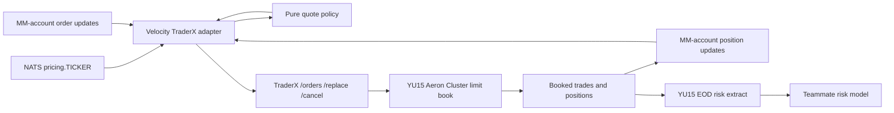

# Velocity Market Maker on TraderX

## Status

Proposed integration and test plan. This document is architecture and handoff input, not a claim
that the integration has been implemented.

The current YU15 branch is active teammate work. Do not add this feature directly to YU15 or edit
its generated output by hand. Once YU15 is stable, package the work as a descendant state or an
equivalent isolated feature branch; `YU16-velocity-market-maker` is a provisional name, not an
assigned state identifier.

## Original proposition

> Up until now all the work I have been doing has been in this repo and editing services that
> exist. I have a teammate that is currently working on a risk model that consumes EOD risk
> positions (YU15, current branch). My friend's capstone was a market maker. I want to see if it is
> possible to somehow incorporate it into or test it out on our version of TraderX, and determine
> what we have to do to make that work. Dive into his capstone:
> [S26-Distributed-Capstone/Velocity-Trading](https://github.com/S26-Distributed-Capstone/Velocity-Trading).

This breaks down into two goals:

1. Run the market-making idea against TraderX so it creates genuine orders, fills, and inventory
   in the TraderX venue.
2. Feed the resulting end-of-day market-maker position into YU15's risk extract and the teammate's
   downstream risk model.

## Executive answer

The idea is feasible, and YU15 is a good foundation for it. The correct boundary is to make
Velocity an external liquidity-provider client of TraderX. TraderX should remain the authoritative
exchange, order book, position owner, pre-trade risk gate, market-data source, and EOD extract
producer.

Do **not** merge or deploy Velocity's entire distributed stack inside TraderX. Velocity is not only
a quote algorithm; it also contains its own exchange, trading-state service, exposure-reservation
service, Hazelcast cluster, PostgreSQL persistence, ZooKeeper coordination, and seven sharded
market-maker processes. Running all of that beside TraderX would create two exchanges, two
position authorities, two risk systems, and two recovery models.

Instead, extract and adapt the small amount of genuinely reusable behavior:

- inventory-aware quote decisions;
- target-spread and quote-size configuration;
- periodic quote refresh;
- per-symbol assignment;
- position-limit awareness;
- tests around quote generation and failure recovery.

Replace every Velocity infrastructure dependency with a TraderX-facing adapter.

## Evidence baseline

This analysis was performed against:

- Velocity Trading commit
  [`abd3c6fd0e92370326a0f6a32007c837708409ec`](https://github.com/S26-Distributed-Capstone/Velocity-Trading/tree/abd3c6fd0e92370326a0f6a32007c837708409ec),
  dated 2026-05-26;
- local TraderX branch `YU15-eod-risk-extract`, initially at commit `6a2bb898` during the
  investigation;
- YU15's inherited YU13 limit-order-book gateway, YU15 market-data extensions, and YU15 risk
  extract contracts.

The YU15 worktree is being changed concurrently. Recheck its final head, generated composition,
runtime contracts, and acceptance proofs before beginning implementation.

## What Velocity Trading contains

Velocity is a Java 21 / Spring Boot system whose one image runs several profiles. Its repository
contains approximately 101 production Java files and 25 test files. The inspected tree had 146
`@Test` methods, including unit tests and opt-in Compose/Kubernetes integration tests.

Its full architecture includes:

- three replicated Exchange instances;
- three replicated Trading State instances;
- three replicated Exposure Reservation instances;
- seven market-maker nodes;
- a three-node ZooKeeper ensemble;
- one shared PostgreSQL database;
- a Hazelcast cluster with write-through JPA `MapStore` persistence;
- a position UI, external order publisher, and nginx load balancer;
- leader discovery through ZooKeeper and Curator `LeaderLatch`;
- RSocket for internal request/response and position streaming;
- STOMP-over-WebSocket for the position UI.

The capstone's own summary and component map are in its
[README](https://github.com/S26-Distributed-Capstone/Velocity-Trading/blob/abd3c6fd0e92370326a0f6a32007c837708409ec/README.md),
with detailed surfaces in its
[API reference](https://github.com/S26-Distributed-Capstone/Velocity-Trading/blob/abd3c6fd0e92370326a0f6a32007c837708409ec/docs/api.md).

### The reusable quote policy

Velocity's `ProductionQuoteGenerator`:

1. Finds a reference price from the existing quote midpoint, the last fill, or a hardcoded
   fallback of `100.0`.
2. Applies half the configured target spread on each side.
3. Adjusts reference price and quantities based on the last fill.
4. Caps buying and selling so the per-symbol position remains within `+/-100`.
5. Requests capacity from the Exposure Reservation service.
6. Publishes the granted quote into a shared Hazelcast quote map.
7. Gives the quote a 30-second expiry.

The implementation is in
[`ProductionQuoteGenerator.java`](https://github.com/S26-Distributed-Capstone/Velocity-Trading/blob/abd3c6fd0e92370326a0f6a32007c837708409ec/src/main/java/edu/yu/velocitytrading/marketmaker/ProductionQuoteGenerator.java#L65-L175).

### The reusable operational ideas

There are also useful concepts outside the pricing method:

- `PositionTracker` consumes an initial position snapshot followed by live deltas.
- `QuoteFreshnessKeeper` refreshes quotes even when no fill occurs.
- The coordinator gives each symbol a single market-maker owner.
- Market-maker processing suppresses equal or older position versions.
- Fault-injection tests cover crashes around reservation and quote replacement.
- Restart tests verify that stale quotes are not treated as current quotes.

These are design inputs. Their Hazelcast, RSocket, ZooKeeper, and exchange-specific implementations
should not be carried into TraderX.

## Why TraderX already supplies the missing venue

YU15 inherits a real two-sided, price-time-priority order book and these gateway operations:

- `POST /orders` for a new limit order;
- `POST /replace` for an atomic replacement that preserves `orderRef`;
- `POST /cancel` for a resting-order cancellation;
- a committed acknowledgement containing an `orderRef` and result kind;
- `clientOrderId`-derived duplicate suppression for new orders and replacements;
- self-trade prevention and replicated risk admission inside the cluster.

See
[`ClusterGatewayMain.java`](../../specs/YU13-limit-order-book/generation/runtime-overrides/order-matcher/src/main/java/finos/traderx/ordermatcher/cluster/ClusterGatewayMain.java)
and YU15's statement that the inherited gateway and order contracts remain unchanged in
[`contract-delta.md`](../../specs/YU15-eod-risk-extract/contracts/contract-delta.md).

YU15 also supplies:

- JSON market ticks on `pricing.<TICKER>`;
- fixed-width binary ticks on `pricing-tick-bin.<TICKER>`;
- booked trades on `/trades`;
- per-account position updates on `/accounts/<accountId>/positions`;
- per-account order lifecycle updates on `/accounts/<accountId>/orders`;
- a queryable order read model for restart reconciliation;
- the real YU06 EOD close chain;
- the consensus-sequenced YU15 risk extract.

See
[`messaging-subject-map.md`](../../specs/YU15-eod-risk-extract/system/messaging-subject-map.md)
for those subjects.

## Recommended target architecture



### Authority boundaries

| Concern | Authority after integration |
|---|---|
| Market price | TraderX `pricing.<TICKER>` feed |
| Working bid and ask | TraderX limit-order book |
| Live market-maker inventory | TraderX cluster position state |
| Order admission | TraderX replicated pre-trade risk gate |
| Order identity and deduplication | TraderX `clientOrderId` / `orderRef` contracts |
| Durable exchange recovery | TraderX Aeron Cluster snapshot plus log replay |
| EOD position cut | YU15 consensus-sequenced risk extract |
| EOD analytics | Teammate's downstream risk model |
| Quote policy | New Velocity TraderX adapter service |

### Component mapping

| Velocity component | TraderX replacement |
|---|---|
| Exchange and shared quote map | YU15 limit-order book |
| `quoteRepository.put()` | `POST /orders`, followed by `/replace` or `/cancel` |
| Trading State `state.stream` | `/accounts/<MM_ACCOUNT>/positions` |
| Existing quote midpoint / hardcoded price | `pricing.<TICKER>` fair-value anchor |
| Exposure Reservation service | TraderX pre-trade risk controls |
| Hazelcast and JPA position persistence | TraderX replicated state plus read model |
| External Order Publisher | Separate TraderX taker/test account |
| ZooKeeper symbol ownership | Static single instance initially; fenced ownership later |
| Velocity Position UI | Existing TraderX position and order views |
| Velocity restart state | TraderX open-order query plus reconciliation |
| Velocity EOD position | YU15 risk-extract row for the MM account |

## Proposed TraderX adapter contracts

### Dedicated account

Use a dedicated market-maker account, shown below as `90001`. The final value must be chosen from
the project's account namespace and added to both:

- TraderX account/security/risk-control seed data;
- YU15 `counterparties.csv`, because an account with a position but no counterparty mapping makes
  the whole extract fail closed.

Use different accounts for taker traffic. The market maker must never generate test flow against
itself.

### Inputs

The adapter consumes:

1. `pricing.<TICKER>` for the current fair-value anchor;
2. `/accounts/90001/positions` for live inventory;
3. `/accounts/90001/orders` for lifecycle confirmation and fill progress;
4. the open-order REST read model during startup and recovery.

The EOD CSV is deliberately **not** a live quoting input. EOD risk is too late to protect intraday
order entry. TraderX's replicated risk gate remains the admission authority, while the EOD model
evaluates the portfolio produced during the session.

### Outputs

A representative new order is:

```json
{
  "clientOrderId": "velocity:AAPL:B:42",
  "accountId": 90001,
  "ticker": "AAPL",
  "side": "Buy",
  "quantity": 10,
  "limitPrice": 240.31
}
```

The committed response supplies `orderRef`. The adapter keeps one bid reference and one ask
reference for every owned symbol.

Representative refresh and cancellation commands are:

```text
POST /replace  { orderRef, clientOrderId, quantity, limitPrice }
POST /cancel   { orderRef }
```

Every logical order revision needs a stable, unique `clientOrderId`. A gateway `504` is an
ambiguous result: the order might have committed even though its acknowledgement did not arrive.
Retrying with the same identity is safe; blindly creating a differently identified replacement can
leave duplicate liquidity.

### Pure policy boundary

Extract the pricing decision behind a small, deterministic API such as:

```java
QuoteDecision decide(
    MarketTick fairValue,
    Position inventory,
    WorkingQuote current,
    QuoteLimits limits
)
```

`QuoteDecision` should contain bid and ask prices, quantities, and an explanation/reason code. It
must not perform HTTP, NATS, database, clock, or Kubernetes work. That separation makes the
strategy testable without either distributed system running.

Prices should use TraderX fixed ticks or `BigDecimal`, with an explicit venue tick-size rule. Do
not retain Velocity's `double` calculations at the order-entry boundary.

## Corrections required before reuse

### 1. Inventory quantity skew appears reversed

Velocity converts an incoming external BUY into a market-maker SELL fill, and an incoming SELL
into a market-maker BUY fill. That side conversion is correct and is visible in
[`FillOrderDispatcher.java`](https://github.com/S26-Distributed-Capstone/Velocity-Trading/blob/abd3c6fd0e92370326a0f6a32007c837708409ec/src/main/java/edu/yu/velocitytrading/exchange/FillOrderDispatcher.java#L73-L84).

However, after a market-maker BUY, the generator increases bid size and decreases ask size. After
a market-maker SELL, it decreases bid size and increases ask size. Those size changes tend to add
to the existing inventory rather than unwind it. The current unit tests encode that behavior as
expected.

Before porting, define and test the intended invariant explicitly:

- a long position should make buying less aggressive and selling more aggressive;
- a short position should make buying more aggressive and selling less aggressive;
- the exact interpretation of "aggressive" must cover both price and size.

### 2. Reference price is not real market data

Velocity cold-starts around `100.0`, then anchors to the previous quote midpoint or last fill. That
can drift away from the market. The TraderX adapter should quote around the current
`pricing.<TICKER>` value and apply bounded inventory skew around it.

### 3. Exposure is measured only in share quantity

Velocity's global reservation cap tracks up to 100 bid shares and 100 ask shares across all
symbols. It does not consider notional value, price differences, contract multiplier, sector
concentration, volatility, or options Greeks.

Do not run both Velocity Exposure Reservation and TraderX risk as competing authorities. Let
TraderX make the committed admission decision. The adapter may use conservative local quote caps,
but they are an optimization and safety preference, not authoritative risk state.

### 4. Velocity has no account dimension

Its position key is the symbol. TraderX positions are account/security positions. The adapter must
filter every position and order event to its dedicated account and must never infer firm-wide
inventory from another account's activity.

### 5. Quote TTL does not transfer automatically

Velocity stores `expiresAt` on its quote, and its exchange refuses to execute an expired quote.
TraderX's resting limit orders do not inherit that application-level TTL. They can survive gateway
and market-maker restarts because persistence is a feature of the book.

The adapter therefore needs:

- periodic replacement or cancellation;
- a stale-market-data circuit breaker;
- cancellation on orderly shutdown;
- startup enumeration and reconciliation of every open order;
- a rule forbidding new quoting until recovery is complete.

### 6. Two-sided publication is not atomic

TraderX atomically replaces one order, not a bid/ask pair. A bid can be accepted while the ask is
rejected or ambiguous. The adapter needs an explicit two-sided state machine. It must either:

- deliberately permit controlled one-sided quoting; or
- compensate by cancelling the successful side when the pair cannot be established.

This behavior must be visible through metrics and reason codes rather than hidden as a partially
successful refresh.

### 7. HA requires ownership and fencing

Start the proof with exactly one adapter replica. Multiple active replicas can both believe they
own AAPL and race replacements.

Later HA needs an ownership token or epoch that prevents the old owner from continuing to quote
after ownership moves. A Kubernetes Lease can coordinate ownership, but a Lease alone is not a
fence against a paused or partitioned former owner. The durable implementation must define how old
orders and old owners are invalidated before the replacement becomes active.

### 8. Options are not a first-slice feature

YU15 can quote and mark listed options, and its extract applies contract multiplier correctly. The
Velocity policy is nevertheless equity/share based. It has no delta, gamma, vega, expiry, implied
volatility, or multiplier-aware inventory model.

Begin with AAPL and MSFT equities. An options extension should use delta-equivalent exposure and
the option model inputs exposed by YU15, and should be reviewed alongside the downstream risk
model rather than treated as another ticker string.

## YU15 and the downstream risk model

The integration produces a useful end-to-end capstone story:

1. The adapter publishes bid and ask orders as account `90001`.
2. Separate taker accounts cross those orders.
3. The Aeron Cluster books both sides and updates the market maker's authoritative position.
4. The YU06 EOD chain publishes a named closing-price snapshot.
5. YU15 takes a position cut at an exact consensus sequence.
6. The delivered fixture contains the market maker's account/security row.
7. The teammate's risk model consumes that exact fixture.

The delivered fixture contract is documented in
[`contract-delta.md`](../../specs/YU15-eod-risk-extract/contracts/contract-delta.md), and a real
sample is in
[`risk-extract.csv`](../../specs/YU15-eod-risk-extract/contracts/sample/risk-extract.csv).

Relevant fields include:

```text
accountId,security,instrumentType,quantity,contractMultiplier,
costBasis,closingMark,markSource,markQuality,marketValue,
unrealizedPnl,currency,counterpartyId,nettingSetId
```

For an equity, `contractMultiplier` is 1. For an option it is 100. The market-maker row should be
validated from the actual booked trades, not created by hand in the CSV or SQL read model.

## Implementation plan

### Phase 0: permission and design lock

- Ask the Velocity authors to add an explicit license compatible with TraderX's Apache-2.0 license,
  or obtain written permission before copying source.
- Decide whether code will be copied with attribution or the algorithm will be independently
  reimplemented from the documented behavior.
- Agree on the dedicated market-maker account and initial equity universe.
- Define the correct inventory-skew formula and acceptance examples.
- Wait for the teammate's YU15 branch to stabilize, then create an isolated descendant worktree.

### Phase 1: pure policy

- Extract or reimplement the quote-decision function with no Spring or distributed-system
  dependencies.
- Replace `double` prices with fixed ticks or `BigDecimal`.
- Drive fair value from market ticks, not the old quote midpoint.
- Correct and test the inventory size skew.
- Add explicit stale-price, maximum-position, maximum-order-size, and maximum-spread rules.
- Cover flat, long, short, boundary, stale, and missing-market scenarios.

### Phase 2: TraderX adapters

- Subscribe to `pricing.<TICKER>`.
- Subscribe to the dedicated account's position and order subjects.
- Implement `/orders`, `/replace`, and `/cancel` clients.
- Preserve stable `clientOrderId` values across retries.
- Maintain the two working `orderRef` values per symbol.
- Stop quoting when price or position state is stale.
- Expose health, readiness, metrics, and a read-only status endpoint.

### Phase 3: recovery and lifecycle

- Query all open orders for the dedicated account at startup.
- Reconcile or cancel them before admitting new quote decisions.
- Handle `200`, business rejection, `404`, `409`, `422`, `503`, and ambiguous `504` separately.
- Prove compensation when only one side of a pair succeeds.
- Cancel orders on symbol removal and graceful shutdown.
- Kill the process during new, replace, and cancel operations and prove convergence after restart.

### Phase 4: generated local runtime

- Add the service source and build configuration through the state-local generation overlay.
- Add one adapter Deployment to the generated kind topology.
- Inject NATS, gateway, account, universe, spread, refresh, and limit settings through explicit
  environment variables.
- Add seed/reference-data changes for the market-maker account.
- Extend the local start/status/stop path without hand-editing generated artifacts.
- Keep one replica until the single-writer proof passes.

### Phase 5: EOD risk integration

- Trade against the adapter using a different taker account.
- Close the actual EOD session.
- Wait for `risk.extract.ready`.
- Validate the market-maker row in the immutable fixture.
- Pass that exact fixture to the teammate's risk model.
- Assert the model's quantity, market-value, P&L, and risk results against independently derived
  expectations.

## Acceptance plan

### A. Policy tests

Prove deterministically that:

- flat inventory produces a symmetric configured spread;
- long inventory reduces bid aggressiveness and increases ask aggressiveness;
- short inventory does the inverse;
- no decision breaches the configured position or order-size limits;
- stale or absent market data produces no quote;
- price and quantity rounding are stable;
- repeated identical input produces an identical decision.

### B. Adapter contract tests

Use recorded TraderX envelopes and gateway responses to prove:

- market ticks decode correctly;
- only the dedicated account's events affect inventory;
- position and order events are idempotent;
- new-order responses store the correct `orderRef`;
- replace retains the expected reference;
- cancel removes the working side;
- business rejection is not treated as a transport failure;
- `504` remains ambiguous and retries preserve identity;
- one-sided refresh failure triggers the configured compensation policy.

### C. Local kind happy path

Use the established YU15 start flow from
[`quickstart.md`](../../specs/YU15-eod-risk-extract/quickstart.md):

1. Generate YU15 and build its cluster image.
2. Start the kind runtime.
3. Seed the instrument universe, dedicated MM account, taker account, and risk controls.
4. Start the adapter for AAPL.
5. Assert exactly one open bid and one open ask for the MM account.
6. Submit a crossing taker order from the other account.
7. Assert the expected side and price fill.
8. Assert the MM account position changes with the correct sign.
9. Assert the depleted side is replaced.
10. Assert no duplicate or crossed working orders remain.

### D. Risk and failure paths

Prove:

- maximum position causes the risk-reducing side to remain available while the increasing side is
  removed or rejected;
- an unknown or disabled security never becomes quoted;
- stale market data cancels or withdraws both sides;
- self-trade prevention cannot silently destroy both sides without the adapter noticing;
- gateway or cluster failover does not create duplicate orders;
- a crash during replace leaves recoverable state;
- restart reconciliation removes stale orders before quoting resumes;
- a second adapter replica cannot quote the same symbol concurrently once HA is introduced.

### E. EOD and teammate-model proof

1. Accumulate a known AAPL market-maker position through real crosses.
2. Close the EOD session using the existing YU15 path.
3. Observe `eod.pnl.done`, `risk.extract.cut`, and `risk.extract.ready`.
4. Verify the fixture includes account `90001` and the expected signed quantity.
5. Recompute `marketValue` and `unrealizedPnl` from the named close.
6. Byte-rebuild the fixture from its stored cut using YU15's existing rebuild mode.
7. Run the teammate's risk model against the delivered file.
8. Assert its result is traceable to the same consensus sequence and price version.

### F. Performance and operational proof

After functional correctness:

- measure quote-decision-to-committed-replace latency;
- measure position-event-to-new-quote latency;
- count active bids, asks, one-sided symbols, rejects, ambiguous responses, and reconciled orders;
- compare order-entry throughput with and without quote-refresh traffic;
- prove the adapter cannot overwhelm the gateway during a market-data burst;
- ensure metrics use bounded-cardinality labels and never use order IDs as labels.

## Rough effort

For one engineer familiar with TraderX:

| Scope | Rough effort |
|---|---|
| One-symbol equity policy and adapter proof | 4-6 engineering days |
| Multi-symbol hardened service with restart reconciliation and observability | 2-3 weeks total |
| HA ownership and fencing | Additional focused failure-proof work |
| Options-aware market making | Separate extension; not part of the first slice |

These are planning estimates, not commitments. The largest uncertainty is not writing the quote
formula; it is proving order lifecycle convergence across ambiguous responses, crashes, and owner
changes.

## Alternatives considered

### Run the whole Velocity stack beside TraderX

This is possible as a standalone demonstration but does not test the market maker against TraderX.
Orders would still execute on Velocity's exchange and positions would still be owned by Velocity's
Trading State service. Transforming its `/positions` output into a YU15-looking CSV would bypass
the TraderX order book and YU15 consensus cut, defeating the most valuable part of the experiment.

Use the full stack only to reproduce and understand the original capstone.

### Embed Velocity's Exchange inside TraderX

Rejected. TraderX already has the stronger matching, risk, recovery, idempotency, and order
lifecycle machinery. A second embedded exchange would introduce conflicting truth sources.

### Reuse only the policy behind a TraderX client

Recommended. This preserves the friend's core market-making idea while making every market event,
fill, position, and EOD risk result native to TraderX.

## Licensing and attribution

The inspected Velocity tree did not contain a tracked `LICENSE`, `COPYING`, or `NOTICE` file. A
public GitHub repository is readable, but that alone does not grant permission to copy or
redistribute its source.

Before incorporating code:

1. ask all relevant authors to choose an explicit license;
2. confirm compatibility with TraderX's Apache-2.0 license and contribution requirements;
3. preserve required copyright and attribution notices;
4. record whether the implementation is copied, adapted, or independently reimplemented.

This is a project risk to resolve, not legal advice.

## Verification note

The repository was inspected statically and cloned at the pinned commit above. Its Maven suite was
not executed successfully in this investigation. The initial run could not write missing
dependencies into the sandboxed user Maven repository. A safer temporary Maven repository then
needed network dependency resolution, and unsandboxed execution of build/test code from an
untrusted public repository was not authorized.

Therefore:

- the test inventory is confirmed from source;
- the claimed Compose/K3s architecture is confirmed from source and documentation;
- the current passing status of the complete test suite is **not** confirmed;
- no Velocity deployment was started;
- no TraderX source or generated artifact was changed as part of the investigation.

## Recommended next action

When YU15 is stable, create an isolated descendant worktree and write a small state/spec pack for
the equity-only adapter. The first milestone should end at the EOD proof: a real TraderX fill
changes the dedicated market-maker position, YU15 emits that row, and the teammate's risk model
scores the exact delivered fixture.

Do not begin with seven market-maker replicas, ZooKeeper migration, options, or cloud deployment.
The one-symbol local-kind proof exercises the valuable integration boundary and exposes the hard
order-lifecycle problems with the smallest possible operational surface.
