# LMAX Sequencer Architecture (Trading Hot Path)

State 009 runtime with the trading hot path rebuilt as a sequenced, journaled, single-threaded in-memory BLP wired with disruptor rings; external contracts unchanged.

- Generated from: `system/architecture.model.json`
- Canonical flows: `system/end-to-end-flows.md`

## Architecture Diagram

```mermaid
flowchart LR
  developer["Developer"]
  app_runtime["TraderX App Runtime"]
  obs_runtime["Observability Runtime"]
  ingress["NGINX Ingress"]
  trade_ui["Angular Trade UI"]
  gateway["Gateway (Trade Service)"]
  price_publisher["Price Publisher"]
  input_disruptor["Input Disruptor + Sequencer"]
  journal["Event Journal"]
  blp["Business Logic Processor"]
  replica_blp["Replica BLP (warm standby)"]
  output_disruptor["Output Disruptor"]
  nats["NATS Broker"]
  projector["Read-model Projector"]
  database["Shared Database (read-model)"]
  prometheus["Prometheus"]
  blackbox["Blackbox Exporter"]
  loki["Loki"]
  grafana["Grafana"]
  developer -->|"Uses app and admin UI"| ingress
  ingress -->|"Serves UI"| trade_ui
  trade_ui -->|"Order/trade REST and WS (unchanged contract)"| gateway
  price_publisher -->|"Market ticks for sequencing"| gateway
  gateway -->|"Claims slot, writes SBE event, publishes"| input_disruptor
  input_disruptor -->|"Journaler appends every event"| journal
  input_disruptor -->|"Replicator ships sequenced stream"| replica_blp
  input_disruptor -->|"Barrier-gated delivery (durable + replicated + decoded)"| blp
  blp -->|"Emits typed output events (sole producer)"| output_disruptor
  output_disruptor -->|"Bridges to unchanged 009 subjects"| nats
  output_disruptor -->|"Feeds read-model projection"| projector
  projector -->|"Batched async writes, checkpointed"| database
  nats -->|"Push updates to blotters (unchanged)"| trade_ui
  prometheus -->|"Scrapes hot-path metrics"| blp
  prometheus -->|"Scrapes probe metrics"| blackbox
  blackbox -->|"HTTP probes"| gateway
  blp -->|"Async structured logs via promtail"| loki
  developer -->|"Views hot-path observability"| grafana
  grafana -->|"Queries metrics"| prometheus
  grafana -->|"Queries logs"| loki
```

## Node Catalog

| Node | Kind | Label | Notes |
| --- | --- | --- | --- |
| `developer` | actor | Developer | Local developer using this state. |
| `app_runtime` | boundary | TraderX App Runtime | State 009 runtime baseline with the LMAX hot-path replacement. |
| `obs_runtime` | boundary | Observability Runtime | LGTM + OTel stack from state 007 carried forward with hot-path telemetry coverage. |
| `ingress` | service | NGINX Ingress | Routes UI, API, and order admin traffic (unchanged). |
| `trade_ui` | service | Angular Trade UI | Trade ticket, order ticket, blotters, and admin tab (unchanged). |
| `gateway` | service | Gateway (Trade Service) | Receptionist role: validates via in-memory replicas, maps ticker to securityId, fixed-point converts, SBE-encodes, submits sequenced input events. |
| `price_publisher` | service | Price Publisher | Market tick source (unchanged node); ticks enter the sequenced stream via the Gateway. |
| `input_disruptor` | service | Input Disruptor + Sequencer | Pre-allocated ring; global sequence assignment; parallel journaler/replicator/un-marshaller; sequence barrier gating the BLP. |
| `journal` | service | Event Journal | Durable, replicated, authoritative append-only log of sequenced input events (Chronicle Queue / Aeron Archive). |
| `blp` | service | Business Logic Processor | Single thread, in-memory, event-sourced: order books, positions, caches; match + book + position + emit. |
| `replica_blp` | service | Replica BLP (warm standby) | Consumes the replicated input stream in lock-step with output suppressed; promoted on leader failure. Loopback/stub in demo profile. |
| `output_disruptor` | service | Output Disruptor | Single-producer egress ring with parallel marshaller, NATS publisher, and read-model projector handlers. |
| `nats` | service | NATS Broker | Realtime transport; subjects and payloads unchanged from 009. |
| `projector` | service | Read-model Projector | Batched, checkpointed, rebuildable async writer of OrderBook/trade/position rows. |
| `database` | service | Shared Database (read-model) | Same schema as 009; demoted to an async read-model projected from output events. |
| `prometheus` | service | Prometheus | Scrapes hot-path, order, and allocation metrics plus blackbox probes. |
| `blackbox` | service | Blackbox Exporter | Probes order endpoints and inherited runtime endpoints. |
| `loki` | service | Loki | Aggregates runtime logs (hot-path logging is async/off-thread). |
| `grafana` | service | Grafana | Dashboards for ring headroom, sequence lag, BLP/egress latency, projector lag, allocation rate, GC pauses. |

