# In-Memory Risk Gateway

A two-tier pre-trade risk admission gate on the LMAX BLP: an in-process Gateway replica screens without synchronous lookup, and the single-writer BLP makes the authoritative decision and reserves exact aggregate exposure in global sequence order.

- Inherits architectural baseline from: `YU02-lmax-kubernetes`
- Generated from: `system/architecture.model.json`
- Canonical flows: `../001-baseline-uncontainerized-parity/system/end-to-end-flows.md`

## Architecture Diagram

```mermaid
flowchart LR
  client["Client / Trade Service"]
  operator["Risk Operator"]
  gateway["Tier 1 — Gateway screening"]
  input_ring["Input Disruptor"]
  journaler["Journaler + Replicator"]
  blp["Tier 2 — BLP (single writer)"]
  book["Order Book / Execution"]
  output_ring["Output Disruptor"]
  marshaller["Marshaller"]
  nats["NATS bridges"]
  projector["Projector"]
  mariadb["MariaDB read model"]
  client -->|"order / market-trade (REST, optional clientOrderId)"| gateway
  operator -->|"control events (account/security/policy/restriction), versioned"| input_ring
  gateway -->|"preliminary PASS (never final, FR-IMRG07)"| input_ring
  input_ring -->|"durable before BLP"| journaler
  journaler -->|"replay-ordered input (single writer)"| blp
  blp -->|"ACCEPTED: book / execute, reserve exposure"| book
  blp -->|"REJECTED: journaled only, no book, no market event (FR-IMRG23)"| output_ring
  book -->|"trade / order lifecycle events"| output_ring
  output_ring -->|"read model + acks"| marshaller
  output_ring -->|"order lifecycle subjects"| nats
  output_ring -->|"projection stream"| projector
  projector -->|"writes read model"| mariadb
```

## Node Catalog

| Node | Kind | Label | Notes |
| --- | --- | --- | --- |
| `client` | actor | Client / Trade Service | Submits order / market-trade over REST (optional clientOrderId). |
| `operator` | actor | Risk Operator | Administers versioned controls via /risk/control/* (token + operator provenance). |
| `gateway` | component | Tier 1 — Gateway screening | GatewayReplicaStore.screen(): in-process, memory-only, no REST/DB (FR-IMRG01/06); fail-closed until ready; reject to 422 / 503 (stale). |
| `input_ring` | component | Input Disruptor | Global input sequence carrying commands, prices, and control events (ADR-020). |
| `journaler` | component | Journaler + Replicator | Durable journal + NATS JetStream replication before the BLP (FR-IMRG10). |
| `blp` | component | Tier 2 — BLP (single writer) | BlpRiskState.decideAndReserve / decideMarketTrade: ordered pipeline, exact aggregate exposure, check+reserve as one single-threaded op (FR-IMRG12/13). |
| `book` | component | Order Book / Execution | ACCEPTED commands enter the book and execute; the accepted order's exposure stays reserved until filled or cancelled. |
| `output_ring` | component | Output Disruptor | The BLP's only side-effect channel (FR-IMRG27); gains order-rejected and trade-decision kinds (FR-IMRG45). |
| `marshaller` | component | Marshaller | In-memory read model + correlation acks (KIND_TRADE_ACCEPTED/REJECTED). |
| `nats` | component | NATS bridges | Order/trade lifecycle subjects, carrying riskReason on rejection (FR-IMRG15). |
| `projector` | component | Projector | Projects accepted outcomes to the MariaDB read model; reads no admission state back (FR-IMRG41). |
| `mariadb` | service | MariaDB read model | Async projection only, never the source of admission state. |

