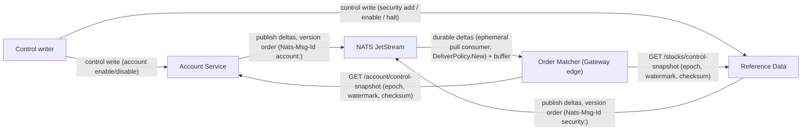

# Durable Control Feeds for the Risk Gateway

Replaces YU03's one-shot REST replica bootstrap with real durable outbox feeds: account-service and reference-data publish versioned control deltas to per-source JetStream streams, and order-matcher's ReplicaBootstrap runs the ADR-019 subscribe-buffer-snapshot-catchup protocol per source.

- Inherits architectural baseline from: `YU03-in-memory-risk-gateway`
- Generated from: `system/architecture.model.json`
- Canonical flows: `../001-baseline-uncontainerized-parity/system/end-to-end-flows.md`

## Architecture Diagram

## Node Catalog

| Node | Kind | Label | Notes |
| --- | --- | --- | --- |
| `writer` | actor | Control writer | Writes account existence/identity (POST/PUT /account/) and security existence/identity (POST /stocks). |
| `account_service` | service | Account Service | Writes accounts + account_control_outbox in one JdbcTemplate transaction; a @Scheduled publisher ships unpublished rows in strict version order. Serves GET /account/control-snapshot (epoch, watermark, checksum). |
| `reference_data` | service | Reference Data | New MariaDB persistence (was CSV-only): writes stocks + stocks_control_outbox in one mysql2 transaction; an @Interval publisher ships rows in version order. Serves GET /stocks/control-snapshot. |
| `nats` | service | NATS JetStream | Two independent durable streams: TRADERX_CONTROL_ACCOUNT (traderx.control.account.deltas) and TRADERX_CONTROL_SECURITY (traderx.control.security.deltas). |
| `order_matcher` | service | Order Matcher (Gateway edge) | ReplicaBootstrap orchestrates two ControlFeedSubscribers (one per source), each running the ADR-019 5-step protocol; GatewayReplicaStore records gain sourceVersion; markReady() fires only once both sources reach their high watermark (FR-IMRG05). |

## State Notes

- Per source: subscribe + buffer, fetch snapshot, verify checksum/count/schema and atomically install, apply buffered deltas above the watermark (same epoch, in order), then continue live consumption; a gap, version regression, or epoch change quarantines that source and forces a fresh bootstrap for it only (FR-IMRG34).
- Two independent streams (not one shared) so an epoch bump or resync on one source never forces re-bootstrapping the other; account-service and reference-data have separate deploy lifecycles and failure domains.
- The BLP decision path (ADR-018) and the journaled control-event path (/risk/control/* -> TYPE_{ACCOUNT,SECURITY}_CONTROL, ADR-020) are unchanged; this only replaces what feeds GatewayReplicaStore's existence/identity records at the edge, so journal/replication wire format, snapshot format, and replay determinism (NFR-IMRG03) are unaffected.

