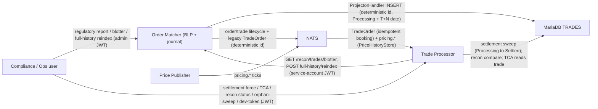

# Post-Trade Compliance Bundle

A back-office compliance layer strictly downstream of the BLP: deterministic trade identity + settlement, reconciliation (forward + full-history orphan), journal-sourced regulatory reporting, TCA, and real JWT auth/entitlements gating every new endpoint. Never on the admission path, never mutating journal/BLP state.

- Inherits architectural baseline from: `YU04-durable-control-feeds`
- Generated from: `system/architecture.model.json`
- Canonical flows: `../001-baseline-uncontainerized-parity/system/end-to-end-flows.md`

## Architecture Diagram

## Node Catalog

| Node | Kind | Label | Notes |
| --- | --- | --- | --- |
| `client` | actor | Compliance / Ops user | Calls the post-trade APIs with a real JWT — account-scoped (settlement force, TCA for own account) or admin (blotter, full-history, orphan-sweep, regulatory report). |
| `order_matcher` | service | Order Matcher (BLP + journal) | Admission/matching pipeline unchanged. Output-ring TradeBlotterHandler builds a bounded, replay-safe blotter; on demand it runs shadow-engine replays for full-history reindex and the regulatory report; ProjectorHandler writes trades with the deterministic id and a Processing/T+N settlement state. Own JWT authenticator. |
| `trade_processor` | service | Trade Processor | Idempotent booking on the deterministic id; SettlementService (T+N sweep + force); ReconciliationService (forward sweep + orphan sweep); TcaService + PriceHistoryStore; POST /auth/dev-token minter; own JWT authenticator; recon/settlement Micrometer counters. |
| `price_publisher` | service | Price Publisher | Existing last-trade feed (pricing.*) that TCA's PriceHistoryStore subscribes to as its benchmark source. |
| `nats` | service | NATS | Carries order/trade lifecycle subjects, the legacy TradeOrder feed, and pricing.* ticks. |
| `mariadb` | service | MariaDB TRADES | Read-model projection (never authoritative): trade rows keyed by the deterministic id, with the settlement lifecycle column. |

## State Notes

- A deterministic trade id (OrderSnapshot.tradeIdFor(tradeSeq)) links every MariaDB trade row to the journal fill that produced it; every capability here depends on it (ADR-022).
- Full-history reindex and the regulatory report are read-only shadow-engine replays; settlement and reconciliation write only trade-processor's own MariaDB rows. The BLP admission path, journal, and snapshot format are untouched (FR-PTC07/NFR-PTC09).
- Every endpoint is gated by a real HS256-verified JWT (ADR-025): account-scoped endpoints check entitlement against the trade's account, cross-account endpoints require an admin claim.

