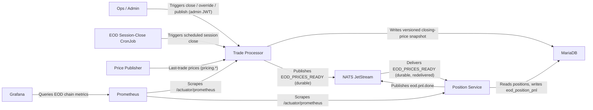

# EOD Price Production and Overnight Batch Chain

Versioned, immutable end-of-day closing-price production gated behind a durable event, driving one downstream position-marking consumer.

- Inherits architectural baseline from: `YU05-post-trade-compliance`
- Generated from: `system/architecture.model.json`
- Canonical flows: `../001-baseline-uncontainerized-parity/system/end-to-end-flows.md`

## Architecture Diagram

## Node Catalog

| Node | Kind | Label | Notes |
| --- | --- | --- | --- |
| `ops` | actor | Ops / Admin | Triggers session close, resolves flagged prices via override, publishes. |
| `cron` | service | EOD Session-Close CronJob | Scheduled trigger calling the same session-close endpoint an operator uses. |
| `price_publisher` | service | Price Publisher | Existing last-trade feed (pricing.*) that EOD production reads from. |
| `trade_processor` | service | Trade Processor | Hosts EOD price production: classify, version, override, publish, emit gate event. |
| `mariadb` | service | MariaDB | Versioned closing-price snapshot tables and the consumer's P&L result table. |
| `nats` | service | NATS JetStream | Durable stream carrying EOD_PRICES_READY and eod.pnl.done. |
| `position_service` | service | Position Service | EOD consumer: marks positions against the published snapshot version, fail-safe per account. |
| `prometheus` | service | Prometheus | Scrapes EOD chain metrics from both services. |
| `grafana` | service | Grafana | EOD batch chain dashboard: published/flagged/marked/halted, chain latency. |

