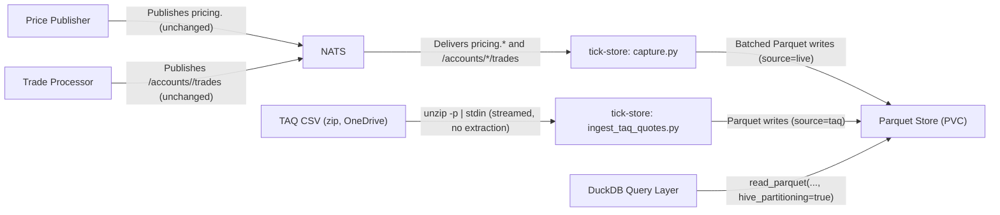

# Historical Tick Store

TraderX's own live ticks and a normalized NYSE TAQ quotes sample, captured into one partitioned Parquet schema queryable through DuckDB.

- Inherits architectural baseline from: `YU06-eod-price-production`
- Generated from: `system/architecture.model.json`
- Canonical flows: `../001-baseline-uncontainerized-parity/system/end-to-end-flows.md`

## Architecture Diagram

## Node Catalog

| Node | Kind | Label | Notes |
| --- | --- | --- | --- |
| `price_publisher` | service | Price Publisher | Existing last-price feed (pricing.*) that tick-store captures from, unchanged. |
| `trade_processor` | service | Trade Processor | Existing trade-fill broadcaster (/accounts/*/trades) that tick-store captures from, unchanged. |
| `nats` | service | NATS | Existing broker; tick-store adds a subscriber, publishes nothing. |
| `tick_store_capture` | service | tick-store: capture.py | Long-running subscriber on pricing.* and /accounts/*/trades; batched writes to partitioned Parquet. |
| `taq_source` | actor | TAQ CSV (zip, OneDrive) | NYSE Daily TAQ Consolidated Quotes CSV, streamed via unzip -p, never extracted to disk. |
| `tick_store_ingest` | service | tick-store: ingest_taq_quotes.py | One-shot CLI normalizing a TAQ CQ CSV (via stdin) into the same partitioned schema. |
| `parquet_store` | service | Parquet Store (PVC) | source=<live|taq>/dt=.../symbol=.../*.parquet, ZSTD-compressed. |
| `duckdb_query` | actor | DuckDB Query Layer | Symbol/date-range queries and aggregations over the unified store, no server. |

