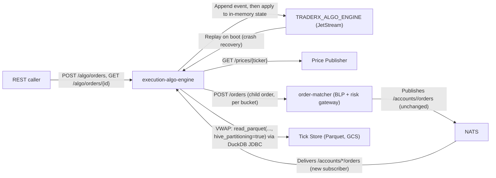

# Execution Algo Engine

A new execution-algo-engine component slicing parent orders into TWAP/VWAP child orders submitted through order-matcher's existing order-entry path.

- Inherits architectural baseline from: `YU07-historical-tick-store`
- Generated from: `system/architecture.model.json`
- Canonical flows: `../001-baseline-uncontainerized-parity/system/end-to-end-flows.md`

## Architecture Diagram

## Node Catalog

| Node | Kind | Label | Notes |
| --- | --- | --- | --- |
| `algo_client` | actor | REST caller | Submits a parent order via POST /algo/orders and polls progress. |
| `execution_algo_engine` | service | execution-algo-engine | Schedules TWAP/VWAP buckets, submits child orders, tracks fills, event-sources its own state. |
| `algo_event_stream` | service | TRADERX_ALGO_ENGINE (JetStream) | Durable append log of parent-order lifecycle events; replayed on boot for crash recovery. |
| `price_publisher` | service | Price Publisher | Existing last-price feed; queried per child order to derive a marketable limit price. |
| `order_matcher` | service | order-matcher (BLP + risk gateway) | Existing order-entry endpoint; children are indistinguishable from manually entered orders. |
| `nats` | service | NATS | Existing broker; execution-algo-engine adds a subscriber on /accounts/*/orders, publishes nothing to core NATS. |
| `tick_store_parquet` | service | Tick Store (Parquet, GCS) | YU07's unified ticks store; queried by the DuckDB volume-profile source for VWAP. |

