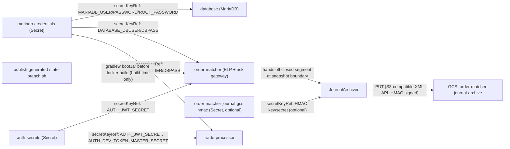

# Ops Hardening

Database/JWT credentials moved to Kubernetes Secrets; order-matcher journal rotates at snapshot boundaries and archives closed segments to GCS; the shared build pipeline always rebuilds a fresh jar before the Docker build.

- Inherits architectural baseline from: `YU08-execution-algo-engine`
- Generated from: `system/architecture.model.json`
- Canonical flows: `../001-baseline-uncontainerized-parity/system/end-to-end-flows.md`

## Architecture Diagram

## Node Catalog

| Node | Kind | Label | Notes |
| --- | --- | --- | --- |
| `mariadb_credentials_secret` | service | mariadb-credentials (Secret) | Created out-of-band via kubectl; never committed. Referenced by secretKeyRef from database, order-matcher, trade-processor, account-service, position-service. |
| `auth_secrets_secret` | service | auth-secrets (Secret) | Created out-of-band via kubectl; never committed. Referenced by secretKeyRef from order-matcher, trade-processor for AUTH_JWT_SECRET/AUTH_DEV_TOKEN_MASTER_SECRET. |
| `database` | service | database (MariaDB) | Existing MariaDB Deployment; credentials now sourced from mariadb-credentials instead of literal manifest values. |
| `order_matcher` | service | order-matcher (BLP + risk gateway) | Existing BLP; DB/JWT creds now from Secrets. Journaler rotates at each snapshot boundary when journal.archive.enabled. |
| `journal_archiver` | service | JournalArchiver | New: background-thread uploader inside order-matcher. Uploads closed journal segments to GCS via an HMAC-authenticated S3 client. |
| `journal_gcs_hmac_secret` | service | order-matcher-journal-gcs-hmac (Secret, optional) | Created out-of-band via kubectl; never committed. Its absence disables only the GCS upload leg, not pod startup or rotation. |
| `journal_archive_bucket` | service | GCS: order-matcher-journal-archive | Destination for closed journal segments, uploaded via GCS's S3-compatible XML API. |
| `trade_processor` | service | trade-processor | Existing service; DB/JWT/dev-token creds now from Secrets. |
| `publish_generated_state_branch` | service | publish-generated-state-branch.sh | Shared build pipeline script; now runs gradlew clean bootJar before docker build for any JVM service context. |

