# YU10-fix-ingress architecture

FIX 4.4 order-entry front door for the order-matcher: an in-process QuickFIX/J acceptor whose session threads publish translated order commands to the existing LMAX input ring, a durable correlation ledger binding ClOrdIDs to ring sequences, and an output-disruptor handler streaming ExecutionReports back to the owning session.

- Inherits architectural baseline from: `YU09-ops-hardening (which inherits the full YU02..YU08 LMAX/Kubernetes lineage)`
- Generated from: `system/architecture.model.json`
- Canonical flows: `architecture.md`

## Architecture Diagram

```mermaid
flowchart LR
  fix_counterparty["FIX counterparty (initiator)"]
  fix_acceptor["QuickFIX/J acceptor (in-process, :18130)"]
  fix_identity["FixIdentity (logon gate)"]
  fix_translator["FixOrderApplication (translator)"]
  clordid_ledger["ClOrdID correlation ledger (PVC)"]
  input_ring["Input ring (ProducerType.MULTI)"]
  blp["BLP (journaler -> matcher)"]
  output_ring["Output ring (ProducerType.SINGLE)"]
  fix_er_handler["FixExecutionReportHandler"]
  fix_store["FIX session store (PVC)"]
  read_model["In-memory order read model"]
  fix_counterparty -->|"FIX 4.4 over TCP :18130 (logon, D/F/H)"| fix_acceptor
  fix_acceptor -->|"Logon: JWT + CompID resolution (once per session)"| fix_identity
  fix_acceptor -->|"validated application messages (session thread)"| fix_translator
  fix_translator -->|"append (session, ClOrdID, inputSeq, orderRef) BEFORE publish"| clordid_ledger
  fix_translator -->|"order-new / cancel input events"| input_ring
  fix_translator -->|"OrderStatusRequest lookup (no ring publish)"| read_model
  input_ring -->|"journal -> risk screen -> match (unchanged)"| blp
  blp -->|"lifecycle output events (inputSeq correlated)"| output_ring
  output_ring -->|"handler in existing output chain"| fix_er_handler
  fix_er_handler -->|"inputSeq -> (session, ClOrdID) join"| clordid_ledger
  fix_er_handler -->|"ExecutionReport / OrderCancelReject enqueue"| fix_acceptor
  fix_acceptor -->|"sequence numbers + sent messages (resend window)"| fix_store
  fix_acceptor -->|"8 / 9 / 3 + session protocol"| fix_counterparty
```

## Node Catalog

| Node | Kind | Label | Notes |
| --- | --- | --- | --- |
| `fix_counterparty` | external | FIX counterparty (initiator) | Any FIX 4.4 initiator: logs on with SenderCompID + JWT in Password(554), submits NewOrderSingle/OrderCancelRequest/OrderStatusRequest, receives ExecutionReports. |
| `fix_acceptor` | service | QuickFIX/J acceptor (in-process, :18130) | Owns the FIX session layer (logon, heartbeats, sequence numbers, resend) on its own threads inside the order-matcher JVM. File store + file log on the FIX data directory. |
| `fix_identity` | service | FixIdentity (logon gate) | Resolves Password(554) JWT once via the existing EntitlementGate.resolve and maps SenderCompID to exactly one account via FIX_SESSION_ACCOUNTS; pins the ResolvedPrincipal to the session; fail-closed on any miss. |
| `fix_translator` | service | FixOrderApplication (translator) | On the session thread: D -> order-new, F -> cancel (ledger lookup + ownership check), H -> read-model status report. Four-outcome admission model; publishes to the input ring with a bounded claim timeout. |
| `clordid_ledger` | store | ClOrdID correlation ledger (PVC) | Append-only records (sessionKey, ClOrdID, inputSeq, orderRef) written before ring publish with amortized force; rehydrated at startup; duplicate detection; fail-closed when unavailable. |
| `input_ring` | queue | Input ring (ProducerType.MULTI) | Unchanged. FIX session threads join REST/Tomcat threads and the replication follower as producers. |
| `blp` | service | BLP (journaler -> matcher) | Unchanged: journal + risk screen + matching engine. A FIX order is bit-identical to a REST order here. |
| `output_ring` | queue | Output ring (ProducerType.SINGLE) | Unchanged; carries order-lifecycle output events with inputSeq correlation. |
| `fix_er_handler` | service | FixExecutionReportHandler | Output-disruptor handler: joins OutputEvent.inputSeq through the ledger to (session, ClOrdID), builds ExecutionReport/OrderCancelReject, enqueues to the QuickFIX/J session send path. No I/O on the ring thread. |
| `fix_store` | store | FIX session store (PVC) | QuickFIX/J file store: sequence numbers + sent messages (PersistMessages=Y) under FIX_DATA_DIR on the existing lmax-runtime-data volume; backs ResendRequest recovery. |
| `read_model` | store | In-memory order read model | Unchanged; serves OrderStatusRequest lookups without touching the ring. |

