# YU11-aeron-replication architecture

Dual-capable BLP replication: File-backed NATS remains the default and rollback path, while Aeron reliable unicast plus SBE and per-pod Archive sidecars provide a measured replication alternative, exact follower-journal durable watermarks, shadow validation, Archive catch-up, and an opt-in direct-heartbeat plus atomic-witness failover path.

- Inherits architectural baseline from: `YU10-fix-ingress (which inherits the full YU02..YU09 LMAX/Kubernetes lineage)`
- Generated from: `system/architecture.model.json`
- Canonical flows: `architecture.md`

## Architecture Diagram

```mermaid
flowchart LR
  ingress["REST + FIX ingress"]
  primary_ring["Primary input ring"]
  primary_journal["Primary Journaler + PVC"]
  transport_selector["Delegating replication selector"]
  nats_replication["File-backed NATS replication"]
  primary_aeron["AeronReplicator + SBE encoder"]
  primary_sidecar["Primary Archiving Media Driver"]
  follower_sidecar["Follower Archiving Media Driver"]
  follower_aeron["AeronReplicationFollower"]
  follower_ring["Follower input ring"]
  follower_journal["Follower Journaler + PVC"]
  follower_blp["Follower matching/risk apply"]
  ack_agent["Durable ACK agent"]
  snapshot_archive["Snapshot bundle + Archive replay"]
  lease["Kubernetes Lease"]
  fast_witness["NATS KV fast witness"]
  admission_fence["Primary admission fence"]
  ingress -->|"authorized order/cancel before ring claim"| admission_fence
  admission_fence -->|"admitted input event"| primary_ring
  primary_ring -->|"parallel journal write + force"| primary_journal
  primary_ring -->|"parallel replication event"| transport_selector
  transport_selector -->|"default / rollback authoritative path"| nats_replication
  transport_selector -->|"Aeron authoritative or shadow encode"| primary_aeron
  primary_aeron -->|"SBE tryClaim publication"| primary_sidecar
  primary_sidecar -->|"reliable unicast UDP data/control"| follower_sidecar
  follower_sidecar -->|"live or replay fragments"| follower_aeron
  follower_aeron -->|"validated direct decode + publish"| follower_ring
  follower_ring -->|"journal write + force"| follower_journal
  follower_journal -->|"exact journaledSeq watermark"| ack_agent
  follower_ring -->|"apply after journal/replication dependencies"| follower_blp
  ack_agent -->|"SBE ACK publication"| follower_sidecar
  follower_sidecar -->|"reliable unicast UDP ACK"| primary_sidecar
  primary_sidecar -->|"durable watermark fragment"| primary_aeron
  snapshot_archive -->|"snapshot install + Archive tail replay"| follower_sidecar
  primary_sidecar -->|"record live data and snapshot streams"| snapshot_archive
  lease -->|"default synchronous holder/renewal proof"| admission_fence
  follower_sidecar -->|"direct heartbeat stale -> atomic claim"| fast_witness
  fast_witness -->|"fast mode exact revision + epoch"| admission_fence
  fast_witness -->|"winner reconciles Lease asynchronously"| lease
```

## Node Catalog

| Node | Kind | Label | Notes |
| --- | --- | --- | --- |
| `ingress` | external | REST + FIX ingress | Unchanged YU10 entrypoints publish authorized commands onto the multi-producer input ring. |
| `primary_ring` | queue | Primary input ring | Existing Disruptor ring. Journaler and selected replication handler consume in parallel; matching/risk waits behind both. |
| `primary_journal` | store | Primary Journaler + PVC | Business durability authority. Forces drained batches before journaledSeq advances. |
| `transport_selector` | service | Delegating replication selector | BLP_REPLICATION_TRANSPORT selects NATS or Aeron; optional Aeron shadow runs with NATS authoritative. |
| `nats_replication` | queue | File-backed NATS replication | Inherited default and rollback path using TRADERX_BLP_REPLICATION plus follower ACK subject. |
| `primary_aeron` | service | AeronReplicator + SBE encoder | Claims publication buffers and writes fixed 64-byte input records in place; tracks durable ACKs and policy state. |
| `primary_sidecar` | service | Primary Archiving Media Driver | Reliable unicast media driver plus Archive recording on the primary pod PVC under a one-core budget. |
| `follower_sidecar` | service | Follower Archiving Media Driver | Receives/records live data and serves/consumes replay for follower catch-up. |
| `follower_aeron` | service | AeronReplicationFollower | Validates handshake/schema/epoch/sequence, decodes into the follower input ring, and maintains fixed sequence mappings. |
| `follower_ring` | queue | Follower input ring | Existing Disruptor topology for journal and matching/risk apply. |
| `follower_journal` | store | Follower Journaler + PVC | Advances the exact post-force journaled watermark consumed by the durable ACK agent. |
| `follower_blp` | service | Follower matching/risk apply | Applies replicated inputs after journaling; applied watermark is independently required for promotion readiness. |
| `ack_agent` | service | Durable ACK agent | Coalesces highest contiguous mapped sequence at or below Journaler.journaledSeq and returns epoch/sequence/recording position. |
| `snapshot_archive` | store | Snapshot bundle + Archive replay | Checksummed bootstrap boundary and recorded tail used for retained-volume and empty-volume follower catch-up. |
| `lease` | service | Kubernetes Lease | Synchronous default promotion authority and asynchronous reconciliation backstop in fast-witness mode. |
| `fast_witness` | store | NATS KV fast witness | Atomic compare-and-set tiebreaker after direct heartbeat staleness; exact revision/epoch enters the admission fence. |
| `admission_fence` | service | Primary admission fence | Opens only for a current default Lease proof or fast witness revision; closes on foreign or ambiguous proof before ring claim. |
