# YU12-aeron-cluster architecture

BLP high availability as Raft consensus: an odd-quorum Aeron Cluster replicates one committed log into a deterministic ClusteredService hosting the inherited matching/risk core; a gateway tier terminates FIX/REST sessions and follows the leader; a feed adapter sequences price ticks and control updates as ingress; committed outputs feed the unchanged CQRS/read-model side.

- Inherits architectural baseline from: `YU11-aeron-replication (which inherits the full YU02..YU10 LMAX/Kubernetes lineage)`
- Generated from: `system/architecture.model.json`
- Canonical flows: `architecture.md`

## Architecture Diagram

```mermaid
flowchart LR
  counterparty["FIX + REST counterparties"]
  gateway["FIX/REST gateway tier"]
  cluster_client["Aeron Cluster client"]
  feed_adapter["Feed adapter"]
  consensus_leader["Leader: Consensus Module + log"]
  consensus_followers["Followers: Consensus Module + log"]
  service_container["ClusteredService: MatchingEngine + risk"]
  snapshot_store["Cluster snapshots + per-pod log PVC"]
  egress["Committed output egress"]
  projector["Projector / read-model"]
  nats["NATS (pricing, control, distribution)"]
  db["MariaDB read model"]
  counterparty -->|"FIX 4.4 session / REST order entry"| gateway
  gateway -->|"screened order/cancel commands"| cluster_client
  nats -->|"pricing + control subjects"| feed_adapter
  feed_adapter -->|"conflated ticks + policy updates"| cluster_client
  cluster_client -->|"SBE ingress to current leader"| consensus_leader
  consensus_leader -->|"log replication + majority commit"| consensus_followers
  consensus_followers -->|"acknowledgement + election votes"| consensus_leader
  consensus_leader -->|"committed messages in log order"| service_container
  consensus_followers -->|"committed messages in log order"| service_container
  service_container -->|"onTakeSnapshot at applied position"| snapshot_store
  snapshot_store -->|"recovery: snapshot + log tail, no-ID-reuse assertion"| service_container
  service_container -->|"leader-only committed outputs"| egress
  egress -->|"admission responses to gateway"| cluster_client
  egress -->|"order lifecycle + fills"| projector
  projector -->|"read-model projection"| db
  projector -->|"inherited distribution subjects"| nats
```

## Node Catalog

| Node | Kind | Label | Notes |
| --- | --- | --- | --- |
| `counterparty` | external | FIX + REST counterparties | Unchanged external contracts: FIX 4.4 sessions and REST/UI order entry. |
| `gateway` | service | FIX/REST gateway tier | Terminates counterparty sessions, screens admission against control-feed state, and forwards through the cluster client; sessions survive leader changes. |
| `cluster_client` | service | Aeron Cluster client | Speaks the cluster ingress/egress protocol and routes to the current leader natively. |
| `feed_adapter` | service | Feed adapter | Consumes inherited NATS pricing and control subjects, conflates per symbol, and publishes ticks and policy updates as cluster ingress. |
| `consensus_leader` | service | Leader: Consensus Module + log | Raft leader sequences ingress into the replicated log and commits on majority acknowledgement. |
| `consensus_followers` | service | Followers: Consensus Module + log | Raft followers replicate and acknowledge the log; a partition minority cannot elect a leader. |
| `service_container` | service | ClusteredService: MatchingEngine + risk | Single-threaded deterministic apply of committed messages through the inherited matching and two-tier risk core on every member. |
| `snapshot_store` | store | Cluster snapshots + per-pod log PVC | onTakeSnapshot state bound to the applied log position: book, ID generators, idempotency, risk, symbols, control versions. |
| `egress` | queue | Committed output egress | Leader-emitted committed outputs: order lifecycle events, fills, and admission responses. |
| `projector` | service | Projector / read-model | Unchanged CQRS side draining committed outputs to MariaDB and inherited NATS distribution subjects. |
| `nats` | queue | NATS (pricing, control, distribution) | Inherited subjects for pricing, control feeds, and output distribution; no replication or witness role. |
| `db` | store | MariaDB read model | Inherited read-model and downstream service storage. |

