# YU13-limit-order-book architecture

A genuine crossing limit-order book replaces price-triggered auto-fill inside the inherited Aeron Cluster ClusteredService. A committed order reaches the deterministic engine, which either rests it in its security's two-sided LimitBook or crosses it against resting opposite-side orders best-price-first, FIFO within a level, at the resting price. Every match books a trade on BOTH sides; the committed outputs feed the unchanged egress, gateway ack, trade-bridge, and CQRS read-model paths. Determinism, zero-allocation, and complete snapshot recovery are inherited unchanged; the snapshot now serializes the whole resting book.

- Inherits architectural baseline from: `YU12-aeron-cluster`
- Generated from: `system/architecture.model.json`
- Canonical flows: `architecture.md`

## Architecture Diagram

```mermaid
flowchart LR
  counterparty["FIX + REST counterparties"]
  gateway["FIX/REST gateway tier"]
  cluster_client["Aeron Cluster client"]
  feed_adapter["Feed adapter"]
  consensus["Aeron Cluster consensus (leader + followers)"]
  matching_engine["MatchingEngine (crossing)"]
  limit_book["Per-security LimitBook"]
  snapshot_store["Cluster snapshots + per-pod log PVC"]
  egress["Committed output egress"]
  trade_bridge["Leader trade-egress bridge"]
  projector["Projector / read-model"]
  nats["NATS (pricing, control, distribution)"]
  db["MariaDB read model"]
  counterparty -->|"FIX 4.4 session / REST order entry (both sides)"| gateway
  gateway -->|"screened limit / market / cancel commands"| cluster_client
  nats -->|"pricing + control subjects"| feed_adapter
  feed_adapter -->|"conflated ticks + policy updates"| cluster_client
  cluster_client -->|"SBE ingress to current leader"| consensus
  consensus -->|"committed orders in log order (= time priority)"| matching_engine
  matching_engine -->|"rest at level tail, or cross best-price-first FIFO"| limit_book
  limit_book -->|"resting head + best bid/ask for crossing"| matching_engine
  matching_engine -->|"onTakeSnapshot: geometry + band anchors + book rows"| snapshot_store
  snapshot_store -->|"recovery: rebuild book FIFO, fail closed off-grid / out-of-band"| matching_engine
  matching_engine -->|"paired both-side fills + trades + positions"| egress
  egress -->|"admission responses + resting-update acks"| cluster_client
  egress -->|"leader-only booked trades (two per cross)"| trade_bridge
  egress -->|"order lifecycle + two-sided fills"| projector
  trade_bridge -->|"/trades republish"| nats
  projector -->|"read-model projection"| db
  projector -->|"inherited distribution subjects"| nats
```

## Node Catalog

| Node | Kind | Label | Notes |
| --- | --- | --- | --- |
| `counterparty` | external | FIX + REST counterparties | Two-sided marketable order flow: resting and aggressing orders on both sides of the book. |
| `gateway` | service | FIX/REST gateway tier | Terminates counterparty sessions, forwards screened orders through the cluster client, and correlates each committed egress ack — counting only direct (non-resting) order-lifecycle acks so counterparty resting-order updates never skew offer/ack accounting. |
| `cluster_client` | service | Aeron Cluster client | Forwards SBE ingress to the current leader and receives committed egress acks carrying the resting-update class byte. |
| `feed_adapter` | service | Feed adapter | Sequences conflated price ticks and control updates as cluster ingress; ticks feed risk freshness and seed a security's mark only until its book first trades. |
| `consensus` | service | Aeron Cluster consensus (leader + followers) | Raft majority replicates one committed input log; log order IS the crossing book's time priority, identical on every member and replay. |
| `matching_engine` | service | MatchingEngine (crossing) | Applies each committed order on the single service thread: admits the limit on the price grid and inside the band, then rests it or crosses it against the opposite book. |
| `limit_book` | service | Per-security LimitBook | Two-sided array-indexed price levels with intrusive FIFO queues of pooled orders; O(1) best-price lookup, append, reduce, and unlink; zero-allocation steady state. |
| `snapshot_store` | store | Cluster snapshots + per-pod log PVC | Format 2: header carries book geometry, per-security band anchors precede open rows, and open rows in ascending-reference order rebuild each level's exact FIFO on restore. |
| `egress` | queue | Committed output egress | Both sides of every match emit an order update, a booked trade, and a position update; the resting side is flagged FLAG_RESTING_UPDATE. |
| `trade_bridge` | service | Leader trade-egress bridge | Republishes every booked trade to NATS /trades — two per cross (both sides), each keyed by its own tradeSeq+side. |
| `projector` | service | Projector / read-model | Projects order lifecycle, two-sided fills, and positions to the read model. |
| `nats` | queue | NATS (pricing, control, distribution) | Inherited pricing/control feeds and output distribution, including the /trades bridge. |
| `db` | store | MariaDB read model | Persisted trades and positions from committed crossing outputs. |

