# YU14-listed-equity-options architecture

Listed equity options trade on the inherited crossing limit-order book as ordinary securities: an option contract is its unpadded OCC symbol with a two-sided book, so registration, quoting, crossing, partial fills, and cancels reuse every YU13 path unchanged. Symbol registration derives the contract multiplier (100 for OCC option symbols, 1 otherwise) deterministically from the committed ticker and installs it in the risk state; every notional the risk gate computes multiplies by it, and the format-3 snapshot carries it per security with fail-closed restore. Underlying, strike, expiry, call/put, counterparty, and currency stay out of the consensus log: they are reference data, derived from the identifier or joined by accountId at extract time.

- Inherits architectural baseline from: `YU13-limit-order-book`
- Generated from: `system/architecture.model.json`
- Canonical flows: `architecture.md`

## Architecture Diagram

```mermaid
flowchart LR
  counterparty["FIX + REST counterparties"]
  gateway["FIX/REST gateway tier"]
  cluster_client["Aeron Cluster client"]
  consensus["Aeron Cluster consensus (leader + followers)"]
  registration["Symbol registration + OccSymbol"]
  risk_gate["BlpRiskState (multiplier-aware)"]
  matching_engine["MatchingEngine + LimitBook (unchanged)"]
  snapshot_store["Cluster snapshots + per-pod log PVC"]
  egress["Committed output egress"]
  reference_data["Reference data (instruments + counterparties)"]
  risk_extract["Risk-engine positions extract"]
  nats["NATS + CQRS read model"]
  counterparty -->|"equity + option orders (OCC symbols)"| gateway
  gateway -->|"screened commands + symbol registrations (32-byte ticker)"| cluster_client
  cluster_client -->|"SBE ingress to current leader"| consensus
  consensus -->|"committed SymbolRegister (ticker)"| registration
  registration -->|"securityId + derived multiplier (100 option / 1 other)"| risk_gate
  consensus -->|"committed orders in log order"| matching_engine
  matching_engine -->|"decide/reserve/consume at qty x price x multiplier"| risk_gate
  risk_gate -->|"ACCEPTED reservation, or multiplied-notional rejection"| matching_engine
  risk_gate -->|"T_SECURITY row + multiplier (format 3)"| snapshot_store
  snapshot_store -->|"restore multiplier; fail closed if < 1"| risk_gate
  matching_engine -->|"paired fills + trades + positions (instrument-agnostic)"| egress
  egress -->|"inherited /trades bridge + read-model projection"| nats
  nats -->|"positions by accountId + ticker"| risk_extract
  reference_data -->|"counterparty/netting join + instrument attributes + currency"| risk_extract
```

## Node Catalog

| Node | Kind | Label | Notes |
| --- | --- | --- | --- |
| `counterparty` | external | FIX + REST counterparties | Two-sided order flow in equities and listed options; option orders name the contract by its unpadded OCC symbol. |
| `gateway` | service | FIX/REST gateway tier | Inherited unchanged: terminates sessions, screens admission, forwards through the cluster client. /seed registers option chains exactly as equity tickers; the SBE ticker field is 32 bytes so OCC symbols fit. |
| `cluster_client` | service | Aeron Cluster client | Forwards SBE ingress (including OCC-symbol registrations) to the current leader and receives committed egress acks. |
| `consensus` | service | Aeron Cluster consensus (leader + followers) | Raft majority replicates one committed input log; the committed SymbolRegister ticker is the sole in-log source of instrument identity. |
| `registration` | service | Symbol registration + OccSymbol | Cold path: assigns the deterministic securityId and derives the contract multiplier as a pure function of the committed ticker — OCC option symbol yields 100, anything else 1 — identically on every member and replay. |
| `risk_gate` | service | BlpRiskState (multiplier-aware) | Dense per-security contractMultiplier beside the inherited control rows. Reserve, market-trade, executed-exposure, and concentration math all compute quantity x price x multiplier; overflow rejects ORDER_NOTIONAL. |
| `matching_engine` | service | MatchingEngine + LimitBook (unchanged) | The YU13 crossing book verbatim: an option contract is a securityId with a two-sided book; price-time priority, partial fills, market-cancel, and cancel semantics are instrument-agnostic. |
| `snapshot_store` | store | Cluster snapshots + per-pod log PVC | Format 3: the security record carries the contract multiplier; restore fails closed on multiplier < 1 or a non-3 format. All other records byte-identical to YU13. |
| `egress` | queue | Committed output egress | Inherited unchanged: both-side fills, trades, positions; option fills are ordinary security outputs keyed by OCC ticker. |
| `reference_data` | store | Reference data (instruments + counterparties) | instruments.csv: type/underlying/strike/expiry/callPut/multiplier/currency, every derivable column a pure function of the OCC ticker. counterparties.csv: accountId to counterpartyId/nettingSetId/currency. |
| `risk_extract` | external | Risk-engine positions extract | Joins positions to counterparty by accountId and to instrument attributes by ticker; notional is derived as quantity x last price x multiplier — agreeing with in-cluster accounting by construction. |
| `nats` | queue | NATS + CQRS read model | Inherited distribution: /trades bridge, trade-processor, MariaDB, position/blotter feeds — option rows flow as ordinary securities. |

