# YU15-eod-risk-extract architecture

The end-of-day risk extract turns the completion of the overnight P&L batch into one immutable, byte-reproducible portfolio fixture. eod.pnl.done triggers the producer; a sequenced risk-extract marker through the consensus log names a sequence N; every member renders the identical position cut at N and the leader publishes it over NATS; the producer joins that cut with the published closing-price version and the counterparty reference data, sends a second marker to witness that nothing traded during the build, and writes one write-once object announced on risk.extract.ready. Positions come from the replicated state machine, never from the asynchronous SQL read model — state at a consensus sequence is a consistent cut by construction, which is what makes the consumer's VaR mathematically valid.

- Inherits architectural baseline from: `YU14-listed-equity-options`
- Generated from: `system/architecture.model.json`
- Canonical flows: `architecture.md`

## Architecture Diagram

```mermaid
flowchart LR
  eod_chain["YU06 EOD batch chain"]
  pnl_done["eod.pnl.done (JetStream)"]
  producer["Risk-extract producer"]
  consensus["Aeron Cluster consensus (leader + followers)"]
  marker["Sequenced extract marker (SBE template 8)"]
  engine_state["Replicated positions + last trade prices + multipliers"]
  cut["risk.extract.cut (NATS)"]
  price_snapshot["eod_price_snapshot (published closes)"]
  reference_data["counterparties.csv (accountId to counterparty)"]
  fixture["Immutable extract object (+ its cut)"]
  ready["risk.extract.ready (NATS)"]
  risk_engine["Pricing and risk engine"]
  eod_chain -->|"P&L marked against the published version"| pnl_done
  pnl_done -->|"durable trigger (sessionDate, version)"| producer
  producer -->|"risk-extract marker as sequenced ingress"| consensus
  consensus -->|"committed marker, applied on every member"| marker
  marker -->|"read state at sequence N"| engine_state
  engine_state -->|"canonical cut rendered + hashed (leader publishes)"| cut
  cut -->|"one message, self-counting rows"| producer
  price_snapshot -->|"published closes for (sessionDate, version)"| producer
  reference_data -->|"counterparty, netting set, currency by accountId"| producer
  producer -->|"second marker: quiescence witness (must land at N+1)"| consensus
  producer -->|"write-once object + its cut"| fixture
  producer -->|"announce URI + stamp + hashes"| ready
  ready -->|"pull on announcement"| risk_engine
  fixture -->|"byte-identical portfolio fixture"| risk_engine
```

## Node Catalog

| Node | Kind | Label | Notes |
| --- | --- | --- | --- |
| `eod_chain` | service | YU06 EOD batch chain | trade-processor publishes the immutable closing-price version; position-service marks against exactly that version and emits eod.pnl.done. Inherited unchanged — this state adds a subscriber, not a step. |
| `pnl_done` | queue | eod.pnl.done (JetStream) | The only trigger. Chosen over eod.prices.ready because it fires after P&L exists, so the consumer's reconciliation target is already written. Durable consumer, so a failed extract is redelivered rather than lost. |
| `producer` | service | Risk-extract producer | RiskExtractMain: same image as the node and gateway, different main. Opens a fresh cluster session per batch, offers the marker, receives the cut, joins marks and reference data, writes the object, announces it. |
| `consensus` | service | Aeron Cluster consensus (leader + followers) | Inherited: one totally-ordered committed log applied identically by every member. The marker is ordinary ingress — it occupies a sequence and mutates nothing. |
| `marker` | service | Sequenced extract marker (SBE template 8) | Carries only the stamp: request id, session date, closing-price version. On apply, every member advances appliedSeq, renders the cut, and records its SHA-256. Routed by template id ahead of the order-flow branch, so the hot path is untouched. |
| `engine_state` | store | Replicated positions + last trade prices + multipliers | The engine's PositionBook (quantity, weighted average cost), lastPxBySecurity from YU13, and the YU14 contract multiplier — all replicated state, all read at the same sequence. |
| `cut` | queue | risk.extract.cut (NATS) | One message carrying the whole cut and its own row count, so truncation is detectable. Leader-only publish over a non-blocking SPSC queue and daemon thread — the ADR-048 shape, so the apply thread never blocks on the network. |
| `price_snapshot` | store | eod_price_snapshot (published closes) | Immutable rows addressed by (session_date, version). Safe to read at any time precisely because a correction is a new version, never an update — unlike the positions read model. |
| `reference_data` | store | counterparties.csv (accountId to counterparty) | Inherited from YU14 and rendered into the image. Supplies counterparty identifier, netting set, and currency as row attributes; the extract never nets by them. |
| `fixture` | store | Immutable extract object (+ its cut) | Write-once under (sessionDate, priceVersion, consensusSequence), file:// on kind and gs:// in cloud. The cut is stored beside the fixture so the fixture can be rebuilt and byte-compared without the cluster. |
| `ready` | queue | risk.extract.ready (NATS) | Carries the URI, the stamp, the row count, both hashes, and the quiescence witness sequence. Named so a risk.analytics.* return path slots in later without renaming this one. |
| `risk_engine` | external | Pricing and risk engine | Pulls the object when announced, prices it, and computes VaR. Applies netting and CSA treatment itself; scores the identical portfolio across CPU, GPU, and TPU because the bytes are identical. |

