# YU16-cdm-instruments architecture

The CDM instrument model folded onto the cluster tier: reference-data serves CDM-shaped instruments (Equity, Fund, Debt) with FIGI identifiers while keeping /stocks and the YU04 durable control feed intact; price-publisher walks five U.S. Treasuries with a term-profiled correlated model and emits clean prices as fractions of par at six-decimal tick precision; the deterministic core is unchanged — bonds arrive as ordinary securities whose arithmetic is equity arithmetic because the stored price is a fraction of par and the contract multiplier stays 1; post-trade booking gains face-weighted average cost and a fail-closed Rejected landing; the risk extract joins instrument static to classify TREASURY rows and carry coupon and maturity at CSV schema 2.

- Inherits architectural baseline from: `YU15-eod-risk-extract`
- Generated from: `system/architecture.model.json`
- Canonical flows: `architecture.md`

## Architecture Diagram

```mermaid
flowchart LR
  instruments_csv["instruments.csv (+FIGI, securityType, coupon, maturity)"]
  reference_data["reference-data (/instruments + retained /stocks)"]
  control_feed["TRADERX_CONTROL_SECURITY (JetStream)"]
  price_publisher["price-publisher (+treasury-pricing)"]
  gateway["cluster gateway (UST face validation)"]
  engine["Aeron cluster engine (unchanged)"]
  trade_processor["trade-processor (face-weighted booking)"]
  positions_db["MariaDB (6-dp price columns)"]
  frontend["web-front-end (asset-class aware)"]
  risk_extract["risk-extract (schema 2)"]
  instruments_csv -->|"seed load (CDM assertions throw on violation)"| reference_data
  reference_data -->|"outbox deltas (unchanged shape)"| control_feed
  control_feed -->|"SECURITY_CONTROL registration (ten new keys)"| engine
  reference_data -->|"/instruments/control-snapshot bootstrap (repointed default)"| gateway
  price_publisher -->|"fraction-of-par ticks at 1e6 (6 dp preserved)"| engine
  gateway -->|"validated orders (UST face rules pre-consensus)"| engine
  engine -->|"durable /trades bridge (unchanged)"| trade_processor
  reference_data -->|"booking-time Treasury metadata (fail closed)"| trade_processor
  trade_processor -->|"face-weighted positions, Rejected trades"| positions_db
  positions_db -->|"per-account subjects (fraction × 100 display)"| frontend
  price_publisher -->|"Treasury payloads (cleanPrice, YTM, maturity)"| frontend
  engine -->|"cut at consensus N (unchanged format)"| risk_extract
  instruments_csv -->|"classification join (TREASURY, coupon, maturity)"| risk_extract
```

## Node Catalog

| Node | Kind | Label | Notes |
| --- | --- | --- | --- |
| `instruments_csv` | store | instruments.csv (+FIGI, securityType, coupon, maturity) | The seed and join static. One CSV gains identifier and bond-static columns; it seeds the reference-data service and, rendered into order-matcher resources, feeds the extract's classification join. FIGIs are baked offline — the runtime never calls a symbology provider. |
| `reference_data` | service | reference-data (/instruments + retained /stocks) | One store, two views: the CDM-shaped /instruments family (securityType, sub-type discriminators, AssetIdentifier lists, debtEconomics, matured) and the retained /stocks family the YU04 feed bootstraps from. /instruments/control-snapshot serves the identical snapshot contract over the same outbox watermark, so the bootstrap repoints by configuration. |
| `control_feed` | queue | TRADERX_CONTROL_SECURITY (JetStream) | The inherited YU04 durable control feed, unchanged in stream, subject and payload shape. The ten new instrument keys flow through it as ordinary {ticker, companyName} deltas — the engine registers ETFs and Treasuries with no new command type. |
| `price_publisher` | service | price-publisher (+treasury-pricing) | Inherited equity/option quoting plus the Treasury walk: per-batch shared roll (0.8) against a local roll (0.2), mean reversion toward the auction seed, a hard band clamp, and term profiles where longer maturity means larger steps and wider bands. Emits clean prices as fractions of par; Treasury binary ticks scale at six decimals, bypassing the 3-dp equity rounding. Computes solved YTM; suppresses matured quotes; unknown UST- keys get 404, never a fallback. |
| `gateway` | service | cluster gateway (UST face validation) | Unchanged routing and ticker→security resolution. For UST- keys it rejects face amounts below 100 or not a multiple of 100 before submission, so a malformed bond order never reaches consensus. limitPrice for a bond is the fraction of par. |
| `engine` | service | Aeron cluster engine (unchanged) | Byte-identical deterministic core: price-time priority over integer ticks, per-security contract multiplier (1 for bonds), snapshot format 4. A bond position is quantity(face) × price(fraction ticks) × 1 — equity arithmetic — so no snapshot field, no format bump, no fresh epoch, no divergence window. |
| `trade_processor` | service | trade-processor (face-weighted booking) | Books cluster fills over the inherited durable /trades bridge. UST- routing resolves instrument metadata before the transaction (fail closed, configurable timeouts, no lookup for equities); Treasury average cost is face-weighted; validation failures persist a Rejected trade with its reason and publish it with no position update. |
| `positions_db` | store | MariaDB (6-dp price columns) | The read model. Trades gains the Rejected state, RejectionReason and SourceOrderId; price columns widen to DECIMAL(18,6) because three decimals on a fraction of par is one decimal of percentage. Seeds add the Treasury account 17017 with five settled fraction-priced positions. |
| `frontend` | service | web-front-end (asset-class aware) | Asset-class filter and grouped selectors; Treasury tickets labeled Face Amount and Limit Clean Price (% of par); clean value estimated as face × fraction; bond prices displayed as fraction × 100 with a % sign; coupon, maturity and publisher-computed solved YTM shown; rejected trades surface their reason. |
| `risk_extract` | service | risk-extract (schema 3) | The inherited byte-reproducible extract, with the classification join widened: instrumentType gains TREASURY (by join against the instrument static, never by prefix-parsing), Treasury rows carry coupon and maturityDate, and — derived from that same static plus the session date — lastCouponDate and accruedInterestFraction, a fraction of par in the same unit as closingMark so clean + accrued is the dirty price. marketValue stays clean. The delivered CSV announces schema 3. Accrued is the one value in the fixture that rounds (HALF_EVEN, 6 dp; elapsed/period does not terminate), deterministically, so byte-identical rendering across members still holds. The .cut sidecar is untouched — it is engine state and the engine did not change. |

