# YU17-otc-rates architecture

OTC interest-rate swaps on the cluster tier: the first instrument class that neither matches nor nets. POST /swaps validates every term the fixed 64-byte record cannot represent and offers one TYPE_SWAP_BOOK command; the clustered service applies it into a replicated contract store and never hands it to the matching engine, because a swap has no book to rest in and no position to accumulate. The risk gate gets a swap path — the notional is the notional, and quantity x rate would understate a 10mm swap by 24x. One EOD cut at one consensus sequence now carries two sections and renders two artifacts: the netted position extract unchanged at CSV schema 3, and a per-contract swap artifact carrying terms and no valuation.

- Inherits architectural baseline from: `YU16-cdm-instruments`
- Generated from: `system/architecture.model.json`
- Canonical flows: `architecture.md`

## Architecture Diagram

```mermaid
flowchart LR
  swap_client["rates desk (RFQ, bilateral)"]
  gateway["cluster gateway (POST /swaps)"]
  conventions["SwapConventions (compiled-in table)"]
  consensus_log["Aeron consensus log (TYPE_SWAP_BOOK on template 1)"]
  risk_gate["BlpRiskState.decideSwapBooking"]
  contract_store["contract store (replicated, T_CONTRACT, format 5)"]
  engine["matching engine (untouched)"]
  cut["the cut at N (schema 2, two sections)"]
  risk_extract["risk-extract (two artifacts, one stamp)"]
  netted_csv["seq-N.csv (CSV schema 3, unchanged)"]
  contracts_csv["seq-N-contracts.csv (schema 1, terms only)"]
  consumer["pricing / risk engine"]
  swap_client -->|"POST /swaps (agreed bilaterally, never matched)"| gateway
  conventions -->|"name -> index, or 400 pre-consensus"| gateway
  gateway -->|"TYPE_SWAP_BOOK on template 1 (no new schema)"| consensus_log
  consensus_log -->|"applied on every member, in log order"| risk_gate
  risk_gate -->|"accepted: terms stored, notional accrued to credit"| contract_store
  risk_gate -->|"refused: KIND_SWAP_BOOKED with the RiskReason (422)"| gateway
  consensus_log -->|"every OTHER command, unchanged"| engine
  contract_store -->|"#contracts section at sequence N"| cut
  engine -->|"netted positions at the same N"| cut
  cut -->|"one cut, one cutSha256"| risk_extract
  conventions -->|"index -> float index, frequency, day count"| risk_extract
  risk_extract -->|"rendered, write-once"| netted_csv
  risk_extract -->|"rendered from the same bytes, write-once"| contracts_csv
  netted_csv -->|"unchanged schema 3"| consumer
  contracts_csv -->|"terms; valuation is theirs"| consumer
```

## Node Catalog

| Node | Kind | Label | Notes |
| --- | --- | --- | --- |
| `swap_client` | external | rates desk (RFQ, bilateral) | Swaps trade OTC, bilaterally, by request for quote. There is no order flow and no book to post into — a booking is the confirmation of a trade already agreed away from the venue, which is why nothing in this state matches. |
| `gateway` | service | cluster gateway (POST /swaps) | Resolves the conventions name to its table index and refuses, before anything is sequenced, every term the record cannot represent: a notional past int range (asLong, never asInt, because asInt saturates and would admit 5bn as 2.147bn), a date past 2149-06-06 (the packed pair masks and would wrap into a plausible date), a maturity at or before the effective date, a zero rate, an unknown conventions name. 400 means never sequenced; 422 means sequenced and refused by the gate. |
| `conventions` | store | SwapConventions (compiled-in table) | Float index, payment frequency, day count and currency for five market standards, addressed by index and stored nowhere in replicated state — the pattern the option multiplier and the bond book grid already use. Append only: an index that has been journaled keeps its meaning forever, and an unknown index aborts the render rather than resolving to another convention. |
| `consensus_log` | queue | Aeron consensus log (TYPE_SWAP_BOOK on template 1) | The booking is an ordinary committed log entry. The codec copies commandType through without interpreting it, so a new command type costs no schema change. Sequencing is what keeps deterministic replay, byte-identical rendering on all three members, the quiescence witness and reproducibility from the stored cut — the properties the extract's own header claims. |
| `risk_gate` | service | BlpRiskState.decideSwapBooking | The same ordered pipeline and stable precedence, measuring the NOTIONAL rather than quantity x price x multiplier, which would value a 10mm swap at 420,000. Drops the four checks that read state a swap does not have: security enabled/restricted/priced, and the position and concentration limits — the latter two because they project the very netting grain this state exists to show the loss of. |
| `contract_store` | store | contract store (replicated, T_CONTRACT, format 5) | Terms plus booking account, in booking order, capped at 4096 and refusing at capacity deterministically. contractId is the booking's own consensus sequence: unique within the epoch by construction, needing no generator, no snapshot header field and no restore invariant, and reproducible from the log alone. |
| `engine` | service | matching engine (untouched) | Byte-identical to the YU16 layer. A swap never reaches it — no order, no book entry, no crossing, no trade, no position — which is what makes 'a swap changes nothing for the instruments that already work' structural rather than asserted, and leaves the order hot path exactly what the allocation gates already measure. |
| `cut` | store | the cut at N (schema 2, two sections) | One rendered artifact at one consensus sequence carrying the netted positions and then, after a #contracts marker, the OTC contracts. A section rather than a second message: two messages could be delivered apart, hashed apart and stored apart, which is the consistent-at-two-instants failure a sequenced cut exists to rule out. The section is emitted even when empty, because an absent section means an older producer. |
| `risk_extract` | service | risk-extract (two artifacts, one stamp) | Renders both files from the same cut under the same stamp, so they share consensusSequence, sessionDate and cutSha256 by construction. Writes both write-once beside the single stored cut and announces both hashes on risk.extract.ready. --rebuild reproduces both from that cut alone. |
| `netted_csv` | store | seq-N.csv (CSV schema 3, unchanged) | Equities, ETFs, Treasuries and listed options at the (accountId, security) grain, where netting is exact. Every column keeps its name, position and meaning; the reader stops at the section marker, so no swap row can appear here. |
| `contracts_csv` | store | seq-N-contracts.csv (schema 1, terms only) | One row per booked contract: direction, notional, fixed rate, both dates, float index, frequency, day count, currency, counterparty and netting set. No NPV, no mark, no curve, no sensitivity — the consumer's engine is authoritative for what a contract is worth, and a second differently-derived number here would be a reconciliation break rather than data. |
| `consumer` | external | pricing / risk engine | Reads both artifacts as one portfolio taken at one instant. Receives the terms it needs to value each contract and does the valuation itself; the netted file it already consumes is unchanged, so it reads without a code change. |

