# YU18-eod-risk-bundles architecture

Local EOD bundles, durable single-host coordination, strict mock ingestion and recovery.

- Inherits architectural baseline from: `YU17-otc-rates`
- Generated from: `system/architecture.model.json`
- Canonical flows: `architecture.md`

## Architecture Diagram

```mermaid
flowchart LR
  exports["YU17 position and OTC exports"]
  builder["Local bundle builder"]
  bundle["Private immutable bundle"]
  validator["Bundle validator"]
  mock["Transport mock"]
  result["Private mock result: no prices"]
  coordinator["Local coordinator"]
  jobs["Private SQLite jobs and attempts"]
  status["Local status: no financial results"]
  receipt["Private completed-export receipt"]
  bridge["Local receipt bridge"]
  gcs["Private GCS export objects"]
  stager["Opt-in GCS staging"]
  archive["Verified archive: not ready work"]
  httpmock["Loopback HTTP mock adapter"]
  fakeworker["Local fake worker"]
  exports -->|"same-cut files"| builder
  builder -->|"manifest and original bytes"| bundle
  bundle -->|"validate hashes and identities"| validator
  mock -->|"echo identities; priced count zero"| result
  validator -->|"validated private input snapshot"| coordinator
  coordinator -->|"persist job and attempt"| jobs
  coordinator -->|"execute local adapter"| mock
  result -->|"validate identities and non-pricing semantics"| coordinator
  jobs -->|"history and current cut"| status
  exports -->|"optional completion publication"| receipt
  receipt -->|"discover by business date"| bridge
  bridge -->|"validated original CSV bytes"| bundle
  gcs -->|"read exact generations"| stager
  stager -->|"only verified supplied receipt"| bridge
  stager -->|"archive mode without receipt"| archive
  coordinator -->|"explicit HTTP mock profile"| httpmock
  httpmock -->|"submit or lookup by workload"| fakeworker
  fakeworker -->|"identified mock result and hash"| httpmock
```

## Node Catalog

| Node | Kind | Label | Notes |
| --- | --- | --- | --- |
| `exports` | store | YU17 position and OTC exports | YU17 position and OTC exports |
| `builder` | service | Local bundle builder | Local bundle builder |
| `bundle` | store | Private immutable bundle | Private immutable bundle |
| `validator` | service | Bundle validator | Bundle validator |
| `mock` | service | Transport mock | Transport mock |
| `result` | store | Private mock result: no prices | Private mock result: no prices |
| `coordinator` | service | Local coordinator | Discovery, serialized execution and restart recovery |
| `jobs` | store | Private SQLite jobs and attempts | Durable logical workloads, attempts and accepted hashes |
| `status` | service | Local status: no financial results | Version-scoped selection, history and integrity |
| `receipt` | store | Private completed-export receipt | Actual ready payload after both exports exist |
| `bridge` | service | Local receipt bridge | Verify hashes, cut and witness; publish bundle |
| `gcs` | store | Private GCS export objects | Existing export objects; no compute required |
| `stager` | service | Opt-in GCS staging | Generation-pinned bounded reads and private source provenance |
| `archive` | store | Verified archive: not ready work | No inferred completion receipt or epoch |
| `httpmock` | service | Loopback HTTP mock adapter | Provisional non-pricing protocol and pending recovery |
| `fakeworker` | service | Local fake worker | Durable request/result artifacts; no pricing |

