# YU18-eod-risk-bundles architecture

Local EOD bundle creation, integrity validation and identified mock consumption.

- Inherits architectural baseline from: `YU17-otc-rates`
- Generated from: `system/architecture.model.json`
- Canonical flows: `architecture.md`

## Architecture Diagram

```mermaid
flowchart LR
  exports["YU17 position and OTC exports"]
  builder["Local bundle builder"]
  bundle["Private immutable bundle"]
  validator["Bundle validator"]
  mock["Transport mock"]
  result["Private mock result: no prices"]
  exports -->|"same-cut files"| builder
  builder -->|"manifest and original bytes"| bundle
  bundle -->|"validate hashes and identities"| validator
  validator -->|"accepted bundle"| mock
  mock -->|"echo identities; priced count zero"| result
```

## Node Catalog

| Node | Kind | Label | Notes |
| --- | --- | --- | --- |
| `exports` | store | YU17 position and OTC exports | YU17 position and OTC exports |
| `builder` | service | Local bundle builder | Local bundle builder |
| `bundle` | store | Private immutable bundle | Private immutable bundle |
| `validator` | service | Bundle validator | Bundle validator |
| `mock` | service | Transport mock | Transport mock |
| `result` | store | Private mock result: no prices | Private mock result: no prices |

