# In-Memory Risk Gateway

Adds gap-free Gateway validation replicas and authoritative sequenced BLP pre-trade risk while preserving the 009b input/output topology and accepted business contracts.

- Generated from: `system/architecture.model.json`
- Canonical flows: `system/end-to-end-flows.md`

## Architecture Diagram

```mermaid
flowchart LR
  client["Authenticated Client"]
  account_service["Account Service"]
  reference_data["Reference Data"]
  risk_admin["Risk Administration"]
  control_stream["Durable Control Stream"]
  gateway_replicas["Gateway Replica Updater"]
  gateway["Gateway Local Screen"]
  control_adapter["Control Event Adapter"]
  price_feed["Price Feed"]
  sequencer["009b Sequencer + Journal"]
  blp["BLP Risk + Matching"]
  output_disruptor["009b Output Disruptor"]
  nats["NATS Business Fan-Out"]
  projector["Read-Model Projector"]
  database["Postgres Query Model"]
  prometheus["Prometheus + Grafana"]
  account_service -->|"Account/entitlement deltas"| control_stream
  reference_data -->|"Security/status deltas"| control_stream
  risk_admin -->|"Policy/restriction/kill-switch deltas"| control_stream
  control_stream -->|"Retained deltas + high watermark"| gateway_replicas
  account_service -->|"Watermarked snapshot"| gateway_replicas
  reference_data -->|"Watermarked snapshot"| gateway_replicas
  risk_admin -->|"Watermarked snapshot"| gateway_replicas
  gateway_replicas -->|"Atomically published local images"| gateway
  client -->|"Authenticated idempotent command"| gateway
  gateway -->|"Screened submitted command"| sequencer
  control_stream -->|"Validated control delta"| control_adapter
  control_adapter -->|"Complete control event"| sequencer
  price_feed -->|"Sequenced price event"| sequencer
  sequencer -->|"Durable ordered input"| blp
  blp -->|"Decision + accepted business events"| output_disruptor
  output_disruptor -->|"Correlated decision response"| gateway
  output_disruptor -->|"Unchanged accepted business subjects"| nats
  output_disruptor -->|"Unchanged projection feed"| projector
  projector -->|"Asynchronous query rows"| database
  prometheus -->|"Scrapes replica/screen metrics"| gateway
  prometheus -->|"Scrapes risk/hot-path metrics"| blp
```

## Node Catalog

| Node | Kind | Label | Notes |
| --- | --- | --- | --- |
| `client` | actor | Authenticated Client | Submits idempotent order and market-trade commands. |
| `account_service` | service | Account Service | Owns account status and principal entitlements; exposes watermarked snapshot and versioned changes. |
| `reference_data` | service | Reference Data | Owns numeric security identity and trading status; exposes watermarked snapshot and versioned changes. |
| `risk_admin` | service | Risk Administration | Owns authenticated, versioned limits, restrictions, kill switches, and audit provenance. |
| `control_stream` | service | Durable Control Stream | Retained versioned deltas with replay, consumer position, high watermark, and gap recovery. |
| `gateway_replicas` | service | Gateway Replica Updater | Builds consistent local images with subscribe-buffer-snapshot-catch-up and controls readiness. |
| `gateway` | service | Gateway Local Screen | Fast local preliminary validation, normalization, and correlated submitted-command ingress. |
| `control_adapter` | service | Control Event Adapter | Converts validated source deltas to complete globally sequenced BLP control events. |
| `price_feed` | service | Price Feed | Supplies sequenced price and source-time state inherited from 009b. |
| `sequencer` | service | 009b Sequencer + Journal | Totally orders commands, controls, and prices and journals each before BLP processing. |
| `blp` | service | BLP Risk + Matching | Authoritative single-writer decision, reservation, idempotency, position, and executable book state. |
| `output_disruptor` | service | 009b Output Disruptor | Unchanged output handlers for responses, NATS fan-out, and read-model projection. |
| `nats` | service | NATS Business Fan-Out | Existing accepted order, trade, and position realtime subjects. |
| `projector` | service | Read-Model Projector | Existing asynchronous query projection; never admission authority. |
| `database` | service | Postgres Query Model | Existing order/trade/position query schema. |
| `prometheus` | service | Prometheus + Grafana | Replica readiness/lag/gaps, decision latency/reasons, mismatch, capacity, and inherited hot-path telemetry. |

